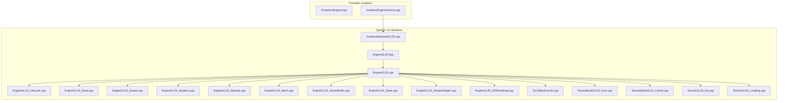
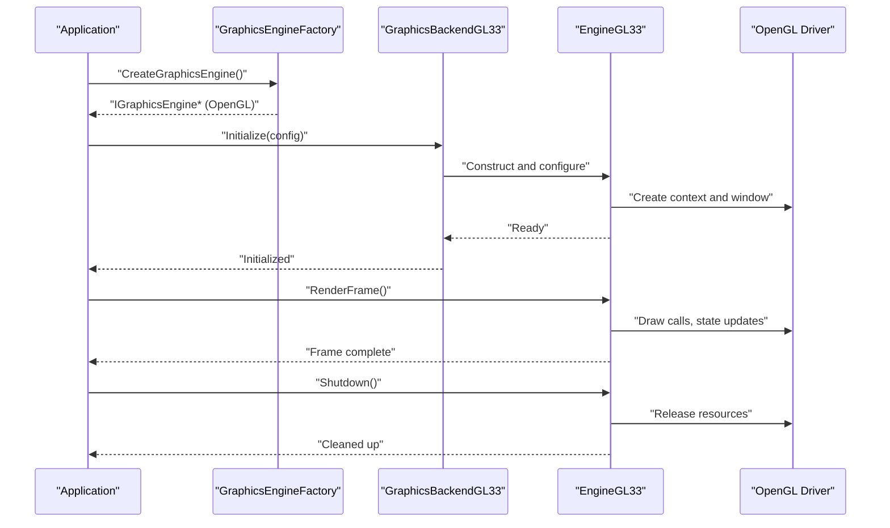
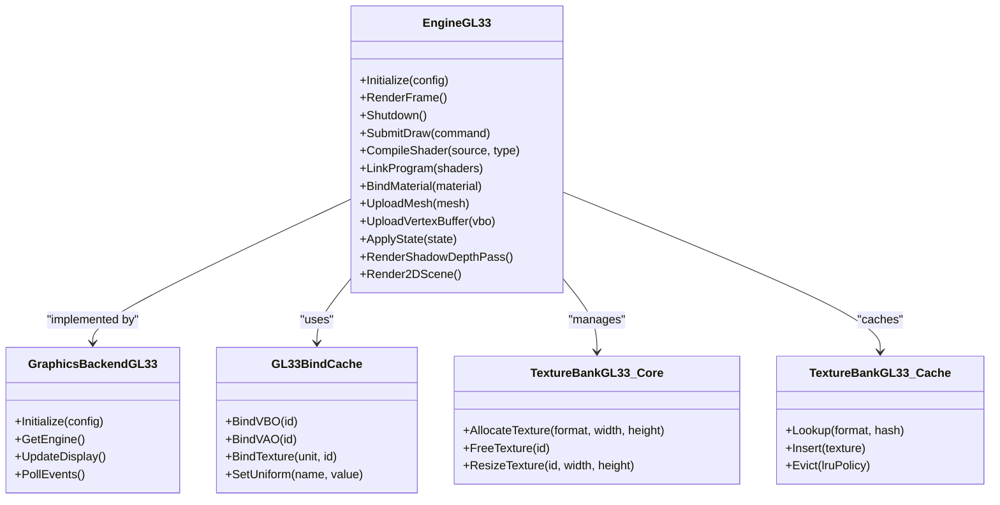
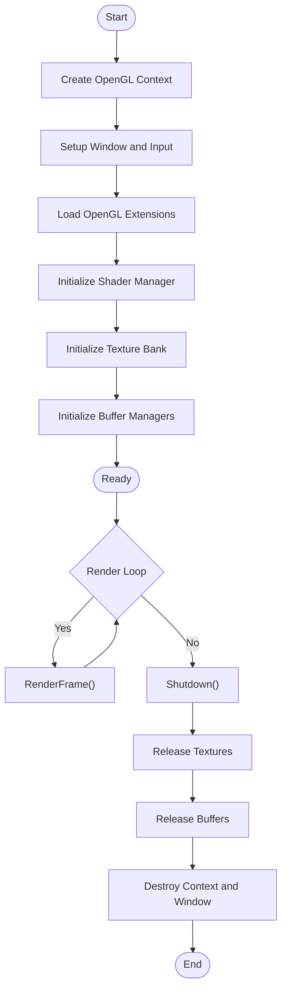
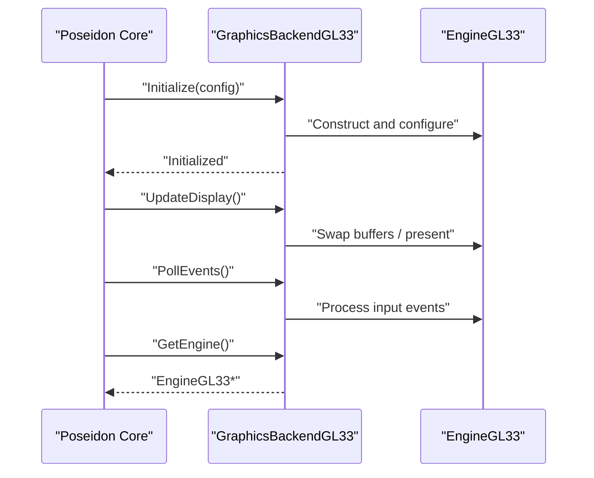
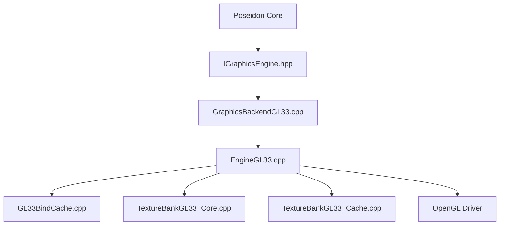

# Engine Core and Lifecycle

<cite>
**Referenced Files in This Document**
- [EngineGL33.hpp](file://engine/PoseidonGL33/EngineGL33.hpp)
- [EngineGL33.cpp](file://engine/PoseidonGL33/EngineGL33.cpp)
- [EngineGL33_Lifecycle.cpp](file://engine/PoseidonGL33/EngineGL33_Lifecycle.cpp)
- [EngineGL33_Draw.cpp](file://engine/PoseidonGL33/EngineGL33_Draw.cpp)
- [EngineGL33_2DRendering.cpp](file://engine/PoseidonGL33/EngineGL33_2DRendering.cpp)
- [EngineGL33_Material.cpp](file://engine/PoseidonGL33/EngineGL33_Material.cpp)
- [EngineGL33_Mesh.cpp](file://engine/PoseidonGL33/EngineGL33_Mesh.cpp)
- [EngineGL33_Queue.cpp](file://engine/PoseidonGL33/EngineGL33_Queue.cpp)
- [EngineGL33_Shaders.cpp](file://engine/PoseidonGL33/EngineGL33_Shaders.cpp)
- [EngineGL33_ShadowDepth.cpp](file://engine/PoseidonGL33/EngineGL33_ShadowDepth.cpp)
- [EngineGL33_State.cpp](file://engine/PoseidonGL33/EngineGL33_State.cpp)
- [EngineGL33_VertexBuffer.cpp](file://engine/PoseidonGL33/EngineGL33_VertexBuffer.cpp)
- [GraphicsBackendGL33.cpp](file://engine/PoseidonGL33/GraphicsBackendGL33.cpp)
- [GL33BindCache.cpp](file://engine/PoseidonGL33/GL33BindCache.cpp)
- [TextureBankGL33_Core.cpp](file://engine/PoseidonGL33/TextureBankGL33_Core.cpp)
- [TextureBankGL33_Cache.cpp](file://engine/PoseidonGL33/TextureBankGL33_Cache.cpp)
- [TextureGL33_Init.cpp](file://engine/PoseidonGL33/TextureGL33_Init.cpp)
- [TextureGL33_Loading.cpp](file://engine/PoseidonGL33/TextureGL33_Loading.cpp)
- [IGraphicsEngine.hpp](file://engine/Poseidon/Graphics/IGraphicsEngine.hpp)
- [GraphicsEngineFactory.cpp](file://engine/Poseidon/Graphics/GraphicsEngineFactory.cpp)
</cite>

## Table of Contents
1. [Introduction](#introduction)
2. [Project Structure](#project-structure)
3. [Core Components](#core-components)
4. [Architecture Overview](#architecture-overview)
5. [Detailed Component Analysis](#detailed-component-analysis)
6. [Dependency Analysis](#dependency-analysis)
7. [Performance Considerations](#performance-considerations)
8. [Troubleshooting Guide](#troubleshooting-guide)
9. [Conclusion](#conclusion)

## Introduction
This document explains the OpenGL 3.3 engine core implementation for the Poseidon engine framework. It focuses on the EngineGL33 class architecture, initialization sequence, lifecycle management, and how the GraphicsBackendGL33 interface integrates with the broader engine. It also covers OpenGL context creation, window management, platform-specific setup procedures, configuration options, error handling strategies, debugging capabilities, resource management patterns, cleanup procedures, performance considerations, and best practices for OpenGL backend development.

## Project Structure
The OpenGL 3.3 backend is implemented under the PoseidonGL33 module. The key files include:
- EngineGL33 header and implementation split across multiple source files by responsibility (lifecycle, drawing, materials, meshes, queues, shaders, state, vertex buffers).
- GraphicsBackendGL33 integration with the Poseidon graphics subsystem.
- GL33BindCache for minimizing OpenGL state changes.
- Texture-related modules for texture bank and texture loading.

**Diagram sources**
- [IGraphicsEngine.hpp](file://engine/Poseidon/Graphics/IGraphicsEngine.hpp)
- [GraphicsEngineFactory.cpp](file://engine/Poseidon/Graphics/GraphicsEngineFactory.cpp)
- [EngineGL33.hpp](file://engine/PoseidonGL33/EngineGL33.hpp)
- [EngineGL33.cpp](file://engine/PoseidonGL33/EngineGL33.cpp)
- [EngineGL33_Lifecycle.cpp](file://engine/PoseidonGL33/EngineGL33_Lifecycle.cpp)
- [EngineGL33_Draw.cpp](file://engine/PoseidonGL33/EngineGL33_Draw.cpp)
- [EngineGL33_Queue.cpp](file://engine/PoseidonGL33/EngineGL33_Queue.cpp)
- [EngineGL33_Shaders.cpp](file://engine/PoseidonGL33/EngineGL33_Shaders.cpp)
- [EngineGL33_Material.cpp](file://engine/PoseidonGL33/EngineGL33_Material.cpp)
- [EngineGL33_Mesh.cpp](file://engine/PoseidonGL33/EngineGL33_Mesh.cpp)
- [EngineGL33_VertexBuffer.cpp](file://engine/PoseidonGL33/EngineGL33_VertexBuffer.cpp)
- [EngineGL33_State.cpp](file://engine/PoseidonGL33/EngineGL33_State.cpp)
- [EngineGL33_ShadowDepth.cpp](file://engine/PoseidonGL33/EngineGL33_ShadowDepth.cpp)
- [EngineGL33_2DRendering.cpp](file://engine/PoseidonGL33/EngineGL33_2DRendering.cpp)
- [GraphicsBackendGL33.cpp](file://engine/PoseidonGL33/GraphicsBackendGL33.cpp)
- [GL33BindCache.cpp](file://engine/PoseidonGL33/GL33BindCache.cpp)
- [TextureBankGL33_Core.cpp](file://engine/PoseidonGL33/TextureBankGL33_Core.cpp)
- [TextureBankGL33_Cache.cpp](file://engine/PoseidonGL33/TextureBankGL33_Cache.cpp)
- [TextureGL33_Init.cpp](file://engine/PoseidonGL33/TextureGL33_Init.cpp)
- [TextureGL33_Loading.cpp](file://engine/PoseidonGL33/TextureGL33_Loading.cpp)

**Section sources**
- [EngineGL33.hpp](file://engine/PoseidonGL33/EngineGL33.hpp)
- [EngineGL33.cpp](file://engine/PoseidonGL33/EngineGL33.cpp)
- [GraphicsBackendGL33.cpp](file://engine/PoseidonGL33/GraphicsBackendGL33.cpp)
- [IGraphicsEngine.hpp](file://engine/Poseidon/Graphics/IGraphicsEngine.hpp)
- [GraphicsEngineFactory.cpp](file://engine/Poseidon/Graphics/GraphicsEngineFactory.cpp)

## Core Components
- EngineGL33: Central OpenGL 3.3 engine implementation coordinating rendering, resources, and lifecycle. Split into focused modules for clarity and maintainability.
- GraphicsBackendGL33: Adapter implementing the Poseidon graphics backend interface to integrate with the engine’s graphics subsystem.
- GL33BindCache: Reduces redundant OpenGL state changes by caching bound objects and states.
- Texture modules: Manage texture allocation, caching, and loading pipelines specific to OpenGL 3.3.

Key responsibilities:
- Context and window management
- Shader compilation and program management
- Mesh and vertex buffer handling
- Material binding and state management
- Render queue orchestration
- Shadow depth pass coordination
- 2D rendering utilities

**Section sources**
- [EngineGL33.hpp](file://engine/PoseidonGL33/EngineGL33.hpp)
- [EngineGL33.cpp](file://engine/PoseidonGL33/EngineGL33.cpp)
- [EngineGL33_Lifecycle.cpp](file://engine/PoseidonGL33/EngineGL33_Lifecycle.cpp)
- [EngineGL33_Draw.cpp](file://engine/PoseidonGL33/EngineGL33_Draw.cpp)
- [EngineGL33_Queue.cpp](file://engine/PoseidonGL33/EngineGL33_Queue.cpp)
- [EngineGL33_Shaders.cpp](file://engine/PoseidonGL33/EngineGL33_Shaders.cpp)
- [EngineGL33_Material.cpp](file://engine/PoseidonGL33/EngineGL33_Material.cpp)
- [EngineGL33_Mesh.cpp](file://engine/PoseidonGL33/EngineGL33_Mesh.cpp)
- [EngineGL33_VertexBuffer.cpp](file://engine/PoseidonGL33/EngineGL33_VertexBuffer.cpp)
- [EngineGL33_State.cpp](file://engine/PoseidonGL33/EngineGL33_State.cpp)
- [EngineGL33_ShadowDepth.cpp](file://engine/PoseidonGL33/EngineGL33_ShadowDepth.cpp)
- [EngineGL33_2DRendering.cpp](file://engine/PoseidonGL33/EngineGL33_2DRendering.cpp)
- [GraphicsBackendGL33.cpp](file://engine/PoseidonGL33/GraphicsBackendGL33.cpp)
- [GL33BindCache.cpp](file://engine/PoseidonGL33/GL33BindCache.cpp)
- [TextureBankGL33_Core.cpp](file://engine/PoseidonGL33/TextureBankGL33_Core.cpp)
- [TextureBankGL33_Cache.cpp](file://engine/PoseidonGL33/TextureBankGL33_Cache.cpp)
- [TextureGL33_Init.cpp](file://engine/PoseidonGL33/TextureGL33_Init.cpp)
- [TextureGL33_Loading.cpp](file://engine/PoseidonGL33/TextureGL33_Loading.cpp)

## Architecture Overview
The OpenGL 3.3 backend integrates with Poseidon via a factory that creates the appropriate graphics engine instance. EngineGL33 encapsulates all OpenGL-specific operations and exposes methods required by the higher-level engine.

**Diagram sources**
- [GraphicsEngineFactory.cpp](file://engine/Poseidon/Graphics/GraphicsEngineFactory.cpp)
- [GraphicsBackendGL33.cpp](file://engine/PoseidonGL33/GraphicsBackendGL33.cpp)
- [EngineGL33.cpp](file://engine/PoseidonGL33/EngineGL33.cpp)
- [EngineGL33_Lifecycle.cpp](file://engine/PoseidonGL33/EngineGL33_Lifecycle.cpp)

## Detailed Component Analysis

### EngineGL33 Class Architecture
EngineGL33 coordinates rendering and resource management through modular components:
- Lifecycle: Context creation, window setup, initialization, shutdown.
- Drawing: High-level draw calls, render passes, and frame orchestration.
- Queue: Submission and execution of draw commands.
- Shaders: Compilation, linking, and uniform management.
- Materials: Binding and state application.
- Meshes and Vertex Buffers: Geometry handling and GPU memory management.
- State: Caching and minimizing OpenGL state changes.
- Shadow Depth: Specialized pass for shadow mapping.
- 2D Rendering: UI and overlay rendering utilities.

**Diagram sources**
- [EngineGL33.hpp](file://engine/PoseidonGL33/EngineGL33.hpp)
- [EngineGL33.cpp](file://engine/PoseidonGL33/EngineGL33.cpp)
- [GraphicsBackendGL33.cpp](file://engine/PoseidonGL33/GraphicsBackendGL33.cpp)
- [GL33BindCache.cpp](file://engine/PoseidonGL33/GL33BindCache.cpp)
- [TextureBankGL33_Core.cpp](file://engine/PoseidonGL33/TextureBankGL33_Core.cpp)
- [TextureBankGL33_Cache.cpp](file://engine/PoseidonGL33/TextureBankGL33_Cache.cpp)

**Section sources**
- [EngineGL33.hpp](file://engine/PoseidonGL33/EngineGL33.hpp)
- [EngineGL33.cpp](file://engine/PoseidonGL33/EngineGL33.cpp)
- [GraphicsBackendGL33.cpp](file://engine/PoseidonGL33/GraphicsBackendGL33.cpp)
- [GL33BindCache.cpp](file://engine/PoseidonGL33/GL33BindCache.cpp)
- [TextureBankGL33_Core.cpp](file://engine/PoseidonGL33/TextureBankGL33_Core.cpp)
- [TextureBankGL33_Cache.cpp](file://engine/PoseidonGL33/TextureBankGL33_Cache.cpp)

### Initialization Sequence and Lifecycle Management
Initialization involves creating an OpenGL context, setting up the window, compiling shaders, and preparing resource managers. Shutdown reverses these steps to release GPU and OS resources.

**Diagram sources**
- [EngineGL33_Lifecycle.cpp](file://engine/PoseidonGL33/EngineGL33_Lifecycle.cpp)
- [EngineGL33_Shaders.cpp](file://engine/PoseidonGL33/EngineGL33_Shaders.cpp)
- [TextureGL33_Init.cpp](file://engine/PoseidonGL33/TextureGL33_Init.cpp)
- [EngineGL33_VertexBuffer.cpp](file://engine/PoseidonGL33/EngineGL33_VertexBuffer.cpp)

**Section sources**
- [EngineGL33_Lifecycle.cpp](file://engine/PoseidonGL33/EngineGL33_Lifecycle.cpp)
- [EngineGL33_Shaders.cpp](file://engine/PoseidonGL33/EngineGL33_Shaders.cpp)
- [TextureGL33_Init.cpp](file://engine/PoseidonGL33/TextureGL33_Init.cpp)
- [EngineGL33_VertexBuffer.cpp](file://engine/PoseidonGL33/EngineGL33_VertexBuffer.cpp)

### GraphicsBackendGL33 Integration with Poseidon
GraphicsBackendGL33 implements the Poseidon graphics backend interface, bridging engine expectations with OpenGL 3.3 specifics. It handles display updates, event polling, and delegates heavy lifting to EngineGL33.

**Diagram sources**
- [GraphicsBackendGL33.cpp](file://engine/PoseidonGL33/GraphicsBackendGL33.cpp)
- [EngineGL33.cpp](file://engine/PoseidonGL33/EngineGL33.cpp)
- [IGraphicsEngine.hpp](file://engine/Poseidon/Graphics/IGraphicsEngine.hpp)

**Section sources**
- [GraphicsBackendGL33.cpp](file://engine/PoseidonGL33/GraphicsBackendGL33.cpp)
- [IGraphicsEngine.hpp](file://engine/Poseidon/Graphics/IGraphicsEngine.hpp)

### OpenGL Context Creation, Window Management, and Platform-Specific Setup
Context creation and window setup are handled during initialization. Platform-specific details (e.g., Windows vs. Linux) are abstracted behind the backend layer. Key steps include:
- Selecting OpenGL version and profile
- Creating a window with desired attributes
- Making the context current
- Loading function pointers for extensions

Best practices:
- Validate context creation success before proceeding
- Handle platform differences via conditional compilation or abstraction layers
- Ensure proper cleanup on failure paths

**Section sources**
- [EngineGL33_Lifecycle.cpp](file://engine/PoseidonGL33/EngineGL33_Lifecycle.cpp)
- [GraphicsBackendGL33.cpp](file://engine/PoseidonGL33/GraphicsBackendGL33.cpp)

### Configuration Options
Configuration typically includes:
- Resolution and fullscreen/windowed mode
- Anti-aliasing settings
- VSync enable/disable
- Shader debug flags
- Texture compression preferences

These options influence context creation, render target setup, and runtime behavior.

**Section sources**
- [EngineGL33.cpp](file://engine/PoseidonGL33/EngineGL33.cpp)
- [GraphicsBackendGL33.cpp](file://engine/PoseidonGL33/GraphicsBackendGL33.cpp)

### Error Handling Strategies
Common strategies include:
- Checking OpenGL error flags after critical calls
- Logging detailed error messages with context
- Graceful fallbacks for unsupported features
- Ensuring resources are released even on error paths

Debugging capabilities:
- Enable verbose logging for shader compilation/linking
- Use validation layers if available
- Integrate with external tools (e.g., RenderDoc)

**Section sources**
- [EngineGL33_Shaders.cpp](file://engine/PoseidonGL33/EngineGL33_Shaders.cpp)
- [EngineGL33_State.cpp](file://engine/PoseidonGL33/EngineGL33_State.cpp)

### Resource Management Patterns
Patterns observed:
- RAII-style resource ownership where possible
- Centralized texture bank for allocation and caching
- Explicit upload functions for meshes and vertex buffers
- Cache-driven state binding to minimize overhead

Cleanup procedures:
- Free textures and buffers in reverse order of creation
- Clear caches and bind states to safe defaults
- Destroy contexts and windows last

**Section sources**
- [TextureBankGL33_Core.cpp](file://engine/PoseidonGL33/TextureBankGL33_Core.cpp)
- [TextureBankGL33_Cache.cpp](file://engine/PoseidonGL33/TextureBankGL33_Cache.cpp)
- [EngineGL33_Mesh.cpp](file://engine/PoseidonGL33/EngineGL33_Mesh.cpp)
- [EngineGL33_VertexBuffer.cpp](file://engine/PoseidonGL33/EngineGL33_VertexBuffer.cpp)

### Examples of Engine Initialization, Resource Management, and Cleanup
Typical flow:
- Initialize backend with configuration
- Create engine instance
- Upload assets (textures, meshes, shaders)
- Enter render loop
- On exit, free resources and destroy context

Example references:
- Initialization and shutdown lifecycle
- Texture loading pipeline
- Shader compilation and linking
- Mesh and vertex buffer uploads

**Section sources**
- [EngineGL33_Lifecycle.cpp](file://engine/PoseidonGL33/EngineGL33_Lifecycle.cpp)
- [TextureGL33_Loading.cpp](file://engine/PoseidonGL33/TextureGL33_Loading.cpp)
- [EngineGL33_Shaders.cpp](file://engine/PoseidonGL33/EngineGL33_Shaders.cpp)
- [EngineGL33_Mesh.cpp](file://engine/PoseidonGL33/EngineGL33_Mesh.cpp)
- [EngineGL33_VertexBuffer.cpp](file://engine/PoseidonGL33/EngineGL33_VertexBuffer.cpp)

## Dependency Analysis
The OpenGL 3.3 backend depends on:
- Poseidon graphics interfaces for abstraction
- OpenGL driver for low-level operations
- Optional platform libraries for windowing and input

**Diagram sources**
- [IGraphicsEngine.hpp](file://engine/Poseidon/Graphics/IGraphicsEngine.hpp)
- [GraphicsBackendGL33.cpp](file://engine/PoseidonGL33/GraphicsBackendGL33.cpp)
- [EngineGL33.cpp](file://engine/PoseidonGL33/EngineGL33.cpp)
- [GL33BindCache.cpp](file://engine/PoseidonGL33/GL33BindCache.cpp)
- [TextureBankGL33_Core.cpp](file://engine/PoseidonGL33/TextureBankGL33_Core.cpp)
- [TextureBankGL33_Cache.cpp](file://engine/PoseidonGL33/TextureBankGL33_Cache.cpp)

**Section sources**
- [IGraphicsEngine.hpp](file://engine/Poseidon/Graphics/IGraphicsEngine.hpp)
- [GraphicsBackendGL33.cpp](file://engine/PoseidonGL33/GraphicsBackendGL33.cpp)
- [EngineGL33.cpp](file://engine/PoseidonGL33/EngineGL33.cpp)
- [GL33BindCache.cpp](file://engine/PoseidonGL33/GL33BindCache.cpp)
- [TextureBankGL33_Core.cpp](file://engine/PoseidonGL33/TextureBankGL33_Core.cpp)
- [TextureBankGL33_Cache.cpp](file://engine/PoseidonGL33/TextureBankGL33_Cache.cpp)

## Performance Considerations
- Minimize state changes using bind cache
- Batch draw calls via render queue
- Reuse textures and buffers where possible
- Avoid frequent shader recompilation; cache compiled programs
- Use efficient vertex formats and instancing when applicable
- Profile GPU-bound paths and reduce overdraw

[No sources needed since this section provides general guidance]

## Troubleshooting Guide
Common issues and resolutions:
- Context creation failures: Verify OpenGL version and driver support
- Shader compilation errors: Check log outputs and validate syntax
- Texture loading problems: Confirm format compatibility and file integrity
- Memory leaks: Ensure all allocated resources are freed during shutdown
- Performance regressions: Analyze bind cache effectiveness and draw call batching

Debugging tips:
- Enable verbose logging for initialization and rendering phases
- Use external profiling tools to identify bottlenecks
- Validate OpenGL state transitions and error flags

**Section sources**
- [EngineGL33_Shaders.cpp](file://engine/PoseidonGL33/EngineGL33_Shaders.cpp)
- [TextureGL33_Loading.cpp](file://engine/PoseidonGL33/TextureGL33_Loading.cpp)
- [EngineGL33_State.cpp](file://engine/PoseidonGL33/EngineGL33_State.cpp)

## Conclusion
The OpenGL 3.3 engine core implementation provides a robust foundation for rendering within the Poseidon framework. By separating concerns into focused modules, leveraging a bind cache, and adhering to clear lifecycle and resource management patterns, it achieves both maintainability and performance. Following the outlined best practices ensures reliable operation across platforms and configurations.

[No sources needed since this section summarizes without analyzing specific files]