# OpenGL 3.3 Backend

<cite>
**Referenced Files in This Document**
- [EngineGL33.hpp](file://engine/PoseidonGL33/EngineGL33.hpp)
- [EngineGL33.cpp](file://engine/PoseidonGL33/EngineGL33.cpp)
- [EngineGL33_Lifecycle.cpp](file://engine/PoseidonGL33/EngineGL33_Lifecycle.cpp)
- [EngineGL33_Shaders.cpp](file://engine/PoseidonGL33/EngineGL33_Shaders.cpp)
- [EngineGL33_State.cpp](file://engine/PoseidonGL33/EngineGL33_State.cpp)
- [EngineGL33_VertexBuffer.cpp](file://engine/PoseidonGL33/EngineGL33_VertexBuffer.cpp)
- [EngineGL33_Draw.cpp](file://engine/PoseidonGL33/EngineGL33_Draw.cpp)
- [EngineGL33_DrawShared.cpp](file://engine/PoseidonGL33/EngineGL33_DrawShared.cpp)
- [EngineGL33_Material.cpp](file://engine/PoseidonGL33/EngineGL33_Material.cpp)
- [EngineGL33_Queue.cpp](file://engine/PoseidonGL33/EngineGL33_Queue.cpp)
- [EngineGL33_2D.cpp](file://engine/PoseidonGL33/EngineGL33_2D.cpp)
- [EngineGL33_2DRendering.cpp](file://engine/PoseidonGL33/EngineGL33_2DRendering.cpp)
- [EngineGL33_ShadowDepth.cpp](file://engine/PoseidonGL33/EngineGL33_ShadowDepth.cpp)
- [GL33BindCache.cpp](file://engine/PoseidonGL33/GL33BindCache.cpp)
- [GL33BindCache.hpp](file://engine/PoseidonGL33/GL33BindCache.hpp)
- [TextureBankGL33_Core.cpp](file://engine/PoseidonGL33/TextureBankGL33_Core.cpp)
- [TextureBankGL33_Cache.cpp](file://engine/PoseidonGL33/TextureBankGL33_Cache.cpp)
- [TextureGL33_Init.cpp](file://engine/PoseidonGL33/TextureGL33_Init.cpp)
- [TextureGL33_Loading.cpp](file://engine/PoseidonGL33/TextureGL33_Loading.cpp)
- [GraphicsBackendGL33.cpp](file://engine/PoseidonGL33/GraphicsBackendGL33.cpp)
- [CMakeLists.txt](file://engine/PoseidonGL33/CMakeLists.txt)
- [glad.h](file://thirdparty/glad/include/glad/glad.h)
- [renderdoc_app.h](file://thirdparty/renderdoc/renderdoc_app.h)
</cite>

## Table of Contents
1. [Introduction](#introduction)
2. [Project Structure](#project-structure)
3. [Core Components](#core-components)
4. [Architecture Overview](#architecture-overview)
5. [Detailed Component Analysis](#detailed-component-analysis)
6. [Dependency Analysis](#dependency-analysis)
7. [Performance Considerations](#performance-considerations)
8. [Troubleshooting Guide](#troubleshooting-guide)
9. [Conclusion](#conclusion)
10. [Appendices](#appendices)

## Introduction
This document provides a comprehensive guide to the OpenGL 3.3 backend implementation, focusing on the EngineGL33 class architecture, OpenGL context management, state caching, shader compilation pipeline, texture loading and management, vertex buffer optimization, draw call batching, render state management, and OpenGL extension handling. It also covers integration with third-party libraries such as GLAD for function loading and RenderDoc for debugging, along with best practices, performance tuning, and platform-specific considerations for Windows and Linux.

## Project Structure
The OpenGL 3.3 backend is implemented under engine/PoseidonGL33. The key files include:
- Core engine entry points and lifecycle management
- Shader compilation and management
- State caching and bind cache utilities
- Vertex buffer and mesh handling
- Draw call batching and shared drawing logic
- Material system integration
- Queue-based rendering orchestration
- 2D rendering support
- Shadow depth rendering
- Texture bank and per-texture implementations
- Graphics backend registration
- Third-party integrations (GLAD, RenderDoc)

```mermaid
graph TB
subgraph "PoseidonGL33"
A["EngineGL33.hpp<br/>EngineGL33.cpp"]
B["Lifecycle<br/>EngineGL33_Lifecycle.cpp"]
C["Shaders<br/>EngineGL33_Shaders.cpp"]
D["State Cache<br/>EngineGL33_State.cpp<br/>GL33BindCache.*"]
E["Vertex Buffers<br/>EngineGL33_VertexBuffer.cpp"]
F["Draw Pipeline<br/>EngineGL33_Draw.cpp<br/>EngineGL33_DrawShared.cpp"]
G["Material System<br/>EngineGL33_Material.cpp"]
H["Render Queue<br/>EngineGL33_Queue.cpp"]
I["2D Rendering<br/>EngineGL33_2D.cpp<br/>EngineGL33_2DRendering.cpp"]
J["Shadow Depth<br/>EngineGL33_ShadowDepth.cpp"]
K["Textures<br/>TextureBankGL33_*<br/>TextureGL33_*"]
L["Backend Registration<br/>GraphicsBackendGL33.cpp"]
end
M["Third Party<br/>glad.h<br/>renderdoc_app.h"]
A --> B
A --> C
A --> D
A --> E
A --> F
A --> G
A --> H
A --> I
A --> J
A --> K
A --> L
A --> M
```

**Diagram sources**
- [EngineGL33.hpp](file://engine/PoseidonGL33/EngineGL33.hpp)
- [EngineGL33.cpp](file://engine/PoseidonGL33/EngineGL33.cpp)
- [EngineGL33_Lifecycle.cpp](file://engine/PoseidonGL33/EngineGL33_Lifecycle.cpp)
- [EngineGL33_Shaders.cpp](file://engine/PoseidonGL33/EngineGL33_Shaders.cpp)
- [EngineGL33_State.cpp](file://engine/PoseidonGL33/EngineGL33_State.cpp)
- [GL33BindCache.hpp](file://engine/PoseidonGL33/GL33BindCache.hpp)
- [EngineGL33_VertexBuffer.cpp](file://engine/PoseidonGL33/EngineGL33_VertexBuffer.cpp)
- [EngineGL33_Draw.cpp](file://engine/PoseidonGL33/EngineGL33_Draw.cpp)
- [EngineGL33_DrawShared.cpp](file://engine/PoseidonGL33/EngineGL33_DrawShared.cpp)
- [EngineGL33_Material.cpp](file://engine/PoseidonGL33/EngineGL33_Material.cpp)
- [EngineGL33_Queue.cpp](file://engine/PoseidonGL33/EngineGL33_Queue.cpp)
- [EngineGL33_2D.cpp](file://engine/PoseidonGL33/EngineGL33_2D.cpp)
- [EngineGL33_2DRendering.cpp](file://engine/PoseidonGL33/EngineGL33_2DRendering.cpp)
- [EngineGL33_ShadowDepth.cpp](file://engine/PoseidonGL33/EngineGL33_ShadowDepth.cpp)
- [TextureBankGL33_Core.cpp](file://engine/PoseidonGL33/TextureBankGL33_Core.cpp)
- [TextureBankGL33_Cache.cpp](file://engine/PoseidonGL33/TextureBankGL33_Cache.cpp)
- [TextureGL33_Init.cpp](file://engine/PoseidonGL33/TextureGL33_Init.cpp)
- [TextureGL33_Loading.cpp](file://engine/PoseidonGL33/TextureGL33_Loading.cpp)
- [GraphicsBackendGL33.cpp](file://engine/PoseidonGL33/GraphicsBackendGL33.cpp)
- [glad.h](file://thirdparty/glad/include/glad/glad.h)
- [renderdoc_app.h](file://thirdparty/renderdoc/renderdoc_app.h)

**Section sources**
- [EngineGL33.hpp](file://engine/PoseidonGL33/EngineGL33.hpp)
- [EngineGL33.cpp](file://engine/PoseidonGL33/EngineGL33.cpp)
- [CMakeLists.txt](file://engine/PoseidonGL33/CMakeLists.txt)

## Core Components
- EngineGL33: Central orchestrator for OpenGL 3.3 rendering, managing lifecycle, shaders, textures, buffers, and draw pipelines.
- Lifecycle Manager: Initializes and destroys the OpenGL context, handles windowing integration, and sets up extensions via GLAD.
- Shader Compiler: Compiles and links GLSL shaders, manages uniform updates, and tracks shader program states.
- State Cache and Bind Cache: Minimizes redundant OpenGL state changes by caching current bindings and states.
- Vertex Buffer Manager: Optimizes VBO/VAO usage, supports dynamic and static buffers, and reduces driver overhead.
- Draw Pipeline: Implements batching strategies, state transitions, and efficient draw calls.
- Material System: Bridges high-level material definitions to GPU resources and shader parameters.
- Render Queue: Orders draw commands to minimize state changes and maximize batching efficiency.
- 2D Renderer: Provides optimized paths for UI and overlay rendering.
- Shadow Depth Pass: Handles shadow map generation and depth-only rendering.
- Texture Bank: Manages texture creation, caching, and memory layout optimizations.

**Section sources**
- [EngineGL33.hpp](file://engine/PoseidonGL33/EngineGL33.hpp)
- [EngineGL33.cpp](file://engine/PoseidonGL33/EngineGL33.cpp)
- [EngineGL33_Lifecycle.cpp](file://engine/PoseidonGL33/EngineGL33_Lifecycle.cpp)
- [EngineGL33_Shaders.cpp](file://engine/PoseidonGL33/EngineGL33_Shaders.cpp)
- [EngineGL33_State.cpp](file://engine/PoseidonGL33/EngineGL33_State.cpp)
- [GL33BindCache.hpp](file://engine/PoseidonGL33/GL33BindCache.hpp)
- [EngineGL33_VertexBuffer.cpp](file://engine/PoseidonGL33/EngineGL33_VertexBuffer.cpp)
- [EngineGL33_Draw.cpp](file://engine/PoseidonGL33/EngineGL33_Draw.cpp)
- [EngineGL33_Material.cpp](file://engine/PoseidonGL33/EngineGL33_Material.cpp)
- [EngineGL33_Queue.cpp](file://engine/PoseidonGL33/EngineGL33_Queue.cpp)
- [EngineGL33_2D.cpp](file://engine/PoseidonGL33/EngineGL33_2D.cpp)
- [EngineGL33_ShadowDepth.cpp](file://engine/PoseidonGL33/EngineGL33_ShadowDepth.cpp)
- [TextureBankGL33_Core.cpp](file://engine/PoseidonGL33/TextureBankGL33_Core.cpp)
- [TextureGL33_Init.cpp](file://engine/PoseidonGL33/TextureGL33_Init.cpp)

## Architecture Overview
The OpenGL 3.3 backend follows a layered architecture:
- Application Layer: Game code interacts with EngineGL33 through high-level APIs.
- Engine Layer: EngineGL33 coordinates subsystems like shaders, textures, buffers, and queues.
- Driver Layer: OpenGL calls are made via GLAD-loaded functions, with state minimized through caches.

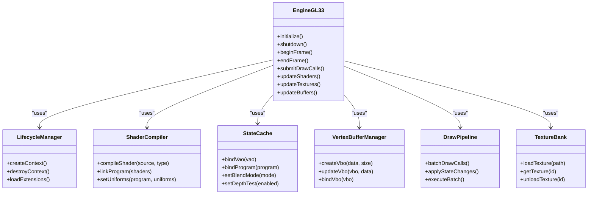

**Diagram sources**
- [EngineGL33.hpp](file://engine/PoseidonGL33/EngineGL33.hpp)
- [EngineGL33.cpp](file://engine/PoseidonGL33/EngineGL33.cpp)
- [EngineGL33_Lifecycle.cpp](file://engine/PoseidonGL33/EngineGL33_Lifecycle.cpp)
- [EngineGL33_Shaders.cpp](file://engine/PoseidonGL33/EngineGL33_Shaders.cpp)
- [EngineGL33_State.cpp](file://engine/PoseidonGL33/EngineGL33_State.cpp)
- [EngineGL33_VertexBuffer.cpp](file://engine/PoseidonGL33/EngineGL33_VertexBuffer.cpp)
- [EngineGL33_Draw.cpp](file://engine/PoseidonGL33/EngineGL33_Draw.cpp)
- [TextureBankGL33_Core.cpp](file://engine/PoseidonGL33/TextureBankGL33_Core.cpp)

## Detailed Component Analysis

### EngineGL33 Class Architecture
EngineGL33 serves as the central controller for the OpenGL 3.3 backend. It integrates lifecycle management, shader compilation, texture handling, vertex buffer optimization, and draw call batching. The class exposes methods for frame initialization, resource updates, and submission of draw commands.

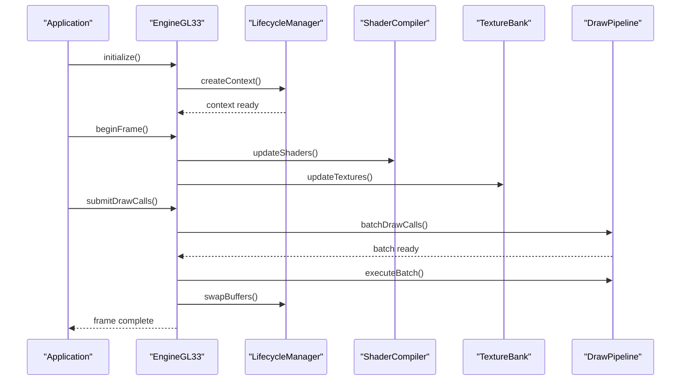

**Diagram sources**
- [EngineGL33.hpp](file://engine/PoseidonGL33/EngineGL33.hpp)
- [EngineGL33.cpp](file://engine/PoseidonGL33/EngineGL33.cpp)
- [EngineGL33_Lifecycle.cpp](file://engine/PoseidonGL33/EngineGL33_Lifecycle.cpp)
- [EngineGL33_Shaders.cpp](file://engine/PoseidonGL33/EngineGL33_Shaders.cpp)
- [TextureBankGL33_Core.cpp](file://engine/PoseidonGL33/TextureBankGL33_Core.cpp)
- [EngineGL33_Draw.cpp](file://engine/PoseidonGL33/EngineGL33_Draw.cpp)

**Section sources**
- [EngineGL33.hpp](file://engine/PoseidonGL33/EngineGL33.hpp)
- [EngineGL33.cpp](file://engine/PoseidonGL33/EngineGL33.cpp)

### OpenGL Context Management
The lifecycle module handles OpenGL context creation, destruction, and extension loading via GLAD. It ensures proper initialization of the graphics pipeline and error checking during setup.

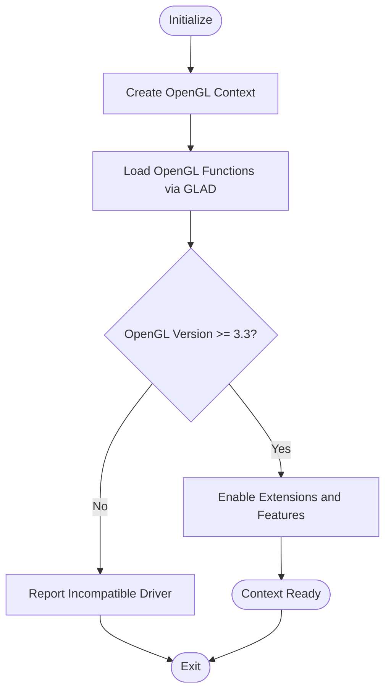

**Diagram sources**
- [EngineGL33_Lifecycle.cpp](file://engine/PoseidonGL33/EngineGL33_Lifecycle.cpp)
- [glad.h](file://thirdparty/glad/include/glad/glad.h)

**Section sources**
- [EngineGL33_Lifecycle.cpp](file://engine/PoseidonGL33/EngineGL33_Lifecycle.cpp)
- [glad.h](file://thirdparty/glad/include/glad/glad.h)

### State Caching Mechanisms
State caching minimizes redundant OpenGL calls by tracking current states and only applying changes when necessary. The bind cache manages VAO, program, and texture bindings.

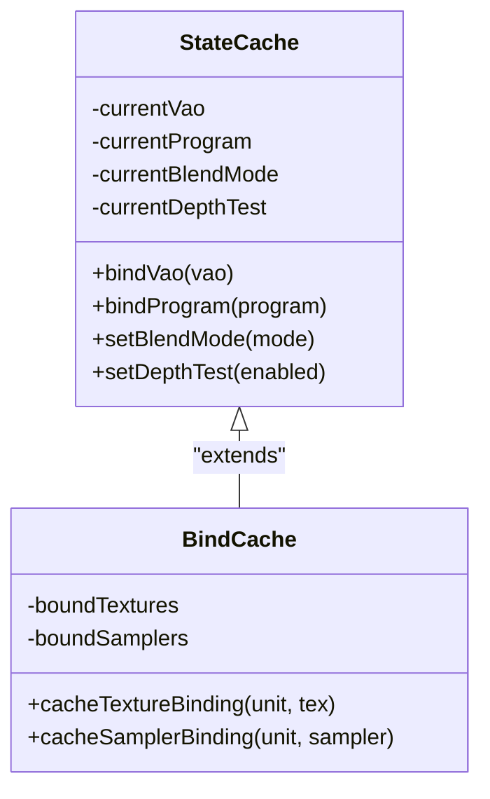

**Diagram sources**
- [EngineGL33_State.cpp](file://engine/PoseidonGL33/EngineGL33_State.cpp)
- [GL33BindCache.hpp](file://engine/PoseidonGL33/GL33BindCache.hpp)
- [GL33BindCache.cpp](file://engine/PoseidonGL33/GL33BindCache.cpp)

**Section sources**
- [EngineGL33_State.cpp](file://engine/PoseidonGL33/EngineGL33_State.cpp)
- [GL33BindCache.hpp](file://engine/PoseidonGL33/GL33BindCache.hpp)
- [GL33BindCache.cpp](file://engine/PoseidonGL33/GL33BindCache.cpp)

### Shader Compilation Pipeline
The shader compiler handles GLSL source compilation, linking, and uniform updates. It validates shader sources and logs errors for debugging.

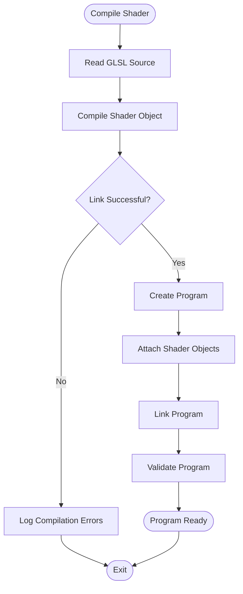

**Diagram sources**
- [EngineGL33_Shaders.cpp](file://engine/PoseidonGL33/EngineGL33_Shaders.cpp)

**Section sources**
- [EngineGL33_Shaders.cpp](file://engine/PoseidonGL33/EngineGL33_Shaders.cpp)

### Texture Loading and Management
The texture bank manages texture creation, caching, and memory optimization. It supports various formats and mipmapping.

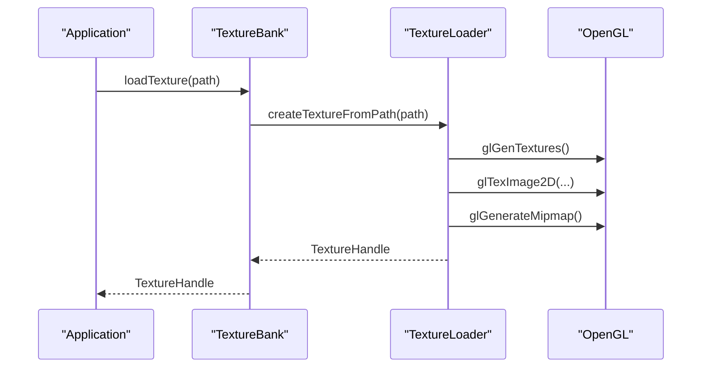

**Diagram sources**
- [TextureBankGL33_Core.cpp](file://engine/PoseidonGL33/TextureBankGL33_Core.cpp)
- [TextureGL33_Init.cpp](file://engine/PoseidonGL33/TextureGL33_Init.cpp)
- [TextureGL33_Loading.cpp](file://engine/PoseidonGL33/TextureGL33_Loading.cpp)

**Section sources**
- [TextureBankGL33_Core.cpp](file://engine/PoseidonGL33/TextureBankGL33_Core.cpp)
- [TextureGL33_Init.cpp](file://engine/PoseidonGL33/TextureGL33_Init.cpp)
- [TextureGL33_Loading.cpp](file://engine/PoseidonGL33/TextureGL33_Loading.cpp)

### Vertex Buffer Optimization Strategies
Vertex buffers are optimized for minimal driver overhead through VBO reuse, dynamic updates, and efficient data layouts.

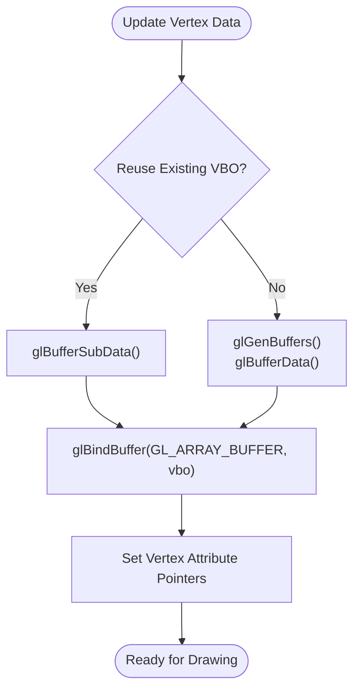

**Diagram sources**
- [EngineGL33_VertexBuffer.cpp](file://engine/PoseidonGL33/EngineGL33_VertexBuffer.cpp)

**Section sources**
- [EngineGL33_VertexBuffer.cpp](file://engine/PoseidonGL33/EngineGL33_VertexBuffer.cpp)

### Draw Call Batching and Render State Management
The draw pipeline batches draw calls to reduce state changes and improve GPU throughput. It applies cached states and executes batches efficiently.

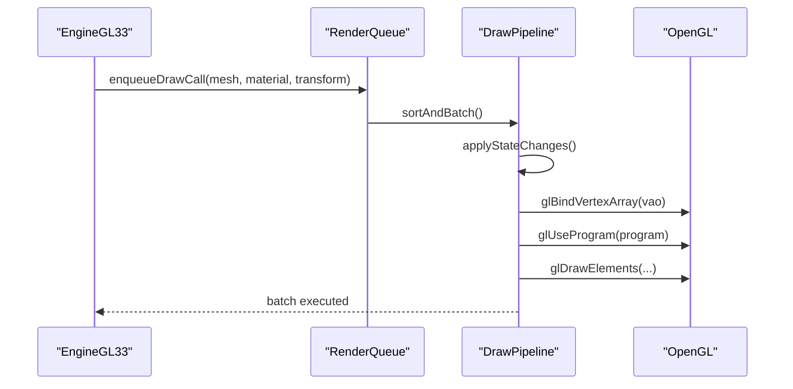

**Diagram sources**
- [EngineGL33_Draw.cpp](file://engine/PoseidonGL33/EngineGL33_Draw.cpp)
- [EngineGL33_DrawShared.cpp](file://engine/PoseidonGL33/EngineGL33_DrawShared.cpp)
- [EngineGL33_Queue.cpp](file://engine/PoseidonGL33/EngineGL33_Queue.cpp)

**Section sources**
- [EngineGL33_Draw.cpp](file://engine/PoseidonGL33/EngineGL33_Draw.cpp)
- [EngineGL33_DrawShared.cpp](file://engine/PoseidonGL33/EngineGL33_DrawShared.cpp)
- [EngineGL33_Queue.cpp](file://engine/PoseidonGL33/EngineGL33_Queue.cpp)

### OpenGL Extension Handling
Extensions are loaded via GLAD and checked for availability before use. The backend gracefully falls back or disables features if extensions are unsupported.

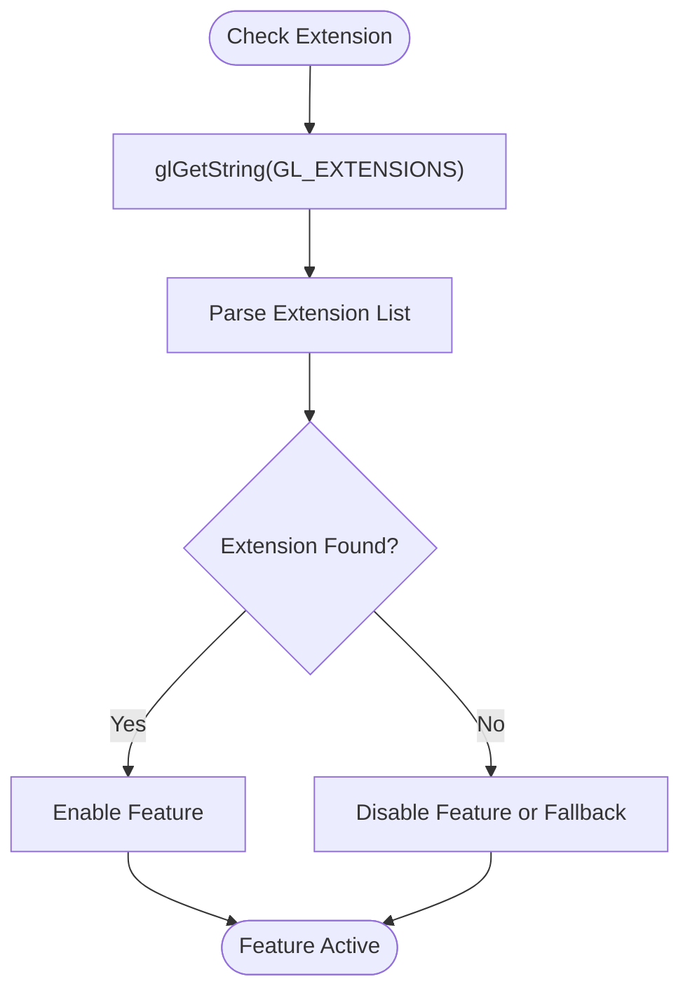

**Diagram sources**
- [EngineGL33_Lifecycle.cpp](file://engine/PoseidonGL33/EngineGL33_Lifecycle.cpp)
- [glad.h](file://thirdparty/glad/include/glad/glad.h)

**Section sources**
- [EngineGL33_Lifecycle.cpp](file://engine/PoseidonGL33/EngineGL33_Lifecycle.cpp)
- [glad.h](file://thirdparty/glad/include/glad/glad.h)

### Integration with Third-Party Libraries
- GLAD: Used for loading OpenGL function pointers dynamically.
- RenderDoc: Integrated for debugging and profiling OpenGL calls.

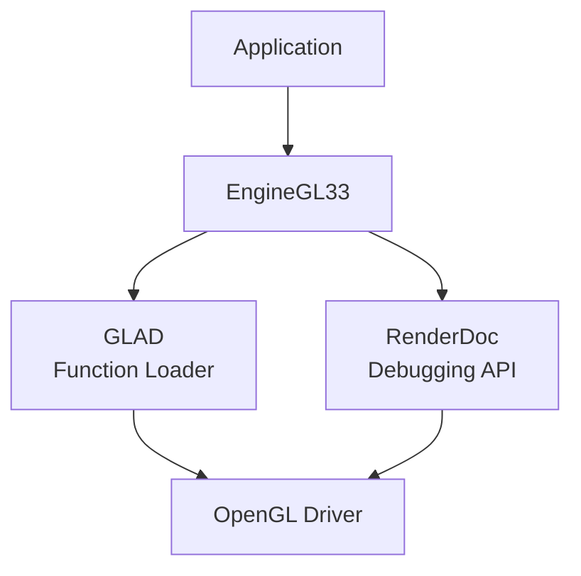

**Diagram sources**
- [glad.h](file://thirdparty/glad/include/glad/glad.h)
- [renderdoc_app.h](file://thirdparty/renderdoc/renderdoc_app.h)

**Section sources**
- [glad.h](file://thirdparty/glad/include/glad/glad.h)
- [renderdoc_app.h](file://thirdparty/renderdoc/renderdoc_app.h)

## Dependency Analysis
The OpenGL 3.3 backend has clear dependencies on core engine modules and third-party libraries.

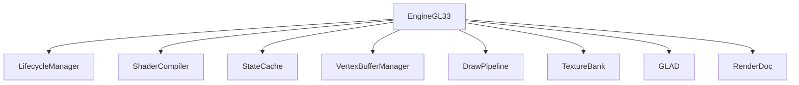

**Diagram sources**
- [EngineGL33.hpp](file://engine/PoseidonGL33/EngineGL33.hpp)
- [EngineGL33.cpp](file://engine/PoseidonGL33/EngineGL33.cpp)
- [glad.h](file://thirdparty/glad/include/glad/glad.h)
- [renderdoc_app.h](file://thirdparty/renderdoc/renderdoc_app.h)

**Section sources**
- [EngineGL33.hpp](file://engine/PoseidonGL33/EngineGL33.hpp)
- [EngineGL33.cpp](file://engine/PoseidonGL33/EngineGL33.cpp)

## Performance Considerations
- Minimize state changes by using state caching and batching.
- Reuse vertex buffers and textures to reduce memory allocations.
- Use instanced rendering for repeated geometry.
- Optimize shader programs by minimizing uniform updates and branching.
- Profile with RenderDoc to identify bottlenecks.

[No sources needed since this section provides general guidance]

## Troubleshooting Guide
Common issues and solutions:
- OpenGL context creation failures: Verify driver version and extensions.
- Shader compilation errors: Check GLSL syntax and log messages.
- Texture loading failures: Ensure file paths and formats are correct.
- Performance drops: Analyze draw call counts and state changes.

**Section sources**
- [EngineGL33_Lifecycle.cpp](file://engine/PoseidonGL33/EngineGL33_Lifecycle.cpp)
- [EngineGL33_Shaders.cpp](file://engine/PoseidonGL33/EngineGL33_Shaders.cpp)
- [TextureGL33_Loading.cpp](file://engine/PoseidonGL33/TextureGL33_Loading.cpp)

## Conclusion
The OpenGL 3.3 backend provides a robust and efficient rendering pipeline with careful attention to state management, resource optimization, and extensibility. By following best practices and leveraging tools like GLAD and RenderDoc, developers can achieve high performance and reliable cross-platform graphics.

[No sources needed since this section summarizes without analyzing specific files]

## Appendices
- Platform-Specific Considerations:
  - Windows: Use WGL for context creation and ensure DirectX drivers are updated.
  - Linux: Use GLX or EGL depending on the windowing system.
- Best Practices:
  - Always check OpenGL errors after critical calls.
  - Use debug contexts in development for early error detection.
  - Profile regularly to maintain performance.

[No sources needed since this section provides general guidance]