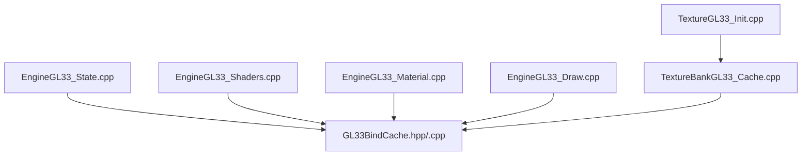
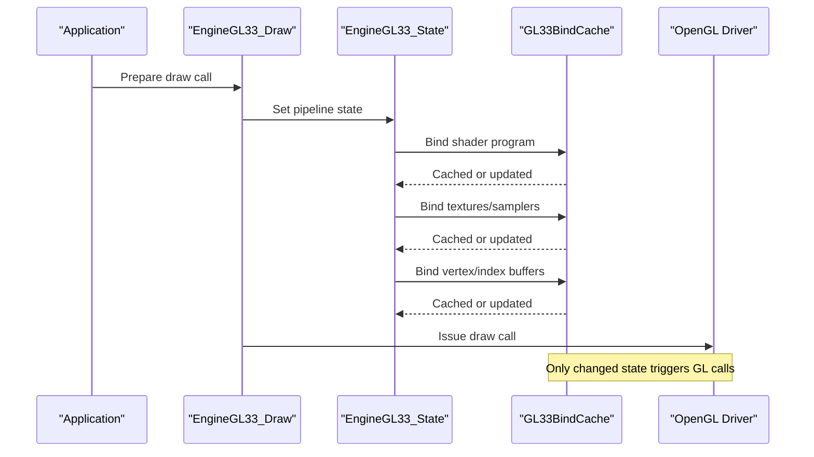
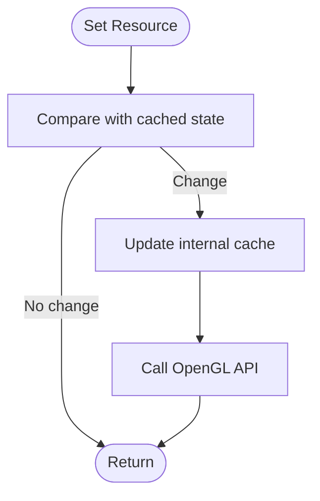
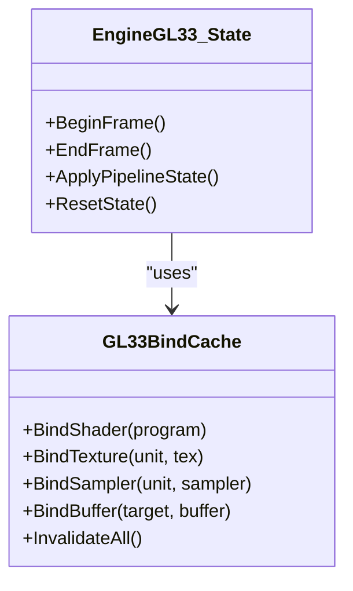
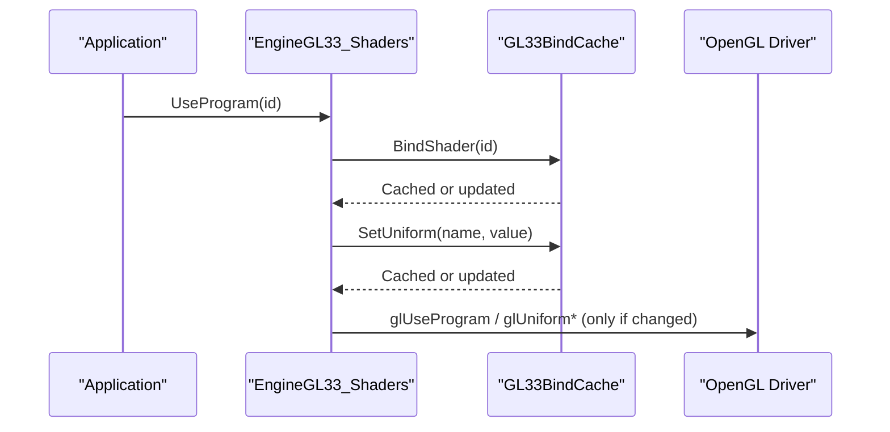
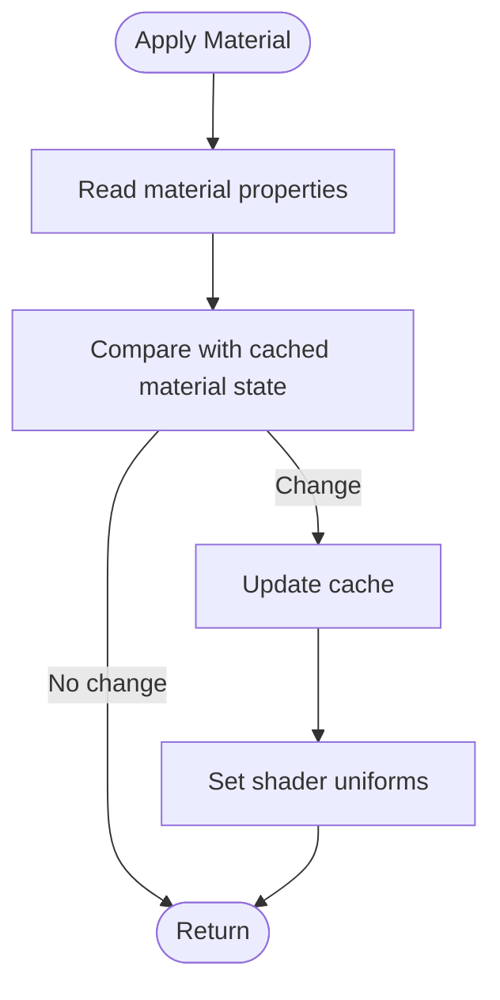
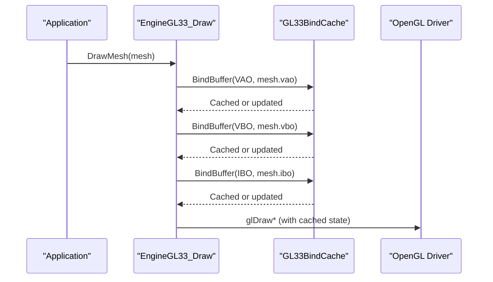
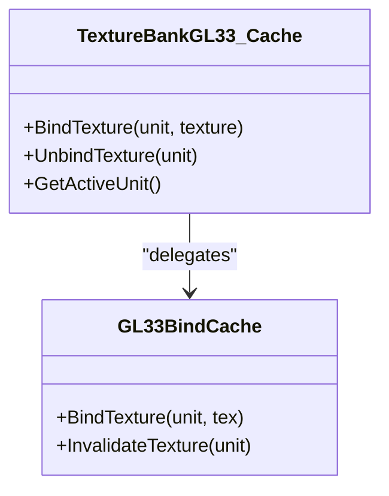
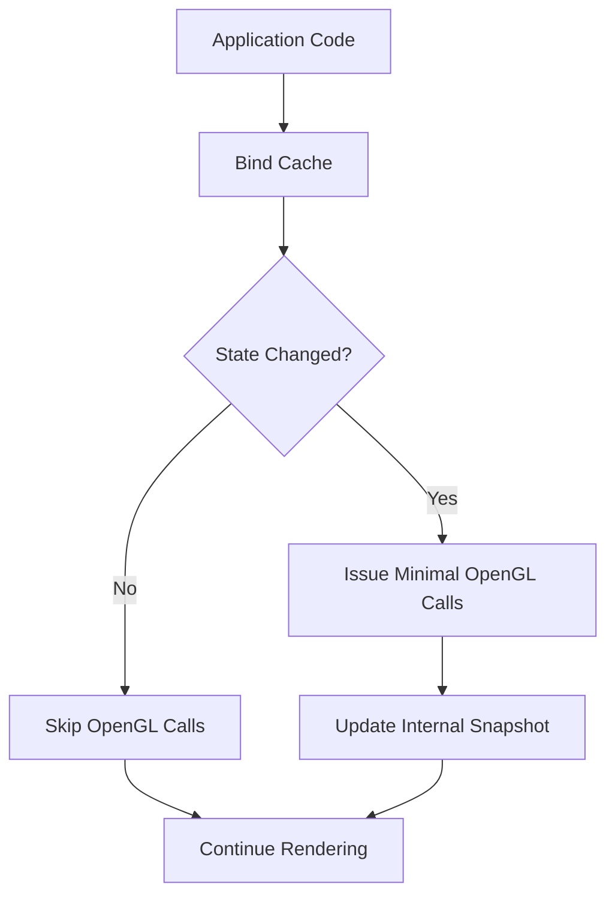
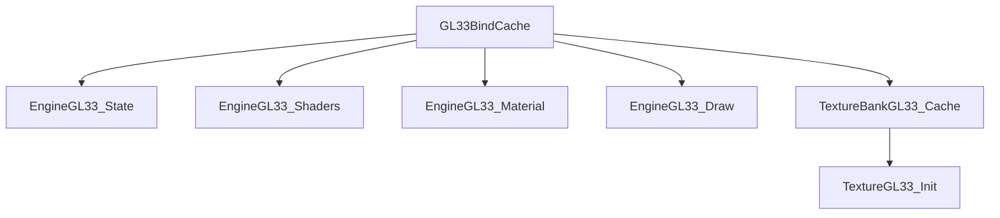

# OpenGL State and Bind Caching

<cite>
**Referenced Files in This Document**
- [GL33BindCache.hpp](file://engine/PoseidonGL33/GL33BindCache.hpp)
- [GL33BindCache.cpp](file://engine/PoseidonGL33/GL33BindCache.cpp)
- [EngineGL33_State.cpp](file://engine/PoseidonGL33/EngineGL33_State.cpp)
- [EngineGL33_Shaders.cpp](file://engine/PoseidonGL33/EngineGL33_Shaders.cpp)
- [EngineGL33_Material.cpp](file://engine/PoseidonGL33/EngineGL33_Material.cpp)
- [EngineGL33_Draw.cpp](file://engine/PoseidonGL33/EngineGL33_Draw.cpp)
- [TextureBankGL33_Cache.cpp](file://engine/PoseidonGL33/TextureBankGL33_Cache.cpp)
- [TextureGL33_Init.cpp](file://engine/PoseidonGL33/TextureGL33_Init.cpp)
</cite>

## Table of Contents
1. [Introduction](#introduction)
2. [Project Structure](#project-structure)
3. [Core Components](#core-components)
4. [Architecture Overview](#architecture-overview)
5. [Detailed Component Analysis](#detailed-component-analysis)
6. [Dependency Analysis](#dependency-analysis)
7. [Performance Considerations](#performance-considerations)
8. [Troubleshooting Guide](#troubleshooting-guide)
9. [Conclusion](#conclusion)
10. [Appendices](#appendices)

## Introduction
This document explains the OpenGL state management and bind caching system used by the GL33 backend. It focuses on how the GL33BindCache tracks and synchronizes GPU state to minimize redundant OpenGL calls, how different resource types (textures, buffers, shaders, samplers) are managed, and how invalidation and thread safety considerations apply. It also provides guidance for extending the cache with custom state and debugging state changes effectively.

## Project Structure
The GL33 implementation is located under engine/PoseidonGL33. The bind cache and state synchronization span several files:
- GL33BindCache: core state tracking and automatic synchronization
- EngineGL33_State: high-level state orchestration and transitions
- EngineGL33_Shaders: shader program binding and uniform updates
- EngineGL33_Material: material property application
- EngineGL33_Draw: draw call preparation and state setup
- TextureBankGL33_Cache: texture bind cache integration
- TextureGL33_Init: texture creation and initial state setup

**Diagram sources**
- [EngineGL33_State.cpp](file://engine/PoseidonGL33/EngineGL33_State.cpp)
- [GL33BindCache.hpp](file://engine/PoseidonGL33/GL33BindCache.hpp)
- [GL33BindCache.cpp](file://engine/PoseidonGL33/GL33BindCache.cpp)
- [EngineGL33_Shaders.cpp](file://engine/PoseidonGL33/EngineGL33_Shaders.cpp)
- [EngineGL33_Material.cpp](file://engine/PoseidonGL33/EngineGL33_Material.cpp)
- [EngineGL33_Draw.cpp](file://engine/PoseidonGL33/EngineGL33_Draw.cpp)
- [TextureBankGL33_Cache.cpp](file://engine/PoseidonGL33/TextureBankGL33_Cache.cpp)
- [TextureGL33_Init.cpp](file://engine/PoseidonGL33/TextureGL33_Init.cpp)

**Section sources**
- [GL33BindCache.hpp](file://engine/PoseidonGL33/GL33BindCache.hpp)
- [GL33BindCache.cpp](file://engine/PoseidonGL33/GL33BindCache.cpp)
- [EngineGL33_State.cpp](file://engine/PoseidonGL33/EngineGL33_State.cpp)
- [EngineGL33_Shaders.cpp](file://engine/PoseidonGL33/EngineGL33_Shaders.cpp)
- [EngineGL33_Material.cpp](file://engine/PoseidonGL33/EngineGL33_Material.cpp)
- [EngineGL33_Draw.cpp](file://engine/PoseidonGL33/EngineGL33_Draw.cpp)
- [TextureBankGL33_Cache.cpp](file://engine/PoseidonGL33/TextureBankGL33_Cache.cpp)
- [TextureGL33_Init.cpp](file://engine/PoseidonGL33/TextureGL33_Init.cpp)

## Core Components
- GL33BindCache: central state tracker that records current bindings and settings per context, providing methods to set resources and automatically issuing only necessary OpenGL commands.
- EngineGL33_State: orchestrates higher-level state transitions, delegates to the bind cache for low-level synchronization, and manages render passes or frame boundaries.
- Shader subsystem: binds programs, updates uniforms, and ensures shader-related state is tracked via the cache.
- Material subsystem: applies material properties through the cache to avoid redundant state changes.
- Draw subsystem: prepares vertex arrays/buffers and textures before issuing draw calls, leveraging the cache to minimize state switches.
- Texture bank cache: integrates texture binding into the global bind cache, ensuring consistent texture unit usage and avoiding unnecessary rebinds.

Key responsibilities:
- Track current bindings for textures, buffers, shaders, samplers, and other state objects.
- Provide idempotent setters that compare against cached values before calling OpenGL.
- Expose hooks for invalidation when resources are destroyed or recreated.
- Maintain clear separation between logical state and driver state.

**Section sources**
- [GL33BindCache.hpp](file://engine/PoseidonGL33/GL33BindCache.hpp)
- [GL33BindCache.cpp](file://engine/PoseidonGL33/GL33BindCache.cpp)
- [EngineGL33_State.cpp](file://engine/PoseidonGL33/EngineGL33_State.cpp)
- [EngineGL33_Shaders.cpp](file://engine/PoseidonGL33/EngineGL33_Shaders.cpp)
- [EngineGL33_Material.cpp](file://engine/PoseidonGL33/EngineGL33_Material.cpp)
- [EngineGL33_Draw.cpp](file://engine/PoseidonGL33/EngineGL33_Draw.cpp)
- [TextureBankGL33_Cache.cpp](file://engine/PoseidonGL33/TextureBankGL33_Cache.cpp)

## Architecture Overview
The architecture centers around a single bind cache that all rendering paths consult before issuing OpenGL commands. High-level components request state changes; the cache compares requested state with the current cached state and only issues the minimal set of OpenGL calls required.

**Diagram sources**
- [EngineGL33_Draw.cpp](file://engine/PoseidonGL33/EngineGL33_Draw.cpp)
- [EngineGL33_State.cpp](file://engine/PoseidonGL33/EngineGL33_State.cpp)
- [GL33BindCache.hpp](file://engine/PoseidonGL33/GL33BindCache.hpp)
- [GL33BindCache.cpp](file://engine/PoseidonGL33/GL33BindCache.cpp)

## Detailed Component Analysis

### GL33BindCache: State Tracking and Automatic Synchronization
Responsibilities:
- Maintain current bindings for:
  - Shaders (program handles)
  - Textures (active texture units and bound IDs)
  - Samplers (texture sampler state)
  - Buffers (VAO/VBO/IBO/EBO bindings)
  - Other common state (blend, depth, rasterizer) if applicable
- Provide setter methods that compare requested values with cached values and issue OpenGL commands only when needed.
- Support explicit invalidation for resource lifecycle events (creation/destruction/rebinding).
- Optionally expose debug hooks to log state changes.

Typical flow:
- Requested state change arrives from higher layers.
- Compare with cached state.
- If different, update cache and call OpenGL.
- Return immediately if no change.

**Diagram sources**
- [GL33BindCache.hpp](file://engine/PoseidonGL33/GL33BindCache.hpp)
- [GL33BindCache.cpp](file://engine/PoseidonGL33/GL33BindCache.cpp)

**Section sources**
- [GL33BindCache.hpp](file://engine/PoseidonGL33/GL33BindCache.hpp)
- [GL33BindCache.cpp](file://engine/PoseidonGL33/GL33BindCache.cpp)

### EngineGL33_State: High-Level State Orchestration
Responsibilities:
- Manage render pass boundaries and frame-level state resets.
- Delegate specific state operations to GL33BindCache.
- Ensure consistent ordering of state changes to reduce driver overhead.
- Coordinate with shader/material/draw subsystems.

**Diagram sources**
- [EngineGL33_State.cpp](file://engine/PoseidonGL33/EngineGL33_State.cpp)
- [GL33BindCache.hpp](file://engine/PoseidonGL33/GL33BindCache.hpp)

**Section sources**
- [EngineGL33_State.cpp](file://engine/PoseidonGL33/EngineGL33_State.cpp)

### Shader Subsystem: Program Binding and Uniform Updates
Responsibilities:
- Bind shader programs via the bind cache.
- Update uniforms efficiently, minimizing redundant writes.
- Ensure shader state is included in cache comparisons.

**Diagram sources**
- [EngineGL33_Shaders.cpp](file://engine/PoseidonGL33/EngineGL33_Shaders.cpp)
- [GL33BindCache.hpp](file://engine/PoseidonGL33/GL33BindCache.hpp)
- [GL33BindCache.cpp](file://engine/PoseidonGL33/GL33BindCache.cpp)

**Section sources**
- [EngineGL33_Shaders.cpp](file://engine/PoseidonGL33/EngineGL33_Shaders.cpp)

### Material Subsystem: Applying Material Properties
Responsibilities:
- Apply material parameters through the bind cache.
- Avoid redundant state changes by comparing with cached material state.
- Integrate with shader uniform updates.

**Diagram sources**
- [EngineGL33_Material.cpp](file://engine/PoseidonGL33/EngineGL33_Material.cpp)
- [GL33BindCache.hpp](file://engine/PoseidonGL33/GL33BindCache.hpp)

**Section sources**
- [EngineGL33_Material.cpp](file://engine/PoseidonGL33/EngineGL33_Material.cpp)

### Draw Subsystem: Preparing Vertex Arrays and Buffers
Responsibilities:
- Bind VAO/VBO/IBO/EBO via the cache.
- Configure vertex attribute layouts once and reuse.
- Minimize state switches between draw calls.

**Diagram sources**
- [EngineGL33_Draw.cpp](file://engine/PoseidonGL33/EngineGL33_Draw.cpp)
- [GL33BindCache.hpp](file://engine/PoseidonGL33/GL33BindCache.hpp)

**Section sources**
- [EngineGL33_Draw.cpp](file://engine/PoseidonGL33/EngineGL33_Draw.cpp)

### Texture Bank Cache: Texture Binding Integration
Responsibilities:
- Integrate texture bindings into the global bind cache.
- Track active texture units and bound texture IDs.
- Avoid redundant glBindTexture and glActiveTexture calls.

**Diagram sources**
- [TextureBankGL33_Cache.cpp](file://engine/PoseidonGL33/TextureBankGL33_Cache.cpp)
- [GL33BindCache.hpp](file://engine/PoseidonGL33/GL33BindCache.hpp)

**Section sources**
- [TextureBankGL33_Cache.cpp](file://engine/PoseidonGL33/TextureBankGL33_Cache.cpp)
- [TextureGL33_Init.cpp](file://engine/PoseidonGL33/TextureGL33_Init.cpp)

### Conceptual Overview
Conceptually, the bind cache acts as an intermediary layer between application code and the OpenGL driver. By maintaining a snapshot of the current GPU state and only issuing commands when the desired state differs, it reduces driver overhead and improves throughput.

[No sources needed since this diagram shows conceptual workflow, not actual code structure]

## Dependency Analysis
The bind cache is depended on by multiple subsystems. Understanding these dependencies helps identify potential bottlenecks and areas for optimization.

**Diagram sources**
- [GL33BindCache.hpp](file://engine/PoseidonGL33/GL33BindCache.hpp)
- [EngineGL33_State.cpp](file://engine/PoseidonGL33/EngineGL33_State.cpp)
- [EngineGL33_Shaders.cpp](file://engine/PoseidonGL33/EngineGL33_Shaders.cpp)
- [EngineGL33_Material.cpp](file://engine/PoseidonGL33/EngineGL33_Material.cpp)
- [EngineGL33_Draw.cpp](file://engine/PoseidonGL33/EngineGL33_Draw.cpp)
- [TextureBankGL33_Cache.cpp](file://engine/PoseidonGL33/TextureBankGL33_Cache.cpp)
- [TextureGL33_Init.cpp](file://engine/PoseidonGL33/TextureGL33_Init.cpp)

**Section sources**
- [GL33BindCache.hpp](file://engine/PoseidonGL33/GL33BindCache.hpp)
- [EngineGL33_State.cpp](file://engine/PoseidonGL33/EngineGL33_State.cpp)
- [EngineGL33_Shaders.cpp](file://engine/PoseidonGL33/EngineGL33_Shaders.cpp)
- [EngineGL33_Material.cpp](file://engine/PoseidonGL33/EngineGL33_Material.cpp)
- [EngineGL33_Draw.cpp](file://engine/PoseidonGL33/EngineGL33_Draw.cpp)
- [TextureBankGL33_Cache.cpp](file://engine/PoseidonGL33/TextureBankGL33_Cache.cpp)
- [TextureGL33_Init.cpp](file://engine/PoseidonGL33/TextureGL33_Init.cpp)

## Performance Considerations
- Minimize state changes: Group draw calls by shader, texture, and buffer to reduce cache misses.
- Batch similar operations: Combine small updates into larger batches where possible.
- Avoid frequent texture swaps: Reuse textures across frames when feasible.
- Prefer stable pipelines: Keep vertex attribute layouts and shader programs stable across frames.
- Monitor cache hit rates: Use debug hooks to measure effectiveness and identify hotspots.
- Be mindful of sampler state: Ensure samplers are configured once and reused.

[No sources needed since this section provides general guidance]

## Troubleshooting Guide
Common issues and strategies:
- Unexpected state changes: Enable debug logging in the bind cache to trace which setters triggered OpenGL calls.
- Stale bindings after resource destruction: Ensure invalidation is called when resources are deleted or recreated.
- Thread safety concerns: Verify that state modifications occur on the correct thread; consider locking mechanisms if multi-threaded access is present.
- Texture unit conflicts: Confirm that texture units are correctly managed and not overwritten unintentionally.

Debugging tips:
- Log state transitions around critical rendering paths.
- Validate cache consistency at frame boundaries.
- Use graphics profilers (e.g., RenderDoc) to inspect actual OpenGL calls and correlate with cache behavior.

**Section sources**
- [GL33BindCache.hpp](file://engine/PoseidonGL33/GL33BindCache.hpp)
- [GL33BindCache.cpp](file://engine/PoseidonGL33/GL33BindCache.cpp)

## Conclusion
The GL33BindCache provides a robust foundation for efficient OpenGL state management by tracking current state and issuing only necessary driver commands. Integrating shaders, materials, draw calls, and textures through this cache minimizes redundant state changes and improves rendering performance. Proper invalidation, careful resource lifecycle management, and optional debugging hooks ensure correctness and maintainability. Following best practices for batching and stability further enhances performance.

[No sources needed since this section summarizes without analyzing specific files]

## Appendices

### Extending the Cache with Custom State
To add new state types:
- Define a new setter method in the bind cache interface.
- Implement comparison logic against cached values.
- Issue OpenGL commands only when state differs.
- Integrate invalidation points for resource lifecycle events.
- Add debug logging hooks for visibility.

Example pattern:
- Setter receives new state.
- Compare with cached state.
- If changed, update cache and call OpenGL.
- Return immediately otherwise.

**Section sources**
- [GL33BindCache.hpp](file://engine/PoseidonGL33/GL33BindCache.hpp)
- [GL33BindCache.cpp](file://engine/PoseidonGL33/GL33BindCache.cpp)

### Debugging State Changes
- Enable verbose logging in the bind cache to record each state transition.
- Wrap critical rendering sections with markers to correlate logs with visual output.
- Use graphics APIs profiling tools to validate that expected OpenGL calls are issued.

**Section sources**
- [GL33BindCache.hpp](file://engine/PoseidonGL33/GL33BindCache.hpp)
- [GL33BindCache.cpp](file://engine/PoseidonGL33/GL33BindCache.cpp)