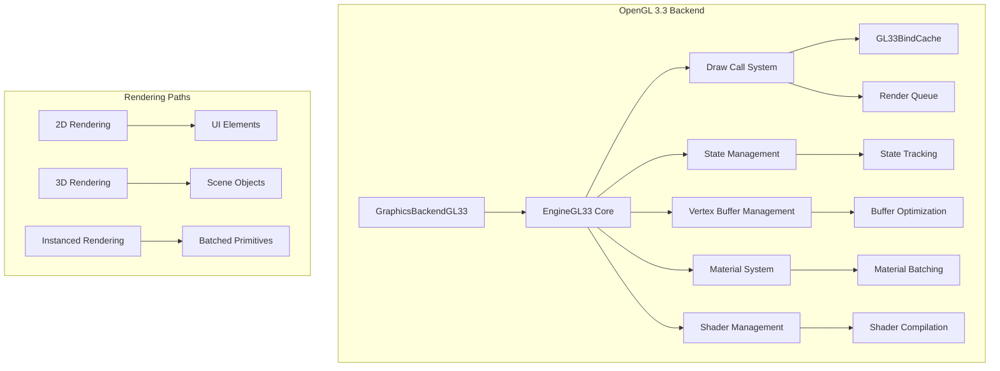
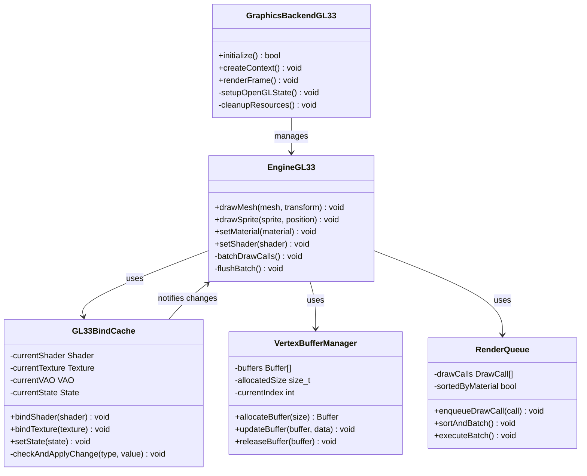
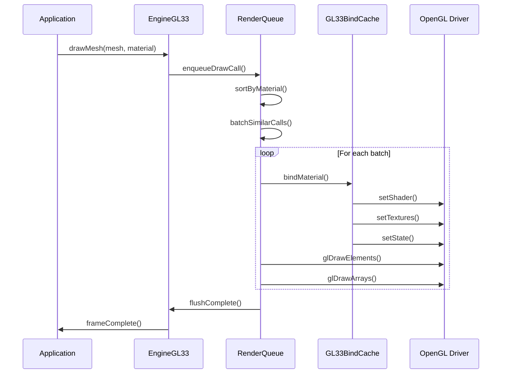
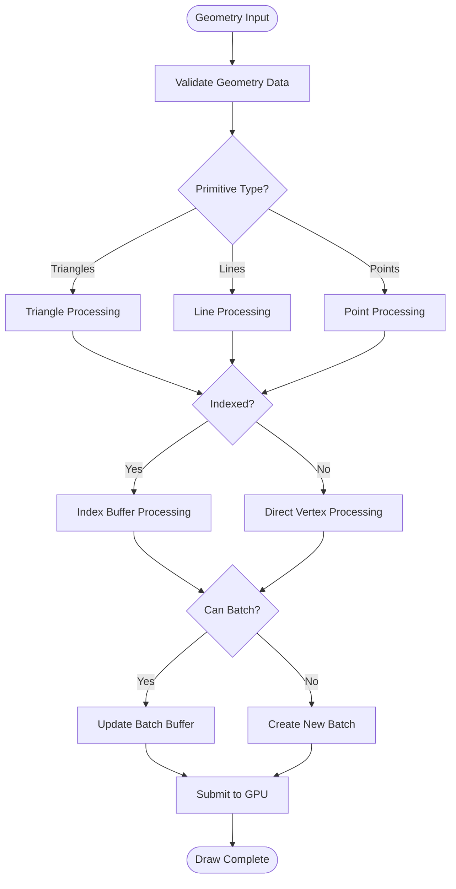
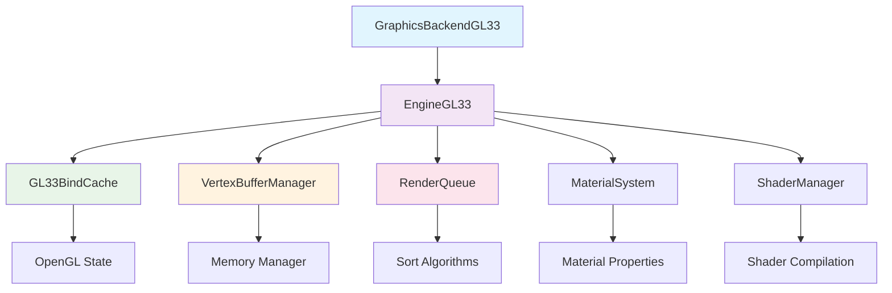

# Rendering Pipeline and Draw Calls

<cite>
**Referenced Files in This Document**
- [GL33BindCache.hpp](file://engine/PoseidonGL33/GL33BindCache.hpp)
- [GL33BindCache.cpp](file://engine/PoseidonGL33/GL33BindCache.cpp)
- [EngineGL33_Draw.cpp](file://engine/PoseidonGL33/EngineGL33_Draw.cpp)
- [EngineGL33_VertexBuffer.cpp](file://engine/PoseidonGL33/EngineGL33_VertexBuffer.cpp)
- [EngineGL33_Queue.cpp](file://engine/PoseidonGL33/EngineGL33_Queue.cpp)
- [EngineGL33_Material.cpp](file://engine/PoseidonGL33/EngineGL33_Material.cpp)
- [EngineGL33_Shaders.cpp](file://engine/PoseidonGL33/EngineGL33_Shaders.cpp)
- [EngineGL33_State.cpp](file://engine/PoseidonGL33/EngineGL33_State.cpp)
- [GraphicsBackendGL33.cpp](file://engine/PoseidonGL33/GraphicsBackendGL33.cpp)
</cite>

## Table of Contents
1. [Introduction](#introduction)
2. [Project Structure](#project-structure)
3. [Core Components](#core-components)
4. [Architecture Overview](#architecture-overview)
5. [Detailed Component Analysis](#detailed-component-analysis)
6. [Dependency Analysis](#dependency-analysis)
7. [Performance Considerations](#performance-considerations)
8. [Troubleshooting Guide](#troubleshooting-guide)
9. [Conclusion](#conclusion)

## Introduction

This document provides comprehensive documentation for the OpenGL 3.3 rendering pipeline implementation in the CWR-CE engine. The focus is on draw call optimization, state management, and the graphics abstraction layer integration. The system implements advanced batching techniques, state change minimization, and efficient geometry processing to achieve optimal rendering performance.

The OpenGL 3.3 backend serves as the primary graphics implementation, providing both 2D and 3D rendering capabilities through a unified API that abstracts the underlying OpenGL calls while maintaining high performance through intelligent state caching and draw call batching.

## Project Structure

The OpenGL 3.3 rendering system is organized into several key components within the `engine/PoseidonGL33/` directory:

**Diagram sources**
- [GraphicsBackendGL33.cpp](file://engine/PoseidonGL33/GraphicsBackendGL33.cpp)
- [EngineGL33_Draw.cpp](file://engine/PoseidonGL33/EngineGL33_Draw.cpp)
- [GL33BindCache.hpp](file://engine/PoseidonGL33/GL33BindCache.hpp)

**Section sources**
- [GraphicsBackendGL33.cpp](file://engine/PoseidonGL33/GraphicsBackendGL33.cpp)
- [EngineGL33_Draw.cpp](file://engine/PoseidonGL33/EngineGL33_Draw.cpp)

## Core Components

### GL33BindCache - State Change Minimization

The GL33BindCache is the cornerstone of the rendering optimization system. It maintains the current OpenGL state and only issues state changes when necessary, significantly reducing driver overhead.

Key responsibilities include:
- Tracking bound vertex arrays, shaders, textures, and render states
- Minimizing redundant OpenGL state changes
- Providing efficient state switching between draw calls
- Maintaining cache coherence across the rendering pipeline

### Draw Call Batching System

The batching system groups multiple draw calls together to reduce CPU overhead and improve GPU utilization. It operates at multiple levels:

1. **Primitive-level batching**: Combines small primitives into larger batches
2. **Material-level batching**: Groups objects with identical materials
3. **Texture-level batching**: Organizes draw calls by texture binding

### Vertex Buffer Management

The vertex buffer system handles memory allocation, updates, and optimization for vertex data:

- Dynamic buffer allocation strategies
- Efficient buffer updates without reallocation
- Support for instanced rendering through buffer interleaving
- Automatic buffer cleanup and memory management

**Section sources**
- [GL33BindCache.hpp](file://engine/PoseidonGL33/GL33BindCache.hpp)
- [EngineGL33_VertexBuffer.cpp](file://engine/PoseidonGL33/EngineGL33_VertexBuffer.cpp)
- [EngineGL33_Queue.cpp](file://engine/PoseidonGL33/EngineGL33_Queue.cpp)

## Architecture Overview

The OpenGL 3.3 rendering architecture follows a layered approach with clear separation of concerns:

**Diagram sources**
- [GraphicsBackendGL33.cpp](file://engine/PoseidonGL33/GraphicsBackendGL33.cpp)
- [EngineGL33_Draw.cpp](file://engine/PoseidonGL33/EngineGL33_Draw.cpp)
- [GL33BindCache.hpp](file://engine/PoseidonGL33/GL33BindCache.hpp)
- [EngineGL33_VertexBuffer.cpp](file://engine/PoseidonGL33/EngineGL33_VertexBuffer.cpp)

## Detailed Component Analysis

### Draw Call Batching Implementation

The draw call batching system implements a sophisticated queuing mechanism that groups similar operations together:

**Diagram sources**
- [EngineGL33_Draw.cpp](file://engine/PoseidonGL33/EngineGL33_Draw.cpp)
- [EngineGL33_Queue.cpp](file://engine/PoseidonGL33/EngineGL33_Queue.cpp)
- [GL33BindCache.cpp](file://engine/PoseidonGL33/GL33BindCache.cpp)

### State Change Minimization Strategy

The GL33BindCache employs several strategies to minimize state changes:

1. **Lazy Evaluation**: Only checks state when actually needed
2. **Delta Detection**: Compares current vs. desired state before applying
3. **Batched Updates**: Groups related state changes together
4. **Hierarchical Caching**: Maintains state at different granularity levels

### 2D and 3D Rendering Paths

The system supports both 2D and 3D rendering through a unified interface:

#### 2D Rendering Path
- Optimized for screen-space coordinates
- Batched sprite rendering with texture atlases
- UI element rendering with automatic culling
- Font rendering with glyph caching

#### 3D Rendering Path
- Full transformation pipeline support
- Advanced material systems with multi-pass rendering
- Shadow mapping and lighting calculations
- Geometry instancing for repeated objects

### Primitive Drawing and Geometry Processing

The primitive drawing system handles various OpenGL primitives efficiently:

**Diagram sources**
- [EngineGL33_Draw.cpp](file://engine/PoseidonGL33/EngineGL33_Draw.cpp)
- [EngineGL33_VertexBuffer.cpp](file://engine/PoseidonGL33/EngineGL33_VertexBuffer.cpp)

### Vertex Buffer Management

The vertex buffer system implements several optimization techniques:

1. **Dynamic Buffer Allocation**: Pre-allocates large buffers for dynamic content
2. **Ring Buffer Pattern**: Reuses buffer memory efficiently
3. **Interleaved Attributes**: Stores vertex attributes contiguously for better cache performance
4. **Automatic Cleanup**: Manages buffer lifecycle and memory usage

### Instanced Rendering

Instanced rendering allows drawing multiple instances of the same geometry with minimal overhead:

- Single draw call for multiple object instances
- Instance-specific attributes (position, color, scale)
- Automatic instance buffer management
- Support for up to hardware-defined maximum instances

**Section sources**
- [EngineGL33_Draw.cpp](file://engine/PoseidonGL33/EngineGL33_Draw.cpp)
- [EngineGL33_VertexBuffer.cpp](file://engine/PoseidonGL33/EngineGL33_VertexBuffer.cpp)
- [EngineGL33_Material.cpp](file://engine/PoseidonGL33/EngineGL33_Material.cpp)

## Dependency Analysis

The rendering system has well-defined dependencies between components:

**Diagram sources**
- [GraphicsBackendGL33.cpp](file://engine/PoseidonGL33/GraphicsBackendGL33.cpp)
- [EngineGL33_Draw.cpp](file://engine/PoseidonGL33/EngineGL33_Draw.cpp)

### Component Coupling Analysis

- **High Cohesion**: Each component has a single, well-defined responsibility
- **Low Coupling**: Components communicate through clean interfaces
- **Dependency Injection**: Services are injected rather than hardcoded
- **Interface Segregation**: Small, focused interfaces for each component

**Section sources**
- [GraphicsBackendGL33.cpp](file://engine/PoseidonGL33/GraphicsBackendGL33.cpp)
- [EngineGL33_Draw.cpp](file://engine/PoseidonGL33/EngineGL33_Draw.cpp)

## Performance Considerations

### Draw Call Optimization Strategies

1. **Batch Size Tuning**: Optimal batch sizes vary by hardware and scene complexity
2. **State Change Minimization**: Group operations to reduce driver overhead
3. **Memory Bandwidth**: Use appropriate vertex formats and buffer layouts
4. **CPU-GPU Synchronization**: Minimize synchronization points

### Profiling and Bottleneck Identification

Key metrics to monitor:
- Draw call count per frame
- State change frequency
- Buffer update frequency
- Memory allocation patterns
- GPU utilization rates

### Optimization Techniques

- **Frustum Culling**: Remove objects outside the camera view
- **Level of Detail (LOD)**: Reduce geometry complexity for distant objects
- **Occlusion Culling**: Skip rendering of hidden objects
- **Texture Atlasing**: Combine multiple textures into single atlases

## Troubleshooting Guide

### Common Rendering Issues

1. **Excessive Draw Calls**: Check batching configuration and material usage
2. **State Change Overhead**: Verify GL33BindCache effectiveness
3. **Memory Leaks**: Monitor buffer allocation and deallocation
4. **Performance Drops**: Profile frame-by-frame rendering costs

### Debugging Tools

- **RenderDoc**: Frame capture and analysis
- **NVIDIA Nsight**: GPU profiling and debugging
- **Intel GPA**: Performance analysis
- **Custom Profilers**: Engine-specific performance counters

### Error Handling

The system implements comprehensive error handling:
- OpenGL error checking with detailed logging
- Resource validation and cleanup
- Graceful degradation for unsupported features
- Diagnostic information collection

**Section sources**
- [EngineGL33_State.cpp](file://engine/PoseidonGL33/EngineGL33_State.cpp)
- [EngineGL33_Shaders.cpp](file://engine/PoseidonGL33/EngineGL33_Shaders.cpp)

## Conclusion

The OpenGL 3.3 rendering pipeline in CWR-CE implements a sophisticated system for draw call optimization and state management. Through intelligent batching, state caching, and efficient resource management, the system achieves high performance while maintaining flexibility for both 2D and 3D rendering scenarios.

Key achievements include:
- Significant reduction in draw call overhead through batching
- Minimal state changes via the GL33BindCache system
- Efficient vertex buffer management with dynamic allocation
- Support for advanced rendering techniques like instancing
- Comprehensive profiling and debugging capabilities

The modular architecture ensures maintainability and extensibility, allowing for future enhancements while preserving the performance characteristics essential for real-time rendering applications.