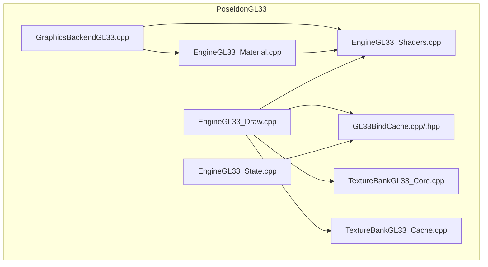
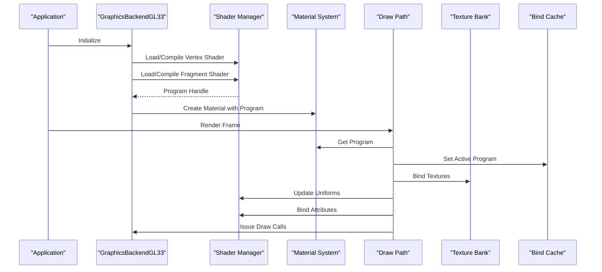
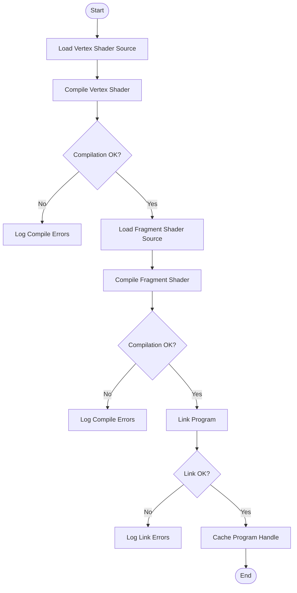
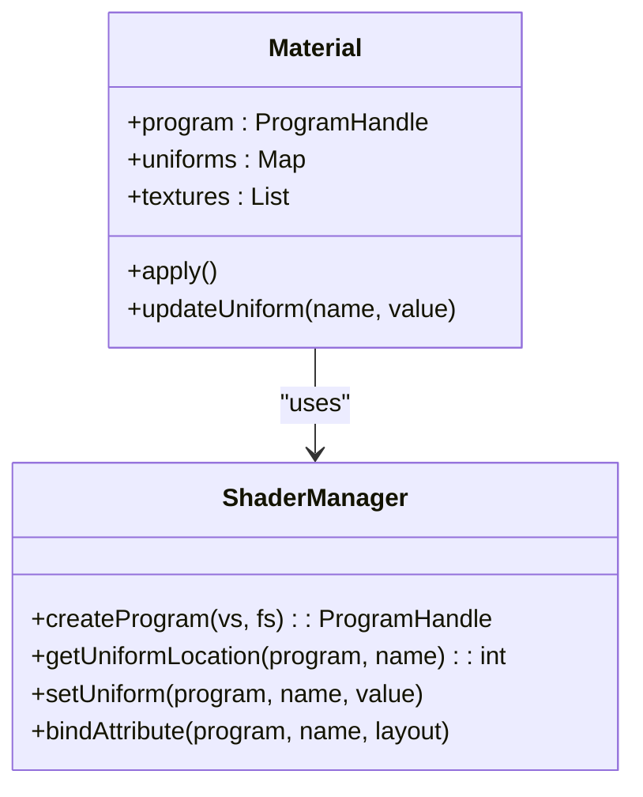
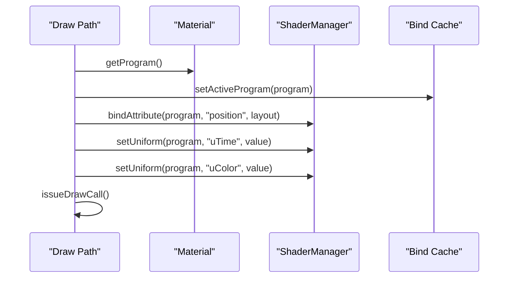
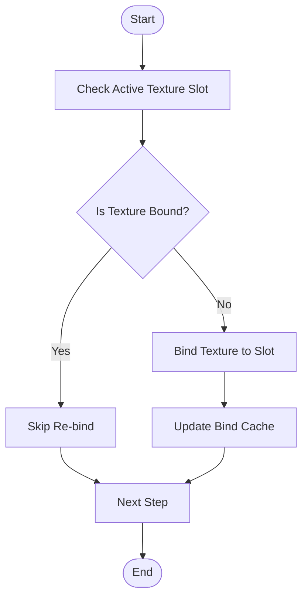
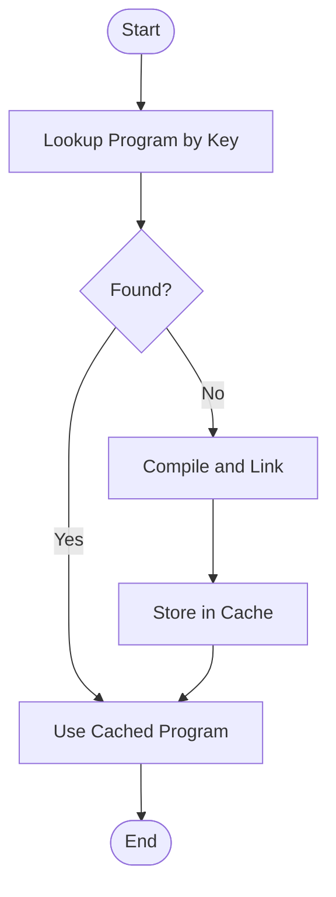
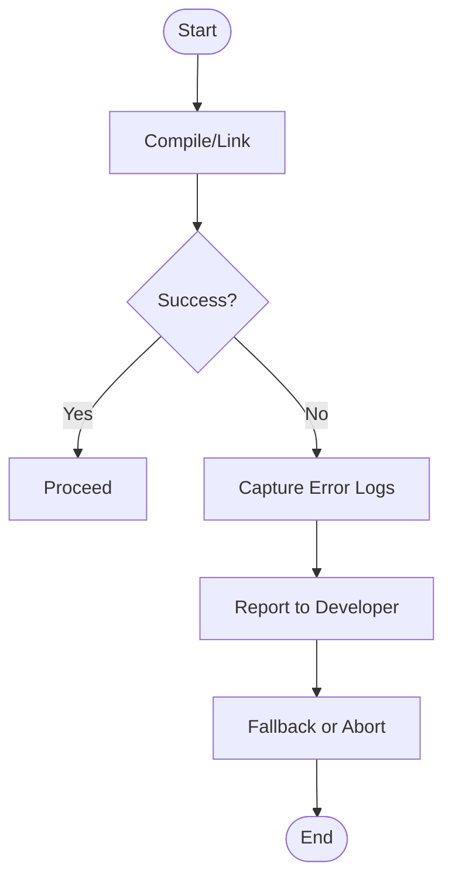
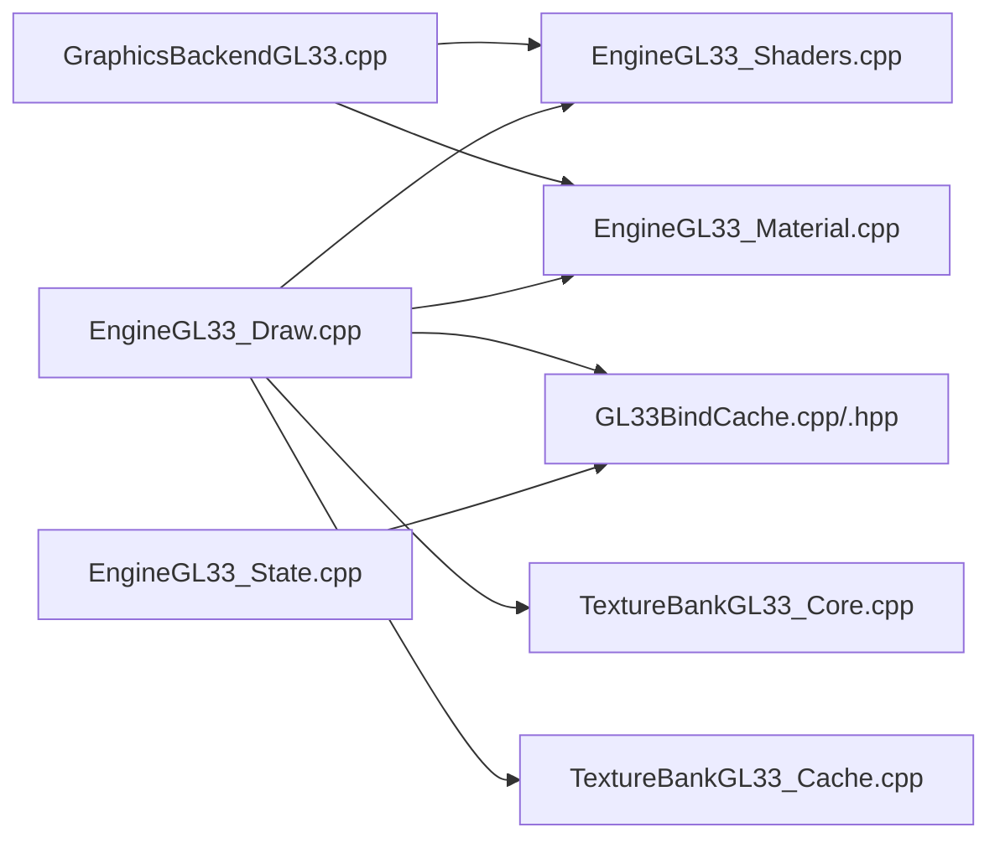

# Shader Compilation and Management

<cite>
**Referenced Files in This Document**
- [EngineGL33_Shaders.cpp](file://engine/PoseidonGL33/EngineGL33_Shaders.cpp)
- [EngineGL33_Material.cpp](file://engine/PoseidonGL33/EngineGL33_Material.cpp)
- [EngineGL33_State.cpp](file://engine/PoseidonGL33/EngineGL33_State.cpp)
- [EngineGL33_Draw.cpp](file://engine/PoseidonGL33/EngineGL33_Draw.cpp)
- [TextureBankGL33_Core.cpp](file://engine/PoseidonGL33/TextureBankGL33_Core.cpp)
- [TextureBankGL33_Cache.cpp](file://engine/PoseidonGL33/TextureBankGL33_Cache.cpp)
- [GL33BindCache.cpp](file://engine/PoseidonGL33/GL33BindCache.cpp)
- [GL33BindCache.hpp](file://engine/PoseidonGL33/GL33BindCache.hpp)
- [GraphicsBackendGL33.cpp](file://engine/PoseidonGL33/GraphicsBackendGL33.cpp)
</cite>

## Table of Contents
1. [Introduction](#introduction)
2. [Project Structure](#project-structure)
3. [Core Components](#core-components)
4. [Architecture Overview](#architecture-overview)
5. [Detailed Component Analysis](#detailed-component-analysis)
6. [Dependency Analysis](#dependency-analysis)
7. [Performance Considerations](#performance-considerations)
8. [Troubleshooting Guide](#troubleshooting-guide)
9. [Conclusion](#conclusion)

## Introduction
This document explains the OpenGL shader compilation and management system used by the engine’s GL33 backend. It covers the shader compilation pipeline (vertex and fragment shaders), uniform binding, attribute management, material integration, program caching, error handling, texture binding, state management, debugging tools, and performance optimization techniques. The goal is to provide both a high-level understanding and actionable guidance for developers working with shaders in this codebase.

## Project Structure
The shader-related implementation lives primarily under the PoseidonGL33 module:
- Shader compilation and program lifecycle are implemented in EngineGL33_Shaders.cpp
- Material-to-shader integration is handled in EngineGL33_Material.cpp
- State and bind caches that minimize driver overhead are in GL33BindCache.*
- Texture binding and caching are managed in TextureBankGL33_*.cpp
- Drawing paths that activate programs and set attributes/uniforms are in EngineGL33_Draw.cpp
- Backend initialization and glue code are in GraphicsBackendGL33.cpp

**Diagram sources**
- [EngineGL33_Shaders.cpp](file://engine/PoseidonGL33/EngineGL33_Shaders.cpp)
- [EngineGL33_Material.cpp](file://engine/PoseidonGL33/EngineGL33_Material.cpp)
- [EngineGL33_State.cpp](file://engine/PoseidonGL33/EngineGL33_State.cpp)
- [EngineGL33_Draw.cpp](file://engine/PoseidonGL33/EngineGL33_Draw.cpp)
- [TextureBankGL33_Core.cpp](file://engine/PoseidonGL33/TextureBankGL33_Core.cpp)
- [TextureBankGL33_Cache.cpp](file://engine/PoseidonGL33/TextureBankGL33_Cache.cpp)
- [GL33BindCache.cpp](file://engine/PoseidonGL33/GL33BindCache.cpp)
- [GraphicsBackendGL33.cpp](file://engine/PoseidonGL33/GraphicsBackendGL33.cpp)

**Section sources**
- [EngineGL33_Shaders.cpp](file://engine/PoseidonGL33/EngineGL33_Shaders.cpp)
- [EngineGL33_Material.cpp](file://engine/PoseidonGL33/EngineGL33_Material.cpp)
- [EngineGL33_State.cpp](file://engine/PoseidonGL33/EngineGL33_State.cpp)
- [EngineGL33_Draw.cpp](file://engine/PoseidonGL33/EngineGL33_Draw.cpp)
- [TextureBankGL33_Core.cpp](file://engine/PoseidonGL33/TextureBankGL33_Core.cpp)
- [TextureBankGL33_Cache.cpp](file://engine/PoseidonGL33/TextureBankGL33_Cache.cpp)
- [GL33BindCache.cpp](file://engine/PoseidonGL33/GL33BindCache.cpp)
- [GraphicsBackendGL33.cpp](file://engine/PoseidonGL33/GraphicsBackendGL33.cpp)

## Core Components
- Shader Program Manager: Compiles vertex and fragment shaders, links programs, tracks errors, and provides handles for use during rendering.
- Material System Integration: Maps materials to shader programs and binds per-material uniforms and textures.
- Attribute and Uniform Binding: Resolves attribute locations and sets uniform values efficiently.
- Texture Bank and Bind Cache: Manages GPU textures and minimizes redundant state changes via caching.
- Draw Path: Activates programs, binds buffers/textures, sets attributes/uniforms, and issues draw calls.

Key responsibilities:
- Vertex and fragment shader processing: source loading, compilation, linking, and error reporting.
- Uniform binding: location resolution and value updates.
- Attribute management: layout specification and buffer binding.
- Program caching: reuse compiled/linkage results across frames.
- Error handling: robust diagnostics on compile/link failures.

**Section sources**
- [EngineGL33_Shaders.cpp](file://engine/PoseidonGL33/EngineGL33_Shaders.cpp)
- [EngineGL33_Material.cpp](file://engine/PoseidonGL33/EngineGL33_Material.cpp)
- [EngineGL33_Draw.cpp](file://engine/PoseidonGL33/EngineGL33_Draw.cpp)
- [GL33BindCache.cpp](file://engine/PoseidonGL33/GL33BindCache.cpp)
- [TextureBankGL33_Core.cpp](file://engine/PoseidonGL33/TextureBankGL33_Core.cpp)

## Architecture Overview
The GL33 backend composes shader programs from vertex and fragment sources, integrates them through materials, and uses bind caches to reduce state churn during drawing.

**Diagram sources**
- [GraphicsBackendGL33.cpp](file://engine/PoseidonGL33/GraphicsBackendGL33.cpp)
- [EngineGL33_Shaders.cpp](file://engine/PoseidonGL33/EngineGL33_Shaders.cpp)
- [EngineGL33_Material.cpp](file://engine/PoseidonGL33/EngineGL33_Material.cpp)
- [EngineGL33_Draw.cpp](file://engine/PoseidonGL33/EngineGL33_Draw.cpp)
- [TextureBankGL33_Core.cpp](file://engine/PoseidonGL33/TextureBankGL33_Core.cpp)
- [GL33BindCache.cpp](file://engine/PoseidonGL33/GL33BindCache.cpp)

## Detailed Component Analysis

### Shader Compilation Pipeline
- Vertex and fragment shader sources are loaded, compiled, and linked into a program object.
- On failure, detailed error messages are captured and logged to aid debugging.
- Programs are cached to avoid recompilation across frames.

**Diagram sources**
- [EngineGL33_Shaders.cpp](file://engine/PoseidonGL33/EngineGL33_Shaders.cpp)

**Section sources**
- [EngineGL33_Shaders.cpp](file://engine/PoseidonGL33/EngineGL33_Shaders.cpp)

### Material System Integration
- Materials encapsulate a shader program and associated uniforms/textures.
- When rendering, the draw path queries the material for its program and binds required resources.
- Material updates propagate to the shader program via uniform setters.

**Diagram sources**
- [EngineGL33_Material.cpp](file://engine/PoseidonGL33/EngineGL33_Material.cpp)
- [EngineGL33_Shaders.cpp](file://engine/PoseidonGL33/EngineGL33_Shaders.cpp)

**Section sources**
- [EngineGL33_Material.cpp](file://engine/PoseidonGL33/EngineGL33_Material.cpp)
- [EngineGL33_Shaders.cpp](file://engine/PoseidonGL33/EngineGL33_Shaders.cpp)

### Attribute and Uniform Management
- Attribute layouts are defined and bound to vertex buffers before draw calls.
- Uniform locations are resolved once per program and reused to minimize lookups.
- Updates occur just before drawing with a given material/program.

**Diagram sources**
- [EngineGL33_Draw.cpp](file://engine/PoseidonGL33/EngineGL33_Draw.cpp)
- [EngineGL33_Shaders.cpp](file://engine/PoseidonGL33/EngineGL33_Shaders.cpp)
- [GL33BindCache.cpp](file://engine/PoseidonGL33/GL33BindCache.cpp)

**Section sources**
- [EngineGL33_Draw.cpp](file://engine/PoseidonGL33/EngineGL33_Draw.cpp)
- [EngineGL33_Shaders.cpp](file://engine/PoseidonGL33/EngineGL33_Shaders.cpp)
- [GL33BindCache.cpp](file://engine/PoseidonGL33/GL33BindCache.cpp)

### Texture Binding and State Management
- Texture bank manages creation, loading, and caching of GPU textures.
- Bind cache tracks active textures and states to avoid redundant bindings.
- Draw path binds textures according to material requirements prior to drawing.

**Diagram sources**
- [TextureBankGL33_Core.cpp](file://engine/PoseidonGL33/TextureBankGL33_Core.cpp)
- [TextureBankGL33_Cache.cpp](file://engine/PoseidonGL33/TextureBankGL33_Cache.cpp)
- [GL33BindCache.cpp](file://engine/PoseidonGL33/GL33BindCache.cpp)

**Section sources**
- [TextureBankGL33_Core.cpp](file://engine/PoseidonGL33/TextureBankGL33_Core.cpp)
- [TextureBankGL33_Cache.cpp](file://engine/PoseidonGL33/TextureBankGL33_Cache.cpp)
- [GL33BindCache.cpp](file://engine/PoseidonGL33/GL33BindCache.cpp)

### Shader Program Caching
- Compiled/linkage results are stored and reused to prevent repeated work.
- Cache keys typically include shader source hashes or identifiers.
- Invalidation occurs when sources change or platform capabilities differ.

**Diagram sources**
- [EngineGL33_Shaders.cpp](file://engine/PoseidonGL33/EngineGL33_Shaders.cpp)

**Section sources**
- [EngineGL33_Shaders.cpp](file://engine/PoseidonGL33/EngineGL33_Shaders.cpp)

### Error Handling for Compilation Failures
- Compile and link errors are captured and logged with diagnostic details.
- Failure paths ensure graceful degradation and informative messages.
- Developers can inspect logs to identify syntax or linkage issues.

**Diagram sources**
- [EngineGL33_Shaders.cpp](file://engine/PoseidonGL33/EngineGL33_Shaders.cpp)

**Section sources**
- [EngineGL33_Shaders.cpp](file://engine/PoseidonGL33/EngineGL33_Shaders.cpp)

## Dependency Analysis
The following diagram shows how components depend on each other within the GL33 backend:

**Diagram sources**
- [GraphicsBackendGL33.cpp](file://engine/PoseidonGL33/GraphicsBackendGL33.cpp)
- [EngineGL33_Shaders.cpp](file://engine/PoseidonGL33/EngineGL33_Shaders.cpp)
- [EngineGL33_Material.cpp](file://engine/PoseidonGL33/EngineGL33_Material.cpp)
- [EngineGL33_Draw.cpp](file://engine/PoseidonGL33/EngineGL33_Draw.cpp)
- [EngineGL33_State.cpp](file://engine/PoseidonGL33/EngineGL33_State.cpp)
- [GL33BindCache.cpp](file://engine/PoseidonGL33/GL33BindCache.cpp)
- [TextureBankGL33_Core.cpp](file://engine/PoseidonGL33/TextureBankGL33_Core.cpp)
- [TextureBankGL33_Cache.cpp](file://engine/PoseidonGL33/TextureBankGL33_Cache.cpp)

**Section sources**
- [GraphicsBackendGL33.cpp](file://engine/PoseidonGL33/GraphicsBackendGL33.cpp)
- [EngineGL33_Shaders.cpp](file://engine/PoseidonGL33/EngineGL33_Shaders.cpp)
- [EngineGL33_Material.cpp](file://engine/PoseidonGL33/EngineGL33_Material.cpp)
- [EngineGL33_Draw.cpp](file://engine/PoseidonGL33/EngineGL33_Draw.cpp)
- [EngineGL33_State.cpp](file://engine/PoseidonGL33/EngineGL33_State.cpp)
- [GL33BindCache.cpp](file://engine/PoseidonGL33/GL33BindCache.cpp)
- [TextureBankGL33_Core.cpp](file://engine/PoseidonGL33/TextureBankGL33_Core.cpp)
- [TextureBankGL33_Cache.cpp](file://engine/PoseidonGL33/TextureBankGL33_Cache.cpp)

## Performance Considerations
- Minimize program switches: batch draws by material/program to reduce state changes.
- Cache uniform locations and attribute bindings; update only when values change.
- Avoid frequent texture re-binds; rely on bind cache to skip redundant operations.
- Keep shader sources stable to maximize cache hits; use versioned assets if needed.
- Prefer instanced rendering where possible to reduce per-object overhead.
- Profile with GPU debuggers to identify bottlenecks in shader execution and state transitions.

[No sources needed since this section provides general guidance]

## Troubleshooting Guide
Common issues and resolutions:
- Shader compilation fails: check syntax, precision qualifiers, and supported extensions; review logs produced by the shader manager.
- Linking errors: verify attribute names match between vertex and fragment stages; ensure uniform declarations align with material updates.
- Missing textures: confirm textures are loaded and bound to correct slots; validate sampler uniforms are set.
- Stale state: ensure bind cache is updated after changing programs, textures, or attributes.
- Performance regressions: profile draw calls and shader complexity; reduce overdraw and expensive operations in fragment shaders.

Debugging tools:
- Use GPU debuggers (e.g., RenderDoc) to capture frames and inspect shader inputs/outputs.
- Enable logging in shader compilation/linkage to capture detailed error messages.
- Validate attribute layouts against vertex buffer formats to avoid misalignment.

**Section sources**
- [EngineGL33_Shaders.cpp](file://engine/PoseidonGL33/EngineGL33_Shaders.cpp)
- [EngineGL33_Draw.cpp](file://engine/PoseidonGL33/EngineGL33_Draw.cpp)
- [GL33BindCache.cpp](file://engine/PoseidonGL33/GL33BindCache.cpp)
- [TextureBankGL33_Core.cpp](file://engine/PoseidonGL33/TextureBankGL33_Core.cpp)

## Conclusion
The GL33 backend implements a robust shader compilation and management system centered around efficient program caching, careful state management, and clear error reporting. By integrating materials with shader programs and leveraging bind caches, the engine minimizes driver overhead while providing a flexible framework for shader-driven rendering. Following the guidelines in this document will help developers write performant, maintainable shaders and troubleshoot issues effectively.

[No sources needed since this section summarizes without analyzing specific files]