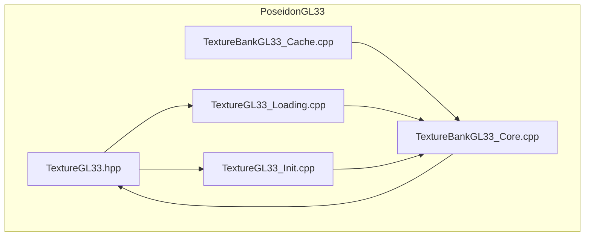
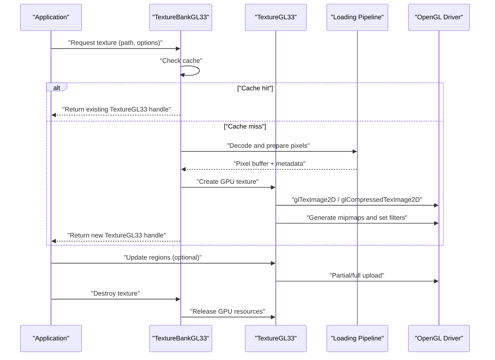
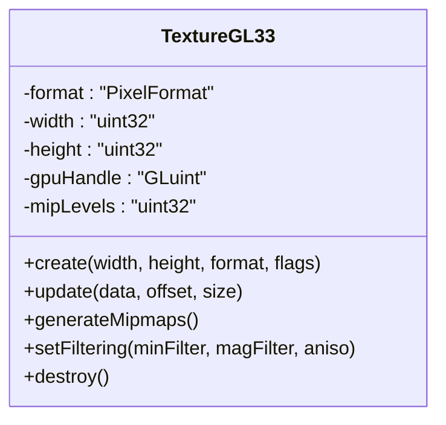
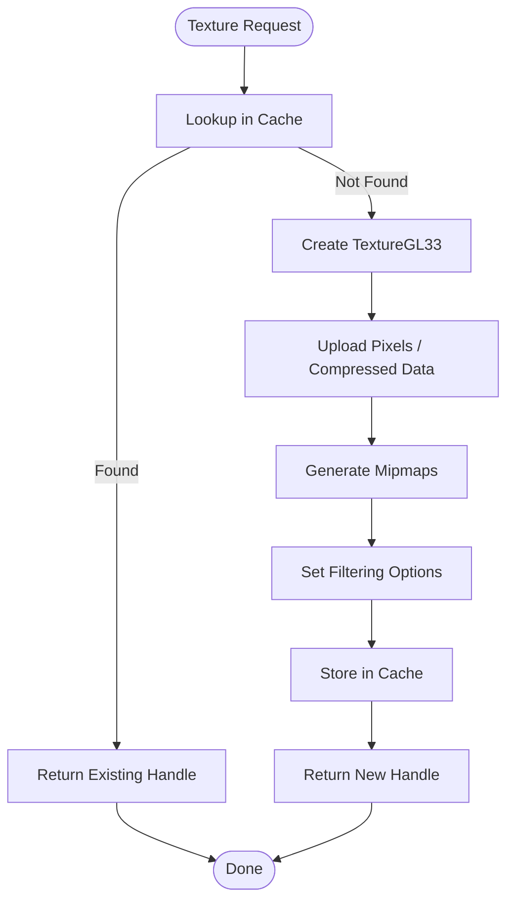
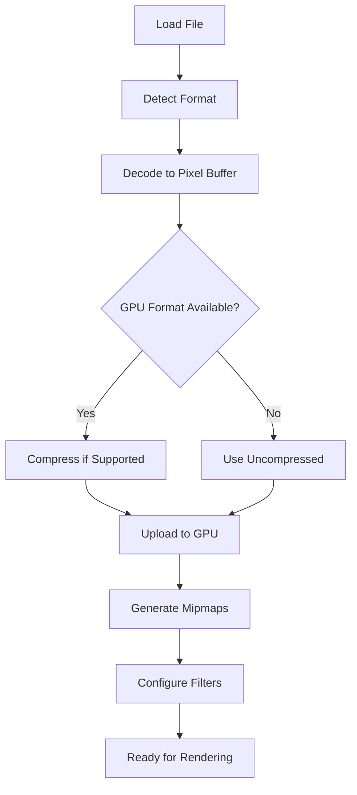
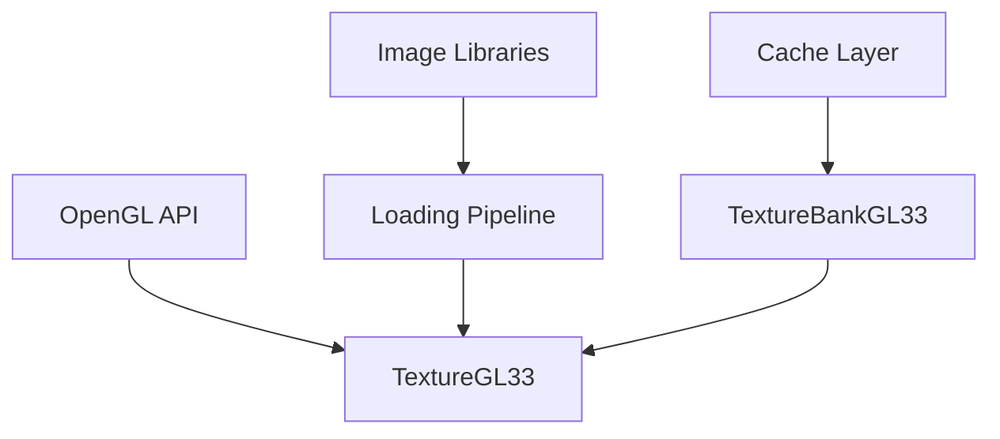

# Texture Loading and Management

<cite>
**Referenced Files in This Document**
- [TextureGL33.hpp](file://engine/PoseidonGL33/TextureGL33.hpp)
- [TextureGL33_Init.cpp](file://engine/PoseidonGL33/TextureGL33_Init.cpp)
- [TextureGL33_Loading.cpp](file://engine/PoseidonGL33/TextureGL33_Loading.cpp)
- [TextureBankGL33_Core.cpp](file://engine/PoseidonGL33/TextureBankGL33_Core.cpp)
- [TextureBankGL33_Cache.cpp](file://engine/PoseidonGL33/TextureBankGL33_Cache.cpp)
</cite>

## Table of Contents
1. [Introduction](#introduction)
2. [Project Structure](#project-structure)
3. [Core Components](#core-components)
4. [Architecture Overview](#architecture-overview)
5. [Detailed Component Analysis](#detailed-component-analysis)
6. [Dependency Analysis](#dependency-analysis)
7. [Performance Considerations](#performance-considerations)
8. [Troubleshooting Guide](#troubleshooting-guide)
9. [Conclusion](#conclusion)
10. [Appendices](#appendices)

## Introduction
This document explains the OpenGL texture loading and management system implemented for the OpenGL 3.3 backend. It covers supported file formats, the loading pipeline, memory management strategies, and GPU-side optimizations such as filtering, mipmapping, and compression. The documentation focuses on the TextureGL33 class, texture bank operations, caching mechanisms, and integration with image processing libraries. It also provides guidance on performance tuning, atlas usage patterns, and troubleshooting common issues.

## Project Structure
The OpenGL 3.3 texture subsystem is organized under the PoseidonGL33 module:
- TextureGL33.hpp declares the core texture object interface and data structures used by the GL33 backend.
- TextureGL33_Init.cpp implements initialization and lifecycle methods for GPU resources.
- TextureGL33_Loading.cpp implements decoding and upload paths from decoded pixel buffers to GPU textures.
- TextureBankGL33_Core.cpp manages texture lifetimes, binding, and shared state across the GL33 renderer.
- TextureBankGL33_Cache.cpp implements caching policies to avoid redundant uploads and reduce memory pressure.

**Diagram sources**
- [TextureGL33.hpp](file://engine/PoseidonGL33/TextureGL33.hpp)
- [TextureGL33_Init.cpp](file://engine/PoseidonGL33/TextureGL33_Init.cpp)
- [TextureGL33_Loading.cpp](file://engine/PoseidonGL33/TextureGL33_Loading.cpp)
- [TextureBankGL33_Core.cpp](file://engine/PoseidonGL33/TextureBankGL33_Core.cpp)
- [TextureBankGL33_Cache.cpp](file://engine/PoseidonGL33/TextureBankGL33_Cache.cpp)

**Section sources**
- [TextureGL33.hpp](file://engine/PoseidonGL33/TextureGL33.hpp)
- [TextureGL33_Init.cpp](file://engine/PoseidonGL33/TextureGL33_Init.cpp)
- [TextureGL33_Loading.cpp](file://engine/PoseidonGL33/TextureGL33_Loading.cpp)
- [TextureBankGL33_Core.cpp](file://engine/PoseidonGL33/TextureBankGL33_Core.cpp)
- [TextureBankGL33_Cache.cpp](file://engine/PoseidonGL33/TextureBankGL33_Cache.cpp)

## Core Components
- TextureGL33: Represents a single GPU texture resource. It encapsulates format selection, mip generation, filtering configuration, and upload/update operations.
- TextureBankGL33: Manages collections of textures, handles creation/destruction, binding, and caching policies to minimize redundant work.
- Loading Pipeline: Converts decoded image data into GPU-friendly formats, applies compression where available, generates mipmaps, and sets sampling parameters.
- Cache Layer: Tracks previously created textures and reuses them when possible, reducing CPU/GPU overhead and memory churn.

Key responsibilities:
- Format detection and conversion to GPU-native formats.
- Mipmapping and anisotropic filtering setup.
- Efficient updates via partial or full uploads.
- Atlas support through region-based coordinates and shared GPU storage.

**Section sources**
- [TextureGL33.hpp](file://engine/PoseidonGL33/TextureGL33.hpp)
- [TextureGL33_Init.cpp](file://engine/PoseidonGL33/TextureGL33_Init.cpp)
- [TextureGL33_Loading.cpp](file://engine/PoseidonGL33/TextureGL33_Loading.cpp)
- [TextureBankGL33_Core.cpp](file://engine/PoseidonGL33/TextureBankGL33_Core.cpp)
- [TextureBankGL33_Cache.cpp](file://engine/PoseidonGL33/TextureBankGL33_Cache.cpp)

## Architecture Overview
The texture system follows a layered architecture:
- Application layer requests textures via the TextureBank.
- TextureBank resolves or creates TextureGL33 instances, applying cache policies.
- Loading pipeline decodes images and uploads to GPU using optimized paths.
- Lifecycle management ensures proper creation, update, and destruction of GPU resources.

**Diagram sources**
- [TextureGL33_Init.cpp](file://engine/PoseidonGL33/TextureGL33_Init.cpp)
- [TextureGL33_Loading.cpp](file://engine/PoseidonGL33/TextureGL33_Loading.cpp)
- [TextureBankGL33_Core.cpp](file://engine/PoseidonGL33/TextureBankGL33_Core.cpp)
- [TextureBankGL33_Cache.cpp](file://engine/PoseidonGL33/TextureBankGL33_Cache.cpp)

## Detailed Component Analysis

### TextureGL33 Class
TextureGL33 encapsulates a single OpenGL texture object and its associated metadata:
- Creation: Allocates GPU texture objects, selects internal formats, and configures base-level storage.
- Mipmapping: Generates mipmap chains based on source dimensions and quality settings.
- Filtering: Configures minification/magnification filters and optional anisotropic filtering.
- Updates: Supports full and partial uploads; supports compressed formats when available.
- Destruction: Releases GPU resources and clears references.

**Diagram sources**
- [TextureGL33.hpp](file://engine/PoseidonGL33/TextureGL33.hpp)
- [TextureGL33_Init.cpp](file://engine/PoseidonGL33/TextureGL33_Init.cpp)
- [TextureGL33_Loading.cpp](file://engine/PoseidonGL33/TextureGL33_Loading.cpp)

**Section sources**
- [TextureGL33.hpp](file://engine/PoseidonGL33/TextureGL33.hpp)
- [TextureGL33_Init.cpp](file://engine/PoseidonGL33/TextureGL33_Init.cpp)
- [TextureGL33_Loading.cpp](file://engine/PoseidonGL33/TextureGL33_Loading.cpp)

### Texture Bank Operations
TextureBankGL33 manages texture lifecycles and caching:
- Creation: Delegates to TextureGL33 after resolving format and options.
- Binding: Provides efficient binding helpers for rendering pipelines.
- Destruction: Ensures all referenced textures are released and caches cleared if needed.
- Atlas support: Allows multiple regions to share a single GPU texture object.

**Diagram sources**
- [TextureBankGL33_Core.cpp](file://engine/PoseidonGL33/TextureBankGL33_Core.cpp)
- [TextureBankGL33_Cache.cpp](file://engine/PoseidonGL33/TextureBankGL33_Cache.cpp)

**Section sources**
- [TextureBankGL33_Core.cpp](file://engine/PoseidonGL33/TextureBankGL33_Core.cpp)
- [TextureBankGL33_Cache.cpp](file://engine/PoseidonGL33/TextureBankGL33_Cache.cpp)

### Loading Pipeline and Image Processing Integration
The loading pipeline integrates with image processing libraries to decode various formats:
- Supported formats include common raster types (e.g., PNG, JPEG, TGA).
- Decoding produces RGBA or RGB pixel buffers suitable for GPU upload.
- Compression: If GPU supports compressed formats (e.g., S3TC/BCn), the pipeline may compress data before upload.
- Mipmaps: Generated automatically unless disabled by options.
- Region updates: Partial uploads allow dynamic updates without reallocating entire textures.

**Diagram sources**
- [TextureGL33_Loading.cpp](file://engine/PoseidonGL33/TextureGL33_Loading.cpp)

**Section sources**
- [TextureGL33_Loading.cpp](file://engine/PoseidonGL33/TextureGL33_Loading.cpp)

### Texture Filtering, Mipmapping, and Compression
- Filtering: Minification and magnification filters can be configured per texture; anisotropic filtering improves quality at oblique angles.
- Mipmapping: Reduces aliasing and improves cache performance; generated during creation or updated via partial uploads.
- Compression: Uses GPU-compressed formats when available to reduce memory bandwidth and storage; falls back to uncompressed formats otherwise.

Best practices:
- Enable mipmaps for textures viewed at varying distances.
- Prefer compressed formats for large textures to save memory and bandwidth.
- Use appropriate filtering modes to balance quality and performance.

**Section sources**
- [TextureGL33_Init.cpp](file://engine/PoseidonGL33/TextureGL33_Init.cpp)
- [TextureGL33_Loading.cpp](file://engine/PoseidonGL33/TextureGL33_Loading.cpp)

### Texture Atlas Management
Atlas support allows multiple logical textures to share a single GPU texture object:
- Regions are defined by UV coordinates within the atlas.
- Shared GPU storage reduces binding overhead and improves batching.
- Atlas creation involves packing multiple images efficiently and generating mipmaps for the combined surface.

Usage patterns:
- Precompute atlas layout at load time.
- Update atlas regions dynamically when textures change.
- Ensure mip levels are consistent across atlas regions.

**Section sources**
- [TextureBankGL33_Core.cpp](file://engine/PoseidonGL33/TextureBankGL33_Core.cpp)
- [TextureGL33_Init.cpp](file://engine/PoseidonGL33/TextureGL33_Init.cpp)

## Dependency Analysis
The texture subsystem has clear dependencies between components:
- TextureGL33 depends on OpenGL APIs for resource creation and updates.
- TextureBankGL33 depends on TextureGL33 and the cache layer for lifecycle and reuse.
- Loading pipeline depends on image decoding libraries and GPU format capabilities.

**Diagram sources**
- [TextureGL33.hpp](file://engine/PoseidonGL33/TextureGL33.hpp)
- [TextureGL33_Init.cpp](file://engine/PoseidonGL33/TextureGL33_Init.cpp)
- [TextureGL33_Loading.cpp](file://engine/PoseidonGL33/TextureGL33_Loading.cpp)
- [TextureBankGL33_Core.cpp](file://engine/PoseidonGL33/TextureBankGL33_Core.cpp)
- [TextureBankGL33_Cache.cpp](file://engine/PoseidonGL33/TextureBankGL33_Cache.cpp)

**Section sources**
- [TextureGL33.hpp](file://engine/PoseidonGL33/TextureGL33.hpp)
- [TextureGL33_Init.cpp](file://engine/PoseidonGL33/TextureGL33_Init.cpp)
- [TextureGL33_Loading.cpp](file://engine/PoseidonGL33/TextureGL33_Loading.cpp)
- [TextureBankGL33_Core.cpp](file://engine/PoseidonGL33/TextureBankGL33_Core.cpp)
- [TextureBankGL33_Cache.cpp](file://engine/PoseidonGL33/TextureBankGL33_Cache.cpp)

## Performance Considerations
- Prefer compressed formats to reduce memory footprint and bandwidth.
- Generate mipmaps once during creation; avoid frequent regeneration.
- Use atlases to minimize texture binds and improve draw call batching.
- Limit dynamic updates to necessary regions to reduce upload costs.
- Monitor GPU memory usage and implement cache eviction policies to prevent leaks.

[No sources needed since this section provides general guidance]

## Troubleshooting Guide
Common issues and resolutions:
- Texture appears black or distorted: Verify format compatibility and ensure correct pixel data orientation.
- Poor performance at distance: Confirm mipmaps are enabled and properly generated.
- Memory spikes: Check for missing destruction calls and ensure cache limits are enforced.
- Artifacts on updates: Validate partial upload offsets and sizes match texture dimensions.

Debugging tips:
- Use graphics debuggers to inspect GPU texture states and memory usage.
- Log format conversions and compression decisions for analysis.
- Validate atlas UV coordinates against actual region boundaries.

**Section sources**
- [TextureGL33_Init.cpp](file://engine/PoseidonGL33/TextureGL33_Init.cpp)
- [TextureGL33_Loading.cpp](file://engine/PoseidonGL33/TextureGL33_Loading.cpp)
- [TextureBankGL33_Core.cpp](file://engine/PoseidonGL33/TextureBankGL33_Core.cpp)
- [TextureBankGL33_Cache.cpp](file://engine/PoseidonGL33/TextureBankGL33_Cache.cpp)

## Conclusion
The OpenGL 3.3 texture system provides a robust framework for loading, managing, and optimizing textures. By leveraging efficient pipelines, caching, and GPU features like mipmapping and compression, it achieves high performance and scalability. Proper use of atlases and careful memory management further enhance rendering efficiency. Following the best practices outlined here will help developers build responsive and visually rich applications.

[No sources needed since this section summarizes without analyzing specific files]

## Appendices
- Example workflows:
  - Creating a texture: Request via TextureBank, specify format and options, receive handle.
  - Updating a texture: Use partial upload APIs to modify regions without full recreation.
  - Destroying a texture: Release via TextureBank to ensure GPU cleanup and cache removal.
- Integration notes:
  - Ensure image libraries are linked and initialized before texture loading.
  - Validate GPU feature support for compressed formats before enabling compression.

[No sources needed since this section provides general guidance]