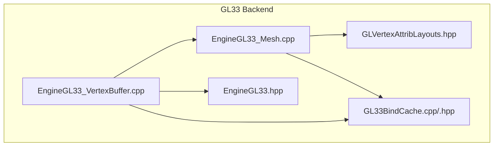
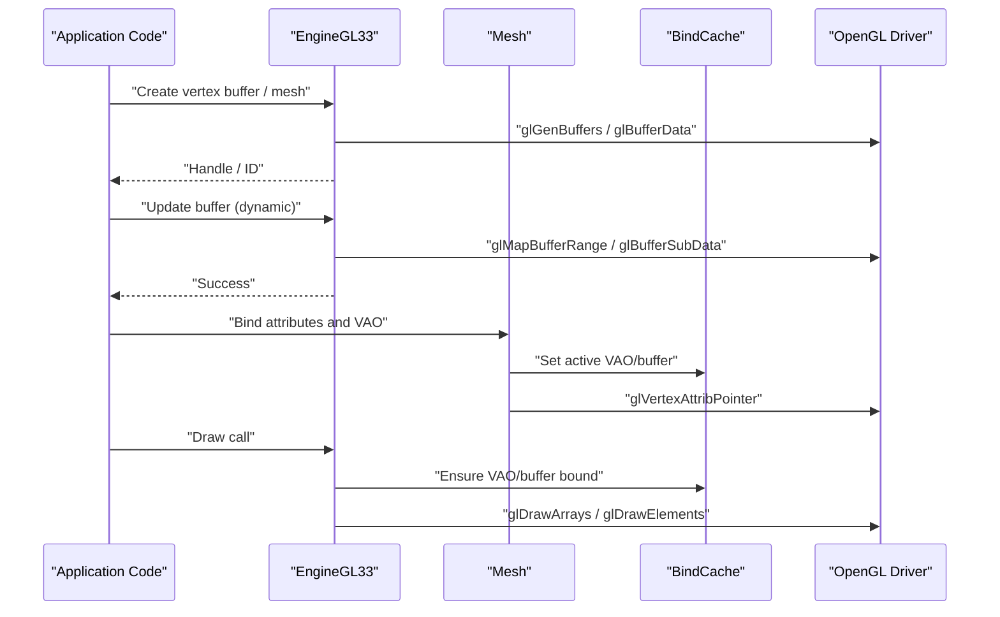
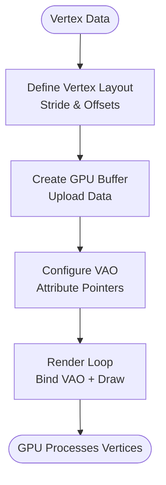
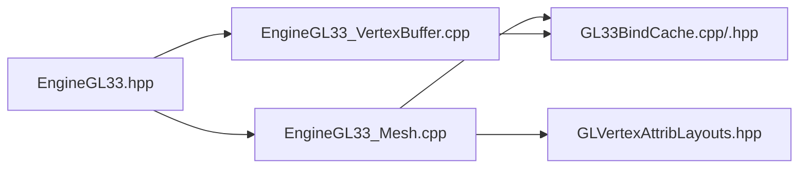

# Vertex Buffer Management

<cite>
**Referenced Files in This Document**
- [EngineGL33_VertexBuffer.cpp](file://engine/PoseidonGL33/EngineGL33_VertexBuffer.cpp)
- [EngineGL33.hpp](file://engine/PoseidonGL33/EngineGL33.hpp)
- [EngineGL33_Mesh.cpp](file://engine/PoseidonGL33/EngineGL33_Mesh.cpp)
- [GLVertexAttribLayouts.hpp](file://engine/PoseidonGL33/GLVertexAttribLayouts.hpp)
- [GL33BindCache.cpp](file://engine/PoseidonGL33/GL33BindCache.cpp)
- [GL33BindCache.hpp](file://engine/PoseidonGL33/GL33BindCache.hpp)
</cite>

## Table of Contents
1. [Introduction](#introduction)
2. [Project Structure](#project-structure)
3. [Core Components](#core-components)
4. [Architecture Overview](#architecture-overview)
5. [Detailed Component Analysis](#detailed-component-analysis)
6. [Dependency Analysis](#dependency-analysis)
7. [Performance Considerations](#performance-considerations)
8. [Troubleshooting Guide](#troubleshooting-guide)
9. [Conclusion](#conclusion)

## Introduction
This document explains the OpenGL vertex buffer management system used by the engine’s GL 3.3 backend. It covers how vertex buffers are created, updated, and destroyed; how data layout and stride are defined; how attributes are bound to shaders; and how VAOs are managed. It also provides guidance for dynamic updates, static optimizations, memory-efficient usage, streaming techniques, and debugging strategies for large datasets.

## Project Structure
The vertex buffer subsystem lives under the GL 3.3 graphics backend. The key files include:
- Engine-level vertex buffer lifecycle and update APIs
- Mesh abstraction that groups buffers and attributes
- Attribute layout definitions for common formats
- A bind cache to minimize state changes during rendering

**Diagram sources**
- [EngineGL33_VertexBuffer.cpp](file://engine/PoseidonGL33/EngineGL33_VertexBuffer.cpp)
- [EngineGL33_Mesh.cpp](file://engine/PoseidonGL33/EngineGL33_Mesh.cpp)
- [GLVertexAttribLayouts.hpp](file://engine/PoseidonGL33/GLVertexAttribLayouts.hpp)
- [GL33BindCache.cpp](file://engine/PoseidonGL33/GL33BindCache.cpp)
- [GL33BindCache.hpp](file://engine/PoseidonGL33/GL33BindCache.hpp)
- [EngineGL33.hpp](file://engine/PoseidonGL33/EngineGL33.hpp)

**Section sources**
- [EngineGL33_VertexBuffer.cpp](file://engine/PoseidonGL33/EngineGL33_VertexBuffer.cpp)
- [EngineGL33_Mesh.cpp](file://engine/PoseidonGL33/EngineGL33_Mesh.cpp)
- [GLVertexAttribLayouts.hpp](file://engine/PoseidonGL33/GLVertexAttribLayouts.hpp)
- [GL33BindCache.cpp](file://engine/PoseidonGL33/GL33BindCache.cpp)
- [GL33BindCache.hpp](file://engine/PoseidonGL33/GL33BindCache.hpp)
- [EngineGL33.hpp](file://engine/PoseidonGL33/EngineGL33.hpp)

## Core Components
- Vertex buffer creation and lifecycle: allocation, initialization, and destruction are handled through engine methods that wrap OpenGL buffer objects.
- Mesh abstraction: a mesh encapsulates one or more vertex buffers and their attribute layouts, enabling efficient batched drawing.
- Attribute layout definitions: standardized descriptions of per-vertex attributes (e.g., position, normal, UV) including component count, type, stride, and offset.
- Bind cache: reduces redundant glBindVertexArray, glBindBuffer, and attribute pointer calls by tracking current state.

Key responsibilities:
- Create GPU buffers with appropriate usage hints (static vs dynamic).
- Upload or update buffer data using efficient mapping/unmapping or orphaning strategies.
- Configure attribute pointers once per mesh via VAOs.
- Minimize state changes during draw loops.

**Section sources**
- [EngineGL33_VertexBuffer.cpp](file://engine/PoseidonGL33/EngineGL33_VertexBuffer.cpp)
- [EngineGL33_Mesh.cpp](file://engine/PoseidonGL33/EngineGL33_Mesh.cpp)
- [GLVertexAttribLayouts.hpp](file://engine/PoseidonGL33/GLVertexAttribLayouts.hpp)
- [GL33BindCache.cpp](file://engine/PoseidonGL33/GL33BindCache.cpp)
- [GL33BindCache.hpp](file://engine/PoseidonGL33/GL33BindCache.hpp)

## Architecture Overview
The vertex buffer system integrates three layers:
- Engine API layer: exposes create/update/draw operations for meshes and buffers.
- Mesh layer: binds attributes to buffers and manages VAO setup.
- GL state caching: ensures minimal driver state transitions.

**Diagram sources**
- [EngineGL33.hpp](file://engine/PoseidonGL33/EngineGL33.hpp)
- [EngineGL33_Mesh.cpp](file://engine/PoseidonGL33/EngineGL33_Mesh.cpp)
- [GL33BindCache.cpp](file://engine/PoseidonGL33/GL33BindCache.cpp)

## Detailed Component Analysis

### Vertex Buffer Lifecycle
- Creation: allocate GPU memory with usage hint based on expected update frequency.
- Initialization: upload initial data once; prefer static storage for immutable geometry.
- Update: use streaming patterns for frequently changing data; avoid frequent full reuploads.
- Destruction: release GPU resources and clear references.

Best practices:
- Use static buffers for geometry that rarely changes.
- Use dynamic or stream buffers for per-frame data like bone transforms or particle positions.
- Prefer partial updates over full reuploads when possible.

**Section sources**
- [EngineGL33_VertexBuffer.cpp](file://engine/PoseidonGL33/EngineGL33_VertexBuffer.cpp)

### Data Layout and Stride Calculations
- Per-vertex structure defines fields such as position, normal, UV, color, etc.
- Stride is the byte distance between consecutive vertices; it equals the size of the vertex struct if tightly packed.
- Offsets are computed from the start of the vertex struct to each attribute field.
- Types must match shader expectations (e.g., vec3 for position, vec2 for UV).

Guidelines:
- Keep attributes aligned to natural boundaries to avoid padding overhead.
- Avoid unnecessary interleaving if attributes are not always used together.
- Validate stride and offsets against actual vertex struct layout.

**Section sources**
- [GLVertexAttribLayouts.hpp](file://engine/PoseidonGL33/GLVertexAttribLayouts.hpp)

### Attribute Binding and VAO Management
- VAO stores the configuration of attribute pointers and buffer bindings.
- Once configured, binding the VAO restores all attribute states efficiently.
- Attribute pointers specify format, stride, offset, and buffer source.

Recommendations:
- Configure VAOs at asset load time; bind only during render.
- Group meshes by similar attribute layouts to reduce VAO switches.
- Reuse VAOs across frames unless attribute layout changes.

**Section sources**
- [EngineGL33_Mesh.cpp](file://engine/PoseidonGL33/EngineGL33_Mesh.cpp)
- [GL33BindCache.cpp](file://engine/PoseidonGL33/GL33BindCache.cpp)

### Dynamic Buffer Updates
Patterns:
- Map-and-update: map a region of the buffer, write new data, unmap.
- Orphaning: allocate a new buffer object each frame and discard old ones to avoid stalls.
- Subdata updates: update only changed portions using glBufferSubData.

Considerations:
- Choose buffer size with headroom for peak updates.
- Avoid mapping buffers every frame if possible; batch updates.
- Monitor CPU-GPU synchronization points to prevent stalls.

**Section sources**
- [EngineGL33_VertexBuffer.cpp](file://engine/PoseidonGL33/EngineGL33_VertexBuffer.cpp)

### Static Buffer Optimization
Patterns:
- Upload once and mark as static; never update after creation.
- Pack multiple meshes into a single large buffer to reduce draw calls.
- Use index buffers to share vertices across primitives.

Benefits:
- Minimal CPU overhead during rendering.
- Better driver optimization due to predictable access patterns.

**Section sources**
- [EngineGL33_Mesh.cpp](file://engine/PoseidonGL33/EngineGL33_Mesh.cpp)

### Memory-Efficient Usage
- Interleave attributes only when beneficial for cache locality.
- Use smaller types where precision allows (e.g., normalized shorts for UVs).
- Avoid redundant copies; compute data directly into GPU-mapped regions when safe.

**Section sources**
- [GLVertexAttribLayouts.hpp](file://engine/PoseidonGL33/GLVertexAttribLayouts.hpp)

### Relationship Between Buffers, Shaders, and Attributes
- Shader programs define attribute locations and types.
- Vertex buffers supply raw data; attribute pointers describe how to interpret it.
- VAO binds buffers to attribute locations once; shaders consume them during vertex processing.

Alignment rules:
- Ensure attribute types and counts match shader declarations.
- Validate that strides and offsets align with vertex struct layout.

**Section sources**
- [EngineGL33_Mesh.cpp](file://engine/PoseidonGL33/EngineGL33_Mesh.cpp)
- [GLVertexAttribLayouts.hpp](file://engine/PoseidonGL33/GLVertexAttribLayouts.hpp)

### Conceptual Overview

[No sources needed since this diagram shows conceptual workflow, not actual code structure]

## Dependency Analysis
The vertex buffer system depends on:
- Engine interface for resource lifecycle
- Mesh abstraction for attribute binding
- Bind cache for state minimization
- OpenGL driver for actual buffer operations

**Diagram sources**
- [EngineGL33.hpp](file://engine/PoseidonGL33/EngineGL33.hpp)
- [EngineGL33_VertexBuffer.cpp](file://engine/PoseidonGL33/EngineGL33_VertexBuffer.cpp)
- [EngineGL33_Mesh.cpp](file://engine/PoseidonGL33/EngineGL33_Mesh.cpp)
- [GLVertexAttribLayouts.hpp](file://engine/PoseidonGL33/GLVertexAttribLayouts.hpp)
- [GL33BindCache.cpp](file://engine/PoseidonGL33/GL33BindCache.cpp)
- [GL33BindCache.hpp](file://engine/PoseidonGL33/GL33BindCache.hpp)

**Section sources**
- [EngineGL33.hpp](file://engine/PoseidonGL33/EngineGL33.hpp)
- [EngineGL33_VertexBuffer.cpp](file://engine/PoseidonGL33/EngineGL33_VertexBuffer.cpp)
- [EngineGL33_Mesh.cpp](file://engine/PoseidonGL33/EngineGL33_Mesh.cpp)
- [GLVertexAttribLayouts.hpp](file://engine/PoseidonGL33/GLVertexAttribLayouts.hpp)
- [GL33BindCache.cpp](file://engine/PoseidonGL33/GL33BindCache.cpp)
- [GL33BindCache.hpp](file://engine/PoseidonGL33/GL33BindCache.hpp)

## Performance Considerations
- Batch draws: group meshes with identical attribute layouts to reduce VAO switches.
- Streamed updates: use ring buffers or double/triple buffering for per-frame data.
- Reduce CPU-GPU sync: avoid forcing immediate flushes; use asynchronous mapping where supported.
- Monitor memory growth: ensure proper destruction and reuse of buffers.
- Profile draw calls: identify excessive state changes or small batches.

[No sources needed since this section provides general guidance]

## Troubleshooting Guide
Common issues:
- Mismatched attribute types or counts between shader and layout cause undefined behavior.
- Incorrect stride or offset leads to corrupted vertex data.
- Frequent buffer updates cause stalls; consider orphaning or larger buffers.
- Unbound VAO or buffer results in no rendering or crashes.

Debugging steps:
- Verify attribute layout matches vertex struct exactly.
- Use GPU debuggers to inspect buffer contents and attribute bindings.
- Log buffer sizes, strides, and update frequencies.
- Isolate problematic meshes by disabling attributes incrementally.

**Section sources**
- [GLVertexAttribLayouts.hpp](file://engine/PoseidonGL33/GLVertexAttribLayouts.hpp)
- [EngineGL33_Mesh.cpp](file://engine/PoseidonGL33/EngineGL33_Mesh.cpp)
- [EngineGL33_VertexBuffer.cpp](file://engine/PoseidonGL33/EngineGL33_VertexBuffer.cpp)

## Conclusion
Effective vertex buffer management hinges on correct data layout, efficient update strategies, and careful VAO usage. By separating static and dynamic data, minimizing state changes, and validating attribute bindings, you can achieve high performance even with large datasets. Use the provided components and patterns to build robust, scalable rendering pipelines.

[No sources needed since this section summarizes without analyzing specific files]