# Culling & Optimization Strategies

<cite>
**Referenced Files in This Document**
- [EngineGL33.hpp](file://engine/PoseidonGL33/EngineGL33.hpp)
- [EngineGL33_Draw.cpp](file://engine/PoseidonGL33/EngineGL33_Draw.cpp)
- [EngineGL33_Queue.cpp](file://engine/PoseidonGL33/EngineGL33_Queue.cpp)
- [EngineGL33_Mesh.cpp](file://engine/PoseidonGL33/EngineGL33_Mesh.cpp)
- [EngineGL33_Shaders.cpp](file://engine/PoseidonGL33/EngineGL33_Shaders.cpp)
- [TextureBankGL33_Core.cpp](file://engine/PoseidonGL33/TextureBankGL33_Core.cpp)
- [TextureBankGL33_Cache.cpp](file://engine/PoseidonGL33/TextureBankGL33_Cache.cpp)
- [GraphicsBackendGL33.cpp](file://engine/PoseidonGL33/GraphicsBackendGL33.cpp)
- [EngineWgpu.hpp](file://engine/WgpuRenderer/EngineWgpu.hpp)
- [EngineWgpu.cpp](file://engine/WgpuRenderer/EngineWgpu.cpp)
- [TerrainWgpu.hpp](file://engine/WgpuRenderer/TerrainWgpu.hpp)
- [TerrainWgpu.cpp](file://engine/WgpuRenderer/TerrainWgpu.cpp)
- [TextureWgpu.hpp](file://engine/WgpuRenderer/TextureWgpu.hpp)
- [TextureBankWgpu.hpp](file://engine/WgpuRenderer/TextureBankWgpu.hpp)
- [wgpu_renderer.hpp](file://engine/WgpuRenderer/include/wgpu_renderer.hpp)
- [gpu-culling-and-depth-plan.md](file://engine/WgpuRenderer/docs/gpu-culling-and-depth-plan.md)
- [rendering-performance-plan.md](file://engine/WgpuRenderer/docs/rendering-performance-plan.md)
- [forward-plus-plan.md](file://engine/WgpuRenderer/docs/forward-plus-plan.md)
- [depth-prepass-plan.md](file://engine/WgpuRenderer/docs/depth-prepass-plan.md)
</cite>

## Table of Contents
1. Introduction
2. Project Structure
3. Core Components
4. Architecture Overview
5. Detailed Component Analysis
6. Dependency Analysis
7. Performance Considerations
8. Troubleshooting Guide
9. Conclusion

## Introduction
This document explains rendering optimization techniques with a focus on frustum culling, occlusion culling, and draw call reduction. It details the culling pipeline from coarse bounding volume checks to fine-grained pixel-level testing, GPU-based culling, instanced rendering, and batching. It also covers texture atlasing, vertex buffer optimization, shader program caching, custom culling algorithms, profiling, platform-specific optimizations, and memory bandwidth considerations. The guidance is grounded in the codebase’s OpenGL 3.3 and WGPU backends and their associated documentation plans.

## Project Structure
The rendering subsystem spans two primary backends:
- OpenGL 3.3 backend under engine/PoseidonGL33
- WGPU backend under engine/WgpuRenderer

Key areas relevant to culling and optimization:
- Rendering engines and queues (draw calls, state management, mesh handling)
- Texture banks and caching
- Backend abstractions for graphics APIs
- WGPU-specific plans for GPU culling, depth prepass, forward+, and performance

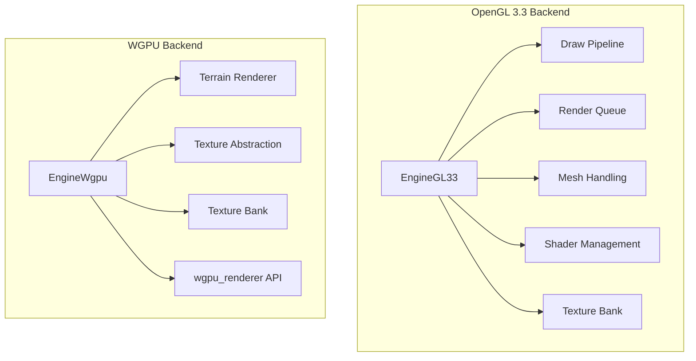

**Diagram sources**
- [EngineGL33.hpp](file://engine/PoseidonGL33/EngineGL33.hpp)
- [EngineGL33_Draw.cpp](file://engine/PoseidonGL33/EngineGL33_Draw.cpp)
- [EngineGL33_Queue.cpp](file://engine/PoseidonGL33/EngineGL33_Queue.cpp)
- [EngineGL33_Mesh.cpp](file://engine/PoseidonGL33/EngineGL33_Mesh.cpp)
- [EngineGL33_Shaders.cpp](file://engine/PoseidonGL33/EngineGL33_Shaders.cpp)
- [TextureBankGL33_Core.cpp](file://engine/PoseidonGL33/TextureBankGL33_Core.cpp)
- [EngineWgpu.hpp](file://engine/WgpuRenderer/EngineWgpu.hpp)
- [TerrainWgpu.hpp](file://engine/WgpuRenderer/TerrainWgpu.hpp)
- [TextureWgpu.hpp](file://engine/WgpuRenderer/TextureWgpu.hpp)
- [TextureBankWgpu.hpp](file://engine/WgpuRenderer/TextureBankWgpu.hpp)
- [wgpu_renderer.hpp](file://engine/WgpuRenderer/include/wgpu_renderer.hpp)

**Section sources**
- [EngineGL33.hpp](file://engine/PoseidonGL33/EngineGL33.hpp)
- [EngineWgpu.hpp](file://engine/WgpuRenderer/EngineWgpu.hpp)

## Core Components
- EngineGL33: Central OpenGL renderer orchestrating draw, queue, mesh, shaders, and textures.
- EngineWgpu: WGPU renderer coordinating terrain, textures, and low-level API usage.
- Texture Banks: Manage texture lifetimes, caching, and atlas-like strategies.
- Render Queues: Batch and sort draw calls to minimize state changes and reduce overhead.
- Shader Management: Cache and reuse compiled programs to avoid recompilation costs.

These components collectively implement coarse-to-fine culling, batching, and resource optimization across both backends.

**Section sources**
- [EngineGL33.hpp](file://engine/PoseidonGL33/EngineGL33.hpp)
- [EngineGL33_Draw.cpp](file://engine/PoseidonGL33/EngineGL33_Draw.cpp)
- [EngineGL33_Queue.cpp](file://engine/PoseidonGL33/EngineGL33_Queue.cpp)
- [EngineGL33_Mesh.cpp](file://engine/PoseidonGL33/EngineGL33_Mesh.cpp)
- [EngineGL33_Shaders.cpp](file://engine/PoseidonGL33/EngineGL33_Shaders.cpp)
- [TextureBankGL33_Core.cpp](file://engine/PoseidonGL33/TextureBankGL33_Core.cpp)
- [EngineWgpu.hpp](file://engine/WgpuRenderer/EngineWgpu.hpp)
- [TerrainWgpu.hpp](file://engine/WgpuRenderer/TerrainWgpu.hpp)
- [TextureWgpu.hpp](file://engine/WgpuRenderer/TextureWgpu.hpp)
- [TextureBankWgpu.hpp](file://engine/WgpuRenderer/TextureBankWgpu.hpp)

## Architecture Overview
The rendering architecture follows a layered approach:
- Scene data produces view-dependent visibility via culling (frustum and occlusion).
- Draw calls are batched and sorted by material/shader to reduce state changes.
- Vertex buffers and index buffers are optimized for cache locality and minimal rebinds.
- Textures are managed through banks that support atlasing and caching.
- Shaders are cached and reused across frames.

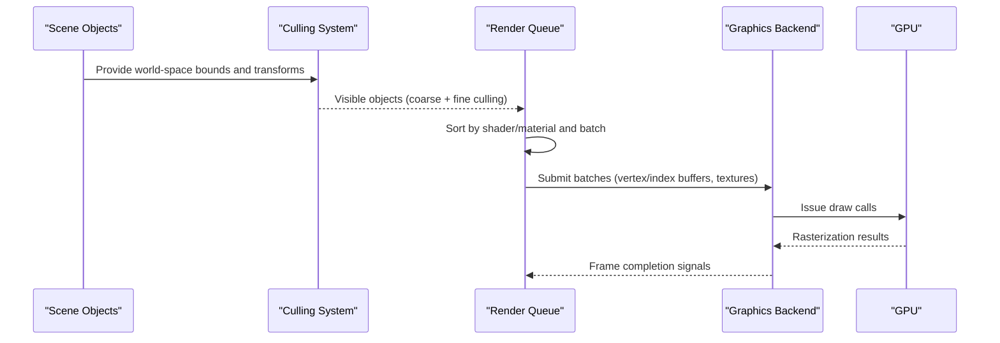

**Diagram sources**
- [EngineGL33_Draw.cpp](file://engine/PoseidonGL33/EngineGL33_Draw.cpp)
- [EngineGL33_Queue.cpp](file://engine/PoseidonGL33/EngineGL33_Queue.cpp)
- [EngineWgpu.cpp](file://engine/WgpuRenderer/EngineWgpu.cpp)

## Detailed Component Analysis

### Frustum Culling Pipeline
Frustum culling eliminates objects outside the camera’s view volume. The pipeline typically includes:
- Coarse check using axis-aligned or oriented bounding boxes against the view frustum planes.
- Fine check using tighter bounding volumes or per-triangle tests when necessary.
- Early-out logic to skip expensive operations for clearly culled objects.

Implementation patterns:
- Bounding volume checks before adding objects to the render queue.
- Hierarchical culling using scene graphs or spatial structures to prune large groups.
- View-space transformations to simplify plane tests.

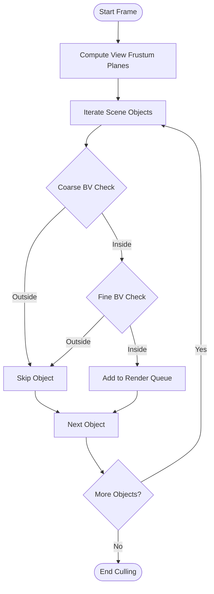

[No sources needed since this diagram shows conceptual workflow, not actual code structure]

**Section sources**
- [EngineGL33_Draw.cpp](file://engine/PoseidonGL33/EngineGL33_Draw.cpp)
- [EngineGL33_Queue.cpp](file://engine/PoseidonGL33/EngineGL33_Queue.cpp)

### Occlusion Culling
Occlusion culling reduces overdraw by discarding objects hidden behind others. Approaches include:
- CPU-based conservative estimates using hierarchical Z-buffer or sample points.
- GPU-based occlusion queries measuring visible pixels per object.
- Hybrid methods combining coarse CPU culling with GPU refinement.

Integration points:
- After frustum culling, apply occlusion queries to further filter candidates.
- Use depth prepass to build auxiliary buffers for occlusion decisions.

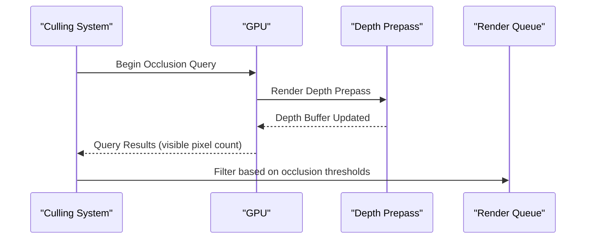

**Diagram sources**
- [depth-prepass-plan.md](file://engine/WgpuRenderer/docs/depth-prepass-plan.md)
- [gpu-culling-and-depth-plan.md](file://engine/WgpuRenderer/docs/gpu-culling-and-depth-plan.md)

**Section sources**
- [gpu-culling-and-depth-plan.md](file://engine/WgpuRenderer/docs/gpu-culling-and-depth-plan.md)
- [depth-prepass-plan.md](file://engine/WgpuRenderer/docs/depth-prepass-plan.md)

### Draw Call Reduction and Batching
Reducing draw calls improves throughput by minimizing CPU-GPU synchronization and state changes. Techniques:
- Merge draw calls for identical shaders and materials.
- Use instanced rendering to draw many copies of the same geometry efficiently.
- Sort objects by shader and material to maximize batching opportunities.

Implementation patterns:
- Build batches in the render queue with shared state.
- Use vertex attribute arrays and index buffers to minimize data duplication.

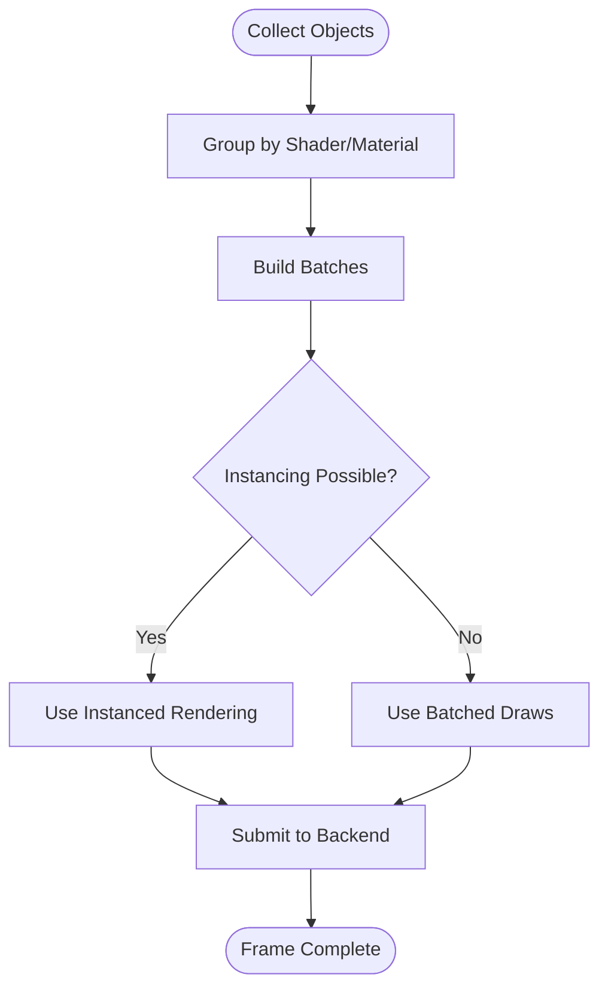

**Diagram sources**
- [EngineGL33_Queue.cpp](file://engine/PoseidonGL33/EngineGL33_Queue.cpp)
- [EngineGL33_Draw.cpp](file://engine/PoseidonGL33/EngineGL33_Draw.cpp)

**Section sources**
- [EngineGL33_Queue.cpp](file://engine/PoseidonGL33/EngineGL33_Queue.cpp)
- [EngineGL33_Draw.cpp](file://engine/PoseidonGL33/EngineGL33_Draw.cpp)

### GPU-Based Culling Techniques
GPU culling leverages compute shaders or fragment shaders to perform visibility tests in parallel. Benefits:
- High throughput for large numbers of objects.
- Reduced CPU overhead and better scalability.

Common approaches:
- Compute shader-based frustum and occlusion culling.
- Fragment shader-based tile-based culling (e.g., Forward+).
- Depth prepass combined with GPU queries for precise occlusion.

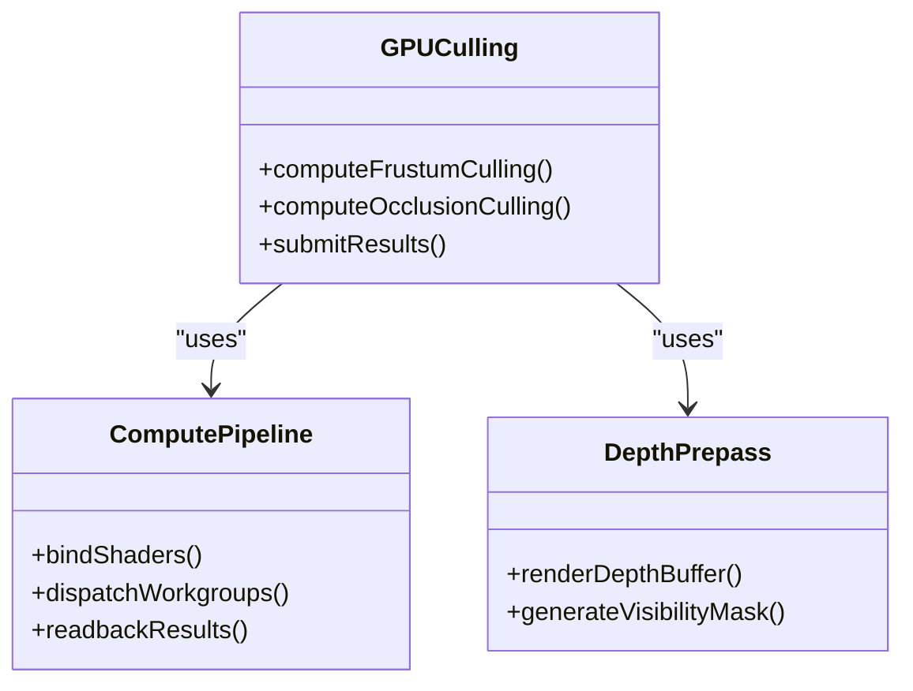

**Diagram sources**
- [gpu-culling-and-depth-plan.md](file://engine/WgpuRenderer/docs/gpu-culling-and-depth-plan.md)
- [forward-plus-plan.md](file://engine/WgpuRenderer/docs/forward-plus-plan.md)

**Section sources**
- [gpu-culling-and-depth-plan.md](file://engine/WgpuRenderer/docs/gpu-culling-and-depth-plan.md)
- [forward-plus-plan.md](file://engine/WgpuRenderer/docs/forward-plus-plan.md)

### Instanced Rendering
Instanced rendering draws multiple instances of the same geometry with per-instance attributes. Key aspects:
- Define instance attributes (position, scale, color) in a separate buffer.
- Use instanced draw calls to render all instances in a single operation.
- Optimize instance buffer layout for efficient GPU access.

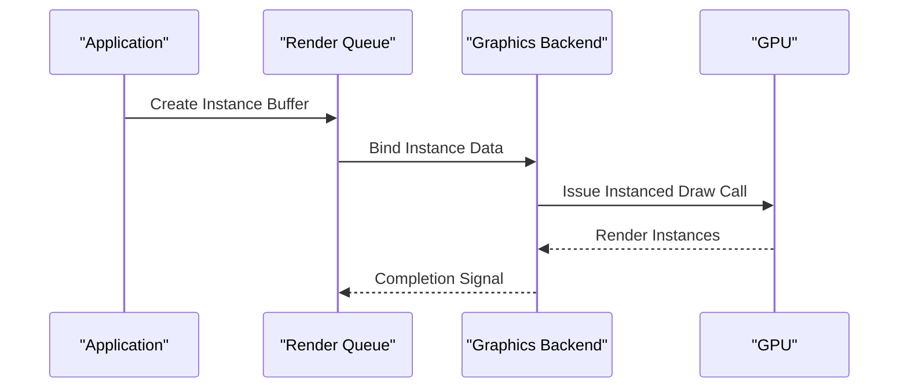

**Diagram sources**
- [EngineGL33_Mesh.cpp](file://engine/PoseidonGL33/EngineGL33_Mesh.cpp)
- [EngineWgpu.cpp](file://engine/WgpuRenderer/EngineWgpu.cpp)

**Section sources**
- [EngineGL33_Mesh.cpp](file://engine/PoseidonGL33/EngineGL33_Mesh.cpp)
- [EngineWgpu.cpp](file://engine/WgpuRenderer/EngineWgpu.cpp)

### Texture Atlasing and Vertex Buffer Optimization
Texture atlasing combines multiple textures into a single large texture to reduce texture binds and improve cache efficiency. Vertex buffer optimization focuses on:
- Minimizing vertex format size and padding.
- Using index buffers to share vertices across primitives.
- Aligning data for optimal memory access patterns.

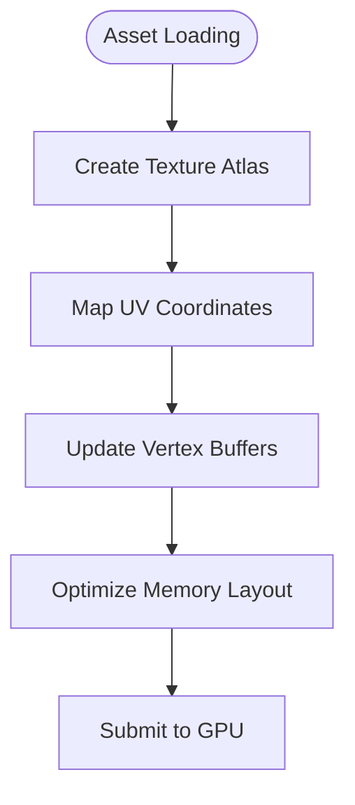

**Diagram sources**
- [TextureBankGL33_Core.cpp](file://engine/PoseidonGL33/TextureBankGL33_Core.cpp)
- [TextureBankWgpu.hpp](file://engine/WgpuRenderer/TextureBankWgpu.hpp)

**Section sources**
- [TextureBankGL33_Core.cpp](file://engine/PoseidonGL33/TextureBankGL33_Core.cpp)
- [TextureBankWgpu.hpp](file://engine/WgpuRenderer/TextureBankWgpu.hpp)

### Shader Program Caching
Shader caching avoids recompiling programs every frame. Strategies:
- Compile shaders once and store them in a cache.
- Use unique keys based on shader source and defines.
- Load cached binaries when available to speed up startup.

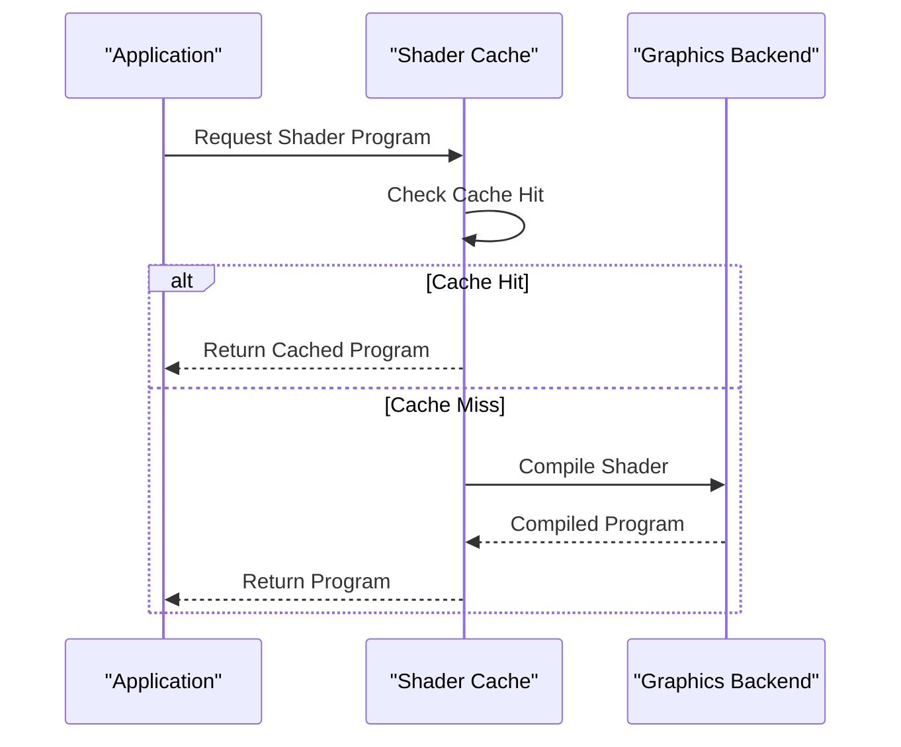

**Diagram sources**
- [EngineGL33_Shaders.cpp](file://engine/PoseidonGL33/EngineGL33_Shaders.cpp)
- [wgpu_renderer.hpp](file://engine/WgpuRenderer/include/wgpu_renderer.hpp)

**Section sources**
- [EngineGL33_Shaders.cpp](file://engine/PoseidonGL33/EngineGL33_Shaders.cpp)
- [wgpu_renderer.hpp](file://engine/WgpuRenderer/include/wgpu_renderer.hpp)

### Custom Culling Algorithms
Implementing custom culling allows tailored visibility tests for specific use cases. Steps:
- Define custom bounding volumes or sampling strategies.
- Integrate with the render queue to filter objects early.
- Profile and tune parameters for performance.

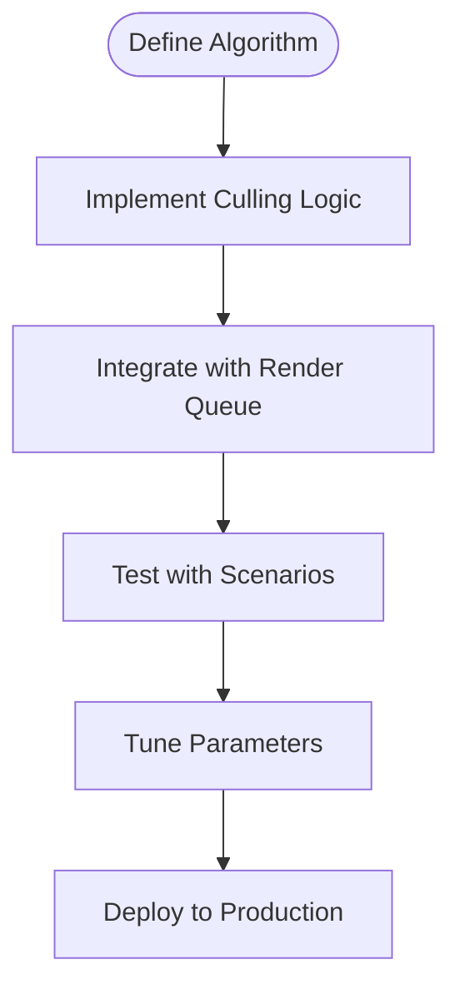

[No sources needed since this diagram shows conceptual workflow, not actual code structure]

**Section sources**
- [EngineGL33_Draw.cpp](file://engine/PoseidonGL33/EngineGL33_Draw.cpp)
- [EngineWgpu.cpp](file://engine/WgpuRenderer/EngineWgpu.cpp)

### Profiling Rendering Performance
Profiling identifies bottlenecks in culling, batching, and GPU utilization. Tools and metrics:
- Use GPU profilers (RenderDoc, PIX) to analyze draw calls and overdraw.
- Monitor CPU time spent in culling and queue building.
- Track texture bind rates and shader switches.

Best practices:
- Profile different scenes to understand variability.
- Focus on high-impact areas like large meshes and frequent state changes.

**Section sources**
- [rendering-performance-plan.md](file://engine/WgpuRenderer/docs/rendering-performance-plan.md)

## Dependency Analysis
The rendering system depends on well-defined interfaces between components:
- Engines depend on backends for API-specific operations.
- Texture banks abstract texture management across platforms.
- Render queues coordinate culling results and batching.

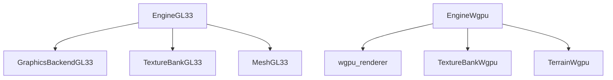

**Diagram sources**
- [GraphicsBackendGL33.cpp](file://engine/PoseidonGL33/GraphicsBackendGL33.cpp)
- [wgpu_renderer.hpp](file://engine/WgpuRenderer/include/wgpu_renderer.hpp)
- [TextureBankGL33_Core.cpp](file://engine/PoseidonGL33/TextureBankGL33_Core.cpp)
- [TextureBankWgpu.hpp](file://engine/WgpuRenderer/TextureBankWgpu.hpp)
- [EngineGL33_Mesh.cpp](file://engine/PoseidonGL33/EngineGL33_Mesh.cpp)
- [TerrainWgpu.hpp](file://engine/WgpuRenderer/TerrainWgpu.hpp)

**Section sources**
- [GraphicsBackendGL33.cpp](file://engine/PoseidonGL33/GraphicsBackendGL33.cpp)
- [wgpu_renderer.hpp](file://engine/WgpuRenderer/include/wgpu_renderer.hpp)

## Performance Considerations
- Prioritize reducing draw calls through batching and instancing.
- Minimize texture binds using atlases and bindless techniques where possible.
- Optimize vertex formats and buffer layouts for memory bandwidth.
- Use GPU culling to offload visibility tests from the CPU.
- Profile regularly to identify and address bottlenecks.

[No sources needed since this section provides general guidance]

## Troubleshooting Guide
Common issues and solutions:
- Excessive draw calls: Increase batching and use instanced rendering.
- High overdraw: Implement occlusion culling and depth prepass.
- Shader compilation stalls: Enable shader caching and preload programs.
- Texture binding overhead: Use atlases and reduce state changes.

Debugging tips:
- Use GPU profilers to visualize draw call distribution.
- Log culling statistics to monitor effectiveness.
- Test with simplified scenes to isolate problems.

**Section sources**
- [EngineGL33_Draw.cpp](file://engine/PoseidonGL33/EngineGL33_Draw.cpp)
- [EngineWgpu.cpp](file://engine/WgpuRenderer/EngineWgpu.cpp)

## Conclusion
Effective rendering optimization requires a multi-layered approach combining frustum and occlusion culling, draw call reduction, and resource management. By leveraging GPU-based techniques, instanced rendering, and careful profiling, significant performance gains can be achieved across platforms. The codebase provides robust foundations in both OpenGL and WGPU backends to implement these strategies effectively.

[No sources needed since this section summarizes without analyzing specific files]