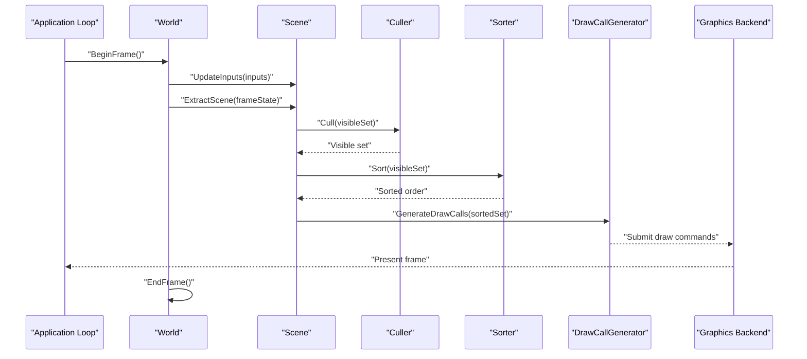
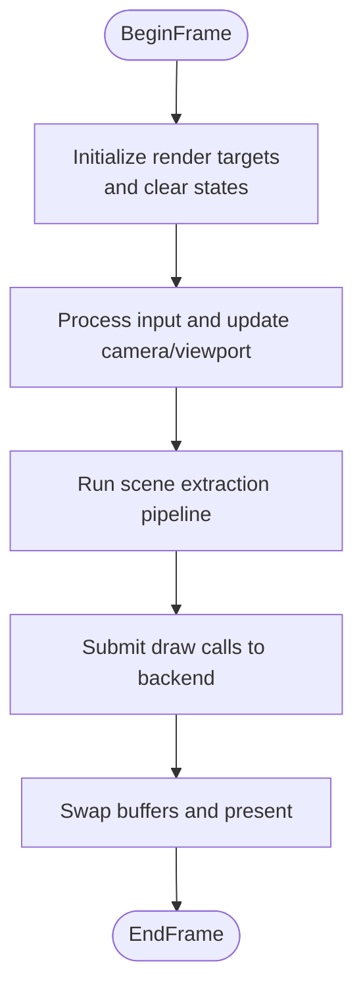
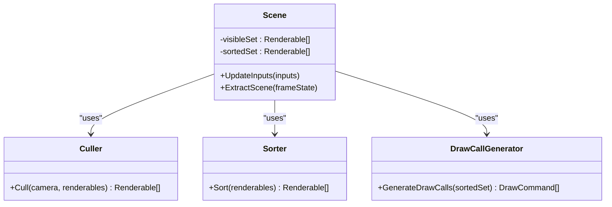
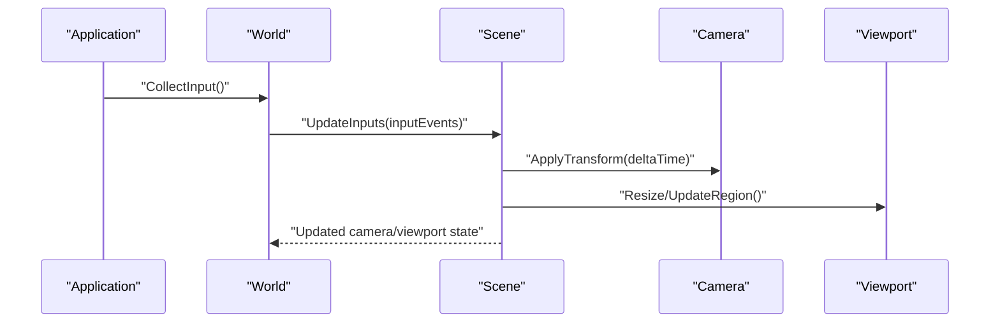
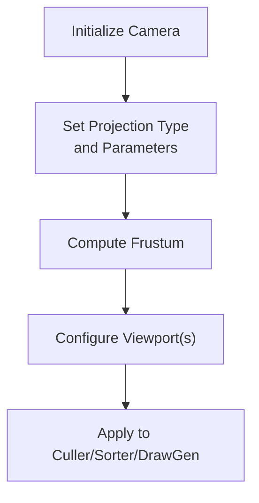
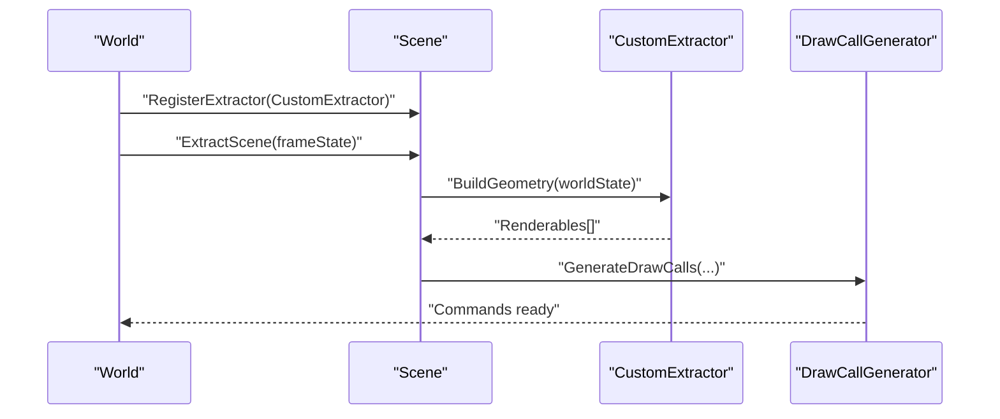
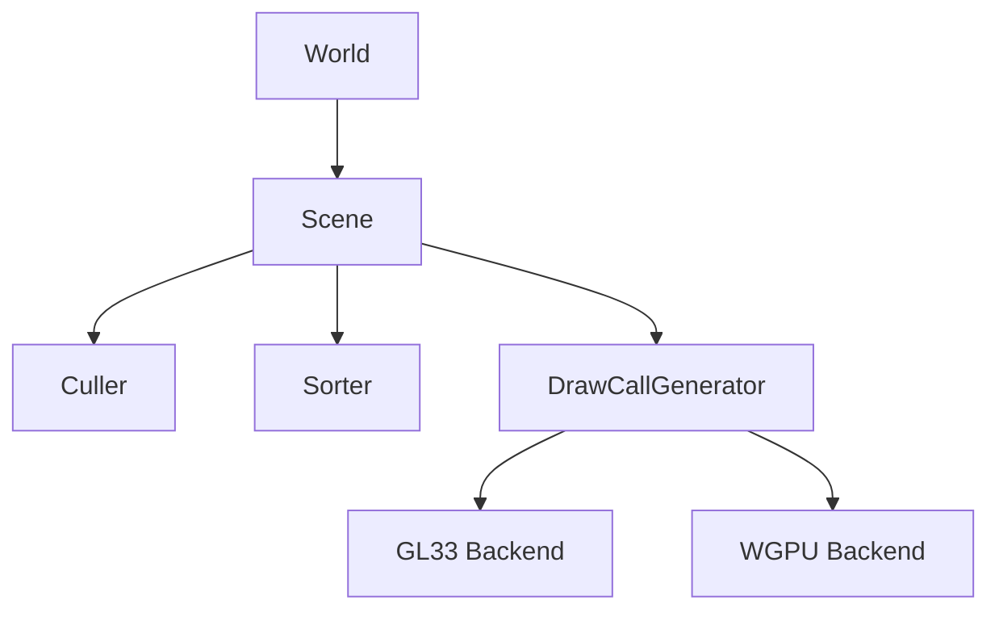

# Frame Construction & Scene Extraction

<cite>
**Referenced Files in This Document**
- [World.hpp](file://engine/Poseidon/World/World.hpp)
- [World.cpp](file://engine/Poseidon/World/World.cpp)
- [WorldImpl.cpp](file://engine/Poseidon/World/WorldImpl.cpp)
- [Scene.hpp](file://engine/Poseidon/World/Scene/Scene.hpp)
- [Scene.cpp](file://engine/Poseidon/World/Scene/Scene.cpp)
- [Renderable.hpp](file://engine/Poseidon/World/Scene/Renderable.hpp)
- [Culler.hpp](file://engine/Poseidon/World/Scene/Culler.hpp)
- [Sorter.hpp](file://engine/Poseidon/World/Scene/Sorter.hpp)
- [DrawCallGenerator.hpp](file://engine/Poseidon/World/Scene/DrawCallGenerator.hpp)
- [Camera.hpp](file://engine/Poseidon/World/Scene/Camera.hpp)
- [Viewport.hpp](file://engine/Poseidon/World/Scene/Viewport.hpp)
- [EngineGL33_Draw.cpp](file://engine/PoseidonGL33/EngineGL33_Draw.cpp)
- [EngineWgpu.cpp](file://engine/WgpuRenderer/EngineWgpu.cpp)
- [GraphicsBackendGL33.cpp](file://engine/PoseidonGL33/GraphicsBackendGL33.cpp)
- [GraphicsBackendWgpu.cpp](file://engine/WgpuRenderer/GraphicsBackendWgpu.cpp)
</cite>

## Table of Contents
1. [Introduction](#introduction)
2. [Project Structure](#project-structure)
3. [Core Components](#core-components)
4. [Architecture Overview](#architecture-overview)
5. [Detailed Component Analysis](#detailed-component-analysis)
6. [Dependency Analysis](#dependency-analysis)
7. [Performance Considerations](#performance-considerations)
8. [Troubleshooting Guide](#troubleshooting-guide)
9. [Conclusion](#conclusion)

## Introduction
This document explains the frame construction and scene extraction system used to turn world state into renderable geometry each frame. It covers how frames are created, managed, and destroyed; how scenes are extracted from the world; and the BuildFrame pipeline including culling, sorting, and draw call generation. It also documents scene inputs handling, camera setup, viewport management, examples for custom extractors and frame modifications, and performance considerations for large scenes and dynamic updates.

## Project Structure
The frame construction and scene extraction logic spans the World subsystem (scene data structures and extraction), the rendering backends (GL33 and WGPU), and the engine glue that coordinates per-frame work. Key areas:
- World and Scene: define entities, renderables, cameras, viewports, and the scene extraction pipeline.
- Culler/Sorter/DrawCallGenerator: implement the core BuildFrame stages.
- Graphics backends: consume the generated draw calls and submit them to the GPU.

```mermaid
graph TB
subgraph "World"
World["World"]
Scene["Scene"]
Renderable["Renderable"]
Camera["Camera"]
Viewport["Viewport"]
Culler["Culler"]
Sorter["Sorter"]
DrawGen["DrawCallGenerator"]
end
subgraph "Rendering Backends"
GL33["GL33 Backend"]
WGPU["WGPU Backend"]
end
World --> Scene
Scene --> Renderable
Scene --> Camera
Scene --> Viewport
Scene --> Culler
Scene --> Sorter
Scene --> DrawGen
DrawGen --> GL33
DrawGen --> WGPU
```

[No sources needed since this diagram shows conceptual workflow, not actual code structure]

## Core Components
- World: owns the active scene and orchestrates per-frame updates and rendering coordination.
- Scene: holds the collection of renderable objects, cameras, and viewports; exposes extraction APIs.
- Renderable: represents a piece of geometry with transform, material, and visibility flags.
- Camera: defines projection and view matrices, frustum, and sampling parameters.
- Viewport: maps a region of the screen to a camera’s output, enabling multi-pass or split-screen.
- Culler: removes off-screen or occluded renderables based on camera frustum and LOD rules.
- Sorter: orders renderables by depth/material to minimize state changes and overdraw.
- DrawCallGenerator: converts sorted renderables into backend-specific draw commands.

**Section sources**
- [World.hpp:1-200](file://engine/Poseidon/World/World.hpp#L1-L200)
- [Scene.hpp:1-200](file://engine/Poseidon/World/Scene/Scene.hpp#L1-L200)
- [Renderable.hpp:1-150](file://engine/Poseidon/World/Scene/Renderable.hpp#L1-L150)
- [Camera.hpp:1-150](file://engine/Poseidon/World/Scene/Camera.hpp#L1-L150)
- [Viewport.hpp:1-150](file://engine/Poseidon/World/Scene/Viewport.hpp#L1-L150)
- [Culler.hpp:1-150](file://engine/Poseidon/World/Scene/Culler.hpp#L1-L150)
- [Sorter.hpp:1-150](file://engine/Poseidon/World/Scene/Sorter.hpp#1-L150)
- [DrawCallGenerator.hpp:1-150](file://engine/Poseidon/World/Scene/DrawCallGenerator.hpp#L1-L150)

## Architecture Overview
The per-frame lifecycle is driven by the World, which updates simulation, triggers scene extraction, and delegates drawing to the selected graphics backend. The scene extraction pipeline transforms world state into draw calls via culling, sorting, and command generation.



**Diagram sources**
- [World.cpp:1-300](file://engine/Poseidon/World/World.cpp#L1-L300)
- [Scene.cpp:1-300](file://engine/Poseidon/World/Scene/Scene.cpp#L1-L300)
- [EngineGL33_Draw.cpp:1-200](file://engine/PoseidonGL33/EngineGL33_Draw.cpp#L1-L200)
- [EngineWgpu.cpp:1-200](file://engine/WgpuRenderer/EngineWgpu.cpp#L1-L200)

**Section sources**
- [World.cpp:1-300](file://engine/Poseidon/World/World.cpp#L1-L300)
- [Scene.cpp:1-300](file://engine/Poseidon/World/Scene/Scene.cpp#L1-L300)

## Detailed Component Analysis

### Frame Lifecycle: Creation, Management, Destruction
- Creation: BeginFrame initializes per-frame resources, clears buffers, and prepares the camera and viewport state.
- Management: UpdateInputs processes input events and updates camera/viewports; ExtractScene builds the visible geometry set.
- Destruction: EndFrame finalizes draw submission, swaps buffers, and releases per-frame allocations.



**Section sources**
- [World.cpp:1-300](file://engine/Poseidon/World/World.cpp#L1-L300)
- [EngineGL33_Draw.cpp:1-200](file://engine/PoseidonGL33/EngineGL33_Draw.cpp#L1-L200)
- [EngineWgpu.cpp:1-200](file://engine/WgpuRenderer/EngineWgpu.cpp#L1-L200)

### Scene Extraction Pipeline: Culling, Sorting, Draw Call Generation
- Culling: Uses camera frustum and optional occlusion hints to prune invisible renderables.
- Sorting: Orders by material, depth, and batching criteria to reduce state changes.
- Draw Call Generation: Converts sorted renderables into backend-specific commands (e.g., vertex buffers, indices, shader bindings).



**Diagram sources**
- [Scene.cpp:1-300](file://engine/Poseidon/World/Scene/Scene.cpp#L1-L300)
- [Culler.hpp:1-150](file://engine/Poseidon/World/Scene/Culler.hpp#L1-L150)
- [Sorter.hpp:1-150](file://engine/Poseidon/World/Scene/Sorter.hpp#L1-L150)
- [DrawCallGenerator.hpp:1-150](file://engine/Poseidon/World/Scene/DrawCallGenerator.hpp#L1-L150)

**Section sources**
- [Scene.cpp:1-300](file://engine/Poseidon/World/Scene/Scene.cpp#L1-L300)
- [Culler.hpp:1-150](file://engine/Poseidon/World/Scene/Culler.hpp#L1-L150)
- [Sorter.hpp:1-150](file://engine/Poseidon/World/Scene/Sorter.hpp#L1-L150)
- [DrawCallGenerator.hpp:1-150](file://engine/Poseidon/World/Scene/DrawCallGenerator.hpp#L1-L150)

### Scene Inputs Handling
- Input types include mouse, keyboard, gamepad, and application-level toggles.
- Inputs update camera position/orientation, field-of-view, and viewport regions.
- Input processing occurs before scene extraction to ensure consistent frame state.



**Section sources**
- [World.cpp:1-300](file://engine/Poseidon/World/World.cpp#L1-L300)
- [Camera.hpp:1-150](file://engine/Poseidon/World/Scene/Camera.hpp#L1-L150)
- [Viewport.hpp:1-150](file://engine/Poseidon/World/Scene/Viewport.hpp#L1-L150)

### Camera Setup and Viewport Management
- Camera configuration includes projection type (perspective/orthographic), near/far planes, and aspect ratio.
- Viewport management supports full-screen and split-screen rendering, scissor testing, and per-viewport clear colors.
- Changes propagate to culling and draw generation to maintain correctness.



**Section sources**
- [Camera.hpp:1-150](file://engine/Poseidon/World/Scene/Camera.hpp#L1-L150)
- [Viewport.hpp:1-150](file://engine/Poseidon/World/Scene/Viewport.hpp#L1-L150)

### Custom Scene Extractors and Frame Modifications
- Custom extractors can be registered to transform world state into renderables with specific rules (e.g., terrain tiles, foliage instances).
- Frame modifications allow injecting additional passes (e.g., post-processing overlays) or altering draw call ordering.
- Integration points exist in the scene extraction pipeline to insert custom stages without breaking core flow.



**Section sources**
- [Scene.cpp:1-300](file://engine/Poseidon/World/Scene/Scene.cpp#L1-L300)
- [DrawCallGenerator.hpp:1-150](file://engine/Poseidon/World/Scene/DrawCallGenerator.hpp#L1-L150)

## Dependency Analysis
The scene extraction pipeline depends on well-defined interfaces between components, minimizing coupling while allowing extensibility.



**Diagram sources**
- [World.cpp:1-300](file://engine/Poseidon/World/World.cpp#L1-L300)
- [Scene.cpp:1-300](file://engine/Poseidon/World/Scene/Scene.cpp#L1-L300)
- [GraphicsBackendGL33.cpp:1-200](file://engine/PoseidonGL33/GraphicsBackendGL33.cpp#L1-L200)
- [GraphicsBackendWgpu.cpp:1-200](file://engine/WgpuRenderer/GraphicsBackendWgpu.cpp#L1-L200)

**Section sources**
- [World.cpp:1-300](file://engine/Poseidon/World/World.cpp#L1-L300)
- [Scene.cpp:1-300](file://engine/Poseidon/World/Scene/Scene.cpp#L1-L300)
- [GraphicsBackendGL33.cpp:1-200](file://engine/PoseidonGL33/GraphicsBackendGL33.cpp#L1-L200)
- [GraphicsBackendWgpu.cpp:1-200](file://engine/WgpuRenderer/GraphicsBackendWgpu.cpp#L1-L200)

## Performance Considerations
- Culling efficiency: Use tight bounding volumes and hierarchical culling to reduce overdraw and CPU cost.
- Sorting strategy: Batch by material and depth to minimize state changes; consider tile-based or bucket sorting for large scenes.
- Dynamic updates: Incrementally update only changed renderables; avoid rebuilding entire visible sets every frame.
- Memory locality: Store renderables in contiguous arrays to improve cache performance during culling/sorting.
- Backend optimization: Leverage instancing and indirect draws where supported by GL33/WGPU backends.

[No sources needed since this section provides general guidance]

## Troubleshooting Guide
- Missing geometry: Verify culling thresholds and camera frustum settings; check renderable bounds and visibility flags.
- Incorrect sorting: Inspect depth sorting keys and material grouping; ensure correct near/far plane values.
- Draw call failures: Validate buffer bindings and shader compatibility; confirm backend-specific constraints.
- Performance regressions: Profile culling/sorting phases; reduce per-frame allocations and batch sizes.

**Section sources**
- [EngineGL33_Draw.cpp:1-200](file://engine/PoseidonGL33/EngineGL33_Draw.cpp#L1-L200)
- [EngineWgpu.cpp:1-200](file://engine/WgpuRenderer/EngineWgpu.cpp#L1-L200)

## Conclusion
The frame construction and scene extraction system provides a modular, extensible pipeline for converting world state into efficient draw calls. By separating concerns across culling, sorting, and command generation, it supports both static and dynamic scenes at scale. Proper camera and viewport management, along with careful performance tuning, ensures smooth rendering even in complex environments.

[No sources needed since this section summarizes without analyzing specific files]