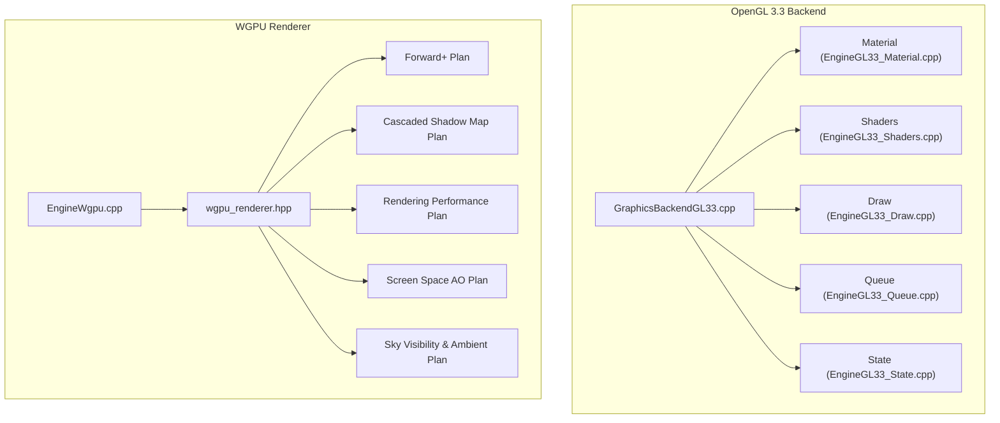
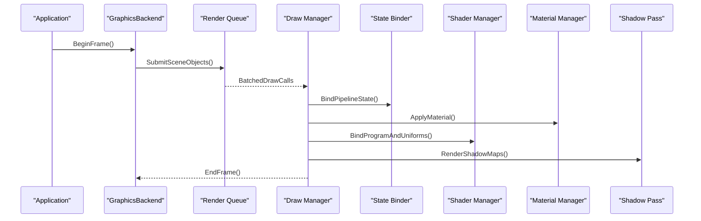
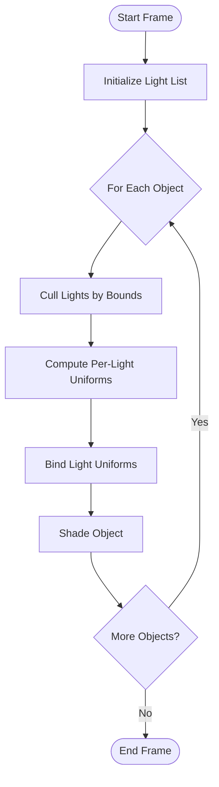
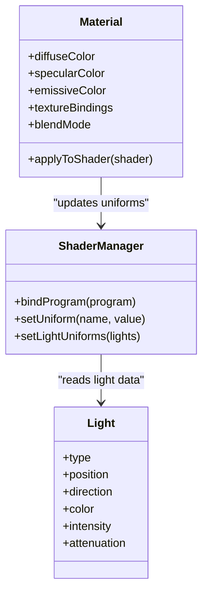
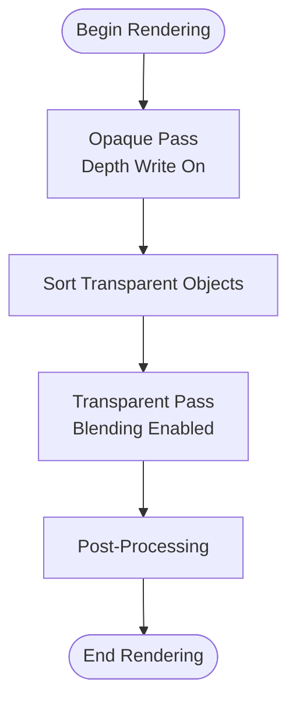
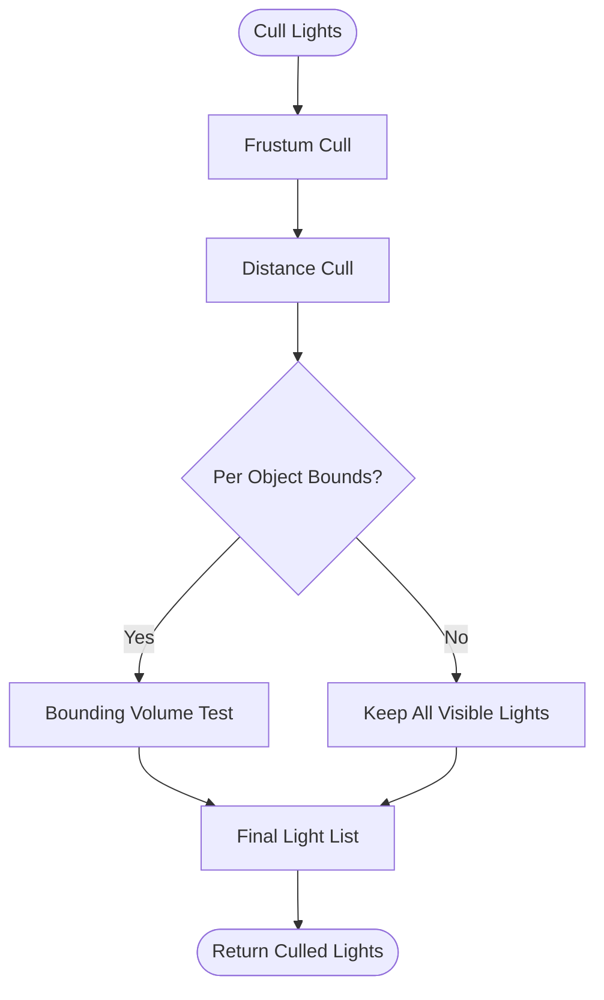
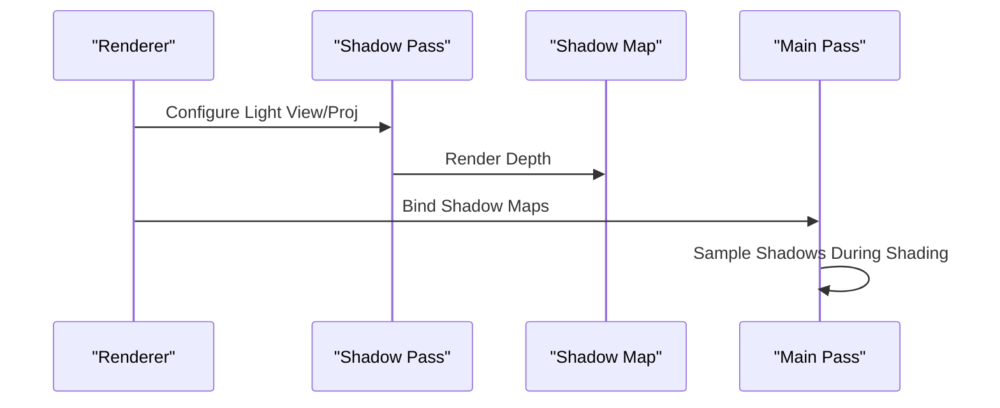
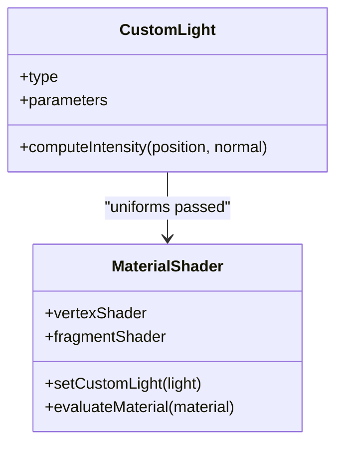
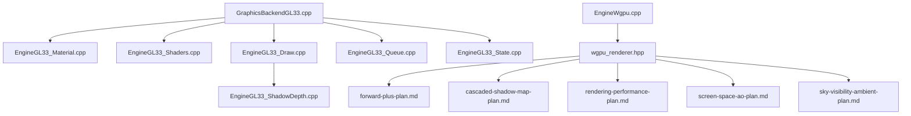

# Lighting System

<cite>
**Referenced Files in This Document**
- [EngineGL33_Material.cpp](file://engine/PoseidonGL33/EngineGL33_Material.cpp)
- [EngineGL33_Shaders.cpp](file://engine/PoseidonGL33/EngineGL33_Shaders.cpp)
- [EngineGL33_ShadowDepth.cpp](file://engine/PoseidonGL33/EngineGL33_ShadowDepth.cpp)
- [EngineGL33_Draw.cpp](file://engine/PoseidonGL33/EngineGL33_Draw.cpp)
- [EngineGL33_Queue.cpp](file://engine/PoseidonGL33/EngineGL33_Queue.cpp)
- [EngineGL33_State.cpp](file://engine/PoseidonGL33/EngineGL33_State.cpp)
- [GraphicsBackendGL33.cpp](file://engine/PoseidonGL33/GraphicsBackendGL33.cpp)
- [EngineWgpu.cpp](file://engine/WgpuRenderer/EngineWgpu.cpp)
- [wgpu_renderer.hpp](file://engine/WgpuRenderer/include/wgpu_renderer.hpp)
- [forward-plus-plan.md](file://engine/WgpuRenderer/docs/forward-plus-plan.md)
- [cascaded-shadow-map-plan.md](file://engine/WgpuRenderer/docs/cascaded-shadow-map-plan.md)
- [rendering-performance-plan.md](file://engine/WgpuRenderer/docs/rendering-performance-plan.md)
- [screen-space-ao-plan.md](file://engine/WgpuRenderer/docs/screen-space-ao-plan.md)
- [sky-visibility-ambient-plan.md](file://engine/WgpuRenderer/docs/sky-visibility-ambient-plan.md)
</cite>

## Table of Contents
1. [Introduction](#introduction)
2. [Project Structure](#project-structure)
3. [Core Components](#core-components)
4. [Architecture Overview](#architecture-overview)
5. [Detailed Component Analysis](#detailed-component-analysis)
6. [Dependency Analysis](#dependency-analysis)
7. [Performance Considerations](#performance-considerations)
8. [Troubleshooting Guide](#troubleshooting-guide)
9. [Conclusion](#conclusion)
10. [Appendices](#appendices)

## Introduction
This document explains the lighting system architecture, covering light types, intensity calculations, material interactions, and rendering pipelines across the OpenGL 3.3 and WGPU backends. It details how directional, point, spot, and ambient lights are managed; how materials expose diffuse, specular, and emissive properties; and how transparency, culling, and shadows are handled. It also provides guidance for custom light types and shaders, performance optimization techniques, and debugging tools for visual inspection.

## Project Structure
The lighting system spans two primary graphics backends:
- OpenGL 3.3 backend under engine/PoseidonGL33
- WGPU renderer under engine/WgpuRenderer

Key areas:
- Material and shader management
- Drawing and queueing
- Shadow depth passes
- Backend entry points and state binding
- WGPU design plans for forward+, shadow maps, SSAO, HDR, and ambient sky

**Diagram sources**
- [GraphicsBackendGL33.cpp](file://engine/PoseidonGL33/GraphicsBackendGL33.cpp)
- [EngineGL33_Material.cpp](file://engine/PoseidonGL33/EngineGL33_Material.cpp)
- [EngineGL33_Shaders.cpp](file://engine/PoseidonGL33/EngineGL33_Shaders.cpp)
- [EngineGL33_Draw.cpp](file://engine/PoseidonGL33/EngineGL33_Draw.cpp)
- [EngineGL33_Queue.cpp](file://engine/PoseidonGL33/EngineGL33_Queue.cpp)
- [EngineGL33_State.cpp](file://engine/PoseidonGL33/EngineGL33_State.cpp)
- [EngineWgpu.cpp](file://engine/WgpuRenderer/EngineWgpu.cpp)
- [wgpu_renderer.hpp](file://engine/WgpuRenderer/include/wgpu_renderer.hpp)
- [forward-plus-plan.md](file://engine/WgpuRenderer/docs/forward-plus-plan.md)
- [cascaded-shadow-map-plan.md](file://engine/WgpuRenderer/docs/cascaded-shadow-map-plan.md)
- [rendering-performance-plan.md](file://engine/WgpuRenderer/docs/rendering-performance-plan.md)
- [screen-space-ao-plan.md](file://engine/WgpuRenderer/docs/screen-space-ao-plan.md)
- [sky-visibility-ambient-plan.md](file://engine/WgpuRenderer/docs/sky-visibility-ambient-plan.md)

**Section sources**
- [GraphicsBackendGL33.cpp](file://engine/PoseidonGL33/GraphicsBackendGL33.cpp)
- [EngineWgpu.cpp](file://engine/WgpuRenderer/EngineWgpu.cpp)
- [wgpu_renderer.hpp](file://engine/WgpuRenderer/include/wgpu_renderer.hpp)

## Core Components
- Material system: encapsulates texture bindings, blending modes, and per-material flags used by shaders to compute diffuse/specular/emissive contributions.
- Shader system: compiles and binds shader programs with uniforms for light parameters, matrices, and material properties.
- Draw pipeline: batches draw calls, applies state changes, and submits geometry to the GPU.
- Queue system: organizes render tasks, sorts by material/shader, and manages batching.
- State manager: tracks and caches GPU state to minimize redundant bindings.
- Shadow pass: renders depth from light views into shadow maps for occlusion.

These components collaborate to implement a forward-rendered lighting model with support for multiple light types and material responses.

**Section sources**
- [EngineGL33_Material.cpp](file://engine/PoseidonGL33/EngineGL33_Material.cpp)
- [EngineGL33_Shaders.cpp](file://engine/PoseidonGL33/EngineGL33_Shaders.cpp)
- [EngineGL33_Draw.cpp](file://engine/PoseidonGL33/EngineGL33_Draw.cpp)
- [EngineGL33_Queue.cpp](file://engine/PoseidonGL33/EngineGL33_Queue.cpp)
- [EngineGL33_State.cpp](file://engine/PoseidonGL33/EngineGL33_State.cpp)
- [EngineGL33_ShadowDepth.cpp](file://engine/PoseidonGL33/EngineGL33_ShadowDepth.cpp)

## Architecture Overview
The rendering pipeline is organized around a forward path where each object is shaded with relevant lights. The OpenGL backend implements this via material and shader binding, while the WGPU backend follows a planned Forward+ approach with cascaded shadow maps and optional screen-space effects.

**Diagram sources**
- [GraphicsBackendGL33.cpp](file://engine/PoseidonGL33/GraphicsBackendGL33.cpp)
- [EngineGL33_Draw.cpp](file://engine/PoseidonGL33/EngineGL33_Draw.cpp)
- [EngineGL33_Queue.cpp](file://engine/PoseidonGL33/EngineGL33_Queue.cpp)
- [EngineGL33_State.cpp](file://engine/PoseidonGL33/EngineGL33_State.cpp)
- [EngineGL33_Shaders.cpp](file://engine/PoseidonGL33/EngineGL33_Shaders.cpp)
- [EngineGL33_Material.cpp](file://engine/PoseidonGL33/EngineGL33_Material.cpp)
- [EngineGL33_ShadowDepth.cpp](file://engine/PoseidonGL33/EngineGL33_ShadowDepth.cpp)

## Detailed Component Analysis

### Light Types and Management
- Directional lights: infinite direction, uniform illumination across the scene.
- Point lights: radiate from a position with attenuation based on distance.
- Spot lights: cone-shaped emission with inner/outer angles and distance attenuation.
- Ambient lighting: base illumination applied uniformly or derived from environment.

Light management typically involves:
- Maintaining an active list of lights per frame
- Computing per-light uniforms (position, direction, color, intensity, falloff)
- Culling lights per object using bounding volumes
- Sorting or grouping lights to optimize shader branching

**Diagram sources**
- [EngineGL33_Draw.cpp](file://engine/PoseidonGL33/EngineGL33_Draw.cpp)
- [EngineGL33_Shaders.cpp](file://engine/PoseidonGL33/EngineGL33_Shaders.cpp)

**Section sources**
- [EngineGL33_Shaders.cpp](file://engine/PoseidonGL33/EngineGL33_Shaders.cpp)
- [EngineGL33_Draw.cpp](file://engine/PoseidonGL33/EngineGL33_Draw.cpp)

### Intensity Calculations and Material Interactions
Materials define:
- Diffuse reflectance (color and texture)
- Specular response (shininess and highlight intensity)
- Emissive contribution (self-illumination)

Intensity calculation combines:
- Ambient term (global or sky-derived)
- Summation over visible lights (directional, point, spot)
- Diffuse term via dot product of normal and light direction
- Specular term via half-vector or reflection-based models
- Emissive term added directly to final color

Transparency handling:
- Alpha blending enabled for transparent materials
- Depth sorting or order-independent transparency strategies
- Separate opaque and transparent passes to preserve depth integrity

**Diagram sources**
- [EngineGL33_Material.cpp](file://engine/PoseidonGL33/EngineGL33_Material.cpp)
- [EngineGL33_Shaders.cpp](file://engine/PoseidonGL33/EngineGL33_Shaders.cpp)

**Section sources**
- [EngineGL33_Material.cpp](file://engine/PoseidonGL33/EngineGL33_Material.cpp)
- [EngineGL33_Shaders.cpp](file://engine/PoseidonGL33/EngineGL33_Shaders.cpp)

### Transparency Handling
- Opaque objects rendered first with depth writes enabled
- Transparent objects sorted back-to-front and blended
- Alpha testing may be used for cutouts
- Separate passes can isolate transparent geometry for specialized effects

[No sources needed since this diagram shows conceptual workflow, not actual code structure]

### Light Culling
- Frustum culling removes lights outside the camera view
- Distance culling discards lights beyond a threshold
- Bounding volume tests per object reduce per-object light counts
- Spatial structures (e.g., grids or trees) can accelerate culling

[No sources needed since this diagram shows conceptual workflow, not actual code structure]

### Shadow Casting Configuration
- Shadow maps generated from light perspective/projection matrices
- Cascaded shadow maps improve quality at varying distances
- Bias and filtering reduce artifacts
- Only selected lights cast shadows to balance performance

**Diagram sources**
- [EngineGL33_ShadowDepth.cpp](file://engine/PoseidonGL33/EngineGL33_ShadowDepth.cpp)
- [EngineGL33_Shaders.cpp](file://engine/PoseidonGL33/EngineGL33_Shaders.cpp)

**Section sources**
- [EngineGL33_ShadowDepth.cpp](file://engine/PoseidonGL33/EngineGL33_ShadowDepth.cpp)
- [EngineGL33_Shaders.cpp](file://engine/PoseidonGL33/EngineGL33_Shaders.cpp)

### Custom Light Types and Material Shaders
- Extend light type enumeration and uniform layout
- Implement per-light shading logic in shaders
- Add material flags to enable/disable features like rim lighting or fresnel
- Provide shader variants for different material combinations

[No sources needed since this diagram shows conceptual workflow, not actual code structure]

## Dependency Analysis
The OpenGL backend depends on:
- Material and shader managers for state and program binding
- Draw and queue systems for batching and submission
- Shadow pass for depth rendering
- State binder for minimizing GPU state changes

The WGPU renderer integrates design plans for:
- Forward+ shading with clustered lights
- Cascaded shadow maps
- Screen-space ambient occlusion
- HDR pipeline and ambient sky integration

**Diagram sources**
- [GraphicsBackendGL33.cpp](file://engine/PoseidonGL33/GraphicsBackendGL33.cpp)
- [EngineGL33_Material.cpp](file://engine/PoseidonGL33/EngineGL33_Material.cpp)
- [EngineGL33_Shaders.cpp](file://engine/PoseidonGL33/EngineGL33_Shaders.cpp)
- [EngineGL33_Draw.cpp](file://engine/PoseidonGL33/EngineGL33_Draw.cpp)
- [EngineGL33_Queue.cpp](file://engine/PoseidonGL33/EngineGL33_Queue.cpp)
- [EngineGL33_State.cpp](file://engine/PoseidonGL33/EngineGL33_State.cpp)
- [EngineGL33_ShadowDepth.cpp](file://engine/PoseidonGL33/EngineGL33_ShadowDepth.cpp)
- [EngineWgpu.cpp](file://engine/WgpuRenderer/EngineWgpu.cpp)
- [wgpu_renderer.hpp](file://engine/WgpuRenderer/include/wgpu_renderer.hpp)
- [forward-plus-plan.md](file://engine/WgpuRenderer/docs/forward-plus-plan.md)
- [cascaded-shadow-map-plan.md](file://engine/WgpuRenderer/docs/cascaded-shadow-map-plan.md)
- [rendering-performance-plan.md](file://engine/WgpuRenderer/docs/rendering-performance-plan.md)
- [screen-space-ao-plan.md](file://engine/WgpuRenderer/docs/screen-space-ao-plan.md)
- [sky-visibility-ambient-plan.md](file://engine/WgpuRenderer/docs/sky-visibility-ambient-plan.md)

**Section sources**
- [GraphicsBackendGL33.cpp](file://engine/PoseidonGL33/GraphicsBackendGL33.cpp)
- [EngineWgpu.cpp](file://engine/WgpuRenderer/EngineWgpu.cpp)
- [wgpu_renderer.hpp](file://engine/WgpuRenderer/include/wgpu_renderer.hpp)

## Performance Considerations
- Limit active lights per object via culling and clustering
- Use instancing and batching to reduce draw call overhead
- Minimize state changes by grouping materials and shaders
- Employ lower-resolution shadow maps and fewer cascades
- Leverage HDR and tone mapping to avoid overdraw and excessive blending
- Utilize screen-space effects judiciously due to cost

Relevant planning documents outline these optimizations and target architectures.

**Section sources**
- [forward-plus-plan.md](file://engine/WgpuRenderer/docs/forward-plus-plan.md)
- [cascaded-shadow-map-plan.md](file://engine/WgpuRenderer/docs/cascaded-shadow-map-plan.md)
- [rendering-performance-plan.md](file://engine/WgpuRenderer/docs/rendering-performance-plan.md)
- [screen-space-ao-plan.md](file://engine/WgpuRenderer/docs/screen-space-ao-plan.md)
- [sky-visibility-ambient-plan.md](file://engine/WgpuRenderer/docs/sky-visibility-ambient-plan.md)

## Troubleshooting Guide
Common issues and diagnostics:
- Incorrect light directions or positions: verify world-to-view transforms and light space matrices
- Missing shadows: check shadow map resolution, bias settings, and cascade configuration
- Over-bright or washed-out colors: confirm HDR pipeline and tone mapping settings
- Excessive alpha blending: ensure proper sorting and limited transparent draw calls
- Stuttering or low FPS: analyze draw call count, state changes, and light culling efficiency

Debugging tools:
- Use GPU profilers to inspect shader execution and memory bandwidth
- Visualize light bounds and shadow frustums for validation
- Toggle debug overlays for material properties and light counts

**Section sources**
- [EngineGL33_ShadowDepth.cpp](file://engine/PoseidonGL33/EngineGL33_ShadowDepth.cpp)
- [EngineGL33_Shaders.cpp](file://engine/PoseidonGL33/EngineGL33_Shaders.cpp)
- [EngineGL33_Draw.cpp](file://engine/PoseidonGL33/EngineGL33_Draw.cpp)

## Conclusion
The lighting system integrates material definitions, shader programs, and rendering pipelines to deliver realistic illumination across multiple light types. The OpenGL backend provides a robust forward-rendered implementation, while the WGPU renderer targets advanced techniques such as Forward+ shading, cascaded shadow maps, and screen-space effects. Proper culling, batching, and state management are essential for performance. Debugging tools and profiling help identify bottlenecks and visual artifacts.

## Appendices
- Example references for extending light types and materials:
  - Material definition and shader updates: [EngineGL33_Material.cpp](file://engine/PoseidonGL33/EngineGL33_Material.cpp), [EngineGL33_Shaders.cpp](file://engine/PoseidonGL33/EngineGL33_Shaders.cpp)
  - Shadow casting setup: [EngineGL33_ShadowDepth.cpp](file://engine/PoseidonGL33/EngineGL33_ShadowDepth.cpp)
  - WGPU Forward+ and shadow map plans: [forward-plus-plan.md](file://engine/WgpuRenderer/docs/forward-plus-plan.md), [cascaded-shadow-map-plan.md](file://engine/WgpuRenderer/docs/cascaded-shadow-map-plan.md)