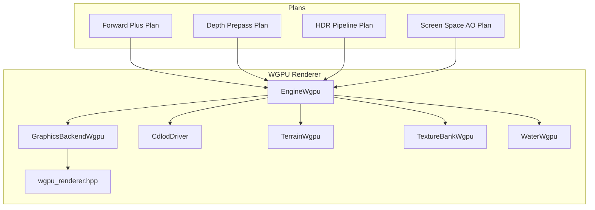
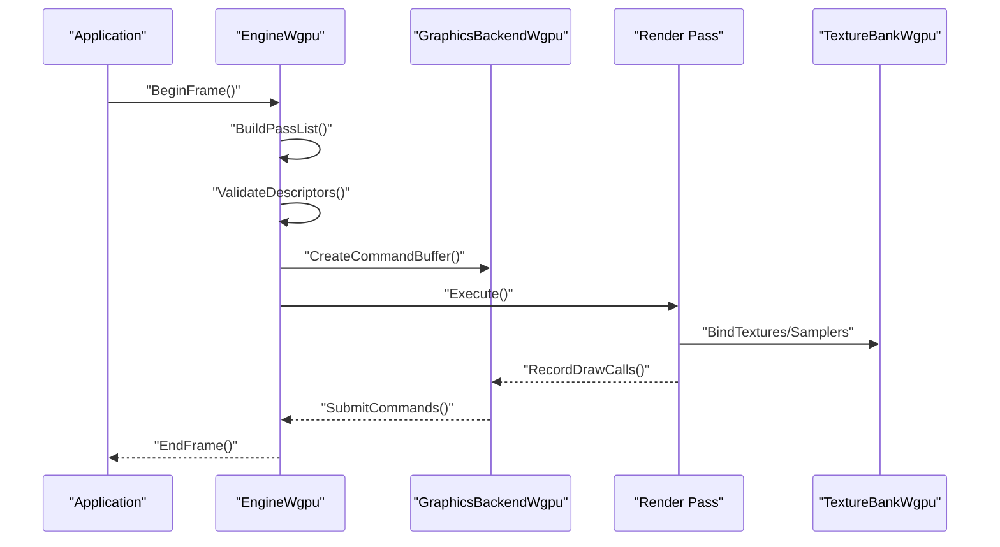
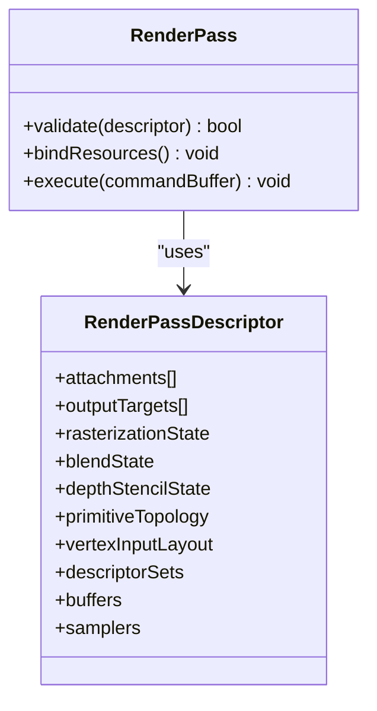
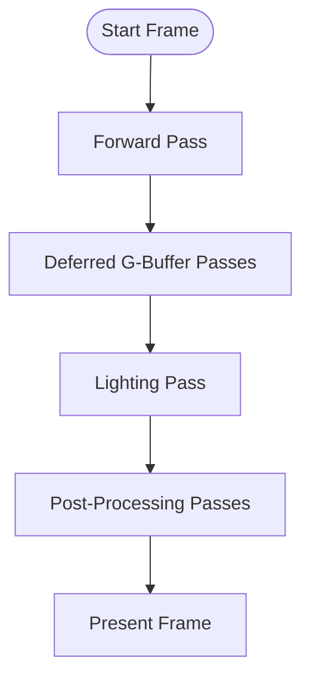
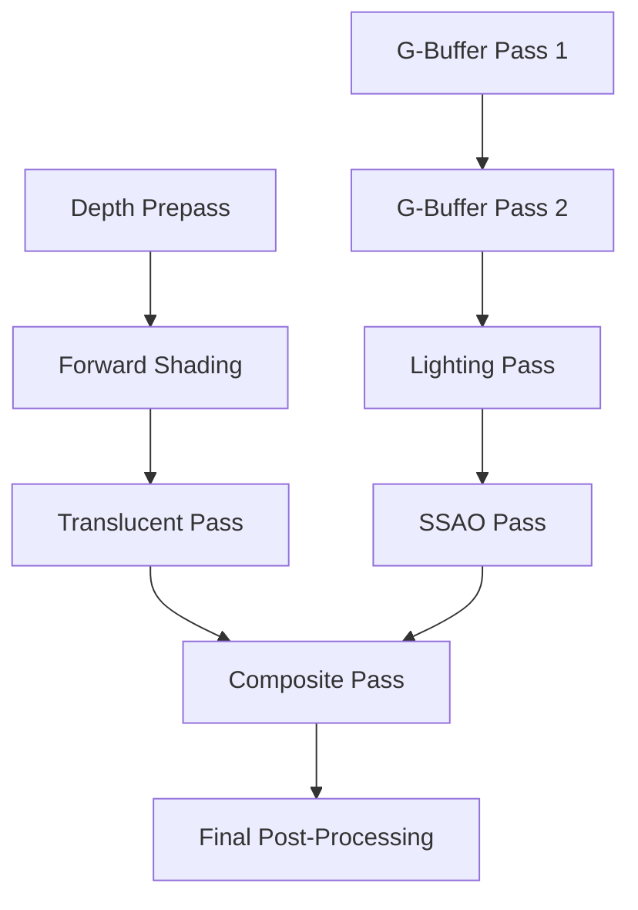
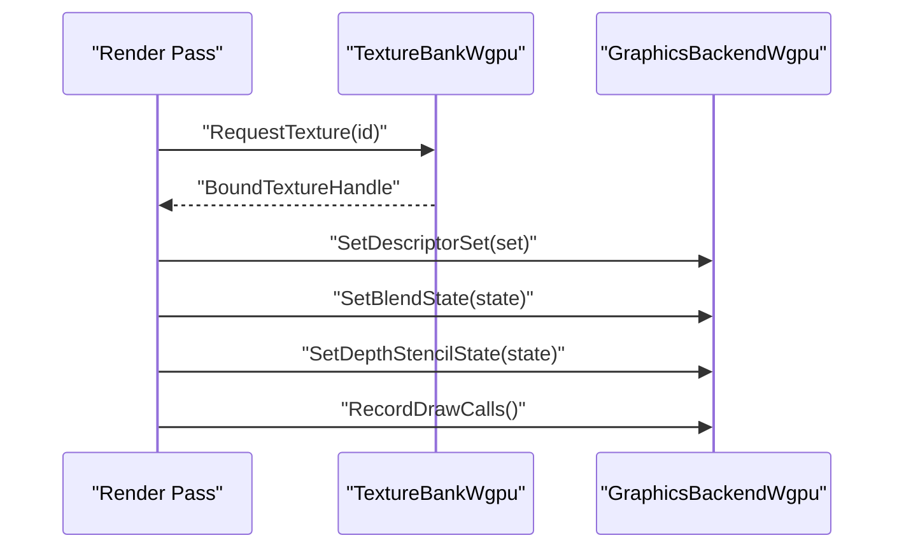
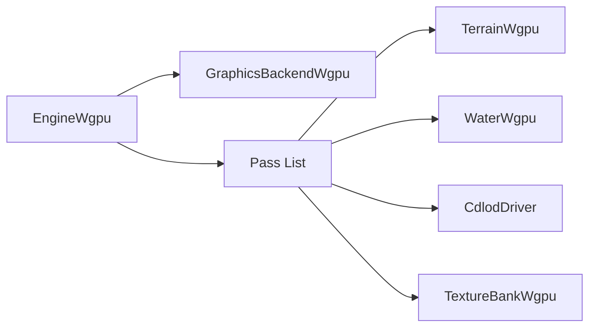

# Render Pass Architecture

<cite>
**Referenced Files in This Document**
- [EngineWgpu.hpp](file://engine/WgpuRenderer/EngineWgpu.hpp)
- [EngineWgpu.cpp](file://engine/WgpuRenderer/EngineWgpu.cpp)
- [GraphicsBackendWgpu.cpp](file://engine/WgpuRenderer/GraphicsBackendWgpu.cpp)
- [wgpu_renderer.hpp](file://engine/WgpuRenderer/include/wgpu_renderer.hpp)
- [CdlodDriver.hpp](file://engine/WgpuRenderer/CdlodDriver.hpp)
- [TerrainWgpu.hpp](file://engine/WgpuRenderer/TerrainWgpu.hpp)
- [TextureBankWgpu.hpp](file://engine/WgpuRenderer/TextureBankWgpu.hpp)
- [WaterWgpu.hpp](file://engine/WgpuRenderer/WaterWgpu.hpp)
- [ForwardPlusPlan.md](file://engine/WgpuRenderer/docs/forward-plus-plan.md)
- [HDRPipelinePlan.md](file://engine/WgpuRenderer/docs/hdr-pipeline-plan.md)
- [DepthPrepassPlan.md](file://engine/WgpuRenderer/docs/depth-prepass-plan.md)
- [ScreenSpaceAOPlan.md](file://engine/WgpuRenderer/docs/screen-space-ao-plan.md)
</cite>

## Table of Contents
1. [Introduction](#introduction)
2. [Project Structure](#project-structure)
3. [Core Components](#core-components)
4. [Architecture Overview](#architecture-overview)
5. [Detailed Component Analysis](#detailed-component-analysis)
6. [Dependency Analysis](#dependency-analysis)
7. [Performance Considerations](#performance-considerations)
8. [Troubleshooting Guide](#troubleshooting-guide)
9. [Conclusion](#conclusion)
10. [Appendices](#appendices)

## Introduction
This document explains the render pass system architecture, focusing on how passes are created, validated, and executed in a defined order. It covers the RenderPassDescriptor structure and its role in defining rendering states, describes built-in passes (forward, deferred, post-processing), and details pass dependencies, resource binding, and state management. It also provides guidance for creating custom passes, integrating them into the pipeline, optimizing performance through batching strategies, and debugging pass-specific issues.

## Project Structure
The render pass system is implemented within the WGPU-based graphics backend. The key areas include:
- Engine entry points that orchestrate frame rendering and pass execution
- Backend abstractions that expose rendering capabilities to higher layers
- Feature modules such as terrain, water, and LOD drivers that register or participate in passes
- Documentation plans describing forward, deferred, HDR, and post-processing pipelines

**Diagram sources**
- [EngineWgpu.hpp](file://engine/WgpuRenderer/EngineWgpu.hpp)
- [GraphicsBackendWgpu.cpp](file://engine/WgpuRenderer/GraphicsBackendWgpu.cpp)
- [wgpu_renderer.hpp](file://engine/WgpuRenderer/include/wgpu_renderer.hpp)
- [CdlodDriver.hpp](file://engine/WgpuRenderer/CdlodDriver.hpp)
- [TerrainWgpu.hpp](file://engine/WgpuRenderer/TerrainWgpu.hpp)
- [TextureBankWgpu.hpp](file://engine/WgpuRenderer/TextureBankWgpu.hpp)
- [WaterWgpu.hpp](file://engine/WgpuRenderer/WaterWgpu.hpp)
- [ForwardPlusPlan.md](file://engine/WgpuRenderer/docs/forward-plus-plan.md)
- [DepthPrepassPlan.md](file://engine/WgpuRenderer/docs/depth-prepass-plan.md)
- [HDRPipelinePlan.md](file://engine/WgpuRenderer/docs/hdr-pipeline-plan.md)
- [ScreenSpaceAOPlan.md](file://engine/WgpuRenderer/docs/screen-space-ao-plan.md)

**Section sources**
- [EngineWgpu.hpp](file://engine/WgpuRenderer/EngineWgpu.hpp)
- [GraphicsBackendWgpu.cpp](file://engine/WgpuRenderer/GraphicsBackendWgpu.cpp)
- [wgpu_renderer.hpp](file://engine/WgpuRenderer/include/wgpu_renderer.hpp)

## Core Components
- EngineWgpu: Orchestrates the frame loop, constructs render passes, validates descriptors, binds resources, and executes passes in dependency order.
- GraphicsBackendWgpu: Provides the backend interface used by the engine to create command buffers, manage textures, and submit work to the GPU.
- wgpu_renderer.hpp: Declares core types and interfaces for the WGPU renderer, including structures that describe passes and their states.
- CdlodDriver, TerrainWgpu, WaterWgpu: Feature subsystems that contribute geometry and effects; they may define or consume passes and bind resources accordingly.
- TextureBankWgpu: Manages texture lifetimes and bindings across passes, ensuring consistent resource availability.

Key responsibilities:
- Pass creation: Constructing pass objects from descriptors with validation checks.
- Validation: Ensuring descriptor fields are consistent (e.g., compatible formats, valid attachments).
- Execution order: Resolving dependencies and scheduling passes safely.
- Resource binding: Managing descriptors, samplers, and buffers per pass.
- State management: Applying render states (blend modes, depth/stencil, rasterization) before draw calls.

**Section sources**
- [EngineWgpu.cpp](file://engine/WgpuRenderer/EngineWgpu.cpp)
- [GraphicsBackendWgpu.cpp](file://engine/WgpuRenderer/GraphicsBackendWgpu.cpp)
- [wgpu_renderer.hpp](file://engine/WgpuRenderer/include/wgpu_renderer.hpp)
- [CdlodDriver.hpp](file://engine/WgpuRenderer/CdlodDriver.hpp)
- [TerrainWgpu.hpp](file://engine/WgpuRenderer/TerrainWgpu.hpp)
- [WaterWgpu.hpp](file://engine/WgpuRenderer/WaterWgpu.hpp)
- [TextureBankWgpu.hpp](file://engine/WgpuRenderer/TextureBankWgpu.hpp)

## Architecture Overview
The render pass system follows a layered design:
- High-level engine orchestrates passes based on scene requirements and feature flags.
- Backend abstraction encapsulates WGPU-specific operations.
- Feature modules integrate with passes via resource binding and optional pass participation.

**Diagram sources**
- [EngineWgpu.cpp](file://engine/WgpuRenderer/EngineWgpu.cpp)
- [GraphicsBackendWgpu.cpp](file://engine/WgpuRenderer/GraphicsBackendWgpu.cpp)
- [TextureBankWgpu.hpp](file://engine/WgpuRenderer/TextureBankWgpu.hpp)

## Detailed Component Analysis

### RenderPassDescriptor and Rendering States
The RenderPassDescriptor defines the configuration for a single render pass, including:
- Input attachments (color, depth, stencil)
- Output targets
- Rasterization state (cull mode, front face winding)
- Blend state (per-attachment blending)
- Depth-stencil state (compare function, write masks)
- Primitive topology and vertex input layout
- Descriptor sets/buffers/samplers required by shaders

Validation ensures:
- Attachment formats match shader expectations
- Depth/stencil usage is consistent across passes
- Resource bindings are available at execution time

**Diagram sources**
- [wgpu_renderer.hpp](file://engine/WgpuRenderer/include/wgpu_renderer.hpp)

**Section sources**
- [wgpu_renderer.hpp](file://engine/WgpuRenderer/include/wgpu_renderer.hpp)

### Built-in Passes: Forward, Deferred, Post-Processing
- Forward pass: Renders opaque and translucent geometry directly to color/depth targets with lighting computed per fragment.
- Deferred pass: Writes G-buffer (albedo, normals, roughness/metallic, depth) in early passes; lighting computed later using screen-space data.
- Post-processing: Applies effects like bloom, tone mapping, SSAO, and color grading after main rendering.

Configuration highlights:
- Forward: Typically uses simple blend states and standard depth testing.
- Deferred: Requires multiple color attachments and careful format selection for G-buffer channels.
- Post-processing: Uses fullscreen quads and sampler configurations for sampling previous frame or intermediate textures.

**Diagram sources**
- [ForwardPlusPlan.md](file://engine/WgpuRenderer/docs/forward-plus-plan.md)
- [HDRPipelinePlan.md](file://engine/WgpuRenderer/docs/hdr-pipeline-plan.md)
- [DepthPrepassPlan.md](file://engine/WgpuRenderer/docs/depth-prepass-plan.md)
- [ScreenSpaceAOPlan.md](file://engine/WgpuRenderer/docs/screen-space-ao-plan.md)

**Section sources**
- [ForwardPlusPlan.md](file://engine/WgpuRenderer/docs/forward-plus-plan.md)
- [HDRPipelinePlan.md](file://engine/WgpuRenderer/docs/hdr-pipeline-plan.md)
- [DepthPrepassPlan.md](file://engine/WgpuRenderer/docs/depth-prepass-plan.md)
- [ScreenSpaceAOPlan.md](file://engine/WgpuRenderer/docs/screen-space-ao-plan.md)

### Pass Dependencies and Execution Order
Passes declare dependencies to ensure correct ordering:
- Depth prepass must precede shading passes that rely on depth information.
- G-buffer passes must complete before lighting passes.
- Post-processing passes depend on prior rendering stages.

Execution strategy:
- Build a dependency graph from pass declarations.
- Topologically sort passes to determine safe execution order.
- Validate cycles and missing dependencies during descriptor validation.

**Diagram sources**
- [EngineWgpu.cpp](file://engine/WgpuRenderer/EngineWgpu.cpp)
- [DepthPrepassPlan.md](file://engine/WgpuRenderer/docs/depth-prepass-plan.md)
- [ScreenSpaceAOPlan.md](file://engine/WgpuRenderer/docs/screen-space-ao-plan.md)

**Section sources**
- [EngineWgpu.cpp](file://engine/WgpuRenderer/EngineWgpu.cpp)

### Resource Binding and State Management
Resource binding involves:
- Binding descriptor sets (textures, samplers, buffers) to shader stages.
- Updating dynamic uniforms per frame or per object.
- Ensuring texture formats and sampler states match pass expectations.

State management includes:
- Setting blend modes, depth test functions, and cull modes per pass.
- Switching between render targets and viewports.
- Managing render pass lifecycle (begin, record commands, end).

**Diagram sources**
- [TextureBankWgpu.hpp](file://engine/WgpuRenderer/TextureBankWgpu.hpp)
- [GraphicsBackendWgpu.cpp](file://engine/WgpuRenderer/GraphicsBackendWgpu.cpp)

**Section sources**
- [TextureBankWgpu.hpp](file://engine/WgpuRenderer/TextureBankWgpu.hpp)
- [GraphicsBackendWgpu.cpp](file://engine/WgpuRenderer/GraphicsBackendWgpu.cpp)

### Creating Custom Render Passes
To add a custom pass:
1. Define a RenderPassDescriptor with appropriate attachments and states.
2. Implement validation logic to check descriptor consistency.
3. Register the pass with the engine’s pass list.
4. Bind required resources and record draw commands.
5. Declare dependencies to ensure correct execution order.

Integration steps:
- Add pass creation in the engine’s frame setup.
- Ensure resource availability via TextureBankWgpu.
- Update dependency graph if the pass depends on or is consumed by other passes.

**Section sources**
- [EngineWgpu.cpp](file://engine/WgpuRenderer/EngineWgpu.cpp)
- [wgpu_renderer.hpp](file://engine/WgpuRenderer/include/wgpu_renderer.hpp)

## Dependency Analysis
The render pass system exhibits clear separation of concerns:
- EngineWgpu coordinates pass lifecycle and execution.
- GraphicsBackendWgpu abstracts WGPU operations.
- Feature modules (terrain, water, LOD) contribute geometry and effects without tightly coupling to pass internals.
- TextureBankWgpu centralizes texture management, reducing duplication and improving cache locality.

**Diagram sources**
- [EngineWgpu.hpp](file://engine/WgpuRenderer/EngineWgpu.hpp)
- [GraphicsBackendWgpu.cpp](file://engine/WgpuRenderer/GraphicsBackendWgpu.cpp)
- [TerrainWgpu.hpp](file://engine/WgpuRenderer/TerrainWgpu.hpp)
- [WaterWgpu.hpp](file://engine/WgpuRenderer/WaterWgpu.hpp)
- [CdlodDriver.hpp](file://engine/WgpuRenderer/CdlodDriver.hpp)
- [TextureBankWgpu.hpp](file://engine/WgpuRenderer/TextureBankWgpu.hpp)

**Section sources**
- [EngineWgpu.hpp](file://engine/WgpuRenderer/EngineWgpu.hpp)
- [GraphicsBackendWgpu.cpp](file://engine/WgpuRenderer/GraphicsBackendWgpu.cpp)

## Performance Considerations
Optimization strategies for render passes:
- Batch draw calls by grouping similar states to minimize state changes.
- Use instanced rendering for repeated geometry.
- Employ frustum and occlusion culling to reduce overdraw.
- Optimize texture formats and mipmaps for memory bandwidth.
- Leverage compute passes for heavy preprocessing when applicable.

Batching techniques:
- Sort objects by material and shader program.
- Merge small meshes where possible.
- Use descriptor pooling to reduce allocation overhead.

[No sources needed since this section provides general guidance]

## Troubleshooting Guide
Common issues and debugging techniques:
- Mismatched attachment formats: Verify descriptor validation and shader expectations.
- Incorrect execution order: Inspect dependency graph and logs for cycle detection.
- Resource binding failures: Check texture lifetimes and descriptor set updates.
- Stuttering due to state changes: Profile draw call counts and state switches.

Debugging tools:
- Use GPU profilers (RenderDoc, Nsight) to inspect pass execution.
- Enable logging for pass creation and validation errors.
- Visualize depth buffers and G-buffers to verify correctness.

**Section sources**
- [EngineWgpu.cpp](file://engine/WgpuRenderer/EngineWgpu.cpp)
- [GraphicsBackendWgpu.cpp](file://engine/WgpuRenderer/GraphicsBackendWgpu.cpp)

## Conclusion
The render pass system in the WGPU renderer provides a flexible and efficient framework for managing complex rendering pipelines. By clearly separating pass definition, validation, resource binding, and execution, it enables both built-in and custom passes to integrate seamlessly. Proper dependency management, state handling, and optimization strategies ensure high performance and maintainability.

[No sources needed since this section summarizes without analyzing specific files]

## Appendices
- Additional reading: Refer to the plan documents for detailed pipeline designs and optimizations.
- Example implementations: Explore feature modules for practical pass integration patterns.

[No sources needed since this section provides general guidance]