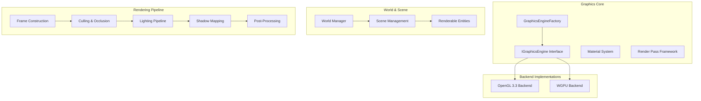
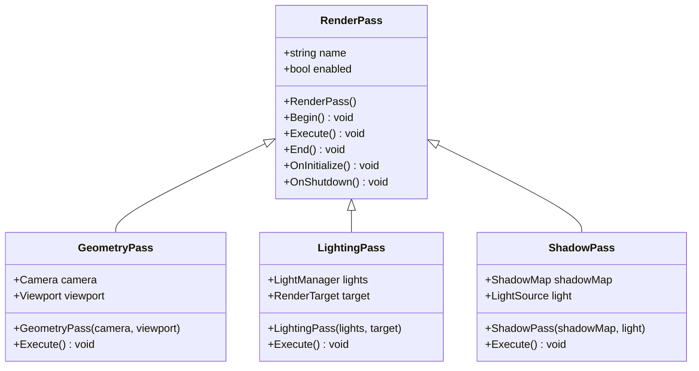
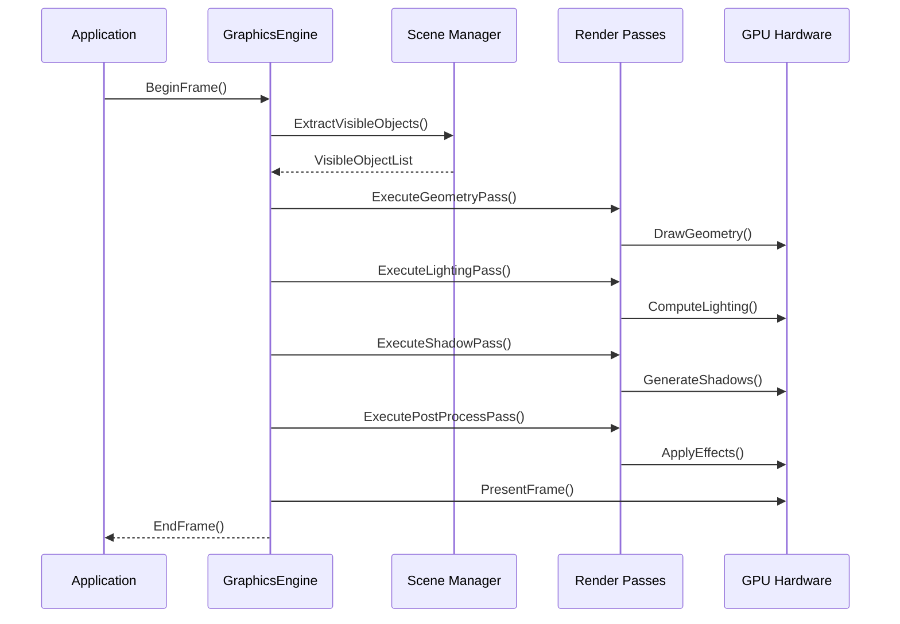
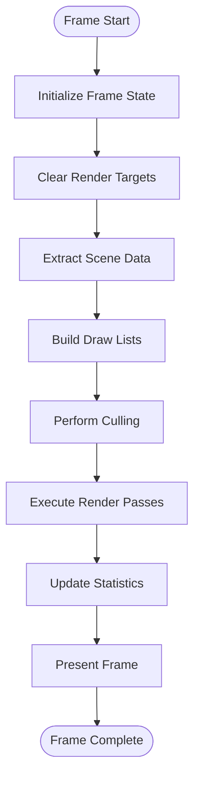
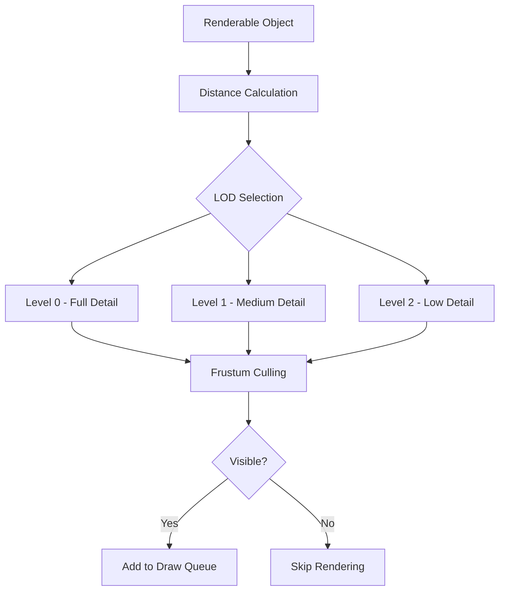
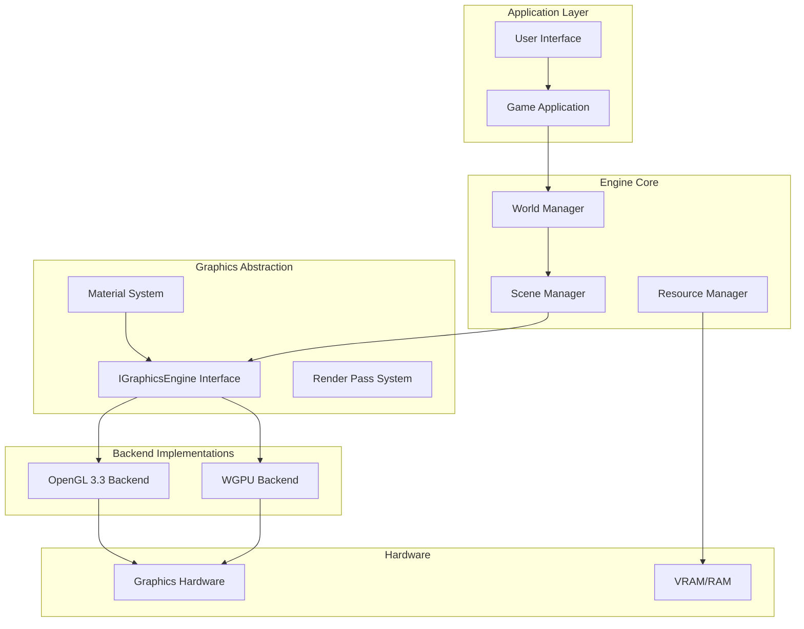

# Rendering Pipeline

<cite>
**Referenced Files in This Document**
- [GraphicsEngineFactory.hpp](file://engine/Poseidon/Graphics/GraphicsEngineFactory.hpp)
- [IGraphicsEngine.hpp](file://engine/Poseidon/Graphics/IGraphicsEngine.hpp)
- [EngineGL33.hpp](file://engine/PoseidonGL33/EngineGL33.hpp)
- [EngineWgpu.hpp](file://engine/WgpuRenderer/EngineWgpu.hpp)
- [World.hpp](file://engine/Poseidon/World/World.hpp)
- [Scene.hpp](file://engine/Poseidon/World/Scene/Scene.hpp)
- [Material.hpp](file://engine/Poseidon/Graphics/Core/Material.hpp)
- [RenderPass.hpp](file://engine/Poseidon/Graphics/Rendering/RenderPass.hpp)
</cite>

## Table of Contents
1. [Introduction](#introduction)
2. [Project Structure](#project-structure)
3. [Core Components](#core-components)
4. [Architecture Overview](#architecture-overview)
5. [Detailed Component Analysis](#detailed-component-analysis)
6. [Dependency Analysis](#dependency-analysis)
7. [Performance Considerations](#performance-considerations)
8. [Troubleshooting Guide](#troubleshooting-guide)
9. [Conclusion](#conclusion)

## Introduction

This document provides a comprehensive analysis of the rendering pipeline architecture in the CWR-CE game engine. The system implements a modern, multi-backend graphics architecture supporting both OpenGL 3.3 and WGPU backends, with a unified interface for frame construction, scene extraction, and draw call generation. The rendering pipeline is designed to be extensible, allowing for custom rendering passes, material systems, and optimization techniques while maintaining high performance across different hardware configurations.

The engine follows a component-based architecture where the scene graph drives the rendering process through a series of well-defined phases: frame construction, scene extraction, culling, lighting computation, shadow mapping, and post-processing effects. Each phase is implemented as a render pass that can be customized or extended independently.

## Project Structure

The rendering system is organized into several key directories within the engine architecture:

**Diagram sources**
- [GraphicsEngineFactory.hpp](file://engine/Poseidon/Graphics/GraphicsEngineFactory.hpp)
- [IGraphicsEngine.hpp](file://engine/Poseidon/Graphics/IGraphicsEngine.hpp)
- [EngineGL33.hpp](file://engine/PoseidonGL33/EngineGL33.hpp)
- [EngineWgpu.hpp](file://engine/WgpuRenderer/EngineWgpu.hpp)

**Section sources**
- [GraphicsEngineFactory.hpp](file://engine/Poseidon/Graphics/GraphicsEngineFactory.hpp)
- [IGraphicsEngine.hpp](file://engine/Poseidon/Graphics/IGraphicsEngine.hpp)

## Core Components

### Graphics Engine Interface

The core of the rendering system is built around the `IGraphicsEngine` interface, which provides a unified abstraction over different graphics backends. This interface defines the fundamental operations for frame management, resource handling, and rendering commands.

Key responsibilities include:
- Frame lifecycle management (begin/end frame operations)
- Resource allocation and deallocation
- Command buffer recording and execution
- State management and synchronization

### Render Pass Framework

The render pass system provides a modular approach to organizing rendering operations. Each pass encapsulates a specific aspect of the rendering pipeline, such as geometry rendering, lighting computation, or post-processing effects.

**Diagram sources**
- [RenderPass.hpp](file://engine/Poseidon/Graphics/Rendering/RenderPass.hpp)

### Material System Integration

The material system provides a flexible framework for defining how objects are rendered. Materials encapsulate shader programs, texture bindings, and rendering states, allowing for dynamic switching between different visual styles without changing the underlying geometry.

Materials integrate with the rendering pipeline through:
- Shader program compilation and caching
- Texture binding and management
- Uniform data upload to GPU
- State validation and optimization

**Section sources**
- [Material.hpp](file://engine/Poseidon/Graphics/Core/Material.hpp)

## Architecture Overview

The rendering pipeline follows a multi-pass architecture where each pass contributes to the final image through a series of render targets and intermediate buffers.

**Diagram sources**
- [EngineGL33.hpp](file://engine/PoseidonGL33/EngineGL33.hpp)
- [EngineWgpu.hpp](file://engine/WgpuRenderer/EngineWgpu.hpp)

### Frame Object Lifecycle

The frame object manages the complete lifecycle of a single rendering frame, from initialization to presentation. Key phases include:

1. **Frame Initialization**: Setup render targets, clear buffers, initialize state
2. **Scene Extraction**: Query visible objects and build draw lists
3. **Culling Phase**: Perform frustum and occlusion culling
4. **Rendering Phase**: Execute all render passes in order
5. **Presentation Phase**: Swap buffers and present to screen

### Render Pass Organization

Render passes are organized hierarchically and executed in a defined order:

- **Pre-passes**: Depth prepass, visibility queries
- **Main passes**: Opaque geometry, transparent objects
- **Effect passes**: Lighting, shadows, post-processing
- **UI passes**: HUD, menus, debug overlays

**Section sources**
- [World.hpp](file://engine/Poseidon/World/World.hpp)
- [Scene.hpp](file://engine/Poseidon/World/Scene/Scene.hpp)

## Detailed Component Analysis

### Frame Construction and Scene Extraction

The frame construction process begins with the application's main loop calling the graphics engine's frame initiation methods. The engine then coordinates with the scene manager to extract relevant information for rendering.

**Diagram sources**
- [EngineGL33_Lifecycle.cpp](file://engine/PoseidonGL33/EngineGL33_Lifecycle.cpp)

### Lighting Pipeline Implementation

The lighting pipeline implements a deferred shading approach where lighting calculations are performed after geometry has been rendered to G-buffers. This allows for efficient handling of multiple light sources and complex lighting models.

Key components include:
- **G-Buffer Generation**: Position, normal, albedo, and material properties
- **Light Volume Rendering**: Bounding volumes for point, spot, and directional lights
- **Shader Programs**: Multiple lighting models (Phong, PBR, etc.)
- **Accumulation**: Combining lighting contributions per pixel

### Shadow Mapping Implementation

Shadow mapping is implemented using cascaded shadow maps for directional lights and regular shadow maps for point and spot lights. The implementation includes:

- **Cascade Splitting**: Adaptive cascade distribution based on viewer distance
- **Bias Techniques**: Normal offset and variance shadow mapping
- **Filtering**: PCF (Percentage Closer Filtering) for smooth shadows
- **Optimization**: Frustum culling of shadow map updates

### Post-Processing Effects

The post-processing pipeline applies various screen-space effects to enhance visual quality:

- **Bloom**: High-intensity glow effect
- **Tone Mapping**: HDR to LDR conversion with configurable curves
- **Anti-Aliasing**: SMAA or MSAA integration
- **Depth of Field**: Bokeh effect based on focus distance
- **Color Grading**: Global color adjustments and filmic look

**Section sources**
- [EngineGL33_ShadowDepth.cpp](file://engine/PoseidonGL33/EngineGL33_ShadowDepth.cpp)

### Culling Strategies and Performance Optimization

The engine implements multiple culling strategies to optimize rendering performance:

#### Frustum Culling
- View frustum intersection testing
- Hierarchical bounding volume culling
- Batched culling for static geometry

#### Occlusion Culling
- Hardware occlusion queries
- Software occlusion culling fallback
- Progressive refinement techniques

#### Level-of-Detail (LOD)
- Automatic LOD selection based on distance
- Manual LOD assignment for critical objects
- Dynamic LOD transitions

**Diagram sources**
- [EngineGL33_Queue.cpp](file://engine/PoseidonGL33/EngineGL33_Queue.cpp)

## Dependency Analysis

The rendering system exhibits a layered architecture with clear separation of concerns:

**Diagram sources**
- [GraphicsEngineFactory.hpp](file://engine/Poseidon/Graphics/GraphicsEngineFactory.hpp)
- [IGraphicsEngine.hpp](file://engine/Poseidon/Graphics/IGraphicsEngine.hpp)

### Component Coupling and Cohesion

The system maintains low coupling between components through well-defined interfaces:
- **High Cohesion**: Each component has a single, well-defined responsibility
- **Low Coupling**: Components interact through abstract interfaces
- **Dependency Inversion**: Higher-level modules depend on abstractions, not implementations

### External Dependencies and Integration Points

Key external dependencies include:
- **Graphics APIs**: OpenGL 3.3, WGPU/Vulkan
- **Math Libraries**: Vector/matrix operations
- **Asset Formats**: Model, texture, and shader loading
- **Platform Abstractions**: Window management, input handling

**Section sources**
- [EngineGL33.hpp](file://engine/PoseidonGL33/EngineGL33.hpp)
- [EngineWgpu.hpp](file://engine/WgpuRenderer/EngineWgpu.hpp)

## Performance Considerations

### Rendering Performance Optimization

The engine implements several performance optimization techniques:

#### Batch Rendering
- Geometry batching to reduce draw calls
- State change minimization
- Instanced rendering for repeated objects

#### Memory Management
- Texture atlasing to reduce memory fragmentation
- Streaming textures for large assets
- Reference counting for shared resources

#### GPU Utilization
- Parallel command buffer recording
- Asynchronous compute for heavy operations
- Efficient buffer layouts for better cache performance

### Profiling and Debugging Tools

The engine integrates with industry-standard profiling tools:

#### GPU Profiling
- NVIDIA Nsight integration
- AMD Radeon GPU Profiler support
- Intel GPA for debugging

#### CPU Profiling
- Visual Studio Profiler integration
- Custom performance counters
- Frame time analysis

#### Debug Visualization
- Wireframe overlay mode
- Bounding box visualization
- Performance statistics overlay

**Section sources**
- [EngineGL33_State.cpp](file://engine/PoseidonGL33/EngineGL33_State.cpp)

## Troubleshooting Guide

### Common Rendering Issues

#### Performance Problems
- **Symptoms**: Low FPS, stuttering, frame drops
- **Causes**: Excessive draw calls, texture thrashing, inefficient shaders
- **Solutions**: Enable batching, optimize texture usage, profile shader performance

#### Visual Artifacts
- **Symptoms**: Z-fighting, texture bleeding, incorrect lighting
- **Causes**: Precision issues, improper UV mapping, shader bugs
- **Solutions**: Adjust depth precision, fix UV coordinates, validate shader code

#### Memory Issues
- **Symptoms**: Crashes, out-of-memory errors, slow asset loading
- **Causes**: Memory leaks, excessive VRAM usage, inefficient streaming
- **Solutions**: Monitor memory usage, implement proper cleanup, optimize streaming

### Debugging Techniques

#### Frame Analysis
- Use RenderDoc for frame capture and analysis
- Enable detailed logging for rendering operations
- Implement custom debug overlays for real-time monitoring

#### Shader Debugging
- Validate shader compilation and linking
- Use graphics debugger breakpoints in shaders
- Implement fallback shaders for error conditions

**Section sources**
- [EngineGL33_Material.cpp](file://engine/PoseidonGL33/EngineGL33_Material.cpp)

## Conclusion

The CWR-CE rendering pipeline implements a modern, extensible architecture that supports multiple graphics backends while providing high performance and flexibility. The modular design allows for easy extension with new rendering passes, materials, and optimization techniques. The system's emphasis on performance optimization, combined with comprehensive debugging tools, makes it suitable for developing complex 3D applications.

Key strengths of the architecture include:
- **Multi-backend Support**: Seamless switching between OpenGL 3.3 and WGPU
- **Modular Design**: Extensible render pass system and material framework
- **Performance Focus**: Comprehensive optimization techniques and profiling tools
- **Developer Experience**: Rich debugging capabilities and clear API design

Future enhancements could include additional graphics backends, advanced lighting models, and improved mobile platform support, building upon the solid foundation established by the current architecture.