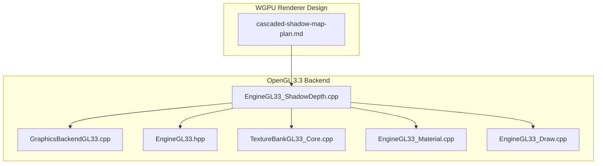
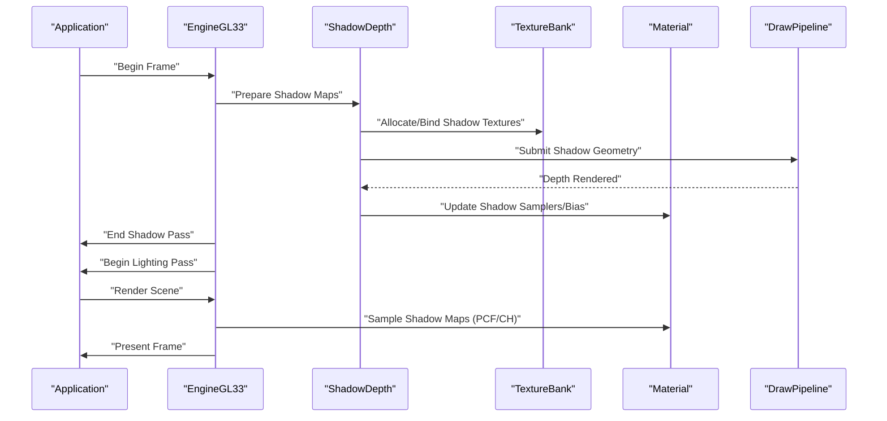
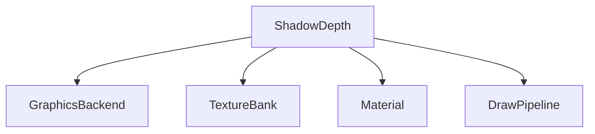

# Shadow Mapping Implementation

<cite>
**Referenced Files in This Document**
- [EngineGL33_ShadowDepth.cpp](file://engine/PoseidonGL33/EngineGL33_ShadowDepth.cpp)
- [cascaded-shadow-map-plan.md](file://engine/WgpuRenderer/docs/cascaded-shadow-map-plan.md)
- [GraphicsBackendGL33.cpp](file://engine/PoseidonGL33/GraphicsBackendGL33.cpp)
- [EngineGL33.hpp](file://engine/PoseidonGL33/EngineGL33.hpp)
- [TextureBankGL33_Core.cpp](file://engine/PoseidonGL33/TextureBankGL33_Core.cpp)
- [EngineGL33_Material.cpp](file://engine/PoseidonGL33/EngineGL33_Material.cpp)
- [EngineGL33_Draw.cpp](file://engine/PoseidonGL33/EngineGL33_Draw.cpp)
</cite>

## Table of Contents
1. [Introduction](#introduction)
2. [Project Structure](#project-structure)
3. [Core Components](#core-components)
4. [Architecture Overview](#architecture-overview)
5. [Detailed Component Analysis](#detailed-component-analysis)
6. [Dependency Analysis](#dependency-analysis)
7. [Performance Considerations](#performance-considerations)
8. [Troubleshooting Guide](#troubleshooting-guide)
9. [Conclusion](#conclusion)
10. [Appendices](#appendices)

## Introduction
This document explains the shadow mapping system implemented in the engine, focusing on depth map generation, shadow cascade management, and quality settings. It covers the shadow pass execution pipeline, bias calculations, filtering techniques (including percentage-closer filtering), and support for different light types (directional, point, spot). It also details shadow receiver configuration, contact hardening considerations, custom algorithm integration points, debugging visualization, performance optimization strategies, and memory management for shadow maps.

## Project Structure
Shadow-related functionality spans both the OpenGL 3.3 backend and the WGPU renderer’s design documents:
- OpenGL 3.3 backend provides concrete implementations for shadow depth rendering and texture handling.
- WGPU renderer includes a detailed plan for cascaded shadow maps that informs architecture and future implementation.

**Diagram sources**
- [EngineGL33_ShadowDepth.cpp](file://engine/PoseidonGL33/EngineGL33_ShadowDepth.cpp)
- [GraphicsBackendGL33.cpp](file://engine/PoseidonGL33/GraphicsBackendGL33.cpp)
- [EngineGL33.hpp](file://engine/PoseidonGL33/EngineGL33.hpp)
- [TextureBankGL33_Core.cpp](file://engine/PoseidonGL33/TextureBankGL33_Core.cpp)
- [EngineGL33_Material.cpp](file://engine/PoseidonGL33/EngineGL33_Material.cpp)
- [EngineGL33_Draw.cpp](file://engine/PoseidonGL33/EngineGL33_Draw.cpp)
- [cascaded-shadow-map-plan.md](file://engine/WgpuRenderer/docs/cascaded-shadow-map-plan.md)

**Section sources**
- [EngineGL33_ShadowDepth.cpp](file://engine/PoseidonGL33/EngineGL33_ShadowDepth.cpp)
- [cascaded-shadow-map-plan.md](file://engine/WgpuRenderer/docs/cascaded-shadow-map-plan.md)

## Core Components
- Shadow Depth Rendering: The OpenGL 3.3 backend implements depth-only rendering for shadow maps, including setup of render targets, viewport scissor tests, and draw calls for shadow geometry.
- Texture Management: Shadow textures are created, bound, and managed via the texture bank to ensure proper resource lifecycle and GPU memory usage.
- Material Integration: Shadow-aware materials configure depth-only passes and integrate with the material pipeline to output correct depth values.
- Draw Pipeline: The draw subsystem handles culling, batching, and submission of shadow geometry during the shadow pass.

Key responsibilities:
- Depth map generation per light type
- Cascade planning and updates for directional lights
- Bias application to reduce acne and peter-panning
- Filtering options such as PCF and optional contact hardening
- Debug visualization toggles for shadow maps and cascades

**Section sources**
- [EngineGL33_ShadowDepth.cpp](file://engine/PoseidonGL33/EngineGL33_ShadowDepth.cpp)
- [TextureBankGL33_Core.cpp](file://engine/PoseidonGL33/TextureBankGL33_Core.cpp)
- [EngineGL33_Material.cpp](file://engine/PoseidonGL33/EngineGL33_Material.cpp)
- [EngineGL33_Draw.cpp](file://engine/PoseidonGL33/EngineGL33_Draw.cpp)

## Architecture Overview
The shadow mapping pipeline consists of two primary phases:
- Shadow Pass: Renders scene geometry from each light’s perspective into one or more depth textures (shadow maps). For directional lights, cascaded shadow maps split the view frustum into multiple regions to maintain resolution across distances.
- Lighting Pass: Samples shadow maps during shading to determine occlusion using percentage-closer filtering and optional contact hardening.

**Diagram sources**
- [EngineGL33_ShadowDepth.cpp](file://engine/PoseidonGL33/EngineGL33_ShadowDepth.cpp)
- [TextureBankGL33_Core.cpp](file://engine/PoseidonGL33/TextureBankGL33_Core.cpp)
- [EngineGL33_Material.cpp](file://engine/PoseidonGL33/EngineGL33_Material.cpp)
- [EngineGL33_Draw.cpp](file://engine/PoseidonGL33/EngineGL33_Draw.cpp)

## Detailed Component Analysis

### Shadow Depth Rendering (OpenGL 3.3)
- Depth-only rendering is used to generate shadow maps efficiently.
- Viewport and scissor rectangles are configured per cascade or light face.
- Geometry is culled and batched to minimize state changes and overdraw.
- Bias parameters are applied to mitigate self-shadowing artifacts.

Implementation highlights:
- Creation and binding of depth textures for each light type
- Setting up projection matrices tailored to light space
- Submitting draw calls for shadow casters only
- Managing render target attachments and clearing depth buffers

**Section sources**
- [EngineGL33_ShadowDepth.cpp](file://engine/PoseidonGL33/EngineGL33_ShadowDepth.cpp)
- [GraphicsBackendGL33.cpp](file://engine/PoseidonGL33/GraphicsBackendGL33.cpp)

### Cascaded Shadow Map Management
Cascaded shadow maps improve resolution distribution for directional lights by splitting the camera frustum into multiple zones. Each cascade renders a portion of the scene into its own depth texture.

Key aspects:
- Frustum splitting strategy based on distance thresholds
- Per-cascade view/projection matrix computation
- Dynamic update when camera or light direction changes
- Quality scaling via number of cascades and texture resolution

Design reference:
- The WGPU renderer’s cascaded shadow map plan outlines goals and trade-offs applicable to the overall architecture.

**Section sources**
- [cascaded-shadow-map-plan.md](file://engine/WgpuRenderer/docs/cascaded-shadow-map-plan.md)

### Shadow Types: Directional, Point, Spot
- Directional Lights: Use cascaded shadow maps; large frustums require careful splitting and resolution allocation.
- Point Lights: Render to cube map faces; each face captures one hemisphere. Requires six depth renders per frame per light.
- Spot Lights: Similar to directional but with cone-shaped frustum; single depth texture suffices.

Considerations:
- Light-space transformations differ per type
- Face selection and sampling vary for cube maps
- Cone clipping and near/far plane tuning for spot lights

**Section sources**
- [EngineGL33_ShadowDepth.cpp](file://engine/PoseidonGL33/EngineGL33_ShadowDepth.cpp)

### Bias Calculations and Filtering Techniques
Bias prevents self-shadowing artifacts like acne and peter-panning. Common approaches include:
- Constant bias offset
- Normal-based bias proportional to surface orientation
- Slope-scaled bias dependent on angle relative to light direction

Filtering:
- Percentage-Closer Filtering (PCF): Smooths shadow edges by sampling neighboring texels and averaging comparisons.
- Contact Hardening Shadows (optional): Approximates penumbra effects by varying bias based on depth gradient or sample count.

Quality settings typically control:
- Number of PCF taps
- Bias magnitude and slope scale
- Cascade count and resolution
- Cube map resolution for point lights

**Section sources**
- [EngineGL33_ShadowDepth.cpp](file://engine/PoseidonGL33/EngineGL33_ShadowDepth.cpp)

### Shadow Receiver Configuration
Shadow receivers must be configured to sample the appropriate shadow map(s) during lighting:
- Sampler state setup with correct comparison function (depth compare)
- UV transformation to light space for sampling
- Cascade blending for directional lights to avoid seams
- Handling edge cases like outside frustum or invalid depths

Material integration ensures receivers use shadow-aware shaders that incorporate bias and filtering parameters.

**Section sources**
- [EngineGL33_Material.cpp](file://engine/PoseidonGL33/EngineGL33_Material.cpp)

### Custom Shadow Algorithms and Debug Visualization
Custom algorithms can be integrated by extending the shadow pass pipeline:
- Pluggable depth shader programs for specialized techniques
- Additional passes for variance shadow maps or exponential shadow maps
- Debug overlays to visualize shadow maps, cascades, and bias fields

Debug features:
- Toggle display of individual cascade textures
- Visualize bias vectors and PCF sampling patterns
- Highlight shadow boundaries and seam transitions

**Section sources**
- [EngineGL33_ShadowDepth.cpp](file://engine/PoseidonGL33/EngineGL33_ShadowDepth.cpp)

## Dependency Analysis
Shadow rendering depends on several core systems:
- Graphics backend for state management and draw submission
- Texture bank for resource allocation and lifecycle
- Material system for sampler configuration and shader integration
- Draw pipeline for culling and batching

**Diagram sources**
- [EngineGL33_ShadowDepth.cpp](file://engine/PoseidonGL33/EngineGL33_ShadowDepth.cpp)
- [GraphicsBackendGL33.cpp](file://engine/PoseidonGL33/GraphicsBackendGL33.cpp)
- [TextureBankGL33_Core.cpp](file://engine/PoseidonGL33/TextureBankGL33_Core.cpp)
- [EngineGL33_Material.cpp](file://engine/PoseidonGL33/EngineGL33_Material.cpp)
- [EngineGL33_Draw.cpp](file://engine/PoseidonGL33/EngineGL33_Draw.cpp)

**Section sources**
- [EngineGL33_ShadowDepth.cpp](file://engine/PoseidonGL33/EngineGL33_ShadowDepth.cpp)
- [GraphicsBackendGL33.cpp](file://engine/PoseidonGL33/GraphicsBackendGL33.cpp)
- [TextureBankGL33_Core.cpp](file://engine/PoseidonGL33/TextureBankGL33_Core.cpp)
- [EngineGL33_Material.cpp](file://engine/PoseidonGL33/EngineGL33_Material.cpp)
- [EngineGL33_Draw.cpp](file://engine/PoseidonGL33/EngineGL33_Draw.cpp)

## Performance Considerations
Optimization strategies for shadow mapping:
- Reduce overdraw by culling shadow casters early
- Limit cascade count based on scene complexity and performance budget
- Adjust texture resolutions dynamically according to distance and importance
- Use hardware-accelerated PCF where available
- Batch draw calls to minimize state changes
- Avoid redundant updates when light or camera positions are unchanged

Memory management:
- Reuse shadow textures across frames when possible
- Implement lazy allocation for off-screen cascades
- Monitor GPU memory usage and fall back gracefully under pressure
- Ensure proper cleanup on device reset or window resize

[No sources needed since this section provides general guidance]

## Troubleshooting Guide
Common issues and resolutions:
- Shadow acne: Increase bias or adjust normal/slope scaling
- Peter-panning: Decrease bias or refine projection near/far planes
- Seams between cascades: Improve blending weights and cascade bounds
- Low performance: Reduce cascade count, texture resolution, or PCF taps
- Incorrect sampling: Verify UV transforms and sampler states

Debugging steps:
- Visualize shadow maps and cascades to identify problematic areas
- Log bias values and sampling coordinates for analysis
- Isolate specific light types to narrow down causes

**Section sources**
- [EngineGL33_ShadowDepth.cpp](file://engine/PoseidonGL33/EngineGL33_ShadowDepth.cpp)

## Conclusion
The shadow mapping system integrates depth rendering, cascade management, and filtering techniques to produce high-quality shadows across different light types. By leveraging the OpenGL 3.3 backend’s capabilities and adhering to the architectural principles outlined in the WGPU renderer’s plan, the engine achieves a balance between visual fidelity and performance. Proper configuration of bias, filtering, and resource management ensures robust shadow rendering suitable for diverse scenes and platforms.

[No sources needed since this section summarizes without analyzing specific files]

## Appendices
- Glossary: Terms such as PCF, CH, cascade, and bias are defined within context sections above.
- References: The cascaded shadow map plan provides additional insights into design goals and future enhancements.

[No sources needed since this section provides general guidance]