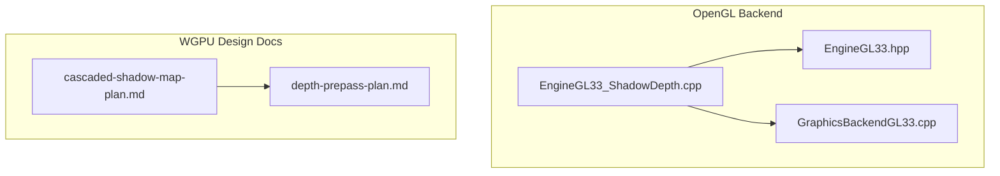
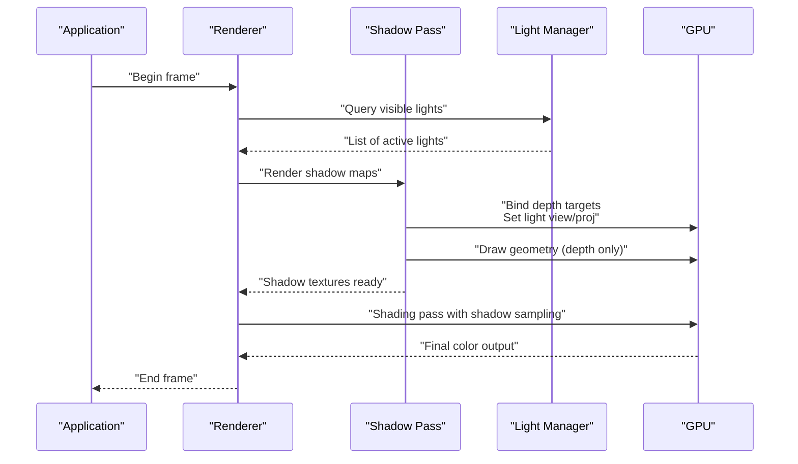
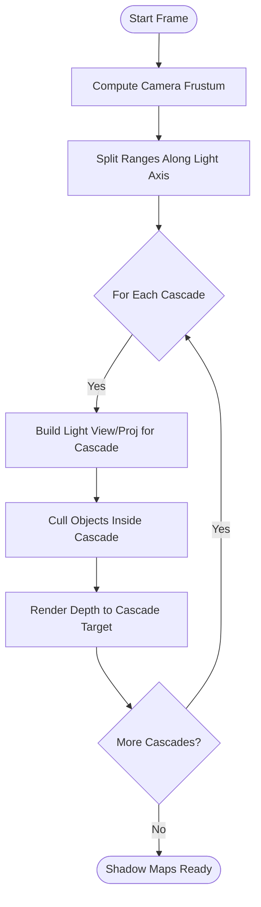
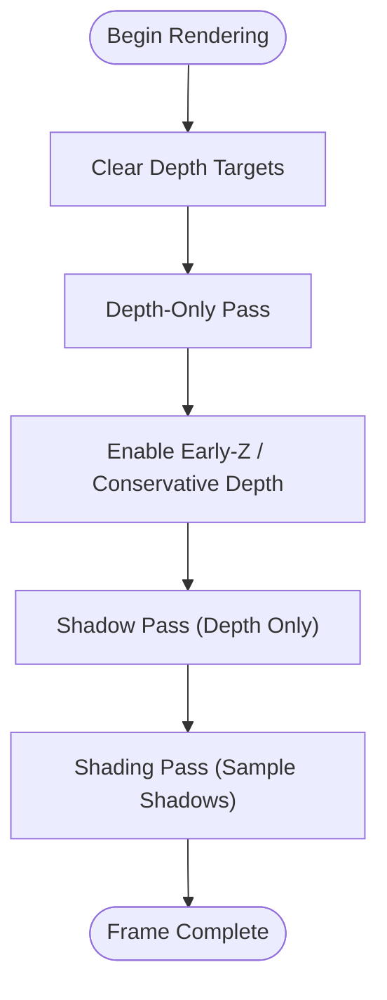
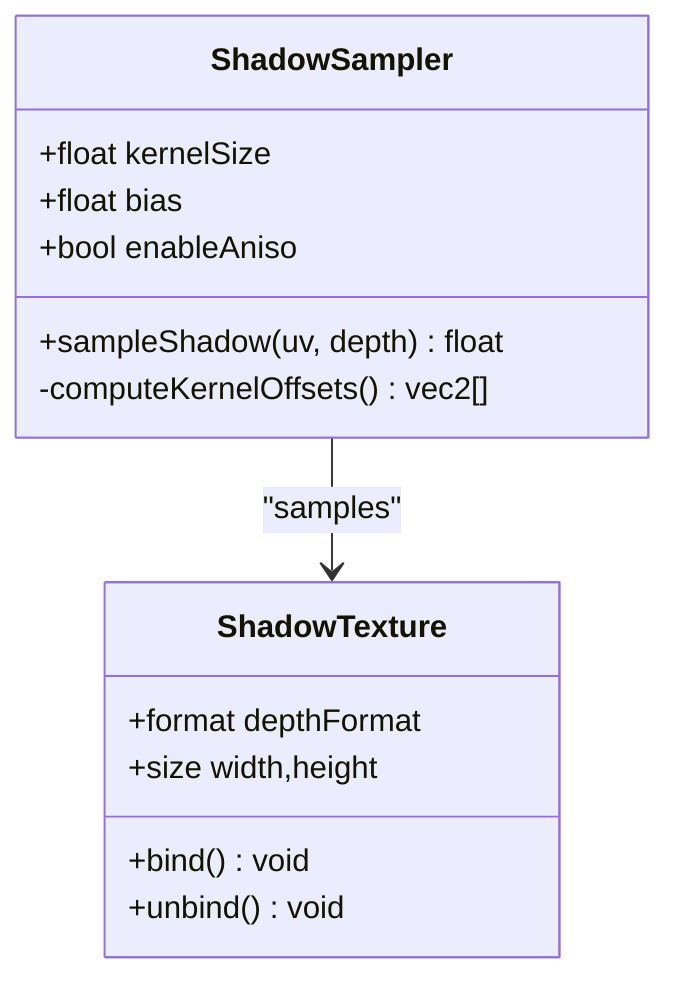
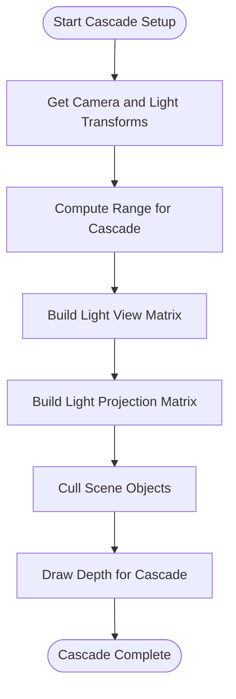
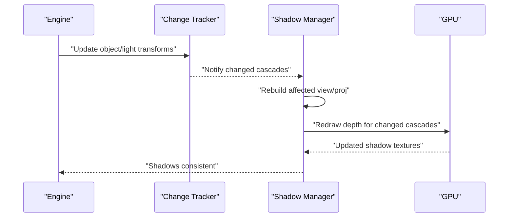
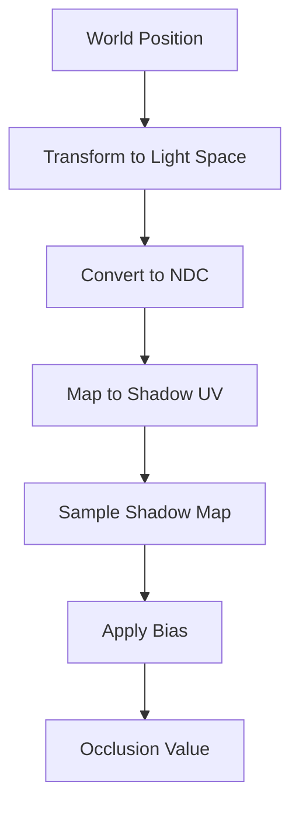
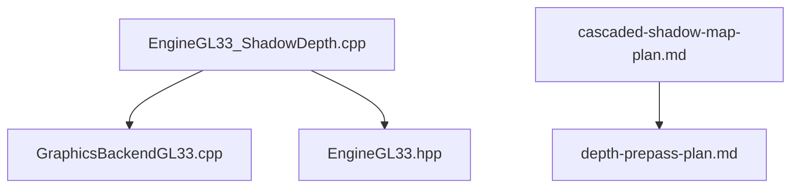

# Shadow Mapping System

<cite>
**Referenced Files in This Document**
- [EngineGL33_ShadowDepth.cpp](file://engine/PoseidonGL33/EngineGL33_ShadowDepth.cpp)
- [cascaded-shadow-map-plan.md](file://engine/WgpuRenderer/docs/cascaded-shadow-map-plan.md)
- [depth-prepass-plan.md](file://engine/WgpuRenderer/docs/depth-prepass-plan.md)
- [GraphicsBackendGL33.cpp](file://engine/PoseidonGL33/GraphicsBackendGL33.cpp)
- [EngineGL33.hpp](file://engine/PoseidonGL33/EngineGL33.hpp)
</cite>

## Table of Contents
1. [Introduction](#introduction)
2. [Project Structure](#project-structure)
3. [Core Components](#core-components)
4. [Architecture Overview](#architecture-overview)
5. [Detailed Component Analysis](#detailed-component-analysis)
6. [Dependency Analysis](#dependency-analysis)
7. [Performance Considerations](#performance-considerations)
8. [Troubleshooting Guide](#troubleshooting-guide)
9. [Conclusion](#conclusion)
10. [Appendices](#appendices)

## Introduction
This document explains the shadow mapping system implemented in the engine, focusing on cascade shadow maps, depth buffer optimization, and PCF filtering techniques. It covers shadow camera setup, frustum culling, dynamic updates, mathematical foundations for shadow coordinate transformations and biasing to prevent acne, hardware-accelerated sampling, and multi-sample anti-aliasing integration. It also provides guidance on configuring shadow quality and debugging artifacts, with performance considerations for large scenes and mobile platforms.

## Project Structure
Shadow rendering spans both the legacy OpenGL 3.3 backend and the modern WGPU renderer design documents:
- OpenGL 3.3 implementation files handle shadow depth passes and related state management.
- WGPU documentation outlines the planned cascaded shadow map pipeline and depth pre-pass optimizations.

**Diagram sources**
- [EngineGL33_ShadowDepth.cpp](file://engine/PoseidonGL33/EngineGL33_ShadowDepth.cpp)
- [EngineGL33.hpp](file://engine/PoseidonGL33/EngineGL33.hpp)
- [GraphicsBackendGL33.cpp](file://engine/PoseidonGL33/GraphicsBackendGL33.cpp)
- [cascaded-shadow-map-plan.md](file://engine/WgpuRenderer/docs/cascaded-shadow-map-plan.md)
- [depth-prepass-plan.md](file://engine/WgpuRenderer/docs/depth-prepass-plan.md)

**Section sources**
- [EngineGL33_ShadowDepth.cpp](file://engine/PoseidonGL33/EngineGL33_ShadowDepth.cpp)
- [cascaded-shadow-map-plan.md](file://engine/WgpuRenderer/docs/cascaded-shadow-map-plan.md)
- [depth-prepass-plan.md](file://engine/WgpuRenderer/docs/depth-prepass-plan.md)

## Core Components
- Shadow depth pass: Renders scene geometry from light space into one or more shadow textures (cascade splits).
- Cascade manager: Computes per-cascade view/projection matrices and manages frustum splitting around the camera/light.
- Sampling stage: Samples shadow maps during shading with PCF filtering and bias to reduce acne.
- Depth buffer optimization: Uses a dedicated depth-only pass and optimized formats to minimize bandwidth and overdraw.
- Dynamic updates: Recomputes shadow maps when lights or relevant objects move; supports LOD and update regions.

Key responsibilities are implemented in the OpenGL backend’s shadow depth module and guided by the WGPU design docs for cascaded shadows and depth pre-pass.

**Section sources**
- [EngineGL33_ShadowDepth.cpp](file://engine/PoseidonGL33/EngineGL33_ShadowDepth.cpp)
- [cascaded-shadow-map-plan.md](file://engine/WgpuRenderer/docs/cascaded-shadow-map-plan.md)
- [depth-prepass-plan.md](file://engine/WgpuRenderer/docs/depth-prepass-plan.md)

## Architecture Overview
The shadow pipeline consists of two main phases:
- Shadow pass: Render geometry into shadow textures using light-space transforms.
- Shading pass: Sample shadow textures with PCF and bias to compute occlusion.

**Diagram sources**
- [EngineGL33_ShadowDepth.cpp](file://engine/PoseidonGL33/EngineGL33_ShadowDepth.cpp)
- [GraphicsBackendGL33.cpp](file://engine/PoseidonGL33/GraphicsBackendGL33.cpp)

**Section sources**
- [EngineGL33_ShadowDepth.cpp](file://engine/PoseidonGL33/EngineGL33_ShadowDepth.cpp)
- [GraphicsBackendGL33.cpp](file://engine/PoseidonGL33/GraphicsBackendGL33.cpp)

## Detailed Component Analysis

### Cascade Shadow Maps
Cascaded shadow maps divide the view frustum into multiple ranges along the camera-to-light axis, allocating higher resolution near the camera and lower resolution farther away. The plan outlines:
- Frustum splitting based on distance thresholds.
- Per-cascade view/projection matrix computation aligned to light direction.
- Texture array or separate render targets per cascade.
- Filtering across cascade boundaries to avoid seams.

**Diagram sources**
- [cascaded-shadow-map-plan.md](file://engine/WgpuRenderer/docs/cascaded-shadow-map-plan.md)

**Section sources**
- [cascaded-shadow-map-plan.md](file://engine/WgpuRenderer/docs/cascaded-shadow-map-plan.md)

### Depth Buffer Optimization
A depth pre-pass reduces overdraw and improves cache efficiency:
- Render all opaque geometry once to a depth-only target.
- Use optimized depth formats and disable color writes.
- Reuse depth buffers across passes where possible.
- Employ early-Z and conservative rasterization hints if available.

**Diagram sources**
- [depth-prepass-plan.md](file://engine/WgpuRenderer/docs/depth-prepass-plan.md)

**Section sources**
- [depth-prepass-plan.md](file://engine/WgpuRenderer/docs/depth-prepass-plan.md)

### PCF Filtering Techniques
Percentage-Closer Filtering smooths hard shadow edges by sampling neighboring texels and averaging results:
- Kernel size controls softness vs. performance.
- Hardware-accelerated sampling via texture samplers configured for shadow comparisons.
- Optional anisotropic filtering for directional lights at grazing angles.

**Diagram sources**
- [EngineGL33_ShadowDepth.cpp](file://engine/PoseidonGL33/EngineGL33_ShadowDepth.cpp)

**Section sources**
- [EngineGL33_ShadowDepth.cpp](file://engine/PoseidonGL33/EngineGL33_ShadowDepth.cpp)

### Shadow Camera Setup and Frustum Culling
Per-cascade shadow cameras must tightly bound visible geometry while avoiding excessive texture usage:
- Compute cascade-specific view/projection matrices from camera and light transforms.
- Cull objects outside each cascade’s frustum before drawing.
- Adjust near/far planes per cascade to maximize depth precision.

**Diagram sources**
- [EngineGL33_ShadowDepth.cpp](file://engine/PoseidonGL33/EngineGL33_ShadowDepth.cpp)

**Section sources**
- [EngineGL33_ShadowDepth.cpp](file://engine/PoseidonGL33/EngineGL33_ShadowDepth.cpp)

### Dynamic Shadow Updates
Dynamic updates ensure shadows reflect moving lights and objects efficiently:
- Track object movement and light changes to invalidate affected cascades.
- Use hierarchical culling to limit redraws to impacted regions.
- Support partial updates or tile-based updates for large scenes.

**Diagram sources**
- [EngineGL33_ShadowDepth.cpp](file://engine/PoseidonGL33/EngineGL33_ShadowDepth.cpp)

**Section sources**
- [EngineGL33_ShadowDepth.cpp](file://engine/PoseidonGL33/EngineGL33_ShadowDepth.cpp)

### Mathematical Foundations
- Shadow coordinates transform world positions into light space using light view/projection matrices.
- Bias calculations offset projected depths slightly to prevent acne caused by floating-point inaccuracies.
- Normalized device coordinates map to texture UVs for sampling.

**Diagram sources**
- [EngineGL33_ShadowDepth.cpp](file://engine/PoseidonGL33/EngineGL33_ShadowDepth.cpp)

**Section sources**
- [EngineGL33_ShadowDepth.cpp](file://engine/PoseidonGL33/EngineGL33_ShadowDepth.cpp)

### Hardware-Accelerated Sampling and MSAA Integration
- Use hardware shadow samplers for efficient comparison sampling.
- Integrate with MSAA by resolving depth samples appropriately or using sample-aware sampling paths.
- On mobile, prefer fewer cascades and smaller kernels to conserve power and memory.

**Section sources**
- [EngineGL33_ShadowDepth.cpp](file://engine/PoseidonGL33/EngineGL33_ShadowDepth.cpp)

## Dependency Analysis
Shadow rendering depends on core graphics backends and configuration:
- OpenGL 3.3 backend provides low-level draw calls and state management.
- WGPU design documents guide future implementations and optimizations.

**Diagram sources**
- [EngineGL33_ShadowDepth.cpp](file://engine/PoseidonGL33/EngineGL33_ShadowDepth.cpp)
- [GraphicsBackendGL33.cpp](file://engine/PoseidonGL33/GraphicsBackendGL33.cpp)
- [EngineGL33.hpp](file://engine/PoseidonGL33/EngineGL33.hpp)
- [cascaded-shadow-map-plan.md](file://engine/WgpuRenderer/docs/cascaded-shadow-map-plan.md)
- [depth-prepass-plan.md](file://engine/WgpuRenderer/docs/depth-prepass-plan.md)

**Section sources**
- [EngineGL33_ShadowDepth.cpp](file://engine/PoseidonGL33/EngineGL33_ShadowDepth.cpp)
- [GraphicsBackendGL33.cpp](file://engine/PoseidonGL33/GraphicsBackendGL33.cpp)
- [EngineGL33.hpp](file://engine/PoseidonGL33/EngineGL33.hpp)
- [cascaded-shadow-map-plan.md](file://engine/WgpuRenderer/docs/cascaded-shadow-map-plan.md)
- [depth-prepass-plan.md](file://engine/WgpuRenderer/docs/depth-prepass-plan.md)

## Performance Considerations
- Reduce cascade count on mobile devices to balance quality and performance.
- Limit PCF kernel size and use hardware samplers for efficient sampling.
- Employ depth pre-pass and early-Z to minimize overdraw.
- Use frustum culling and change tracking to avoid unnecessary redraws.
- Optimize texture formats and memory layouts for better bandwidth utilization.

[No sources needed since this section provides general guidance]

## Troubleshooting Guide
Common issues and resolutions:
- Shadow acne: Increase bias carefully; check normal-aligned bias for angled surfaces.
- Banding or seams between cascades: Adjust cascade split distribution and blend transitions.
- Flickering shadows: Ensure stable near/far planes and sufficient depth precision.
- Performance drops: Reduce cascade count, kernel size, or enable selective updates.

**Section sources**
- [EngineGL33_ShadowDepth.cpp](file://engine/PoseidonGL33/EngineGL33_ShadowDepth.cpp)

## Conclusion
The shadow mapping system combines cascade shadow maps, depth buffer optimizations, and PCF filtering to deliver high-quality shadows efficiently. By leveraging hardware acceleration and careful mathematical transformations, it achieves robust performance across diverse platforms. Proper configuration and debugging techniques ensure optimal visual fidelity and stability.

[No sources needed since this section summarizes without analyzing specific files]

## Appendices
- Configuration examples for shadow quality settings can be derived from backend parameters and shader uniforms.
- Debugging tools include visualizing shadow UVs, cascade bounds, and bias values.

[No sources needed since this section provides general guidance]