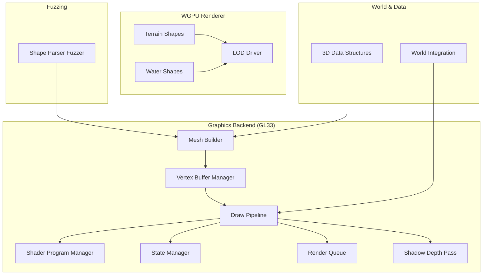
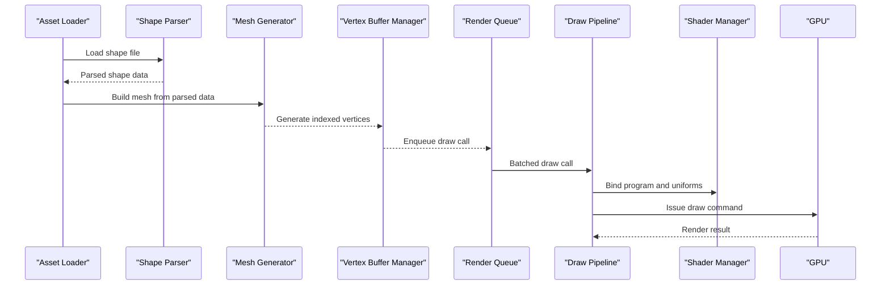
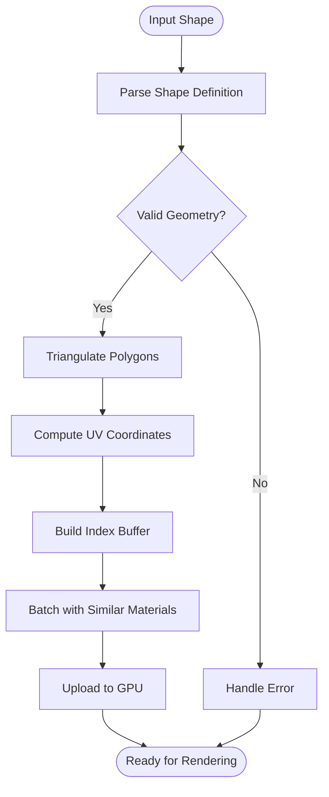
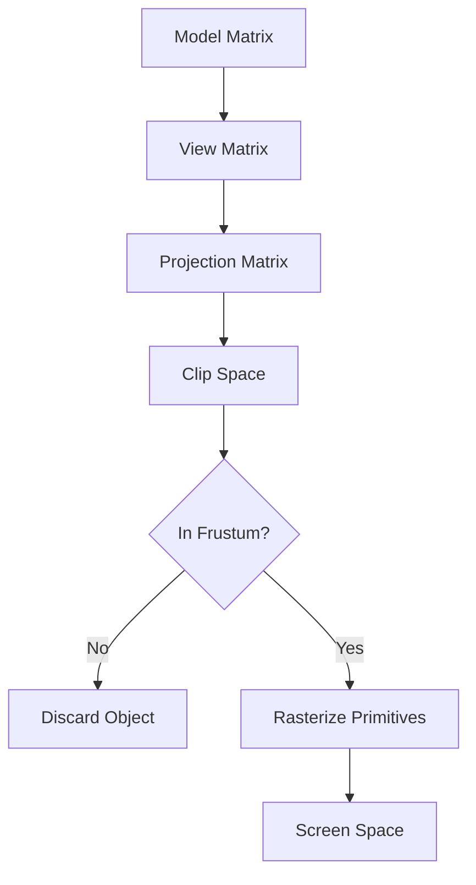
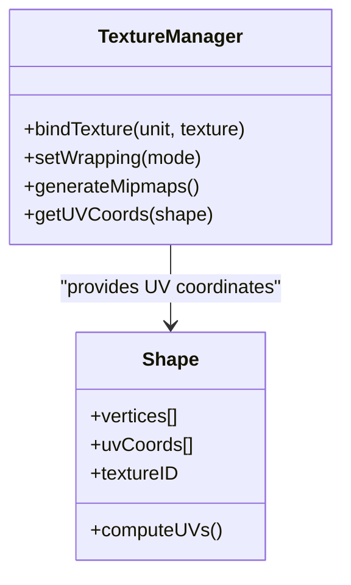
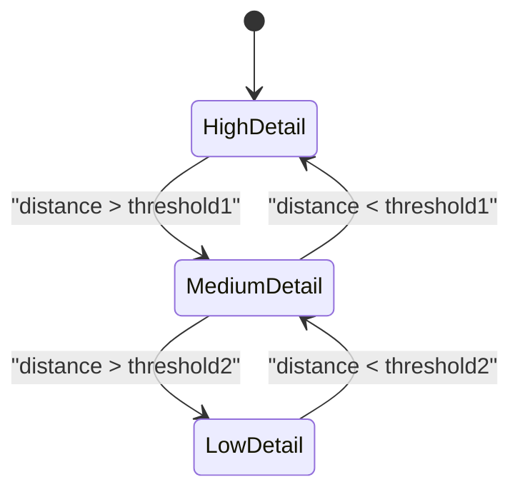
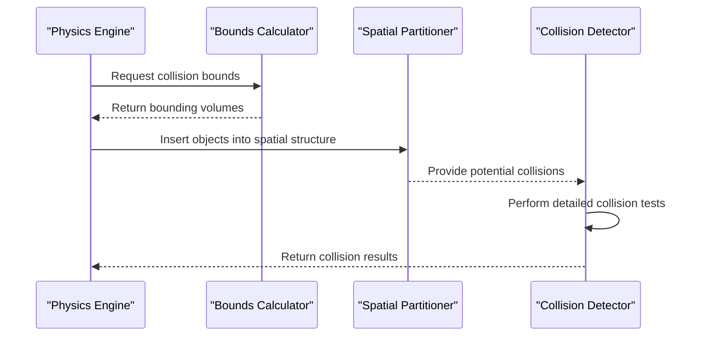
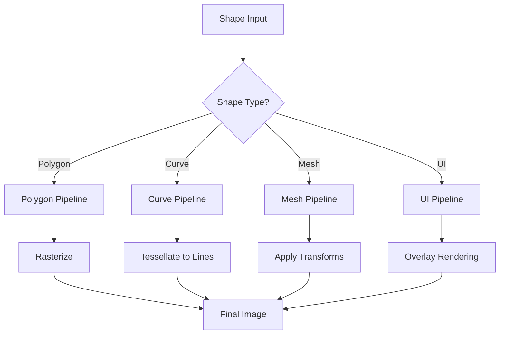
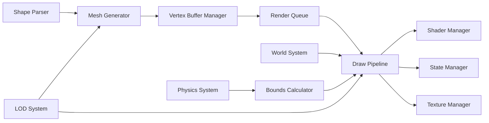

# Shape Rendering System

<cite>
**Referenced Files in This Document**
- [EngineGL33_Mesh.cpp](file://engine/PoseidonGL33/EngineGL33_Mesh.cpp)
- [EngineGL33_VertexBuffer.cpp](file://engine/PoseidonGL33/EngineGL33_VertexBuffer.cpp)
- [EngineGL33_Draw.cpp](file://engine/PoseidonGL33/EngineGL33_Draw.cpp)
- [EngineGL33_2DRendering.cpp](file://engine/PoseidonGL33/EngineGL33_2DRendering.cpp)
- [EngineGL33_Shaders.cpp](file://engine/PoseidonGL33/EngineGL33_Shaders.cpp)
- [EngineGL33_State.cpp](file://engine/PoseidonGL33/EngineGL33_State.cpp)
- [EngineGL33_Lifecycle.cpp](file://engine/PoseidonGL33/EngineGL33_Lifecycle.cpp)
- [EngineGL33_Material.cpp](file://engine/PoseidonGL33/EngineGL33_Material.cpp)
- [EngineGL33_Queue.cpp](file://engine/PoseidonGL33/EngineGL33_Queue.cpp)
- [EngineGL33_ShadowDepth.cpp](file://engine/PoseidonGL33/EngineGL33_ShadowDepth.cpp)
- [TextureBankGL33_Core.cpp](file://engine/PoseidonGL33/TextureBankGL33_Core.cpp)
- [TextureGL33_Init.cpp](file://engine/PoseidonGL33/TextureGL33_Init.cpp)
- [TextureGL33_Loading.cpp](file://engine/PoseidonGL33/TextureGL33_Loading.cpp)
- [fuzz_shape.cpp](file://apps/fuzzers/Fuzzer/fuzz_shape.cpp)
- [Data3D.h](file://engine/Poseidon/Core/Data3D.h)
- [World.hpp](file://engine/Poseidon/World/World.hpp)
- [WorldImpl.cpp](file://engine/Poseidon/World/WorldImpl.cpp)
- [TerrainWgpu.cpp](file://engine/WgpuRenderer/TerrainWgpu.cpp)
- [WaterWgpu.cpp](file://engine/WgpuRenderer/WaterWgpu.cpp)
- [CdlodDriver.hpp](file://engine/WgpuRenderer/CdlodDriver.hpp)
</cite>

## Table of Contents
1. [Introduction](#introduction)
2. [Project Structure](#project-structure)
3. [Core Components](#core-components)
4. [Architecture Overview](#architecture-overview)
5. [Detailed Component Analysis](#detailed-component-analysis)
6. [Dependency Analysis](#dependency-analysis)
7. [Performance Considerations](#performance-considerations)
8. [Troubleshooting Guide](#troubleshooting-guide)
9. [Conclusion](#conclusion)
10. [Appendices](#appendices)

## Introduction
This document explains the shape rendering system that supports both 2D UI elements and 3D geometry. It covers how shape assets are parsed, how meshes are generated, and how vertex buffers are optimized for performance. It also documents clipping algorithms, transformation matrices, texture coordinate handling, LOD systems for complex shapes, and integration with collision detection. The rendering pipeline is described for different shape types including polygons, curves, and textured meshes. Guidance is provided for creating custom shape assets, optimizing loading performance, and maintaining compatibility with legacy formats.

## Project Structure
The shape rendering system spans multiple engine subsystems:
- Graphics backend (OpenGL 3.3): mesh building, vertex buffers, draw calls, shaders, state management, and queueing
- WGPU renderer: terrain and water shape pipelines, LOD driver
- World and data models: 3D data structures and world integration points
- Fuzzing utilities: robustness checks for shape parsing

**Diagram sources**
- [EngineGL33_Mesh.cpp](file://engine/PoseidonGL33/EngineGL33_Mesh.cpp)
- [EngineGL33_VertexBuffer.cpp](file://engine/PoseidonGL33/EngineGL33_VertexBuffer.cpp)
- [EngineGL33_Draw.cpp](file://engine/PoseidonGL33/EngineGL33_Draw.cpp)
- [EngineGL33_Shaders.cpp](file://engine/PoseidonGL33/EngineGL33_Shaders.cpp)
- [EngineGL33_State.cpp](file://engine/PoseidonGL33/EngineGL33_State.cpp)
- [EngineGL33_Queue.cpp](file://engine/PoseidonGL33/EngineGL33_Queue.cpp)
- [EngineGL33_ShadowDepth.cpp](file://engine/PoseidonGL33/EngineGL33_ShadowDepth.cpp)
- [TerrainWgpu.cpp](file://engine/WgpuRenderer/TerrainWgpu.cpp)
- [WaterWgpu.cpp](file://engine/WgpuRenderer/WaterWgpu.cpp)
- [CdlodDriver.hpp](file://engine/WgpuRenderer/CdlodDriver.hpp)
- [Data3D.h](file://engine/Poseidon/Core/Data3D.h)
- [World.hpp](file://engine/Poseidon/World/World.hpp)
- [fuzz_shape.cpp](file://apps/fuzzers/Fuzzer/fuzz_shape.cpp)

**Section sources**
- [EngineGL33_Mesh.cpp](file://engine/PoseidonGL33/EngineGL33_Mesh.cpp)
- [EngineGL33_VertexBuffer.cpp](file://engine/PoseidonGL33/EngineGL33_VertexBuffer.cpp)
- [EngineGL33_Draw.cpp](file://engine/PoseidonGL33/EngineGL33_Draw.cpp)
- [EngineGL33_2DRendering.cpp](file://engine/PoseidonGL33/EngineGL33_2DRendering.cpp)
- [EngineGL33_Shaders.cpp](file://engine/PoseidonGL33/EngineGL33_Shaders.cpp)
- [EngineGL33_State.cpp](file://engine/PoseidonGL33/EngineGL33_State.cpp)
- [EngineGL33_Lifecycle.cpp](file://engine/PoseidonGL33/EngineGL33_Lifecycle.cpp)
- [EngineGL33_Material.cpp](file://engine/PoseidonGL33/EngineGL33_Material.cpp)
- [EngineGL33_Queue.cpp](file://engine/PoseidonGL33/EngineGL33_Queue.cpp)
- [EngineGL33_ShadowDepth.cpp](file://engine/PoseidonGL33/EngineGL33_ShadowDepth.cpp)
- [TextureBankGL33_Core.cpp](file://engine/PoseidonGL33/TextureBankGL33_Core.cpp)
- [TextureGL33_Init.cpp](file://engine/PoseidonGL33/TextureGL33_Init.cpp)
- [TextureGL33_Loading.cpp](file://engine/PoseidonGL33/TextureGL33_Loading.cpp)
- [fuzz_shape.cpp](file://apps/fuzzers/Fuzzer/fuzz_shape.cpp)
- [Data3D.h](file://engine/Poseidon/Core/Data3D.h)
- [World.hpp](file://engine/Poseidon/World/World.hpp)
- [WorldImpl.cpp](file://engine/Poseidon/World/WorldImpl.cpp)
- [TerrainWgpu.cpp](file://engine/WgpuRenderer/TerrainWgpu.cpp)
- [WaterWgpu.cpp](file://engine/WgpuRenderer/WaterWgpu.cpp)
- [CdlodDriver.hpp](file://engine/WgpuRenderer/CdlodDriver.hpp)

## Core Components
- Mesh builder: constructs GPU-ready geometry from shape definitions, handles triangulation and UV mapping
- Vertex buffer manager: batches vertices, optimizes layout, and reduces draw calls
- Draw pipeline: applies transformations, clips primitives, and issues draw commands
- Shader program manager: compiles and binds shader programs for different shape types
- State manager: manages render states such as blending, depth testing, and culling
- Render queue: orders draw calls by material and batching strategy
- Texture bank: caches textures and coordinates for efficient sampling
- WGPU terrain/water: specialized shape pipelines with LOD control
- World integration: connects shape rendering to scene objects and collision bounds

Key responsibilities:
- Parsing shape files into intermediate representations
- Generating meshes with correct topology and texture coordinates
- Optimizing vertex buffers via indexing and batching
- Applying model-view-projection matrices and clipping planes
- Managing LOD levels for complex shapes
- Integrating with collision detection through bounding volumes

**Section sources**
- [EngineGL33_Mesh.cpp](file://engine/PoseidonGL33/EngineGL33_Mesh.cpp)
- [EngineGL33_VertexBuffer.cpp](file://engine/PoseidonGL33/EngineGL33_VertexBuffer.cpp)
- [EngineGL33_Draw.cpp](file://engine/PoseidonGL33/EngineGL33_Draw.cpp)
- [EngineGL33_Shaders.cpp](file://engine/PoseidonGL33/EngineGL33_Shaders.cpp)
- [EngineGL33_State.cpp](file://engine/PoseidonGL33/EngineGL33_State.cpp)
- [EngineGL33_Queue.cpp](file://engine/PoseidonGL33/EngineGL33_Queue.cpp)
- [TextureBankGL33_Core.cpp](file://engine/PoseidonGL33/TextureBankGL33_Core.cpp)
- [TerrainWgpu.cpp](file://engine/WgpuRenderer/TerrainWgpu.cpp)
- [WaterWgpu.cpp](file://engine/WgpuRenderer/WaterWgpu.cpp)
- [CdlodDriver.hpp](file://engine/WgpuRenderer/CdlodDriver.hpp)
- [Data3D.h](file://engine/Poseidon/Core/Data3D.h)
- [World.hpp](file://engine/Poseidon/World/World.hpp)

## Architecture Overview
The rendering architecture separates asset parsing, mesh generation, and GPU execution. GL33 handles general-purpose shapes and UI, while WGPU provides specialized pipelines for terrain and water with LOD control.

**Diagram sources**
- [EngineGL33_Mesh.cpp](file://engine/PoseidonGL33/EngineGL33_Mesh.cpp)
- [EngineGL33_VertexBuffer.cpp](file://engine/PoseidonGL33/EngineGL33_VertexBuffer.cpp)
- [EngineGL33_Draw.cpp](file://engine/PoseidonGL33/EngineGL33_Draw.cpp)
- [EngineGL33_Shaders.cpp](file://engine/PoseidonGL33/EngineGL33_Shaders.cpp)
- [EngineGL33_Queue.cpp](file://engine/PoseidonGL33/EngineGL33_Queue.cpp)

## Detailed Component Analysis

### Mesh Generation and Vertex Buffer Optimization
- Triangulation: Converts polygonal shapes into triangle strips or fans
- UV mapping: Assigns texture coordinates based on shape geometry
- Indexing: Uses index buffers to reduce vertex duplication
- Batching: Combines small shapes into larger buffers to minimize draw calls
- Layout optimization: Packs attributes efficiently for better cache locality

**Diagram sources**
- [EngineGL33_Mesh.cpp](file://engine/PoseidonGL33/EngineGL33_Mesh.cpp)
- [EngineGL33_VertexBuffer.cpp](file://engine/PoseidonGL33/EngineGL33_VertexBuffer.cpp)

**Section sources**
- [EngineGL33_Mesh.cpp](file://engine/PoseidonGL33/EngineGL33_Mesh.cpp)
- [EngineGL33_VertexBuffer.cpp](file://engine/PoseidonGL33/EngineGL33_VertexBuffer.cpp)

### Clipping Algorithms and Transformation Matrices
- View frustum culling: Removes objects outside the camera view
- Plane clipping: Clips primitives against custom clipping planes
- Matrix transformations: Applies model, view, and projection matrices
- Normalization: Ensures consistent coordinate space across platforms

**Diagram sources**
- [EngineGL33_Draw.cpp](file://engine/PoseidonGL33/EngineGL33_Draw.cpp)
- [EngineGL33_State.cpp](file://engine/PoseidonGL33/EngineGL33_State.cpp)

**Section sources**
- [EngineGL33_Draw.cpp](file://engine/PoseidonGL33/EngineGL33_Draw.cpp)
- [EngineGL33_State.cpp](file://engine/PoseidonGL33/EngineGL33_State.cpp)

### Texture Coordinate Handling
- UV generation: Automatically computes texture coordinates for procedural shapes
- Texture binding: Manages texture units and samplers
- Wrapping modes: Supports repeat, clamp, and mirror wrapping
- Mipmapping: Generates mipmaps for distant objects

**Diagram sources**
- [TextureBankGL33_Core.cpp](file://engine/PoseidonGL33/TextureBankGL33_Core.cpp)
- [TextureGL33_Init.cpp](file://engine/PoseidonGL33/TextureGL33_Init.cpp)
- [TextureGL33_Loading.cpp](file://engine/PoseidonGL33/TextureGL33_Loading.cpp)

**Section sources**
- [TextureBankGL33_Core.cpp](file://engine/PoseidonGL33/TextureBankGL33_Core.cpp)
- [TextureGL33_Init.cpp](file://engine/PoseidonGL33/TextureGL33_Init.cpp)
- [TextureGL33_Loading.cpp](file://engine/PoseidonGL33/TextureGL33_Loading.cpp)

### LOD Systems for Complex Shapes
- Distance-based LOD: Switches between detail levels based on camera distance
- Quality tiers: Provides low, medium, and high detail meshes
- Streaming: Loads appropriate LOD levels on demand
- Transition smoothing: Blends between LOD levels to avoid popping

**Diagram sources**
- [CdlodDriver.hpp](file://engine/WgpuRenderer/CdlodDriver.hpp)
- [TerrainWgpu.cpp](file://engine/WgpuRenderer/TerrainWgpu.cpp)
- [WaterWgpu.cpp](file://engine/WgpuRenderer/WaterWgpu.cpp)

**Section sources**
- [CdlodDriver.hpp](file://engine/WgpuRenderer/CdlodDriver.hpp)
- [TerrainWgpu.cpp](file://engine/WgpuRenderer/TerrainWgpu.cpp)
- [WaterWgpu.cpp](file://engine/WgpuRenderer/WaterWgpu.cpp)

### Collision Detection Integration
- Bounding volumes: Computes AABB, OBB, and sphere bounds for shapes
- Broad phase: Uses spatial partitioning for efficient collision queries
- Narrow phase: Performs precise collision tests on candidate pairs
- Continuous collision: Handles fast-moving objects with swept volumes

**Diagram sources**
- [Data3D.h](file://engine/Poseidon/Core/Data3D.h)
- [World.hpp](file://engine/Poseidon/World/World.hpp)
- [WorldImpl.cpp](file://engine/Poseidon/World/WorldImpl.cpp)

**Section sources**
- [Data3D.h](file://engine/Poseidon/Core/Data3D.h)
- [World.hpp](file://engine/Poseidon/World/World.hpp)
- [WorldImpl.cpp](file://engine/Poseidon/World/WorldImpl.cpp)

### Rendering Pipeline for Different Shape Types
- Polygons: Simple filled shapes with optional outlines
- Curves: Smooth lines using quadratic or cubic Bézier curves
- Textured meshes: Complex geometry with UV-mapped textures
- UI elements: 2D overlays with screen-space positioning

**Diagram sources**
- [EngineGL33_2DRendering.cpp](file://engine/PoseidonGL33/EngineGL33_2DRendering.cpp)
- [EngineGL33_Draw.cpp](file://engine/PoseidonGL33/EngineGL33_Draw.cpp)

**Section sources**
- [EngineGL33_2DRendering.cpp](file://engine/PoseidonGL33/EngineGL33_2DRendering.cpp)
- [EngineGL33_Draw.cpp](file://engine/PoseidonGL33/EngineGL33_Draw.cpp)

## Dependency Analysis
The shape rendering system has clear dependencies between components:

**Diagram sources**
- [EngineGL33_Mesh.cpp](file://engine/PoseidonGL33/EngineGL33_Mesh.cpp)
- [EngineGL33_VertexBuffer.cpp](file://engine/PoseidonGL33/EngineGL33_VertexBuffer.cpp)
- [EngineGL33_Draw.cpp](file://engine/PoseidonGL33/EngineGL33_Draw.cpp)
- [EngineGL33_Shaders.cpp](file://engine/PoseidonGL33/EngineGL33_Shaders.cpp)
- [EngineGL33_State.cpp](file://engine/PoseidonGL33/EngineGL33_State.cpp)
- [TextureBankGL33_Core.cpp](file://engine/PoseidonGL33/TextureBankGL33_Core.cpp)
- [CdlodDriver.hpp](file://engine/WgpuRenderer/CdlodDriver.hpp)

**Section sources**
- [EngineGL33_Mesh.cpp](file://engine/PoseidonGL33/EngineGL33_Mesh.cpp)
- [EngineGL33_VertexBuffer.cpp](file://engine/PoseidonGL33/EngineGL33_VertexBuffer.cpp)
- [EngineGL33_Draw.cpp](file://engine/PoseidonGL33/EngineGL33_Draw.cpp)
- [EngineGL33_Shaders.cpp](file://engine/PoseidonGL33/EngineGL33_Shaders.cpp)
- [EngineGL33_State.cpp](file://engine/PoseidonGL33/EngineGL33_State.cpp)
- [TextureBankGL33_Core.cpp](file://engine/PoseidonGL33/TextureBankGL33_Core.cpp)
- [CdlodDriver.hpp](file://engine/WgpuRenderer/CdlodDriver.hpp)

## Performance Considerations
- Vertex buffer batching: Combine multiple small shapes into single draw calls
- Index reuse: Share vertices between adjacent faces to reduce memory usage
- Texture atlasing: Pack multiple textures into single atlases to minimize state changes
- LOD selection: Use appropriate detail levels based on object distance
- Culling strategies: Implement frustum, occlusion, and backface culling
- Asynchronous loading: Load shapes asynchronously to prevent frame stalls
- Memory pooling: Reuse vertex and index buffers when possible

## Troubleshooting Guide
Common issues and solutions:
- Missing textures: Verify texture paths and ensure proper loading
- Incorrect UV mapping: Check UV coordinate generation for procedural shapes
- Performance drops: Monitor draw call counts and vertex buffer sizes
- LOD popping: Adjust transition thresholds and implement smooth blending
- Collision errors: Validate bounding volume calculations and spatial partitioning

Debugging tools:
- Fuzz testing: Use fuzz_shape.cpp to test parser robustness
- Profiling: Monitor GPU and CPU performance metrics
- Visualization: Enable debug overlays for bounds and clipping planes

**Section sources**
- [fuzz_shape.cpp](file://apps/fuzzers/Fuzzer/fuzz_shape.cpp)
- [EngineGL33_Lifecycle.cpp](file://engine/PoseidonGL33/EngineGL33_Lifecycle.cpp)
- [EngineGL33_Material.cpp](file://engine/PoseidonGL33/EngineGL33_Material.cpp)

## Conclusion
The shape rendering system provides a comprehensive solution for both 2D UI elements and 3D geometry rendering. Through careful separation of concerns, efficient mesh generation, and optimized vertex buffering, it achieves high performance while supporting complex features like LOD systems and collision detection. The modular architecture allows for easy extension and maintenance, while the dual-backend approach ensures compatibility across different graphics APIs.

## Appendices

### Creating Custom Shape Assets
- Define shape geometry using supported formats
- Ensure proper UV coordinate generation
- Test shapes at various LOD levels
- Validate collision bounds for physics integration

### Optimizing Shape Loading Performance
- Implement asynchronous loading pipelines
- Use texture atlases to reduce state changes
- Pre-compute frequently used transformations
- Cache parsed shape data in memory

### Legacy Format Compatibility
- Support migration tools for older shape formats
- Maintain backward compatibility during transitions
- Provide validation tools for format checking
- Document deprecated features and migration paths