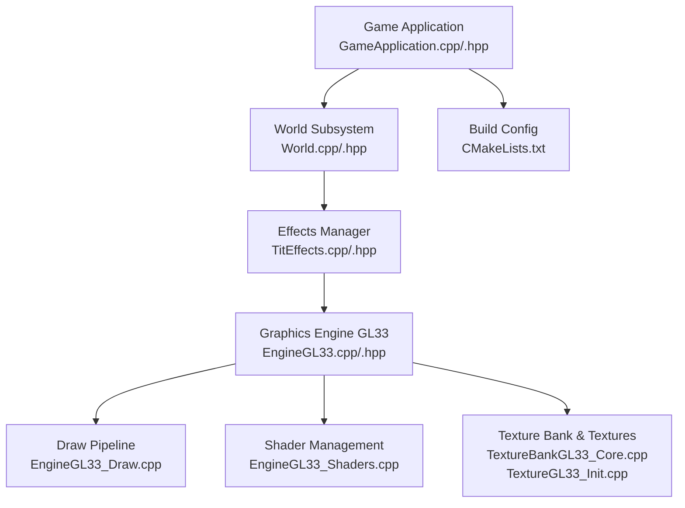
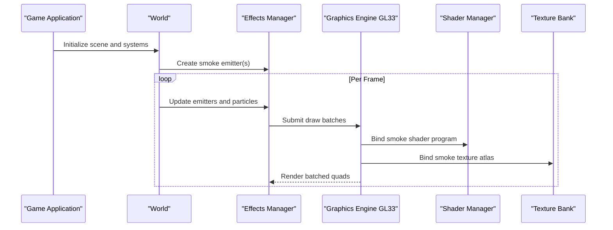
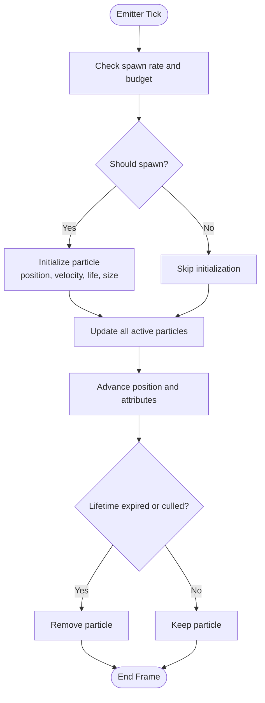
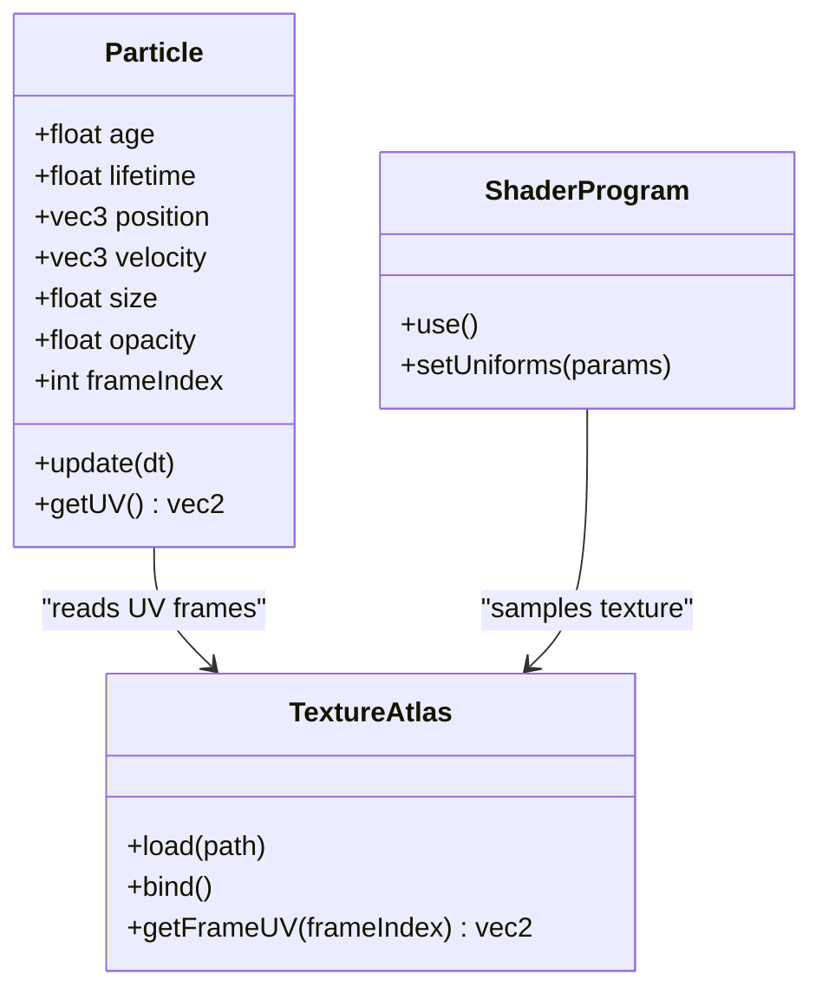
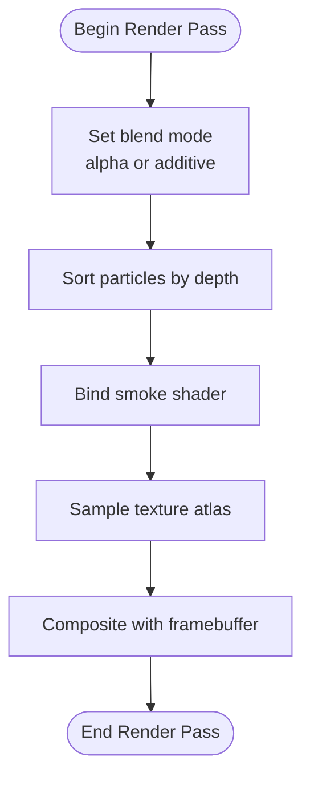
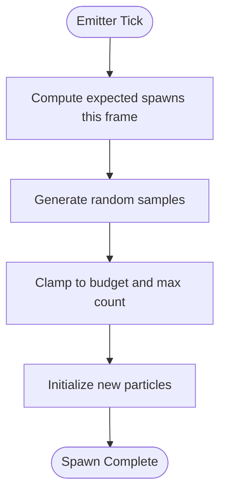
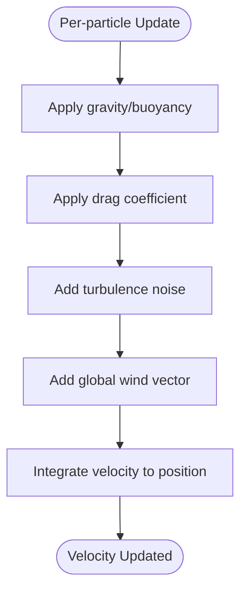
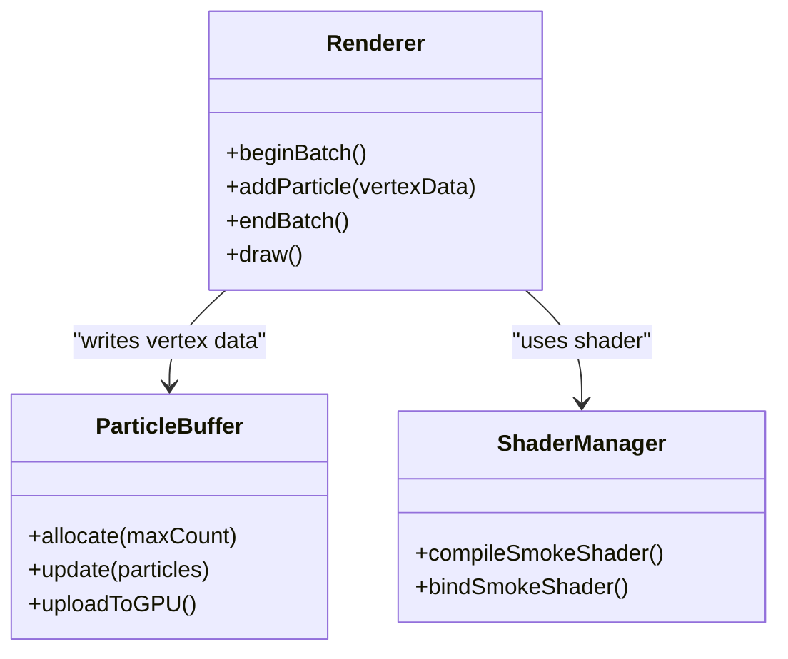
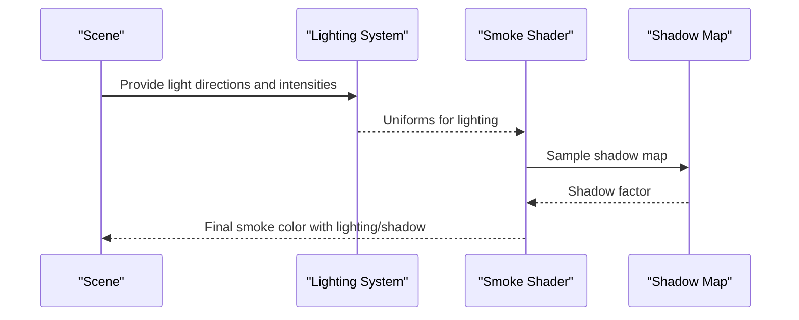
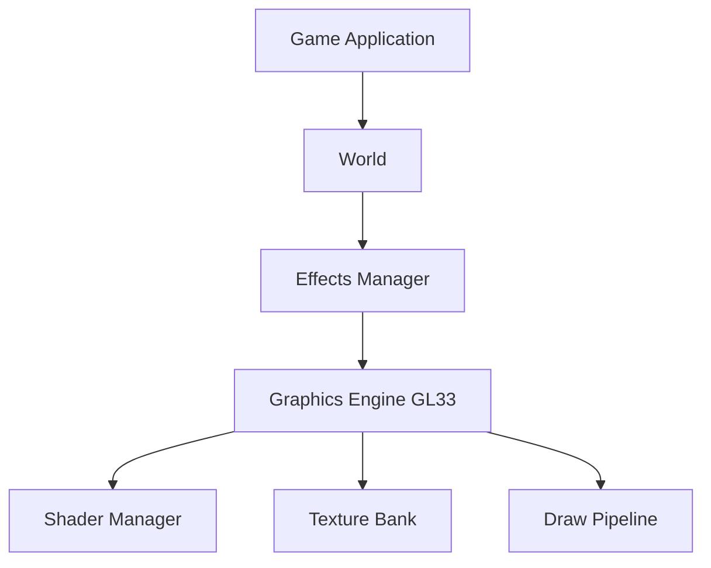

# Smoke Particle System

<cite>
**Referenced Files in This Document**
- [GameApplication.cpp](file://apps/cwr/Game/GameApplication.cpp)
- [GameApplication.hpp](file://apps/cwr/Game/GameApplication.hpp)
- [EngineGL33.cpp](file://engine/PoseidonGL33/EngineGL33.cpp)
- [EngineGL33.hpp](file://engine/PoseidonGL33/EngineGL33.hpp)
- [EngineGL33_Draw.cpp](file://engine/PoseidonGL33/EngineGL33_Draw.cpp)
- [EngineGL33_Shaders.cpp](file://engine/PoseidonGL33/EngineGL33_Shaders.cpp)
- [TextureBankGL33_Core.cpp](file://engine/PoseidonGL33/TextureBankGL33_Core.cpp)
- [TextureGL33_Init.cpp](file://engine/PoseidonGL33/TextureGL33_Init.cpp)
- [World.cpp](file://engine/Poseidon/World/World.cpp)
- [World.hpp](file://engine/Poseidon/World/World.hpp)
- [TitEffects.cpp](file://engine/Poseidon/Game/TitEffects.cpp)
- [TitEffects.hpp](file://engine/Poseidon/Game/TitEffects.hpp)
- [CMakeLists.txt](file://apps/cwr/Game/CMakeLists.txt)
</cite>

## Table of Contents
1. [Introduction](#introduction)
2. [Project Structure](#project-structure)
3. [Core Components](#core-components)
4. [Architecture Overview](#architecture-overview)
5. [Detailed Component Analysis](#detailed-component-analysis)
6. [Dependency Analysis](#dependency-analysis)
7. [Performance Considerations](#performance-considerations)
8. [Troubleshooting Guide](#troubleshooting-guide)
9. [Conclusion](#conclusion)
10. [Appendices](#appendices)

## Introduction
This document explains the smoke particle system implementation, focusing on lifecycle management, texture animation, blending techniques, spawning algorithms, velocity calculations, atmospheric interaction models, performance optimizations (batch rendering and GPU instancing), configuration examples for density, color gradients, and dissipation rates, integration with lighting and shadow casting for volumetric effects, and troubleshooting guidance for common visual artifacts and performance issues.

## Project Structure
The smoke particle system spans several layers:
- Game application entry points that initialize systems and scenes
- World and game subsystems that manage entities and effects
- Graphics engine components responsible for rendering pipelines, shaders, textures, and draw calls
- Configuration and build files that wire features into the application

**Diagram sources**
- [GameApplication.cpp](file://apps/cwr/Game/GameApplication.cpp)
- [GameApplication.hpp](file://apps/cwr/Game/GameApplication.hpp)
- [World.cpp](file://engine/Poseidon/World/World.cpp)
- [World.hpp](file://engine/Poseidon/World/World.hpp)
- [TitEffects.cpp](file://engine/Poseidon/Game/TitEffects.cpp)
- [TitEffects.hpp](file://engine/Poseidon/Game/TitEffects.hpp)
- [EngineGL33.cpp](file://engine/PoseidonGL33/EngineGL33.cpp)
- [EngineGL33.hpp](file://engine/PoseidonGL33/EngineGL33.hpp)
- [EngineGL33_Draw.cpp](file://engine/PoseidonGL33/EngineGL33_Draw.cpp)
- [EngineGL33_Shaders.cpp](file://engine/PoseidonGL33/EngineGL33_Shaders.cpp)
- [TextureBankGL33_Core.cpp](file://engine/PoseidonGL33/TextureBankGL33_Core.cpp)
- [TextureGL33_Init.cpp](file://engine/PoseidonGL33/TextureGL33_Init.cpp)
- [CMakeLists.txt](file://apps/cwr/Game/CMakeLists.txt)

**Section sources**
- [GameApplication.cpp](file://apps/cwr/Game/GameApplication.cpp)
- [GameApplication.hpp](file://apps/cwr/Game/GameApplication.hpp)
- [World.cpp](file://engine/Poseidon/World/World.cpp)
- [World.hpp](file://engine/Poseidon/World/World.hpp)
- [TitEffects.cpp](file://engine/Poseidon/Game/TitEffects.cpp)
- [TitEffects.hpp](file://engine/Poseidon/Game/TitEffects.hpp)
- [EngineGL33.cpp](file://engine/PoseidonGL33/EngineGL33.cpp)
- [EngineGL33.hpp](file://engine/PoseidonGL33/EngineGL33.hpp)
- [EngineGL33_Draw.cpp](file://engine/PoseidonGL33/EngineGL33_Draw.cpp)
- [EngineGL33_Shaders.cpp](file://engine/PoseidonGL33/EngineGL33_Shaders.cpp)
- [TextureBankGL33_Core.cpp](file://engine/PoseidonGL33/TextureBankGL33_Core.cpp)
- [TextureGL33_Init.cpp](file://engine/PoseidonGL33/TextureGL33_Init.cpp)
- [CMakeLists.txt](file://apps/cwr/Game/CMakeLists.txt)

## Core Components
- Game Application: Initializes subsystems and sets up the scene where smoke effects are created and updated.
- World: Manages scene objects and updates per-frame logic, including effect spawning and lifecycle.
- Effects Manager: Provides APIs to create, update, and destroy particle-based effects such as smoke.
- Graphics Engine (GL33): Implements rendering pipeline, shader programs, texture management, and draw batching.
- Texture Bank: Caches and loads textures used by particles (e.g., smoke sprites).
- Shader Management: Compiles and binds shaders for particle rendering, including blending and alpha handling.

Key responsibilities:
- Lifecycle: Spawn, update, and retire particles based on lifetime and visibility.
- Animation: Use texture atlases or sprite sheets to animate smoke over time.
- Blending: Apply additive or alpha blending for realistic smoke appearance.
- Spawning: Emit particles from emitters with randomized initial conditions.
- Velocity: Compute velocities influenced by wind, buoyancy, and turbulence.
- Atmospheric Interaction: Model drag, diffusion, and temperature-driven rise.
- Performance: Batch render calls, use GPU instancing where available, and minimize state changes.

**Section sources**
- [GameApplication.cpp](file://apps/cwr/Game/GameApplication.cpp)
- [GameApplication.hpp](file://apps/cwr/Game/GameApplication.hpp)
- [World.cpp](file://engine/Poseidon/World/World.cpp)
- [World.hpp](file://engine/Poseidon/World/World.hpp)
- [TitEffects.cpp](file://engine/Poseidon/Game/TitEffects.cpp)
- [TitEffects.hpp](file://engine/Poseidon/Game/TitEffects.hpp)
- [EngineGL33.cpp](file://engine/PoseidonGL33/EngineGL33.cpp)
- [EngineGL33.hpp](file://engine/PoseidonGL33/EngineGL33.hpp)
- [EngineGL33_Draw.cpp](file://engine/PoseidonGL33/EngineGL33_Draw.cpp)
- [EngineGL33_Shaders.cpp](file://engine/PoseidonGL33/EngineGL33_Shaders.cpp)
- [TextureBankGL33_Core.cpp](file://engine/PoseidonGL33/TextureBankGL33_Core.cpp)
- [TextureGL33_Init.cpp](file://engine/PoseidonGL33/TextureGL33_Init.cpp)

## Architecture Overview
The smoke system integrates across application, world, effects, and graphics layers. The following sequence shows a typical frame loop for smoke rendering:

**Diagram sources**
- [GameApplication.cpp](file://apps/cwr/Game/GameApplication.cpp)
- [World.cpp](file://engine/Poseidon/World/World.cpp)
- [TitEffects.cpp](file://engine/Poseidon/Game/TitEffects.cpp)
- [EngineGL33.cpp](file://engine/PoseidonGL33/EngineGL33.cpp)
- [EngineGL33_Shaders.cpp](file://engine/PoseidonGL33/EngineGL33_Shaders.cpp)
- [TextureBankGL33_Core.cpp](file://engine/PoseidonGL33/TextureBankGL33_Core.cpp)

## Detailed Component Analysis

### Particle Lifecycle Management
- Emission: Emitters generate new particles at defined rates, positions, and initial velocities.
- Update: Each frame, particles advance position, scale, opacity, and rotation based on physics parameters.
- Retirement: Particles are removed when their lifetime expires or they leave the visible bounds.

**Diagram sources**
- [TitEffects.cpp](file://engine/Poseidon/Game/TitEffects.cpp)
- [World.cpp](file://engine/Poseidon/World/World.cpp)

**Section sources**
- [TitEffects.cpp](file://engine/Poseidon/Game/TitEffects.cpp)
- [World.cpp](file://engine/Poseidon/World/World.cpp)

### Texture Animation
- Sprite Atlases: Smoke uses texture atlases or sprite sheets; UV coordinates are animated per particle to cycle through frames.
- Frame Timing: Each particle tracks its age to compute current frame index and blend between frames if needed.
- Mipmapping and Filtering: Proper mipmaps and anisotropic filtering reduce aliasing and improve readability at distance.

**Diagram sources**
- [TitEffects.cpp](file://engine/Poseidon/Game/TitEffects.cpp)
- [TextureBankGL33_Core.cpp](file://engine/PoseidonGL33/TextureBankGL33_Core.cpp)
- [EngineGL33_Shaders.cpp](file://engine/PoseidonGL33/EngineGL33_Shaders.cpp)

**Section sources**
- [TitEffects.cpp](file://engine/Poseidon/Game/TitEffects.cpp)
- [TextureBankGL33_Core.cpp](file://engine/PoseidonGL33/TextureBankGL33_Core.cpp)
- [EngineGL33_Shaders.cpp](file://engine/PoseidonGL33/EngineGL33_Shaders.cpp)

### Blending Techniques
- Alpha Blending: Standard alpha blending is used to composite smoke with the scene background.
- Additive Blending: For bright highlights or emissive smoke, additive blending can be enabled.
- Depth Handling: Transparent sorting and depth writes are managed to avoid incorrect overlap.

**Diagram sources**
- [EngineGL33_Draw.cpp](file://engine/PoseidonGL33/EngineGL33_Draw.cpp)
- [EngineGL33_Shaders.cpp](file://engine/PoseidonGL33/EngineGL33_Shaders.cpp)

**Section sources**
- [EngineGL33_Draw.cpp](file://engine/PoseidonGL33/EngineGL33_Draw.cpp)
- [EngineGL33_Shaders.cpp](file://engine/PoseidonGL33/EngineGL33_Shaders.cpp)

### Spawning Algorithms
- Rate Control: Emission rate controls how many particles are spawned per second.
- Burst Mode: Optional bursts emit multiple particles instantaneously.
- Randomization: Initial velocity, size, and lifetime are randomized within ranges for natural variation.

**Diagram sources**
- [TitEffects.cpp](file://engine/Poseidon/Game/TitEffects.cpp)

**Section sources**
- [TitEffects.cpp](file://engine/Poseidon/Game/TitEffects.cpp)

### Velocity Calculations and Atmospheric Interaction
- Buoyancy: Upward force proportional to temperature difference drives smoke rise.
- Drag: Air resistance reduces velocity over time.
- Turbulence: Noise or random perturbations add chaotic motion.
- Wind: Global wind vectors influence particle drift.

**Diagram sources**
- [TitEffects.cpp](file://engine/Poseidon/Game/TitEffects.cpp)
- [World.cpp](file://engine/Poseidon/World/World.cpp)

**Section sources**
- [TitEffects.cpp](file://engine/Poseidon/Game/TitEffects.cpp)
- [World.cpp](file://engine/Poseidon/World/World.cpp)

### Performance Optimization Strategies
- Batch Rendering: Group particles into draw calls to minimize state changes.
- GPU Instancing: Where supported, instance geometry to render many particles efficiently.
- Texture Atlasing: Combine smoke frames into a single texture to reduce binding overhead.
- Frustum Culling: Exclude off-screen particles from updates and rendering.
- LOD and Distance Fade: Reduce detail and opacity for distant particles.

**Diagram sources**
- [EngineGL33_Draw.cpp](file://engine/PoseidonGL33/EngineGL33_Draw.cpp)
- [EngineGL33_Shaders.cpp](file://engine/PoseidonGL33/EngineGL33_Shaders.cpp)

**Section sources**
- [EngineGL33_Draw.cpp](file://engine/PoseidonGL33/EngineGL33_Draw.cpp)
- [EngineGL33_Shaders.cpp](file://engine/PoseidonGL33/EngineGL33_Shaders.cpp)

### Integration with Lighting and Shadow Casting
- Volumetric Lighting: Smoke interacts with light via scattering approximations in shaders.
- Shadow Mapping: For dense smoke, shadow maps can modulate opacity or intensity.
- Ambient Occlusion: AO can darken smoke near surfaces for realism.

**Diagram sources**
- [EngineGL33_Shaders.cpp](file://engine/PoseidonGL33/EngineGL33_Shaders.cpp)

**Section sources**
- [EngineGL33_Shaders.cpp](file://engine/PoseidonGL33/EngineGL33_Shaders.cpp)

### Configuration Examples
- Density: Adjust emission rate and particle opacity to control perceived density.
- Color Gradients: Define color ramps across particle lifetime for realistic transitions.
- Dissipation Rates: Tune drag and fade-out curves to control how quickly smoke dissipates.
- Size Scaling: Modify base size and growth over lifetime for different smoke types.

Configuration typically involves:
- Emission parameters: rate, burst count, lifetime range
- Physics parameters: buoyancy strength, drag coefficient, turbulence amplitude
- Visual parameters: base size, growth rate, color ramp, opacity curve
- Rendering parameters: blend mode, texture atlas selection, LOD thresholds

**Section sources**
- [TitEffects.cpp](file://engine/Poseidon/Game/TitEffects.cpp)
- [EngineGL33_Shaders.cpp](file://engine/PoseidonGL33/EngineGL33_Shaders.cpp)

## Dependency Analysis
The smoke system depends on world updates, effects management, and graphics rendering. The following diagram illustrates key dependencies:

**Diagram sources**
- [GameApplication.cpp](file://apps/cwr/Game/GameApplication.cpp)
- [World.cpp](file://engine/Poseidon/World/World.cpp)
- [TitEffects.cpp](file://engine/Poseidon/Game/TitEffects.cpp)
- [EngineGL33.cpp](file://engine/PoseidonGL33/EngineGL33.cpp)
- [EngineGL33_Shaders.cpp](file://engine/PoseidonGL33/EngineGL33_Shaders.cpp)
- [TextureBankGL33_Core.cpp](file://engine/PoseidonGL33/TextureBankGL33_Core.cpp)
- [EngineGL33_Draw.cpp](file://engine/PoseidonGL33/EngineGL33_Draw.cpp)

**Section sources**
- [GameApplication.cpp](file://apps/cwr/Game/GameApplication.cpp)
- [World.cpp](file://engine/Poseidon/World/World.cpp)
- [TitEffects.cpp](file://engine/Poseidon/Game/TitEffects.cpp)
- [EngineGL33.cpp](file://engine/PoseidonGL33/EngineGL33.cpp)
- [EngineGL33_Shaders.cpp](file://engine/PoseidonGL33/EngineGL33_Shaders.cpp)
- [TextureBankGL33_Core.cpp](file://engine/PoseidonGL33/TextureBankGL33_Core.cpp)
- [EngineGL33_Draw.cpp](file://engine/PoseidonGL33/EngineGL33_Draw.cpp)

## Performance Considerations
- Minimize State Changes: Group particles by material and blend mode to reduce shader and texture bindings.
- Use Efficient Data Structures: Arrays of structures (AoS) or structures of arrays (SoA) for cache-friendly updates.
- Limit Overdraw: Avoid excessive particle overlap; adjust sizes and lifetimes.
- Adaptive Quality: Reduce particle counts or disable effects at lower settings.
- Profiling: Monitor CPU/GPU usage to identify bottlenecks in update or render paths.

[No sources needed since this section provides general guidance]

## Troubleshooting Guide
Common visual artifacts:
- Banding in gradients: Increase texture precision or smooth color ramps.
- Flickering edges: Ensure proper mipmapping and filtering; check UV boundaries.
- Incorrect transparency: Verify blend modes and depth sorting order.
- Stuttering updates: Optimize particle update loops and reduce allocations per frame.

Performance issues:
- High draw call count: Implement batching and instancing.
- Excessive memory usage: Reuse buffers and limit particle pool size.
- Shader recompilation stalls: Cache compiled shaders and validate inputs.

Debugging steps:
- Log particle counts and lifetimes to verify lifecycle behavior.
- Visualize bounding volumes to confirm culling correctness.
- Inspect shader uniforms for lighting and shadow sampling.

**Section sources**
- [EngineGL33_Draw.cpp](file://engine/PoseidonGL33/EngineGL33_Draw.cpp)
- [EngineGL33_Shaders.cpp](file://engine/PoseidonGL33/EngineGL33_Shaders.cpp)
- [TextureGL33_Init.cpp](file://engine/PoseidonGL33/TextureGL33_Init.cpp)

## Conclusion
The smoke particle system combines robust lifecycle management, texture animation, and blending techniques to produce realistic effects. By leveraging batch rendering, GPU instancing, and careful configuration of density, color gradients, and dissipation rates, it achieves both visual fidelity and performance. Integration with lighting and shadow mapping enhances volumetric realism. Proper debugging and optimization ensure stable operation under varying conditions.

[No sources needed since this section summarizes without analyzing specific files]

## Appendices
- Build Integration: Ensure smoke-related modules are included in the application build configuration.
- Testing: Validate smoke behavior across different hardware profiles and driver versions.

**Section sources**
- [CMakeLists.txt](file://apps/cwr/Game/CMakeLists.txt)