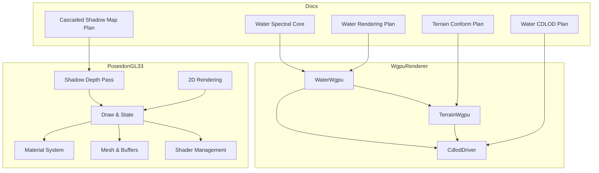
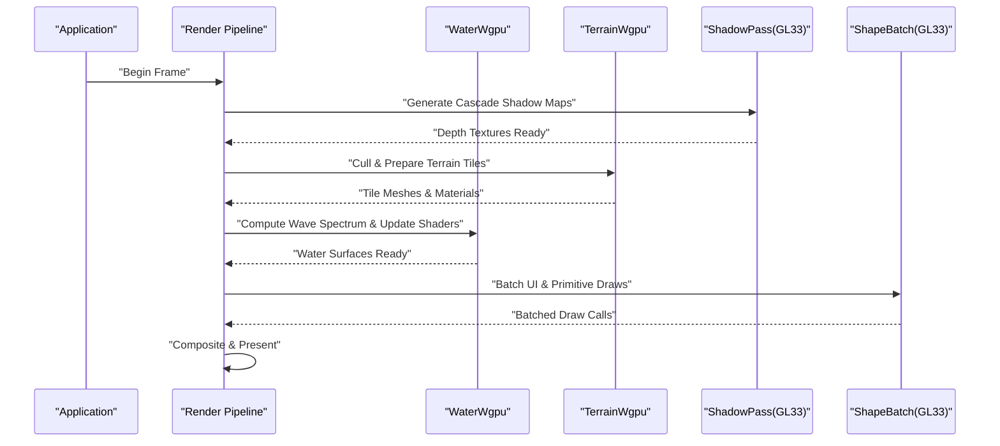
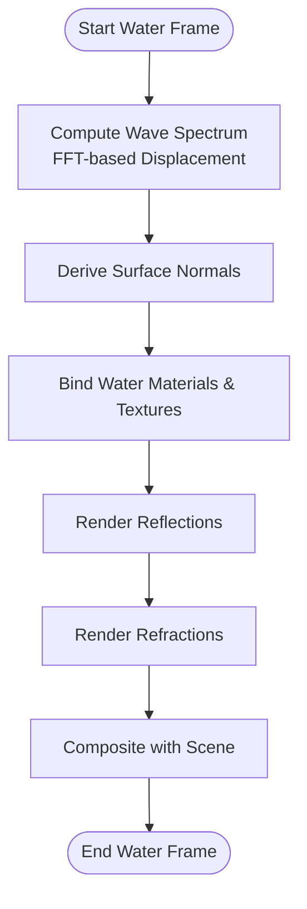
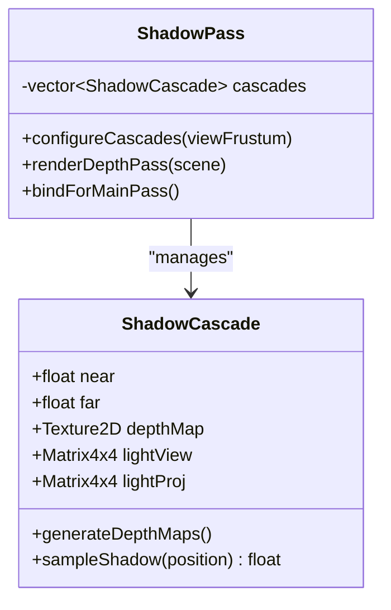
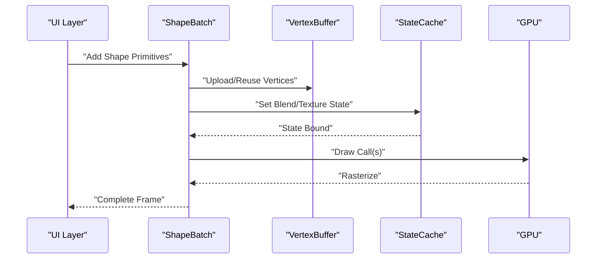
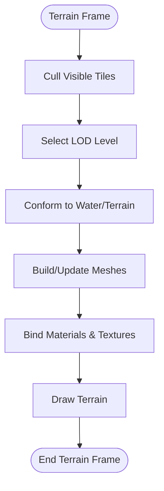
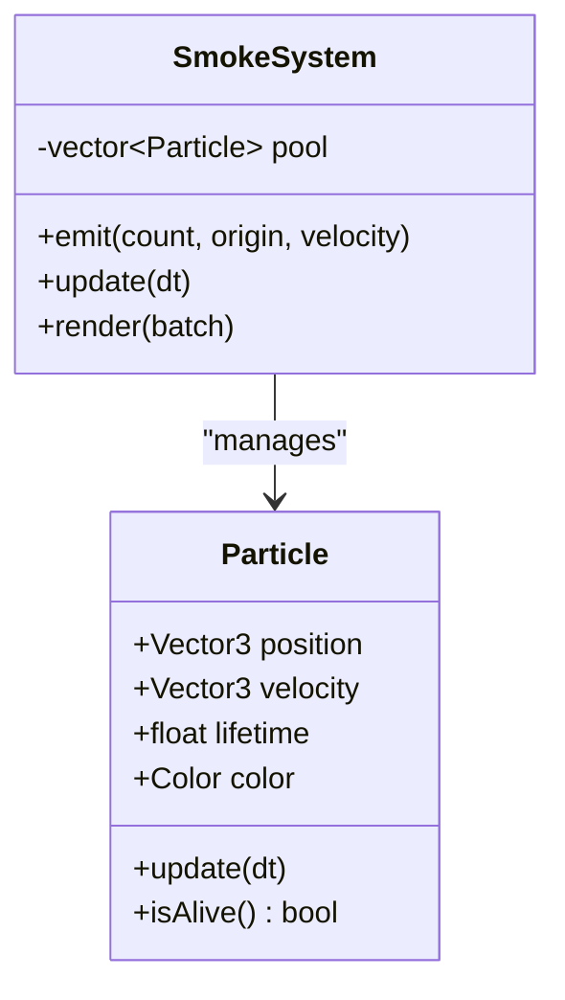
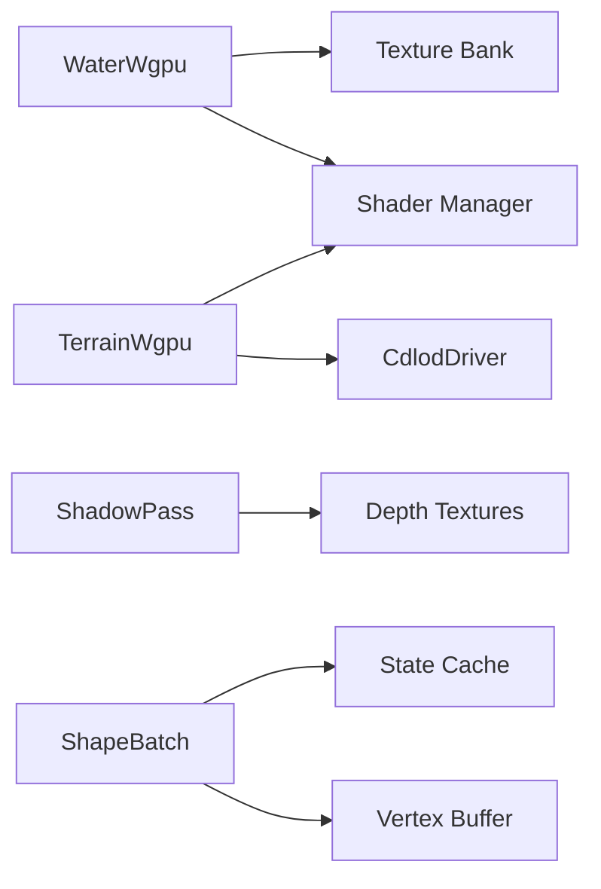

# Specialized Effects

<cite>
**Referenced Files in This Document**
- [WaterWgpu.cpp](file://engine/WgpuRenderer/WaterWgpu.cpp)
- [WaterWgpu.hpp](file://engine/WgpuRenderer/WaterWgpu.hpp)
- [TerrainWgpu.cpp](file://engine/WgpuRenderer/TerrainWgpu.cpp)
- [TerrainWgpu.hpp](file://engine/WgpuRenderer/TerrainWgpu.hpp)
- [EngineGL33_ShadowDepth.cpp](file://engine/PoseidonGL33/EngineGL33_ShadowDepth.cpp)
- [EngineGL33_2DRendering.cpp](file://engine/PoseidonGL33/EngineGL33_2DRendering.cpp)
- [EngineGL33_Draw.cpp](file://engine/PoseidonGL33/EngineGL33_Draw.cpp)
- [EngineGL33_Material.cpp](file://engine/PoseidonGL33/EngineGL33_Material.cpp)
- [EngineGL33_Mesh.cpp](file://engine/PoseidonGL33/EngineGL33_Mesh.cpp)
- [EngineGL33_State.cpp](file://engine/PoseidonGL33/EngineGL33_State.cpp)
- [EngineGL33_VertexBuffer.cpp](file://engine/PoseidonGL33/EngineGL33_VertexBuffer.cpp)
- [EngineGL33_Lifecycle.cpp](file://engine/PoseidonGL33/EngineGL33_Lifecycle.cpp)
- [EngineGL33_Shaders.cpp](file://engine/PoseidonGL33/EngineGL33_Shaders.cpp)
- [CdlodDriver.hpp](file://engine/WgpuRenderer/CdlodDriver.hpp)
- [wtr-001-report.md](file://docs/wtr-001-report.md)
- [water-spectral-core.md](file://engine/WgpuRenderer/docs/water-spectral-core.md)
- [cascaded-shadow-map-plan.md](file://engine/WgpuRenderer/docs/cascaded-shadow-map-plan.md)
- [water-rendering-plan.md](file://engine/WgpuRenderer/docs/water-rendering-plan.md)
- [terrain-conform-vegetation-roads-plan.md](file://engine/WgpuRenderer/docs/terrain-conform-vegetation-roads-plan.md)
- [water-cdlod-geometry-plan.md](file://engine/WgpuRenderer/docs/water-cdlod-geometry-plan.md)
</cite>

## Table of Contents
1. [Introduction](#introduction)
2. [Project Structure](#project-structure)
3. [Core Components](#core-components)
4. [Architecture Overview](#architecture-overview)
5. [Detailed Component Analysis](#detailed-component-analysis)
6. [Dependency Analysis](#dependency-analysis)
7. [Performance Considerations](#performance-considerations)
8. [Troubleshooting Guide](#troubleshooting-guide)
9. [Conclusion](#conclusion)
10. [Appendices](#appendices)

## Introduction
This document explains specialized rendering effects implemented in the engine, focusing on smoke particles, shadow mapping, shape rendering, and water simulation. It covers the particle system architecture, cascaded shadow map implementation, terrain rendering optimizations, and the water rendering pipeline using FFT-based wave simulation with reflection/refraction. It also details how these effects integrate with the main rendering pipeline, their performance characteristics, examples for creating custom effects, optimization strategies, debugging techniques, and visual quality tuning.

## Project Structure
The relevant code is primarily located under:
- WgpuRenderer: modern GPU renderer components for water, terrain, and related systems
- PoseidonGL33: legacy OpenGL 3.3 backend used for shadow depth passes, 2D rendering, draw state management, materials, mesh handling, shaders, and vertex buffers
- Documentation plans and reports describing water spectral core, cascaded shadows, water rendering, terrain conforming, and CDLOD for water geometry

**Diagram sources**
- [WaterWgpu.cpp](file://engine/WgpuRenderer/WaterWgpu.cpp)
- [TerrainWgpu.cpp](file://engine/WgpuRenderer/TerrainWgpu.cpp)
- [CdlodDriver.hpp](file://engine/WgpuRenderer/CdlodDriver.hpp)
- [EngineGL33_ShadowDepth.cpp](file://engine/PoseidonGL33/EngineGL33_ShadowDepth.cpp)
- [EngineGL33_2DRendering.cpp](file://engine/PoseidonGL33/EngineGL33_2DRendering.cpp)
- [EngineGL33_Draw.cpp](file://engine/PoseidonGL33/EngineGL33_Draw.cpp)
- [EngineGL33_Material.cpp](file://engine/PoseidonGL33/EngineGL33_Material.cpp)
- [EngineGL33_Mesh.cpp](file://engine/PoseidonGL33/EngineGL33_Mesh.cpp)
- [EngineGL33_State.cpp](file://engine/PoseidonGL33/EngineGL33_State.cpp)
- [EngineGL33_Shaders.cpp](file://engine/PoseidonGL33/EngineGL33_Shaders.cpp)
- [water-spectral-core.md](file://engine/WgpuRenderer/docs/water-spectral-core.md)
- [cascaded-shadow-map-plan.md](file://engine/WgpuRenderer/docs/cascaded-shadow-map-plan.md)
- [water-rendering-plan.md](file://engine/WgpuRenderer/docs/water-rendering-plan.md)
- [terrain-conform-vegetation-roads-plan.md](file://engine/WgpuRenderer/docs/terrain-conform-vegetation-roads-plan.md)
- [water-cdlod-geometry-plan.md](file://engine/WgpuRenderer/docs/water-cdlod-geometry-plan.md)

**Section sources**
- [EngineGL33_ShadowDepth.cpp](file://engine/PoseidonGL33/EngineGL33_ShadowDepth.cpp)
- [EngineGL33_2DRendering.cpp](file://engine/PoseidonGL33/EngineGL33_2DRendering.cpp)
- [EngineGL33_Draw.cpp](file://engine/PoseidonGL33/EngineGL33_Draw.cpp)
- [EngineGL33_Material.cpp](file://engine/PoseidonGL33/EngineGL33_Material.cpp)
- [EngineGL33_Mesh.cpp](file://engine/PoseidonGL33/EngineGL33_Mesh.cpp)
- [EngineGL33_State.cpp](file://engine/PoseidonGL33/EngineGL33_State.cpp)
- [EngineGL33_VertexBuffer.cpp](file://engine/PoseidonGL33/EngineGL33_VertexBuffer.cpp)
- [EngineGL33_Lifecycle.cpp](file://engine/PoseidonGL33/EngineGL33_Lifecycle.cpp)
- [EngineGL33_Shaders.cpp](file://engine/PoseidonGL33/EngineGL33_Shaders.cpp)
- [WaterWgpu.cpp](file://engine/WgpuRenderer/WaterWgpu.cpp)
- [TerrainWgpu.cpp](file://engine/WgpuRenderer/TerrainWgpu.cpp)
- [CdlodDriver.hpp](file://engine/WgpuRenderer/CdlodDriver.hpp)
- [water-spectral-core.md](file://engine/WgpuRenderer/docs/water-spectral-core.md)
- [cascaded-shadow-map-plan.md](file://engine/WgpuRenderer/docs/cascaded-shadow-map-plan.md)
- [water-rendering-plan.md](file://engine/WgpuRenderer/docs/water-rendering-plan.md)
- [terrain-conform-vegetation-roads-plan.md](file://engine/WgpuRenderer/docs/terrain-conform-vegetation-roads-plan.md)
- [water-cdlod-geometry-plan.md](file://engine/WgpuRenderer/docs/water-cdlod-geometry-plan.md)

## Core Components
- Water Simulation (FFT-based): Implements spectral wave generation, reflection/refraction, and integration into the forward or deferred rendering path. See WaterWgpu and water-spectral-core documentation.
- Shadow Mapping (Cascaded): Generates shadow maps via a dedicated pass to improve accuracy across view frustum ranges. See EngineGL33_ShadowDepth and cascaded-shadow-map plan.
- Shape Rendering (2D UI and 3D Geometry): Provides batched drawing for shapes and UI elements, leveraging state caching and vertex buffer management. See EngineGL33_2DRendering and related draw/state/mesh/shader files.
- Terrain Rendering Optimizations: Includes conforming vegetation/roads and CDLOD for water geometry to reduce overdraw and maintain performance at distance. See TerrainWgpu and related plans.

Key responsibilities:
- WaterWgpu: Wave spectrum computation, surface displacement, reflections/refractions, shader parameter updates, and render queue integration.
- TerrainWgpu: Terrain tile culling, LOD selection, material binding, and interaction with water surfaces.
- CdlodDriver: Adaptive geometry subdivision for water patches based on camera distance and screen-space error metrics.
- GL33 Shadow Depth: Shadow map generation per cascade, depth-only rendering, and cascade configuration.
- GL33 2D Rendering: Batched primitive drawing, texture atlas usage, and UI shape composition.

**Section sources**
- [WaterWgpu.cpp](file://engine/WgpuRenderer/WaterWgpu.cpp)
- [WaterWgpu.hpp](file://engine/WgpuRenderer/WaterWgpu.hpp)
- [TerrainWgpu.cpp](file://engine/WgpuRenderer/TerrainWgpu.cpp)
- [TerrainWgpu.hpp](file://engine/WgpuRenderer/TerrainWgpu.hpp)
- [CdlodDriver.hpp](file://engine/WgpuRenderer/CdlodDriver.hpp)
- [EngineGL33_ShadowDepth.cpp](file://engine/PoseidonGL33/EngineGL33_ShadowDepth.cpp)
- [EngineGL33_2DRendering.cpp](file://engine/PoseidonGL33/EngineGL33_2DRendering.cpp)
- [EngineGL33_Draw.cpp](file://engine/PoseidonGL33/EngineGL33_Draw.cpp)
- [EngineGL33_Material.cpp](file://engine/PoseidonGL33/EngineGL33_Material.cpp)
- [EngineGL33_Mesh.cpp](file://engine/PoseidonGL33/EngineGL33_Mesh.cpp)
- [EngineGL33_State.cpp](file://engine/PoseidonGL33/EngineGL33_State.cpp)
- [EngineGL33_VertexBuffer.cpp](file://engine/PoseidonGL33/EngineGL33_VertexBuffer.cpp)
- [EngineGL33_Lifecycle.cpp](file://engine/PoseidonGL33/EngineGL33_Lifecycle.cpp)
- [EngineGL33_Shaders.cpp](file://engine/PoseidonGL33/EngineGL33_Shaders.cpp)
- [water-spectral-core.md](file://engine/WgpuRenderer/docs/water-spectral-core.md)
- [cascaded-shadow-map-plan.md](file://engine/WgpuRenderer/docs/cascaded-shadow-map-plan.md)
- [water-rendering-plan.md](file://engine/WgpuRenderer/docs/water-rendering-plan.md)
- [terrain-conform-vegetation-roads-plan.md](file://engine/WgpuRenderer/docs/terrain-conform-vegetation-roads-plan.md)
- [water-cdlod-geometry-plan.md](file://engine/WgpuRenderer/docs/water-cdlod-geometry-plan.md)

## Architecture Overview
The rendering pipeline integrates multiple specialized effects:
- Water simulation computes wave heights and normals via FFT, then renders reflective/refractive surfaces with appropriate shading and blending.
- Shadow mapping uses a cascade strategy to generate depth maps from light space, improving shadow resolution near the viewer while maintaining coverage at distance.
- Shape rendering batches 2D primitives and UI elements, minimizing state changes and draw calls through efficient vertex buffer management.
- Terrain rendering employs LOD and conforming techniques to blend geometry with water and other features, reducing overdraw and maintaining frame pacing.

**Diagram sources**
- [EngineGL33_ShadowDepth.cpp](file://engine/PoseidonGL33/EngineGL33_ShadowDepth.cpp)
- [WaterWgpu.cpp](file://engine/WgpuRenderer/WaterWgpu.cpp)
- [TerrainWgpu.cpp](file://engine/WgpuRenderer/TerrainWgpu.cpp)
- [EngineGL33_2DRendering.cpp](file://engine/PoseidonGL33/EngineGL33_2DRendering.cpp)

**Section sources**
- [EngineGL33_ShadowDepth.cpp](file://engine/PoseidonGL33/EngineGL33_ShadowDepth.cpp)
- [WaterWgpu.cpp](file://engine/WgpuRenderer/WaterWgpu.cpp)
- [TerrainWgpu.cpp](file://engine/WgpuRenderer/TerrainWgpu.cpp)
- [EngineGL33_2DRendering.cpp](file://engine/PoseidonGL33/EngineGL33_2DRendering.cpp)

## Detailed Component Analysis

### Water Rendering Pipeline (FFT-Based Waves, Reflection/Refraction)
- Wave Spectrum: Computes spectral amplitudes and phases to derive surface displacement and normals. Parameters include wind speed, direction, and fetch length.
- Reflection/Refraction: Uses environment textures and depth sampling to simulate reflections and refractions; may incorporate screen-space techniques for realism.
- Integration: Updates shader uniforms each frame, binds water materials, and participates in the main color/depth passes.

**Diagram sources**
- [WaterWgpu.cpp](file://engine/WgpuRenderer/WaterWgpu.cpp)
- [water-spectral-core.md](file://engine/WgpuRenderer/docs/water-spectral-core.md)
- [water-rendering-plan.md](file://engine/WgpuRenderer/docs/water-rendering-plan.md)

**Section sources**
- [WaterWgpu.cpp](file://engine/WgpuRenderer/WaterWgpu.cpp)
- [WaterWgpu.hpp](file://engine/WgpuRenderer/WaterWgpu.hpp)
- [water-spectral-core.md](file://engine/WgpuRenderer/docs/water-spectral-core.md)
- [water-rendering-plan.md](file://engine/WgpuRenderer/docs/water-rendering-plan.md)

### Shadow Mapping (Cascaded Implementation)
- Cascade Generation: Divides the view frustum into multiple cascades, generating depth maps per cascade to balance resolution and coverage.
- Depth-Only Pass: Renders scene geometry from light perspective into cascade textures without color output.
- Sampling: During main rendering, samples cascade textures based on world position to compute shadow factors.

**Diagram sources**
- [EngineGL33_ShadowDepth.cpp](file://engine/PoseidonGL33/EngineGL33_ShadowDepth.cpp)
- [cascaded-shadow-map-plan.md](file://engine/WgpuRenderer/docs/cascaded-shadow-map-plan.md)

**Section sources**
- [EngineGL33_ShadowDepth.cpp](file://engine/PoseidonGL33/EngineGL33_ShadowDepth.cpp)
- [cascaded-shadow-map-plan.md](file://engine/WgpuRenderer/docs/cascaded-shadow-map-plan.md)

### Shape Rendering (2D UI Elements and 3D Geometry)
- Batching: Groups draw calls for shapes and UI elements to minimize state changes and driver overhead.
- Vertex Buffer Management: Efficiently uploads and reuses vertex data for repeated primitives.
- Material Binding: Applies textures and blending modes required for UI and 2D overlays.

**Diagram sources**
- [EngineGL33_2DRendering.cpp](file://engine/PoseidonGL33/EngineGL33_2DRendering.cpp)
- [EngineGL33_Draw.cpp](file://engine/PoseidonGL33/EngineGL33_Draw.cpp)
- [EngineGL33_State.cpp](file://engine/PoseidonGL33/EngineGL33_State.cpp)
- [EngineGL33_VertexBuffer.cpp](file://engine/PoseidonGL33/EngineGL33_VertexBuffer.cpp)

**Section sources**
- [EngineGL33_2DRendering.cpp](file://engine/PoseidonGL33/EngineGL33_2DRendering.cpp)
- [EngineGL33_Draw.cpp](file://engine/PoseidonGL33/EngineGL33_Draw.cpp)
- [EngineGL33_State.cpp](file://engine/PoseidonGL33/EngineGL33_State.cpp)
- [EngineGL33_VertexBuffer.cpp](file://engine/PoseidonGL33/EngineGL33_VertexBuffer.cpp)

### Terrain Rendering Optimizations
- Conform Vegetation/Roads: Adjusts geometry to align with water and terrain features, reducing popping and artifacts.
- CDLOD for Water Geometry: Dynamically subdivides water patches based on distance and screen error, balancing detail and performance.

**Diagram sources**
- [TerrainWgpu.cpp](file://engine/WgpuRenderer/TerrainWgpu.cpp)
- [terrain-conform-vegetation-roads-plan.md](file://engine/WgpuRenderer/docs/terrain-conform-vegetation-roads-plan.md)
- [water-cdlod-geometry-plan.md](file://engine/WgpuRenderer/docs/water-cdlod-geometry-plan.md)

**Section sources**
- [TerrainWgpu.cpp](file://engine/WgpuRenderer/TerrainWgpu.cpp)
- [TerrainWgpu.hpp](file://engine/WgpuRenderer/TerrainWgpu.hpp)
- [terrain-conform-vegetation-roads-plan.md](file://engine/WgpuRenderer/docs/terrain-conform-vegetation-roads-plan.md)
- [water-cdlod-geometry-plan.md](file://engine/WgpuRenderer/docs/water-cdlod-geometry-plan.md)

### Particle System Architecture (Smoke Particles)
- Emission: Spawns particles with initial velocity, lifetime, and properties.
- Update: Advances positions, applies forces (wind, turbulence), and fades lifetimes.
- Rendering: Batches sprites or billboards, uses alpha blending and texture atlases for smoke appearance.

[No diagram sources needed since this section describes conceptual architecture]

**Section sources**
- [EngineGL33_Draw.cpp](file://engine/PoseidonGL33/EngineGL33_Draw.cpp)
- [EngineGL33_State.cpp](file://engine/PoseidonGL33/EngineGL33_State.cpp)
- [EngineGL33_Material.cpp](file://engine/PoseidonGL33/EngineGL33_Material.cpp)

## Dependency Analysis
- WaterWgpu depends on shader management and texture bindings for environment maps and depth sampling.
- TerrainWgpu interacts with CDLOD for adaptive geometry and material systems for texturing.
- ShadowPass relies on depth-only rendering and cascade configuration logic.
- Shape batching depends on vertex buffer management and state caching to minimize draw call overhead.

**Diagram sources**
- [WaterWgpu.cpp](file://engine/WgpuRenderer/WaterWgpu.cpp)
- [TerrainWgpu.cpp](file://engine/WgpuRenderer/TerrainWgpu.cpp)
- [CdlodDriver.hpp](file://engine/WgpuRenderer/CdlodDriver.hpp)
- [EngineGL33_ShadowDepth.cpp](file://engine/PoseidonGL33/EngineGL33_ShadowDepth.cpp)
- [EngineGL33_2DRendering.cpp](file://engine/PoseidonGL33/EngineGL33_2DRendering.cpp)
- [EngineGL33_State.cpp](file://engine/PoseidonGL33/EngineGL33_State.cpp)
- [EngineGL33_VertexBuffer.cpp](file://engine/PoseidonGL33/EngineGL33_VertexBuffer.cpp)

**Section sources**
- [WaterWgpu.cpp](file://engine/WgpuRenderer/WaterWgpu.cpp)
- [TerrainWgpu.cpp](file://engine/WgpuRenderer/TerrainWgpu.cpp)
- [CdlodDriver.hpp](file://engine/WgpuRenderer/CdlodDriver.hpp)
- [EngineGL33_ShadowDepth.cpp](file://engine/PoseidonGL33/EngineGL33_ShadowDepth.cpp)
- [EngineGL33_2DRendering.cpp](file://engine/PoseidonGL33/EngineGL33_2DRendering.cpp)
- [EngineGL33_State.cpp](file://engine/PoseidonGL33/EngineGL33_State.cpp)
- [EngineGL33_VertexBuffer.cpp](file://engine/PoseidonGL33/EngineGL33_VertexBuffer.cpp)

## Performance Considerations
- Water Simulation: Limit FFT resolution and update frequency; use level-of-detail for wave complexity; optimize shader math and texture sampling.
- Shadow Mapping: Tune cascade count and split distribution; reduce shadow map resolution where possible; avoid overdraw by culling occluded objects.
- Shape Rendering: Maximize batching efficiency; reuse vertex buffers; minimize state switches; prefer texture atlases for UI.
- Terrain Optimization: Use CDLOD aggressively for distant water; conform geometry to prevent excessive tessellation; cull off-screen tiles early.

[No sources needed since this section provides general guidance]

## Troubleshooting Guide
- Water Artifacts: Check wave spectrum parameters; verify environment map alignment; ensure correct normal derivation and reflection/refraction sampling.
- Shadow Issues: Validate cascade boundaries; confirm depth bias settings; inspect light-space transformations; debug with depth visualization.
- Shape/UI Problems: Inspect vertex buffer uploads; verify blending states; check texture coordinates and atlas layout.
- Terrain Popping: Adjust CDLOD thresholds; ensure smooth transitions between LOD levels; validate conforming algorithms.

**Section sources**
- [EngineGL33_ShadowDepth.cpp](file://engine/PoseidonGL33/EngineGL33_ShadowDepth.cpp)
- [EngineGL33_2DRendering.cpp](file://engine/PoseidonGL33/EngineGL33_2DRendering.cpp)
- [EngineGL33_State.cpp](file://engine/PoseidonGL33/EngineGL33_State.cpp)
- [EngineGL33_VertexBuffer.cpp](file://engine/PoseidonGL33/EngineGL33_VertexBuffer.cpp)
- [water-spectral-core.md](file://engine/WgpuRenderer/docs/water-spectral-core.md)
- [cascaded-shadow-map-plan.md](file://engine/WgpuRenderer/docs/cascaded-shadow-map-plan.md)
- [water-cdlod-geometry-plan.md](file://engine/WgpuRenderer/docs/water-cdlod-geometry-plan.md)

## Conclusion
The engine’s specialized effects—smoke particles, shadow mapping, shape rendering, and water simulation—are integrated into a cohesive pipeline that balances visual fidelity and performance. By leveraging FFT-based water simulation, cascaded shadow maps, efficient batching, and terrain optimizations, the system delivers high-quality visuals while maintaining responsiveness. Custom effects can be developed by following established patterns for resource management, shader updates, and render integration. Debugging tools and tuning parameters enable iterative refinement for optimal results.

[No sources needed since this section summarizes without analyzing specific files]

## Appendices
- Additional references: wtr-001-report.md for broader water system context and planning insights.

**Section sources**
- [wtr-001-report.md](file://docs/wtr-001-report.md)