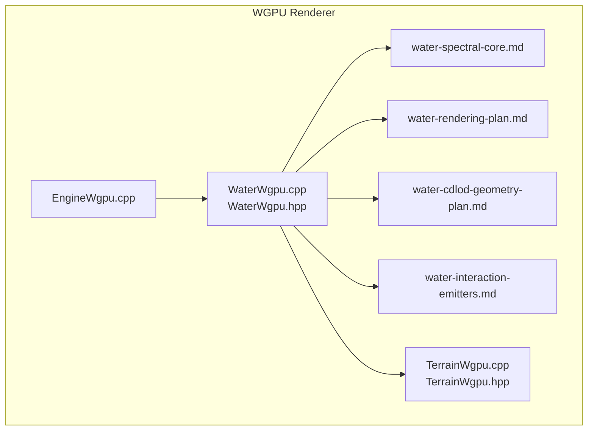
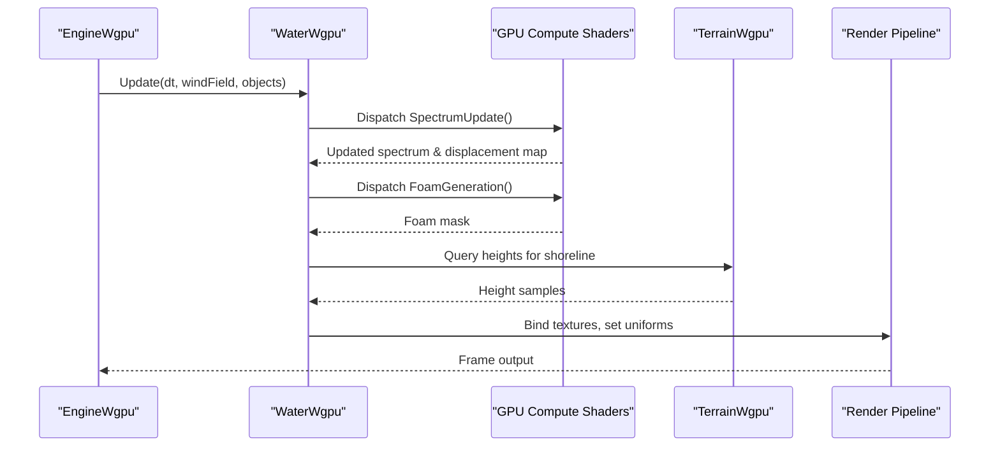
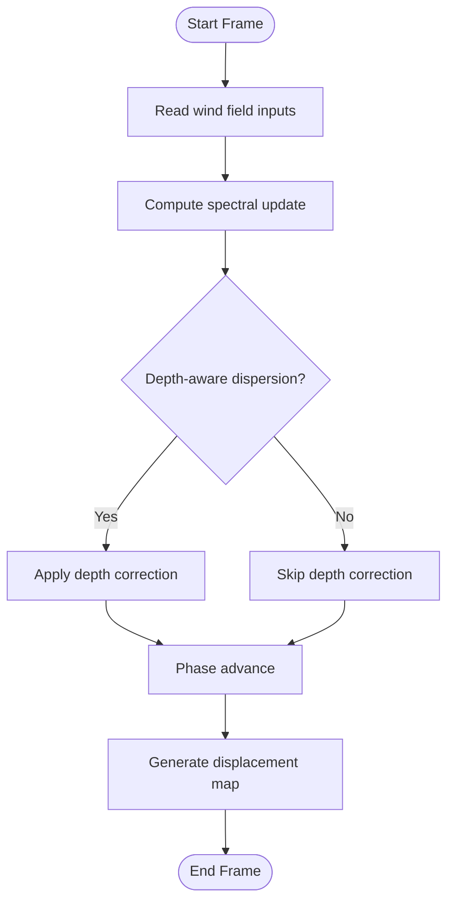
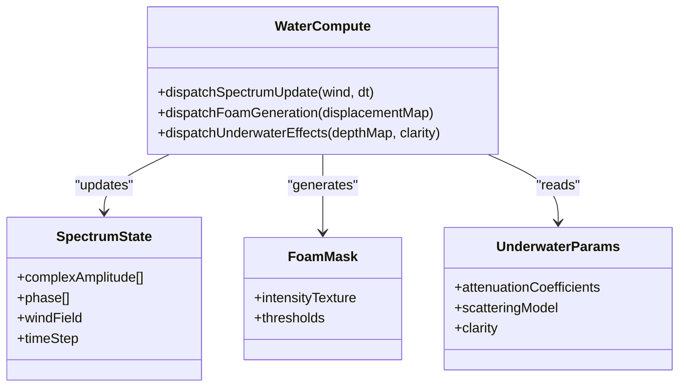
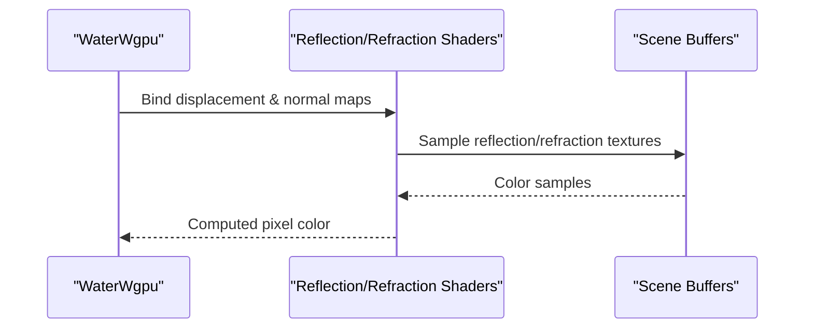
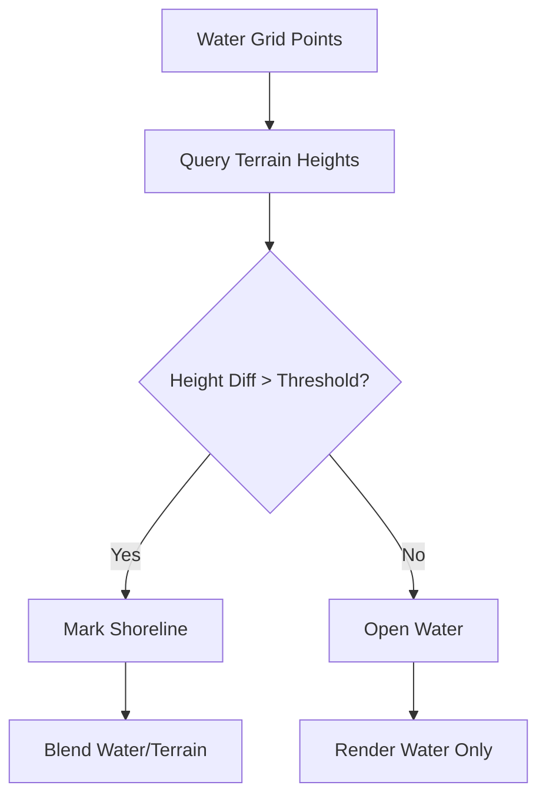
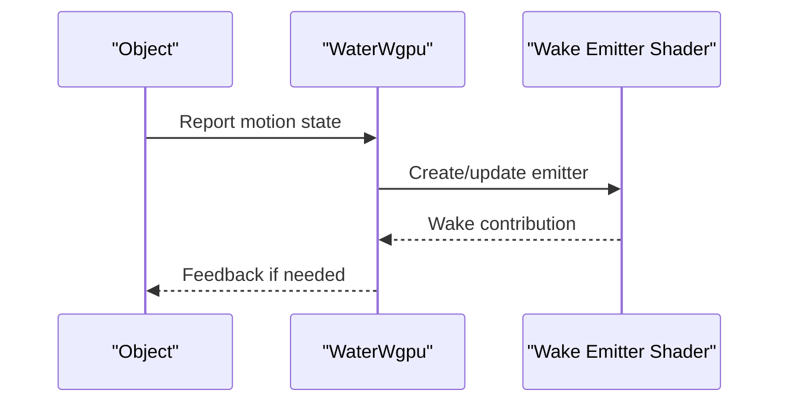
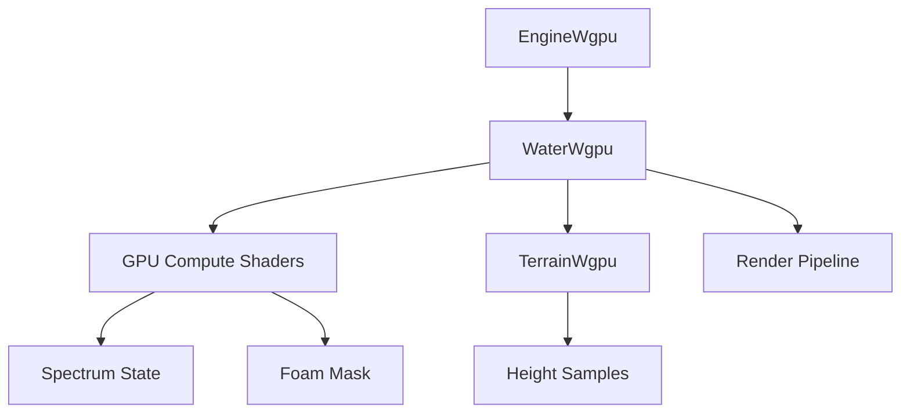

# Water Simulation and Rendering

<cite>
**Referenced Files in This Document**
- [WaterWgpu.cpp](file://engine/WgpuRenderer/WaterWgpu.cpp)
- [WaterWgpu.hpp](file://engine/WgpuRenderer/WaterWgpu.hpp)
- [water-spectral-core.md](file://engine/WgpuRenderer/docs/water-spectral-core.md)
- [water-rendering-plan.md](file://engine/WgpuRenderer/docs/water-rendering-plan.md)
- [water-cdlod-geometry-plan.md](file://engine/WgpuRenderer/docs/water-cdlod-geometry-plan.md)
- [water-interaction-emitters.md](file://engine/WgpuRenderer/docs/water-interaction-emitters.md)
- [EngineWgpu.cpp](file://engine/WgpuRenderer/EngineWgpu.cpp)
- [TerrainWgpu.cpp](file://engine/WgpuRenderer/TerrainWgpu.cpp)
- [TerrainWgpu.hpp](file://engine/WgpuRenderer/TerrainWgpu.hpp)
</cite>

## Table of Contents
1. [Introduction](#introduction)
2. [Project Structure](#project-structure)
3. [Core Components](#core-components)
4. [Architecture Overview](#architecture-overview)
5. [Detailed Component Analysis](#detailed-component-analysis)
6. [Dependency Analysis](#dependency-analysis)
7. [Performance Considerations](#performance-considerations)
8. [Troubleshooting Guide](#troubleshooting-guide)
9. [Conclusion](#conclusion)
10. [Appendices](#appendices)

## Introduction
This document explains the advanced water simulation and rendering system implemented in the WGPU renderer. It covers FFT-based wave generation, reflection/refraction calculations, real-time surface deformation, GPU compute shaders for wave spectrum updates, foam generation, underwater effects, integration with terrain rendering, shoreline detection, object interaction physics, spectral wave modeling, wind field influence, propagation across different water bodies, configuration examples (depth, clarity, amplitude), and performance optimizations such as level-of-detail for distant water and efficient batching.

## Project Structure
The water system is primarily implemented under the WGPU renderer module:
- Core water implementation files: WaterWgpu.cpp, WaterWgpu.hpp
- Design and planning documents: water-spectral-core.md, water-rendering-plan.md, water-cdlod-geometry-plan.md, water-interaction-emitters.md
- Engine integration: EngineWgpu.cpp
- Terrain integration: TerrainWgpu.cpp, TerrainWgpu.hpp

**Diagram sources**
- [WaterWgpu.cpp](file://engine/WgpuRenderer/WaterWgpu.cpp)
- [WaterWgpu.hpp](file://engine/WgpuRenderer/WaterWgpu.hpp)
- [water-spectral-core.md](file://engine/WgpuRenderer/docs/water-spectral-core.md)
- [water-rendering-plan.md](file://engine/WgpuRenderer/docs/water-rendering-plan.md)
- [water-cdlod-geometry-plan.md](file://engine/WgpuRenderer/docs/water-cdlod-geometry-plan.md)
- [water-interaction-emitters.md](file://engine/WgpuRenderer/docs/water-interaction-emitters.md)
- [EngineWgpu.cpp](file://engine/WgpuRenderer/EngineWgpu.cpp)
- [TerrainWgpu.cpp](file://engine/WgpuRenderer/TerrainWgpu.cpp)
- [TerrainWgpu.hpp](file://engine/WgpuRenderer/TerrainWgpu.hpp)

**Section sources**
- [WaterWgpu.cpp](file://engine/WgpuRenderer/WaterWgpu.cpp)
- [WaterWgpu.hpp](file://engine/WgpuRenderer/WaterWgpu.hpp)
- [water-spectral-core.md](file://engine/WgpuRenderer/docs/water-spectral-core.md)
- [water-rendering-plan.md](file://engine/WgpuRenderer/docs/water-rendering-plan.md)
- [water-cdlod-geometry-plan.md](file://engine/WgpuRenderer/docs/water-cdlod-geometry-plan.md)
- [water-interaction-emitters.md](file://engine/WgpuRenderer/docs/water-interaction-emitters.md)
- [EngineWgpu.cpp](file://engine/WgpuRenderer/EngineWgpu.cpp)
- [TerrainWgpu.cpp](file://engine/WgpuRenderer/TerrainWgpu.cpp)
- [TerrainWgpu.hpp](file://engine/WgpuRenderer/TerrainWgpu.hpp)

## Core Components
- Water simulation core: FFT-based spectral wave model, wind-driven spectrum updates, propagation across water bodies, depth-dependent dispersion, and real-time surface displacement computation.
- GPU compute shaders: Wave spectrum evolution, foam generation, and underwater effect parameters.
- Rendering pipeline: Reflection/refraction, caustics approximation, subsurface scattering, and dynamic shading based on depth and clarity.
- Integration points: Terrain intersection for shoreline detection, object interaction emitters for wake generation, and LOD selection for distant water.

Key responsibilities:
- Spectral wave modeling and time-stepping
- Compute shader dispatch for spectrum and foam
- Surface mesh generation or vertex displacement
- Reflection/refraction sampling and blending
- Shoreline detection via terrain height queries
- Object interaction physics coupling to water emitters

**Section sources**
- [WaterWgpu.cpp](file://engine/WgpuRenderer/WaterWgpu.cpp)
- [WaterWgpu.hpp](file://engine/WgpuRenderer/WaterWgpu.hpp)
- [water-spectral-core.md](file://engine/WgpuRenderer/docs/water-spectral-core.md)
- [water-rendering-plan.md](file://engine/WgpuRenderer/docs/water-rendering-plan.md)

## Architecture Overview
The water system integrates tightly with the WGPU engine and terrain modules. The engine orchestrates frame updates, dispatches compute shaders for wave spectrum and foam, and coordinates rendering passes for reflection/refraction and underwater effects. Terrain provides height data for shoreline detection and depth estimation.

**Diagram sources**
- [EngineWgpu.cpp](file://engine/WgpuRenderer/EngineWgpu.cpp)
- [WaterWgpu.cpp](file://engine/WgpuRenderer/WaterWgpu.cpp)
- [TerrainWgpu.cpp](file://engine/WgpuRenderer/TerrainWgpu.cpp)

**Section sources**
- [EngineWgpu.cpp](file://engine/WgpuRenderer/EngineWgpu.cpp)
- [WaterWgpu.cpp](file://engine/WgpuRenderer/WaterWgpu.cpp)
- [TerrainWgpu.cpp](file://engine/WgpuRenderer/TerrainWgpu.cpp)

## Detailed Component Analysis

### Spectral Wave Modeling and Wind Field Influence
- Uses a spectral wave model where the energy spectrum evolves over time driven by wind input.
- Time-stepping advances phase velocities according to dispersion relations; depth influences wave speed and refraction.
- Wind field parameters modulate spectrum amplitude and directionality.

**Diagram sources**
- [water-spectral-core.md](file://engine/WgpuRenderer/docs/water-spectral-core.md)

**Section sources**
- [water-spectral-core.md](file://engine/WgpuRenderer/docs/water-spectral-core.md)

### GPU Compute Shaders: Wave Spectrum, Foam, Underwater Effects
- Wave spectrum shader computes complex amplitudes per wavenumber bin and updates phase terms.
- Foam generation shader derives foam intensity from surface curvature and steepness thresholds.
- Underwater effects shader adjusts attenuation, color, and scattering based on depth and clarity.

**Diagram sources**
- [WaterWgpu.cpp](file://engine/WgpuRenderer/WaterWgpu.cpp)
- [WaterWgpu.hpp](file://engine/WgpuRenderer/WaterWgpu.hpp)

**Section sources**
- [WaterWgpu.cpp](file://engine/WgpuRenderer/WaterWgpu.cpp)
- [WaterWgpu.hpp](file://engine/WgpuRenderer/WaterWgpu.hpp)

### Reflection/Refraction and Real-Time Surface Deformation
- Reflection pass samples environment maps or scene buffers using perturbed normals derived from displacement gradients.
- Refraction pass samples underlying geometry or depth buffer with distortion proportional to surface slope.
- Real-time deformation uses computed displacement maps to adjust vertex positions or normal vectors during shading.

**Diagram sources**
- [water-rendering-plan.md](file://engine/WgpuRenderer/docs/water-rendering-plan.md)

**Section sources**
- [water-rendering-plan.md](file://engine/WgpuRenderer/docs/water-rendering-plan.md)

### Shoreline Detection and Terrain Integration
- Shoreline detection compares water surface height against terrain heights to identify land-water boundaries.
- Terrain queries provide height samples at water grid locations for accurate boundary determination.
- Blending between water and terrain occurs near shorelines to avoid visual seams.

**Diagram sources**
- [TerrainWgpu.cpp](file://engine/WgpuRenderer/TerrainWgpu.cpp)
- [TerrainWgpu.hpp](file://engine/WgpuRenderer/TerrainWgpu.hpp)

**Section sources**
- [TerrainWgpu.cpp](file://engine/WgpuRenderer/TerrainWgpu.cpp)
- [TerrainWgpu.hpp](file://engine/WgpuRenderer/TerrainWgpu.hpp)

### Object Interaction Physics and Wake Generation
- Objects moving through water generate wakes modeled as localized disturbances added to the spectrum or displacement map.
- Emitters are created per interacting object and decay over time to simulate dissipation.
- Wake strength depends on object velocity, shape, and immersion depth.

**Diagram sources**
- [water-interaction-emitters.md](file://engine/WgpuRenderer/docs/water-interaction-emitters.md)

**Section sources**
- [water-interaction-emitters.md](file://engine/WgpuRenderer/docs/water-interaction-emitters.md)

### Configuration Examples: Depth, Clarity, Amplitude
- Depth: Controls dispersion relation and underwater attenuation; deeper water reduces shallow-water effects.
- Clarity: Modulates light absorption and scattering coefficients for realistic underwater appearance.
- Amplitude: Scales spectrum energy to control wave height; influenced by wind strength and duration.

Configuration typically involves setting uniform parameters passed to shaders and compute kernels.

**Section sources**
- [water-spectral-core.md](file://engine/WgpuRenderer/docs/water-spectral-core.md)
- [water-rendering-plan.md](file://engine/WgpuRenderer/docs/water-rendering-plan.md)

## Dependency Analysis
The water system depends on:
- WGPU engine for resource management and shader dispatch
- Terrain module for height queries and shoreline detection
- Compute shaders for spectral updates and foam generation
- Rendering pipeline for reflection/refraction and shading

**Diagram sources**
- [EngineWgpu.cpp](file://engine/WgpuRenderer/EngineWgpu.cpp)
- [WaterWgpu.cpp](file://engine/WgpuRenderer/WaterWgpu.cpp)
- [TerrainWgpu.cpp](file://engine/WgpuRenderer/TerrainWgpu.cpp)

**Section sources**
- [EngineWgpu.cpp](file://engine/WgpuRenderer/EngineWgpu.cpp)
- [WaterWgpu.cpp](file://engine/WgpuRenderer/WaterWgpu.cpp)
- [TerrainWgpu.cpp](file://engine/WgpuRenderer/TerrainWgpu.cpp)

## Performance Considerations
- Level-of-Detail (LOD): Reduce spatial resolution and update frequency for distant water patches to minimize compute cost.
- Efficient batching: Group water render calls and reuse shader programs to reduce state changes.
- Compute optimization: Use tiled or hierarchical updates for spectrum evolution; limit foam generation to high-curvature regions.
- Memory bandwidth: Minimize texture reads/writes by caching intermediate results and using appropriate formats.

**Section sources**
- [water-cdlod-geometry-plan.md](file://engine/WgpuRenderer/docs/water-cdlod-geometry-plan.md)
- [water-rendering-plan.md](file://engine/WgpuRenderer/docs/water-rendering-plan.md)

## Troubleshooting Guide
Common issues and resolutions:
- Visual artifacts at shorelines: Adjust blending thresholds and ensure accurate terrain height queries.
- Excessive foam: Tune curvature and steepness thresholds in the foam shader.
- Performance drops: Verify LOD settings and compute shader dispatch frequencies; consider reducing resolution for distant water.
- Incorrect underwater appearance: Calibrate attenuation and scattering coefficients based on clarity settings.

**Section sources**
- [water-interaction-emitters.md](file://engine/WgpuRenderer/docs/water-interaction-emitters.md)
- [water-rendering-plan.md](file://engine/WgpuRenderer/docs/water-rendering-plan.md)

## Conclusion
The water simulation and rendering system combines FFT-based spectral modeling with GPU compute shaders to achieve realistic wave dynamics, reflection/refraction, and underwater effects. Tight integration with terrain and object interaction enables dynamic shoreline behavior and wake generation. Performance optimizations such as LOD and efficient batching ensure scalability across diverse scenarios. Proper configuration of depth, clarity, and amplitude allows fine-tuning of visual fidelity and physical accuracy.

## Appendices
- Additional references to design documents for detailed algorithmic descriptions and implementation plans.
- Example configurations for common use cases such as calm lakes, stormy seas, and shallow coastal waters.

[No sources needed since this section summarizes without analyzing specific files]