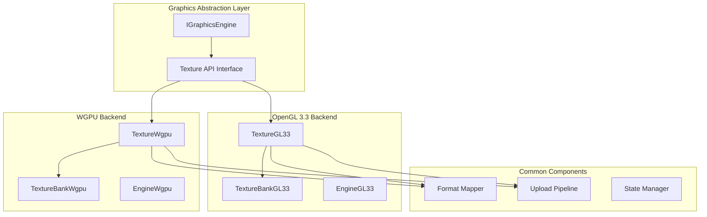
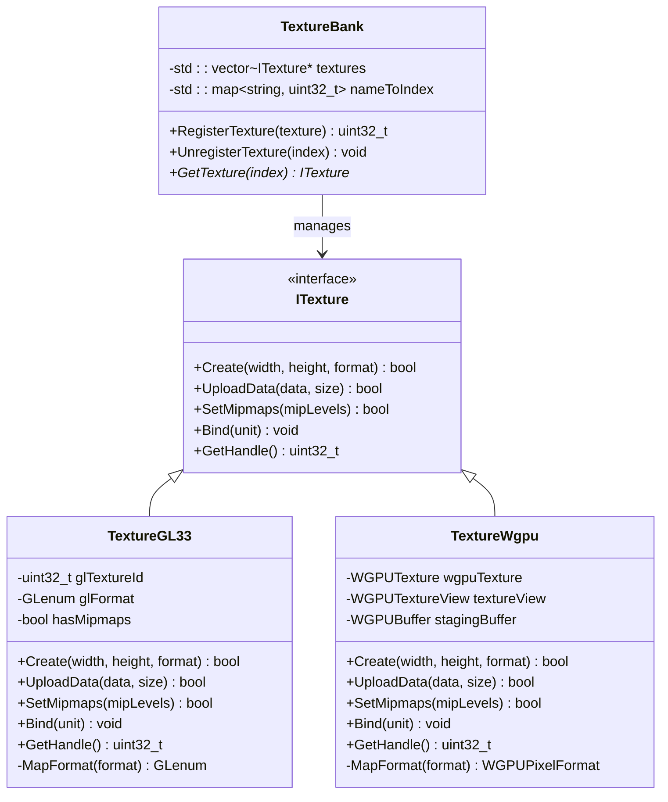
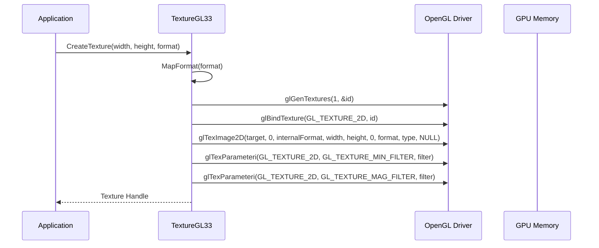
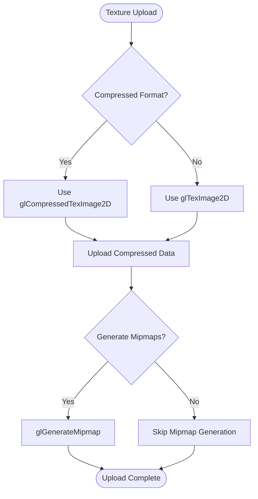
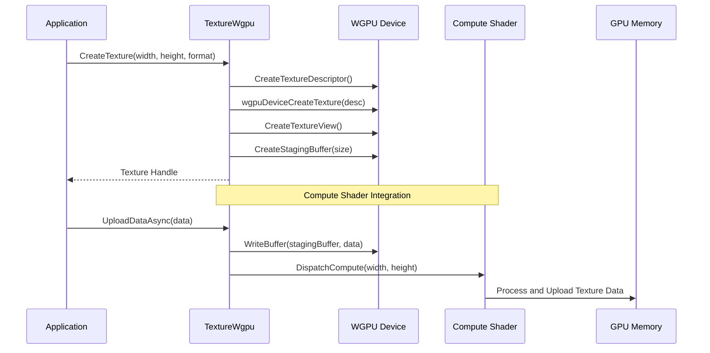
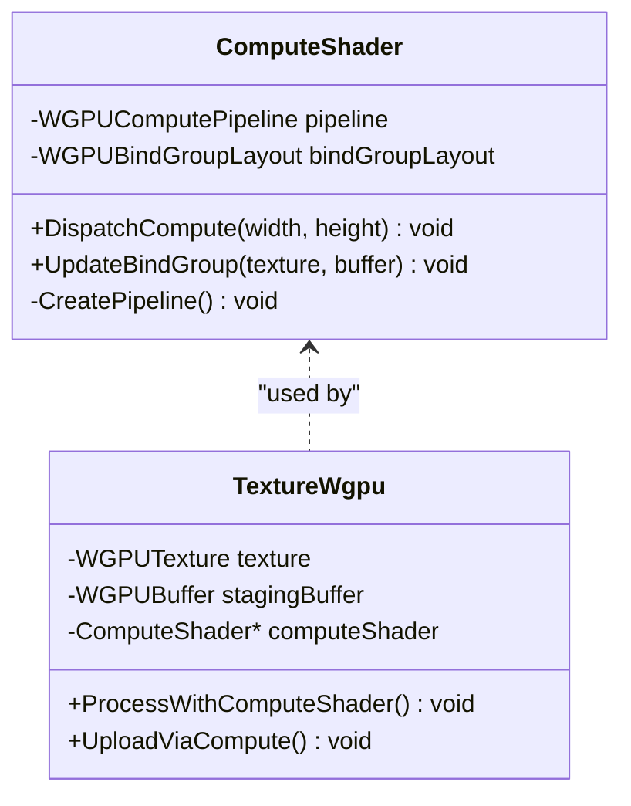
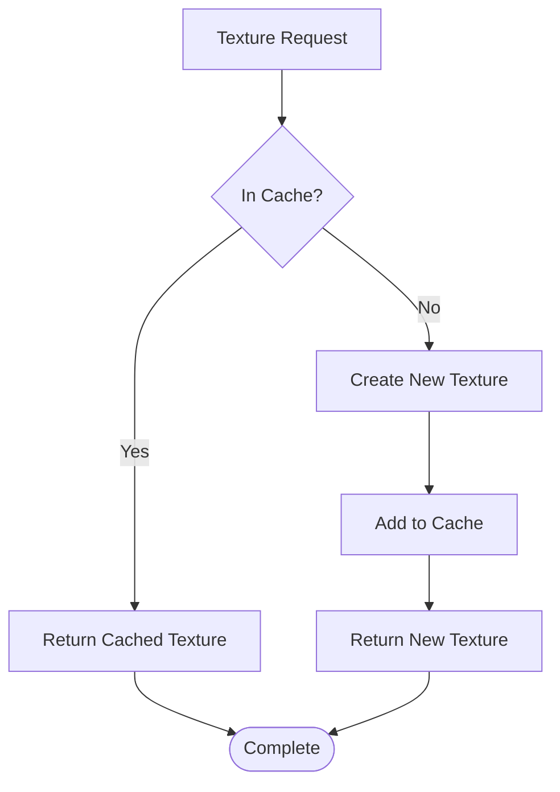
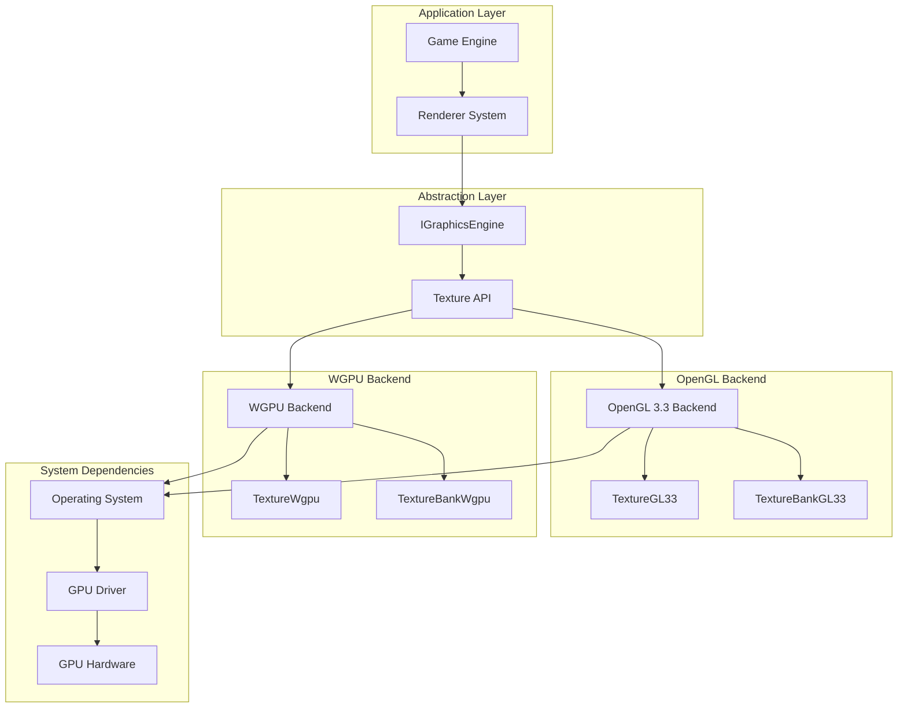

# Graphics Backend Integration

<cite>
**Referenced Files in This Document**
- [TextureGL33.hpp](file://engine/PoseidonGL33/TextureGL33.hpp)
- [TextureGL33_Init.cpp](file://engine/PoseidonGL33/TextureGL33_Init.cpp)
- [TextureGL33_Loading.cpp](file://engine/PoseidonGL33/TextureGL33_Loading.cpp)
- [TextureBankGL33_Core.cpp](file://engine/PoseidonGL33/TextureBankGL33_Core.cpp)
- [TextureBankGL33_Cache.cpp](file://engine/PoseidonGL33/TextureBankGL33_Cache.cpp)
- [GraphicsBackendGL33.cpp](file://engine/PoseidonGL33/GraphicsBackendGL33.cpp)
- [EngineGL33.cpp](file://engine/PoseidonGL33/EngineGL33.cpp)
- [TextureWgpu.hpp](file://engine/WgpuRenderer/TextureWgpu.hpp)
- [TextureWgpu.cpp](file://engine/WgpuRenderer/TextureWgpu.cpp)
- [TextureBankWgpu.hpp](file://engine/WgpuRenderer/TextureBankWgpu.hpp)
- [TextureBankWgpu.cpp](file://engine/WgpuRenderer/TextureBankWgpu.cpp)
- [GraphicsBackendWgpu.cpp](file://engine/WgpuRenderer/GraphicsBackendWgpu.cpp)
- [EngineWgpu.cpp](file://engine/WgpuRenderer/EngineWgpu.cpp)
- [IGraphicsEngine.hpp](file://engine/Poseidon/Graphics/IGraphicsEngine.hpp)
</cite>

## Table of Contents
1. [Introduction](#introduction)
2. [Project Structure](#project-structure)
3. [Core Components](#core-components)
4. [Architecture Overview](#architecture-overview)
5. [Detailed Component Analysis](#detailed-component-analysis)
6. [Dependency Analysis](#dependency-analysis)
7. [Performance Considerations](#performance-considerations)
8. [Troubleshooting Guide](#troubleshooting-guide)
9. [Conclusion](#conclusion)
10. [Appendices](#appendices)

## Introduction

This document provides comprehensive documentation for graphics backend-specific texture implementations in the CWR-CE engine. The engine supports multiple graphics backends, primarily OpenGL 3.3 and WGPU, each with specialized texture handling mechanisms. The documentation covers texture creation, upload mechanisms, state management, format mapping, compression support, and platform-specific optimizations across different rendering APIs.

The architecture follows a layered approach where an abstraction layer provides consistent texture APIs across backends while allowing backend-specific optimizations and implementations. This design enables seamless switching between graphics APIs while maintaining performance and compatibility.

## Project Structure

The graphics subsystem is organized into backend-specific modules within the engine directory:

**Diagram sources**
- [IGraphicsEngine.hpp](file://engine/Poseidon/Graphics/IGraphicsEngine.hpp)
- [TextureGL33.hpp](file://engine/PoseidonGL33/TextureGL33.hpp)
- [TextureWgpu.hpp](file://engine/WgpuRenderer/TextureWgpu.hpp)

**Section sources**
- [IGraphicsEngine.hpp](file://engine/Poseidon/Graphics/IGraphicsEngine.hpp)
- [EngineGL33.cpp](file://engine/PoseidonGL33/EngineGL33.cpp)
- [EngineWgpu.cpp](file://engine/WgpuRenderer/EngineWgpu.cpp)

## Core Components

### Texture Abstraction Layer

The core abstraction layer defines common interfaces that both OpenGL and WGPU backends implement. This ensures consistent texture operations regardless of the underlying graphics API.

Key components include:
- **Texture Interface**: Defines common texture operations like creation, upload, and state management
- **Format Mapping**: Handles conversion between application texture formats and backend-specific formats
- **Upload Pipeline**: Manages efficient texture data transfer to GPU memory
- **State Management**: Tracks texture states and optimizes state changes

### OpenGL 3.3 Implementation

The OpenGL 3.3 backend leverages modern OpenGL features while maintaining compatibility with older hardware. It uses VBOs for texture uploads, texture arrays for batching, and shader-based format conversions when necessary.

### WGPU Implementation

The WGPU backend utilizes WebGPU's modern API design with explicit resource management, compute shaders for texture processing, and asynchronous operations for improved performance.

**Section sources**
- [TextureGL33.hpp](file://engine/PoseidonGL33/TextureGL33.hpp)
- [TextureWgpu.hpp](file://engine/WgpuRenderer/TextureWgpu.hpp)
- [GraphicsBackendGL33.cpp](file://engine/PoseidonGL33/GraphicsBackendGL33.cpp)
- [GraphicsBackendWgpu.cpp](file://engine/WgpuRenderer/GraphicsBackendWgpu.cpp)

## Architecture Overview

The graphics backend architecture follows a strategy pattern where the abstraction layer defines interfaces and concrete implementations handle backend-specific details.

**Diagram sources**
- [TextureGL33.hpp](file://engine/PoseidonGL33/TextureGL33.hpp)
- [TextureWgpu.hpp](file://engine/WgpuRenderer/TextureWgpu.hpp)
- [TextureBankGL33_Core.cpp](file://engine/PoseidonGL33/TextureBankGL33_Core.cpp)
- [TextureBankWgpu.hpp](file://engine/WgpuRenderer/TextureBankWgpu.hpp)

## Detailed Component Analysis

### OpenGL 3.3 Texture Implementation

The OpenGL 3.3 implementation focuses on efficient texture creation and upload using modern OpenGL features.

#### Texture Creation Process

**Diagram sources**
- [TextureGL33_Init.cpp](file://engine/PoseidonGL33/TextureGL33_Init.cpp)
- [TextureGL33.hpp](file://engine/PoseidonGL33/TextureGL33.hpp)

#### Texture Upload Mechanism

The OpenGL backend uses direct buffer uploads with optional compression:

**Diagram sources**
- [TextureGL33_Loading.cpp](file://engine/PoseidonGL33/TextureGL33_Loading.cpp)

### WGPU Texture Implementation

The WGPU backend leverages modern GPU APIs with explicit resource management and compute shader integration.

#### Texture Creation and Buffer Management

**Diagram sources**
- [TextureWgpu.cpp](file://engine/WgpuRenderer/TextureWgpu.cpp)
- [TextureWgpu.hpp](file://engine/WgpuRenderer/TextureWgpu.hpp)

#### Compute Shader Integration

WGPU textures integrate with compute shaders for advanced processing:

**Diagram sources**
- [TextureWgpu.cpp](file://engine/WgpuRenderer/TextureWgpu.cpp)

### Texture Bank Management

Both backends implement texture banks for efficient texture management and caching.

#### OpenGL Texture Bank

**Diagram sources**
- [TextureBankGL33_Core.cpp](file://engine/PoseidonGL33/TextureBankGL33_Core.cpp)
- [TextureBankGL33_Cache.cpp](file://engine/PoseidonGL33/TextureBankGL33_Cache.cpp)

#### WGPU Texture Bank

The WGPU texture bank includes additional features for async operations and memory management.

**Section sources**
- [TextureBankGL33_Core.cpp](file://engine/PoseidonGL33/TextureBankGL33_Core.cpp)
- [TextureBankGL33_Cache.cpp](file://engine/PoseidonGL33/TextureBankGL33_Cache.cpp)
- [TextureBankWgpu.cpp](file://engine/WgpuRenderer/TextureBankWgpu.cpp)

## Dependency Analysis

The graphics backend system has clear dependency relationships that ensure proper initialization and resource management.

**Diagram sources**
- [IGraphicsEngine.hpp](file://engine/Poseidon/Graphics/IGraphicsEngine.hpp)
- [GraphicsBackendGL33.cpp](file://engine/PoseidonGL33/GraphicsBackendGL33.cpp)
- [GraphicsBackendWgpu.cpp](file://engine/WgpuRenderer/GraphicsBackendWgpu.cpp)

**Section sources**
- [GraphicsBackendGL33.cpp](file://engine/PoseidonGL33/GraphicsBackendGL33.cpp)
- [GraphicsBackendWgpu.cpp](file://engine/WgpuRenderer/GraphicsBackendWgpu.cpp)

## Performance Considerations

### Texture Upload Optimization

Both backends implement several optimization strategies:

1. **Batched Uploads**: Multiple textures are uploaded together to reduce API calls
2. **Memory Alignment**: Texture data is aligned to optimal memory boundaries
3. **Asynchronous Operations**: WGPU backend uses async operations for non-blocking uploads
4. **Mipmap Generation**: Hardware-accelerated mipmap generation when supported
5. **Format Conversion**: Efficient format conversion using GPU compute shaders

### Memory Management

- **Reference Counting**: Automatic memory management for texture resources
- **Lazy Loading**: Textures are loaded only when first accessed
- **Caching**: Frequently used textures are cached in GPU memory
- **Garbage Collection**: Unused textures are automatically cleaned up

### Platform-Specific Optimizations

- **OpenGL**: Uses ARB_texture_compression extensions when available
- **WGPU**: Leverages native GPU compute capabilities for texture processing
- **Windows**: Direct3D interoperability through WGPU
- **Linux**: Vulkan backend optimization through WGPU

## Troubleshooting Guide

### Common Texture Issues

#### Texture Upload Failures

**Symptoms**: Black textures, corrupted images, or crashes during texture loading

**Causes**:
- Incorrect texture format specification
- Insufficient GPU memory
- Invalid texture dimensions
- Corrupted texture data

**Solutions**:
1. Verify texture format matches backend capabilities
2. Check GPU memory availability before allocation
3. Ensure texture dimensions are power-of-two when required
4. Validate texture data integrity before upload

#### Performance Issues

**Symptoms**: Frame rate drops, stuttering, or slow texture loading

**Causes**:
- Excessive texture uploads per frame
- Inefficient texture formats
- Missing mipmaps causing texture filtering issues
- CPU-GPU synchronization bottlenecks

**Solutions**:
1. Implement texture streaming for large assets
2. Use compressed texture formats when possible
3. Pre-generate mipmaps for static textures
4. Batch texture uploads to minimize API calls

### Debugging Techniques

#### OpenGL Debugging

Use OpenGL debug context and validation layers:
- Enable `GL_DEBUG_OUTPUT` for detailed error messages
- Use RenderDoc for frame analysis
- Monitor GPU memory usage with vendor tools

#### WGPU Debugging

Leverage WGPU's built-in debugging:
- Enable validation layers during development
- Use WebGPU Inspector for resource inspection
- Monitor compute shader execution with profiling tools

**Section sources**
- [TextureGL33_Loading.cpp](file://engine/PoseidonGL33/TextureGL33_Loading.cpp)
- [TextureWgpu.cpp](file://engine/WgpuRenderer/TextureWgpu.cpp)

## Conclusion

The graphics backend integration in CWR-CE provides a robust, extensible architecture for texture management across multiple rendering APIs. The abstraction layer ensures consistent APIs while allowing backend-specific optimizations. The OpenGL 3.3 backend offers broad compatibility, while the WGPU backend provides modern features and performance benefits.

Key strengths of the implementation include:
- Clean separation between abstraction and implementation
- Efficient texture upload mechanisms
- Comprehensive format support
- Platform-specific optimizations
- Extensible architecture for future backends

Future enhancements could include additional backend support (Vulkan, Metal), improved compression algorithms, and more sophisticated texture streaming mechanisms.

## Appendices

### A. Texture Format Support Matrix

| Format | OpenGL 3.3 | WGPU | Compression | Notes |
|--------|------------|------|-------------|-------|
| RGBA8 | ✓ | ✓ | No | Standard uncompressed format |
| RGB8 | ✓ | ✓ | No | 24-bit color format |
| R8 | ✓ | ✓ | No | Single channel format |
| DXT1 | ✓ | ✓ | Yes | S3TC compression |
| DXT5 | ✓ | ✓ | Yes | Alpha compression |
| BC1-7 | ✓ | ✓ | Yes | DirectX compression |
| ETC1 | ✓ | ✓ | Yes | Android/mobile format |
| ASTC | ✓ | ✓ | Yes | Apple mobile format |

### B. Backend Selection Criteria

Choose OpenGL 3.3 when:
- Maximum compatibility is required
- Targeting older hardware
- Development environment lacks WGPU support

Choose WGPU when:
- Modern GPU features are needed
- Compute shader integration is required
- Cross-platform deployment is planned

### C. Performance Benchmarking Guidelines

1. **Texture Upload Speed**: Measure time for uploading various texture sizes
2. **Memory Usage**: Monitor GPU memory consumption under load
3. **Frame Time Impact**: Profile texture operations during rendering
4. **Format Efficiency**: Compare performance across different texture formats
5. **Compression Benefits**: Evaluate compression vs. decompression overhead