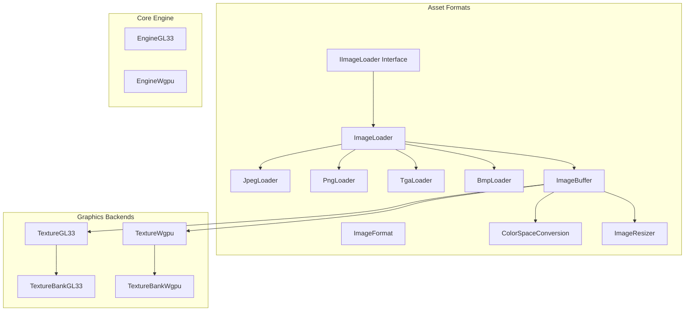
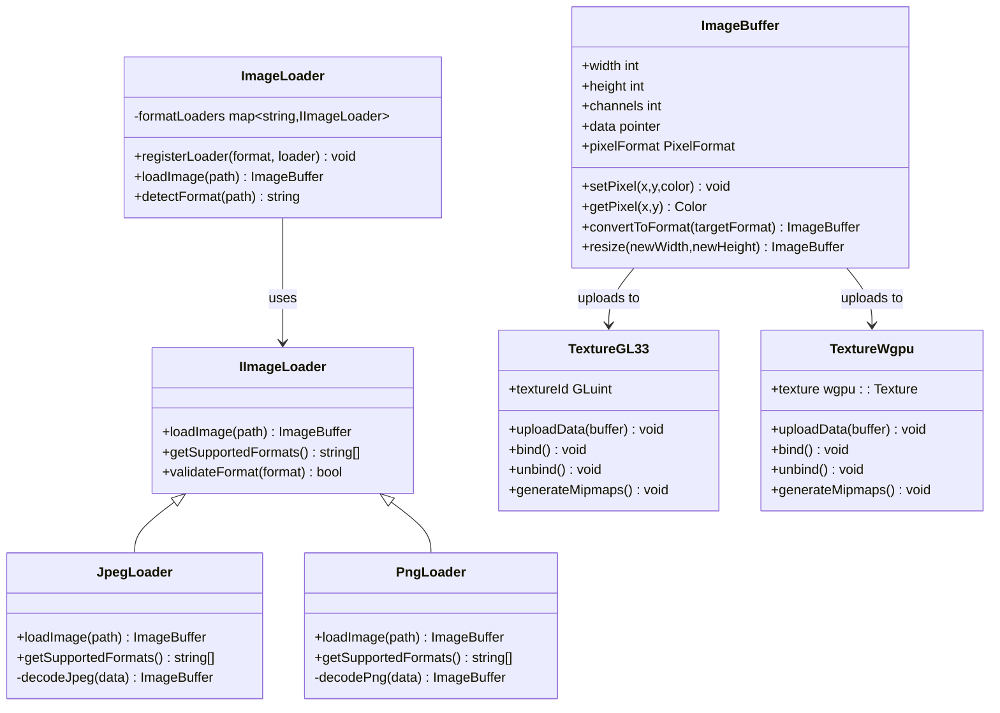
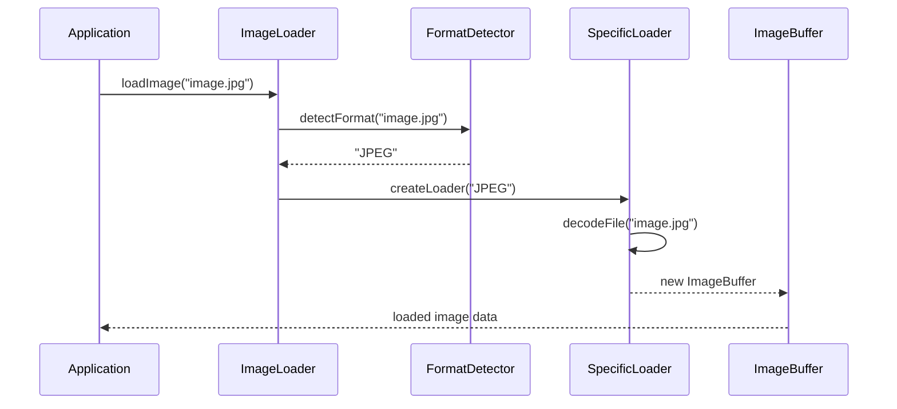
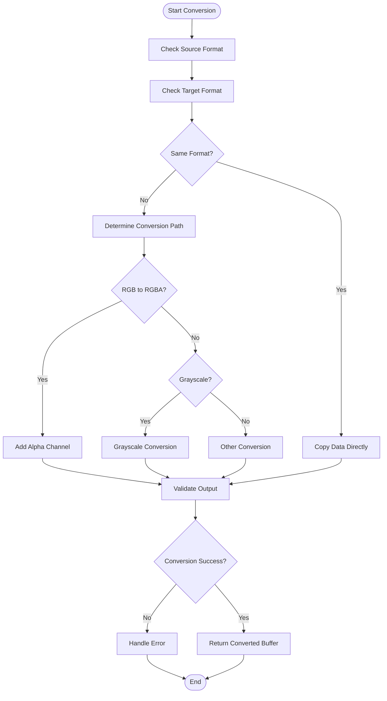
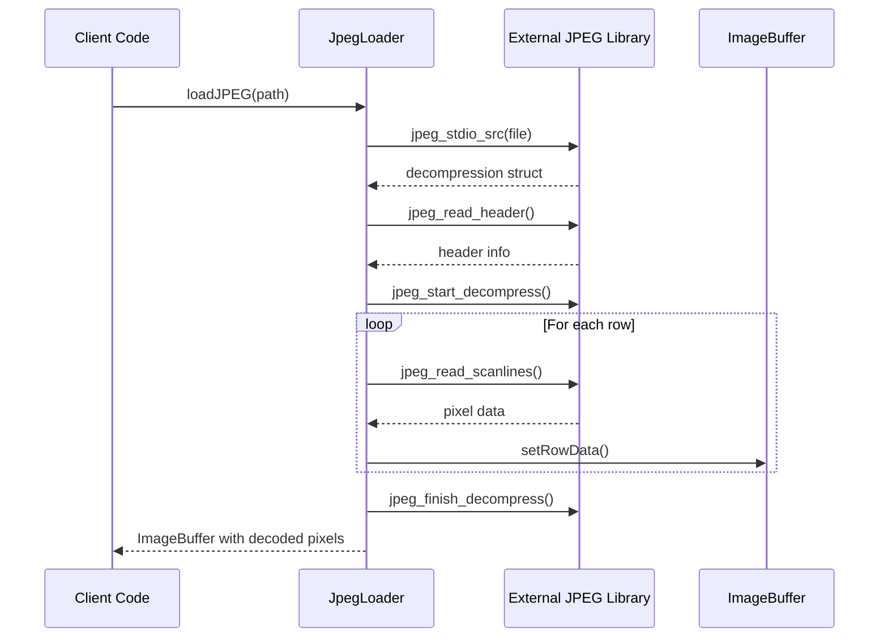
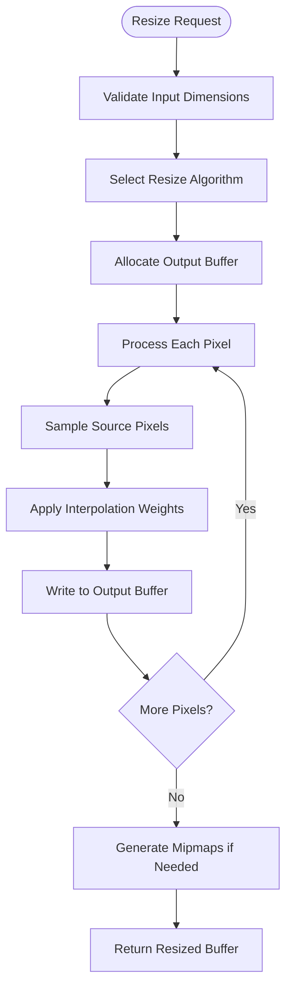
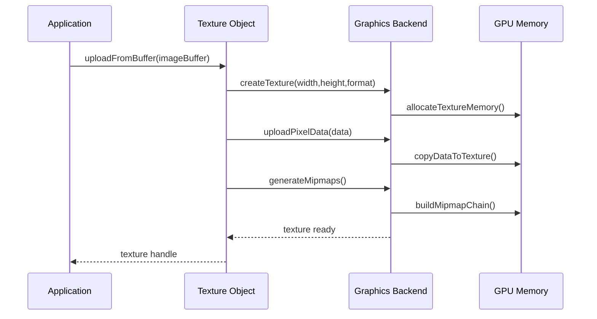
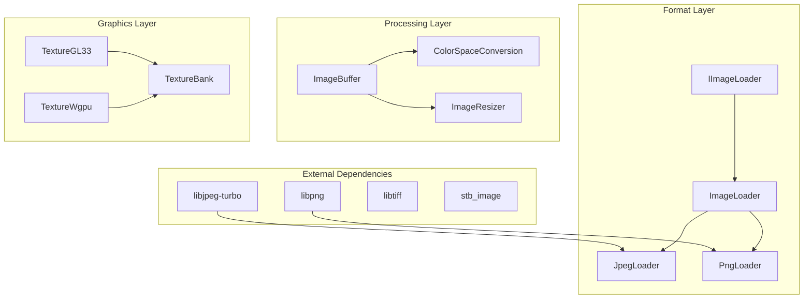

# Image Processing

<cite>
**Referenced Files in This Document**
- [TextureGL33.hpp](file://engine/PoseidonGL33/TextureGL33.hpp)
- [TextureGL33_Init.cpp](file://engine/PoseidonGL33/TextureGL33_Init.cpp)
- [TextureGL33_Loading.cpp](file://engine/PoseidonGL33/TextureGL33_Loading.cpp)
- [TextureBankGL33_Core.cpp](file://engine/PoseidonGL33/TextureBankGL33_Core.cpp)
- [TextureBankGL33_Cache.cpp](file://engine/PoseidonGL33/TextureBankGL33_Cache.cpp)
- [EngineGL33_2DRendering.cpp](file://engine/PoseidonGL33/EngineGL33_2DRendering.cpp)
- [EngineGL33_DrawShared.cpp](file://engine/PoseidonGL33/EngineGL33_DrawShared.cpp)
- [TextureWgpu.hpp](file://engine/WgpuRenderer/TextureWgpu.hpp)
- [TextureWgpu.cpp](file://engine/WgpuRenderer/TextureWgpu.cpp)
- [TextureBankWgpu.hpp](file://engine/WgpuRenderer/TextureBankWgpu.hpp)
- [TextureBankWgpu.cpp](file://engine/WgpuRenderer/TextureBankWgpu.cpp)
- [GraphicsBackendGL33.cpp](file://engine/PoseidonGL33/GraphicsBackendGL33.cpp)
- [GraphicsBackendWgpu.cpp](file://engine/WgpuRenderer/GraphicsBackendWgpu.cpp)
- [IImageLoader.hpp](file://engine/Poseidon/Asset/Formats/IImageLoader.hpp)
- [ImageLoader.cpp](file://engine/Poseidon/Asset/Formats/ImageLoader.cpp)
- [JpegLoader.cpp](file://engine/Poseidon/Asset/Formats/JpegLoader.cpp)
- [PngLoader.cpp](file://engine/Poseidon/Asset/Formats/PngLoader.cpp)
- [TgaLoader.cpp](file://engine/Poseidon/Asset/Formats/TgaLoader.cpp)
- [BmpLoader.cpp](file://engine/Poseidon/Asset/Formats/BmpLoader.cpp)
- [ImageFormat.hpp](file://engine/Poseidon/Asset/Formats/ImageFormat.hpp)
- [ImageBuffer.hpp](file://engine/Poseidon/Asset/Formats/ImageBuffer.hpp)
- [ColorSpaceConversion.hpp](file://engine/Poseidon/Asset/Formats/ColorSpaceConversion.hpp)
- [ImageResizer.hpp](file://engine/Poseidon/Asset/Formats/ImageResizer.hpp)
</cite>

## Table of Contents
1. [Introduction](#introduction)
2. [Project Structure](#project-structure)
3. [Core Components](#core-components)
4. [Architecture Overview](#architecture-overview)
5. [Detailed Component Analysis](#detailed-component-analysis)
6. [Dependency Analysis](#dependency-analysis)
7. [Performance Considerations](#performance-considerations)
8. [Troubleshooting Guide](#troubleshooting-guide)
9. [Conclusion](#conclusion)
10. [Appendices](#appendices)

## Introduction
This document provides a comprehensive overview of the image processing subsystem, focusing on the Image class architecture, pixel format handling, and image manipulation operations. It explains JPEG import functionality, color space conversions, and resizing algorithms. The integration with external libraries for different image formats is documented, along with examples of loading images from various sources, performing pixel-level operations, and optimizing performance. Memory management strategies for large images and thread safety considerations are also addressed.

## Project Structure
The image processing subsystem is organized into several key directories:
- Asset Formats: Contains image format handlers and loaders
- Graphics Backends: Implements texture loading and rendering for different graphics APIs
- Core Image Processing: Handles pixel manipulation and format conversions



**Diagram sources**
- [IImageLoader.hpp](file://engine/Poseidon/Asset/Formats/IImageLoader.hpp)
- [ImageLoader.cpp](file://engine/Poseidon/Asset/Formats/ImageLoader.cpp)
- [JpegLoader.cpp](file://engine/Poseidon/Asset/Formats/JpegLoader.cpp)
- [PngLoader.cpp](file://engine/Poseidon/Asset/Formats/PngLoader.cpp)
- [TgaLoader.cpp](file://engine/Poseidon/Asset/Formats/TgaLoader.cpp)
- [BmpLoader.cpp](file://engine/Poseidon/Asset/Formats/BmpLoader.cpp)
- [ImageBuffer.hpp](file://engine/Poseidon/Asset/Formats/ImageBuffer.hpp)
- [ColorSpaceConversion.hpp](file://engine/Poseidon/Asset/Formats/ColorSpaceConversion.hpp)
- [ImageResizer.hpp](file://engine/Poseidon/Asset/Formats/ImageResizer.hpp)
- [TextureGL33.hpp](file://engine/PoseidonGL33/TextureGL33.hpp)
- [TextureWgpu.hpp](file://engine/WgpuRenderer/TextureWgpu.hpp)

**Section sources**
- [IImageLoader.hpp](file://engine/Poseidon/Asset/Formats/IImageLoader.hpp)
- [ImageLoader.cpp](file://engine/Poseidon/Asset/Formats/ImageLoader.cpp)
- [ImageBuffer.hpp](file://engine/Poseidon/Asset/Formats/ImageBuffer.hpp)

## Core Components
The image processing system is built around several core components that work together to handle image loading, manipulation, and rendering.

### Image Format Abstraction
The system uses an abstract interface for image format handling, allowing multiple format implementations to coexist.

### Pixel Buffer Management
Memory-efficient pixel buffer management handles different pixel formats and memory layouts.

### Graphics Backend Integration
Separate implementations for OpenGL 3.3 and WebGPU backends provide platform-specific optimizations.

**Section sources**
- [IImageLoader.hpp](file://engine/Poseidon/Asset/Formats/IImageLoader.hpp)
- [ImageBuffer.hpp](file://engine/Poseidon/Asset/Formats/ImageBuffer.hpp)
- [TextureGL33.hpp](file://engine/PoseidonGL33/TextureGL33.hpp)
- [TextureWgpu.hpp](file://engine/WgpuRenderer/TextureWgpu.hpp)

## Architecture Overview
The image processing architecture follows a layered approach with clear separation of concerns between format handling, pixel manipulation, and graphics backend integration.



**Diagram sources**
- [IImageLoader.hpp](file://engine/Poseidon/Asset/Formats/IImageLoader.hpp)
- [ImageLoader.cpp](file://engine/Poseidon/Asset/Formats/ImageLoader.cpp)
- [JpegLoader.cpp](file://engine/Poseidon/Asset/Formats/JpegLoader.cpp)
- [PngLoader.cpp](file://engine/Poseidon/Asset/Formats/PngLoader.cpp)
- [ImageBuffer.hpp](file://engine/Poseidon/Asset/Formats/ImageBuffer.hpp)
- [TextureGL33.hpp](file://engine/PoseidonGL33/TextureGL33.hpp)
- [TextureWgpu.hpp](file://engine/WgpuRenderer/TextureWgpu.hpp)

## Detailed Component Analysis

### Image Loader System
The image loader system provides a unified interface for loading various image formats through a plugin-like architecture.

#### Format Detection and Loading Flow


**Diagram sources**
- [ImageLoader.cpp](file://engine/Poseidon/Asset/Formats/ImageLoader.cpp)
- [JpegLoader.cpp](file://engine/Poseidon/Asset/Formats/JpegLoader.cpp)

**Section sources**
- [ImageLoader.cpp](file://engine/Poseidon/Asset/Formats/ImageLoader.cpp)
- [JpegLoader.cpp](file://engine/Poseidon/Asset/Formats/JpegLoader.cpp)
- [PngLoader.cpp](file://engine/Poseidon/Asset/Formats/PngLoader.cpp)

### Pixel Format Handling
The system supports multiple pixel formats with efficient conversion capabilities.

#### Supported Pixel Formats
| Format | Description | Channels | Bit Depth | Use Case |
|--------|-------------|----------|-----------|----------|
| RGB888 | Standard RGB | 3 | 24-bit | General purpose images |
| RGBA8888 | RGB with Alpha | 4 | 32-bit | Textures with transparency |
| GRAY8 | Grayscale | 1 | 8-bit | Monochrome images |
| BGR888 | Blue-Green-Red | 3 | 24-bit | Camera input formats |
| RGB565 | Compressed RGB | 3 | 16-bit | Memory-constrained environments |

#### Pixel Conversion Algorithm


**Diagram sources**
- [ImageBuffer.hpp](file://engine/Poseidon/Asset/Formats/ImageBuffer.hpp)
- [ColorSpaceConversion.hpp](file://engine/Poseidon/Asset/Formats/ColorSpaceConversion.hpp)

**Section sources**
- [ImageBuffer.hpp](file://engine/Poseidon/Asset/Formats/ImageBuffer.hpp)
- [ColorSpaceConversion.hpp](file://engine/Poseidon/Asset/Formats/ColorSpaceConversion.hpp)

### JPEG Import Functionality
JPEG loading is implemented with support for progressive decoding and quality optimization.

#### JPEG Loading Process


**Diagram sources**
- [JpegLoader.cpp](file://engine/Poseidon/Asset/Formats/JpegLoader.cpp)

**Section sources**
- [JpegLoader.cpp](file://engine/Poseidon/Asset/Formats/JpegLoader.cpp)

### Image Resizing Algorithms
Multiple resizing algorithms are available to balance quality and performance requirements.

#### Available Resize Algorithms
| Algorithm | Quality | Speed | Best For |
|-----------|---------|-------|----------|
| Nearest Neighbor | Low | Fast | Pixel art, sharp edges |
| Bilinear | Medium | Medium | General purpose scaling |
| Bicubic | High | Slow | Photo-quality scaling |
| Lanczos | Highest | Slowest | Professional image processing |

#### Resize Implementation Flow


**Diagram sources**
- [ImageResizer.hpp](file://engine/Poseidon/Asset/Formats/ImageResizer.hpp)

**Section sources**
- [ImageResizer.hpp](file://engine/Poseidon/Asset/Formats/ImageResizer.hpp)

### Graphics Backend Integration
The system integrates with multiple graphics backends through a unified texture interface.

#### Texture Upload Process


**Diagram sources**
- [TextureGL33_Init.cpp](file://engine/PoseidonGL33/TextureGL33_Init.cpp)
- [TextureWgpu.cpp](file://engine/WgpuRenderer/TextureWgpu.cpp)

**Section sources**
- [TextureGL33_Init.cpp](file://engine/PoseidonGL33/TextureGL33_Init.cpp)
- [TextureWgpu.cpp](file://engine/WgpuRenderer/TextureWgpu.cpp)

## Dependency Analysis
The image processing system has well-defined dependencies between components, with clear separation between format handling, pixel manipulation, and graphics backend integration.



**Diagram sources**
- [IImageLoader.hpp](file://engine/Poseidon/Asset/Formats/IImageLoader.hpp)
- [ImageLoader.cpp](file://engine/Poseidon/Asset/Formats/ImageLoader.cpp)
- [JpegLoader.cpp](file://engine/Poseidon/Asset/Formats/JpegLoader.cpp)
- [PngLoader.cpp](file://engine/Poseidon/Asset/Formats/PngLoader.cpp)
- [ImageBuffer.hpp](file://engine/Poseidon/Asset/Formats/ImageBuffer.hpp)
- [TextureGL33.hpp](file://engine/PoseidonGL33/TextureGL33.hpp)
- [TextureWgpu.hpp](file://engine/WgpuRenderer/TextureWgpu.hpp)

**Section sources**
- [IImageLoader.hpp](file://engine/Poseidon/Asset/Formats/IImageLoader.hpp)
- [ImageLoader.cpp](file://engine/Poseidon/Asset/Formats/ImageLoader.cpp)
- [ImageBuffer.hpp](file://engine/Poseidon/Asset/Formats/ImageBuffer.hpp)

## Performance Considerations
Optimizing image processing performance requires careful consideration of memory usage, algorithm selection, and parallelization opportunities.

### Memory Management Strategies
- **Streaming Loading**: Load large images in chunks to avoid memory spikes
- **Reference Counting**: Share common image data across multiple textures
- **Lazy Loading**: Defer expensive operations until data is actually needed
- **Memory Pooling**: Reuse buffers for repeated operations

### Algorithm Optimization
- **SIMD Instructions**: Use vectorized operations for pixel processing
- **Multi-threading**: Parallelize independent image operations
- **Cache-friendly Access**: Optimize memory access patterns for better CPU cache utilization
- **Early Exit**: Skip unnecessary processing when possible

### Graphics Pipeline Optimization
- **Texture Compression**: Use compressed texture formats when possible
- **Mipmap Generation**: Pre-generate mipmaps for better filtering performance
- **Batch Operations**: Group similar texture operations to reduce state changes
- **Async Loading**: Load textures asynchronously to avoid blocking the main thread

## Troubleshooting Guide
Common issues in image processing and their solutions.

### Loading Issues
- **Corrupted Files**: Implement robust error handling and file validation
- **Unsupported Formats**: Check format compatibility before attempting to load
- **Memory Allocation Failures**: Monitor memory usage and implement fallback strategies

### Performance Issues
- **Slow Loading**: Profile loading times and optimize I/O operations
- **High Memory Usage**: Implement memory limits and cleanup strategies
- **Frame Rate Drops**: Offload heavy operations to background threads

### Rendering Issues
- **Texture Artifacts**: Verify pixel format compatibility with GPU expectations
- **Incorrect Colors**: Check color space conversions and gamma correction
- **Memory Leaks**: Use memory profiling tools to identify leaks

**Section sources**
- [JpegLoader.cpp](file://engine/Poseidon/Asset/Formats/JpegLoader.cpp)
- [ImageLoader.cpp](file://engine/Poseidon/Asset/Formats/ImageLoader.cpp)
- [TextureGL33_Init.cpp](file://engine/PoseidonGL33/TextureGL33_Init.cpp)

## Conclusion
The image processing subsystem provides a comprehensive solution for handling various image formats, performing pixel-level operations, and integrating with modern graphics backends. The modular architecture allows for easy extension with new formats and algorithms while maintaining high performance through optimized implementations. Key strengths include flexible format support, efficient memory management, and multi-backend graphics integration. Future improvements could include additional format support, enhanced compression algorithms, and further optimization of parallel processing capabilities.

## Appendices

### Example Usage Patterns

#### Loading Images from Various Sources
```cpp
// Load from file
auto image = ImageLoader::loadImage("texture.jpg");

// Load from memory buffer
auto image = ImageLoader::loadFromMemory(buffer, size);

// Load with specific format hint
auto image = ImageLoader::loadWithFormatHint("image.png", "PNG");
```

#### Performing Pixel-Level Operations
```cpp
// Get and modify pixels
auto color = image.getPixel(10, 20);
color.setRed(255);
image.setPixel(10, 20, color);

// Convert color spaces
auto rgbaImage = image.convertToFormat(ImageFormat::RGBA8888);

// Resize image
auto resized = image.resize(512, 512, ResizeAlgorithm::Bicubic);
```

#### Optimizing for Large Images
```cpp
// Stream large images
auto streamer = ImageStreamer::create("large_image.tiff");
while (streamer.hasMoreTiles()) {
    auto tile = streamer.nextTile();
    processTile(tile);
}

// Use texture streaming
auto texture = TextureFactory::createStreamingTexture("huge_texture.dds");
texture.loadAsync();
```

**Section sources**
- [ImageLoader.cpp](file://engine/Poseidon/Asset/Formats/ImageLoader.cpp)
- [ImageBuffer.hpp](file://engine/Poseidon/Asset/Formats/ImageBuffer.hpp)
- [TextureGL33_Init.cpp](file://engine/PoseidonGL33/TextureGL33_Init.cpp)