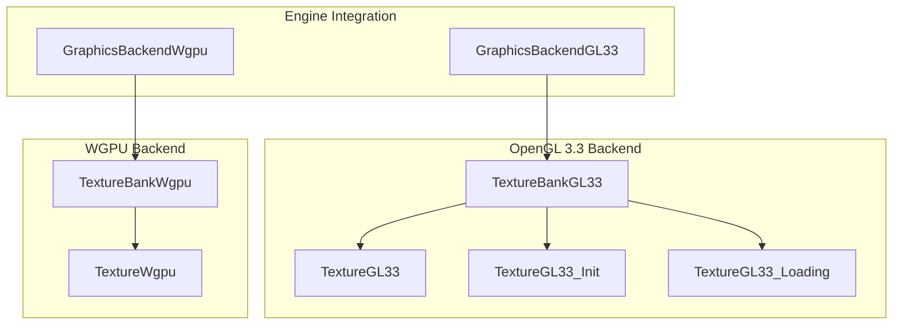
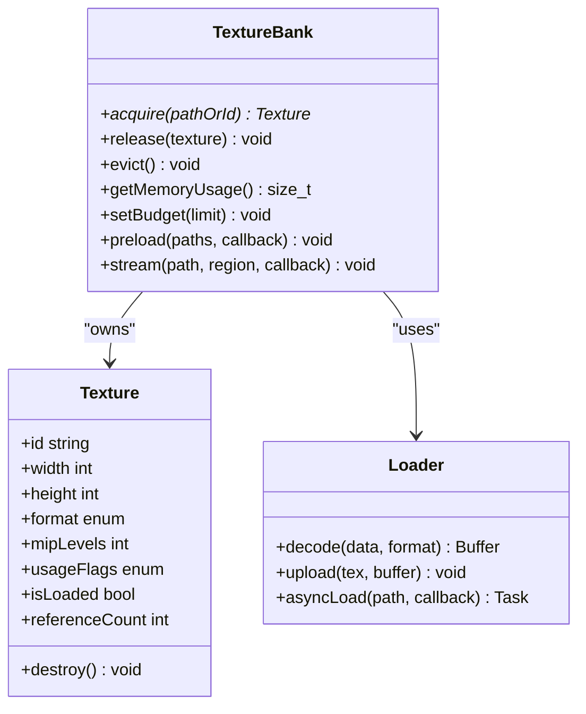
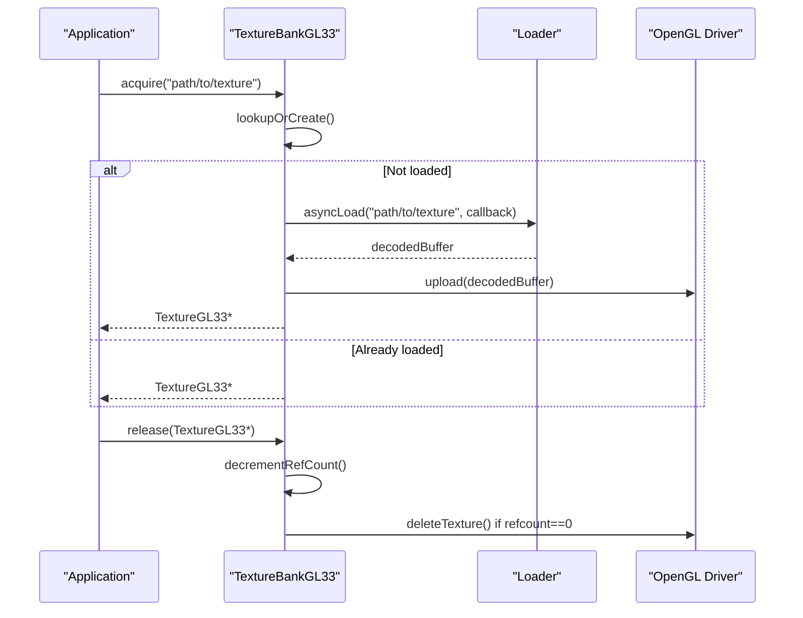
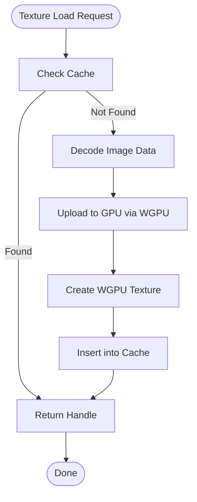
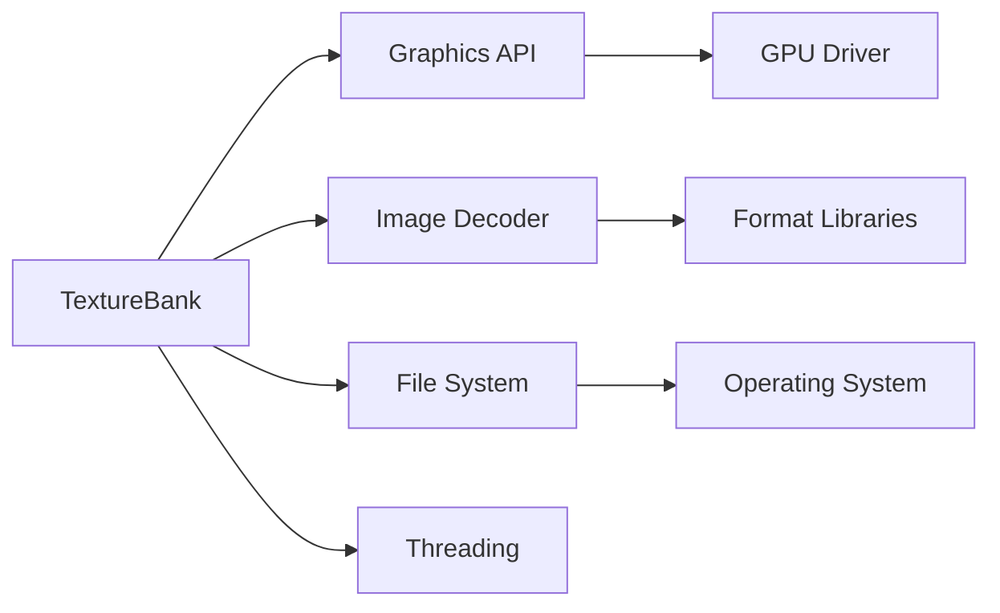

# Texture Bank & Caching

<cite>
**Referenced Files in This Document**
- [TextureBankGL33_Core.cpp](file://engine/PoseidonGL33/TextureBankGL33_Core.cpp)
- [TextureBankGL33_Cache.cpp](file://engine/PoseidonGL33/TextureBankGL33_Cache.cpp)
- [TextureGL33.hpp](file://engine/PoseidonGL33/TextureGL33.hpp)
- [TextureGL33_Init.cpp](file://engine/PoseidonGL33/TextureGL33_Init.cpp)
- [TextureGL33_Loading.cpp](file://engine/PoseidonGL33/TextureGL33_Loading.cpp)
- [TextureWgpu.hpp](file://engine/WgpuRenderer/TextureWgpu.hpp)
- [TextureWgpu.cpp](file://engine/WgpuRenderer/TextureWgpu.cpp)
- [TextureBankWgpu.hpp](file://engine/WgpuRenderer/TextureBankWgpu.hpp)
- [TextureBankWgpu.cpp](file://engine/WgpuRenderer/TextureBankWgpu.cpp)
- [GraphicsBackendGL33.cpp](file://engine/PoseidonGL33/GraphicsBackendGL33.cpp)
- [GraphicsBackendWgpu.cpp](file://engine/WgpuRenderer/GraphicsBackendWgpu.cpp)
</cite>

## Table of Contents
1. [Introduction](#introduction)
2. [Project Structure](#project-structure)
3. [Core Components](#core-components)
4. [Architecture Overview](#architecture-overview)
5. [Detailed Component Analysis](#detailed-component-analysis)
6. [Dependency Analysis](#dependency-analysis)
7. [Performance Considerations](#performance-considerations)
8. [Troubleshooting Guide](#troubleshooting-guide)
9. [Conclusion](#conclusion)
10. [Appendices](#appendices)

## Introduction
This document explains the TextureBank system responsible for texture caching, memory management, and resource lifecycle across graphics backends. It covers caching strategies, reference counting, memory budget enforcement, preloading, asynchronous loading, streaming, platform file system integration, eviction policies, duplicate detection, and cross-platform considerations. The goal is to provide both a conceptual overview and code-level insights to help developers manage textures efficiently and predictably.

## Project Structure
The TextureBank implementation is split by graphics backend:
- OpenGL 3.3 backend under PoseidonGL33
- WGPU backend under WgpuRenderer

Each backend provides:
- A TextureBank class that owns and manages texture resources
- Backend-specific Texture classes that wrap GPU handles and formats
- Initialization and loading utilities for decoding and uploading textures
- Integration points with the graphics engine factory and backend selection

**Diagram sources**
- [GraphicsBackendGL33.cpp](file://engine/PoseidonGL33/GraphicsBackendGL33.cpp)
- [GraphicsBackendWgpu.cpp](file://engine/WgpuRenderer/GraphicsBackendWgpu.cpp)
- [TextureBankGL33_Core.cpp](file://engine/PoseidonGL33/TextureBankGL33_Core.cpp)
- [TextureBankWgpu.hpp](file://engine/WgpuRenderer/TextureBankWgpu.hpp)
- [TextureGL33.hpp](file://engine/PoseidonGL33/TextureGL33.hpp)
- [TextureWgpu.hpp](file://engine/WgpuRenderer/TextureWgpu.hpp)

**Section sources**
- [TextureBankGL33_Core.cpp](file://engine/PoseidonGL33/TextureBankGL33_Core.cpp)
- [TextureBankWgpu.hpp](file://engine/WgpuRenderer/TextureBankWgpu.hpp)

## Core Components
- TextureBank (per-backend): Central registry for textures; handles allocation, lookup, eviction, and destruction.
- Texture (per-backend): Encapsulates GPU-side texture state, format info, dimensions, mipmap levels, and usage flags.
- Loader/Decoder: Converts image data from various formats into GPU-ready buffers; may run asynchronously.
- Filesystem/Archive Abstraction: Provides unified access to files and archives across platforms.

Key responsibilities:
- Cache lookups by path or asset ID
- Duplicate detection to avoid redundant allocations
- Reference counting to ensure safe lifetime management
- Memory budget enforcement and eviction when limits are exceeded
- Asynchronous loading pipeline with progress callbacks
- Streaming support for large textures or partial updates

**Section sources**
- [TextureGL33.hpp](file://engine/PoseidonGL33/TextureGL33.hpp)
- [TextureWgpu.hpp](file://engine/WgpuRenderer/TextureWgpu.hpp)
- [TextureGL33_Init.cpp](file://engine/PoseidonGL33/TextureGL33_Init.cpp)
- [TextureGL33_Loading.cpp](file://engine/PoseidonGL33/TextureGL33_Loading.cpp)

## Architecture Overview
The TextureBank integrates with the graphics engine through backend factories. Each backend exposes its own TextureBank implementation while sharing common semantics:
- Resource identity via normalized paths or IDs
- Consistent API for acquire/release references
- Uniform memory accounting and eviction triggers
- Pluggable loaders and decoders

**Diagram sources**
- [TextureBankGL33_Core.cpp](file://engine/PoseidonGL33/TextureBankGL33_Core.cpp)
- [TextureBankWgpu.hpp](file://engine/WgpuRenderer/TextureBankWgpu.hpp)
- [TextureGL33.hpp](file://engine/PoseidonGL33/TextureGL33.hpp)
- [TextureWgpu.hpp](file://engine/WgpuRenderer/TextureWgpu.hpp)

## Detailed Component Analysis

### OpenGL 3.3 TextureBank
Responsibilities:
- Maintains a map from texture identifiers to TextureGL33 instances
- Tracks reference counts per texture instance
- Enforces memory budgets by evicting least-recently-used or low-priority textures
- Coordinates with the loader to decode and upload images asynchronously

Lifecycle:
- Acquire: Lookup or create texture; increment reference count; return handle
- Release: Decrement reference count; destroy if zero
- Evict: Select candidates based on policy; free GPU memory; remove from cache

Preloading and Async Loading:
- Preload queues tasks to decode and upload textures before they are needed
- Asynchronous loading uses a task pool to avoid blocking the main thread
- Callbacks notify completion and update cache state

Streaming:
- Supports partial uploads or mip-level streaming for large textures
- Regions can be updated without re-uploading entire textures

**Diagram sources**
- [TextureBankGL33_Core.cpp](file://engine/PoseidonGL33/TextureBankGL33_Core.cpp)
- [TextureGL33_Init.cpp](file://engine/PoseidonGL33/TextureGL33_Init.cpp)
- [TextureGL33_Loading.cpp](file://engine/PoseidonGL33/TextureGL33_Loading.cpp)

**Section sources**
- [TextureBankGL33_Core.cpp](file://engine/PoseidonGL33/TextureBankGL33_Core.cpp)
- [TextureGL33_Init.cpp](file://engine/PoseidonGL33/TextureGL33_Init.cpp)
- [TextureGL33_Loading.cpp](file://engine/PoseidonGL33/TextureGL33_Loading.cpp)

### WGPU TextureBank
Responsibilities:
- Similar to OpenGL 3.3 but uses WGPU APIs for texture creation and management
- Manages device memory and command encoding for uploads
- Integrates with WGPU’s resource tracking and validation

Differences:
- Command queue scheduling for uploads
- Different memory model and resource lifetimes
- Potentially different eviction strategies due to driver behavior

**Diagram sources**
- [TextureBankWgpu.hpp](file://engine/WgpuRenderer/TextureBankWgpu.hpp)
- [TextureWgpu.hpp](file://engine/WgpuRenderer/TextureWgpu.hpp)
- [TextureWgpu.cpp](file://engine/WgpuRenderer/TextureWgpu.cpp)

**Section sources**
- [TextureBankWgpu.hpp](file://engine/WgpuRenderer/TextureBankWgpu.hpp)
- [TextureWgpu.hpp](file://engine/WgpuRenderer/TextureWgpu.hpp)
- [TextureWgpu.cpp](file://engine/WgpuRenderer/TextureWgpu.cpp)

### Texture Lifecycle Management
Reference Counting:
- Each texture maintains a reference count managed by TextureBank
- Acquire increments; release decrements
- Destruction occurs when count reaches zero

Eviction Policies:
- LRU (Least Recently Used) prioritizes frequently accessed textures
- Priority-based eviction considers usage flags and importance
- Budget enforcement triggers eviction when memory exceeds configured limit

Duplicate Detection:
- Normalized paths prevent duplicate entries
- Hash-based deduplication avoids redundant allocations

Cross-Platform Compatibility:
- Path normalization and case-insensitive matching where applicable
- Platform-specific filesystem adapters abstract differences
- Archive support ensures consistent access across packaged assets

**Section sources**
- [TextureGL33.hpp](file://engine/PoseidonGL33/TextureGL33.hpp)
- [TextureWgpu.hpp](file://engine/WgpuRenderer/TextureWgpu.hpp)

### Preloading and Asynchronous Loading
Preloading Strategy:
- Batch preload requests queued for background processing
- Prioritization based on scene requirements and user interaction hints

Asynchronous Mechanisms:
- Task pools distribute decoding and upload work across threads
- Progress callbacks allow UI updates during long operations
- Error handling ensures robustness against missing or corrupted assets

Streaming Capabilities:
- Partial texture updates reduce bandwidth and memory pressure
- Mipmap streaming improves load times for large textures
- Region-based updates enable dynamic content like decals or UI elements

**Section sources**
- [TextureGL33_Loading.cpp](file://engine/PoseidonGL33/TextureGL33_Loading.cpp)
- [TextureWgpu.cpp](file://engine/WgpuRenderer/TextureWgpu.cpp)

### Integration with File Systems and Archives
Unified Access:
- Abstracted file system interface supports local files and archives
- Path resolution handles mod directories and virtual file systems

Asset Archives:
- PBO and other archive formats supported through dedicated readers
- Streamed reads minimize memory footprint for large archives

Platform-Specific Considerations:
- Windows path handling and case sensitivity
- Linux/macOS filesystem differences abstracted behind common interface

**Section sources**
- [TextureGL33_Init.cpp](file://engine/PoseidonGL33/TextureGL33_Init.cpp)
- [TextureGL33_Loading.cpp](file://engine/PoseidonGL33/TextureGL33_Loading.cpp)

## Dependency Analysis
The TextureBank depends on several subsystems:
- Graphics backend APIs (OpenGL 3.3 or WGPU)
- Image decoding libraries for various formats
- File system abstraction for asset access
- Threading primitives for asynchronous operations

**Diagram sources**
- [TextureBankGL33_Core.cpp](file://engine/PoseidonGL33/TextureBankGL33_Core.cpp)
- [TextureBankWgpu.hpp](file://engine/WgpuRenderer/TextureBankWgpu.hpp)
- [GraphicsBackendGL33.cpp](file://engine/PoseidonGL33/GraphicsBackendGL33.cpp)
- [GraphicsBackendWgpu.cpp](file://engine/WgpuRenderer/GraphicsBackendWgpu.cpp)

**Section sources**
- [GraphicsBackendGL33.cpp](file://engine/PoseidonGL33/GraphicsBackendGL33.cpp)
- [GraphicsBackendWgpu.cpp](file://engine/WgpuRenderer/GraphicsBackendWgpu.cpp)

## Performance Considerations
- Minimize texture swaps by using appropriate LOD levels
- Prefer shared textures for common assets to reduce memory usage
- Use streaming for large textures to avoid initial load spikes
- Monitor memory usage and adjust budgets based on target platforms
- Avoid frequent small updates; batch changes when possible
- Leverage compression formats supported by the GPU

[No sources needed since this section provides general guidance]

## Troubleshooting Guide
Common Issues:
- Texture not found errors: Verify path normalization and archive mounting
- Memory leaks: Ensure proper release calls and check reference counts
- Stuttering during load: Implement preloading and prioritize critical textures
- Corrupted textures: Validate image data and handle decoder errors gracefully

Debugging Tips:
- Enable verbose logging for texture operations
- Use profiling tools to identify memory bottlenecks
- Test on target platforms to catch platform-specific issues

**Section sources**
- [TextureGL33_Init.cpp](file://engine/PoseidonGL33/TextureGL33_Init.cpp)
- [TextureGL33_Loading.cpp](file://engine/PoseidonGL33/TextureGL33_Loading.cpp)

## Conclusion
The TextureBank system provides a robust foundation for texture management across graphics backends. By implementing efficient caching, reference counting, and memory budget enforcement, it ensures optimal performance and resource utilization. The modular design allows for easy extension and adaptation to new platforms and formats. Developers should leverage preloading, streaming, and appropriate eviction policies to achieve smooth gameplay experiences.

[No sources needed since this section summarizes without analyzing specific files]

## Appendices

### Example Usage Patterns
- Managing texture lifecycles: Always pair acquire with release calls
- Implementing custom cache policies: Extend eviction logic based on application needs
- Optimizing memory usage: Use appropriate formats and compression

[No sources needed since this section provides general guidance]