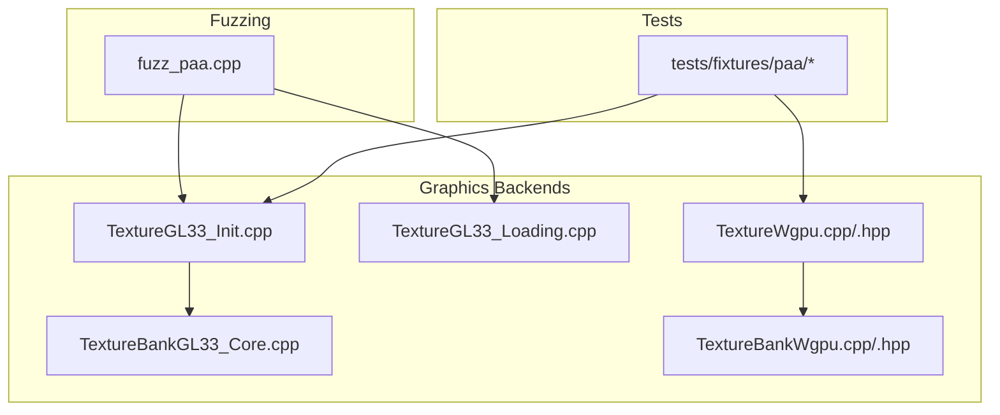
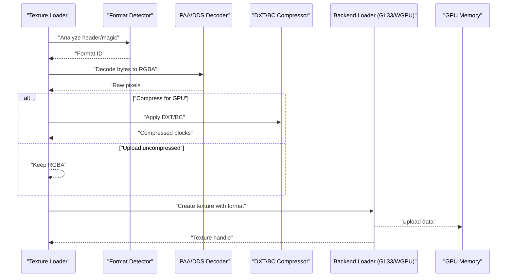
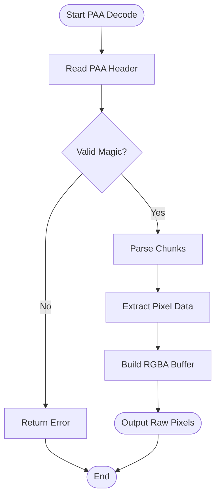
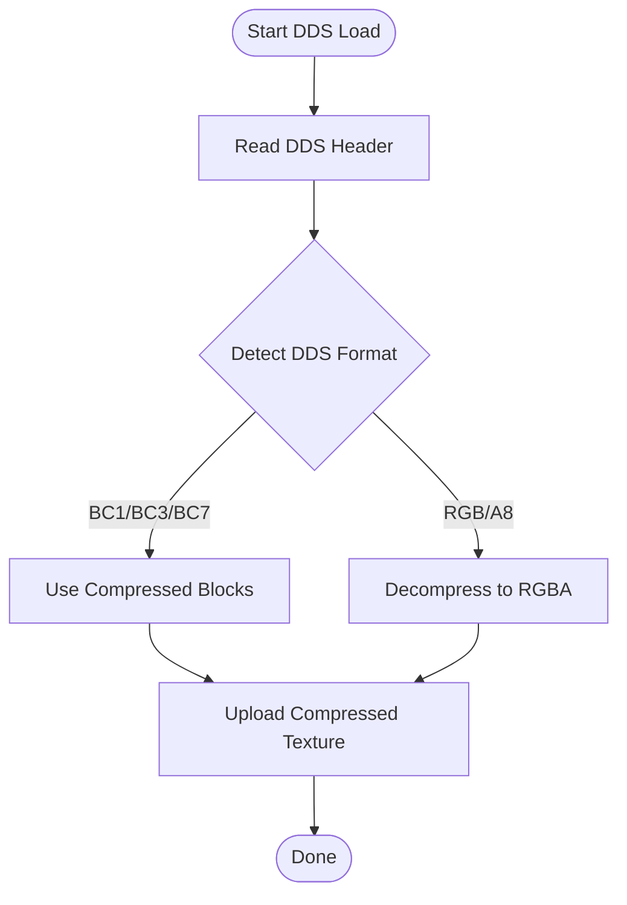
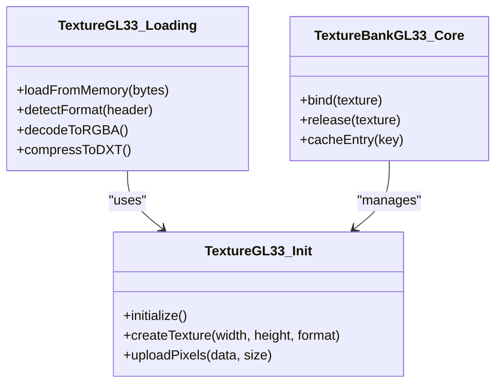
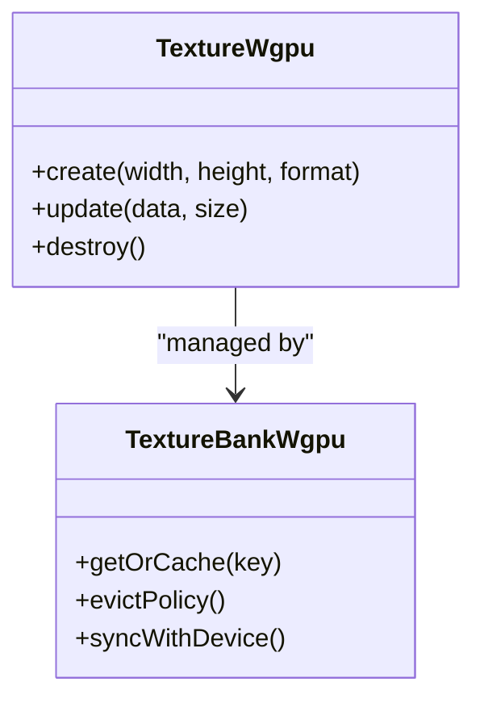
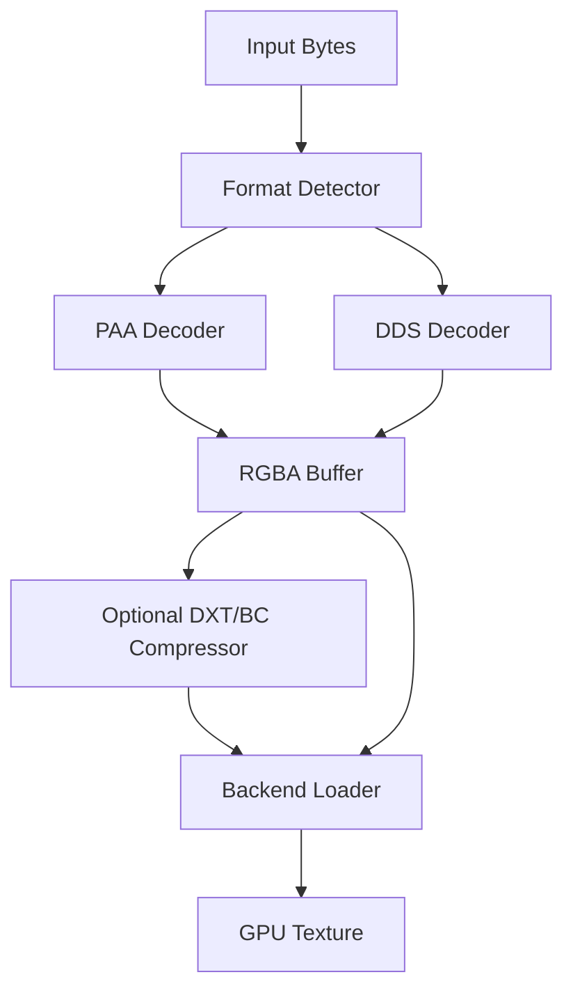
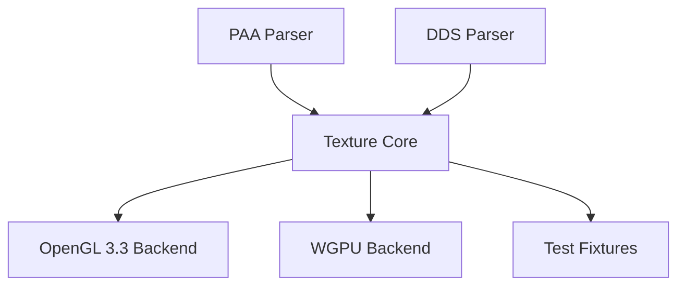

# Texture Formats & Decoders

<cite>
**Referenced Files in This Document**
- [fuzz_paa.cpp](file://apps/fuzzers/Fuzzer/fuzz_paa.cpp)
- [TextureGL33_Init.cpp](file://engine/PoseidonGL33/TextureGL33_Init.cpp)
- [TextureGL33_Loading.cpp](file://engine/PoseidonGL33/TextureGL33_Loading.cpp)
- [TextureBankGL33_Core.cpp](file://engine/PoseidonGL33/TextureBankGL33_Core.cpp)
- [TextureWgpu.cpp](file://engine/WgpuRenderer/TextureWgpu.cpp)
- [TextureWgpu.hpp](file://engine/WgpuRenderer/TextureWgpu.hpp)
- [TextureBankWgpu.cpp](file://engine/WgpuRenderer/TextureBankWgpu.cpp)
- [TextureBankWgpu.hpp](file://engine/WgpuRenderer/TextureBankWgpu.hpp)
- [PAA texture fixtures](file://tests/fixtures/paa)
</cite>

## Table of Contents
1. [Introduction](#introduction)
2. [Project Structure](#project-structure)
3. [Core Components](#core-components)
4. [Architecture Overview](#architecture-overview)
5. [Detailed Component Analysis](#detailed-component-analysis)
6. [Dependency Analysis](#dependency-analysis)
7. [Performance Considerations](#performance-considerations)
8. [Troubleshooting Guide](#troubleshooting-guide)
9. [Conclusion](#conclusion)
10. [Appendices](#appendices)

## Introduction
This document explains the texture format support and conversion systems used by the project, focusing on:
- PAA (Arma texture format) decoding
- DDS format handling
- DXT compression/decompression
- Decoder architecture and format detection mechanisms
- Conversion pipelines between formats
- How to add support for new custom texture formats
- Texture compression algorithms, quality settings, and performance trade-offs
- Examples of converting between different texture formats and optimizing assets for different platforms

The goal is to provide both a high-level understanding and actionable guidance for developers extending or maintaining the texture pipeline.

## Project Structure
The texture system spans multiple layers:
- Fuzzing harnesses for robustness testing of parsers like PAA
- Graphics backend implementations for loading textures into GPU memory (OpenGL 3.3 and WGPU)
- Texture bank abstractions that manage texture lifetimes and platform-specific details
- Test fixtures providing sample PAA files for validation

**Diagram sources**
- [fuzz_paa.cpp](file://apps/fuzzers/Fuzzer/fuzz_paa.cpp)
- [TextureGL33_Init.cpp](file://engine/PoseidonGL33/TextureGL33_Init.cpp)
- [TextureGL33_Loading.cpp](file://engine/PoseidonGL33/TextureGL33_Loading.cpp)
- [TextureBankGL33_Core.cpp](file://engine/PoseidonGL33/TextureBankGL33_Core.cpp)
- [TextureWgpu.cpp](file://engine/WgpuRenderer/TextureWgpu.cpp)
- [TextureWgpu.hpp](file://engine/WgpuRenderer/TextureWgpu.hpp)
- [TextureBankWgpu.cpp](file://engine/WgpuRenderer/TextureBankWgpu.cpp)
- [TextureBankWgpu.hpp](file://engine/WgpuRenderer/TextureBankWgpu.hpp)
- [PAA texture fixtures](file://tests/fixtures/paa)

**Section sources**
- [fuzz_paa.cpp](file://apps/fuzzers/Fuzzer/fuzz_paa.cpp)
- [TextureGL33_Init.cpp](file://engine/PoseidonGL33/TextureGL33_Init.cpp)
- [TextureGL33_Loading.cpp](file://engine/PoseidonGL33/TextureGL33_Loading.cpp)
- [TextureBankGL33_Core.cpp](file://engine/PoseidonGL33/TextureBankGL33_Core.cpp)
- [TextureWgpu.cpp](file://engine/WgpuRenderer/TextureWgpu.cpp)
- [TextureWgpu.hpp](file://engine/WgpuRenderer/TextureWgpu.hpp)
- [TextureBankWgpu.cpp](file://engine/WgpuRenderer/TextureBankWgpu.cpp)
- [TextureBankWgpu.hpp](file://engine/WgpuRenderer/TextureBankWgpu.hpp)
- [PAA texture fixtures](file://tests/fixtures/paa)

## Core Components
- PAA decoder entry points are exercised via fuzzing to ensure robust parsing of Arma’s proprietary texture format.
- OpenGL 3.3 backend provides initialization and loading routines for textures, including format detection and GPU upload paths.
- WGPU backend implements cross-platform texture creation and management with modern graphics APIs.
- Texture banks encapsulate lifecycle and caching behavior per backend.

Key responsibilities:
- Format detection: Identify whether input data represents PAA, DDS, or other supported formats.
- Decoding: Convert compressed or containerized formats into raw pixel buffers suitable for GPU upload.
- Compression: Apply DXT/BC variants where appropriate for GPU-compressed storage.
- Upload: Transfer decoded/compressed data to GPU textures efficiently.

**Section sources**
- [fuzz_paa.cpp](file://apps/fuzzers/Fuzzer/fuzz_paa.cpp)
- [TextureGL33_Init.cpp](file://engine/PoseidonGL33/TextureGL33_Init.cpp)
- [TextureGL33_Loading.cpp](file://engine/PoseidonGL33/TextureGL33_Loading.cpp)
- [TextureBankGL33_Core.cpp](file://engine/PoseidonGL33/TextureBankGL33_Core.cpp)
- [TextureWgpu.cpp](file://engine/WgpuRenderer/TextureWgpu.cpp)
- [TextureWgpu.hpp](file://engine/WgpuRenderer/TextureWgpu.hpp)
- [TextureBankWgpu.cpp](file://engine/WgpuRenderer/TextureBankWgpu.cpp)
- [TextureBankWgpu.hpp](file://engine/WgpuRenderer/TextureBankWgpu.hpp)

## Architecture Overview
The texture pipeline follows a layered approach:
- Input layer accepts raw bytes from disk or archives.
- Format detection determines the container/format type (e.g., PAA, DDS).
- Decoders convert to an intermediate representation (typically RGBA8 or similar).
- Optional compression stage applies GPU-friendly formats (DXT/BC).
- Backend loaders upload textures to GPU memory using platform-specific APIs.

[No sources needed since this diagram shows conceptual workflow, not actual code structure]

## Detailed Component Analysis

### PAA Decoder Integration
PAA is Arma’s proprietary texture format. The fuzzing harness demonstrates how PAA data is parsed and validated. Robust parsing ensures resilience against malformed inputs.

**Diagram sources**
- [fuzz_paa.cpp](file://apps/fuzzers/Fuzzer/fuzz_paa.cpp)

**Section sources**
- [fuzz_paa.cpp](file://apps/fuzzers/Fuzzer/fuzz_paa.cpp)

### DDS Handling and DXT Compression/Decompression
DDS files commonly contain DXT/BC compressed textures. The pipeline detects DDS headers, selects appropriate BC variants, and either uploads compressed blocks directly or decompresses to RGBA when necessary.

[No sources needed since this diagram shows conceptual workflow, not actual code structure]

### OpenGL 3.3 Texture Loading
The OpenGL backend initializes textures and handles format detection and upload. It supports both compressed and uncompressed textures depending on capabilities and configuration.

**Diagram sources**
- [TextureGL33_Init.cpp](file://engine/PoseidonGL33/TextureGL33_Init.cpp)
- [TextureGL33_Loading.cpp](file://engine/PoseidonGL33/TextureGL33_Loading.cpp)
- [TextureBankGL33_Core.cpp](file://engine/PoseidonGL33/TextureBankGL33_Core.cpp)

**Section sources**
- [TextureGL33_Init.cpp](file://engine/PoseidonGL33/TextureGL33_Init.cpp)
- [TextureGL33_Loading.cpp](file://engine/PoseidonGL33/TextureGL33_Loading.cpp)
- [TextureBankGL33_Core.cpp](file://engine/PoseidonGL33/TextureBankGL33_Core.cpp)

### WGPU Texture Management
The WGPU backend abstracts texture creation and lifecycle across platforms, supporting modern GPU APIs and efficient memory management.

**Diagram sources**
- [TextureWgpu.cpp](file://engine/WgpuRenderer/TextureWgpu.cpp)
- [TextureWgpu.hpp](file://engine/WgpuRenderer/TextureWgpu.hpp)
- [TextureBankWgpu.cpp](file://engine/WgpuRenderer/TextureBankWgpu.cpp)
- [TextureBankWgpu.hpp](file://engine/WgpuRenderer/TextureBankWgpu.hpp)

**Section sources**
- [TextureWgpu.cpp](file://engine/WgpuRenderer/TextureWgpu.cpp)
- [TextureWgpu.hpp](file://engine/WgpuRenderer/TextureWgpu.hpp)
- [TextureBankWgpu.cpp](file://engine/WgpuRenderer/TextureBankWgpu.cpp)
- [TextureBankWgpu.hpp](file://engine/WgpuRenderer/TextureBankWgpu.hpp)

### Conceptual Overview
The overall texture system emphasizes modularity:
- Format detection decouples parsing from rendering.
- Decoders produce a common intermediate buffer.
- Compression is optional and backend-aware.
- Backend loaders abstract GPU specifics.

[No sources needed since this diagram shows conceptual workflow, not actual code structure]

## Dependency Analysis
The texture system depends on:
- Parser modules for PAA and DDS
- Compression libraries for DXT/BC
- Graphics backends for OpenGL 3.3 and WGPU
- Test fixtures for validation

[No sources needed since this diagram shows conceptual dependencies, not actual code structure]

**Section sources**
- [fuzz_paa.cpp](file://apps/fuzzers/Fuzzer/fuzz_paa.cpp)
- [TextureGL33_Init.cpp](file://engine/PoseidonGL33/TextureGL33_Init.cpp)
- [TextureGL33_Loading.cpp](file://engine/PoseidonGL33/TextureGL33_Loading.cpp)
- [TextureWgpu.cpp](file://engine/WgpuRenderer/TextureWgpu.cpp)
- [TextureWgpu.hpp](file://engine/WgpuRenderer/TextureWgpu.hpp)
- [TextureBankWgpu.cpp](file://engine/WgpuRenderer/TextureBankWgpu.cpp)
- [TextureBankWgpu.hpp](file://engine/WgpuRenderer/TextureBankWgpu.hpp)
- [PAA texture fixtures](file://tests/fixtures/paa)

## Performance Considerations
- Prefer GPU-compressed formats (DXT/BC) for large textures to reduce memory bandwidth and VRAM usage.
- Avoid unnecessary decompression; upload compressed blocks directly when possible.
- Cache textures in texture banks to minimize repeated loads.
- Batch texture updates to reduce API overhead.
- Choose appropriate mipmaps based on usage to improve sampling performance.
- Monitor memory usage and eviction policies in texture banks.

[No sources needed since this section provides general guidance]

## Troubleshooting Guide
Common issues and resolutions:
- Invalid PAA headers: Ensure correct magic bytes and chunk structure; use fuzzing tests to validate edge cases.
- DDS format mismatches: Verify header flags and pixel format fields match expected BC variants.
- Upload failures: Check backend capabilities and texture format support; fall back to uncompressed if needed.
- Memory leaks: Ensure proper texture destruction and cache eviction policies.

**Section sources**
- [fuzz_paa.cpp](file://apps/fuzzers/Fuzzer/fuzz_paa.cpp)
- [TextureGL33_Init.cpp](file://engine/PoseidonGL33/TextureGL33_Init.cpp)
- [TextureGL33_Loading.cpp](file://engine/PoseidonGL33/TextureGL33_Loading.cpp)
- [TextureWgpu.cpp](file://engine/WgpuRenderer/TextureWgpu.cpp)
- [TextureWgpu.hpp](file://engine/WgpuRenderer/TextureWgpu.hpp)
- [TextureBankWgpu.cpp](file://engine/WgpuRenderer/TextureBankWgpu.cpp)
- [TextureBankWgpu.hpp](file://engine/WgpuRenderer/TextureBankWgpu.hpp)

## Conclusion
The texture system provides a flexible, modular architecture for handling multiple formats, including PAA and DDS, with support for DXT compression and backend-specific optimizations. By following the guidelines in this document, developers can extend format support, optimize performance, and maintain robustness across platforms.

[No sources needed since this section summarizes without analyzing specific files]

## Appendices

### Adding Support for New Custom Texture Formats
Steps to integrate a new format:
1. Implement a parser to read headers and extract pixel data.
2. Add format detection logic to identify the new format.
3. Integrate with the decoder pipeline to produce RGBA buffers.
4. Optionally implement compression for GPU-friendly storage.
5. Update backend loaders to handle the new format.
6. Add test fixtures and fuzzing coverage.

[No sources needed since this section provides general guidance]

### Example Conversion Pipelines
- PAA to DDS: Decode PAA to RGBA, then compress to desired BC variant and write DDS container.
- DDS to PAA: Parse DDS, decompress to RGBA, then encode into PAA chunks.
- Platform optimization: Generate mipmaps and select appropriate BC formats based on target GPU capabilities.

[No sources needed since this section provides general guidance]