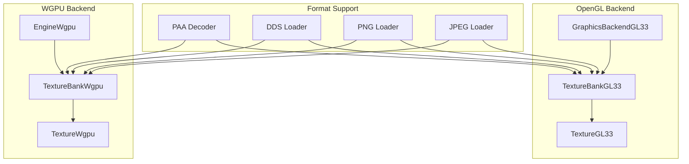
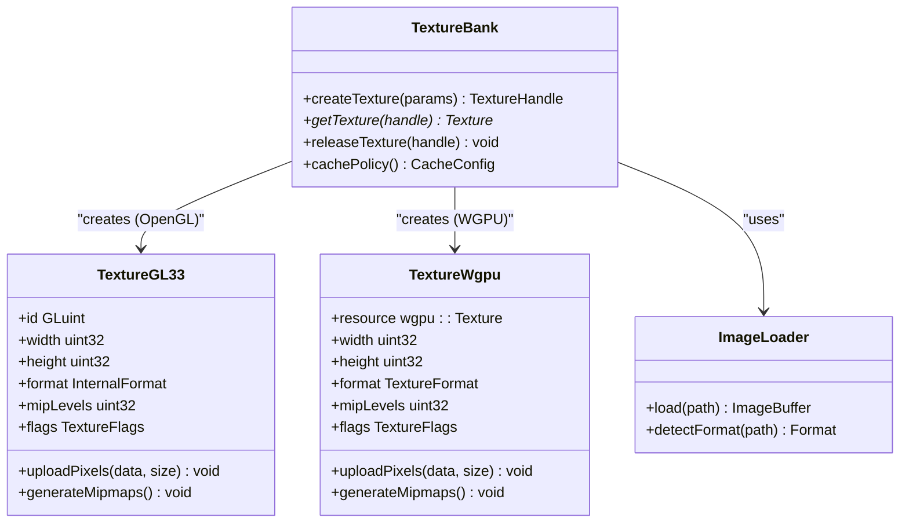
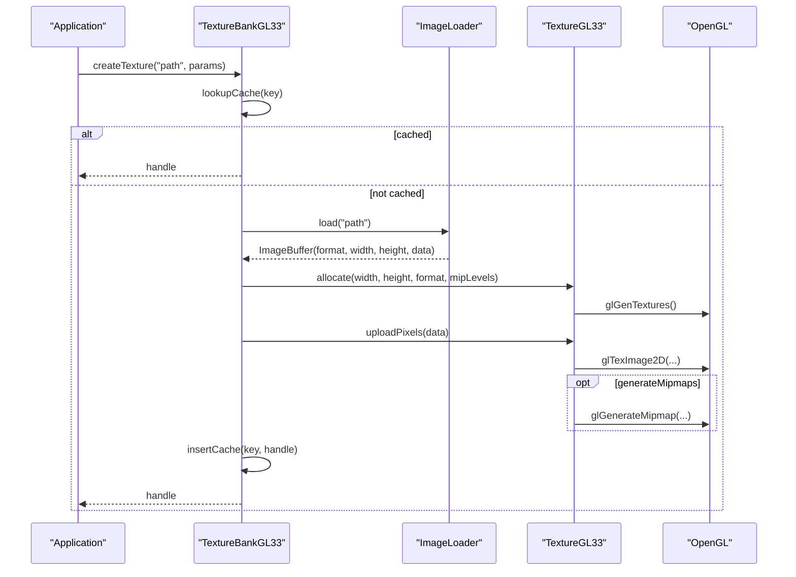
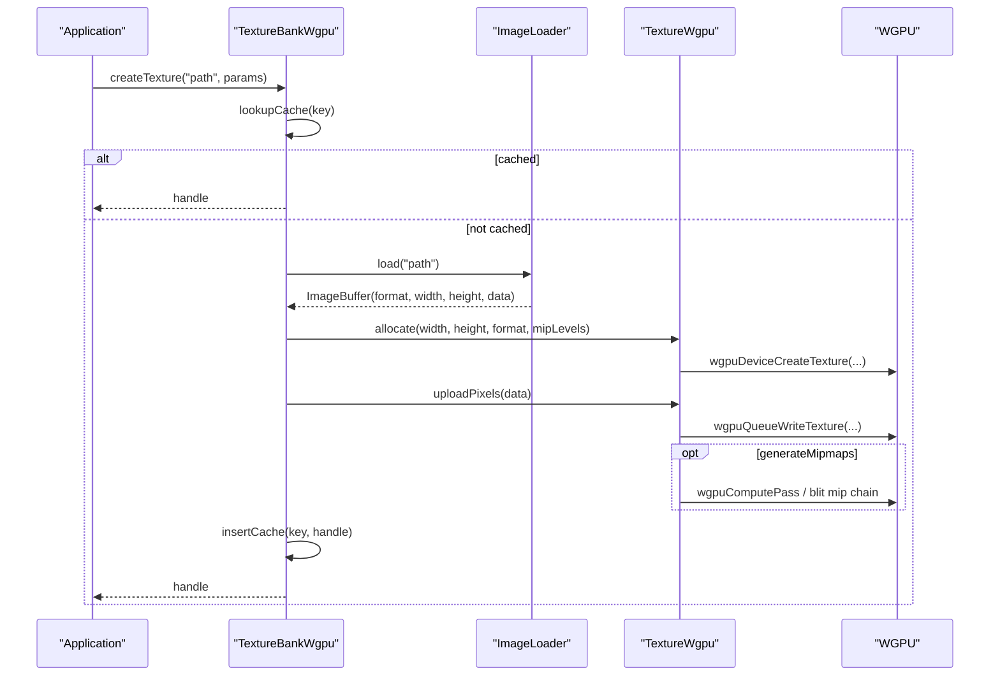
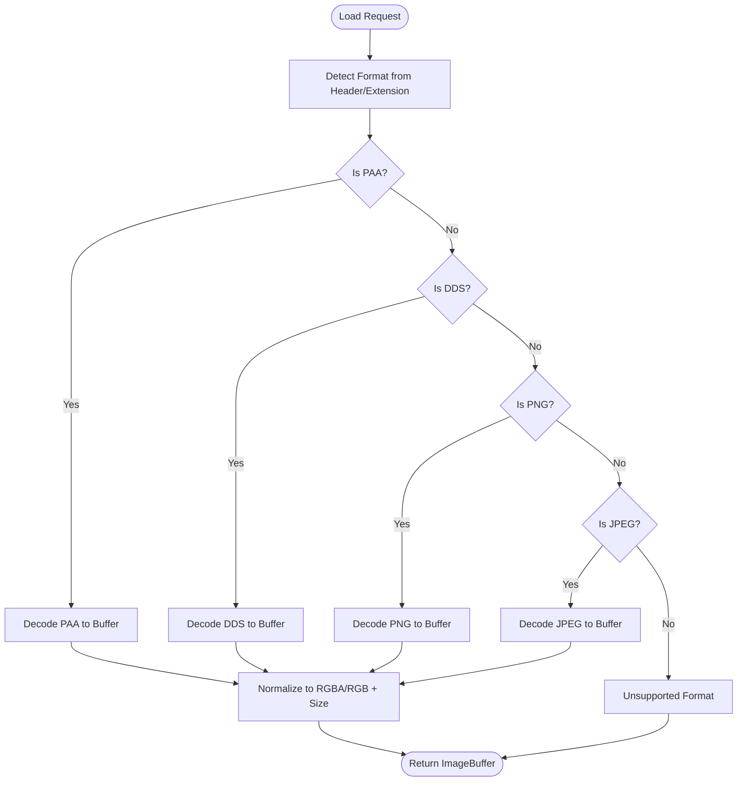
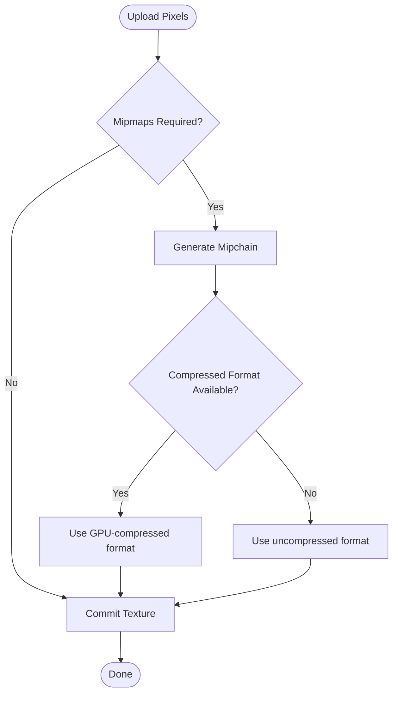
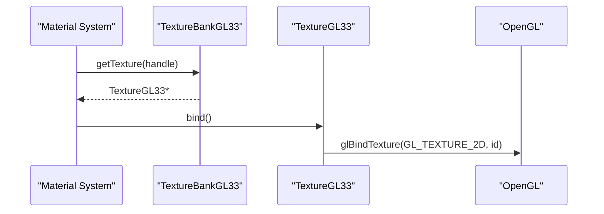
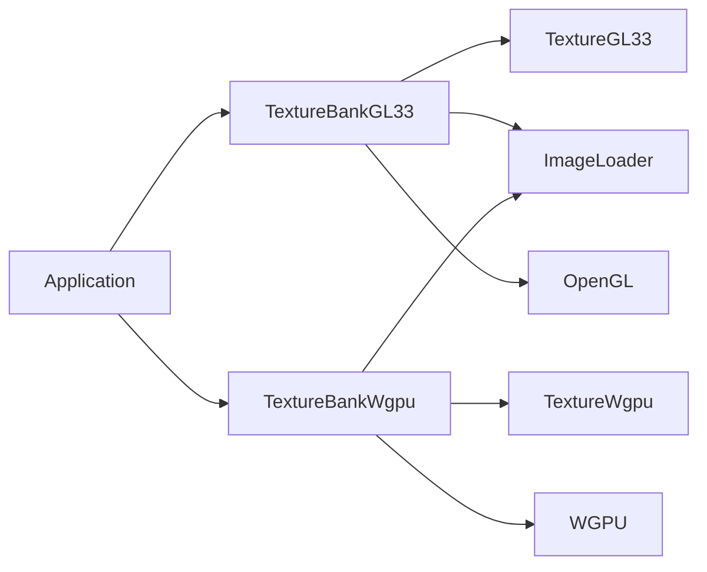

# Texture System

<cite>
**Referenced Files in This Document**
- [TextureBankGL33_Core.cpp](file://engine/PoseidonGL33/TextureBankGL33_Core.cpp)
- [TextureBankGL33_Cache.cpp](file://engine/PoseidonGL33/TextureBankGL33_Cache.cpp)
- [TextureGL33_Init.cpp](file://engine/PoseidonGL33/TextureGL33_Init.cpp)
- [TextureGL33_Loading.cpp](file://engine/PoseidonGL33/TextureGL33_Loading.cpp)
- [TextureGL33.hpp](file://engine/PoseidonGL33/TextureGL33.hpp)
- [GraphicsBackendGL33.cpp](file://engine/PoseidonGL33/GraphicsBackendGL33.cpp)
- [TextureBankWgpu.cpp](file://engine/WgpuRenderer/TextureBankWgpu.cpp)
- [TextureBankWgpu.hpp](file://engine/WgpuRenderer/TextureBankWgpu.hpp)
- [TextureWgpu.cpp](file://engine/WgpuRenderer/TextureWgpu.cpp)
- [TextureWgpu.hpp](file://engine/WgpuRenderer/TextureWgpu.hpp)
- [EngineGL33_Material.cpp](file://engine/PoseidonGL33/EngineGL33_Material.cpp)
- [EngineWgpu.cpp](file://engine/WgpuRenderer/EngineWgpu.cpp)
- [fuzz_paa.cpp](file://apps/fuzzers/Fuzzer/fuzz_paa.cpp)
</cite>

## Table of Contents
1. [Introduction](#introduction)
2. [Project Structure](#project-structure)
3. [Core Components](#core-components)
4. [Architecture Overview](#architecture-overview)
5. [Detailed Component Analysis](#detailed-component-analysis)
6. [Dependency Analysis](#dependency-analysis)
7. [Performance Considerations](#performance-considerations)
8. [Troubleshooting Guide](#troubleshooting-guide)
9. [Conclusion](#conclusion)
10. [Appendices](#appendices)

## Introduction
This document explains the texture management system, focusing on image loading, format conversion, GPU texture creation, and backend integration. It covers the TextureBank architecture, caching strategies, memory optimization techniques, supported formats (PAA, DDS, PNG, JPEG), mipmapping, compression, and format detection. It also details how OpenGL and WGPU backends are used for upload and management, and provides guidance for adding new formats and optimizing performance. Finally, it addresses texture streaming, LOD management, and memory budget considerations.

## Project Structure
The texture system is split into:
- Backend-agnostic interfaces and shared logic
- OpenGL-specific implementation (PoseidonGL33)
- WGPU-specific implementation (WgpuRenderer)
- Format support via decoders and fuzz tests

[No sources needed since this diagram shows conceptual workflow, not actual code structure]

## Core Components
- TextureBank: Central registry that owns textures, manages caching, and coordinates uploads to the GPU.
- Texture (backend-specific): Encapsulates GPU-side resources and metadata (format, size, flags).
- Image loaders: Decode various formats into a common pixel buffer with known internal format and dimensions.
- Backend integrations: Upload pixel data to GPU textures and manage lifecycle.

Key responsibilities:
- Detecting and normalizing image formats
- Generating mipmaps when requested
- Caching decoded or compressed textures to avoid redundant work
- Managing memory budgets and eviction policies
- Exposing stable handles to rendering systems

**Section sources**
- [TextureBankGL33_Core.cpp](file://engine/PoseidonGL33/TextureBankGL33_Core.cpp)
- [TextureBankGL33_Cache.cpp](file://engine/PoseidonGL33/TextureBankGL33_Cache.cpp)
- [TextureGL33.hpp](file://engine/PoseidonGL33/TextureGL33.hpp)
- [TextureBankWgpu.hpp](file://engine/WgpuRenderer/TextureBankWgpu.hpp)
- [TextureWgpu.hpp](file://engine/WgpuRenderer/TextureWgpu.hpp)

## Architecture Overview
The TextureBank abstracts over multiple backends while providing a unified API for creating and managing textures. Each backend implements its own Texture class and upload path.

**Diagram sources**
- [TextureBankGL33_Core.cpp](file://engine/PoseidonGL33/TextureBankGL33_Core.cpp)
- [TextureGL33.hpp](file://engine/PoseidonGL33/TextureGL33.hpp)
- [TextureBankWgpu.hpp](file://engine/WgpuRenderer/TextureBankWgpu.hpp)
- [TextureWgpu.hpp](file://engine/WgpuRenderer/TextureWgpu.hpp)

**Section sources**
- [GraphicsBackendGL33.cpp](file://engine/PoseidonGL33/GraphicsBackendGL33.cpp)
- [EngineWgpu.cpp](file://engine/WgpuRenderer/EngineWgpu.cpp)

## Detailed Component Analysis

### OpenGL Texture Bank and Texture
- TextureBankGL33 maintains a cache keyed by asset identifiers and parameters (size, format, flags).
- TextureGL33 wraps an OpenGL texture object with metadata and methods for uploading pixels and generating mipmaps.
- Loading pipeline detects format, decodes to a CPU buffer, optionally compresses to a GPU-friendly format, then uploads.

**Diagram sources**
- [TextureBankGL33_Core.cpp](file://engine/PoseidonGL33/TextureBankGL33_Core.cpp)
- [TextureBankGL33_Cache.cpp](file://engine/PoseidonGL33/TextureBankGL33_Cache.cpp)
- [TextureGL33_Init.cpp](file://engine/PoseidonGL33/TextureGL33_Init.cpp)
- [TextureGL33_Loading.cpp](file://engine/PoseidonGL33/TextureGL33_Loading.cpp)

**Section sources**
- [TextureBankGL33_Core.cpp](file://engine/PoseidonGL33/TextureBankGL33_Core.cpp)
- [TextureBankGL33_Cache.cpp](file://engine/PoseidonGL33/TextureBankGL33_Cache.cpp)
- [TextureGL33_Init.cpp](file://engine/PoseidonGL33/TextureGL33_Init.cpp)
- [TextureGL33_Loading.cpp](file://engine/PoseidonGL33/TextureGL33_Loading.cpp)
- [TextureGL33.hpp](file://engine/PoseidonGL33/TextureGL33.hpp)

### WGPU Texture Bank and Texture
- TextureBankWgpu mirrors the OpenGL bank’s responsibilities but uses WGPU APIs for resource creation and uploads.
- TextureWgpu encapsulates a WGPU texture and associated views, handling pixel uploads and mipmap generation.

**Diagram sources**
- [TextureBankWgpu.cpp](file://engine/WgpuRenderer/TextureBankWgpu.cpp)
- [TextureWgpu.cpp](file://engine/WgpuRenderer/TextureWgpu.cpp)

**Section sources**
- [TextureBankWgpu.hpp](file://engine/WgpuRenderer/TextureBankWgpu.hpp)
- [TextureBankWgpu.cpp](file://engine/WgpuRenderer/TextureBankWgpu.cpp)
- [TextureWgpu.hpp](file://engine/WgpuRenderer/TextureWgpu.hpp)
- [TextureWgpu.cpp](file://engine/WgpuRenderer/TextureWgpu.cpp)

### Image Loading and Format Detection
- Supported formats include PAA, DDS, PNG, and JPEG.
- Format detection typically relies on file headers and extensions; decoding produces a normalized RGBA or RGB buffer with explicit dimensions.
- For PAA, dedicated decoders exist and are exercised by fuzz tests.

**Diagram sources**
- [fuzz_paa.cpp](file://apps/fuzzers/Fuzzer/fuzz_paa.cpp)

**Section sources**
- [fuzz_paa.cpp](file://apps/fuzzers/Fuzzer/fuzz_paa.cpp)

### Mipmapping and Texture Compression
- Mipmaps can be generated automatically after upload if requested by the caller.
- Compression targets GPU-native formats where available; otherwise, uncompressed formats are used.
- The decision between compressed vs uncompressed depends on platform capabilities and requested usage flags.

[No sources needed since this diagram shows conceptual workflow, not actual code structure]

### Integration with Rendering Systems
- Material systems bind textures through handles provided by TextureBank.
- Backends translate these handles into native bindings (GL texture IDs or WGPU textures).

**Diagram sources**
- [EngineGL33_Material.cpp](file://engine/PoseidonGL33/EngineGL33_Material.cpp)
- [TextureGL33.hpp](file://engine/PoseidonGL33/TextureGL33.hpp)

**Section sources**
- [EngineGL33_Material.cpp](file://engine/PoseidonGL33/EngineGL33_Material.cpp)

## Dependency Analysis
- TextureBank implementations depend on:
  - Image loaders for decoding and normalization
  - Backend-specific Texture classes for GPU resource management
  - Platform capability queries for choosing optimal formats
- Rendering systems depend on TextureBank for texture acquisition and binding.

**Diagram sources**
- [GraphicsBackendGL33.cpp](file://engine/PoseidonGL33/GraphicsBackendGL33.cpp)
- [EngineWgpu.cpp](file://engine/WgpuRenderer/EngineWgpu.cpp)
- [TextureBankGL33_Core.cpp](file://engine/PoseidonGL33/TextureBankGL33_Core.cpp)
- [TextureBankWgpu.cpp](file://engine/WgpuRenderer/TextureBankWgpu.cpp)

**Section sources**
- [GraphicsBackendGL33.cpp](file://engine/PoseidonGL33/GraphicsBackendGL33.cpp)
- [EngineWgpu.cpp](file://engine/WgpuRenderer/EngineWgpu.cpp)

## Performance Considerations
- Caching:
  - Deduplicate identical loads using keys derived from asset paths and parameters.
  - Prefer compressed GPU formats when available to reduce bandwidth and memory.
- Mipmaps:
  - Enable mipmaps for sampled textures to improve filtering and reduce aliasing.
  - Avoid unnecessary regeneration; store mip levels once per texture.
- Memory Budget:
  - Track total VRAM usage across all textures.
  - Implement LRU or priority-based eviction for offscreen caches.
- Streaming:
  - Load only required mip levels initially; stream additional levels on demand.
  - Use asynchronous loading to avoid frame stalls.
- Decoding:
  - Reuse buffers and avoid repeated allocations.
  - Parallelize decoding for large batches where safe.

[No sources needed since this section provides general guidance]

## Troubleshooting Guide
Common issues and resolutions:
- Unsupported format errors:
  - Verify file headers and ensure decoders are registered.
  - Confirm extension mapping matches expected formats.
- Missing mipmaps causing blurry textures:
  - Ensure mip generation is enabled and the texture usage flags allow sampling.
- Out-of-memory during upload:
  - Reduce texture sizes, enable compression, or lower simultaneous load counts.
  - Monitor VRAM usage and implement eviction.
- Backend-specific failures:
  - Validate OpenGL context state and WGPU device queues.
  - Check error logs from GL calls and WGPU validation layers.

**Section sources**
- [TextureGL33_Init.cpp](file://engine/PoseidonGL33/TextureGL33_Init.cpp)
- [TextureGL33_Loading.cpp](file://engine/PoseidonGL33/TextureGL33_Loading.cpp)
- [TextureWgpu.cpp](file://engine/WgpuRenderer/TextureWgpu.cpp)

## Conclusion
The texture system provides a robust, backend-agnostic foundation for loading, converting, and uploading images to the GPU. By leveraging caching, mipmapping, and compression, it balances quality and performance across OpenGL and WGPU backends. Extending format support and optimizing loading pipelines can further enhance scalability and user experience.

[No sources needed since this section summarizes without analyzing specific files]

## Appendices

### Adding a New Texture Format
Steps to integrate a new format:
- Implement a decoder that outputs a normalized buffer (RGBA/RGB) with correct dimensions.
- Register the decoder with the image loader, including header/extension detection.
- Validate with unit tests and fuzz inputs.
- Ensure backend upload paths accept the resulting format or add conversion as needed.

[No sources needed since this section provides general guidance]

### Optimizing Texture Loading Performance
Recommendations:
- Batch decode operations and reuse buffers.
- Precompute mipchains offline for static assets.
- Use async I/O and worker threads for decoding and uploads.
- Profile VRAM usage and adjust compression choices based on hardware capabilities.

[No sources needed since this section provides general guidance]