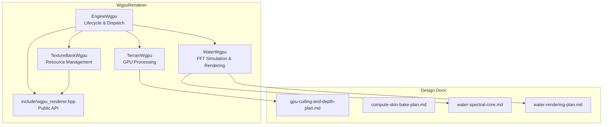
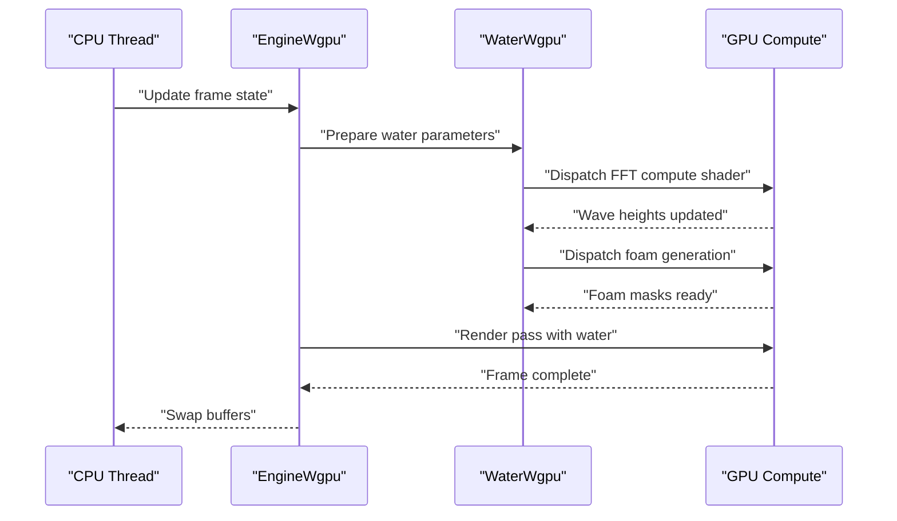
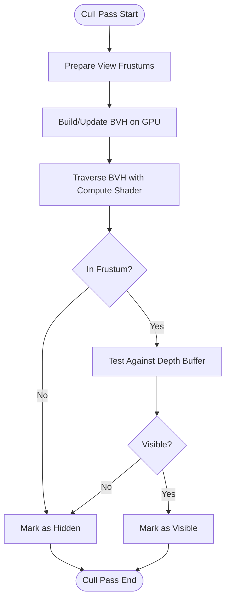
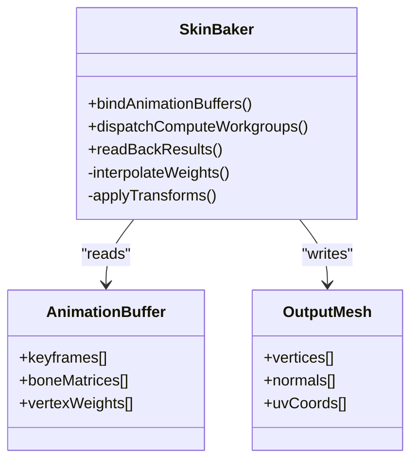
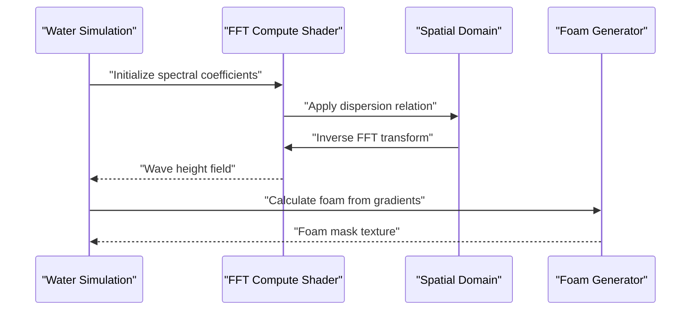
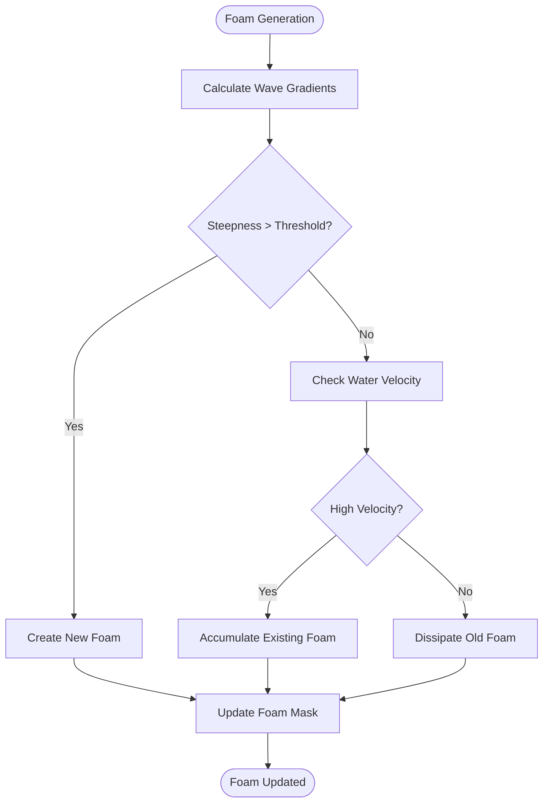
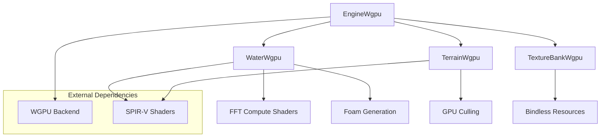

# Compute Shaders & GPU Acceleration

<cite>
**Referenced Files in This Document**
- [compute-skin-bake-plan.md](file://engine/WgpuRenderer/docs/compute-skin-bake-plan.md)
- [water-spectral-core.md](file://engine/WgpuRenderer/docs/water-spectral-core.md)
- [gpu-culling-and-depth-plan.md](file://engine/WgpuRenderer/docs/gpu-culling-and-depth-plan.md)
- [water-rendering-plan.md](file://engine/WgpuRenderer/docs/water-rendering-plan.md)
- [EngineWgpu.cpp](file://engine/WgpuRenderer/EngineWgpu.cpp)
- [EngineWgpu.hpp](file://engine/WgpuRenderer/EngineWgpu.hpp)
- [WaterWgpu.cpp](file://engine/WgpuRenderer/WaterWgpu.cpp)
- [WaterWgpu.hpp](file://engine/WgpuRenderer/WaterWgpu.hpp)
- [TerrainWgpu.cpp](file://engine/WgpuRenderer/TerrainWgpu.cpp)
- [TerrainWgpu.hpp](file://engine/WgpuRenderer/TerrainWgpu.hpp)
- [TextureBankWgpu.cpp](file://engine/WgpuRenderer/TextureBankWgpu.cpp)
- [TextureBankWgpu.hpp](file://engine/WgpuRenderer/TextureBankWgpu.hpp)
- [wgpu_renderer.hpp](file://engine/WgpuRenderer/include/wgpu_renderer.hpp)
</cite>

## Table of Contents
1. [Introduction](#introduction)
2. [Project Structure](#project-structure)
3. [Core Components](#core-components)
4. [Architecture Overview](#architecture-overview)
5. [Detailed Component Analysis](#detailed-component-analysis)
6. [Dependency Analysis](#dependency-analysis)
7. [Performance Considerations](#performance-considerations)
8. [Troubleshooting Guide](#troubleshooting-guide)
9. [Conclusion](#conclusion)
10. [Appendices](#appendices)

## Introduction
This document explains compute shader implementations and GPU acceleration techniques used across the project, focusing on culling algorithms, skin baking processes, water simulation using FFT, and foam generation systems. It also covers shader programming patterns, buffer binding strategies, parallel computation optimization, custom compute shader development, GPU memory management, CPU-GPU synchronization, debugging workflows, and performance tuning for maximum throughput.

## Project Structure
The GPU-related implementation is primarily located under the WgpuRenderer module. Key areas include:
- Engine integration and lifecycle management
- Water simulation and rendering subsystems
- Terrain processing with GPU acceleration
- Texture and resource management
- Design documents describing compute-driven pipelines (culling, skin baking, water spectral core)

**Diagram sources**
- [EngineWgpu.cpp](file://engine/WgpuRenderer/EngineWgpu.cpp)
- [EngineWgpu.hpp](file://engine/WgpuRenderer/EngineWgpu.hpp)
- [WaterWgpu.cpp](file://engine/WgpuRenderer/WaterWgpu.cpp)
- [WaterWgpu.hpp](file://engine/WgpuRenderer/WaterWgpu.hpp)
- [TerrainWgpu.cpp](file://engine/WgpuRenderer/TerrainWgpu.cpp)
- [TerrainWgpu.hpp](file://engine/WgpuRenderer/TerrainWgpu.hpp)
- [TextureBankWgpu.cpp](file://engine/WgpuRenderer/TextureBankWgpu.cpp)
- [TextureBankWgpu.hpp](file://engine/WgpuRenderer/TextureBankWgpu.hpp)
- [wgpu_renderer.hpp](file://engine/WgpuRenderer/include/wgpu_renderer.hpp)
- [gpu-culling-and-depth-plan.md](file://engine/WgpuRenderer/docs/gpu-culling-and-depth-plan.md)
- [compute-skin-bake-plan.md](file://engine/WgpuRenderer/docs/compute-skin-bake-plan.md)
- [water-spectral-core.md](file://engine/WgpuRenderer/docs/water-spectral-core.md)
- [water-rendering-plan.md](file://engine/WgpuRenderer/docs/water-rendering-plan.md)

**Section sources**
- [EngineWgpu.hpp](file://engine/WgpuRenderer/EngineWgpu.hpp)
- [wgpu_renderer.hpp](file://engine/WgpuRenderer/include/wgpu_renderer.hpp)

## Core Components
- EngineWgpu: Orchestrates GPU command submission, pipeline setup, and dispatches compute/render passes. It coordinates buffers, bind groups, and synchronization primitives.
- WaterWgpu: Implements FFT-based water surface simulation and rendering, including wave propagation, foam generation, and interaction effects.
- TerrainWgpu: Applies GPU-accelerated operations for terrain processing and culling decisions.
- TextureBankWgpu: Manages GPU textures and buffers, handling allocation, updates, and caching strategies.
- Public API (wgpu_renderer.hpp): Exposes high-level interfaces for engine modules to interact with GPU resources and pipelines.

Key responsibilities:
- Buffer binding strategies for compute shaders (SSBOs, uniform buffers, storage textures)
- Parallel computation patterns (workgroups, dispatch sizes, barrier usage)
- Memory coalescing and bandwidth optimization
- Synchronization between CPU and GPU (fences, events, staging buffers)

**Section sources**
- [EngineWgpu.cpp](file://engine/WgpuRenderer/EngineWgpu.cpp)
- [WaterWgpu.cpp](file://engine/WgpuRenderer/WaterWgpu.cpp)
- [TerrainWgpu.cpp](file://engine/WgpuRenderer/TerrainWgpu.cpp)
- [TextureBankWgpu.cpp](file://engine/WgpuRenderer/TextureBankWgpu.cpp)
- [wgpu_renderer.hpp](file://engine/WgpuRenderer/include/wgpu_renderer.hpp)

## Architecture Overview
The system uses a compute-first architecture where heavy lifting is offloaded to the GPU via compute shaders. The flow typically involves:
- Preparing input data on CPU and uploading to GPU buffers
- Binding buffers and dispatching compute shaders
- Reading back results or chaining further GPU passes
- Rendering final output using render pipelines

**Diagram sources**
- [EngineWgpu.cpp](file://engine/WgpuRenderer/EngineWgpu.cpp)
- [WaterWgpu.cpp](file://engine/WgpuRenderer/WaterWgpu.cpp)
- [water-spectral-core.md](file://engine/WgpuRenderer/docs/water-spectral-core.md)

## Detailed Component Analysis

### GPU Culling Algorithms
The culling system leverages GPU compute shaders for efficient object and geometry culling. Key aspects include:
- Frustum and occlusion culling using bounding volumes
- Hierarchical culling with GPU-accelerated tree traversal
- Depth prepass integration for early-z optimization

**Diagram sources**
- [gpu-culling-and-depth-plan.md](file://engine/WgpuRenderer/docs/gpu-culling-and-depth-plan.md)
- [TerrainWgpu.cpp](file://engine/WgpuRenderer/TerrainWgpu.cpp)

**Section sources**
- [gpu-culling-and-depth-plan.md](file://engine/WgpuRenderer/docs/gpu-culling-and-depth-plan.md)
- [TerrainWgpu.cpp](file://engine/WgpuRenderer/TerrainWgpu.cpp)

### Skin Baking Processes
Skin baking converts complex animations into static vertex data using GPU compute shaders. The process includes:
- Animation keyframe sampling on GPU
- Vertex weight interpolation and skinning calculations
- Output generation for static mesh optimization

**Diagram sources**
- [compute-skin-bake-plan.md](file://engine/WgpuRenderer/docs/compute-skin-bake-plan.md)

**Section sources**
- [compute-skin-bake-plan.md](file://engine/WgpuRenderer/docs/compute-skin-bake-plan.md)

### Water Simulation Using FFT
The water system implements Fast Fourier Transform (FFT) based simulation for realistic wave propagation:
- Spectral domain simulation for wave height calculation
- Inverse FFT to convert spectral data to spatial domain
- Foam generation based on wave steepness and velocity

**Diagram sources**
- [water-spectral-core.md](file://engine/WgpuRenderer/docs/water-spectral-core.md)
- [WaterWgpu.cpp](file://engine/WgpuRenderer/WaterWgpu.cpp)

**Section sources**
- [water-spectral-core.md](file://engine/WgpuRenderer/docs/water-spectral-core.md)
- [WaterWgpu.cpp](file://engine/WgpuRenderer/WaterWgpu.cpp)

### Foam Generation Systems
Foam generation creates realistic water foam effects through multiple stages:
- Steepness-based foam creation from wave gradients
- Velocity-based foam accumulation near shorelines
- Temporal persistence and dissipation of foam layers

**Diagram sources**
- [water-rendering-plan.md](file://engine/WgpuRenderer/docs/water-rendering-plan.md)
- [WaterWgpu.cpp](file://engine/WgpuRenderer/WaterWgpu.cpp)

**Section sources**
- [water-rendering-plan.md](file://engine/WgpuRenderer/docs/water-rendering-plan.md)
- [WaterWgpu.cpp](file://engine/WgpuRenderer/WaterWgpu.cpp)

## Dependency Analysis
The GPU subsystem has clear dependency relationships between components:

**Diagram sources**
- [EngineWgpu.cpp](file://engine/WgpuRenderer/EngineWgpu.cpp)
- [WaterWgpu.cpp](file://engine/WgpuRenderer/WaterWgpu.cpp)
- [TerrainWgpu.cpp](file://engine/WgpuRenderer/TerrainWgpu.cpp)
- [TextureBankWgpu.cpp](file://engine/WgpuRenderer/TextureBankWgpu.cpp)

**Section sources**
- [EngineWgpu.hpp](file://engine/WgpuRenderer/EngineWgpu.hpp)
- [wgpu_renderer.hpp](file://engine/WgpuRenderer/include/wgpu_renderer.hpp)

## Performance Considerations
Key performance optimization strategies:
- **Memory Coalescing**: Ensure sequential memory access patterns in compute shaders
- **Workgroup Sizing**: Optimize workgroup dimensions for target GPU architectures
- **Buffer Alignment**: Properly align GPU buffers to avoid padding overhead
- **Asynchronous Operations**: Use async compute queues for overlapping CPU/GPU work
- **Texture Streaming**: Implement LOD-based texture streaming for large datasets
- **Compute Pipeline Batching**: Group similar compute operations to minimize state changes

## Troubleshooting Guide
Common issues and solutions:
- **Shader Compilation Errors**: Validate SPIR-V bytecode and check for unsupported features
- **Memory Access Violations**: Verify buffer bounds and alignment requirements
- **Synchronization Issues**: Use proper barriers and memory fences between stages
- **Performance Bottlenecks**: Profile with GPU debuggers and analyze compute utilization
- **Data Corruption**: Check for race conditions in concurrent GPU operations

Debugging techniques:
- Use GPU vendor-specific debuggers (RenderDoc, Nsight Graphics)
- Implement GPU-side logging with atomic counters
- Validate buffer contents with readback operations
- Monitor GPU memory usage and fragmentation

**Section sources**
- [EngineWgpu.cpp](file://engine/WgpuRenderer/EngineWgpu.cpp)
- [WaterWgpu.cpp](file://engine/WgpuRenderer/WaterWgpu.cpp)

## Conclusion
The GPU acceleration framework provides a robust foundation for compute-intensive operations including culling, skin baking, water simulation, and foam generation. The modular architecture allows for easy extension and optimization while maintaining performance across different GPU architectures. Future improvements should focus on better resource management, enhanced debugging capabilities, and support for newer GPU features.

## Appendices

### Custom Compute Shader Development Guidelines
- Follow consistent naming conventions for shader variables and functions
- Use appropriate data types for optimal memory bandwidth utilization
- Implement proper error handling and validation within shaders
- Test shaders across multiple GPU vendors and driver versions

### GPU Memory Management Best Practices
- Minimize buffer allocations and reuse existing memory pools
- Implement proper cleanup procedures for all GPU resources
- Use staging buffers for CPU-GPU data transfers when necessary
- Monitor GPU memory usage and implement automatic cleanup strategies

### CPU-GPU Synchronization Patterns
- Use fence objects for explicit synchronization points
- Implement double-buffering for continuous data updates
- Leverage asynchronous compute for overlapping operations
- Validate synchronization correctness during development