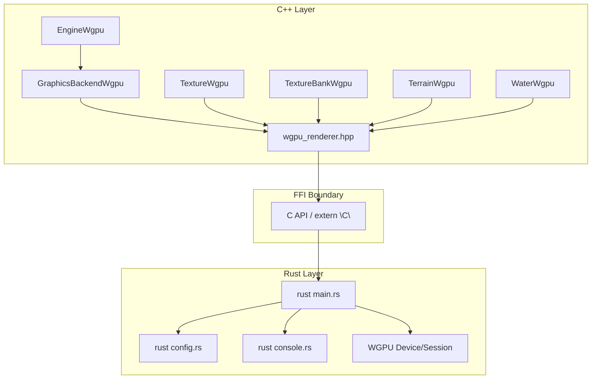
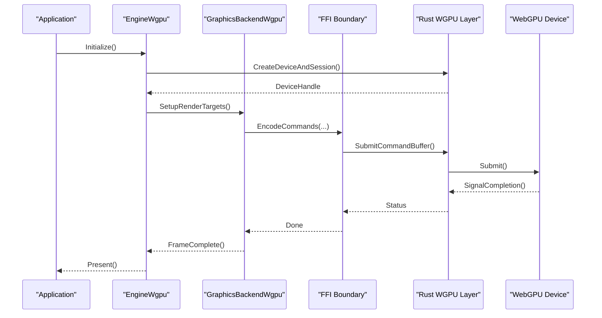
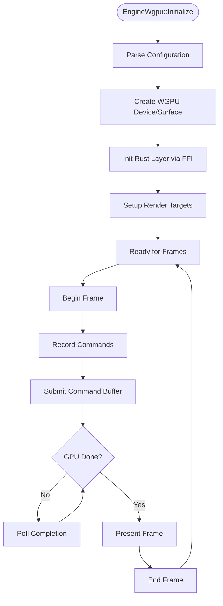
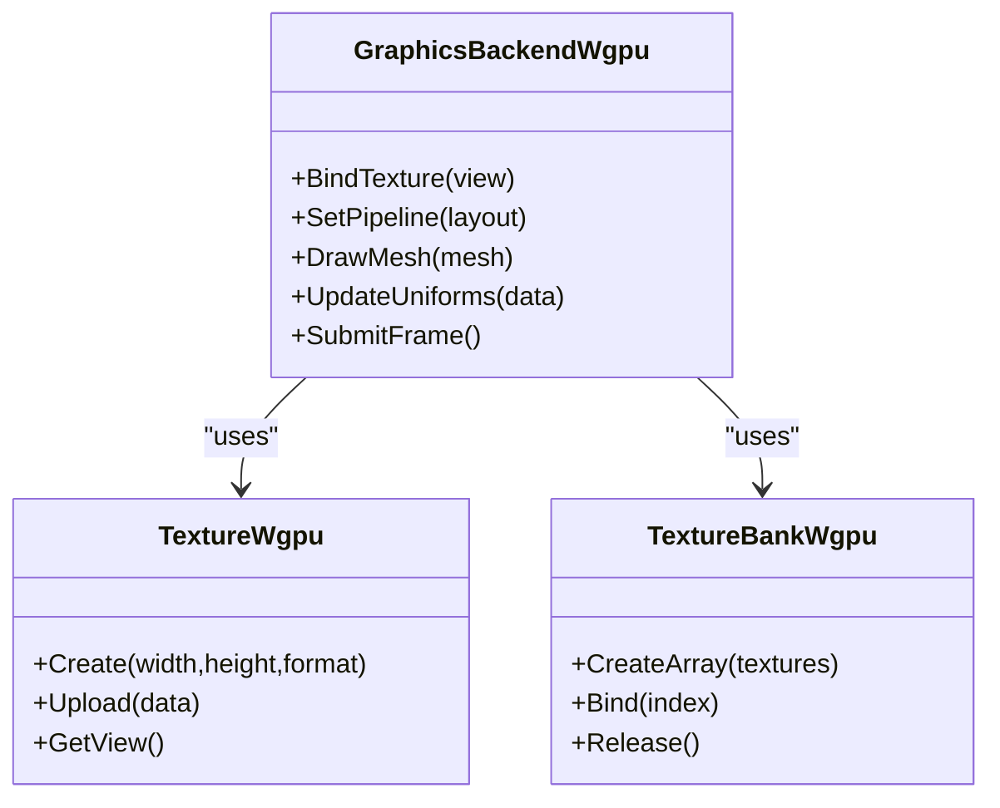
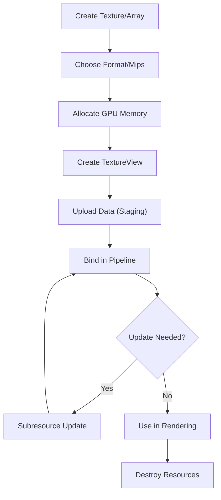
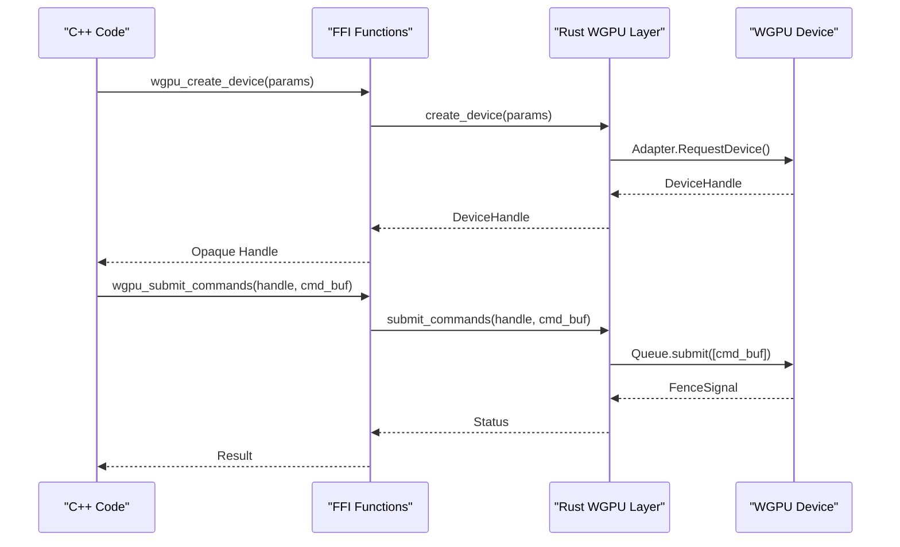
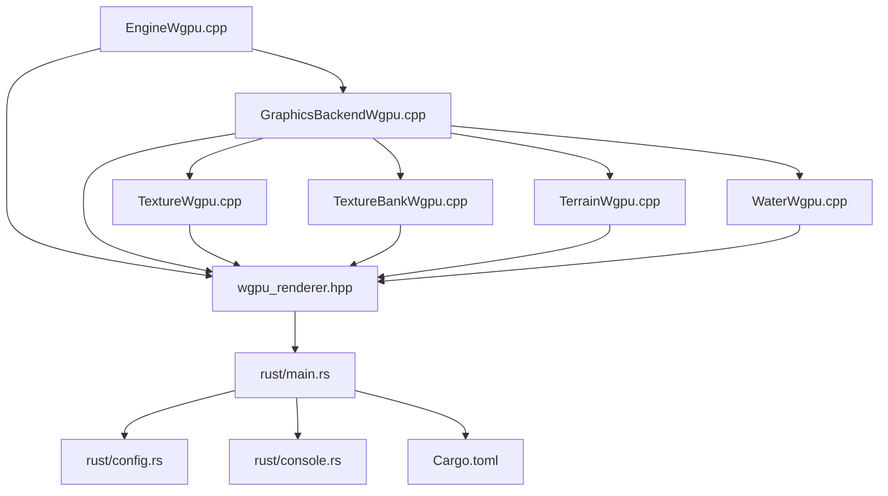

# Core Architecture & Integration

<cite>
**Referenced Files in This Document**
- [EngineWgpu.hpp](file://engine/WgpuRenderer/EngineWgpu.hpp)
- [EngineWgpu.cpp](file://engine/WgpuRenderer/EngineWgpu.cpp)
- [GraphicsBackendWgpu.cpp](file://engine/WgpuRenderer/GraphicsBackendWgpu.cpp)
- [TextureWgpu.hpp](file://engine/WgpuRenderer/TextureWgpu.hpp)
- [TextureWgpu.cpp](file://engine/WgpuRenderer/TextureWgpu.cpp)
- [TextureBankWgpu.hpp](file://engine/WgpuRenderer/TextureBankWgpu.hpp)
- [TextureBankWgpu.cpp](file://engine/WgpuRenderer/TextureBankWgpu.cpp)
- [TerrainWgpu.hpp](file://engine/WgpuRenderer/TerrainWgpu.hpp)
- [TerrainWgpu.cpp](file://engine/WgpuRenderer/TerrainWgpu.cpp)
- [WaterWgpu.hpp](file://engine/WgpuRenderer/WaterWgpu.hpp)
- [WaterWgpu.cpp](file://engine/WgpuRenderer/WaterWgpu.cpp)
- [wgpu_renderer.hpp](file://engine/WgpuRenderer/include/wgpu_renderer.hpp)
- [Cargo.toml](file://engine/WgpuRenderer/rust/Cargo.toml)
- [main.rs](file://engine/WgpuRenderer/rust/src/main.rs)
- [config.rs](file://engine/WgpuRenderer/rust/src/config.rs)
- [console.rs](file://engine/WgpuRenderer/rust/src/console.rs)
</cite>

## Table of Contents
1. [Introduction](#introduction)
2. [Project Structure](#project-structure)
3. [Core Components](#core-components)
4. [Architecture Overview](#architecture-overview)
5. [Detailed Component Analysis](#detailed-component-analysis)
6. [Dependency Analysis](#dependency-analysis)
7. [Performance Considerations](#performance-considerations)
8. [Troubleshooting Guide](#troubleshooting-guide)
9. [Conclusion](#conclusion)
10. [Appendices](#appendices)

## Introduction
This document explains the WGPU backend core architecture, focusing on Rust/C++ integration patterns, FFI boundaries, and memory management strategies. It details engine initialization, resource lifecycle, command buffer management, and the abstraction layer that bridges OpenGL concepts to WebGPU primitives. It also provides guidance for implementing custom rendering passes, optimizing GPU utilization, and migrating from OpenGL to WGPU with attention to performance implications.

## Project Structure
The WGPU backend is implemented as a hybrid C++/Rust subsystem:
- C++ side: Engine entry points, resource abstractions (textures, terrain, water), and the graphics backend adapter.
- Rust side: WGPU device/session management, command encoding, and low-level GPU operations exposed via an FFI boundary.
- Build configuration: Cargo manifest defines the Rust library and its dependencies; CMake integrates the Rust build into the overall project.

**Diagram sources**
- [EngineWgpu.hpp](file://engine/WgpuRenderer/EngineWgpu.hpp)
- [EngineWgpu.cpp](file://engine/WgpuRenderer/EngineWgpu.cpp)
- [GraphicsBackendWgpu.cpp](file://engine/WgpuRenderer/GraphicsBackendWgpu.cpp)
- [TextureWgpu.hpp](file://engine/WgpuRenderer/TextureWgpu.hpp)
- [TextureWgpu.cpp](file://engine/WgpuRenderer/TextureWgpu.cpp)
- [TextureBankWgpu.hpp](file://engine/WgpuRenderer/TextureBankWgpu.hpp)
- [TextureBankWgpu.cpp](file://engine/WgpuRenderer/TextureBankWgpu.cpp)
- [TerrainWgpu.hpp](file://engine/WgpuRenderer/TerrainWgpu.hpp)
- [TerrainWgpu.cpp](file://engine/WgpuRenderer/TerrainWgpu.cpp)
- [WaterWgpu.hpp](file://engine/WgpuRenderer/WaterWgpu.hpp)
- [WaterWgpu.cpp](file://engine/WgpuRenderer/WaterWgpu.cpp)
- [wgpu_renderer.hpp](file://engine/WgpuRenderer/include/wgpu_renderer.hpp)
- [Cargo.toml](file://engine/WgpuRenderer/rust/Cargo.toml)
- [main.rs](file://engine/WgpuRenderer/rust/src/main.rs)
- [config.rs](file://engine/WgpuRenderer/rust/src/config.rs)
- [console.rs](file://engine/WgpuRenderer/rust/src/console.rs)

**Section sources**
- [EngineWgpu.hpp](file://engine/WgpuRenderer/EngineWgpu.hpp)
- [EngineWgpu.cpp](file://engine/WgpuRenderer/EngineWgpu.cpp)
- [GraphicsBackendWgpu.cpp](file://engine/WgpuRenderer/GraphicsBackendWgpu.cpp)
- [wgpu_renderer.hpp](file://engine/WgpuRenderer/include/wgpu_renderer.hpp)
- [Cargo.toml](file://engine/WgpuRenderer/rust/Cargo.toml)
- [main.rs](file://engine/WgpuRenderer/rust/src/main.rs)

## Core Components
- EngineWgpu: Initializes the WGPU device, manages the render loop, and coordinates frame submission.
- GraphicsBackendWgpu: Implements the graphics backend interface, translating high-level draw calls into WGPU commands.
- TextureWgpu/TextureBankWgpu: Wraps textures and texture arrays/banks, handling creation, updates, and memory layout.
- TerrainWgpu/WaterWgpu: Specialized resources for terrain and water rendering pipelines.
- Rust layer: Encapsulates WGPU device/session, command buffers, and exposes a stable C API for C++ consumption.

Key responsibilities:
- Abstraction layer maps OpenGL-like concepts (textures, samplers, pipelines, render targets) to WebGPU equivalents.
- Command buffer management batches state changes and draw calls efficiently.
- Memory management ensures zero-copy or minimal-copy transfers where possible and enforces explicit synchronization.

**Section sources**
- [EngineWgpu.cpp](file://engine/WgpuRenderer/EngineWgpu.cpp)
- [GraphicsBackendWgpu.cpp](file://engine/WgpuRenderer/GraphicsBackendWgpu.cpp)
- [TextureWgpu.hpp](file://engine/WgpuRenderer/TextureWgpu.hpp)
- [TextureWgpu.cpp](file://engine/WgpuRenderer/TextureWgpu.cpp)
- [TextureBankWgpu.hpp](file://engine/WgpuRenderer/TextureBankWgpu.hpp)
- [TextureBankWgpu.cpp](file://engine/WgpuRenderer/TextureBankWgpu.cpp)
- [TerrainWgpu.hpp](file://engine/WgpuRenderer/TerrainWgpu.hpp)
- [TerrainWgpu.cpp](file://engine/WgpuRenderer/TerrainWgpu.cpp)
- [WaterWgpu.hpp](file://engine/WgpuRenderer/WaterWgpu.hpp)
- [WaterWgpu.cpp](file://engine/WgpuRenderer/WaterWgpu.cpp)

## Architecture Overview
The WGPU backend follows a layered architecture:
- C++ application code interacts with the graphics backend through a unified interface.
- The backend translates OpenGL-style APIs to WebGPU primitives via the FFI boundary.
- The Rust layer owns the WGPU device and session, encodes commands, and submits them to the GPU.

**Diagram sources**
- [EngineWgpu.cpp](file://engine/WgpuRenderer/EngineWgpu.cpp)
- [GraphicsBackendWgpu.cpp](file://engine/WgpuRenderer/GraphicsBackendWgpu.cpp)
- [wgpu_renderer.hpp](file://engine/WgpuRenderer/include/wgpu_renderer.hpp)
- [main.rs](file://engine/WgpuRenderer/rust/src/main.rs)

## Detailed Component Analysis

### EngineWgpu: Initialization and Render Loop
Responsibilities:
- Create and configure the WGPU device and surface.
- Manage per-frame lifecycle: begin frame, record commands, submit, present.
- Coordinate resource creation and destruction across frames.

Initialization flow:
- Parse configuration and select features.
- Initialize the Rust WGPU layer via FFI.
- Set up render targets and pipeline state.

Render loop:
- Record draw calls into command buffers.
- Submit commands asynchronously.
- Handle completion callbacks and present the frame.

**Diagram sources**
- [EngineWgpu.cpp](file://engine/WgpuRenderer/EngineWgpu.cpp)
- [wgpu_renderer.hpp](file://engine/WgpuRenderer/include/wgpu_renderer.hpp)

**Section sources**
- [EngineWgpu.cpp](file://engine/WgpuRenderer/EngineWgpu.cpp)

### GraphicsBackendWgpu: Abstraction Layer
Responsibilities:
- Implement the graphics backend interface used by higher-level systems.
- Translate OpenGL-like calls (e.g., bind textures, set shaders, issue draws) into WebGPU commands.
- Manage state caching and batching to minimize driver overhead.

Abstraction mapping:
- Textures -> TextureView/TextureArray
- Samplers -> Sampler objects
- Shaders -> Shader modules and PipelineLayout
- Render targets -> Swapchain images and render pass attachments

**Diagram sources**
- [GraphicsBackendWgpu.cpp](file://engine/WgpuRenderer/GraphicsBackendWgpu.cpp)
- [TextureWgpu.hpp](file://engine/WgpuRenderer/TextureWgpu.hpp)
- [TextureBankWgpu.hpp](file://engine/WgpuRenderer/TextureBankWgpu.hpp)

**Section sources**
- [GraphicsBackendWgpu.cpp](file://engine/WgpuRenderer/GraphicsBackendWgpu.cpp)
- [TextureWgpu.hpp](file://engine/WgpuRenderer/TextureWgpu.hpp)
- [TextureWgpu.cpp](file://engine/WgpuRenderer/TextureWgpu.cpp)
- [TextureBankWgpu.hpp](file://engine/WgpuRenderer/TextureBankWgpu.hpp)
- [TextureBankWgpu.cpp](file://engine/WgpuRenderer/TextureBankWgpu.cpp)

### TextureWgpu and TextureBankWgpu: Resource Lifecycle
Lifecycle stages:
- Creation: Allocate GPU memory, define format/mip levels, create views.
- Upload: Transfer CPU data to GPU using queues; prefer staging buffers for large uploads.
- Usage: Bind as textures/samplers in pipelines; manage array indices for texture arrays.
- Update: Partial updates via subresource ranges; avoid frequent full re-uploads.
- Destruction: Release GPU handles and clear references.

Optimization strategies:
- Use texture arrays to reduce binding overhead.
- Batch uploads and use compressed formats when available.
- Employ asynchronous transfer and double-buffered staging buffers.

**Diagram sources**
- [TextureWgpu.hpp](file://engine/WgpuRenderer/TextureWgpu.hpp)
- [TextureWgpu.cpp](file://engine/WgpuRenderer/TextureWgpu.cpp)
- [TextureBankWgpu.hpp](file://engine/WgpuRenderer/TextureBankWgpu.hpp)
- [TextureBankWgpu.cpp](file://engine/WgpuRenderer/TextureBankWgpu.cpp)

**Section sources**
- [TextureWgpu.hpp](file://engine/WgpuRenderer/TextureWgpu.hpp)
- [TextureWgpu.cpp](file://engine/WgpuRenderer/TextureWgpu.cpp)
- [TextureBankWgpu.hpp](file://engine/WgpuRenderer/TextureBankWgpu.hpp)
- [TextureBankWgpu.cpp](file://engine/WgpuRenderer/TextureBankWgpu.cpp)

### TerrainWgpu and WaterWgpu: Specialized Pipelines
Responsibilities:
- TerrainWgpu: Manages terrain geometry, heightmaps, and specialized shaders for large-scale rendering.
- WaterWgpu: Handles water surfaces, reflections, refractions, and dynamic effects.

Implementation highlights:
- Separate render passes for terrain and water to optimize state changes.
- Use compute passes for preprocessing (e.g., culling, baking).
- Integrate with depth prepass and HDR pipelines for improved quality.

**Section sources**
- [TerrainWgpu.hpp](file://engine/WgpuRenderer/TerrainWgpu.hpp)
- [TerrainWgpu.cpp](file://engine/WgpuRenderer/TerrainWgpu.cpp)
- [WaterWgpu.hpp](file://engine/WgpuRenderer/WaterWgpu.hpp)
- [WaterWgpu.cpp](file://engine/WgpuRenderer/WaterWgpu.cpp)

### Rust Layer: WGPU Device and Command Encoding
Responsibilities:
- Own the WGPU device and surface.
- Encode command buffers for rendering and compute tasks.
- Expose a stable C API for C++ interop.

Integration pattern:
- C++ calls into Rust via extern "C" functions defined in the FFI header.
- Rust returns opaque handles and status codes; C++ manages lifetime via RAII wrappers.
- Synchronization uses fences and completion callbacks.

**Diagram sources**
- [wgpu_renderer.hpp](file://engine/WgpuRenderer/include/wgpu_renderer.hpp)
- [main.rs](file://engine/WgpuRenderer/rust/src/main.rs)
- [config.rs](file://engine/WgpuRenderer/rust/src/config.rs)
- [console.rs](file://engine/WgpuRenderer/rust/src/console.rs)

**Section sources**
- [wgpu_renderer.hpp](file://engine/WgpuRenderer/include/wgpu_renderer.hpp)
- [main.rs](file://engine/WgpuRenderer/rust/src/main.rs)
- [config.rs](file://engine/WgpuRenderer/rust/src/config.rs)
- [console.rs](file://engine/WgpuRenderer/rust/src/console.rs)

## Dependency Analysis
The WGPU backend depends on:
- C++ graphics interfaces and resource abstractions.
- Rust WGPU bindings for device/session management.
- Build system integration via Cargo and CMake.

**Diagram sources**
- [EngineWgpu.cpp](file://engine/WgpuRenderer/EngineWgpu.cpp)
- [GraphicsBackendWgpu.cpp](file://engine/WgpuRenderer/GraphicsBackendWgpu.cpp)
- [TextureWgpu.cpp](file://engine/WgpuRenderer/TextureWgpu.cpp)
- [TextureBankWgpu.cpp](file://engine/WgpuRenderer/TextureBankWgpu.cpp)
- [TerrainWgpu.cpp](file://engine/WgpuRenderer/TerrainWgpu.cpp)
- [WaterWgpu.cpp](file://engine/WgpuRenderer/WaterWgpu.cpp)
- [wgpu_renderer.hpp](file://engine/WgpuRenderer/include/wgpu_renderer.hpp)
- [main.rs](file://engine/WgpuRenderer/rust/src/main.rs)
- [config.rs](file://engine/WgpuRenderer/rust/src/config.rs)
- [console.rs](file://engine/WgpuRenderer/rust/src/console.rs)
- [Cargo.toml](file://engine/WgpuRenderer/rust/Cargo.toml)

**Section sources**
- [Cargo.toml](file://engine/WgpuRenderer/rust/Cargo.toml)
- [wgpu_renderer.hpp](file://engine/WgpuRenderer/include/wgpu_renderer.hpp)

## Performance Considerations
- Command buffer batching: Group state changes and draw calls to minimize submissions.
- Asynchronous transfers: Use staging buffers and queue submissions to overlap CPU/GPU work.
- Texture arrays: Reduce binding overhead by packing multiple textures into arrays.
- Compressed formats: Prefer ASTC/BC formats where supported to reduce bandwidth.
- Compute offloading: Preprocess heavy tasks (culling, baking) on GPU compute units.
- Memory alignment: Align buffers and textures to avoid padding overhead.
- Validation: Enable validation layers during development to catch errors early.

[No sources needed since this section provides general guidance]

## Troubleshooting Guide
Common issues and resolutions:
- Device initialization failures: Check feature support and adapter selection; log detailed error messages from WGPU.
- Command submission errors: Validate command buffers before submission; ensure all resources are bound correctly.
- Texture upload stalls: Use staging buffers and check queue capacity; avoid frequent small uploads.
- Memory leaks: Ensure RAII wrappers release GPU handles; verify reference counts for shared resources.
- Synchronization deadlocks: Use fences and timeouts; avoid blocking on GPU completion in critical paths.

Debugging tips:
- Enable WGPU validation and logging.
- Use RenderDoc or similar tools to inspect command buffers and resource states.
- Profile CPU-GPU synchronization points to identify bottlenecks.

**Section sources**
- [wgpu_renderer.hpp](file://engine/WgpuRenderer/include/wgpu_renderer.hpp)
- [main.rs](file://engine/WgpuRenderer/rust/src/main.rs)

## Conclusion
The WGPU backend provides a robust, modern graphics pipeline by bridging OpenGL-like abstractions to WebGPU primitives through a well-defined FFI boundary. Proper resource lifecycle management, efficient command buffering, and careful memory handling are key to achieving optimal performance. Migration from OpenGL requires attention to state model differences and explicit synchronization, but yields significant gains in efficiency and cross-platform compatibility.

[No sources needed since this section summarizes without analyzing specific files]

## Appendices

### Implementing Custom Rendering Passes
Steps:
- Define render pass attachments (color/depth targets).
- Create shader modules and pipeline layouts.
- Encode draw commands within a render pass.
- Submit the command buffer and handle completion.

Best practices:
- Minimize state changes within passes.
- Use push constants for frequently updated uniforms.
- Batch draw calls to reduce driver overhead.

[No sources needed since this section provides general guidance]

### Optimizing GPU Utilization
Strategies:
- Overlap CPU and GPU work with asynchronous queues.
- Use compute shaders for preprocessing tasks.
- Optimize texture formats and mipmap usage.
- Profile and eliminate redundant state changes.

[No sources needed since this section provides general guidance]

### Migration Considerations from OpenGL to WGPU
Key differences:
- Explicit resource management vs implicit state.
- Command buffer model vs immediate mode.
- Strong typing and validation enforced by the driver.

Migration checklist:
- Replace GL state calls with WGPU pipeline setup.
- Convert GL textures to WGPU textures with proper formats.
- Rewrite shaders to WGSL if required.
- Implement explicit synchronization with fences.

[No sources needed since this section provides general guidance]