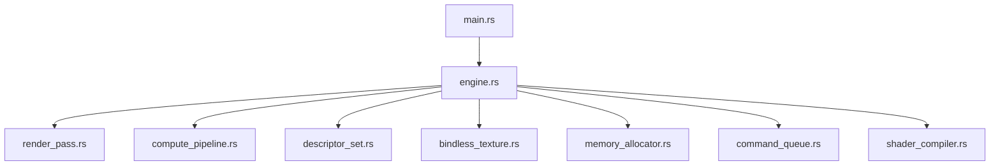
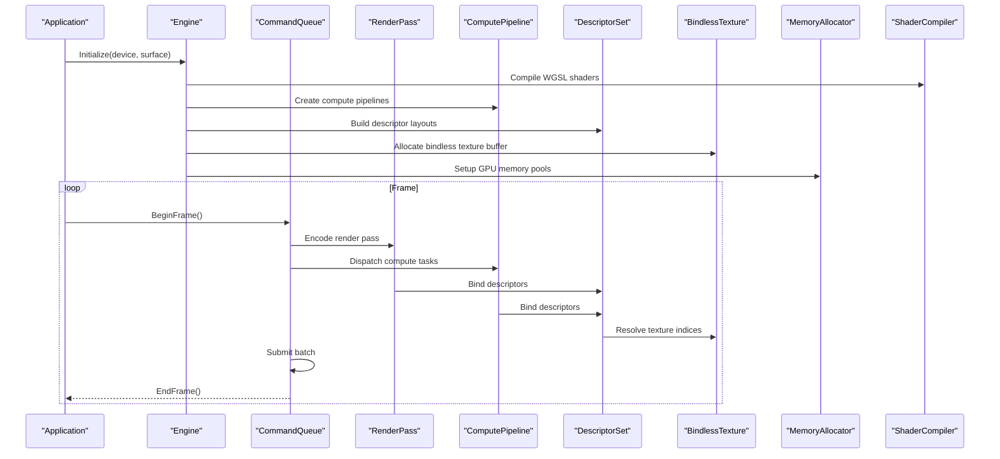
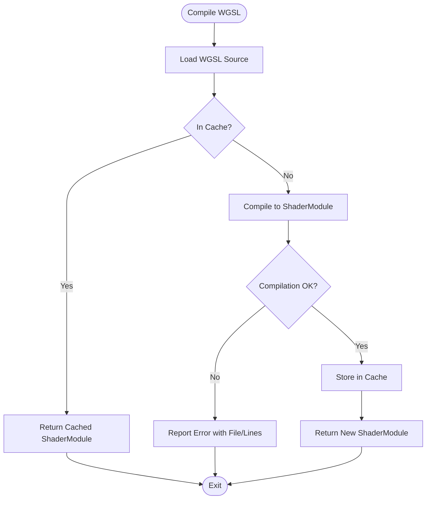
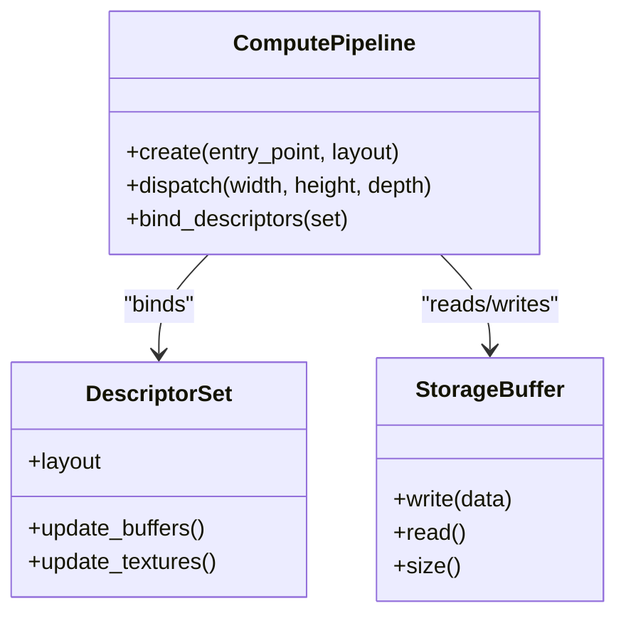
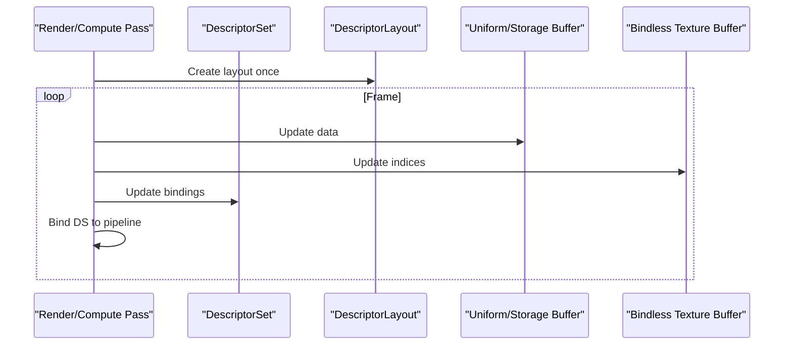
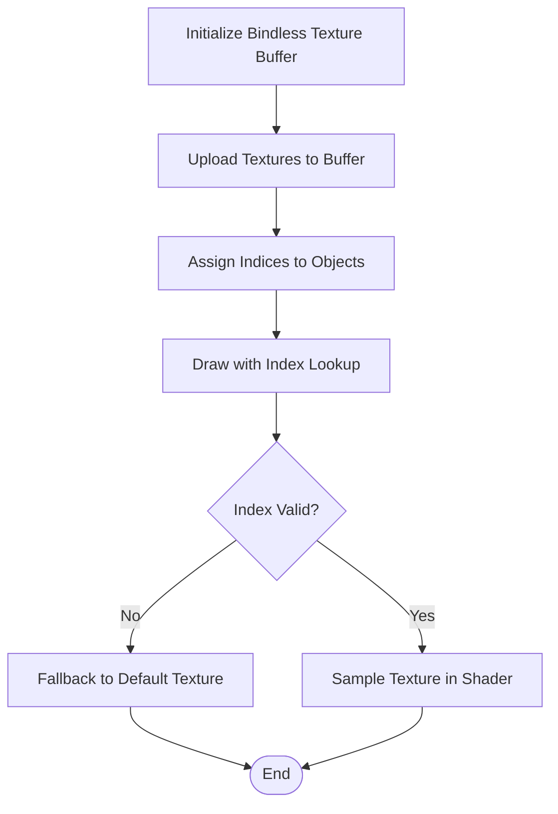
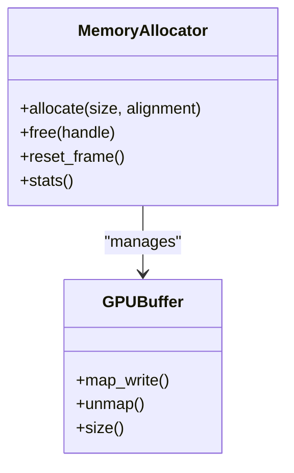
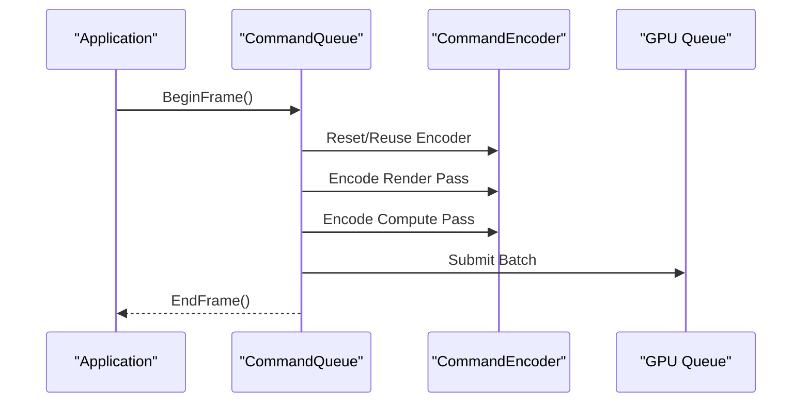
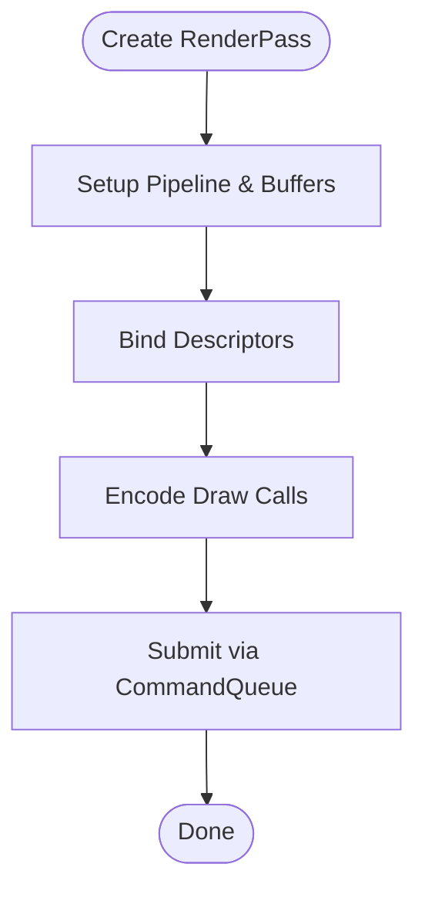
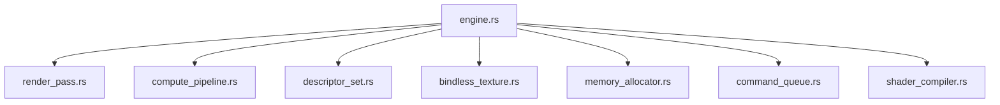

# Rust Rendering Pipeline

<cite>
**Referenced Files in This Document**
- [WgpuRenderer/Cargo.toml](file://engine/WgpuRenderer/rust/Cargo.toml)
- [WgpuRenderer/src/main.rs](file://engine/WgpuRenderer/rust/src/main.rs)
- [WgpuRenderer/src/engine.rs](file://engine/WgpuRenderer/rust/src/engine.rs)
- [WgpuRenderer/src/render_pass.rs](file://engine/WgpuRenderer/rust/src/render_pass.rs)
- [WgpuRenderer/src/compute_pipeline.rs](file://engine/WgpuRenderer/rust/src/compute_pipeline.rs)
- [WgpuRenderer/src/descriptor_set.rs](file://engine/WgpuRenderer/rust/src/descriptor_set.rs)
- [WgpuRenderer/src/bindless_texture.rs](file://engine/WgpuRenderer/rust/src/bindless_texture.rs)
- [WgpuRenderer/src/memory_allocator.rs](file://engine/WgpuRenderer/rust/src/memory_allocator.rs)
- [WgpuRenderer/src/command_queue.rs](file://engine/WgpuRenderer/rust/src/command_queue.rs)
- [WgpuRenderer/src/shader_compiler.rs](file://engine/WgpuRenderer/rust/src/shader_compiler.rs)
- [WgpuRenderer/docs/bindless-textures-plan.md](file://engine/WgpuRenderer/docs/bindless-textures-plan.md)
- [WgpuRenderer/docs/compute-skin-bake-plan.md](file://engine/WgpuRenderer/docs/compute-skin-bake-plan.md)
- [WgpuRenderer/docs/forward-plus-plan.md](file://engine/WgpuRenderer/docs/forward-plus-plan.md)
- [WgpuRenderer/docs/gpu-culling-and-depth-plan.md](file://engine/WgpuRenderer/docs/gpu-culling-and-depth-plan.md)
- [WgpuRenderer/docs/hdr-pipeline-plan.md](file://engine/WgpuRenderer/docs/hdr-pipeline-plan.md)
</cite>

## Table of Contents
1. [Introduction](#introduction)
2. [Project Structure](#project-structure)
3. [Core Components](#core-components)
4. [Architecture Overview](#architecture-overview)
5. [Detailed Component Analysis](#detailed-component-analysis)
6. [Dependency Analysis](#dependency-analysis)
7. [Performance Considerations](#performance-considerations)
8. [Troubleshooting Guide](#troubleshooting-guide)
9. [Conclusion](#conclusion)
10. [Appendices](#appendices)

## Introduction
This document explains the Rust-based rendering pipeline implemented with wgpu, focusing on WGSL shader compilation, compute shaders for GPU-driven rendering, descriptor set management, bindless textures, memory allocation strategies, and command queue optimization. It also provides guidance for implementing custom render passes, handling GPU buffers, managing shader resources, debugging techniques, and performance profiling methods.

## Project Structure
The Rust rendering subsystem lives under engine/WgpuRenderer/rust. The project is organized into modules that encapsulate core rendering responsibilities:
- Engine lifecycle and device/context setup
- Render pass abstraction and execution
- Compute pipeline creation and dispatch
- Descriptor set layout and binding management
- Bindless texture system backed by GPU buffers
- Memory allocator for GPU allocations
- Command encoder and queue orchestration
- WGSL shader compilation and caching

**Diagram sources**
- [WgpuRenderer/src/main.rs](file://engine/WgpuRenderer/rust/src/main.rs)
- [WgpuRenderer/src/engine.rs](file://engine/WgpuRenderer/rust/src/engine.rs)
- [WgpuRenderer/src/render_pass.rs](file://engine/WgpuRenderer/rust/src/render_pass.rs)
- [WgpuRenderer/src/compute_pipeline.rs](file://engine/WgpuRenderer/rust/src/compute_pipeline.rs)
- [WgpuRenderer/src/descriptor_set.rs](file://engine/WgpuRenderer/rust/src/descriptor_set.rs)
- [WgpuRenderer/src/bindless_texture.rs](file://engine/WgpuRenderer/rust/src/bindless_texture.rs)
- [WgpuRenderer/src/memory_allocator.rs](file://engine/WgpuRenderer/rust/src/memory_allocator.rs)
- [WgpuRenderer/src/command_queue.rs](file://engine/WgpuRenderer/rust/src/command_queue.rs)
- [WgpuRenderer/src/shader_compiler.rs](file://engine/WgpuRenderer/rust/src/shader_compiler.rs)

**Section sources**
- [WgpuRenderer/Cargo.toml](file://engine/WgpuRenderer/rust/Cargo.toml)
- [WgpuRenderer/src/main.rs](file://engine/WgpuRenderer/rust/src/main.rs)
- [WgpuRenderer/src/engine.rs](file://engine/WgpuRenderer/rust/src/engine.rs)

## Core Components
- WGSL Shader Compiler: Compiles WGSL source to wgpu::ShaderModule, caches compiled artifacts, and reports errors with file and line information.
- Compute Pipeline: Creates wgpu::ComputePipeline from WGSL entry points, binds descriptors, and issues dispatch commands.
- Descriptor Set Manager: Builds layouts for uniform buffers, storage buffers, and sampled textures; handles updates per frame or per-pass.
- Bindless Texture System: Uses a large GPU buffer (texture array or indirect indexing) to allow dynamic texture selection without re-binding pipelines.
- Memory Allocator: Manages GPU memory regions, alignment, and lifetimes; supports pooled allocations and reuse across frames.
- Command Queue Orchestrator: Encodes render and compute passes, batches work, and submits to the GPU queue efficiently.

**Section sources**
- [WgpuRenderer/src/shader_compiler.rs](file://engine/WgpuRenderer/rust/src/shader_compiler.rs)
- [WgpuRenderer/src/compute_pipeline.rs](file://engine/WgpuRenderer/rust/src/compute_pipeline.rs)
- [WgpuRenderer/src/descriptor_set.rs](file://engine/WgpuRenderer/rust/src/descriptor_set.rs)
- [WgpuRenderer/src/bindless_texture.rs](file://engine/WgpuRenderer/rust/src/bindless_texture.rs)
- [WgpuRenderer/src/memory_allocator.rs](file://engine/WgpuRenderer/rust/src/memory_allocator.rs)
- [WgpuRenderer/src/command_queue.rs](file://engine/WgpuRenderer/rust/src/command_queue.rs)

## Architecture Overview
The rendering pipeline integrates CPU-side orchestration with GPU-side execution:
- The engine initializes the wgpu device and adapter, sets up swapchain, and creates resource managers.
- Each frame, the command queue orchestrates encoding of render and compute passes.
- Render passes use descriptor sets bound to pipelines; bindless textures are accessed via indices stored in buffers.
- Compute shaders perform tasks like culling, skin baking, and post-processing.

**Diagram sources**
- [WgpuRenderer/src/engine.rs](file://engine/WgpuRenderer/rust/src/engine.rs)
- [WgpuRenderer/src/command_queue.rs](file://engine/WgpuRenderer/rust/src/command_queue.rs)
- [WgpuRenderer/src/render_pass.rs](file://engine/WgpuRenderer/rust/src/render_pass.rs)
- [WgpuRenderer/src/compute_pipeline.rs](file://engine/WgpuRenderer/rust/src/compute_pipeline.rs)
- [WgpuRenderer/src/descriptor_set.rs](file://engine/WgpuRenderer/rust/src/descriptor_set.rs)
- [WgpuRenderer/src/bindless_texture.rs](file://engine/WgpuRenderer/rust/src/bindless_texture.rs)
- [WgpuRenderer/src/memory_allocator.rs](file://engine/WgpuRenderer/rust/src/memory_allocator.rs)
- [WgpuRenderer/src/shader_compiler.rs](file://engine/WgpuRenderer/rust/src/shader_compiler.rs)

## Detailed Component Analysis

### WGSL Shader Compilation Process
- Loads WGSL source files, compiles them into wgpu::ShaderModule, and caches results to avoid repeated compilation.
- Provides error reporting with file paths and line numbers for easier debugging.
- Supports feature flags and preprocessor-like substitutions if needed by the pipeline.

**Diagram sources**
- [WgpuRenderer/src/shader_compiler.rs](file://engine/WgpuRenderer/rust/src/shader_compiler.rs)

**Section sources**
- [WgpuRenderer/src/shader_compiler.rs](file://engine/WgpuRenderer/rust/src/shader_compiler.rs)

### Compute Shader Usage for GPU-Driven Rendering
- Compute pipelines are created from WGSL entry points and bound with descriptor sets.
- Dispatch commands are encoded within compute passes; results are written to storage buffers.
- Typical uses include culling, skin baking, and post-processing effects.

**Diagram sources**
- [WgpuRenderer/src/compute_pipeline.rs](file://engine/WgpuRenderer/rust/src/compute_pipeline.rs)
- [WgpuRenderer/src/descriptor_set.rs](file://engine/WgpuRenderer/rust/src/descriptor_set.rs)

**Section sources**
- [WgpuRenderer/src/compute_pipeline.rs](file://engine/WgpuRenderer/rust/src/compute_pipeline.rs)
- [WgpuRenderer/docs/compute-skin-bake-plan.md](file://engine/WgpuRenderer/docs/compute-skin-bake-plan.md)

### Descriptor Set Management
- Descriptor layouts define bindings for uniforms, storage buffers, and textures.
- Per-frame updates modify buffer contents and texture indices without reallocating layouts.
- Bindless textures are resolved through indices stored in uniform or storage buffers.

**Diagram sources**
- [WgpuRenderer/src/descriptor_set.rs](file://engine/WgpuRenderer/rust/src/descriptor_set.rs)
- [WgpuRenderer/src/bindless_texture.rs](file://engine/WgpuRenderer/rust/src/bindless_texture.rs)

**Section sources**
- [WgpuRenderer/src/descriptor_set.rs](file://engine/WgpuRenderer/rust/src/descriptor_set.rs)

### Bindless Texture System
- Textures are uploaded to a large GPU buffer or texture array; each draw/dispatch resolves a texture index.
- Reduces state changes and pipeline switches by avoiding per-object texture bindings.
- Requires careful memory management and index validation.

**Diagram sources**
- [WgpuRenderer/src/bindless_texture.rs](file://engine/WgpuRenderer/rust/src/bindless_texture.rs)
- [WgpuRenderer/docs/bindless-textures-plan.md](file://engine/WgpuRenderer/docs/bindless-textures-plan.md)

**Section sources**
- [WgpuRenderer/src/bindless_texture.rs](file://engine/WgpuRenderer/rust/src/bindless_texture.rs)
- [WgpuRenderer/docs/bindless-textures-plan.md](file://engine/WgpuRenderer/docs/bindless-textures-plan.md)

### Memory Allocation Strategies
- GPU memory is managed via a pool allocator with aligned blocks and lifetime tracking.
- Supports transient allocations for per-frame data and persistent allocations for static assets.
- Minimizes fragmentation and reduces synchronization overhead.

**Diagram sources**
- [WgpuRenderer/src/memory_allocator.rs](file://engine/WgpuRenderer/rust/src/memory_allocator.rs)

**Section sources**
- [WgpuRenderer/src/memory_allocator.rs](file://engine/WgpuRenderer/rust/src/memory_allocator.rs)

### Command Queue Optimization
- Batches render and compute encodings into minimal submissions.
- Reuses command encoders where possible and avoids unnecessary flushes.
- Coordinates resource lifetimes to prevent stalls.

**Diagram sources**
- [WgpuRenderer/src/command_queue.rs](file://engine/WgpuRenderer/rust/src/command_queue.rs)

**Section sources**
- [WgpuRenderer/src/command_queue.rs](file://engine/WgpuRenderer/rust/src/command_queue.rs)

### Implementing Custom Render Passes
- Define a render pass struct with pipeline, vertex/index buffers, and descriptor sets.
- Encode draw calls within the pass, updating descriptors as needed.
- Integrate with the command queue for submission.

**Diagram sources**
- [WgpuRenderer/src/render_pass.rs](file://engine/WgpuRenderer/rust/src/render_pass.rs)
- [WgpuRenderer/src/command_queue.rs](file://engine/WgpuRenderer/rust/src/command_queue.rs)

**Section sources**
- [WgpuRenderer/src/render_pass.rs](file://engine/WgpuRenderer/rust/src/render_pass.rs)

### Handling GPU Buffers
- Use typed buffers for uniform and storage data; ensure proper alignment and size.
- Map/unmap for CPU access when necessary; prefer write-through patterns for performance.
- Manage lifetimes carefully to avoid use-after-free scenarios.

**Section sources**
- [WgpuRenderer/src/memory_allocator.rs](file://engine/WgpuRenderer/rust/src/memory_allocator.rs)
- [WgpuRenderer/src/descriptor_set.rs](file://engine/WgpuRenderer/rust/src/descriptor_set.rs)

### Managing Shader Resources
- Organize WGSL files by feature (e.g., lighting, shadows).
- Use consistent naming conventions for entry points and bindings.
- Validate shader inputs/outputs against descriptor layouts.

**Section sources**
- [WgpuRenderer/src/shader_compiler.rs](file://engine/WgpuRenderer/rust/src/shader_compiler.rs)
- [WgpuRenderer/docs/forward-plus-plan.md](file://engine/WgpuRenderer/docs/forward-plus-plan.md)

## Dependency Analysis
The Rust rendering components have clear dependencies:
- Engine depends on all subsystems for initialization and frame orchestration.
- Render and compute passes depend on descriptor sets and pipelines.
- Bindless textures rely on memory allocation and descriptor updates.
- Command queue coordinates all encodings and submissions.

**Diagram sources**
- [WgpuRenderer/src/engine.rs](file://engine/WgpuRenderer/rust/src/engine.rs)
- [WgpuRenderer/src/render_pass.rs](file://engine/WgpuRenderer/rust/src/render_pass.rs)
- [WgpuRenderer/src/compute_pipeline.rs](file://engine/WgpuRenderer/rust/src/compute_pipeline.rs)
- [WgpuRenderer/src/descriptor_set.rs](file://engine/WgpuRenderer/rust/src/descriptor_set.rs)
- [WgpuRenderer/src/bindless_texture.rs](file://engine/WgpuRenderer/rust/src/bindless_texture.rs)
- [WgpuRenderer/src/memory_allocator.rs](file://engine/WgpuRenderer/rust/src/memory_allocator.rs)
- [WgpuRenderer/src/command_queue.rs](file://engine/WgpuRenderer/rust/src/command_queue.rs)
- [WgpuRenderer/src/shader_compiler.rs](file://engine/WgpuRenderer/rust/src/shader_compiler.rs)

**Section sources**
- [WgpuRenderer/src/engine.rs](file://engine/WgpuRenderer/rust/src/engine.rs)

## Performance Considerations
- Minimize descriptor updates by batching changes and using bindless techniques.
- Reduce command encoder resets; reuse encoders across similar passes.
- Align GPU allocations to avoid padding overhead and improve bandwidth.
- Profile GPU usage with tools like RenderDoc or wgpu’s built-in profiling features.
- Avoid frequent map/unmap operations; prefer staging buffers and async copies.

[No sources needed since this section provides general guidance]

## Troubleshooting Guide
- Shader compilation errors: Check WGSL syntax, binding indices, and feature compatibility.
- Descriptor mismatches: Ensure layouts match pipeline expectations and update frequencies.
- Memory leaks: Verify allocator reset per frame and proper deallocation of persistent resources.
- Stalls and sync issues: Review command submission order and resource lifetimes.
- Debugging techniques: Use wgpu debug messages, RenderDoc captures, and logging around critical paths.

**Section sources**
- [WgpuRenderer/src/shader_compiler.rs](file://engine/WgpuRenderer/rust/src/shader_compiler.rs)
- [WgpuRenderer/src/memory_allocator.rs](file://engine/WgpuRenderer/rust/src/memory_allocator.rs)
- [WgpuRenderer/src/command_queue.rs](file://engine/WgpuRenderer/rust/src/command_queue.rs)

## Conclusion
The Rust-based rendering pipeline leverages wgpu to provide a flexible and efficient graphics backend. By separating concerns into focused modules—WGSL compilation, compute pipelines, descriptor management, bindless textures, memory allocation, and command orchestration—the system achieves high performance and maintainability. Following the guidelines for custom render passes, buffer handling, and resource management ensures robust and scalable rendering solutions.

[No sources needed since this section summarizes without analyzing specific files]

## Appendices
- Additional plans and design documents:
  - Forward Plus rendering approach
  - HDR pipeline considerations
  - GPU culling and depth optimization
  - Water and terrain rendering strategies

**Section sources**
- [WgpuRenderer/docs/forward-plus-plan.md](file://engine/WgpuRenderer/docs/forward-plus-plan.md)
- [WgpuRenderer/docs/hdr-pipeline-plan.md](file://engine/WgpuRenderer/docs/hdr-pipeline-plan.md)
- [WgpuRenderer/docs/gpu-culling-and-depth-plan.md](file://engine/WgpuRenderer/docs/gpu-culling-and-depth-plan.md)