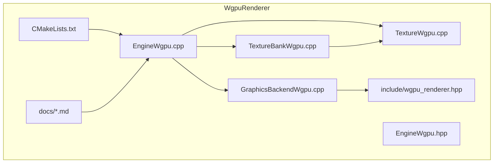
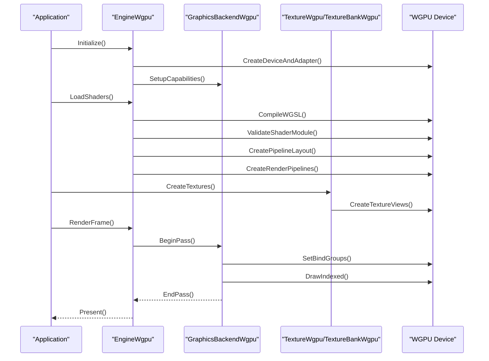
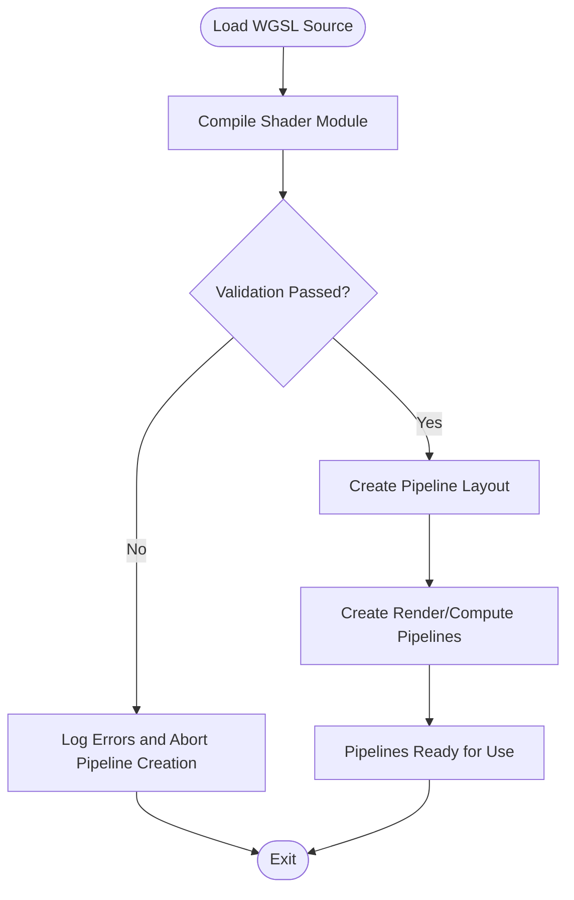
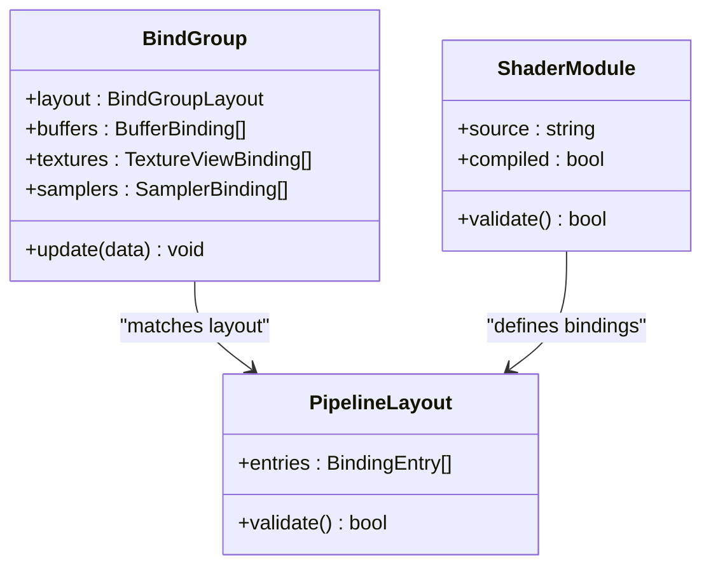
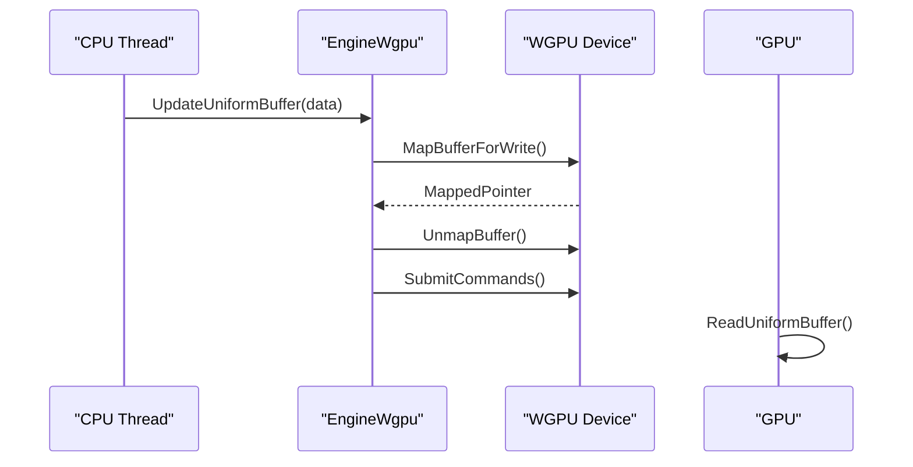
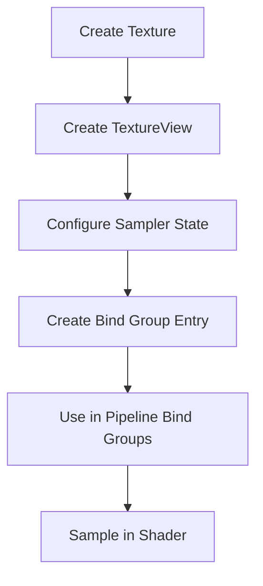
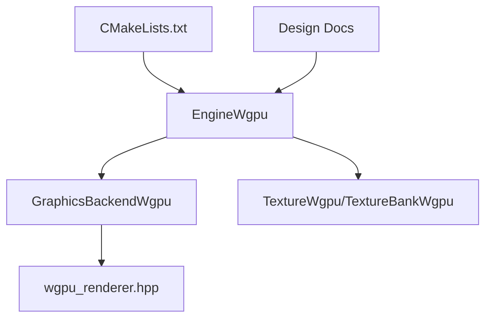

# Shader System & WGSL

<cite>
**Referenced Files in This Document**
- [EngineWgpu.cpp](file://engine/WgpuRenderer/EngineWgpu.cpp)
- [EngineWgpu.hpp](file://engine/WgpuRenderer/EngineWgpu.hpp)
- [GraphicsBackendWgpu.cpp](file://engine/WgpuRenderer/GraphicsBackendWgpu.cpp)
- [TextureBankWgpu.cpp](file://engine/WgpuRenderer/TextureBankWgpu.cpp)
- [TextureWgpu.cpp](file://engine/WgpuRenderer/TextureWgpu.cpp)
- [wgpu_renderer.hpp](file://engine/WgpuRenderer/include/wgpu_renderer.hpp)
- [CMakeLists.txt](file://engine/WgpuRenderer/CMakeLists.txt)
- [bindless-textures-plan.md](file://engine/WgpuRenderer/docs/bindless-textures-plan.md)
- [rendering-performance-plan.md](file://engine/WgpuRenderer/docs/rendering-performance-plan.md)
- [hdr-pipeline-plan.md](file://engine/WgpuRenderer/docs/hdr-pipeline-plan.md)
</cite>

## Table of Contents
1. [Introduction](#introduction)
2. [Project Structure](#project-structure)
3. [Core Components](#core-components)
4. [Architecture Overview](#architecture-overview)
5. [Detailed Component Analysis](#detailed-component-analysis)
6. [Dependency Analysis](#dependency-analysis)
7. [Performance Considerations](#performance-considerations)
8. [Troubleshooting Guide](#troubleshooting-guide)
9. [Conclusion](#conclusion)
10. [Appendices](#appendices)

## Introduction
This document explains the WGSL shader system used by the WGPU-based renderer. It covers how shaders are compiled and validated, how they are loaded at runtime, how parameters are bound to pipelines, how uniform buffers are managed, and how textures are sampled efficiently. It also provides guidance for writing efficient shaders, optimizing across GPU architectures, implementing common rendering effects, debugging, profiling, and ensuring cross-platform compatibility.

## Project Structure
The WGSL-related implementation is primarily located under the WgpuRenderer module. Key areas include:
- Engine integration and lifecycle management for the WGPU device and pipeline creation
- Graphics backend abstraction that wires engine features to WGPU
- Texture handling and binding strategies
- Build configuration for shader assets and dependencies
- Design documents outlining performance and advanced rendering plans

**Diagram sources**
- [EngineWgpu.cpp](file://engine/WgpuRenderer/EngineWgpu.cpp)
- [EngineWgpu.hpp](file://engine/WgpuRenderer/EngineWgpu.hpp)
- [GraphicsBackendWgpu.cpp](file://engine/WgpuRenderer/GraphicsBackendWgpu.cpp)
- [TextureBankWgpu.cpp](file://engine/WgpuRenderer/TextureBankWgpu.cpp)
- [TextureWgpu.cpp](file://engine/WgpuRenderer/TextureWgpu.cpp)
- [wgpu_renderer.hpp](file://engine/WgpuRenderer/include/wgpu_renderer.hpp)
- [CMakeLists.txt](file://engine/WgpuRenderer/CMakeLists.txt)
- [bindless-textures-plan.md](file://engine/WgpuRenderer/docs/bindless-textures-plan.md)
- [rendering-performance-plan.md](file://engine/WgpuRenderer/docs/rendering-performance-plan.md)
- [hdr-pipeline-plan.md](file://engine/WgpuRenderer/docs/hdr-pipeline-plan.md)

**Section sources**
- [EngineWgpu.cpp](file://engine/WgpuRenderer/EngineWgpu.cpp)
- [EngineWgpu.hpp](file://engine/WgpuRenderer/EngineWgpu.hpp)
- [GraphicsBackendWgpu.cpp](file://engine/WgpuRenderer/GraphicsBackendWgpu.cpp)
- [TextureBankWgpu.cpp](file://engine/WgpuRenderer/TextureBankWgpu.cpp)
- [TextureWgpu.cpp](file://engine/WgpuRenderer/TextureWgpu.cpp)
- [wgpu_renderer.hpp](file://engine/WgpuRenderer/include/wgpu_renderer.hpp)
- [CMakeLists.txt](file://engine/WgpuRenderer/CMakeLists.txt)
- [bindless-textures-plan.md](file://engine/WgpuRenderer/docs/bindless-textures-plan.md)
- [rendering-performance-plan.md](file://engine/WgpuRenderer/docs/rendering-performance-plan.md)
- [hdr-pipeline-plan.md](file://engine/WgpuRenderer/docs/hdr-pipeline-plan.md)

## Core Components
- EngineWgpu: Initializes WGPU, manages device/lifecycle, and coordinates shader pipeline creation and updates.
- GraphicsBackendWgpu: Implements the graphics backend interface, exposing capabilities and dispatching render commands to WGPU.
- TextureWgpu / TextureBankWgpu: Encapsulate texture objects, formats, sampling states, and bind group management.
- wgpu_renderer.hpp: Public API surface for the WGPU renderer, including types and interfaces used by the engine.
- CMakeLists.txt: Builds WGPU components and integrates shader resources into the final application.

Key responsibilities:
- Compile and validate WGSL shaders during asset loading or initialization
- Create WGPU pipeline layouts and bind groups for uniforms, textures, and samplers
- Manage uniform buffer lifetimes and updates per frame or per draw call
- Provide efficient texture sampling paths with appropriate sampler states and format conversions

**Section sources**
- [EngineWgpu.cpp](file://engine/WgpuRenderer/EngineWgpu.cpp)
- [EngineWgpu.hpp](file://engine/WgpuRenderer/EngineWgpu.hpp)
- [GraphicsBackendWgpu.cpp](file://engine/WgpuRenderer/GraphicsBackendWgpu.cpp)
- [TextureWgpu.cpp](file://engine/WgpuRenderer/TextureWgpu.cpp)
- [TextureBankWgpu.cpp](file://engine/WgpuRenderer/TextureBankWgpu.cpp)
- [wgpu_renderer.hpp](file://engine/WgpuRenderer/include/wgpu_renderer.hpp)
- [CMakeLists.txt](file://engine/WgpuRenderer/CMakeLists.txt)

## Architecture Overview
The WGPU renderer uses a layered architecture:
- The engine calls into GraphicsBackendWgpu to create and update render state
- EngineWgpu orchestrates device setup, resource creation, and pipeline compilation
- TextureWgpu and TextureBankWgpu manage texture resources and bind groups
- WGSL shaders are compiled and validated before pipeline creation

**Diagram sources**
- [EngineWgpu.cpp](file://engine/WgpuRenderer/EngineWgpu.cpp)
- [GraphicsBackendWgpu.cpp](file://engine/WgpuRenderer/GraphicsBackendWgpu.cpp)
- [TextureWgpu.cpp](file://engine/WgpuRenderer/TextureWgpu.cpp)
- [TextureBankWgpu.cpp](file://engine/WgpuRenderer/TextureBankWgpu.cpp)

## Detailed Component Analysis

### Shader Compilation and Validation
- Shaders are provided as WGSL source modules and compiled via WGPU’s shader module APIs.
- Validation ensures correctness and feature compatibility before pipeline creation.
- Pipeline layouts define bindings for uniforms, textures, and samplers.

**Diagram sources**
- [EngineWgpu.cpp](file://engine/WgpuRenderer/EngineWgpu.cpp)
- [GraphicsBackendWgpu.cpp](file://engine/WgpuRenderer/GraphicsBackendWgpu.cpp)

**Section sources**
- [EngineWgpu.cpp](file://engine/WgpuRenderer/EngineWgpu.cpp)
- [GraphicsBackendWgpu.cpp](file://engine/WgpuRenderer/GraphicsBackendWgpu.cpp)

### Parameter Binding System
- Uniforms are bound through WGPU bind groups using buffer bindings.
- Textures and samplers are bound via texture view and sampler bindings.
- Bind group layouts must match the shader’s layout declarations.

**Diagram sources**
- [EngineWgpu.cpp](file://engine/WgpuRenderer/EngineWgpu.cpp)
- [wgpu_renderer.hpp](file://engine/WgpuRenderer/include/wgpu_renderer.hpp)

**Section sources**
- [EngineWgpu.cpp](file://engine/WgpuRenderer/EngineWgpu.cpp)
- [wgpu_renderer.hpp](file://engine/WgpuRenderer/include/wgpu_renderer.hpp)

### Uniform Buffer Management
- Uniform buffers store per-frame or per-object data (matrices, lighting params).
- Buffers are updated frequently; efficient patterns include staging buffers and ring buffers.
- Lifetime management ensures buffers are not freed while referenced by pipelines.

**Diagram sources**
- [EngineWgpu.cpp](file://engine/WgpuRenderer/EngineWgpu.cpp)
- [GraphicsBackendWgpu.cpp](file://engine/WgpuRenderer/GraphicsBackendWgpu.cpp)

**Section sources**
- [EngineWgpu.cpp](file://engine/WgpuRenderer/EngineWgpu.cpp)
- [GraphicsBackendWgpu.cpp](file://engine/WgpuRenderer/GraphicsBackendWgpu.cpp)

### Texture Sampling Techniques
- Texture views and sampler states control filtering, addressing modes, and mip usage.
- Efficient sampling involves choosing appropriate formats, avoiding unnecessary copies, and leveraging bindless techniques when available.
- TextureBankWgpu centralizes texture resources and bind group creation.

**Diagram sources**
- [TextureWgpu.cpp](file://engine/WgpuRenderer/TextureWgpu.cpp)
- [TextureBankWgpu.cpp](file://engine/WgpuRenderer/TextureBankWgpu.cpp)

**Section sources**
- [TextureWgpu.cpp](file://engine/WgpuRenderer/TextureWgpu.cpp)
- [TextureBankWgpu.cpp](file://engine/WgpuRenderer/TextureBankWgpu.cpp)

### Rendering Effects and Pipelines
- Common effects (forward shading, HDR, shadow mapping) are implemented as separate pipelines or render passes.
- Pipeline variants can be created for different material configurations or feature sets.
- Performance plans outline optimization strategies for specific effects.

**Diagram sources**
- [hdr-pipeline-plan.md](file://engine/WgpuRenderer/docs/hdr-pipeline-plan.md)
- [rendering-performance-plan.md](file://engine/WgpuRenderer/docs/rendering-performance-plan.md)

**Section sources**
- [hdr-pipeline-plan.md](file://engine/WgpuRenderer/docs/hdr-pipeline-plan.md)
- [rendering-performance-plan.md](file://engine/WgpuRenderer/docs/rendering-performance-plan.md)

## Dependency Analysis
The WgpuRenderer module depends on:
- WGPU library for low-level GPU operations
- Engine core for lifecycle and resource management
- Build system (CMake) for integrating shader assets and dependencies

**Diagram sources**
- [EngineWgpu.cpp](file://engine/WgpuRenderer/EngineWgpu.cpp)
- [GraphicsBackendWgpu.cpp](file://engine/WgpuRenderer/GraphicsBackendWgpu.cpp)
- [TextureWgpu.cpp](file://engine/WgpuRenderer/TextureWgpu.cpp)
- [TextureBankWgpu.cpp](file://engine/WgpuRenderer/TextureBankWgpu.cpp)
- [wgpu_renderer.hpp](file://engine/WgpuRenderer/include/wgpu_renderer.hpp)
- [CMakeLists.txt](file://engine/WgpuRenderer/CMakeLists.txt)

**Section sources**
- [EngineWgpu.cpp](file://engine/WgpuRenderer/EngineWgpu.cpp)
- [GraphicsBackendWgpu.cpp](file://engine/WgpuRenderer/GraphicsBackendWgpu.cpp)
- [TextureWgpu.cpp](file://engine/WgpuRenderer/TextureWgpu.cpp)
- [TextureBankWgpu.cpp](file://engine/WgpuRenderer/TextureBankWgpu.cpp)
- [wgpu_renderer.hpp](file://engine/WgpuRenderer/include/wgpu_renderer.hpp)
- [CMakeLists.txt](file://engine/WgpuRenderer/CMakeLists.txt)

## Performance Considerations
- Minimize pipeline state changes by batching draws and reusing bind groups.
- Use efficient buffer update strategies (staging buffers, ring buffers) to reduce CPU-GPU synchronization.
- Choose optimal texture formats and avoid unnecessary conversions.
- Leverage bindless textures where supported to reduce bind group overhead.
- Profile with GPU profilers (RenderDoc, WGPU validation layers) to identify bottlenecks.

[No sources needed since this section provides general guidance]

## Troubleshooting Guide
Common issues and resolutions:
- Shader compilation errors: Check WGSL syntax and feature compatibility; enable validation layers for detailed diagnostics.
- Bind group mismatches: Ensure bind group layouts match shader declarations and update order.
- Texture sampling artifacts: Verify sampler states, texture formats, and mip levels.
- Performance regressions: Use profiling tools to identify overdraw, excessive state changes, or inefficient buffer updates.

Debugging tips:
- Enable WGPU validation layers to catch API misuse early.
- Use RenderDoc to capture frames and inspect shader inputs/outputs.
- Log pipeline creation steps and error messages for failed validations.

**Section sources**
- [EngineWgpu.cpp](file://engine/WgpuRenderer/EngineWgpu.cpp)
- [GraphicsBackendWgpu.cpp](file://engine/WgpuRenderer/GraphicsBackendWgpu.cpp)

## Conclusion
The WGPU-based shader system provides a robust foundation for modern rendering with WGSL. By understanding compilation, validation, parameter binding, uniform buffer management, and texture sampling, developers can write efficient shaders and optimize for various GPU architectures. Following the outlined practices and utilizing debugging tools will help achieve stable, high-performance rendering across platforms.

[No sources needed since this section summarizes without analyzing specific files]

## Appendices

### Cross-Platform Compatibility
- Ensure WGSL features are compatible across target GPUs (desktop, mobile, integrated).
- Test shader behavior on different drivers and hardware vendors.
- Use conditional compilation or fallbacks for unsupported features.

[No sources needed since this section provides general guidance]

### Writing Efficient Shaders
- Minimize branching and complex math in vertex/fragment shaders.
- Use appropriate data types (e.g., half precision where possible).
- Avoid redundant computations by leveraging precomputed values.

[No sources needed since this section provides general guidance]

### Implementing Common Rendering Effects
- Forward shading: Use per-light loops or clustered lighting for scalability.
- HDR pipelines: Apply tone mapping and bloom post-processing.
- Shadow mapping: Optimize cascade splits and bias settings.

[No sources needed since this section provides general guidance]