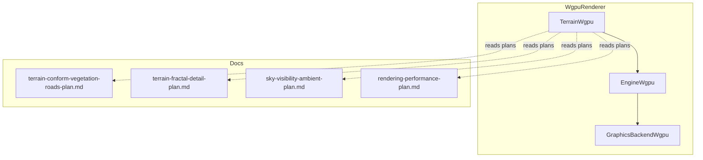
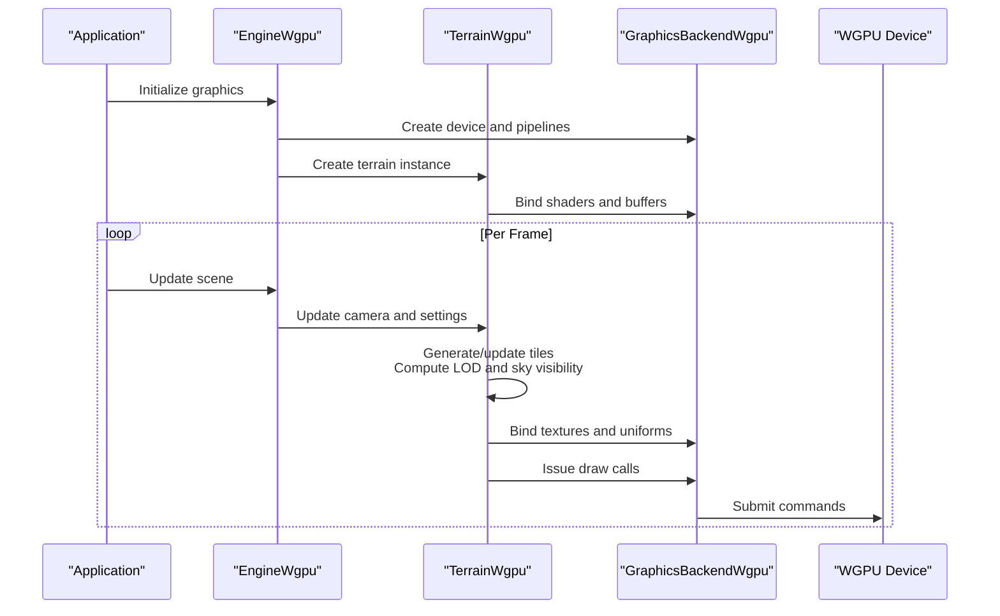
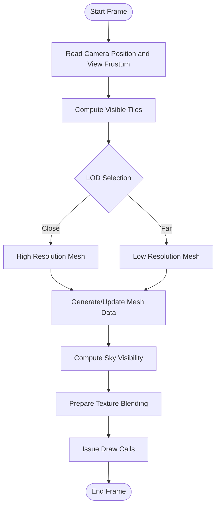
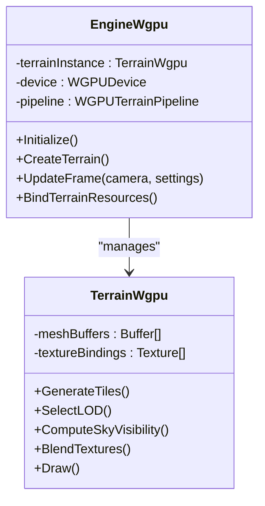
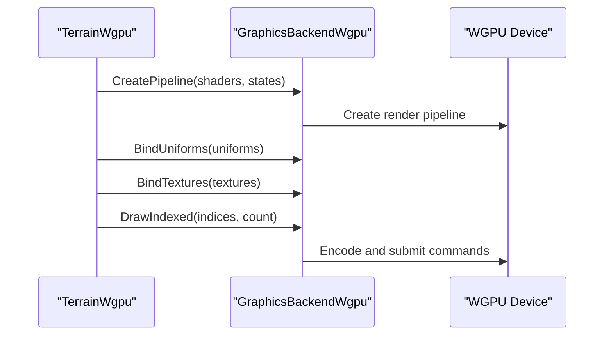
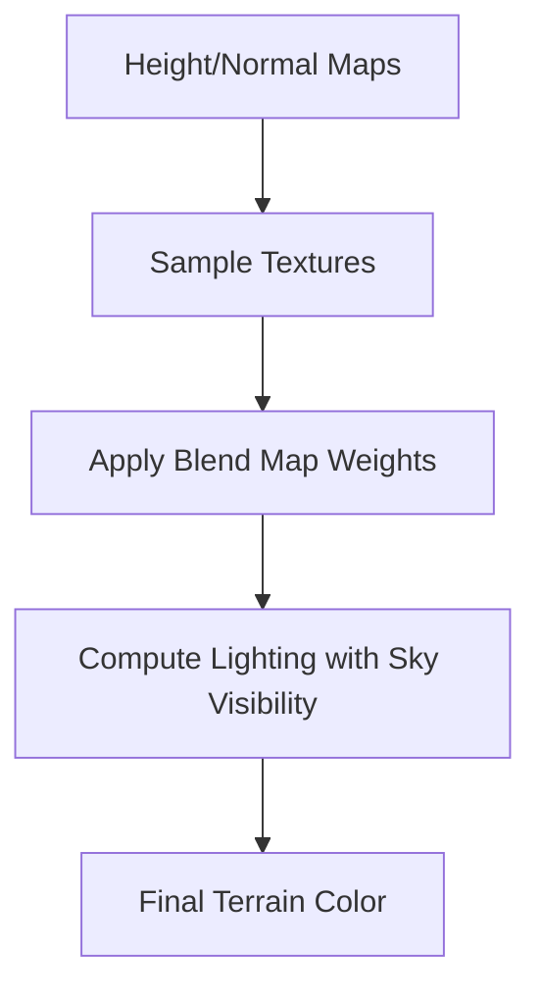
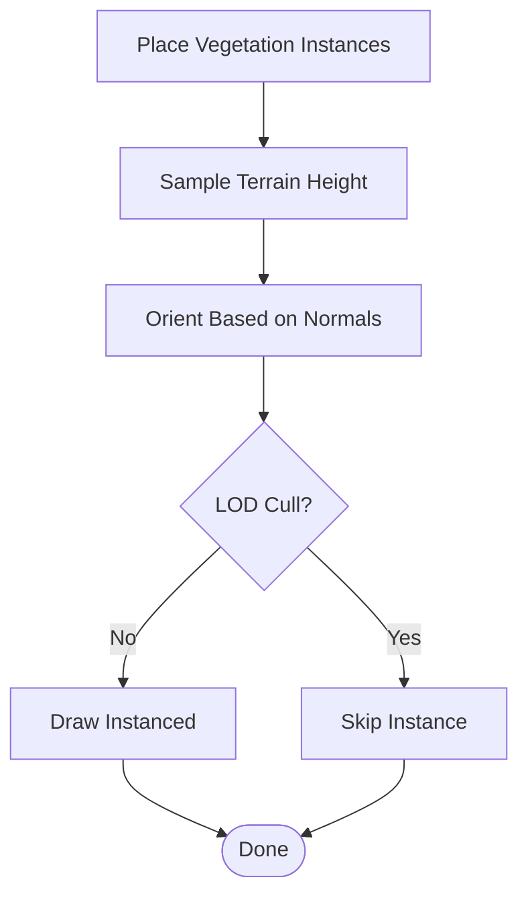
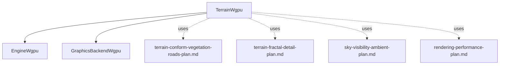

# Terrain Rendering

<cite>
**Referenced Files in This Document**
- [TerrainWgpu.hpp](file://engine/WgpuRenderer/TerrainWgpu.hpp)
- [TerrainWgpu.cpp](file://engine/WgpuRenderer/TerrainWgpu.cpp)
- [EngineWgpu.hpp](file://engine/WgpuRenderer/EngineWgpu.hpp)
- [EngineWgpu.cpp](file://engine/WgpuRenderer/EngineWgpu.cpp)
- [GraphicsBackendWgpu.cpp](file://engine/WgpuRenderer/GraphicsBackendWgpu.cpp)
- [terrain-conform-vegetation-roads-plan.md](file://engine/WgpuRenderer/docs/terrain-conform-vegetation-roads-plan.md)
- [terrain-fractal-detail-plan.md](file://engine/WgpuRenderer/docs/terrain-fractal-detail-plan.md)
- [sky-visibility-ambient-plan.md](file://engine/WgpuRenderer/docs/sky-visibility-ambient-plan.md)
- [rendering-performance-plan.md](file://engine/WgpuRenderer/docs/rendering-performance-plan.md)
</cite>

## Table of Contents
1. [Introduction](#introduction)
2. [Project Structure](#project-structure)
3. [Core Components](#core-components)
4. [Architecture Overview](#architecture-overview)
5. [Detailed Component Analysis](#detailed-component-analysis)
6. [Dependency Analysis](#dependency-analysis)
7. [Performance Considerations](#performance-considerations)
8. [Troubleshooting Guide](#troubleshooting-guide)
9. [Conclusion](#conclusion)
10. [Appendices](#appendices)

## Introduction
This document explains the WGPU terrain rendering system, focusing on terrain mesh generation, sky visibility calculations, and level-of-detail (LOD) management. It also covers the terrain shading pipeline, texture blending, vegetation rendering, configuration options, draw call optimization, large-terrain handling, streaming, memory management, and performance tuning across different hardware configurations.

## Project Structure
The terrain subsystem is implemented under the WGPU renderer module and integrates with the engine’s graphics backend and world systems. Key files include:
- TerrainWgpu interface and implementation for terrain rendering
- EngineWgpu integration points for terrain setup and lifecycle
- GraphicsBackendWgpu for backend initialization and resource binding
- Design documents describing terrain features such as vegetation conformity, fractal detail, sky visibility, and performance strategies

**Diagram sources**
- [TerrainWgpu.hpp](file://engine/WgpuRenderer/TerrainWgpu.hpp)
- [TerrainWgpu.cpp](file://engine/WgpuRenderer/TerrainWgpu.cpp)
- [EngineWgpu.hpp](file://engine/WgpuRenderer/EngineWgpu.hpp)
- [EngineWgpu.cpp](file://engine/WgpuRenderer/EngineWgpu.cpp)
- [GraphicsBackendWgpu.cpp](file://engine/WgpuRenderer/GraphicsBackendWgpu.cpp)
- [terrain-conform-vegetation-roads-plan.md](file://engine/WgpuRenderer/docs/terrain-conform-vegetation-roads-plan.md)
- [terrain-fractal-detail-plan.md](file://engine/WgpuRenderer/docs/terrain-fractal-detail-plan.md)
- [sky-visibility-ambient-plan.md](file://engine/WgpuRenderer/docs/sky-visibility-ambient-plan.md)
- [rendering-performance-plan.md](file://engine/WgpuRenderer/docs/rendering-performance-plan.md)

**Section sources**
- [TerrainWgpu.hpp](file://engine/WgpuRenderer/TerrainWgpu.hpp)
- [TerrainWgpu.cpp](file://engine/WgpuRenderer/TerrainWgpu.cpp)
- [EngineWgpu.hpp](file://engine/WgpuRenderer/EngineWgpu.hpp)
- [EngineWgpu.cpp](file://engine/WgpuRenderer/EngineWgpu.cpp)
- [GraphicsBackendWgpu.cpp](file://engine/WgpuRenderer/GraphicsBackendWgpu.cpp)
- [terrain-conform-vegetation-roads-plan.md](file://engine/WgpuRenderer/docs/terrain-conform-vegetation-roads-plan.md)
- [terrain-fractal-detail-plan.md](file://engine/WgpuRenderer/docs/terrain-fractal-detail-plan.md)
- [sky-visibility-ambient-plan.md](file://engine/WgpuRenderer/docs/sky-visibility-ambient-plan.md)
- [rendering-performance-plan.md](file://engine/WgpuRenderer/docs/rendering-performance-plan.md)

## Core Components
- TerrainWgpu: Encapsulates terrain mesh generation, LOD selection, sky visibility computation, texture blending, and draw dispatch to the WGPU pipeline.
- EngineWgpu: Initializes and manages terrain resources, coordinates terrain updates per frame, and binds terrain data into render passes.
- GraphicsBackendWgpu: Provides low-level WGPU device, command encoder, and shader bindings used by TerrainWgpu during rendering.

Key responsibilities:
- Mesh generation: Build or update terrain tiles based on camera position and distance thresholds.
- LOD management: Select appropriate tile resolution and patch sizes to balance quality and performance.
- Sky visibility: Compute occlusion and horizon contributions to modulate ambient lighting and fog.
- Texture blending: Combine multiple texture layers using blend maps and material parameters.
- Vegetation rendering: Conform vegetation geometry to terrain height and normal fields.

**Section sources**
- [TerrainWgpu.hpp](file://engine/WgpuRenderer/TerrainWgpu.hpp)
- [TerrainWgpu.cpp](file://engine/WgpuRenderer/TerrainWgpu.cpp)
- [EngineWgpu.hpp](file://engine/WgpuRenderer/EngineWgpu.hpp)
- [EngineWgpu.cpp](file://engine/WgpuRenderer/EngineWgpu.cpp)
- [GraphicsBackendWgpu.cpp](file://engine/WgpuRenderer/GraphicsBackendWgpu.cpp)

## Architecture Overview
The terrain rendering architecture follows a layered design:
- High-level terrain controller (TerrainWgpu) orchestrates mesh updates, LOD decisions, and draw calls.
- Engine integration (EngineWgpu) handles resource lifecycle and per-frame updates.
- Backend (GraphicsBackendWgpu) abstracts WGPU device operations and shader pipelines.

**Diagram sources**
- [EngineWgpu.hpp](file://engine/WgpuRenderer/EngineWgpu.hpp)
- [EngineWgpu.cpp](file://engine/WgpuRenderer/EngineWgpu.cpp)
- [TerrainWgpu.hpp](file://engine/WgpuRenderer/TerrainWgpu.hpp)
- [TerrainWgpu.cpp](file://engine/WgpuRenderer/TerrainWgpu.cpp)
- [GraphicsBackendWgpu.cpp](file://engine/WgpuRenderer/GraphicsBackendWgpu.cpp)

## Detailed Component Analysis

### TerrainWgpu: Mesh Generation, LOD, and Sky Visibility
TerrainWgpu implements:
- Tile-based mesh generation driven by camera frustum and distance thresholds.
- LOD selection based on screen-space error metrics and hardware capabilities.
- Sky visibility calculation using heightfield sampling and horizon tests to influence ambient and fog terms.

**Diagram sources**
- [TerrainWgpu.cpp](file://engine/WgpuRenderer/TerrainWgpu.cpp)
- [TerrainWgpu.hpp](file://engine/WgpuRenderer/TerrainWgpu.hpp)

**Section sources**
- [TerrainWgpu.hpp](file://engine/WgpuRenderer/TerrainWgpu.hpp)
- [TerrainWgpu.cpp](file://engine/WgpuRenderer/TerrainWgpu.cpp)

### EngineWgpu: Integration and Lifecycle Management
EngineWgpu coordinates terrain creation, resource allocation, and per-frame updates:
- Allocates terrain buffers and shader resources.
- Updates terrain matrices, uniforms, and visibility flags each frame.
- Ensures proper synchronization between CPU-side updates and GPU submissions.

**Diagram sources**
- [EngineWgpu.hpp](file://engine/WgpuRenderer/EngineWgpu.hpp)
- [EngineWgpu.cpp](file://engine/WgpuRenderer/EngineWgpu.cpp)
- [TerrainWgpu.hpp](file://engine/WgpuRenderer/TerrainWgpu.hpp)
- [TerrainWgpu.cpp](file://engine/WgpuRenderer/TerrainWgpu.cpp)

**Section sources**
- [EngineWgpu.hpp](file://engine/WgpuRenderer/EngineWgpu.hpp)
- [EngineWgpu.cpp](file://engine/WgpuRenderer/EngineWgpu.cpp)

### GraphicsBackendWgpu: WGPU Pipeline Binding
GraphicsBackendWgpu provides:
- Shader program compilation and pipeline state creation.
- Uniform buffer and texture binding APIs used by TerrainWgpu.
- Command encoder management for efficient draw call batching.

**Diagram sources**
- [GraphicsBackendWgpu.cpp](file://engine/WgpuRenderer/GraphicsBackendWgpu.cpp)
- [TerrainWgpu.cpp](file://engine/WgpuRenderer/TerrainWgpu.cpp)

**Section sources**
- [GraphicsBackendWgpu.cpp](file://engine/WgpuRenderer/GraphicsBackendWgpu.cpp)

### Terrain Shading Pipeline and Texture Blending
The terrain shading pipeline combines:
- Height and normal maps for surface detail.
- Multiple diffuse/albedo textures blended via blend maps.
- Sky visibility factors influencing ambient lighting and fog density.

**Diagram sources**
- [TerrainWgpu.cpp](file://engine/WgpuRenderer/TerrainWgpu.cpp)
- [terrain-fractal-detail-plan.md](file://engine/WgpuRenderer/docs/terrain-fractal-detail-plan.md)
- [sky-visibility-ambient-plan.md](file://engine/WgpuRenderer/docs/sky-visibility-ambient-plan.md)

**Section sources**
- [TerrainWgpu.cpp](file://engine/WgpuRenderer/TerrainWgpu.cpp)
- [terrain-fractal-detail-plan.md](file://engine/WgpuRenderer/docs/terrain-fractal-detail-plan.md)
- [sky-visibility-ambient-plan.md](file://engine/WgpuRenderer/docs/sky-visibility-ambient-plan.md)

### Vegetation Rendering and Terrain Conformity
Vegetation rendering conforms plant geometry to terrain surfaces using:
- Height sampling at vegetation placement positions.
- Normal-based orientation adjustments for realistic placement.
- Optional LOD culling and instanced draw calls for performance.

**Diagram sources**
- [terrain-conform-vegetation-roads-plan.md](file://engine/WgpuRenderer/docs/terrain-conform-vegetation-roads-plan.md)
- [TerrainWgpu.cpp](file://engine/WgpuRenderer/TerrainWgpu.cpp)

**Section sources**
- [terrain-conform-vegetation-roads-plan.md](file://engine/WgpuRenderer/docs/terrain-conform-vegetation-roads-plan.md)
- [TerrainWgpu.cpp](file://engine/WgpuRenderer/TerrainWgpu.cpp)

## Dependency Analysis
TerrainWgpu depends on EngineWgpu for resource lifecycle and on GraphicsBackendWgpu for WGPU operations. The design documents inform feature implementation and optimization strategies.

**Diagram sources**
- [TerrainWgpu.hpp](file://engine/WgpuRenderer/TerrainWgpu.hpp)
- [TerrainWgpu.cpp](file://engine/WgpuRenderer/TerrainWgpu.cpp)
- [EngineWgpu.hpp](file://engine/WgpuRenderer/EngineWgpu.hpp)
- [EngineWgpu.cpp](file://engine/WgpuRenderer/EngineWgpu.cpp)
- [GraphicsBackendWgpu.cpp](file://engine/WgpuRenderer/GraphicsBackendWgpu.cpp)
- [terrain-conform-vegetation-roads-plan.md](file://engine/WgpuRenderer/docs/terrain-conform-vegetation-roads-plan.md)
- [terrain-fractal-detail-plan.md](file://engine/WgpuRenderer/docs/terrain-fractal-detail-plan.md)
- [sky-visibility-ambient-plan.md](file://engine/WgpuRenderer/docs/sky-visibility-ambient-plan.md)
- [rendering-performance-plan.md](file://engine/WgpuRenderer/docs/rendering-performance-plan.md)

**Section sources**
- [TerrainWgpu.hpp](file://engine/WgpuRenderer/TerrainWgpu.hpp)
- [TerrainWgpu.cpp](file://engine/WgpuRenderer/TerrainWgpu.cpp)
- [EngineWgpu.hpp](file://engine/WgpuRenderer/EngineWgpu.hpp)
- [EngineWgpu.cpp](file://engine/WgpuRenderer/EngineWgpu.cpp)
- [GraphicsBackendWgpu.cpp](file://engine/WgpuRenderer/GraphicsBackendWgpu.cpp)
- [terrain-conform-vegetation-roads-plan.md](file://engine/WgpuRenderer/docs/terrain-conform-vegetation-roads-plan.md)
- [terrain-fractal-detail-plan.md](file://engine/WgpuRenderer/docs/terrain-fractal-detail-plan.md)
- [sky-visibility-ambient-plan.md](file://engine/WgpuRenderer/docs/sky-visibility-ambient-plan.md)
- [rendering-performance-plan.md](file://engine/WgpuRenderer/docs/rendering-performance-plan.md)

## Performance Considerations
Optimization techniques include:
- Tile-based culling and LOD selection to reduce draw calls and vertex processing.
- Batching texture binds and uniform updates to minimize state changes.
- Using instanced rendering for vegetation and reducing overdraw with early depth tests.
- Adjusting terrain resolution and blend map complexity based on hardware capabilities.
- Streaming large terrains by loading/unloading tiles dynamically based on camera movement.

Recommended settings:
- Limit maximum visible tiles per frame.
- Use lower-resolution meshes for distant regions.
- Reduce texture layer count on low-end GPUs.
- Enable compute-driven LOD selection where available.

[No sources needed since this section provides general guidance]

## Troubleshooting Guide
Common issues and resolutions:
- Stuttering during terrain updates: Ensure tile generation runs asynchronously and avoid blocking the main thread.
- Missing textures or incorrect blending: Verify texture bindings and blend map formats; check sampler states.
- Excessive draw calls: Increase tile size or enable more aggressive LOD culling.
- Memory pressure on large terrains: Implement streaming pools and release unused tiles promptly.

**Section sources**
- [TerrainWgpu.cpp](file://engine/WgpuRenderer/TerrainWgpu.cpp)
- [EngineWgpu.cpp](file://engine/WgpuRenderer/EngineWgpu.cpp)
- [rendering-performance-plan.md](file://engine/WgpuRenderer/docs/rendering-performance-plan.md)

## Conclusion
The WGPU terrain rendering system delivers scalable, high-quality terrain visualization through tile-based mesh generation, adaptive LOD, sky visibility-aware shading, and efficient texture blending. Proper configuration and optimization yield smooth performance across diverse hardware while supporting large terrains via streaming and careful memory management.

[No sources needed since this section summarizes without analyzing specific files]

## Appendices
- Configuration examples: Adjust tile size, LOD thresholds, and texture layer counts in terrain settings.
- Optimization checklist: Profile draw calls, memory usage, and GPU utilization; tune LOD and culling parameters accordingly.
- Large terrain handling: Use streaming pools, asynchronous loading, and background tile generation.

[No sources needed since this section provides general guidance]