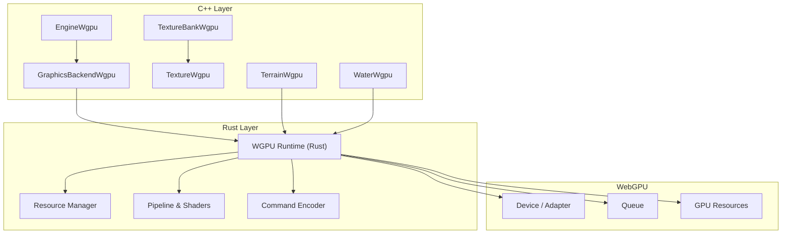
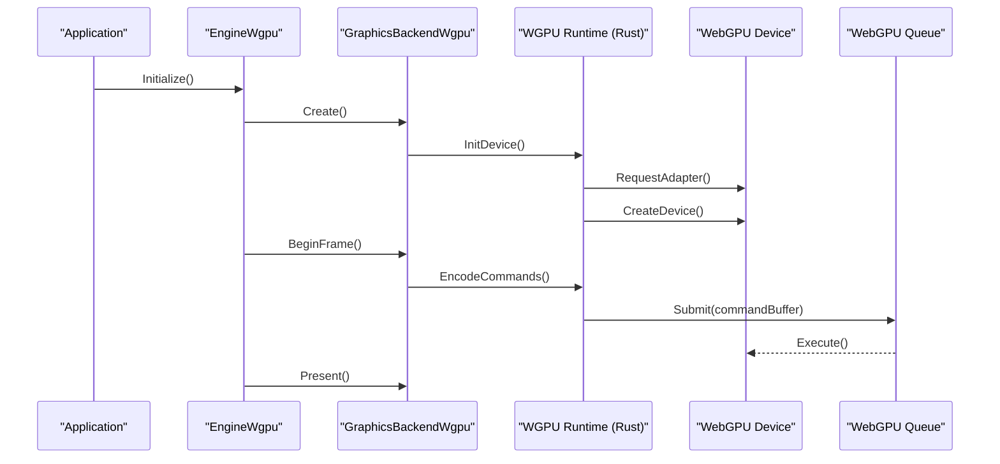
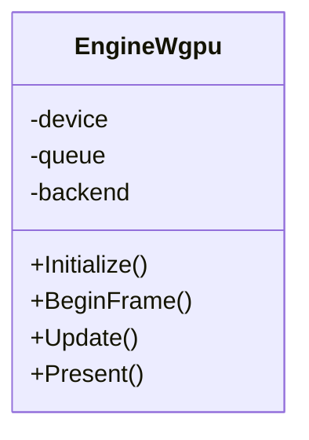
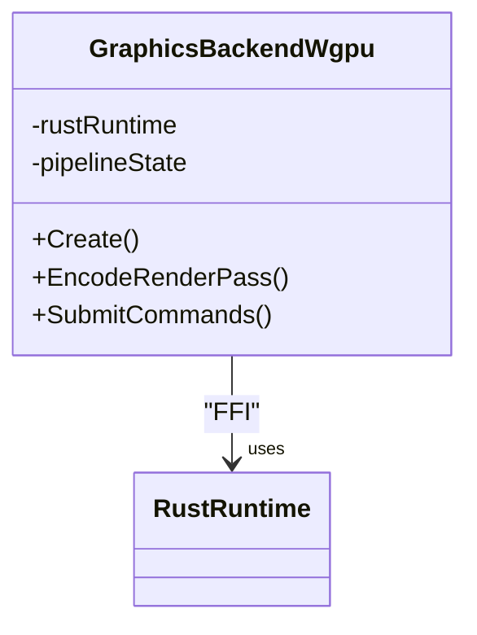
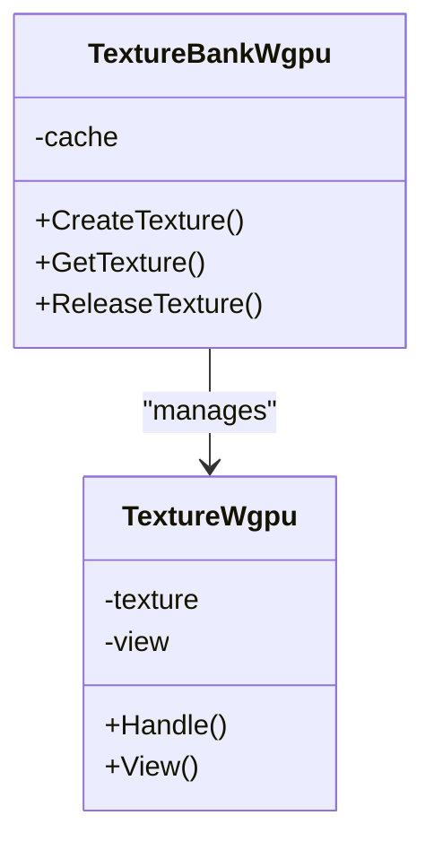
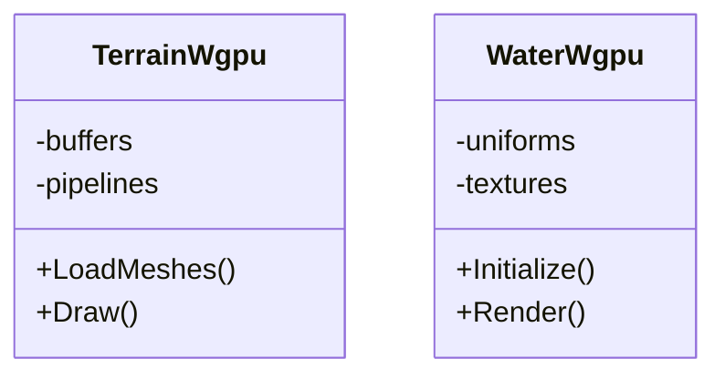
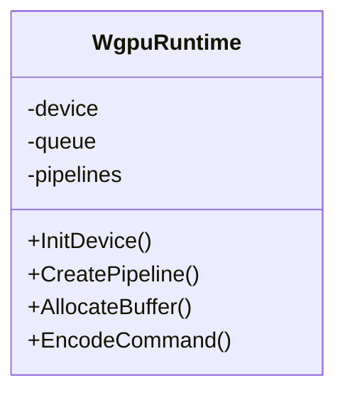
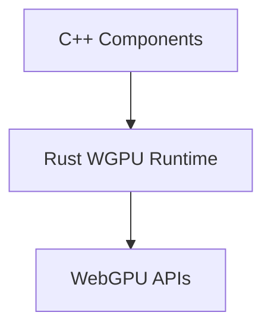

# WGPU Backend

<cite>
**Referenced Files in This Document**
- [EngineWgpu.hpp](file://engine/WgpuRenderer/EngineWgpu.hpp)
- [EngineWgpu.cpp](file://engine/WgpuRenderer/EngineWgpu.cpp)
- [GraphicsBackendWgpu.cpp](file://engine/WgpuRenderer/GraphicsBackendWgpu.cpp)
- [TextureBankWgpu.hpp](file://engine/WgpuRenderer/TextureBankWgpu.hpp)
- [TextureBankWgpu.cpp](file://engine/WgpuRenderer/TextureBankWgpu.cpp)
- [TextureWgpu.hpp](file://engine/WgpuRenderer/TextureWgpu.hpp)
- [TextureWgpu.cpp](file://engine/WgpuRenderer/TextureWgpu.cpp)
- [TerrainWgpu.hpp](file://engine/WgpuRenderer/TerrainWgpu.hpp)
- [TerrainWgpu.cpp](file://engine/WgpuRenderer/TerrainWgpu.cpp)
- [WaterWgpu.hpp](file://engine/WgpuRenderer/WaterWgpu.hpp)
- [WaterWgpu.cpp](file://engine/WgpuRenderer/WaterWgpu.cpp)
- [wgpu_renderer.hpp](file://engine/WgpuRenderer/include/wgpu_renderer.hpp)
- [Cargo.toml](file://engine/WgpuRenderer/rust/Cargo.toml)
- [bindless-textures-plan.md](file://engine/WgpuRenderer/docs/bindless-textures-plan.md)
- [implementation-roadmap.md](file://engine/WgpuRenderer/docs/implementation-roadmap.md)
- [rendering-performance-plan.md](file://engine/WgpuRenderer/docs/rendering-performance-plan.md)
</cite>

## Table of Contents
1. [Introduction](#introduction)
2. [Project Structure](#project-structure)
3. [Core Components](#core-components)
4. [Architecture Overview](#architecture-overview)
5. [Detailed Component Analysis](#detailed-component-analysis)
6. [Dependency Analysis](#dependency-analysis)
7. [Performance Considerations](#performance-considerations)
8. [Troubleshooting Guide](#troubleshooting-guide)
9. [Conclusion](#conclusion)
10. [Appendices](#appendices)

## Introduction
This document explains the modern WGPU backend implementation for the engine’s rendering subsystem. It focuses on the Rust-based rendering pipeline, WebGPU API integration, and cross-platform compatibility features. The documentation covers shader compilation using WGSL, compute shader usage for GPU-driven rendering, memory management strategies, bindless textures, descriptor sets, and command buffer optimization. It also describes the C++ to Rust FFI boundary, data synchronization between CPU and GPU, and provides guidance for implementing custom rendering passes and optimizing GPU utilization. Finally, it outlines migration considerations from OpenGL to WGPU and a roadmap for advanced features.

## Project Structure
The WGPU backend is implemented under the WgpuRenderer module with both C++ and Rust components:
- C++ layer: Engine integration, resource wrappers, texture bank, terrain, water, and graphics backend glue.
- Rust layer: Core WGPU runtime, pipeline management, resource allocation, and device abstraction.
- Documentation: Plans and roadmaps for performance, bindless textures, and feature evolution.

**Diagram sources**
- [EngineWgpu.hpp](file://engine/WgpuRenderer/EngineWgpu.hpp)
- [EngineWgpu.cpp](file://engine/WgpuRenderer/EngineWgpu.cpp)
- [GraphicsBackendWgpu.cpp](file://engine/WgpuRenderer/GraphicsBackendWgpu.cpp)
- [TextureBankWgpu.hpp](file://engine/WgpuRenderer/TextureBankWgpu.hpp)
- [TextureWgpu.hpp](file://engine/WgpuRenderer/TextureWgpu.hpp)
- [TerrainWgpu.hpp](file://engine/WgpuRenderer/TerrainWgpu.hpp)
- [WaterWgpu.hpp](file://engine/WgpuRenderer/WaterWgpu.hpp)
- [wgpu_renderer.hpp](file://engine/WgpuRenderer/include/wgpu_renderer.hpp)
- [Cargo.toml](file://engine/WgpuRenderer/rust/Cargo.toml)

**Section sources**
- [EngineWgpu.hpp](file://engine/WgpuRenderer/EngineWgpu.hpp)
- [EngineWgpu.cpp](file://engine/WgpuRenderer/EngineWgpu.cpp)
- [GraphicsBackendWgpu.cpp](file://engine/WgpuRenderer/GraphicsBackendWgpu.cpp)
- [TextureBankWgpu.hpp](file://engine/WgpuRenderer/TextureBankWgpu.hpp)
- [TextureWgpu.hpp](file://engine/WgpuRenderer/TextureWgpu.hpp)
- [TerrainWgpu.hpp](file://engine/WgpuRenderer/TerrainWgpu.hpp)
- [WaterWgpu.hpp](file://engine/WgpuRenderer/WaterWgpu.hpp)
- [wgpu_renderer.hpp](file://engine/WgpuRenderer/include/wgpu_renderer.hpp)
- [Cargo.toml](file://engine/WgpuRenderer/rust/Cargo.toml)

## Core Components
- EngineWgpu: Initializes the WGPU device, manages the render loop, and coordinates frame submission.
- GraphicsBackendWgpu: Implements the graphics backend interface, bridging engine calls to the Rust WGPU runtime.
- TextureBankWgpu: Centralized texture management, including creation, caching, and lifecycle control.
- TextureWgpu: Per-texture wrapper over WGPU textures and views.
- TerrainWgpu: Terrain-specific resources and draw commands.
- WaterWgpu: Water surface rendering resources and pipelines.
- Rust WGPU runtime: Encapsulates device, queue, pipeline, and resource management; exposes FFI-safe interfaces to C++.

Key responsibilities:
- Device and adapter selection for cross-platform compatibility.
- Pipeline and shader compilation via WGSL.
- Command encoding and submission through queues.
- Resource allocation and memory management strategies.
- Descriptor set management for bindless textures and uniform buffers.

**Section sources**
- [EngineWgpu.hpp](file://engine/WgpuRenderer/EngineWgpu.hpp)
- [EngineWgpu.cpp](file://engine/WgpuRenderer/EngineWgpu.cpp)
- [GraphicsBackendWgpu.cpp](file://engine/WgpuRenderer/GraphicsBackendWgpu.cpp)
- [TextureBankWgpu.hpp](file://engine/WgpuRenderer/TextureBankWgpu.hpp)
- [TextureWgpu.hpp](file://engine/WgpuRenderer/TextureWgpu.hpp)
- [TerrainWgpu.hpp](file://engine/WgpuRenderer/TerrainWgpu.hpp)
- [WaterWgpu.hpp](file://engine/WgpuRenderer/WaterWgpu.hpp)
- [wgpu_renderer.hpp](file://engine/WgpuRenderer/include/wgpu_renderer.hpp)
- [Cargo.toml](file://engine/WgpuRenderer/rust/Cargo.toml)

## Architecture Overview
The WGPU backend follows a layered architecture:
- C++ engine layer defines high-level rendering abstractions and resource APIs.
- Rust WGPU runtime implements low-level WebGPU operations, ensuring safety and performance.
- FFI boundaries expose minimal, stable interfaces across languages.
- WebGPU device/queue abstracts platform-specific drivers.

**Diagram sources**
- [EngineWgpu.cpp](file://engine/WgpuRenderer/EngineWgpu.cpp)
- [GraphicsBackendWgpu.cpp](file://engine/WgpuRenderer/GraphicsBackendWgpu.cpp)
- [wgpu_renderer.hpp](file://engine/WgpuRenderer/include/wgpu_renderer.hpp)
- [Cargo.toml](file://engine/WgpuRenderer/rust/Cargo.toml)

## Detailed Component Analysis

### EngineWgpu
Responsibilities:
- Device initialization and configuration.
- Frame lifecycle management (begin, update, present).
- Coordination with the graphics backend and Rust runtime.

**Diagram sources**
- [EngineWgpu.hpp](file://engine/WgpuRenderer/EngineWgpu.hpp)
- [EngineWgpu.cpp](file://engine/WgpuRenderer/EngineWgpu.cpp)

**Section sources**
- [EngineWgpu.hpp](file://engine/WgpuRenderer/EngineWgpu.hpp)
- [EngineWgpu.cpp](file://engine/WgpuRenderer/EngineWgpu.cpp)

### GraphicsBackendWgpu
Responsibilities:
- Implements the engine’s graphics backend interface.
- Bridges C++ calls to Rust WGPU runtime functions.
- Manages pipeline state and command encoding.

**Diagram sources**
- [GraphicsBackendWgpu.cpp](file://engine/WgpuRenderer/GraphicsBackendWgpu.cpp)
- [wgpu_renderer.hpp](file://engine/WgpuRenderer/include/wgpu_renderer.hpp)

**Section sources**
- [GraphicsBackendWgpu.cpp](file://engine/WgpuRenderer/GraphicsBackendWgpu.cpp)
- [wgpu_renderer.hpp](file://engine/WgpuRenderer/include/wgpu_renderer.hpp)

### TextureBankWgpu and TextureWgpu
Responsibilities:
- TextureBankWgpu manages texture creation, caching, and disposal.
- TextureWgpu wraps individual WGPU textures and views.

**Diagram sources**
- [TextureBankWgpu.hpp](file://engine/WgpuRenderer/TextureBankWgpu.hpp)
- [TextureWgpu.hpp](file://engine/WgpuRenderer/TextureWgpu.hpp)

**Section sources**
- [TextureBankWgpu.hpp](file://engine/WgpuRenderer/TextureBankWgpu.hpp)
- [TextureWgpu.hpp](file://engine/WgpuRenderer/TextureWgpu.hpp)

### TerrainWgpu and WaterWgpu
Responsibilities:
- TerrainWgpu handles terrain-specific resources and draw calls.
- WaterWgpu manages water surface rendering, including shaders and buffers.

**Diagram sources**
- [TerrainWgpu.hpp](file://engine/WgpuRenderer/TerrainWgpu.hpp)
- [WaterWgpu.hpp](file://engine/WgpuRenderer/WaterWgpu.hpp)

**Section sources**
- [TerrainWgpu.hpp](file://engine/WgpuRenderer/TerrainWgpu.hpp)
- [WaterWgpu.hpp](file://engine/WgpuRenderer/WaterWgpu.hpp)

### Rust WGPU Runtime
Responsibilities:
- Encapsulates WebGPU device, queue, and resource management.
- Provides FFI-safe functions for C++ to call.
- Handles WGSL shader compilation and pipeline creation.

**Diagram sources**
- [wgpu_renderer.hpp](file://engine/WgpuRenderer/include/wgpu_renderer.hpp)
- [Cargo.toml](file://engine/WgpuRenderer/rust/Cargo.toml)

**Section sources**
- [wgpu_renderer.hpp](file://engine/WgpuRenderer/include/wgpu_renderer.hpp)
- [Cargo.toml](file://engine/WgpuRenderer/rust/Cargo.toml)

## Dependency Analysis
The WGPU backend has clear dependencies:
- C++ components depend on the Rust WGPU runtime via FFI headers.
- Rust runtime depends on WebGPU device/queue APIs.
- Texture and resource managers depend on the runtime for allocation and lifecycle.

**Diagram sources**
- [GraphicsBackendWgpu.cpp](file://engine/WgpuRenderer/GraphicsBackendWgpu.cpp)
- [wgpu_renderer.hpp](file://engine/WgpuRenderer/include/wgpu_renderer.hpp)
- [Cargo.toml](file://engine/WgpuRenderer/rust/Cargo.toml)

**Section sources**
- [GraphicsBackendWgpu.cpp](file://engine/WgpuRenderer/GraphicsBackendWgpu.cpp)
- [wgpu_renderer.hpp](file://engine/WgpuRenderer/include/wgpu_renderer.hpp)
- [Cargo.toml](file://engine/WgpuRenderer/rust/Cargo.toml)

## Performance Considerations
- Command Buffer Optimization: Batch draw calls and minimize encoder resets.
- Memory Management: Use persistent mappings where safe; prefer staging buffers for uploads.
- Bindless Textures: Reduce descriptor set churn by using bindless sampling.
- Compute Shaders: Offload culling, skinning, or post-processing to GPU.
- Cross-Platform Compatibility: Abstract device features and fallbacks gracefully.

[No sources needed since this section provides general guidance]

## Troubleshooting Guide
Common issues and resolutions:
- Device Initialization Failures: Verify adapter capabilities and feature flags.
- Shader Compilation Errors: Validate WGSL syntax and supported features.
- Memory Leaks: Ensure proper release of textures and buffers.
- FFI Crashes: Check type alignment and lifetime across language boundaries.
- Performance Drops: Profile command encoding and resource updates.

[No sources needed since this section provides general guidance]

## Conclusion
The WGPU backend provides a modern, cross-platform rendering solution leveraging WebGPU’s efficiency and safety. By separating C++ engine logic from Rust runtime implementation, the system achieves modularity and performance. Future enhancements include advanced bindless systems, compute-driven rendering, and optimized descriptor management.

[No sources needed since this section summarizes without analyzing specific files]

## Appendices

### Migration from OpenGL to WGPU
- Replace GL state machine with explicit pipeline and descriptor sets.
- Convert GLSL shaders to WGSL.
- Use WebGPU buffers and textures instead of GL objects.
- Adopt command encoding and queue submission patterns.

[No sources needed since this section provides general guidance]

### Future Roadmap
- Advanced bindless texture system.
- Compute shader pipelines for culling and effects.
- HDR rendering and advanced post-processing.
- Improved cross-platform feature detection and fallbacks.

**Section sources**
- [bindless-textures-plan.md](file://engine/WgpuRenderer/docs/bindless-textures-plan.md)
- [implementation-roadmap.md](file://engine/WgpuRenderer/docs/implementation-roadmap.md)
- [rendering-performance-plan.md](file://engine/WgpuRenderer/docs/rendering-performance-plan.md)