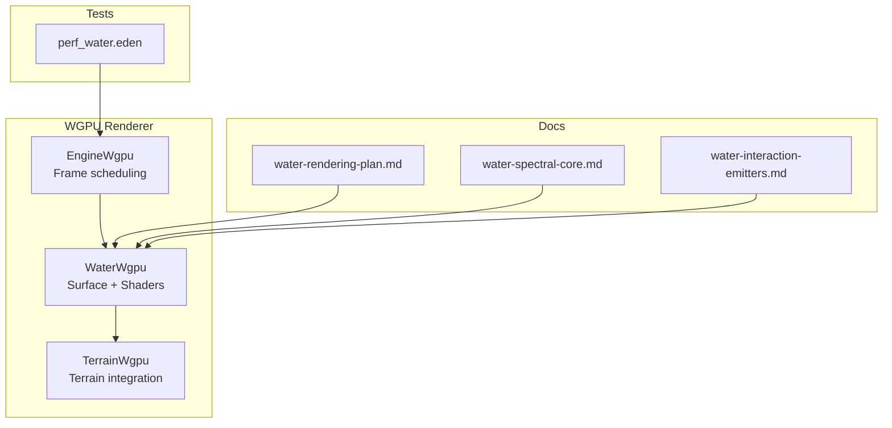
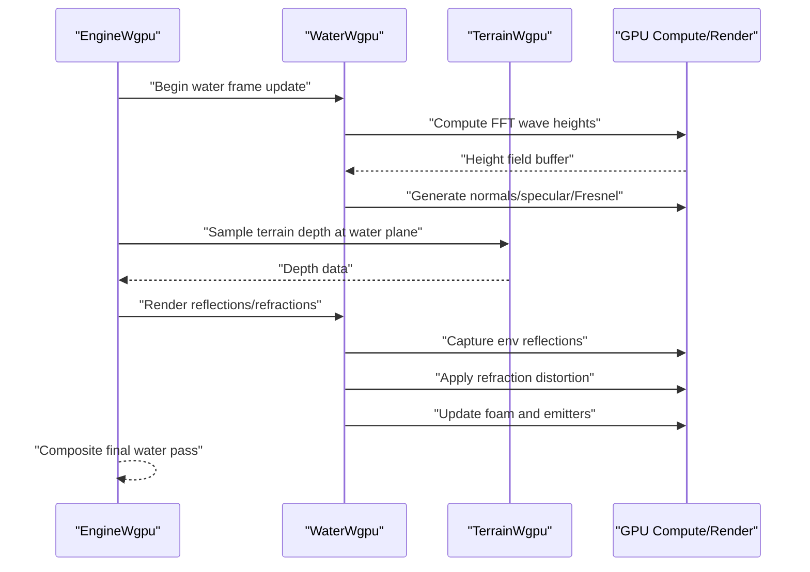
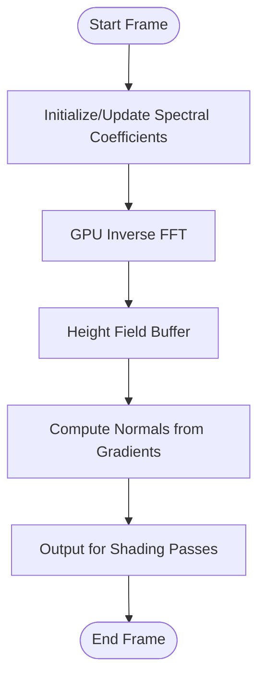
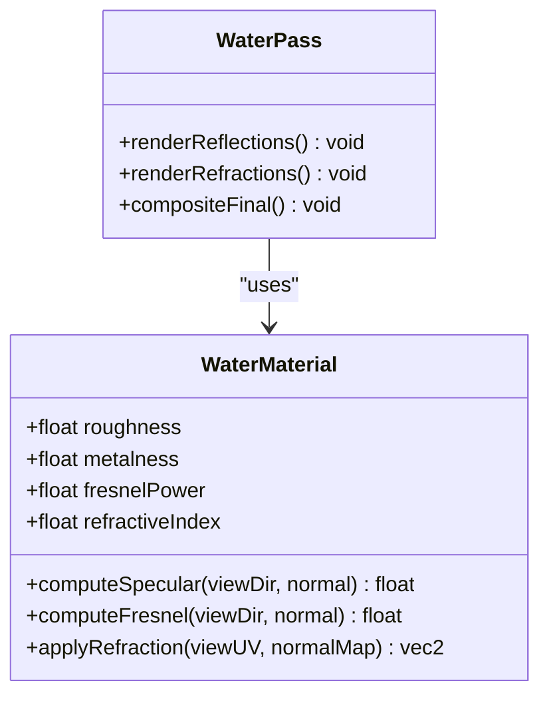
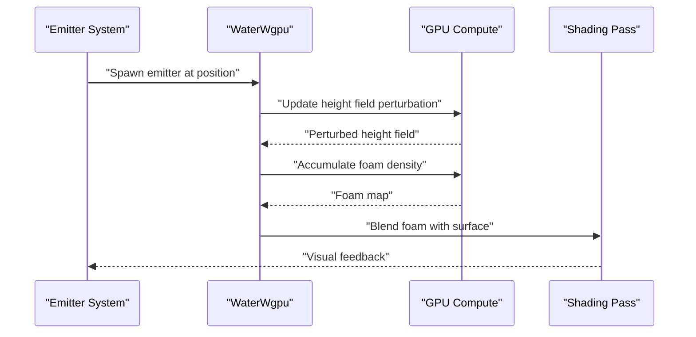
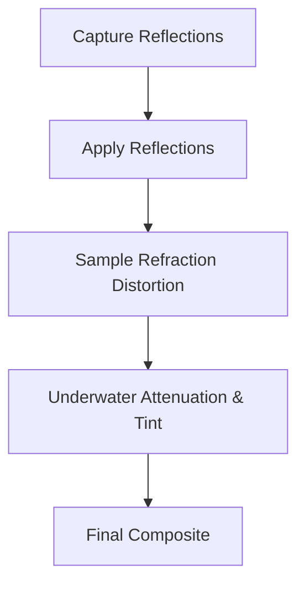
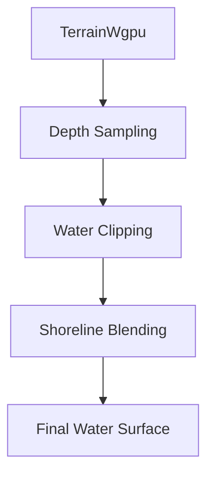
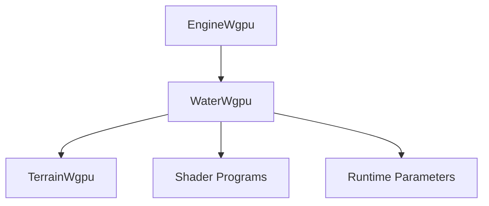

# Water Rendering System

<cite>
**Referenced Files in This Document**
- [WaterWgpu.cpp](file://engine/WgpuRenderer/WaterWgpu.cpp)
- [WaterWgpu.hpp](file://engine/WgpuRenderer/WaterWgpu.hpp)
- [water-rendering-plan.md](file://engine/WgpuRenderer/docs/water-rendering-plan.md)
- [water-spectral-core.md](file://engine/WgpuRenderer/docs/water-spectral-core.md)
- [water-interaction-emitters.md](file://engine/WgpuRenderer/docs/water-interaction-emitters.md)
- [EngineWgpu.cpp](file://engine/WgpuRenderer/EngineWgpu.cpp)
- [EngineWgpu.hpp](file://engine/WgpuRenderer/EngineWgpu.hpp)
- [TerrainWgpu.cpp](file://engine/WgpuRenderer/TerrainWgpu.cpp)
- [TerrainWgpu.hpp](file://engine/WgpuRenderer/TerrainWgpu.hpp)
- [perf_water.eden](file://tests/perf/missions/perf_water.eden)
</cite>

## Table of Contents
1. [Introduction](#introduction)
2. [Project Structure](#project-structure)
3. [Core Components](#core-components)
4. [Architecture Overview](#architecture-overview)
5. [Detailed Component Analysis](#detailed-component-analysis)
6. [Dependency Analysis](#dependency-analysis)
7. [Performance Considerations](#performance-considerations)
8. [Troubleshooting Guide](#troubleshooting-guide)
9. [Conclusion](#conclusion)
10. [Appendices](#appendices)

## Introduction
This document explains the advanced water rendering system implemented in the WGPU-based graphics backend. It covers FFT-based wave simulation, real-time water interaction, foam generation, and spectral water rendering. The system uses GPU-accelerated computation for surface calculation, reflection/refraction effects, and underwater rendering. Guidance is provided for configuring water parameters, optimizing performance, integrating with terrain systems, setting water quality levels, applying LOD strategies, and targeting mobile platforms.

## Project Structure
The water rendering implementation resides primarily under the WGPU renderer module. Key files include:
- WaterWgpu.cpp/hpp: Core water rendering logic, shaders, and GPU buffers management.
- EngineWgpu.cpp/hpp: Integration points where water rendering is scheduled within the frame pipeline.
- TerrainWgpu.cpp/hpp: Terrain-water integration for depth sampling and geometry blending.
- Documentation plans under docs/: High-level design and feature specifications for water rendering.
- Performance test mission: perf_water.eden used to validate water performance characteristics.

**Diagram sources**
- [EngineWgpu.cpp](file://engine/WgpuRenderer/EngineWgpu.cpp)
- [EngineWgpu.hpp](file://engine/WgpuRenderer/EngineWgpu.hpp)
- [WaterWgpu.cpp](file://engine/WgpuRenderer/WaterWgpu.cpp)
- [WaterWgpu.hpp](file://engine/WgpuRenderer/WaterWgpu.hpp)
- [TerrainWgpu.cpp](file://engine/WgpuRenderer/TerrainWgpu.cpp)
- [TerrainWgpu.hpp](file://engine/WgpuRenderer/TerrainWgpu.hpp)
- [water-rendering-plan.md](file://engine/WgpuRenderer/docs/water-rendering-plan.md)
- [water-spectral-core.md](file://engine/WgpuRenderer/docs/water-spectral-core.md)
- [water-interaction-emitters.md](file://engine/WgpuRenderer/docs/water-interaction-emitters.md)
- [perf_water.eden](file://tests/perf/missions/perf_water.eden)

**Section sources**
- [EngineWgpu.cpp](file://engine/WgpuRenderer/EngineWgpu.cpp)
- [EngineWgpu.hpp](file://engine/WgpuRenderer/EngineWgpu.hpp)
- [WaterWgpu.cpp](file://engine/WgpuRenderer/WaterWgpu.cpp)
- [WaterWgpu.hpp](file://engine/WgpuRenderer/WaterWgpu.hpp)
- [TerrainWgpu.cpp](file://engine/WgpuRenderer/TerrainWgpu.cpp)
- [TerrainWgpu.hpp](file://engine/WgpuRenderer/TerrainWgpu.hpp)
- [water-rendering-plan.md](file://engine/WgpuRenderer/docs/water-rendering-plan.md)
- [water-spectral-core.md](file://engine/WgpuRenderer/docs/water-spectral-core.md)
- [water-interaction-emitters.md](file://engine/WgpuRenderer/docs/water-interaction-emitters.md)
- [perf_water.eden](file://tests/perf/missions/perf_water.eden)

## Core Components
- Water Surface Simulation (FFT): Computes wave heights using spectral methods on the GPU, driven by wind and directional inputs. Buffers store wave spectra and height fields updated per frame.
- Spectral Water Rendering: Uses the computed height field to generate normals, specular highlights, Fresnel reflections, and refraction through a multi-pass pipeline.
- Reflection/Refraction Effects: Renders environment reflections into textures and applies refraction distortion based on surface normals and viewing angle.
- Underwater Rendering: Implements caustics approximation, light attenuation, and color tinting for submerged visuals.
- Real-Time Interaction: Emitters and splashes interact with the water surface, perturbing waves and generating foam.
- Foam Generation: Tracks foam accumulation near shorelines and disturbance zones, fading over time and blending with surface shading.

These components are orchestrated by the WGPU engine’s render pipeline, with configuration exposed via runtime parameters and material settings.

**Section sources**
- [WaterWgpu.cpp](file://engine/WgpuRenderer/WaterWgpu.cpp)
- [WaterWgpu.hpp](file://engine/WgpuRenderer/WaterWgpu.hpp)
- [water-rendering-plan.md](file://engine/WgpuRenderer/docs/water-rendering-plan.md)
- [water-spectral-core.md](file://engine/WgpuRenderer/docs/water-spectral-core.md)
- [water-interaction-emitters.md](file://engine/WgpuRenderer/docs/water-interaction-emitters.md)

## Architecture Overview
The water rendering architecture integrates tightly with the WGPU engine’s frame loop and terrain system. The high-level flow:
- Engine schedules water passes during the main render pass.
- Water surface simulation updates GPU buffers (height field, normal maps).
- Reflections are captured into textures; refraction distorts view samples.
- Foam and interaction emitters modify local surface properties.
- Terrain integration ensures correct depth handling and shoreline blending.

**Diagram sources**
- [EngineWgpu.cpp](file://engine/WgpuRenderer/EngineWgpu.cpp)
- [EngineWgpu.hpp](file://engine/WgpuRenderer/EngineWgpu.hpp)
- [WaterWgpu.cpp](file://engine/WgpuRenderer/WaterWgpu.cpp)
- [WaterWgpu.hpp](file://engine/WgpuRenderer/WaterWgpu.hpp)
- [TerrainWgpu.cpp](file://engine/WgpuRenderer/TerrainWgpu.cpp)
- [TerrainWgpu.hpp](file://engine/WgpuRenderer/TerrainWgpu.hpp)

## Detailed Component Analysis

### FFT-Based Wave Simulation
The FFT-based simulation computes wave heights from spectral energy distributions influenced by wind direction and speed. The process:
- Initialize spectral coefficients per frame or cache across frames.
- Apply inverse FFT on GPU to produce height field.
- Derive normals from height gradients for shading.
- Update boundary conditions and damping for stability.

**Diagram sources**
- [WaterWgpu.cpp](file://engine/WgpuRenderer/WaterWgpu.cpp)
- [WaterWgpu.hpp](file://engine/WgpuRenderer/WaterWgpu.hpp)
- [water-spectral-core.md](file://engine/WgpuRenderer/docs/water-spectral-core.md)

**Section sources**
- [WaterWgpu.cpp](file://engine/WgpuRenderer/WaterWgpu.cpp)
- [WaterWgpu.hpp](file://engine/WgpuRenderer/WaterWgpu.hpp)
- [water-spectral-core.md](file://engine/WgpuRenderer/docs/water-spectral-core.md)

### Spectral Water Rendering Pipeline
Rendering leverages the height-derived normals to compute:
- Specular highlights based on microfacet models.
- Fresnel reflectivity varying with view angle.
- Refraction distortion sampled against environment textures.
- Multi-layered shading combining diffuse base color and specular contributions.

**Diagram sources**
- [WaterWgpu.cpp](file://engine/WgpuRenderer/WaterWgpu.cpp)
- [WaterWgpu.hpp](file://engine/WgpuRenderer/WaterWgpu.hpp)

**Section sources**
- [WaterWgpu.cpp](file://engine/WgpuRenderer/WaterWgpu.cpp)
- [WaterWgpu.hpp](file://engine/WgpuRenderer/WaterWgpu.hpp)
- [water-rendering-plan.md](file://engine/WgpuRenderer/docs/water-rendering-plan.md)

### Real-Time Water Interaction and Foam
Interaction emitters perturb the surface locally, creating ripples and foam:
- Emitters inject velocity and displacement into the height field.
- Foam accumulates near disturbances and recedes over time.
- Shoreline detection blends foam density with terrain edges.

**Diagram sources**
- [WaterWgpu.cpp](file://engine/WgpuRenderer/WaterWgpu.cpp)
- [water-interaction-emitters.md](file://engine/WgpuRenderer/docs/water-interaction-emitters.md)

**Section sources**
- [WaterWgpu.cpp](file://engine/WgpuRenderer/WaterWgpu.cpp)
- [water-interaction-emitters.md](file://engine/WgpuRenderer/docs/water-interaction-emitters.md)

### Reflection/Refraction and Underwater Rendering
- Reflections are captured into render targets and applied as environment maps.
- Refraction distorts background sampling using normal-derived offsets.
- Underwater rendering includes light attenuation, color tinting, and caustic approximations.

**Diagram sources**
- [WaterWgpu.cpp](file://engine/WgpuRenderer/WaterWgpu.cpp)
- [water-rendering-plan.md](file://engine/WgpuRenderer/docs/water-rendering-plan.md)

**Section sources**
- [WaterWgpu.cpp](file://engine/WgpuRenderer/WaterWgpu.cpp)
- [water-rendering-plan.md](file://engine/WgpuRenderer/docs/water-rendering-plan.md)

### Integration with Terrain Systems
Terrain integration ensures accurate depth sampling and shoreline blending:
- Depth values from terrain inform water clipping and transparency.
- Shoreline masks blend water and terrain surfaces seamlessly.
- Geometry LOD adjusts water mesh resolution based on distance.

**Diagram sources**
- [TerrainWgpu.cpp](file://engine/WgpuRenderer/TerrainWgpu.cpp)
- [TerrainWgpu.hpp](file://engine/WgpuRenderer/TerrainWgpu.hpp)
- [WaterWgpu.cpp](file://engine/WgpuRenderer/WaterWgpu.cpp)

**Section sources**
- [TerrainWgpu.cpp](file://engine/WgpuRenderer/TerrainWgpu.cpp)
- [TerrainWgpu.hpp](file://engine/WgpuRenderer/TerrainWgpu.hpp)
- [WaterWgpu.cpp](file://engine/WgpuRenderer/WaterWgpu.cpp)

## Dependency Analysis
The water system depends on:
- WGPU engine scheduling for frame timing and resource lifecycle.
- Terrain system for depth and shoreline data.
- Shader programs for FFT, shading, and post-processing.
- Configuration parameters for quality and performance tuning.

**Diagram sources**
- [EngineWgpu.cpp](file://engine/WgpuRenderer/EngineWgpu.cpp)
- [EngineWgpu.hpp](file://engine/WgpuRenderer/EngineWgpu.hpp)
- [WaterWgpu.cpp](file://engine/WgpuRenderer/WaterWgpu.cpp)
- [TerrainWgpu.cpp](file://engine/WgpuRenderer/TerrainWgpu.cpp)

**Section sources**
- [EngineWgpu.cpp](file://engine/WgpuRenderer/EngineWgpu.cpp)
- [EngineWgpu.hpp](file://engine/WgpuRenderer/EngineWgpu.hpp)
- [WaterWgpu.cpp](file://engine/WgpuRenderer/WaterWgpu.cpp)
- [TerrainWgpu.cpp](file://engine/WgpuRenderer/TerrainWgpu.cpp)

## Performance Considerations
- GPU Compute Efficiency: Use batched FFT operations and minimize CPU-GPU synchronization.
- Texture Resolution: Adjust reflection/refraction texture sizes based on platform capabilities.
- LOD Strategies: Reduce water mesh resolution and shader complexity at distance.
- Mobile Optimizations: Lower spectral layers, simplify foam calculations, and use efficient sampling techniques.
- Quality Settings: Balance between visual fidelity and frame rate by toggling features like caustics and high-resolution normals.

[No sources needed since this section provides general guidance]

## Troubleshooting Guide
Common issues and resolutions:
- Flickering Water Surface: Ensure consistent FFT updates and avoid frame-dependent artifacts.
- Incorrect Shoreline Blending: Verify terrain depth sampling accuracy and mask thresholds.
- Poor Performance on Mobile: Reduce spectral layers, disable expensive effects, and optimize texture formats.
- Reflection Artifacts: Check capture resolution and filtering modes; adjust mipmaps if necessary.

[No sources needed since this section provides general guidance]

## Conclusion
The water rendering system delivers realistic, GPU-accelerated water simulation with interactive effects and high-quality visuals. By leveraging FFT-based wave computation, spectral shading, and robust integration with terrain, it achieves both performance and fidelity across platforms. Proper configuration and optimization ensure smooth operation on desktop and mobile devices.

[No sources needed since this section summarizes without analyzing specific files]

## Appendices
- Example Configuration: Refer to runtime parameter files for water quality, spectral layers, and effect toggles.
- Performance Testing: Use perf_water.eden mission to benchmark water rendering under various settings.
- Integration Examples: Consult TerrainWgpu documentation for shoreline blending and depth sampling best practices.

[No sources needed since this section provides general guidance]