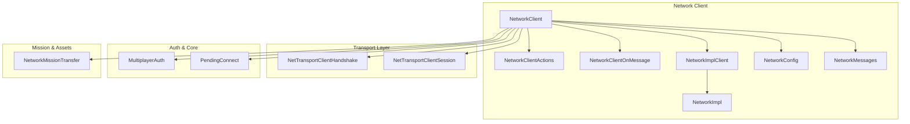
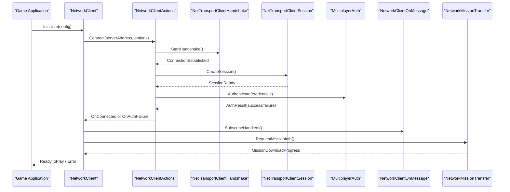
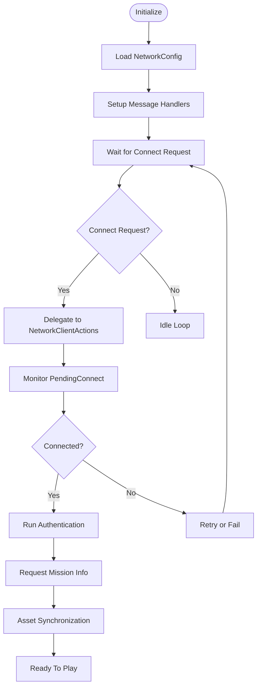
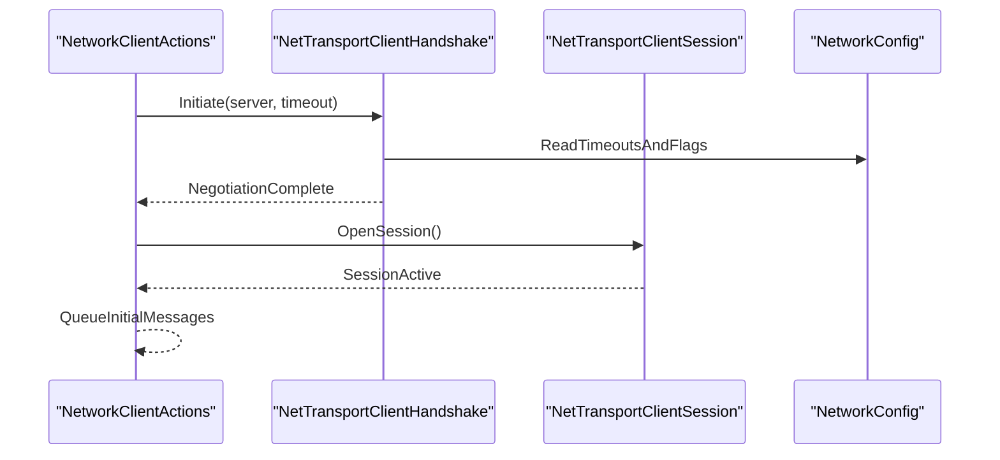
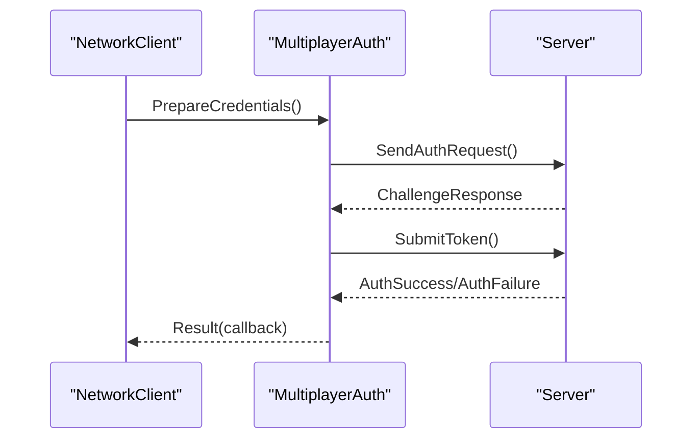
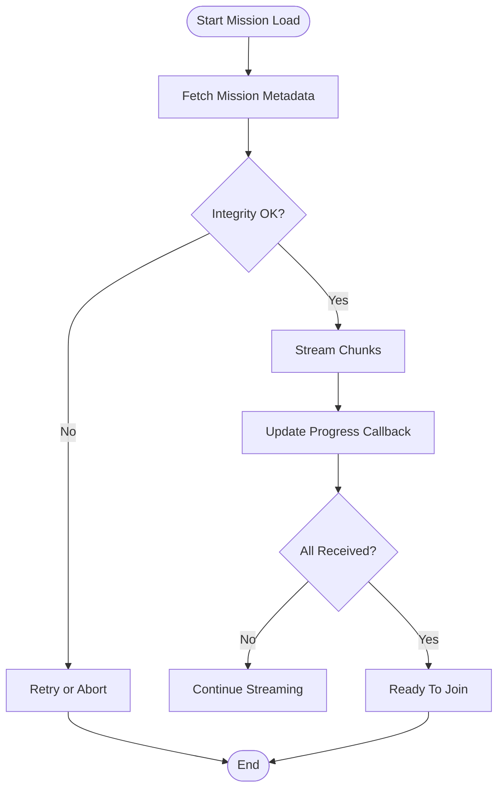
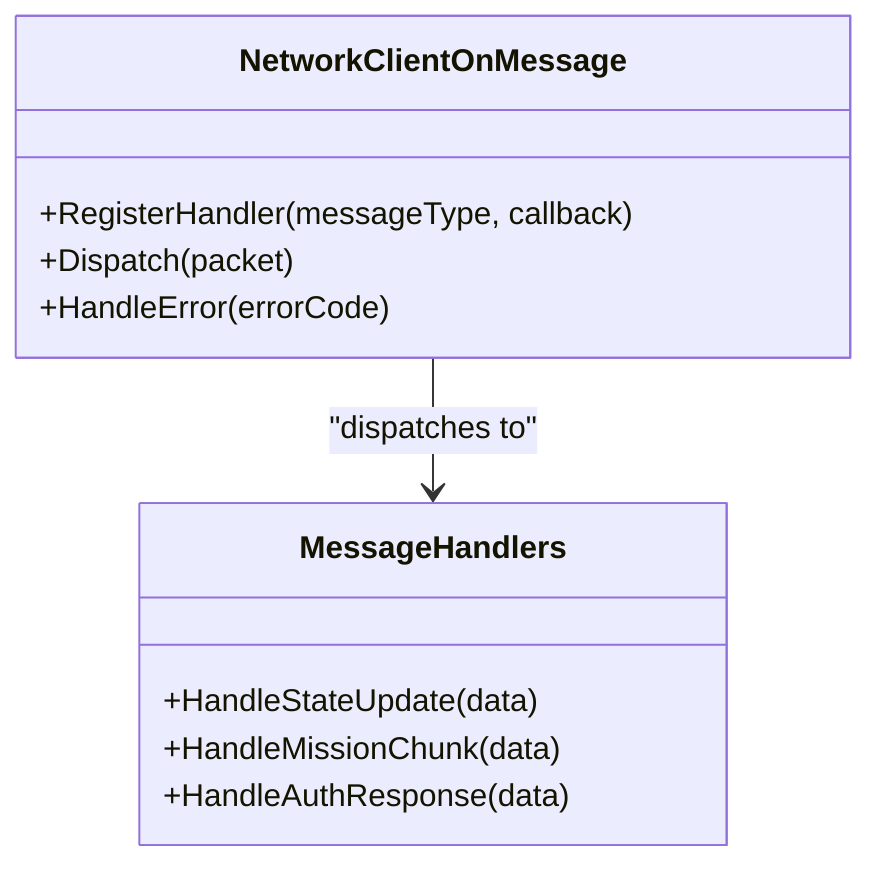
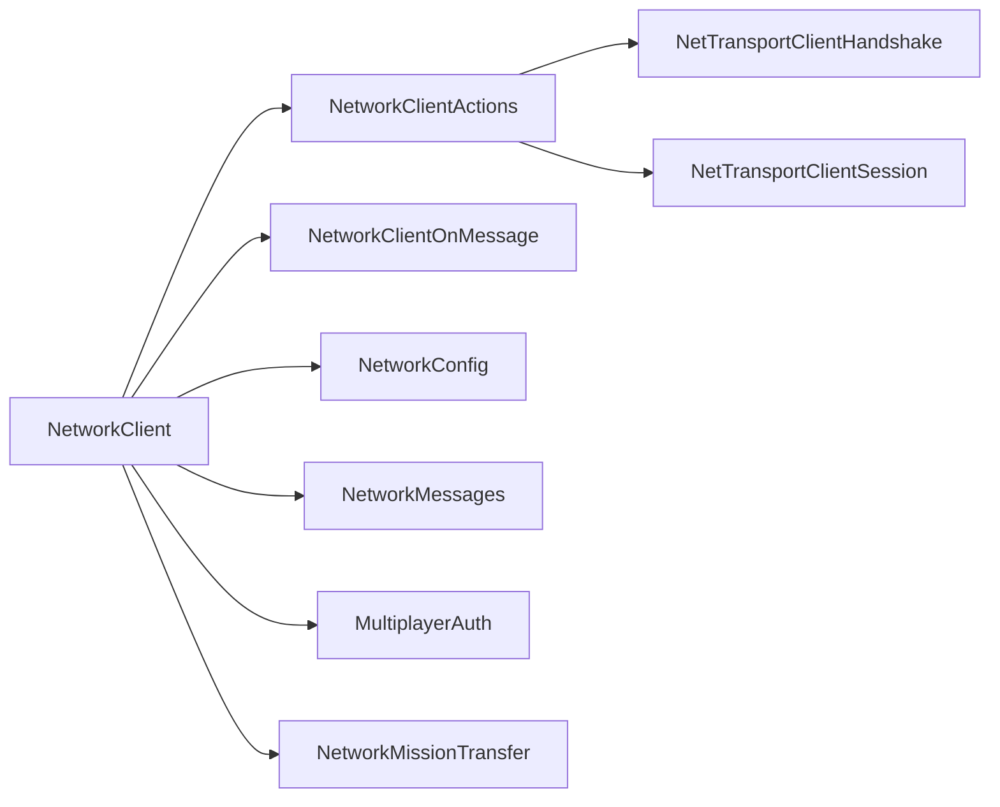

# Client Implementation

<cite>
**Referenced Files in This Document**
- [NetworkClient.cpp](file://engine/Poseidon/Network/NetworkClient.cpp)
- [NetworkClientActions.cpp](file://engine/Poseidon/Network/NetworkClientActions.cpp)
- [NetworkClientOnMessage.cpp](file://engine/Poseidon/Network/NetworkClientOnMessage.cpp)
- [NetworkImplClient.hpp](file://engine/Poseidon/Network/NetworkImplClient.hpp)
- [NetworkImpl.hpp](file://engine/Poseidon/Network/NetworkImpl.hpp)
- [NetworkConfig.cpp](file://engine/Poseidon/Network/NetworkConfig.cpp)
- [NetworkConfig.hpp](file://engine/Poseidon/Network/NetworkConfig.hpp)
- [NetworkMessages.cpp](file://engine/Poseidon/Network/NetworkMessages.cpp)
- [NetworkMessages.hpp](file://engine/Poseidon/Network/NetworkMessages.hpp)
- [NetworkMissionTransfer.cpp](file://engine/Poseidon/Network/NetworkMissionTransfer.cpp)
- [NetworkMissionTransfer.hpp](file://engine/Poseidon/Network/NetworkMissionTransfer.hpp)
- [NetTransportClientHandshake.cpp](file://engine/Poseidon/Network/NetTransportClientHandshake.cpp)
- [NetTransportClientHandshake.hpp](file://engine/Poseidon/Network/NetTransportClientHandshake.hpp)
- [NetTransportClientSession.cpp](file://engine/Poseidon/Network/NetTransportClientSession.cpp)
- [NetTransportClientSession.hpp](file://engine/Poseidon/Network/NetTransportClientSession.hpp)
- [MultiplayerAuth.cpp](file://engine/Poseidon/Network/MultiplayerAuth.cpp)
- [MultiplayerAuth.hpp](file://engine/Poseidon/Network/MultiplayerAuth.hpp)
- [PendingConnect.cpp](file://engine/Poseidon/Core/PendingConnect.cpp)
- [PendingConnect.hpp](file://engine/Poseidon/Core/PendingConnect.hpp)
</cite>

## Table of Contents
1. [Introduction](#introduction)
2. [Project Structure](#project-structure)
3. [Core Components](#core-components)
4. [Architecture Overview](#architecture-overview)
5. [Detailed Component Analysis](#detailed-component-analysis)
6. [Dependency Analysis](#dependency-analysis)
7. [Performance Considerations](#performance-considerations)
8. [Troubleshooting Guide](#troubleshooting-guide)
9. [Conclusion](#conclusion)

## Introduction
This document explains the client-side networking implementation with a focus on initialization, connection establishment, authentication, mission loading, asset synchronization, and state replication. It also covers the event-driven architecture for incoming messages, callbacks, and asynchronous operations, along with practical examples for connecting to multiplayer servers, handling errors, and managing network state. Latency compensation techniques such as prediction and rollback are discussed to ensure smooth gameplay.

## Project Structure
The client networking subsystem is implemented under the Poseidon engine’s Network module. Key areas include:
- Client lifecycle and actions
- Message dispatch and handlers
- Transport handshake and session management
- Authentication workflows
- Mission and asset transfer
- Configuration and messaging types

**Diagram sources**
- [NetworkClient.cpp](file://engine/Poseidon/Network/NetworkClient.cpp)
- [NetworkClientActions.cpp](file://engine/Poseidon/Network/NetworkClientActions.cpp)
- [NetworkClientOnMessage.cpp](file://engine/Poseidon/Network/NetworkClientOnMessage.cpp)
- [NetworkImplClient.hpp](file://engine/Poseidon/Network/NetworkImplClient.hpp)
- [NetworkImpl.hpp](file://engine/Poseidon/Network/NetworkImpl.hpp)
- [NetworkConfig.cpp](file://engine/Poseidon/Network/NetworkConfig.cpp)
- [NetworkConfig.hpp](file://engine/Poseidon/Network/NetworkConfig.hpp)
- [NetworkMessages.cpp](file://engine/Poseidon/Network/NetworkMessages.cpp)
- [NetworkMessages.hpp](file://engine/Poseidon/Network/NetworkMessages.hpp)
- [NetTransportClientHandshake.cpp](file://engine/Poseidon/Network/NetTransportClientHandshake.cpp)
- [NetTransportClientHandshake.hpp](file://engine/Poseidon/Network/NetTransportClientHandshake.hpp)
- [NetTransportClientSession.cpp](file://engine/Poseidon/Network/NetTransportClientSession.cpp)
- [NetTransportClientSession.hpp](file://engine/Poseidon/Network/NetTransportClientSession.hpp)
- [MultiplayerAuth.cpp](file://engine/Poseidon/Network/MultiplayerAuth.cpp)
- [MultiplayerAuth.hpp](file://engine/Poseidon/Network/MultiplayerAuth.hpp)
- [PendingConnect.cpp](file://engine/Poseidon/Core/PendingConnect.cpp)
- [PendingConnect.hpp](file://engine/Poseidon/Core/PendingConnect.hpp)
- [NetworkMissionTransfer.cpp](file://engine/Poseidon/Network/NetworkMissionTransfer.cpp)
- [NetworkMissionTransfer.hpp](file://engine/Poseidon/Network/NetworkMissionTransfer.hpp)

**Section sources**
- [NetworkClient.cpp](file://engine/Poseidon/Network/NetworkClient.cpp)
- [NetworkImplClient.hpp](file://engine/Poseidon/Network/NetworkImplClient.hpp)
- [NetworkConfig.hpp](file://engine/Poseidon/Network/NetworkConfig.hpp)
- [NetworkMessages.hpp](file://engine/Poseidon/Network/NetworkMessages.hpp)
- [NetTransportClientHandshake.hpp](file://engine/Poseidon/Network/NetTransportClientHandshake.hpp)
- [NetTransportClientSession.hpp](file://engine/Poseidon/Network/NetTransportClientSession.hpp)
- [MultiplayerAuth.hpp](file://engine/Poseidon/Network/MultiplayerAuth.hpp)
- [PendingConnect.hpp](file://engine/Poseidon/Core/PendingConnect.hpp)
- [NetworkMissionTransfer.hpp](file://engine/Poseidon/Network/NetworkMissionTransfer.hpp)

## Core Components
- NetworkClient: Orchestrates client lifecycle, connects to servers, manages sessions, and coordinates authentication, mission loading, and message handling.
- NetworkClientActions: Provides high-level operations like connect, disconnect, send commands, and request resources.
- NetworkClientOnMessage: Implements event-driven dispatch for incoming server messages and updates.
- NetworkImplClient and NetworkImpl: Abstractions over transport and protocol details; client-specific implementations live here.
- NetworkConfig: Holds runtime configuration for timeouts, bandwidth, reliability, and feature flags.
- NetworkMessages: Defines message types, serialization, and routing between client and server.
- NetTransportClientHandshake and NetTransportClientSession: Handle low-level TCP/UDP handshake, channel setup, and session lifecycle.
- MultiplayerAuth: Manages authentication tokens, credentials, and challenge-response flows.
- PendingConnect: Tracks pending connection attempts and retries.
- NetworkMissionTransfer: Handles mission metadata exchange, chunked downloads, and verification.

**Section sources**
- [NetworkClient.cpp](file://engine/Poseidon/Network/NetworkClient.cpp)
- [NetworkClientActions.cpp](file://engine/Poseidon/Network/NetworkClientActions.cpp)
- [NetworkClientOnMessage.cpp](file://engine/Poseidon/Network/NetworkClientOnMessage.cpp)
- [NetworkImplClient.hpp](file://engine/Poseidon/Network/NetworkImplClient.hpp)
- [NetworkImpl.hpp](file://engine/Poseidon/Network/NetworkImpl.hpp)
- [NetworkConfig.cpp](file://engine/Poseidon/Network/NetworkConfig.cpp)
- [NetworkConfig.hpp](file://engine/Poseidon/Network/NetworkConfig.hpp)
- [NetworkMessages.cpp](file://engine/Poseidon/Network/NetworkMessages.cpp)
- [NetworkMessages.hpp](file://engine/Poseidon/Network/NetworkMessages.hpp)
- [NetTransportClientHandshake.cpp](file://engine/Poseidon/Network/NetTransportClientHandshake.cpp)
- [NetTransportClientHandshake.hpp](file://engine/Poseidon/Network/NetTransportClientHandshake.hpp)
- [NetTransportClientSession.cpp](file://engine/Poseidon/Network/NetTransportClientSession.cpp)
- [NetTransportClientSession.hpp](file://engine/Poseidon/Network/NetTransportClientSession.hpp)
- [MultiplayerAuth.cpp](file://engine/Poseidon/Network/MultiplayerAuth.cpp)
- [MultiplayerAuth.hpp](file://engine/Poseidon/Network/MultiplayerAuth.hpp)
- [PendingConnect.cpp](file://engine/Poseidon/Core/PendingConnect.cpp)
- [PendingConnect.hpp](file://engine/Poseidon/Core/PendingConnect.hpp)
- [NetworkMissionTransfer.cpp](file://engine/Poseidon/Network/NetworkMissionTransfer.cpp)
- [NetworkMissionTransfer.hpp](file://engine/Poseidon/Network/NetworkMissionTransfer.hpp)

## Architecture Overview
The client follows an event-driven architecture where the NetworkClient acts as a central coordinator. It initializes configuration, establishes transport connections, performs authentication, and then subscribes to message handlers for mission data, asset synchronization, and state replication. Incoming packets are parsed into typed messages and dispatched to appropriate handlers. Outgoing actions are queued and sent via the transport layer with reliability and ordering guarantees as configured.

**Diagram sources**
- [NetworkClient.cpp](file://engine/Poseidon/Network/NetworkClient.cpp)
- [NetworkClientActions.cpp](file://engine/Poseidon/Network/NetworkClientActions.cpp)
- [NetTransportClientHandshake.cpp](file://engine/Poseidon/Network/NetTransportClientHandshake.cpp)
- [NetTransportClientSession.cpp](file://engine/Poseidon/Network/NetTransportClientSession.cpp)
- [MultiplayerAuth.cpp](file://engine/Poseidon/Network/MultiplayerAuth.cpp)
- [NetworkClientOnMessage.cpp](file://engine/Poseidon/Network/NetworkClientOnMessage.cpp)
- [NetworkMissionTransfer.cpp](file://engine/Poseidon/Network/NetworkMissionTransfer.cpp)

## Detailed Component Analysis

### NetworkClient Lifecycle and Initialization
- Initializes configuration from NetworkConfig and sets up logging, metrics, and thread pools.
- Prepares message handlers via NetworkClientOnMessage and registers callbacks for connection events.
- Delegates connection requests to NetworkClientActions and monitors PendingConnect for retry logic.
- Coordinates with NetworkMissionTransfer to fetch mission metadata and assets before entering gameplay.

**Diagram sources**
- [NetworkClient.cpp](file://engine/Poseidon/Network/NetworkClient.cpp)
- [NetworkClientActions.cpp](file://engine/Poseidon/Network/NetworkClientActions.cpp)
- [NetworkConfig.cpp](file://engine/Poseidon/Network/NetworkConfig.cpp)
- [PendingConnect.cpp](file://engine/Poseidon/Core/PendingConnect.cpp)
- [NetworkMissionTransfer.cpp](file://engine/Poseidon/Network/NetworkMissionTransfer.cpp)

**Section sources**
- [NetworkClient.cpp](file://engine/Poseidon/Network/NetworkClient.cpp)
- [NetworkConfig.cpp](file://engine/Poseidon/Network/NetworkConfig.cpp)
- [PendingConnect.cpp](file://engine/Poseidon/Core/PendingConnect.cpp)

### Connection Establishment and Transport Handshake
- NetworkClientActions initiates connection using NetTransportClientHandshake, which negotiates protocol version, channels, and encryption parameters.
- NetTransportClientSession manages packet sequencing, acknowledgments, and retransmissions based on reliability settings.
- Errors during handshake trigger retry policies defined in PendingConnect and NetworkConfig.

**Diagram sources**
- [NetworkClientActions.cpp](file://engine/Poseidon/Network/NetworkClientActions.cpp)
- [NetTransportClientHandshake.cpp](file://engine/Poseidon/Network/NetTransportClientHandshake.cpp)
- [NetTransportClientSession.cpp](file://engine/Poseidon/Network/NetTransportClientSession.cpp)
- [NetworkConfig.cpp](file://engine/Poseidon/Network/NetworkConfig.cpp)

**Section sources**
- [NetworkClientActions.cpp](file://engine/Poseidon/Network/NetworkClientActions.cpp)
- [NetTransportClientHandshake.cpp](file://engine/Poseidon/Network/NetTransportClientHandshake.cpp)
- [NetTransportClientSession.cpp](file://engine/Poseidon/Network/NetTransportClientSession.cpp)
- [NetworkConfig.cpp](file://engine/Poseidon/Network/NetworkConfig.cpp)

### Authentication Workflow
- MultiplayerAuth handles credential validation, token exchange, and challenge-response sequences.
- NetworkClient integrates auth results to proceed or abort connection flow.
- Failure paths update PendingConnect and notify the application with error codes.

**Diagram sources**
- [MultiplayerAuth.cpp](file://engine/Poseidon/Network/MultiplayerAuth.cpp)
- [NetworkClient.cpp](file://engine/Poseidon/Network/NetworkClient.cpp)

**Section sources**
- [MultiplayerAuth.cpp](file://engine/Poseidon/Network/MultiplayerAuth.cpp)
- [NetworkClient.cpp](file://engine/Poseidon/Network/NetworkClient.cpp)

### Mission Loading and Asset Synchronization
- NetworkMissionTransfer requests mission metadata, verifies integrity, and streams chunks to local storage.
- The client tracks download progress and triggers readiness when all required assets are present.
- Errors during transfer cause retries or fallback strategies based on NetworkConfig.

**Diagram sources**
- [NetworkMissionTransfer.cpp](file://engine/Poseidon/Network/NetworkMissionTransfer.cpp)
- [NetworkConfig.cpp](file://engine/Poseidon/Network/NetworkConfig.cpp)

**Section sources**
- [NetworkMissionTransfer.cpp](file://engine/Poseidon/Network/NetworkMissionTransfer.cpp)
- [NetworkConfig.cpp](file://engine/Poseidon/Network/NetworkConfig.cpp)

### Event-Driven Message Handling
- NetworkClientOnMessage parses incoming packets into typed messages and dispatches them to registered handlers.
- Handlers can be synchronous or asynchronous; long-running tasks are offloaded to avoid blocking the main loop.
- Error conditions are propagated back to NetworkClient for state transitions and user feedback.

**Diagram sources**
- [NetworkClientOnMessage.cpp](file://engine/Poseidon/Network/NetworkClientOnMessage.cpp)
- [NetworkMessages.cpp](file://engine/Poseidon/Network/NetworkMessages.cpp)

**Section sources**
- [NetworkClientOnMessage.cpp](file://engine/Poseidon/Network/NetworkClientOnMessage.cpp)
- [NetworkMessages.cpp](file://engine/Poseidon/Network/NetworkMessages.cpp)

### Practical Examples
- Connecting to a multiplayer server:
  - Use NetworkClientActions::Connect with server address and options; monitor PendingConnect for status changes.
- Handling connection errors:
  - Inspect error codes from handshake/session failures; apply retry/backoff per NetworkConfig.
- Managing client-side network state:
  - Track states such as Disconnected, Connecting, Authenticating, Downloading, Ready; update UI accordingly.

[No sources needed since this section provides general guidance]

### Latency Compensation Techniques
- Prediction algorithms:
  - Client predicts entity movement and input responses locally to reduce perceived latency.
- Rollback mechanisms:
  - When authoritative server state diverges, client rolls back predicted state and reconciles with server updates.
- Interpolation and smoothing:
  - Smooth interpolation of remote entities’ positions and animations to mask jitter.

[No sources needed since this section provides general guidance]

## Dependency Analysis
The client components exhibit clear separation of concerns:
- NetworkClient depends on NetworkClientActions, NetworkClientOnMessage, NetworkConfig, and NetworkMessages.
- NetworkClientActions relies on NetTransportClientHandshake and NetTransportClientSession for transport.
- MultiplayerAuth is used by NetworkClient for credential flows.
- NetworkMissionTransfer is invoked after successful authentication and connection.

**Diagram sources**
- [NetworkClient.cpp](file://engine/Poseidon/Network/NetworkClient.cpp)
- [NetworkClientActions.cpp](file://engine/Poseidon/Network/NetworkClientActions.cpp)
- [NetworkClientOnMessage.cpp](file://engine/Poseidon/Network/NetworkClientOnMessage.cpp)
- [NetworkConfig.cpp](file://engine/Poseidon/Network/NetworkConfig.cpp)
- [NetworkMessages.cpp](file://engine/Poseidon/Network/NetworkMessages.cpp)
- [NetTransportClientHandshake.cpp](file://engine/Poseidon/Network/NetTransportClientHandshake.cpp)
- [NetTransportClientSession.cpp](file://engine/Poseidon/Network/NetTransportClientSession.cpp)
- [MultiplayerAuth.cpp](file://engine/Poseidon/Network/MultiplayerAuth.cpp)
- [NetworkMissionTransfer.cpp](file://engine/Poseidon/Network/NetworkMissionTransfer.cpp)

**Section sources**
- [NetworkClient.cpp](file://engine/Poseidon/Network/NetworkClient.cpp)
- [NetworkClientActions.cpp](file://engine/Poseidon/Network/NetworkClientActions.cpp)
- [NetworkClientOnMessage.cpp](file://engine/Poseidon/Network/NetworkClientOnMessage.cpp)
- [NetworkConfig.cpp](file://engine/Poseidon/Network/NetworkConfig.cpp)
- [NetworkMessages.cpp](file://engine/Poseidon/Network/NetworkMessages.cpp)
- [NetTransportClientHandshake.cpp](file://engine/Poseidon/Network/NetTransportClientHandshake.cpp)
- [NetTransportClientSession.cpp](file://engine/Poseidon/Network/NetTransportClientSession.cpp)
- [MultiplayerAuth.cpp](file://engine/Poseidon/Network/MultiplayerAuth.cpp)
- [NetworkMissionTransfer.cpp](file://engine/Poseidon/Network/NetworkMissionTransfer.cpp)

## Performance Considerations
- Configure timeouts and retry policies in NetworkConfig to balance responsiveness and resilience.
- Use reliable channels for critical messages (authentication, mission integrity) and unreliable channels for frequent updates (state replication).
- Implement batching and compression for large payloads to reduce bandwidth usage.
- Offload heavy processing (asset decompression, checksumming) to background threads to keep the main loop responsive.

[No sources needed since this section provides general guidance]

## Troubleshooting Guide
- Connection failures:
  - Check handshake logs and PendingConnect status; verify server reachability and firewall rules.
- Authentication errors:
  - Validate credentials and token formats; inspect MultiplayerAuth error codes.
- Mission download issues:
  - Confirm integrity checks and chunk delivery; adjust chunk size and retry limits in NetworkConfig.
- State desynchronization:
  - Enable debug logging in NetworkClientOnMessage; compare client predictions with server authoritative updates.

**Section sources**
- [NetworkClient.cpp](file://engine/Poseidon/Network/NetworkClient.cpp)
- [NetworkClientOnMessage.cpp](file://engine/Poseidon/Network/NetworkClientOnMessage.cpp)
- [MultiplayerAuth.cpp](file://engine/Poseidon/Network/MultiplayerAuth.cpp)
- [NetworkMissionTransfer.cpp](file://engine/Poseidon/Network/NetworkMissionTransfer.cpp)
- [NetworkConfig.cpp](file://engine/Poseidon/Network/NetworkConfig.cpp)

## Conclusion
The NetworkClient implementation provides a robust, event-driven framework for multiplayer connectivity. It separates concerns across lifecycle management, transport handshake, authentication, mission loading, and message handling. With configurable performance tuning and well-defined error paths, it supports smooth gameplay through prediction and rollback techniques. Developers should leverage the provided APIs for connecting, authenticating, and synchronizing game state while adhering to best practices for reliability and performance.