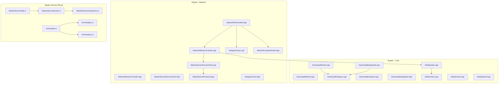
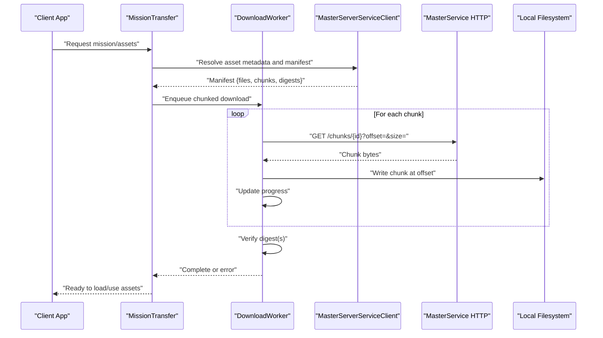
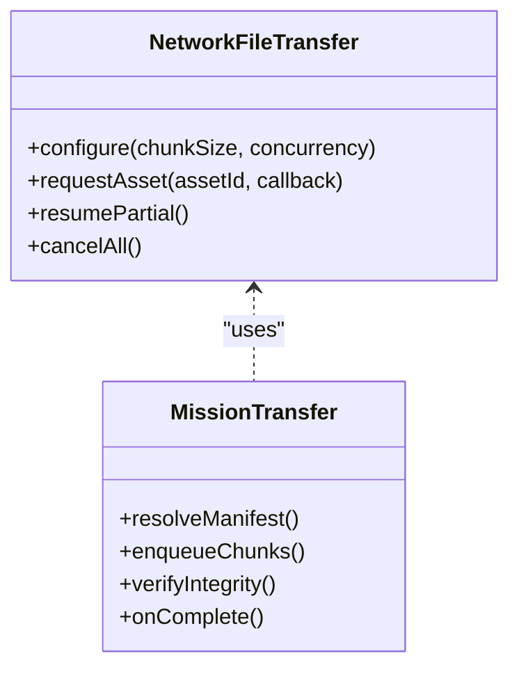
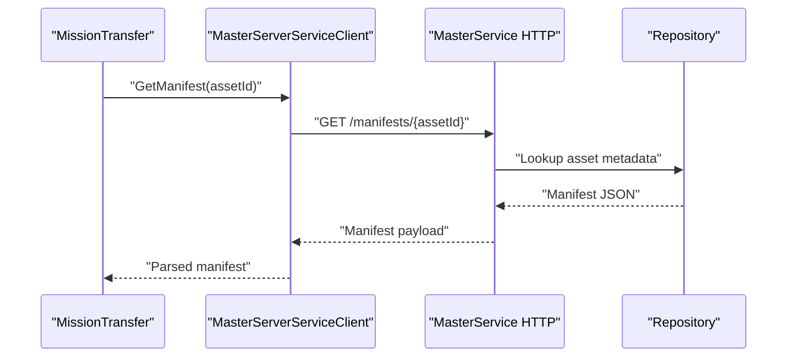
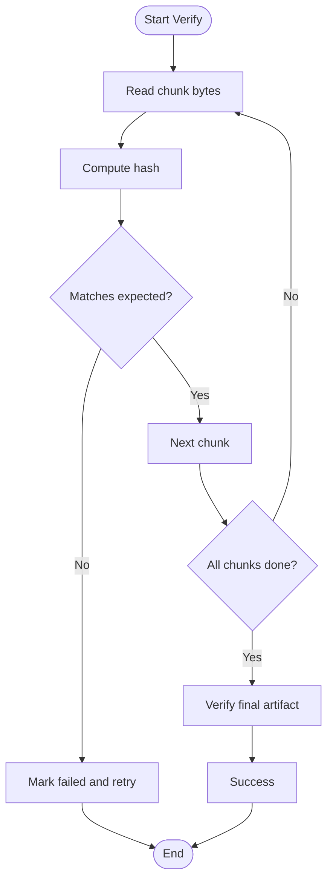
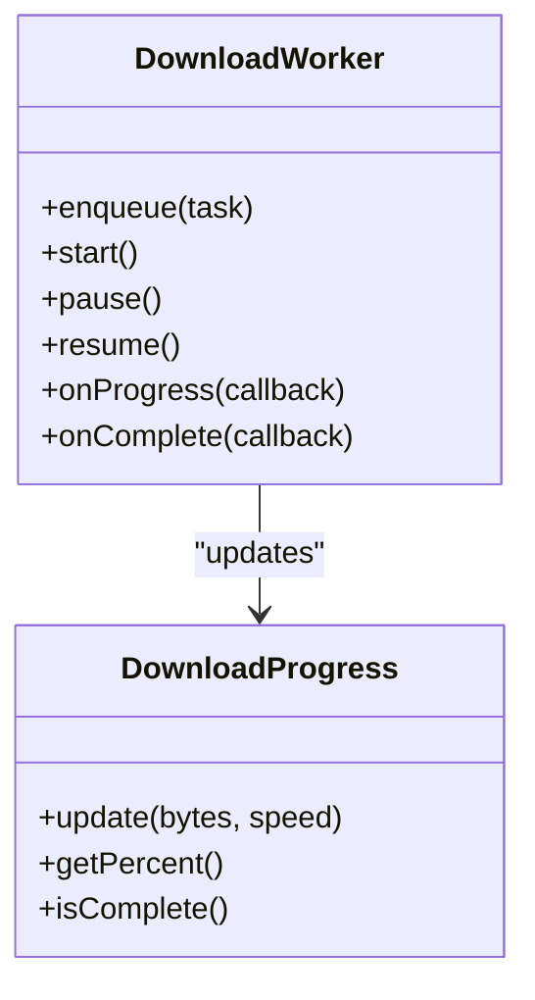
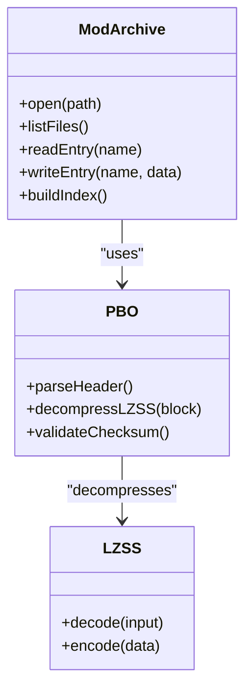
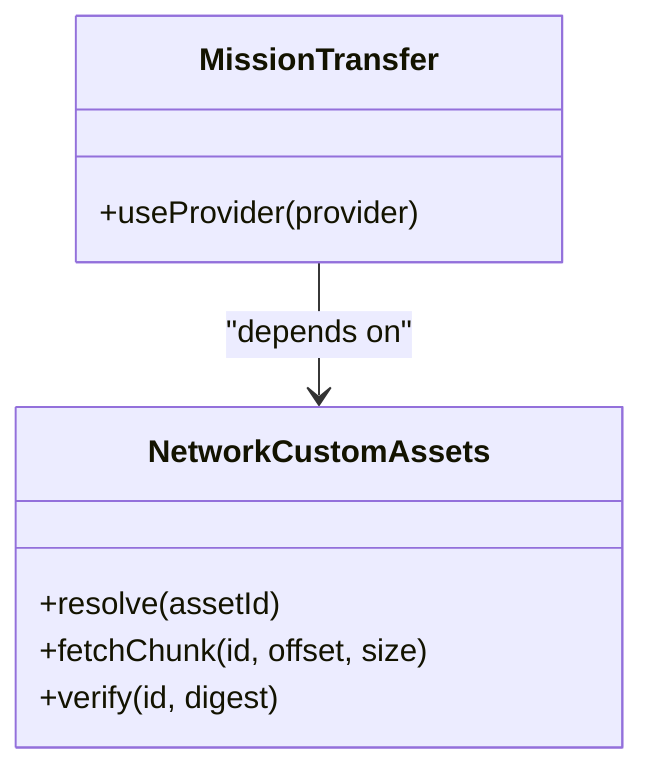
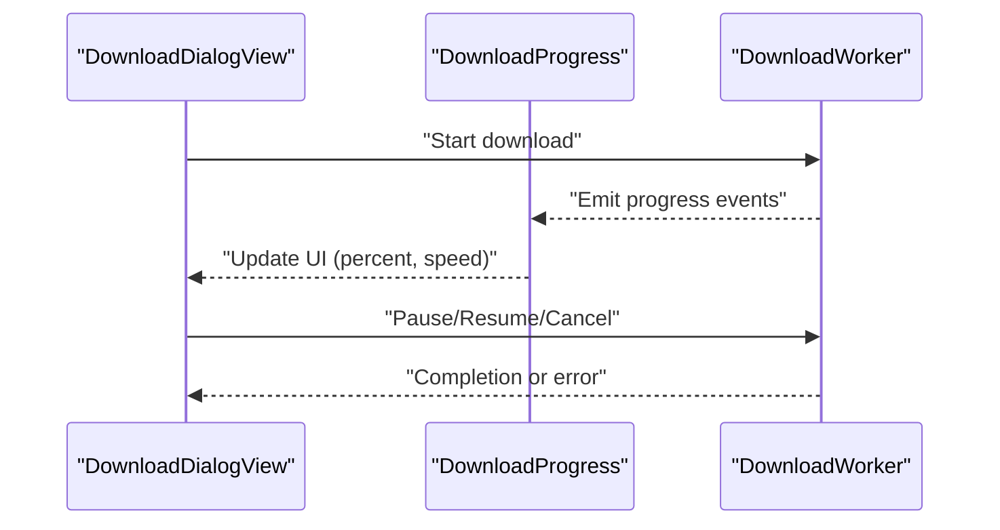
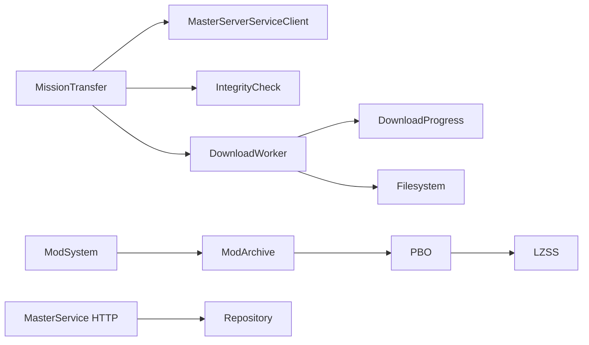

# File Transfer & Asset Delivery

<cite>
**Referenced Files in This Document**
- [NetworkFileTransfer.hpp](file://engine/Poseidon/Network/NetworkFileTransfer.hpp)
- [NetworkMissionTransfer.cpp](file://engine/Poseidon/Network/NetworkMissionTransfer.cpp)
- [NetworkMissionTransfer.hpp](file://engine/Poseidon/Network/NetworkMissionTransfer.hpp)
- [MasterServerServiceClient.cpp](file://engine/Poseidon/Network/MasterServerServiceClient.cpp)
- [MasterServerServiceClient.hpp](file://engine/Poseidon/Network/MasterServerServiceClient.hpp)
- [MasterServerProtocol.hpp](file://engine/Poseidon/Network/MasterServerProtocol.hpp)
- [IntegrityCheck.cpp](file://engine/Poseidon/Network/IntegrityCheck.cpp)
- [IntegrityCheck.hpp](file://engine/Poseidon/Network/IntegrityCheck.hpp)
- [ModArchive.cpp](file://engine/Poseidon/Core/ModArchive.cpp)
- [ModArchive.hpp](file://engine/Poseidon/Core/ModArchive.hpp)
- [ModSystem.cpp](file://engine/Poseidon/Core/ModSystem.cpp)
- [ModSystem.hpp](file://engine/Poseidon/Core/ModSystem.hpp)
- [DownloadWorker.cpp](file://engine/Poseidon/Core/DownloadWorker.cpp)
- [DownloadWorker.hpp](file://engine/Poseidon/Core/DownloadWorker.hpp)
- [DownloadProgress.cpp](file://engine/Poseidon/Core/DownloadProgress.cpp)
- [DownloadProgress.hpp](file://engine/Poseidon/Core/DownloadProgress.hpp)
- [DownloadDialogView.cpp](file://engine/Poseidon/Core/DownloadDialogView.cpp)
- [DownloadDialogView.hpp](file://engine/Poseidon/Core/DownloadDialogView.hpp)
- [pbo.rs](file://mserver/Archive/src/pbo.rs)
- [lzss.rs](file://mserver/Archive/src/lzss.rs)
- [lib.rs](file://mserver/Archive/src/lib.rs)
- [http.rs](file://mserver/MasterService/src/http.rs)
- [mods.rs](file://mserver/MasterService/src/mods.rs)
- [repository.rs](file://mserver/MasterService/src/repository.rs)
- [NetworkCustomAssets.hpp](file://engine/Poseidon/Network/NetworkCustomAssets.hpp)
</cite>

## Table of Contents
1. [Introduction](#introduction)
2. [Project Structure](#project-structure)
3. [Core Components](#core-components)
4. [Architecture Overview](#architecture-overview)
5. [Detailed Component Analysis](#detailed-component-analysis)
6. [Dependency Analysis](#dependency-analysis)
7. [Performance Considerations](#performance-considerations)
8. [Troubleshooting Guide](#troubleshooting-guide)
9. [Conclusion](#conclusion)
10. [Appendices](#appendices)

## Introduction
This document explains the file transfer system that powers mission downloads, mod distribution, and custom asset delivery. It covers the chunked transfer protocol, resume capability, integrity verification, PBO archive handling, compression strategies, incremental updates, master server integration, and the client-side download manager. It also provides guidance for implementing custom asset providers, handling large files, optimizing bandwidth, ensuring security, sandboxing downloaded content, and cleaning up temporary files.

## Project Structure
The file transfer subsystem spans engine networking, core download management, and a Rust-based master service:
- Engine networking layer defines file transfer interfaces and mission transfer logic.
- Core modules implement the download worker, progress tracking, UI, and mod/PBO handling.
- The master service (Rust) exposes HTTP APIs and manages archives including PBO/LZSS.

**Diagram sources**
- [NetworkFileTransfer.hpp](file://engine/Poseidon/Network/NetworkFileTransfer.hpp)
- [NetworkMissionTransfer.cpp](file://engine/Poseidon/Network/NetworkMissionTransfer.cpp)
- [NetworkMissionTransfer.hpp](file://engine/Poseidon/Network/NetworkMissionTransfer.hpp)
- [MasterServerServiceClient.cpp](file://engine/Poseidon/Network/MasterServerServiceClient.cpp)
- [MasterServerServiceClient.hpp](file://engine/Poseidon/Network/MasterServerServiceClient.hpp)
- [MasterServerProtocol.hpp](file://engine/Poseidon/Network/MasterServerProtocol.hpp)
- [IntegrityCheck.cpp](file://engine/Poseidon/Network/IntegrityCheck.cpp)
- [IntegrityCheck.hpp](file://engine/Poseidon/Network/IntegrityCheck.hpp)
- [NetworkCustomAssets.hpp](file://engine/Poseidon/Network/NetworkCustomAssets.hpp)
- [DownloadWorker.cpp](file://engine/Poseidon/Core/DownloadWorker.cpp)
- [DownloadWorker.hpp](file://engine/Poseidon/Core/DownloadWorker.hpp)
- [DownloadProgress.cpp](file://engine/Poseidon/Core/DownloadProgress.cpp)
- [DownloadProgress.hpp](file://engine/Poseidon/Core/DownloadProgress.hpp)
- [DownloadDialogView.cpp](file://engine/Poseidon/Core/DownloadDialogView.cpp)
- [DownloadDialogView.hpp](file://engine/Poseidon/Core/DownloadDialogView.hpp)
- [ModArchive.cpp](file://engine/Poseidon/Core/ModArchive.cpp)
- [ModArchive.hpp](file://engine/Poseidon/Core/ModArchive.hpp)
- [ModSystem.cpp](file://engine/Poseidon/Core/ModSystem.cpp)
- [ModSystem.hpp](file://engine/Poseidon/Core/ModSystem.hpp)
- [lib.rs](file://mserver/Archive/src/lib.rs)
- [pbo.rs](file://mserver/Archive/src/pbo.rs)
- [lzss.rs](file://mserver/Archive/src/lzss.rs)
- [http.rs](file://mserver/MasterService/src/http.rs)
- [mods.rs](file://mserver/MasterService/src/mods.rs)
- [repository.rs](file://mserver/MasterService/src/repository.rs)

**Section sources**
- [NetworkFileTransfer.hpp](file://engine/Poseidon/Network/NetworkFileTransfer.hpp)
- [NetworkMissionTransfer.cpp](file://engine/Poseidon/Network/NetworkMissionTransfer.cpp)
- [NetworkMissionTransfer.hpp](file://engine/Poseidon/Network/NetworkMissionTransfer.hpp)
- [MasterServerServiceClient.cpp](file://engine/Poseidon/Network/MasterServerServiceClient.cpp)
- [MasterServerServiceClient.hpp](file://engine/Poseidon/Network/MasterServerServiceClient.hpp)
- [MasterServerProtocol.hpp](file://engine/Poseidon/Network/MasterServerProtocol.hpp)
- [IntegrityCheck.cpp](file://engine/Poseidon/Network/IntegrityCheck.cpp)
- [IntegrityCheck.hpp](file://engine/Poseidon/Network/IntegrityCheck.hpp)
- [NetworkCustomAssets.hpp](file://engine/Poseidon/Network/NetworkCustomAssets.hpp)
- [DownloadWorker.cpp](file://engine/Poseidon/Core/DownloadWorker.cpp)
- [DownloadWorker.hpp](file://engine/Poseidon/Core/DownloadWorker.hpp)
- [DownloadProgress.cpp](file://engine/Poseidon/Core/DownloadProgress.cpp)
- [DownloadProgress.hpp](file://engine/Poseidon/Core/DownloadProgress.hpp)
- [DownloadDialogView.cpp](file://engine/Poseidon/Core/DownloadDialogView.cpp)
- [DownloadDialogView.hpp](file://engine/Poseidon/Core/DownloadDialogView.hpp)
- [ModArchive.cpp](file://engine/Poseidon/Core/ModArchive.cpp)
- [ModArchive.hpp](file://engine/Poseidon/Core/ModArchive.hpp)
- [ModSystem.cpp](file://engine/Poseidon/Core/ModSystem.cpp)
- [ModSystem.hpp](file://engine/Poseidon/Core/ModSystem.hpp)
- [lib.rs](file://mserver/Archive/src/lib.rs)
- [pbo.rs](file://mserver/Archive/src/pbo.rs)
- [lzss.rs](file://mserver/Archive/src/lzss.rs)
- [http.rs](file://mserver/MasterService/src/http.rs)
- [mods.rs](file://mserver/MasterService/src/mods.rs)
- [repository.rs](file://mserver/MasterService/src/repository.rs)

## Core Components
- File transfer interface and mission transfer controller define how assets are requested, chunked, resumed, and verified.
- Master server client communicates with the Rust master service to resolve asset locations and fetch manifests.
- Integrity check utilities compute and validate checksums for downloaded data.
- Download worker orchestrates concurrent transfers, progress reporting, and completion callbacks.
- Mod system and archive handlers manage PBO packaging, indexing, and loading.
- UI components expose download progress and user controls.

Key responsibilities:
- Chunked transfer protocol: segment large files into manageable chunks, support partial resumes, and reassemble on disk.
- Resume capability: track per-chunk offsets and skip already-transferred segments.
- Integrity verification: compute hashes over chunks and final artifacts; compare against manifest-provided digests.
- PBO handling: read/write PBO archives, decompress LZSS blocks, and maintain file indexes.
- Incremental updates: compare local vs remote manifests to download only changed chunks.
- Security and sandboxing: validate signatures/hashes, isolate execution of scripts, and restrict filesystem access.
- Cleanup: remove temporary files and partial downloads upon success or failure.

**Section sources**
- [NetworkFileTransfer.hpp](file://engine/Poseidon/Network/NetworkFileTransfer.hpp)
- [NetworkMissionTransfer.cpp](file://engine/Poseidon/Network/NetworkMissionTransfer.cpp)
- [NetworkMissionTransfer.hpp](file://engine/Poseidon/Network/NetworkMissionTransfer.hpp)
- [MasterServerServiceClient.cpp](file://engine/Poseidon/Network/MasterServerServiceClient.cpp)
- [MasterServerServiceClient.hpp](file://engine/Poseidon/Network/MasterServerServiceClient.hpp)
- [IntegrityCheck.cpp](file://engine/Poseidon/Network/IntegrityCheck.cpp)
- [IntegrityCheck.hpp](file://engine/Poseidon/Network/IntegrityCheck.hpp)
- [DownloadWorker.cpp](file://engine/Poseidon/Core/DownloadWorker.cpp)
- [DownloadWorker.hpp](file://engine/Poseidon/Core/DownloadWorker.hpp)
- [DownloadProgress.cpp](file://engine/Poseidon/Core/DownloadProgress.cpp)
- [DownloadProgress.hpp](file://engine/Poseidon/Core/DownloadProgress.hpp)
- [DownloadDialogView.cpp](file://engine/Poseidon/Core/DownloadDialogView.cpp)
- [DownloadDialogView.hpp](file://engine/Poseidon/Core/DownloadDialogView.hpp)
- [ModArchive.cpp](file://engine/Poseidon/Core/ModArchive.cpp)
- [ModArchive.hpp](file://engine/Poseidon/Core/ModArchive.hpp)
- [ModSystem.cpp](file://engine/Poseidon/Core/ModSystem.cpp)
- [ModSystem.hpp](file://engine/Poseidon/Core/ModSystem.hpp)

## Architecture Overview
The system integrates three layers:
- Client network layer: requests assets, handles chunked I/O, verifies integrity, and coordinates with the master service.
- Core download manager: schedules tasks, tracks progress, and persists state for resuming.
- Master service: serves manifests and binary chunks via HTTP; maintains repositories and archive formats.

**Diagram sources**
- [NetworkMissionTransfer.cpp](file://engine/Poseidon/Network/NetworkMissionTransfer.cpp)
- [MasterServerServiceClient.cpp](file://engine/Poseidon/Network/MasterServerServiceClient.cpp)
- [MasterServerProtocol.hpp](file://engine/Poseidon/Network/MasterServerProtocol.hpp)
- [DownloadWorker.cpp](file://engine/Poseidon/Core/DownloadWorker.cpp)
- [http.rs](file://mserver/MasterService/src/http.rs)

**Section sources**
- [NetworkMissionTransfer.cpp](file://engine/Poseidon/Network/NetworkMissionTransfer.cpp)
- [MasterServerServiceClient.cpp](file://engine/Poseidon/Network/MasterServerServiceClient.cpp)
- [MasterServerProtocol.hpp](file://engine/Poseidon/Network/MasterServerProtocol.hpp)
- [DownloadWorker.cpp](file://engine/Poseidon/Core/DownloadWorker.cpp)
- [http.rs](file://mserver/MasterService/src/http.rs)

## Detailed Component Analysis

### File Transfer Interface and Mission Transfer Controller
Responsibilities:
- Define chunked transfer semantics: chunk size, max concurrency, retry policy.
- Coordinate manifest retrieval and chunk scheduling.
- Manage resume by persisting per-file offsets and chunk states.
- Integrate integrity checks before marking assets complete.

**Diagram sources**
- [NetworkFileTransfer.hpp](file://engine/Poseidon/Network/NetworkFileTransfer.hpp)
- [NetworkMissionTransfer.cpp](file://engine/Poseidon/Network/NetworkMissionTransfer.cpp)
- [NetworkMissionTransfer.hpp](file://engine/Poseidon/Network/NetworkMissionTransfer.hpp)

**Section sources**
- [NetworkFileTransfer.hpp](file://engine/Poseidon/Network/NetworkFileTransfer.hpp)
- [NetworkMissionTransfer.cpp](file://engine/Poseidon/Network/NetworkMissionTransfer.cpp)
- [NetworkMissionTransfer.hpp](file://engine/Poseidon/Network/NetworkMissionTransfer.hpp)

### Master Server Integration
Responsibilities:
- Resolve asset endpoints and retrieve manifests from the master service.
- Handle authentication, rate limiting, and error responses.
- Support incremental updates by comparing local and remote manifests.

**Diagram sources**
- [MasterServerServiceClient.cpp](file://engine/Poseidon/Network/MasterServerServiceClient.cpp)
- [MasterServerServiceClient.hpp](file://engine/Poseidon/Network/MasterServerServiceClient.hpp)
- [MasterServerProtocol.hpp](file://engine/Poseidon/Network/MasterServerProtocol.hpp)
- [http.rs](file://mserver/MasterService/src/http.rs)
- [repository.rs](file://mserver/MasterService/src/repository.rs)

**Section sources**
- [MasterServerServiceClient.cpp](file://engine/Poseidon/Network/MasterServerServiceClient.cpp)
- [MasterServerServiceClient.hpp](file://engine/Poseidon/Network/MasterServerServiceClient.hpp)
- [MasterServerProtocol.hpp](file://engine/Poseidon/Network/MasterServerProtocol.hpp)
- [http.rs](file://mserver/MasterService/src/http.rs)
- [repository.rs](file://mserver/MasterService/src/repository.rs)

### Integrity Verification
Responsibilities:
- Compute checksums over individual chunks and final artifacts.
- Compare computed digests with manifest-provided values.
- Fail fast on mismatches and trigger retries or redownload.

**Diagram sources**
- [IntegrityCheck.cpp](file://engine/Poseidon/Network/IntegrityCheck.cpp)
- [IntegrityCheck.hpp](file://engine/Poseidon/Network/IntegrityCheck.hpp)

**Section sources**
- [IntegrityCheck.cpp](file://engine/Poseidon/Network/IntegrityCheck.cpp)
- [IntegrityCheck.hpp](file://engine/Poseidon/Network/IntegrityCheck.hpp)

### Download Worker and Progress Tracking
Responsibilities:
- Schedule and execute chunked downloads concurrently.
- Persist partial state for resume across sessions.
- Emit progress events and handle completion/error callbacks.

**Diagram sources**
- [DownloadWorker.cpp](file://engine/Poseidon/Core/DownloadWorker.cpp)
- [DownloadWorker.hpp](file://engine/Poseidon/Core/DownloadWorker.hpp)
- [DownloadProgress.cpp](file://engine/Poseidon/Core/DownloadProgress.cpp)
- [DownloadProgress.hpp](file://engine/Poseidon/Core/DownloadProgress.hpp)

**Section sources**
- [DownloadWorker.cpp](file://engine/Poseidon/Core/DownloadWorker.cpp)
- [DownloadWorker.hpp](file://engine/Poseidon/Core/DownloadWorker.hpp)
- [DownloadProgress.cpp](file://engine/Poseidon/Core/DownloadProgress.cpp)
- [DownloadProgress.hpp](file://engine/Poseidon/Core/DownloadProgress.hpp)

### PBO Archive Handling and Compression
Responsibilities:
- Parse and write PBO archives, including directory index and compressed entries.
- Decompress LZSS blocks during reads and compress when building archives.
- Maintain file metadata and support incremental updates by comparing indices.

**Diagram sources**
- [ModArchive.cpp](file://engine/Poseidon/Core/ModArchive.cpp)
- [ModArchive.hpp](file://engine/Poseidon/Core/ModArchive.hpp)
- [pbo.rs](file://mserver/Archive/src/pbo.rs)
- [lzss.rs](file://mserver/Archive/src/lzss.rs)
- [lib.rs](file://mserver/Archive/src/lib.rs)

**Section sources**
- [ModArchive.cpp](file://engine/Poseidon/Core/ModArchive.cpp)
- [ModArchive.hpp](file://engine/Poseidon/Core/ModArchive.hpp)
- [pbo.rs](file://mserver/Archive/src/pbo.rs)
- [lzss.rs](file://mserver/Archive/src/lzss.rs)
- [lib.rs](file://mserver/Archive/src/lib.rs)

### Custom Asset Providers
Responsibilities:
- Implement provider interfaces to supply assets from alternative sources (e.g., CDN, local cache).
- Provide manifest resolution, chunk fetching, and integrity validation hooks.
- Integrate seamlessly with the download worker and mission transfer controller.

**Diagram sources**
- [NetworkCustomAssets.hpp](file://engine/Poseidon/Network/NetworkCustomAssets.hpp)
- [NetworkMissionTransfer.cpp](file://engine/Poseidon/Network/NetworkMissionTransfer.cpp)

**Section sources**
- [NetworkCustomAssets.hpp](file://engine/Poseidon/Network/NetworkCustomAssets.hpp)
- [NetworkMissionTransfer.cpp](file://engine/Poseidon/Network/NetworkMissionTransfer.cpp)

### UI Integration for Downloads
Responsibilities:
- Display progress, status, and errors to users.
- Allow pausing/resuming and cancellation.
- Reflect real-time throughput and remaining time estimates.

**Diagram sources**
- [DownloadDialogView.cpp](file://engine/Poseidon/Core/DownloadDialogView.cpp)
- [DownloadDialogView.hpp](file://engine/Poseidon/Core/DownloadDialogView.hpp)
- [DownloadProgress.cpp](file://engine/Poseidon/Core/DownloadProgress.cpp)
- [DownloadProgress.hpp](file://engine/Poseidon/Core/DownloadProgress.hpp)
- [DownloadWorker.cpp](file://engine/Poseidon/Core/DownloadWorker.cpp)

**Section sources**
- [DownloadDialogView.cpp](file://engine/Poseidon/Core/DownloadDialogView.cpp)
- [DownloadDialogView.hpp](file://engine/Poseidon/Core/DownloadDialogView.hpp)
- [DownloadProgress.cpp](file://engine/Poseidon/Core/DownloadProgress.cpp)
- [DownloadProgress.hpp](file://engine/Poseidon/Core/DownloadProgress.hpp)
- [DownloadWorker.cpp](file://engine/Poseidon/Core/DownloadWorker.cpp)

## Dependency Analysis
The file transfer system exhibits clear separation between networking, core orchestration, and asset storage:
- Mission transfer depends on master server client and integrity checks.
- Download worker is independent but driven by mission transfer and UI.
- Mod system relies on archive handlers for PBO operations.
- Master service exposes HTTP endpoints consumed by the client.

**Diagram sources**
- [NetworkMissionTransfer.cpp](file://engine/Poseidon/Network/NetworkMissionTransfer.cpp)
- [MasterServerServiceClient.cpp](file://engine/Poseidon/Network/MasterServerServiceClient.cpp)
- [IntegrityCheck.cpp](file://engine/Poseidon/Network/IntegrityCheck.cpp)
- [DownloadWorker.cpp](file://engine/Poseidon/Core/DownloadWorker.cpp)
- [DownloadProgress.cpp](file://engine/Poseidon/Core/DownloadProgress.cpp)
- [ModSystem.cpp](file://engine/Poseidon/Core/ModSystem.cpp)
- [ModArchive.cpp](file://engine/Poseidon/Core/ModArchive.cpp)
- [pbo.rs](file://mserver/Archive/src/pbo.rs)
- [lzss.rs](file://mserver/Archive/src/lzss.rs)
- [http.rs](file://mserver/MasterService/src/http.rs)
- [repository.rs](file://mserver/MasterService/src/repository.rs)

**Section sources**
- [NetworkMissionTransfer.cpp](file://engine/Poseidon/Network/NetworkMissionTransfer.cpp)
- [MasterServerServiceClient.cpp](file://engine/Poseidon/Network/MasterServerServiceClient.cpp)
- [IntegrityCheck.cpp](file://engine/Poseidon/Network/IntegrityCheck.cpp)
- [DownloadWorker.cpp](file://engine/Poseidon/Core/DownloadWorker.cpp)
- [DownloadProgress.cpp](file://engine/Poseidon/Core/DownloadProgress.cpp)
- [ModSystem.cpp](file://engine/Poseidon/Core/ModSystem.cpp)
- [ModArchive.cpp](file://engine/Poseidon/Core/ModArchive.cpp)
- [pbo.rs](file://mserver/Archive/src/pbo.rs)
- [lzss.rs](file://mserver/Archive/src/lzss.rs)
- [http.rs](file://mserver/MasterService/src/http.rs)
- [repository.rs](file://mserver/MasterService/src/repository.rs)

## Performance Considerations
- Chunk sizing: tune chunk size to balance overhead and resume granularity; larger chunks reduce HTTP overhead but increase resume cost.
- Concurrency: limit parallel downloads to avoid saturating network or disk; use adaptive throttling based on bandwidth and latency.
- Caching: cache manifests and frequently accessed chunks locally to reduce repeated downloads.
- Compression: prefer server-side compression for large assets; ensure clients can decompress efficiently.
- Incremental updates: compare manifests to minimize data transfer; only download changed chunks.
- I/O buffering: use buffered writes and sequential I/O patterns to improve disk throughput.
- Memory usage: stream chunks without loading entire files into memory; reuse buffers where possible.

[No sources needed since this section provides general guidance]

## Troubleshooting Guide
Common issues and resolutions:
- Checksum mismatch: verify manifest integrity, re-download affected chunks, and inspect network errors.
- Resume failures: ensure partial files are not corrupted; reset offsets and restart downloads.
- Slow downloads: adjust concurrency and chunk size; check server rate limits and network conditions.
- PBO parsing errors: validate archive headers and entry checksums; rebuild archives if necessary.
- Temporary file cleanup: confirm cleanup routines run on success and failure paths; manually remove orphaned temp files.

**Section sources**
- [IntegrityCheck.cpp](file://engine/Poseidon/Network/IntegrityCheck.cpp)
- [DownloadWorker.cpp](file://engine/Poseidon/Core/DownloadWorker.cpp)
- [ModArchive.cpp](file://engine/Poseidon/Core/ModArchive.cpp)

## Conclusion
The file transfer system provides robust, resumable, and verifiable downloads for missions, mods, and custom assets. By leveraging chunked transfers, integrity checks, and incremental updates, it ensures efficient bandwidth usage and reliable delivery. Integration with the master server enables centralized asset hosting, while the client-side download manager offers flexible orchestration and user feedback. Proper security measures, sandboxing, and cleanup mechanisms protect users and maintain system hygiene.

[No sources needed since this section summarizes without analyzing specific files]

## Appendices

### Implementing a Custom Asset Provider
Steps:
- Implement provider methods for manifest resolution, chunk fetching, and integrity verification.
- Register the provider with the mission transfer controller.
- Ensure compatibility with chunk sizes and resume semantics.

**Section sources**
- [NetworkCustomAssets.hpp](file://engine/Poseidon/Network/NetworkCustomAssets.hpp)
- [NetworkMissionTransfer.cpp](file://engine/Poseidon/Network/NetworkMissionTransfer.cpp)

### Handling Large File Transfers
Guidelines:
- Use streaming I/O to avoid memory spikes.
- Enable resume by persisting offsets and chunk states.
- Monitor bandwidth and adapt concurrency dynamically.

**Section sources**
- [DownloadWorker.cpp](file://engine/Poseidon/Core/DownloadWorker.cpp)
- [DownloadProgress.cpp](file://engine/Poseidon/Core/DownloadProgress.cpp)

### Optimizing Bandwidth Usage
Recommendations:
- Prefer incremental updates using manifest diffs.
- Compress assets server-side and leverage caching.
- Batch small requests and coalesce responses when possible.

**Section sources**
- [MasterServerServiceClient.cpp](file://engine/Poseidon/Network/MasterServerServiceClient.cpp)
- [http.rs](file://mserver/MasterService/src/http.rs)

### Security and Sandboxing
Best practices:
- Validate all downloaded content against trusted digests.
- Restrict script execution to sandboxed environments.
- Limit filesystem access to designated directories.

**Section sources**
- [IntegrityCheck.cpp](file://engine/Poseidon/Network/IntegrityCheck.cpp)
- [ModSystem.cpp](file://engine/Poseidon/Core/ModSystem.cpp)

### Automatic Cleanup of Temporary Files
Procedures:
- Remove partial downloads on successful completion.
- Clean up on errors or cancellations.
- Periodically scan for orphaned temp files and delete them.

**Section sources**
- [DownloadWorker.cpp](file://engine/Poseidon/Core/DownloadWorker.cpp)
- [ModArchive.cpp](file://engine/Poseidon/Core/ModArchive.cpp)