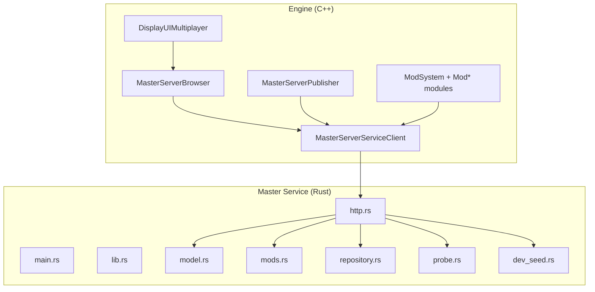
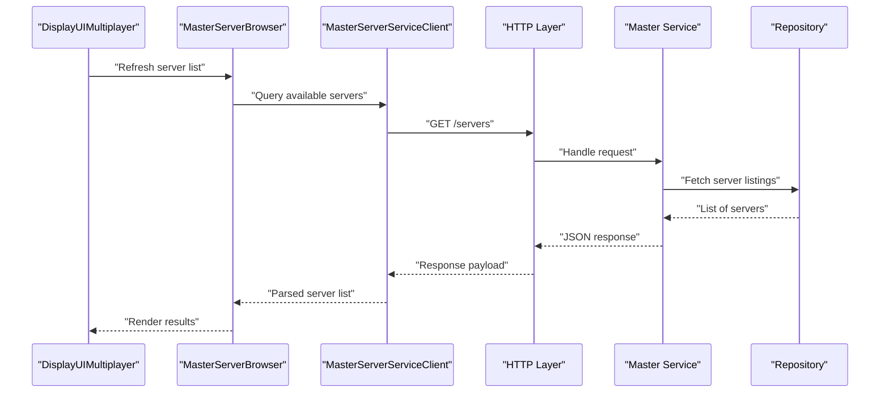
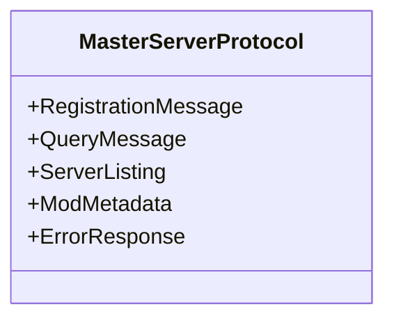
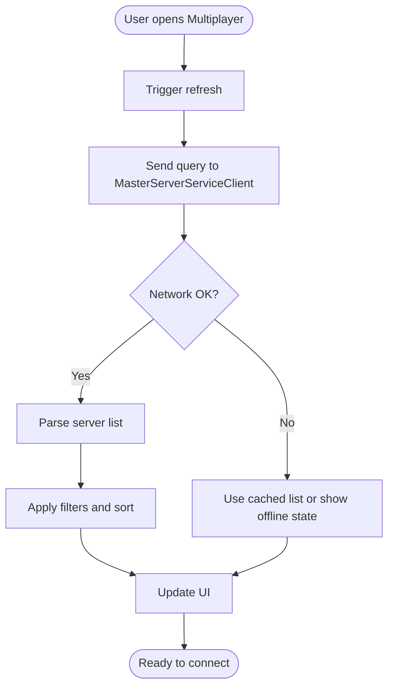
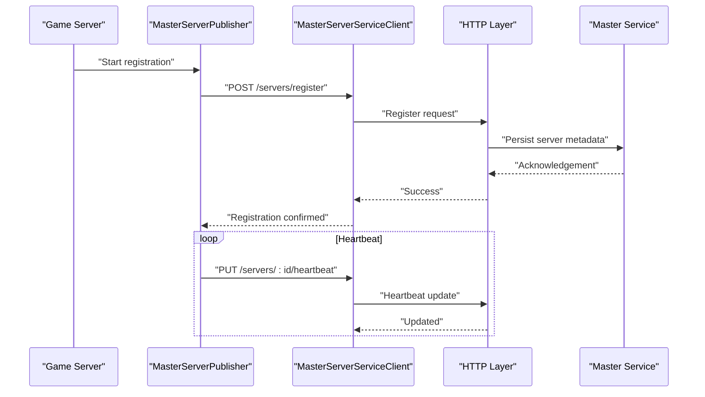
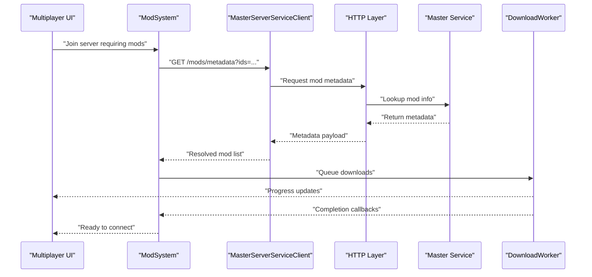
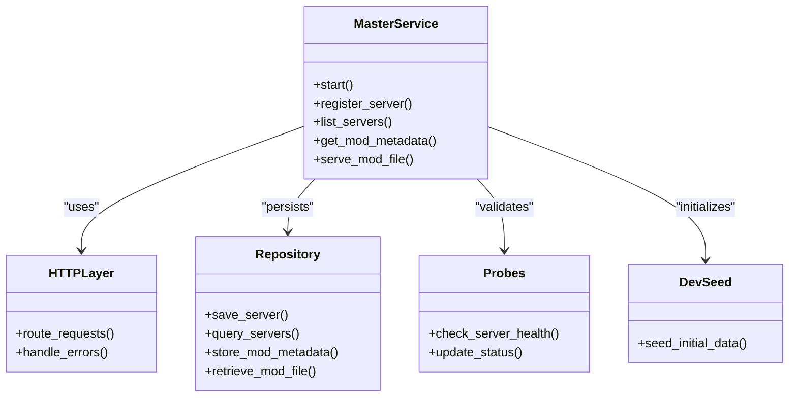
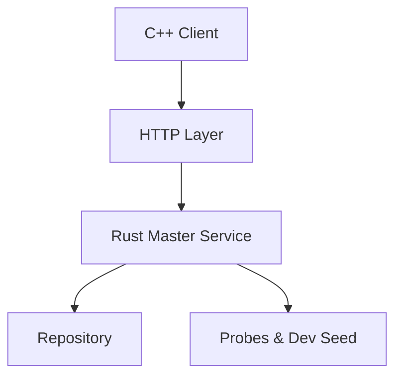

# Master Server Integration

<cite>
**Referenced Files in This Document**
- [MasterServerProtocol.hpp](file://engine/Poseidon/Network/MasterServerProtocol.hpp)
- [MasterServerBrowser.cpp](file://engine/Poseidon/Network/MasterServerBrowser.cpp)
- [MasterServerBrowser.hpp](file://engine/Poseidon/Network/MasterServerBrowser.hpp)
- [MasterServerPublisher.cpp](file://engine/Poseidon/Network/MasterServerPublisher.cpp)
- [MasterServerPublisher.hpp](file://engine/Poseidon/Network/MasterServerPublisher.hpp)
- [MasterServerServiceClient.cpp](file://engine/Poseidon/Network/MasterServerServiceClient.cpp)
- [MasterServerServiceClient.hpp](file://engine/Poseidon/Network/MasterServerServiceClient.hpp)
- [lib.rs](file://mserver/MasterService/src/lib.rs)
- [main.rs](file://mserver/MasterService/src/main.rs)
- [http.rs](file://mserver/MasterService/src/http.rs)
- [model.rs](file://mserver/MasterService/src/model.rs)
- [mods.rs](file://mserver/MasterService/src/mods.rs)
- [repository.rs](file://mserver/MasterService/src/repository.rs)
- [probe.rs](file://mserver/MasterService/src/probe.rs)
- [dev_seed.rs](file://mserver/MasterService/src/dev_seed.rs)
- [Cargo.toml](file://mserver/MasterService/Cargo.toml)
- [Dockerfile](file://docker/papa-bear-master-service/Dockerfile)
- [DisplayUIMultiplayer.cpp](file://engine/Poseidon/UI/DisplayUIMultiplayer.cpp)
- [ModSystem.cpp](file://engine/Poseidon/Core/ModSystem.cpp)
- [ModSystem.hpp](file://engine/Poseidon/Core/ModSystem.hpp)
- [ModArchive.cpp](file://engine/Poseidon/Core/ModArchive.cpp)
- [ModCollection.cpp](file://engine/Poseidon/Core/ModCollection.cpp)
- [ModInstall.cpp](file://engine/Poseidon/Core/ModInstall.cpp)
- [ModSelection.cpp](file://engine/Poseidon/Core/ModSelection.cpp)
- [ServerModResolve.cpp](file://engine/Poseidon/Core/ServerModResolve.cpp)
- [RateLimit.hpp](file://engine/Poseidon/Network/RateLimit.hpp)
- [DownloadDialogView.cpp](file://engine/Poseidon/Core/DownloadDialogView.cpp)
- [DownloadProgress.cpp](file://engine/Poseidon/Core/DownloadProgress.cpp)
- [DownloadWorker.cpp](file://engine/Poseidon/Core/DownloadWorker.cpp)
</cite>

## Table of Contents
1. [Introduction](#introduction)
2. [Project Structure](#project-structure)
3. [Core Components](#core-components)
4. [Architecture Overview](#architecture-overview)
5. [Detailed Component Analysis](#detailed-component-analysis)
6. [Dependency Analysis](#dependency-analysis)
7. [Performance Considerations](#performance-considerations)
8. [Troubleshooting Guide](#troubleshooting-guide)
9. [Conclusion](#conclusion)
10. [Appendices](#appendices)

## Introduction
This document explains master server integration for discovering multiplayer games, distributing mods, and maintaining server listings. It covers the client-side browser and publisher components, the Rust-based master service implementation, HTTP API endpoints, and database interactions. It also provides guidance on integrating with external master servers, implementing custom discovery protocols, handling availability checks, caching strategies, rate limiting, and fallback mechanisms when the master server is unavailable.

## Project Structure
The master server integration spans two main areas:
- Engine (C++): Client-side components for browsing servers, publishing server metadata, and downloading mods via a master service client.
- Master Service (Rust): A standalone HTTP service that stores server listings and mod metadata, serves downloads, and exposes APIs for clients.

**Diagram sources**
- [MasterServerBrowser.cpp](file://engine/Poseidon/Network/MasterServerBrowser.cpp)
- [MasterServerPublisher.cpp](file://engine/Poseidon/Network/MasterServerPublisher.cpp)
- [MasterServerServiceClient.cpp](file://engine/Poseidon/Network/MasterServerServiceClient.cpp)
- [DisplayUIMultiplayer.cpp](file://engine/Poseidon/UI/DisplayUIMultiplayer.cpp)
- [ModSystem.cpp](file://engine/Poseidon/Core/ModSystem.cpp)
- [lib.rs](file://mserver/MasterService/src/lib.rs)
- [main.rs](file://mserver/MasterService/src/main.rs)
- [http.rs](file://mserver/MasterService/src/http.rs)
- [model.rs](file://mserver/MasterService/src/model.rs)
- [mods.rs](file://mserver/MasterService/src/mods.rs)
- [repository.rs](file://mserver/MasterService/src/repository.rs)
- [probe.rs](file://mserver/MasterService/src/probe.rs)
- [dev_seed.rs](file://mserver/MasterService/src/dev_seed.rs)

**Section sources**
- [MasterServerProtocol.hpp](file://engine/Poseidon/Network/MasterServerProtocol.hpp)
- [MasterServerBrowser.hpp](file://engine/Poseidon/Network/MasterServerBrowser.hpp)
- [MasterServerPublisher.hpp](file://engine/Poseidon/Network/MasterServerPublisher.hpp)
- [MasterServerServiceClient.hpp](file://engine/Poseidon/Network/MasterServerServiceClient.hpp)
- [lib.rs](file://mserver/MasterService/src/lib.rs)
- [main.rs](file://mserver/MasterService/src/main.rs)
- [http.rs](file://mserver/MasterService/src/http.rs)
- [model.rs](file://mserver/MasterService/src/model.rs)
- [mods.rs](file://mserver/MasterService/src/mods.rs)
- [repository.rs](file://mserver/MasterService/src/repository.rs)
- [probe.rs](file://mserver/MasterService/src/probe.rs)
- [dev_seed.rs](file://mserver/MasterService/src/dev_seed.rs)
- [DisplayUIMultiplayer.cpp](file://engine/Poseidon/UI/DisplayUIMultiplayer.cpp)
- [ModSystem.cpp](file://engine/Poseidon/Core/ModSystem.cpp)
- [ModSystem.hpp](file://engine/Poseidon/Core/ModSystem.hpp)
- [ModArchive.cpp](file://engine/Poseidon/Core/ModArchive.cpp)
- [ModCollection.cpp](file://engine/Poseidon/Core/ModCollection.cpp)
- [ModInstall.cpp](file://engine/Poseidon/Core/ModInstall.cpp)
- [ModSelection.cpp](file://engine/Poseidon/Core/ModSelection.cpp)
- [ServerModResolve.cpp](file://engine/Poseidon/Core/ServerModResolve.cpp)
- [RateLimit.hpp](file://engine/Poseidon/Network/RateLimit.hpp)
- [DownloadDialogView.cpp](file://engine/Poseidon/Core/DownloadDialogView.cpp)
- [DownloadProgress.cpp](file://engine/Poseidon/Core/DownloadProgress.cpp)
- [DownloadWorker.cpp](file://engine/Poseidon/Core/DownloadWorker.cpp)

## Core Components
- MasterServerProtocol: Defines message types and structures used by the master server protocol for registration, queries, and responses.
- MasterServerBrowser: Implements game discovery by querying the master service for available servers and rendering results in the UI.
- MasterServerPublisher: Registers and updates server metadata with the master service, ensuring listings remain current.
- MasterServerServiceClient: Encapsulates HTTP communication with the Rust master service, including request/response handling and error management.
- ModSystem and related modules: Coordinate mod resolution, selection, installation, and download workflows triggered by server requirements or user actions.
- Rust Master Service: Provides HTTP endpoints for server listing, mod metadata, and file distribution; persists data via repository layer; includes probes and dev seeding utilities.

**Section sources**
- [MasterServerProtocol.hpp](file://engine/Poseidon/Network/MasterServerProtocol.hpp)
- [MasterServerBrowser.cpp](file://engine/Poseidon/Network/MasterServerBrowser.cpp)
- [MasterServerBrowser.hpp](file://engine/Poseidon/Network/MasterServerBrowser.hpp)
- [MasterServerPublisher.cpp](file://engine/Poseidon/Network/MasterServerPublisher.cpp)
- [MasterServerPublisher.hpp](file://engine/Poseidon/Network/MasterServerPublisher.hpp)
- [MasterServerServiceClient.cpp](file://engine/Poseidon/Network/MasterServerServiceClient.cpp)
- [MasterServerServiceClient.hpp](file://engine/Poseidon/Network/MasterServerServiceClient.hpp)
- [ModSystem.cpp](file://engine/Poseidon/Core/ModSystem.cpp)
- [ModSystem.hpp](file://engine/Poseidon/Core/ModSystem.hpp)
- [ModArchive.cpp](file://engine/Poseidon/Core/ModArchive.cpp)
- [ModCollection.cpp](file://engine/Poseidon/Core/ModCollection.cpp)
- [ModInstall.cpp](file://engine/Poseidon/Core/ModInstall.cpp)
- [ModSelection.cpp](file://engine/Poseidon/Core/ModSelection.cpp)
- [ServerModResolve.cpp](file://engine/Poseidon/Core/ServerModResolve.cpp)
- [lib.rs](file://mserver/MasterService/src/lib.rs)
- [main.rs](file://mserver/MasterService/src/main.rs)
- [http.rs](file://mserver/MasterService/src/http.rs)
- [model.rs](file://mserver/MasterService/src/model.rs)
- [mods.rs](file://mserver/MasterService/src/mods.rs)
- [repository.rs](file://mserver/MasterService/src/repository.rs)
- [probe.rs](file://mserver/MasterService/src/probe.rs)
- [dev_seed.rs](file://mserver/MasterService/src/dev_seed.rs)

## Architecture Overview
The architecture separates client responsibilities from the centralized master service:
- Clients use the browser to discover servers and the publisher to register/update listings.
- The service exposes HTTP endpoints for listing servers, retrieving mod metadata, and serving files.
- Persistence is abstracted through a repository layer, enabling flexible storage backends.
- Probes validate server availability; dev seeding populates initial data for development.

**Diagram sources**
- [DisplayUIMultiplayer.cpp](file://engine/Poseidon/UI/DisplayUIMultiplayer.cpp)
- [MasterServerBrowser.cpp](file://engine/Poseidon/Network/MasterServerBrowser.cpp)
- [MasterServerServiceClient.cpp](file://engine/Poseidon/Network/MasterServerServiceClient.cpp)
- [http.rs](file://mserver/MasterService/src/http.rs)
- [repository.rs](file://mserver/MasterService/src/repository.rs)

**Section sources**
- [MasterServerServiceClient.hpp](file://engine/Poseidon/Network/MasterServerServiceClient.hpp)
- [http.rs](file://mserver/MasterService/src/http.rs)
- [repository.rs](file://mserver/MasterService/src/repository.rs)

## Detailed Component Analysis

### Master Server Protocol
Defines the structure and semantics of messages exchanged between clients and the master service. Includes registration payloads, query filters, and response formats for server listings and mod metadata.

**Diagram sources**
- [MasterServerProtocol.hpp](file://engine/Poseidon/Network/MasterServerProtocol.hpp)

**Section sources**
- [MasterServerProtocol.hpp](file://engine/Poseidon/Network/MasterServerProtocol.hpp)

### Game Discovery (Browser)
The browser component queries the master service for available servers, applies filters, and presents results in the multiplayer UI. It handles pagination, sorting, and refresh cycles.

**Diagram sources**
- [MasterServerBrowser.cpp](file://engine/Poseidon/Network/MasterServerBrowser.cpp)
- [MasterServerServiceClient.cpp](file://engine/Poseidon/Network/MasterServerServiceClient.cpp)
- [DisplayUIMultiplayer.cpp](file://engine/Poseidon/UI/DisplayUIMultiplayer.cpp)

**Section sources**
- [MasterServerBrowser.cpp](file://engine/Poseidon/Network/MasterServerBrowser.cpp)
- [MasterServerBrowser.hpp](file://engine/Poseidon/Network/MasterServerBrowser.hpp)
- [DisplayUIMultiplayer.cpp](file://engine/Poseidon/UI/DisplayUIMultiplayer.cpp)

### Server Registration (Publisher)
Servers publish their presence and metadata to the master service. The publisher manages heartbeat updates, versioning, and error retries.

**Diagram sources**
- [MasterServerPublisher.cpp](file://engine/Poseidon/Network/MasterServerPublisher.cpp)
- [MasterServerServiceClient.cpp](file://engine/Poseidon/Network/MasterServerServiceClient.cpp)
- [http.rs](file://mserver/MasterService/src/http.rs)

**Section sources**
- [MasterServerPublisher.cpp](file://engine/Poseidon/Network/MasterServerPublisher.cpp)
- [MasterServerPublisher.hpp](file://engine/Poseidon/Network/MasterServerPublisher.hpp)

### Mod Distribution
Mod distribution integrates with the master service to resolve required mods for a server and download them. The flow includes dependency resolution, validation, and progress tracking.

**Diagram sources**
- [ModSystem.cpp](file://engine/Poseidon/Core/ModSystem.cpp)
- [MasterServerServiceClient.cpp](file://engine/Poseidon/Network/MasterServerServiceClient.cpp)
- [http.rs](file://mserver/MasterService/src/http.rs)
- [mods.rs](file://mserver/MasterService/src/mods.rs)
- [DownloadWorker.cpp](file://engine/Poseidon/Core/DownloadWorker.cpp)

**Section sources**
- [ModSystem.cpp](file://engine/Poseidon/Core/ModSystem.cpp)
- [ModSystem.hpp](file://engine/Poseidon/Core/ModSystem.hpp)
- [ModArchive.cpp](file://engine/Poseidon/Core/ModArchive.cpp)
- [ModCollection.cpp](file://engine/Poseidon/Core/ModCollection.cpp)
- [ModInstall.cpp](file://engine/Poseidon/Core/ModInstall.cpp)
- [ModSelection.cpp](file://engine/Poseidon/Core/ModSelection.cpp)
- [ServerModResolve.cpp](file://engine/Poseidon/Core/ServerModResolve.cpp)
- [DownloadDialogView.cpp](file://engine/Poseidon/Core/DownloadDialogView.cpp)
- [DownloadProgress.cpp](file://engine/Poseidon/Core/DownloadProgress.cpp)
- [DownloadWorker.cpp](file://engine/Poseidon/Core/DownloadWorker.cpp)

### Rust Master Service
The Rust-based master service implements HTTP endpoints for server listings, mod metadata, and file distribution. It uses a repository layer for persistence and includes utilities for probing server health and seeding development data.

**Diagram sources**
- [lib.rs](file://mserver/MasterService/src/lib.rs)
- [main.rs](file://mserver/MasterService/src/main.rs)
- [http.rs](file://mserver/MasterService/src/http.rs)
- [repository.rs](file://mserver/MasterService/src/repository.rs)
- [probe.rs](file://mserver/MasterService/src/probe.rs)
- [dev_seed.rs](file://mserver/MasterService/src/dev_seed.rs)

**Section sources**
- [lib.rs](file://mserver/MasterService/src/lib.rs)
- [main.rs](file://mserver/MasterService/src/main.rs)
- [http.rs](file://mserver/MasterService/src/http.rs)
- [model.rs](file://mserver/MasterService/src/model.rs)
- [mods.rs](file://mserver/MasterService/src/mods.rs)
- [repository.rs](file://mserver/MasterService/src/repository.rs)
- [probe.rs](file://mserver/MasterService/src/probe.rs)
- [dev_seed.rs](file://mserver/MasterService/src/dev_seed.rs)

## Dependency Analysis
The master server integration has clear separation between client and service layers:
- C++ client components depend on the HTTP layer and master service endpoints.
- The Rust service depends on repository implementations and utility modules.
- External dependencies include networking libraries, serialization formats, and storage backends.

**Diagram sources**
- [MasterServerServiceClient.cpp](file://engine/Poseidon/Network/MasterServerServiceClient.cpp)
- [http.rs](file://mserver/MasterService/src/http.rs)
- [repository.rs](file://mserver/MasterService/src/repository.rs)
- [probe.rs](file://mserver/MasterService/src/probe.rs)
- [dev_seed.rs](file://mserver/MasterService/src/dev_seed.rs)

**Section sources**
- [MasterServerServiceClient.hpp](file://engine/Poseidon/Network/MasterServerServiceClient.hpp)
- [http.rs](file://mserver/MasterService/src/http.rs)
- [repository.rs](file://mserver/MasterService/src/repository.rs)

## Performance Considerations
- Caching: Implement local caching for server listings and mod metadata to reduce network load and improve responsiveness.
- Rate Limiting: Use rate limiters to prevent excessive requests to the master service and avoid throttling.
- Concurrency: Parallelize mod downloads and server queries while managing resource constraints.
- Connection Pooling: Reuse HTTP connections to minimize overhead during frequent requests.
- Pagination: Support paginated responses for large server lists to reduce memory usage.

[No sources needed since this section provides general guidance]

## Troubleshooting Guide
Common issues and resolutions:
- Master Service Unavailable: Detect failures and fall back to cached data or alternative endpoints.
- Mod Download Failures: Validate checksums, retry failed downloads, and provide user feedback.
- Server Listing Staleness: Implement heartbeat mechanisms and periodic refreshes.
- Rate Limit Errors: Back off and retry with exponential delay.

**Section sources**
- [RateLimit.hpp](file://engine/Poseidon/Network/RateLimit.hpp)
- [DownloadDialogView.cpp](file://engine/Poseidon/Core/DownloadDialogView.cpp)
- [DownloadProgress.cpp](file://engine/Poseidon/Core/DownloadProgress.cpp)
- [DownloadWorker.cpp](file://engine/Poseidon/Core/DownloadWorker.cpp)

## Conclusion
The master server integration provides a robust framework for multiplayer game discovery, mod distribution, and server listing management. By separating client responsibilities from the centralized master service, the system achieves scalability and maintainability. Proper caching, rate limiting, and fallback mechanisms ensure reliability even under adverse conditions.

[No sources needed since this section summarizes without analyzing specific files]

## Appendices

### Docker Deployment
The master service can be containerized using the provided Dockerfile for consistent deployment across environments.

**Section sources**
- [Dockerfile](file://docker/papa-bear-master-service/Dockerfile)
- [Cargo.toml](file://mserver/MasterService/Cargo.toml)

### Integration Examples
- External Master Servers: Configure the client to point to different master service endpoints.
- Custom Discovery Protocols: Extend the protocol definitions to support additional query parameters.
- Availability Checks: Implement probe logic to verify server health before connecting.

[No sources needed since this section provides general guidance]