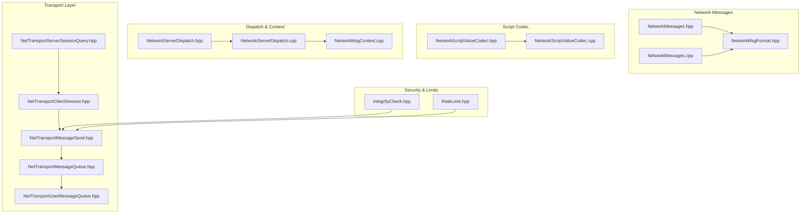
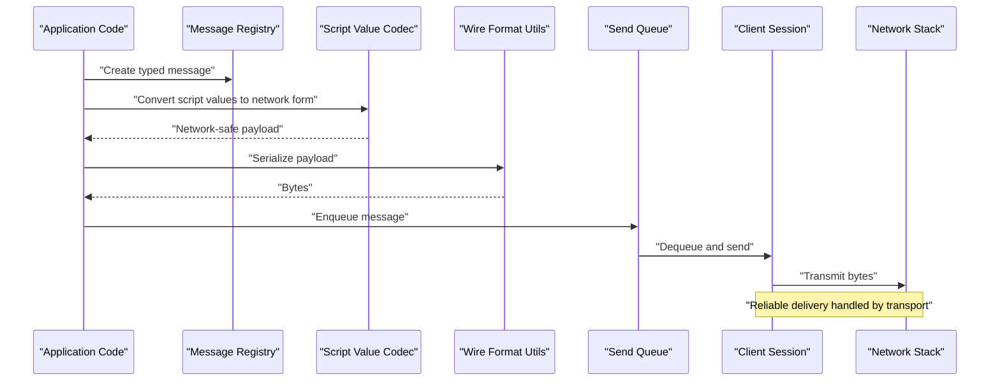
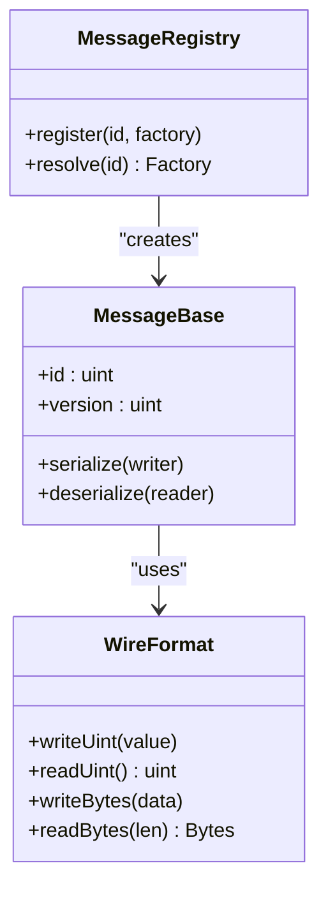
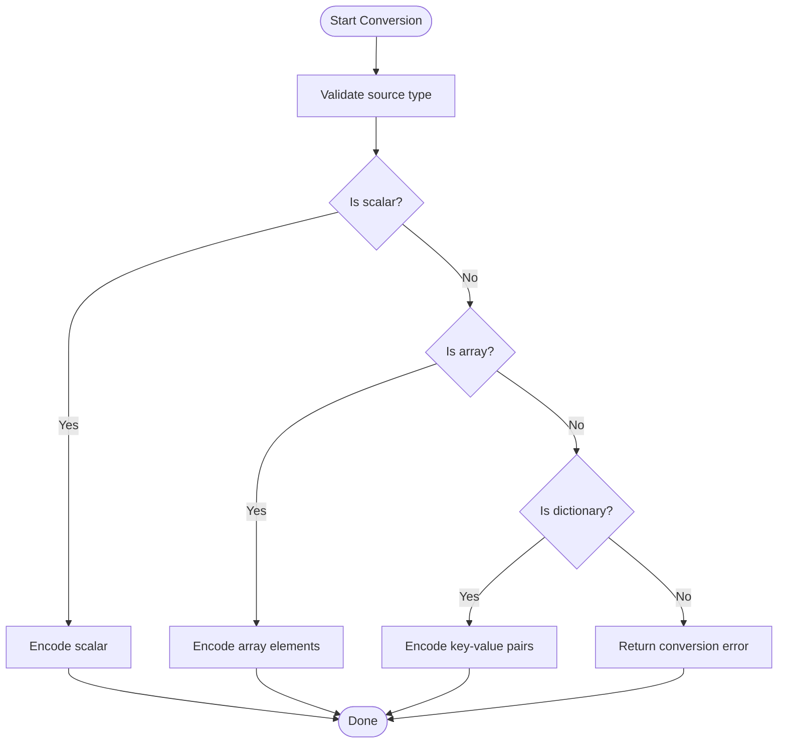
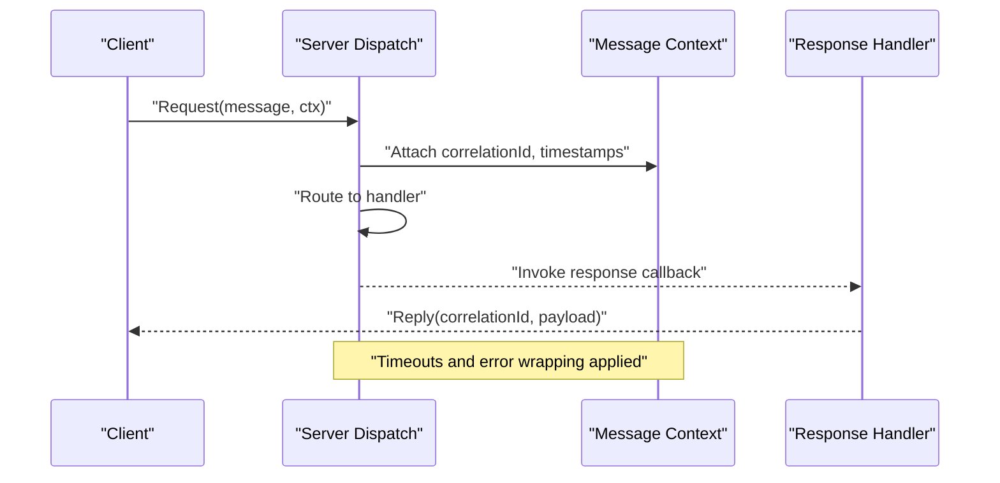
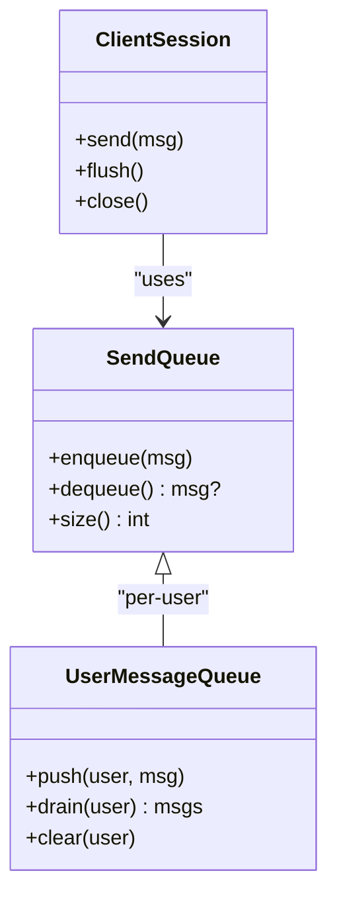
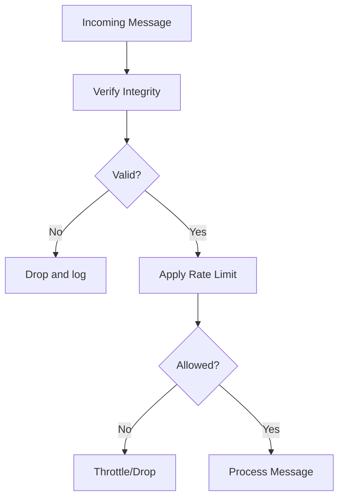
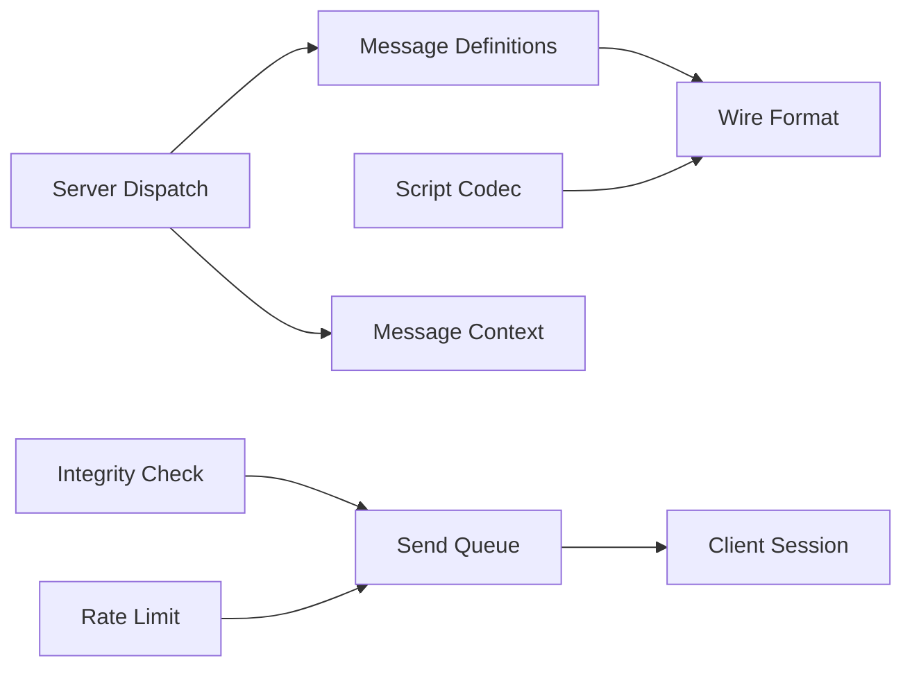

# Message System & Serialization

<cite>
**Referenced Files in This Document**
- [NetworkMessages.hpp](file://engine/Poseidon/Network/NetworkMessages.hpp)
- [NetworkMessages.cpp](file://engine/Poseidon/Network/NetworkMessages.cpp)
- [NetworkMsgFormat.hpp](file://engine/Poseidon/Network/NetworkMsgFormat.hpp)
- [NetworkScriptValueCodec.hpp](file://engine/Poseidon/Network/NetworkScriptValueCodec.hpp)
- [NetworkScriptValueCodec.cpp](file://engine/Poseidon/Network/NetworkScriptValueCodec.cpp)
- [NetworkMsgContext.cpp](file://engine/Poseidon/Network/NetworkMsgContext.cpp)
- [NetworkServerDispatch.hpp](file://engine/Poseidon/Network/NetworkServerDispatch.hpp)
- [NetworkServerDispatch.cpp](file://engine/Poseidon/Network/NetworkServerDispatch.cpp)
- [NetTransportMessageSend.hpp](file://engine/Poseidon/Network/NetTransportMessageSend.hpp)
- [NetTransportMessageQueue.hpp](file://engine/Poseidon/Network/NetTransportMessageQueue.hpp)
- [NetTransportUserMessageQueue.hpp](file://engine/Poseidon/Network/NetTransportUserMessageQueue.hpp)
- [NetTransportClientSession.hpp](file://engine/Poseidon/Network/NetTransportClientSession.hpp)
- [NetTransportServerSessionQuery.hpp](file://engine/Poseidon/Network/NetTransportServerSessionQuery.hpp)
- [IntegrityCheck.hpp](file://engine/Poseidon/Network/IntegrityCheck.hpp)
- [RateLimit.hpp](file://engine/Poseidon/Network/RateLimit.hpp)
- [fuzz_decode_msg.cpp](file://apps/fuzzers/Fuzzer/fuzz_decode_msg.cpp)
</cite>

## Table of Contents
1. [Introduction](#introduction)
2. [Project Structure](#project-structure)
3. [Core Components](#core-components)
4. [Architecture Overview](#architecture-overview)
5. [Detailed Component Analysis](#detailed-component-analysis)
6. [Dependency Analysis](#dependency-analysis)
7. [Performance Considerations](#performance-considerations)
8. [Troubleshooting Guide](#troubleshooting-guide)
9. [Conclusion](#conclusion)
10. [Appendices](#appendices)

## Introduction
This document explains the network message system with a focus on message definition, serialization and deserialization, type safety, version compatibility, script value codec, and the message context for request-response patterns and error propagation. It also provides practical guidance for defining custom messages, implementing handlers, debugging serialization issues, optimizing bandwidth, compressing messages, and validating incoming data securely.

## Project Structure
The network message system is implemented under the Poseidon Network module. Key areas include:
- Message definitions and wire format utilities
- Script-to-network value conversion
- Server dispatch and message context
- Transport-level send queues and session management
- Integrity checks and rate limiting

**Diagram sources**
- [NetworkMessages.hpp](file://engine/Poseidon/Network/NetworkMessages.hpp)
- [NetworkMessages.cpp](file://engine/Poseidon/Network/NetworkMessages.cpp)
- [NetworkMsgFormat.hpp](file://engine/Poseidon/Network/NetworkMsgFormat.hpp)
- [NetworkScriptValueCodec.hpp](file://engine/Poseidon/Network/NetworkScriptValueCodec.hpp)
- [NetworkScriptValueCodec.cpp](file://engine/Poseidon/Network/NetworkScriptValueCodec.cpp)
- [NetworkServerDispatch.hpp](file://engine/Poseidon/Network/NetworkServerDispatch.hpp)
- [NetworkServerDispatch.cpp](file://engine/Poseidon/Network/NetworkServerDispatch.cpp)
- [NetworkMsgContext.cpp](file://engine/Poseidon/Network/NetworkMsgContext.cpp)
- [NetTransportMessageSend.hpp](file://engine/Poseidon/Network/NetTransportMessageSend.hpp)
- [NetTransportMessageQueue.hpp](file://engine/Poseidon/Network/NetTransportMessageQueue.hpp)
- [NetTransportUserMessageQueue.hpp](file://engine/Poseidon/Network/NetTransportUserMessageQueue.hpp)
- [NetTransportClientSession.hpp](file://engine/Poseidon/Network/NetTransportClientSession.hpp)
- [NetTransportServerSessionQuery.hpp](file://engine/Poseidon/Network/NetTransportServerSessionQuery.hpp)
- [IntegrityCheck.hpp](file://engine/Poseidon/Network/IntegrityCheck.hpp)
- [RateLimit.hpp](file://engine/Poseidon/Network/RateLimit.hpp)

**Section sources**
- [NetworkMessages.hpp](file://engine/Poseidon/Network/NetworkMessages.hpp)
- [NetworkMessages.cpp](file://engine/Poseidon/Network/NetworkMessages.cpp)
- [NetworkMsgFormat.hpp](file://engine/Poseidon/Network/NetworkMsgFormat.hpp)
- [NetworkScriptValueCodec.hpp](file://engine/Poseidon/Network/NetworkScriptValueCodec.hpp)
- [NetworkScriptValueCodec.cpp](file://engine/Poseidon/Network/NetworkScriptValueCodec.cpp)
- [NetworkServerDispatch.hpp](file://engine/Poseidon/Network/NetworkServerDispatch.hpp)
- [NetworkServerDispatch.cpp](file://engine/Poseidon/Network/NetworkServerDispatch.cpp)
- [NetworkMsgContext.cpp](file://engine/Poseidon/Network/NetworkMsgContext.cpp)
- [NetTransportMessageSend.hpp](file://engine/Poseidon/Network/NetTransportMessageSend.hpp)
- [NetTransportMessageQueue.hpp](file://engine/Poseidon/Network/NetTransportMessageQueue.hpp)
- [NetTransportUserMessageQueue.hpp](file://engine/Poseidon/Network/NetTransportUserMessageQueue.hpp)
- [NetTransportClientSession.hpp](file://engine/Poseidon/Network/NetTransportClientSession.hpp)
- [NetTransportServerSessionQuery.hpp](file://engine/Poseidon/Network/NetTransportServerSessionQuery.hpp)
- [IntegrityCheck.hpp](file://engine/Poseidon/Network/IntegrityCheck.hpp)
- [RateLimit.hpp](file://engine/Poseidon/Network/RateLimit.hpp)

## Core Components
- Message definitions and registry: central place to declare message types and their fields.
- Wire format utilities: helpers for serializing/deserializing primitives and containers.
- Script value codec: converts between scripting language values and network-safe representations.
- Dispatch and context: routes messages to handlers and manages request-response semantics and errors.
- Transport integration: queues and sessions for sending and receiving messages reliably.
- Security and limits: integrity verification and rate limiting to protect against abuse.

**Section sources**
- [NetworkMessages.hpp](file://engine/Poseidon/Network/NetworkMessages.hpp)
- [NetworkMessages.cpp](file://engine/Poseidon/Network/NetworkMessages.cpp)
- [NetworkMsgFormat.hpp](file://engine/Poseidon/Network/NetworkMsgFormat.hpp)
- [NetworkScriptValueCodec.hpp](file://engine/Poseidon/Network/NetworkScriptValueCodec.hpp)
- [NetworkScriptValueCodec.cpp](file://engine/Poseidon/Network/NetworkScriptValueCodec.cpp)
- [NetworkServerDispatch.hpp](file://engine/Poseidon/Network/NetworkServerDispatch.hpp)
- [NetworkServerDispatch.cpp](file://engine/Poseidon/Network/NetworkServerDispatch.cpp)
- [NetworkMsgContext.cpp](file://engine/Poseidon/Network/NetworkMsgContext.cpp)
- [NetTransportMessageSend.hpp](file://engine/Poseidon/Network/NetTransportMessageSend.hpp)
- [NetTransportMessageQueue.hpp](file://engine/Poseidon/Network/NetTransportMessageQueue.hpp)
- [NetTransportUserMessageQueue.hpp](file://engine/Poseidon/Network/NetTransportUserMessageQueue.hpp)
- [NetTransportClientSession.hpp](file://engine/Poseidon/Network/NetTransportClientSession.hpp)
- [NetTransportServerSessionQuery.hpp](file://engine/Poseidon/Network/NetTransportServerSessionQuery.hpp)
- [IntegrityCheck.hpp](file://engine/Poseidon/Network/IntegrityCheck.hpp)
- [RateLimit.hpp](file://engine/Poseidon/Network/RateLimit.hpp)

## Architecture Overview
The message pipeline spans from application code through the dispatcher to the transport layer. Serialization occurs at the edges (codec and wire format), while dispatch and context manage routing and lifecycle.

**Diagram sources**
- [NetworkMessages.hpp](file://engine/Poseidon/Network/NetworkMessages.hpp)
- [NetworkScriptValueCodec.hpp](file://engine/Poseidon/Network/NetworkScriptValueCodec.hpp)
- [NetworkMsgFormat.hpp](file://engine/Poseidon/Network/NetworkMsgFormat.hpp)
- [NetTransportMessageSend.hpp](file://engine/Poseidon/Network/NetTransportMessageSend.hpp)
- [NetTransportClientSession.hpp](file://engine/Poseidon/Network/NetTransportClientSession.hpp)

## Detailed Component Analysis

### Message Definitions and Wire Format
- Purpose: Define message IDs, fields, and serialization rules.
- Type safety: Strong typing via message classes and field descriptors ensures correct parsing.
- Version compatibility: Version tags or schema evolution strategies allow forward/backward compatibility.
- Wire format: Compact binary layout with explicit length prefixes and field ordering.

**Diagram sources**
- [NetworkMessages.hpp](file://engine/Poseidon/Network/NetworkMessages.hpp)
- [NetworkMessages.cpp](file://engine/Poseidon/Network/NetworkMessages.cpp)
- [NetworkMsgFormat.hpp](file://engine/Poseidon/Network/NetworkMsgFormat.hpp)

**Section sources**
- [NetworkMessages.hpp](file://engine/Poseidon/Network/NetworkMessages.hpp)
- [NetworkMessages.cpp](file://engine/Poseidon/Network/NetworkMessages.cpp)
- [NetworkMsgFormat.hpp](file://engine/Poseidon/Network/NetworkMsgFormat.hpp)

### Script Value Codec
- Purpose: Convert scripting language values into network-safe structures and back.
- Supported types: Scalars, arrays, dictionaries, and nested structures.
- Validation: Enforces bounds, allowed enums, and required fields during conversion.
- Error handling: Returns structured errors with context for failed conversions.

**Diagram sources**
- [NetworkScriptValueCodec.hpp](file://engine/Poseidon/Network/NetworkScriptValueCodec.hpp)
- [NetworkScriptValueCodec.cpp](file://engine/Poseidon/Network/NetworkScriptValueCodec.cpp)

**Section sources**
- [NetworkScriptValueCodec.hpp](file://engine/Poseidon/Network/NetworkScriptValueCodec.hpp)
- [NetworkScriptValueCodec.cpp](file://engine/Poseidon/Network/NetworkScriptValueCodec.cpp)

### Message Context and Request-Response
- Context object: Carries sender identity, channel, timestamp, and correlation ID.
- Request-response: Correlation IDs link requests to responses; timeouts and retries are managed here.
- Error propagation: Errors are wrapped with context and forwarded to callers.

**Diagram sources**
- [NetworkMsgContext.cpp](file://engine/Poseidon/Network/NetworkMsgContext.cpp)
- [NetworkServerDispatch.hpp](file://engine/Poseidon/Network/NetworkServerDispatch.hpp)
- [NetworkServerDispatch.cpp](file://engine/Poseidon/Network/NetworkServerDispatch.cpp)

**Section sources**
- [NetworkMsgContext.cpp](file://engine/Poseidon/Network/NetworkMsgContext.cpp)
- [NetworkServerDispatch.hpp](file://engine/Poseidon/Network/NetworkServerDispatch.hpp)
- [NetworkServerDispatch.cpp](file://engine/Poseidon/Network/NetworkServerDispatch.cpp)

### Transport Integration and Queues
- Send queue: Buffers outgoing messages per user/session.
- User message queue: Per-user prioritization and throttling.
- Session: Manages connection state, retransmission, and fragmentation.

**Diagram sources**
- [NetTransportMessageSend.hpp](file://engine/Poseidon/Network/NetTransportMessageSend.hpp)
- [NetTransportMessageQueue.hpp](file://engine/Poseidon/Network/NetTransportMessageQueue.hpp)
- [NetTransportUserMessageQueue.hpp](file://engine/Poseidon/Network/NetTransportUserMessageQueue.hpp)
- [NetTransportClientSession.hpp](file://engine/Poseidon/Network/NetTransportClientSession.hpp)

**Section sources**
- [NetTransportMessageSend.hpp](file://engine/Poseidon/Network/NetTransportMessageSend.hpp)
- [NetTransportMessageQueue.hpp](file://engine/Poseidon/Network/NetTransportMessageQueue.hpp)
- [NetTransportUserMessageQueue.hpp](file://engine/Poseidon/Network/NetTransportUserMessageQueue.hpp)
- [NetTransportClientSession.hpp](file://engine/Poseidon/Network/NetTransportClientSession.hpp)

### Security and Limits
- Integrity check: Validates message authenticity and tamper resistance.
- Rate limit: Controls message throughput per peer to prevent abuse.

**Diagram sources**
- [IntegrityCheck.hpp](file://engine/Poseidon/Network/IntegrityCheck.hpp)
- [RateLimit.hpp](file://engine/Poseidon/Network/RateLimit.hpp)

**Section sources**
- [IntegrityCheck.hpp](file://engine/Poseidon/Network/IntegrityCheck.hpp)
- [RateLimit.hpp](file://engine/Poseidon/Network/RateLimit.hpp)

## Dependency Analysis
High-level dependencies among core components:

**Diagram sources**
- [NetworkMessages.hpp](file://engine/Poseidon/Network/NetworkMessages.hpp)
- [NetworkMsgFormat.hpp](file://engine/Poseidon/Network/NetworkMsgFormat.hpp)
- [NetworkScriptValueCodec.hpp](file://engine/Poseidon/Network/NetworkScriptValueCodec.hpp)
- [NetworkServerDispatch.hpp](file://engine/Poseidon/Network/NetworkServerDispatch.hpp)
- [NetworkMsgContext.cpp](file://engine/Poseidon/Network/NetworkMsgContext.cpp)
- [NetTransportMessageSend.hpp](file://engine/Poseidon/Network/NetTransportMessageSend.hpp)
- [NetTransportClientSession.hpp](file://engine/Poseidon/Network/NetTransportClientSession.hpp)
- [IntegrityCheck.hpp](file://engine/Poseidon/Network/IntegrityCheck.hpp)
- [RateLimit.hpp](file://engine/Poseidon/Network/RateLimit.hpp)

**Section sources**
- [NetworkMessages.hpp](file://engine/Poseidon/Network/NetworkMessages.hpp)
- [NetworkMsgFormat.hpp](file://engine/Poseidon/Network/NetworkMsgFormat.hpp)
- [NetworkScriptValueCodec.hpp](file://engine/Poseidon/Network/NetworkScriptValueCodec.hpp)
- [NetworkServerDispatch.hpp](file://engine/Poseidon/Network/NetworkServerDispatch.hpp)
- [NetworkMsgContext.cpp](file://engine/Poseidon/Network/NetworkMsgContext.cpp)
- [NetTransportMessageSend.hpp](file://engine/Poseidon/Network/NetTransportMessageSend.hpp)
- [NetTransportClientSession.hpp](file://engine/Poseidon/Network/NetTransportClientSession.hpp)
- [IntegrityCheck.hpp](file://engine/Poseidon/Network/IntegrityCheck.hpp)
- [RateLimit.hpp](file://engine/Poseidon/Network/RateLimit.hpp)

## Performance Considerations
- Minimize allocations: Reuse buffers and avoid temporary copies during serialization.
- Batch messages: Group small updates to reduce overhead.
- Prefer compact types: Use fixed-width integers and enums where possible.
- Avoid deep nesting: Flatten structures when feasible to reduce traversal cost.
- Tune queues: Adjust per-user queue sizes and flush intervals based on latency targets.
- Compression: Enable compression for large payloads only; measure overhead vs benefit.
- Rate limiting: Apply coarse-grained limits first, then fine-grained per-message policies.

[No sources needed since this section provides general guidance]

## Troubleshooting Guide
Common issues and how to diagnose them:
- Serialization failures: Inspect codec error paths and validate input shapes before encoding.
- Deserialization mismatches: Verify message versions and field order; use fuzzing inputs to reproduce.
- Lost responses: Check correlation IDs and timeout settings in the message context.
- Bandwidth spikes: Review batching and compression settings; monitor queue depths.
- Security alerts: Inspect integrity check logs and rate limit triggers.

Use the fuzzer entry point to generate edge-case inputs and validate robustness of decode paths.

**Section sources**
- [fuzz_decode_msg.cpp](file://apps/fuzzers/Fuzzer/fuzz_decode_msg.cpp)
- [NetworkScriptValueCodec.hpp](file://engine/Poseidon/Network/NetworkScriptValueCodec.hpp)
- [NetworkScriptValueCodec.cpp](file://engine/Poseidon/Network/NetworkScriptValueCodec.cpp)
- [NetworkMsgContext.cpp](file://engine/Poseidon/Network/NetworkMsgContext.cpp)
- [IntegrityCheck.hpp](file://engine/Poseidon/Network/IntegrityCheck.hpp)
- [RateLimit.hpp](file://engine/Poseidon/Network/RateLimit.hpp)

## Conclusion
The network message system combines strong typing, clear serialization boundaries, and robust context-driven dispatch to deliver reliable, secure, and efficient communication. By following the guidelines for message design, codec usage, and transport configuration, developers can implement custom messages safely and optimize for performance and security.

[No sources needed since this section summarizes without analyzing specific files]

## Appendices

### Practical Examples

- Defining a custom network message:
  - Create a new message class with an ID and version.
  - Implement serialize/deserialize using wire format utilities.
  - Register the message in the registry.

- Implementing a message handler:
  - Register a handler function for the message ID.
  - Extract parameters from the deserialized payload.
  - Perform validation and business logic.
  - Return a response via the context’s reply mechanism.

- Debugging serialization issues:
  - Log payload sizes and field counts.
  - Compare expected vs actual byte sequences.
  - Use fuzz inputs to identify edge cases.

[No sources needed since this section provides general guidance]