# Networking System

<cite>
**Referenced Files in This Document**
- [NetTransport.hpp](file://engine/Poseidon/Network/NetTransport.hpp)
- [NetTransportNet.cpp](file://engine/Poseidon/Network/NetTransportNet.cpp)
- [NetTransportNetInternal.hpp](file://engine/Poseidon/Network/NetTransportNetInternal.hpp)
- [NetTransportProtocol.hpp](file://engine/Poseidon/Network/NetTransportProtocol.hpp)
- [NetTransportClientHandshake.cpp](file://engine/Poseidon/Network/NetTransportClientHandshake.cpp)
- [NetTransportClientHandshake.hpp](file://engine/Poseidon/Network/NetTransportClientHandshake.hpp)
- [NetTransportClientSession.cpp](file://engine/Poseidon/Network/NetTransportClientSession.cpp)
- [NetTransportClientSession.hpp](file://engine/Poseidon/Network/NetTransportClientSession.hpp)
- [NetTransportServerInit.hpp](file://engine/Poseidon/Network/NetTransportServerInit.hpp)
- [NetTransportPlayerHandshake.cpp](file://engine/Poseidon/Network/NetTransportPlayerHandshake.cpp)
- [NetTransportPlayerHandshake.hpp](file://engine/Poseidon/Network/NetTransportPlayerHandshake.hpp)
- [NetTransportMessageQueue.hpp](file://engine/Poseidon/Network/NetTransportMessageQueue.hpp)
- [NetTransportUserMessageQueue.hpp](file://engine/Poseidon/Network/NetTransportUserMessageQueue.hpp)
- [NetTransportFragmentQueue.hpp](file://engine/Poseidon/Network/NetTransportFragmentQueue.hpp)
- [NetTransportPlayerQueue.hpp](file://engine/Poseidon/Network/NetTransportPlayerQueue.hpp)
- [NetTransportPlayerQueueDrain.hpp](file://engine/Poseidon/Network/NetTransportPlayerQueueDrain.hpp)
- [NetTransportPlayerAckResponse.hpp](file://engine/Poseidon/Network/NetTransportPlayerAckResponse.hpp)
- [NetTransportTermination.cpp](file://engine/Poseidon/Network/NetTransportTermination.cpp)
- [NetTransportTermination.hpp](file://engine/Poseidon/Network/NetTransportTermination.hpp)
- [NetworkClient.cpp](file://engine/Poseidon/Network/NetworkClient.cpp)
- [NetworkClientActions.cpp](file://engine/Poseidon/Network/NetworkClientActions.cpp)
- [NetworkClientOnMessage.cpp](file://engine/Poseidon/Network/NetworkClientOnMessage.cpp)
- [NetworkImplClient.hpp](file://engine/Poseidon/Network/NetworkImplClient.hpp)
- [NetworkServer.cpp](file://engine/Poseidon/Network/NetworkServer.cpp)
- [NetworkServerDispatch.cpp](file://engine/Poseidon/Network/NetworkServerDispatch.cpp)
- [NetworkServerMsg.cpp](file://engine/Poseidon/Network/NetworkServerMsg.cpp)
- [NetworkServerMsgOnMessage.cpp](file://engine/Poseidon/Network/NetworkServerMsgOnMessage.cpp)
- [NetworkImplServer.hpp](file://engine/Poseidon/Network/NetworkImplServer.hpp)
- [NetworkMessages.cpp](file://engine/Poseidon/Network/NetworkMessages.cpp)
- [NetworkMessages.hpp](file://engine/Poseidon/Network/NetworkMessages.hpp)
- [NetworkMsg.cpp](file://engine/Poseidon/Network/NetworkMsg.cpp)
- [NetworkMsgContext.cpp](file://engine/Poseidon/Network/NetworkMsgContext.cpp)
- [NetworkMsgFormat.hpp](file://engine/Poseidon/Network/NetworkMsgFormat.hpp)
- [MasterServerBrowser.cpp](file://engine/Poseidon/Network/MasterServerBrowser.cpp)
- [MasterServerBrowser.hpp](file://engine/Poseidon/Network/MasterServerBrowser.hpp)
- [MasterServerProtocol.hpp](file://engine/Poseidon/Network/MasterServerProtocol.hpp)
- [MasterServerPublisher.cpp](file://engine/Poseidon/Network/MasterServerPublisher.cpp)
- [MasterServerPublisher.hpp](file://engine/Poseidon/Network/MasterServerPublisher.hpp)
- [MasterServerServiceClient.cpp](file://engine/Poseidon/Network/MasterServerServiceClient.cpp)
- [MasterServerServiceClient.hpp](file://engine/Poseidon/Network/MasterServerServiceClient.hpp)
- [MultiplayerAuth.cpp](file://engine/Poseidon/Network/MultiplayerAuth.cpp)
- [MultiplayerAuth.hpp](file://engine/Poseidon/Network/MultiplayerAuth.hpp)
- [IntegrityCheck.cpp](file://engine/Poseidon/Network/IntegrityCheck.cpp)
- [IntegrityCheck.hpp](file://engine/Poseidon/Network/IntegrityCheck.hpp)
- [IpBan.cpp](file://engine/Poseidon/Network/IpBan.cpp)
- [IpBan.hpp](file://engine/Poseidon/Network/IpBan.hpp)
- [RateLimit.hpp](file://engine/Poseidon/Network/RateLimit.hpp)
- [NetworkConfig.cpp](file://engine/Poseidon/Network/NetworkConfig.cpp)
- [NetworkConfig.hpp](file://engine/Poseidon/Network/NetworkConfig.hpp)
- [NetworkFileTransfer.hpp](file://engine/Poseidon/Network/NetworkFileTransfer.hpp)
- [NetworkMissionTransfer.cpp](file://engine/Poseidon/Network/NetworkMissionTransfer.cpp)
- [NetworkMissionTransfer.hpp](file://engine/Poseidon/Network/NetworkMissionTransfer.hpp)
- [NetworkScriptValueCodec.cpp](file://engine/Poseidon/Network/NetworkScriptValueCodec.cpp)
- [NetworkScriptValueCodec.hpp](file://engine/Poseidon/Network/NetworkScriptValueCodec.hpp)
</cite>

## Table of Contents
1. [Introduction](#introduction)
2. [Project Structure](#project-structure)
3. [Core Components](#core-components)
4. [Architecture Overview](#architecture-overview)
5. [Detailed Component Analysis](#detailed-component-analysis)
6. [Dependency Analysis](#dependency-analysis)
7. [Performance Considerations](#performance-considerations)
8. [Troubleshooting Guide](#troubleshooting-guide)
9. [Conclusion](#conclusion)
10. [Appendices](#appendices)

## Introduction
This document provides comprehensive networking documentation for the multiplayer system that supports both client-server and peer-to-peer architectures. It explains the NetTransport protocol layer, message serialization, connection management strategies, and the NetworkClient and NetworkServer implementations. It also covers authentication, session handling, data synchronization, reliability, latency compensation, bandwidth optimization, master server integration for game discovery and mod distribution, practical examples for custom messages, disconnection handling, debugging, security considerations, anti-cheat measures, performance tuning for large player counts, cross-platform networking differences, and firewall traversal strategies.

## Project Structure
The networking subsystem is primarily implemented under engine/Poseidon/Network with supporting components for master server services and utilities. Key areas include:
- Transport and protocol definitions (NetTransport*)
- Client and server implementations (NetworkClient*, NetworkServer*)
- Message framework and serialization (NetworkMessages*, NetworkMsg*, NetworkMsgFormat*)
- Master server integration (MasterServer*)
- Security and integrity (MultiplayerAuth*, IntegrityCheck*, IpBan*)
- Configuration and tuning (NetworkConfig*, RateLimit*)
- File and mission transfer (NetworkFileTransfer*, NetworkMissionTransfer*)

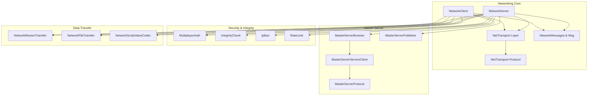

**Diagram sources**
- [NetTransport.hpp](file://engine/Poseidon/Network/NetTransport.hpp)
- [NetTransportProtocol.hpp](file://engine/Poseidon/Network/NetTransportProtocol.hpp)
- [NetworkClient.cpp](file://engine/Poseidon/Network/NetworkClient.cpp)
- [NetworkServer.cpp](file://engine/Poseidon/Network/NetworkServer.cpp)
- [NetworkMessages.cpp](file://engine/Poseidon/Network/NetworkMessages.cpp)
- [MasterServerBrowser.cpp](file://engine/Poseidon/Network/MasterServerBrowser.cpp)
- [MasterServerPublisher.cpp](file://engine/Poseidon/Network/MasterServerPublisher.cpp)
- [MasterServerServiceClient.cpp](file://engine/Poseidon/Network/MasterServerServiceClient.cpp)
- [MultiplayerAuth.cpp](file://engine/Poseidon/Network/MultiplayerAuth.cpp)
- [IntegrityCheck.cpp](file://engine/Poseidon/Network/IntegrityCheck.cpp)
- [IpBan.cpp](file://engine/Poseidon/Network/IpBan.cpp)
- [RateLimit.hpp](file://engine/Poseidon/Network/RateLimit.hpp)
- [NetworkMissionTransfer.cpp](file://engine/Poseidon/Network/NetworkMissionTransfer.cpp)
- [NetworkFileTransfer.hpp](file://engine/Poseidon/Network/NetworkFileTransfer.hpp)
- [NetworkScriptValueCodec.cpp](file://engine/Poseidon/Network/NetworkScriptValueCodec.cpp)

**Section sources**
- [NetTransport.hpp](file://engine/Poseidon/Network/NetTransport.hpp)
- [NetTransportProtocol.hpp](file://engine/Poseidon/Network/NetTransportProtocol.hpp)
- [NetworkClient.cpp](file://engine/Poseidon/Network/NetworkClient.cpp)
- [NetworkServer.cpp](file://engine/Poseidon/Network/NetworkServer.cpp)
- [NetworkMessages.cpp](file://engine/Poseidon/Network/NetworkMessages.cpp)
- [MasterServerBrowser.cpp](file://engine/Poseidon/Network/MasterServerBrowser.cpp)
- [MasterServerPublisher.cpp](file://engine/Poseidon/Network/MasterServerPublisher.cpp)
- [MasterServerServiceClient.cpp](file://engine/Poseidon/Network/MasterServerServiceClient.cpp)
- [MultiplayerAuth.cpp](file://engine/Poseidon/Network/MultiplayerAuth.cpp)
- [IntegrityCheck.cpp](file://engine/Poseidon/Network/IntegrityCheck.cpp)
- [IpBan.cpp](file://engine/Poseidon/Network/IpBan.cpp)
- [RateLimit.hpp](file://engine/Poseidon/Network/RateLimit.hpp)
- [NetworkMissionTransfer.cpp](file://engine/Poseidon/Network/NetworkMissionTransfer.cpp)
- [NetworkFileTransfer.hpp](file://engine/Poseidon/Network/NetworkFileTransfer.hpp)
- [NetworkScriptValueCodec.cpp](file://engine/Poseidon/Network/NetworkScriptValueCodec.cpp)

## Core Components
- NetTransport protocol layer: Provides transport abstraction, framing, sequencing, acknowledgments, fragmentation, and channeling for reliable or unreliable delivery.
- Message framework: Defines message types, serialization formats, and context handling to marshal/unmarshal payloads across the network.
- Client implementation: Manages connection lifecycle, handshake, authentication, session state, and event-driven message processing.
- Server implementation: Accepts connections, authenticates players, manages sessions, dispatches messages, enforces policies, and coordinates synchronization.
- Master server integration: Enables game discovery via browser/publisher and service client interactions for listing and joining servers.
- Security and integrity: Authentication tokens, integrity checks, IP banning, rate limiting, and anti-cheat hooks.
- Data transfer: Mission and file transfer mechanisms, script value codec for efficient serialization.

**Section sources**
- [NetTransport.hpp](file://engine/Poseidon/Network/NetTransport.hpp)
- [NetTransportProtocol.hpp](file://engine/Poseidon/Network/NetTransportProtocol.hpp)
- [NetworkMessages.hpp](file://engine/Poseidon/Network/NetworkMessages.hpp)
- [NetworkMsgFormat.hpp](file://engine/Poseidon/Network/NetworkMsgFormat.hpp)
- [NetworkClient.cpp](file://engine/Poseidon/Network/NetworkClient.cpp)
- [NetworkServer.cpp](file://engine/Poseidon/Network/NetworkServer.cpp)
- [MasterServerBrowser.hpp](file://engine/Poseidon/Network/MasterServerBrowser.hpp)
- [MasterServerPublisher.hpp](file://engine/Poseidon/Network/MasterServerPublisher.hpp)
- [MasterServerServiceClient.hpp](file://engine/Poseidon/Network/MasterServerServiceClient.hpp)
- [MultiplayerAuth.hpp](file://engine/Poseidon/Network/MultiplayerAuth.hpp)
- [IntegrityCheck.hpp](file://engine/Poseidon/Network/IntegrityCheck.hpp)
- [IpBan.hpp](file://engine/Poseidon/Network/IpBan.hpp)
- [RateLimit.hpp](file://engine/Poseidon/Network/RateLimit.hpp)
- [NetworkMissionTransfer.hpp](file://engine/Poseidon/Network/NetworkMissionTransfer.hpp)
- [NetworkFileTransfer.hpp](file://engine/Poseidon/Network/NetworkFileTransfer.hpp)
- [NetworkScriptValueCodec.hpp](file://engine/Poseidon/Network/NetworkScriptValueCodec.hpp)

## Architecture Overview
The networking architecture separates concerns into layers:
- Transport layer (NetTransport): Handles low-level packetization, retransmission, ordering, and fragmentation.
- Session layer (Client/Server): Manages handshakes, authentication, player allocation, and session state.
- Application layer (Messages): Encodes application-specific payloads using a consistent format and context.
- Discovery layer (Master Server): Facilitates server listing and joining through HTTP-based protocols.
- Security layer: Enforces authentication, integrity verification, rate limits, and bans.

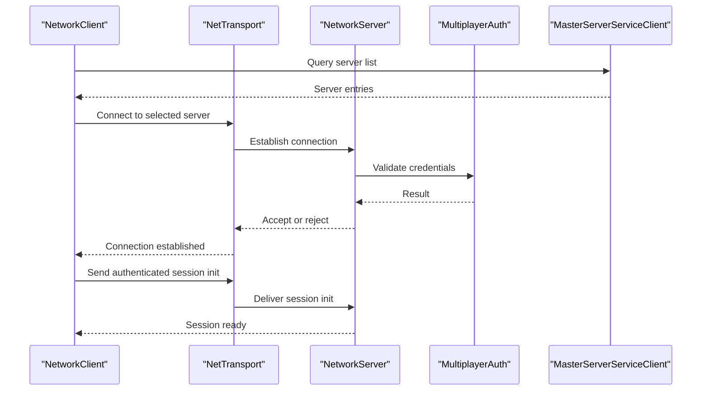

**Diagram sources**
- [NetworkClient.cpp](file://engine/Poseidon/Network/NetworkClient.cpp)
- [NetTransportNet.cpp](file://engine/Poseidon/Network/NetTransportNet.cpp)
- [NetworkServer.cpp](file://engine/Poseidon/Network/NetworkServer.cpp)
- [MultiplayerAuth.cpp](file://engine/Poseidon/Network/MultiplayerAuth.cpp)
- [MasterServerServiceClient.cpp](file://engine/Poseidon/Network/MasterServerServiceClient.cpp)

## Detailed Component Analysis

### NetTransport Protocol Layer
NetTransport defines the core transport abstractions and protocol behaviors:
- Framing and packetization: Ensures boundaries and headers are consistently applied.
- Sequencing and acknowledgments: Guarantees ordered delivery where required and handles ack/nack semantics.
- Fragmentation and reassembly: Splits large messages and reconstructs them at the receiver.
- Channeling: Supports multiple logical channels over a single connection for prioritization.
- Reliability modes: Configurable per-message reliability (reliable, unreliable, sequenced).

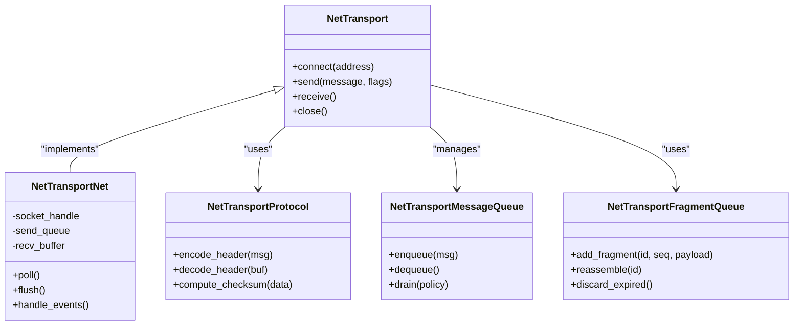

**Diagram sources**
- [NetTransport.hpp](file://engine/Poseidon/Network/NetTransport.hpp)
- [NetTransportNet.cpp](file://engine/Poseidon/Network/NetTransportNet.cpp)
- [NetTransportProtocol.hpp](file://engine/Poseidon/Network/NetTransportProtocol.hpp)
- [NetTransportMessageQueue.hpp](file://engine/Poseidon/Network/NetTransportMessageQueue.hpp)
- [NetTransportFragmentQueue.hpp](file://engine/Poseidon/Network/NetTransportFragmentQueue.hpp)

**Section sources**
- [NetTransport.hpp](file://engine/Poseidon/Network/NetTransport.hpp)
- [NetTransportNet.cpp](file://engine/Poseidon/Network/NetTransportNet.cpp)
- [NetTransportProtocol.hpp](file://engine/Poseidon/Network/NetTransportProtocol.hpp)
- [NetTransportMessageQueue.hpp](file://engine/Poseidon/Network/NetTransportMessageQueue.hpp)
- [NetTransportFragmentQueue.hpp](file://engine/Poseidon/Network/NetTransportFragmentQueue.hpp)

### Message Serialization and Context
The message framework provides a consistent way to serialize and deserialize payloads:
- Message types and IDs: Central registry for type-safe dispatch.
- Format definitions: Binary schema with versioning and compatibility.
- Context propagation: Carries metadata like sender, timestamp, and priority.
- Codec support: Script value codec for complex structures and arrays.

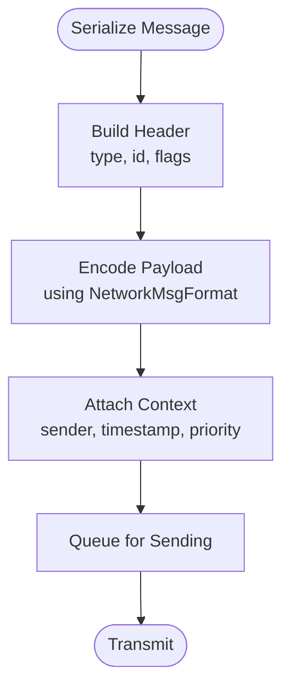

**Diagram sources**
- [NetworkMessages.cpp](file://engine/Poseidon/Network/NetworkMessages.cpp)
- [NetworkMsgFormat.hpp](file://engine/Poseidon/Network/NetworkMsgFormat.hpp)
- [NetworkMsg.cpp](file://engine/Poseidon/Network/NetworkMsg.cpp)
- [NetworkMsgContext.cpp](file://engine/Poseidon/Network/NetworkMsgContext.cpp)
- [NetworkScriptValueCodec.cpp](file://engine/Poseidon/Network/NetworkScriptValueCodec.cpp)

**Section sources**
- [NetworkMessages.cpp](file://engine/Poseidon/Network/NetworkMessages.cpp)
- [NetworkMessages.hpp](file://engine/Poseidon/Network/NetworkMessages.hpp)
- [NetworkMsg.cpp](file://engine/Poseidon/Network/NetworkMsg.cpp)
- [NetworkMsgContext.cpp](file://engine/Poseidon/Network/NetworkMsgContext.cpp)
- [NetworkMsgFormat.hpp](file://engine/Poseidon/Network/NetworkMsgFormat.hpp)
- [NetworkScriptValueCodec.cpp](file://engine/Poseidon/Network/NetworkScriptValueCodec.cpp)

### Client Implementation
NetworkClient orchestrates connection establishment, authentication, session initialization, and message handling:
- Handshake flow: Negotiates capabilities and establishes secure channels.
- Session management: Tracks state, reconnects on failure, and maintains queues.
- Event callbacks: Invokes user-defined handlers for incoming messages.
- Action dispatch: Processes outgoing actions and commands.

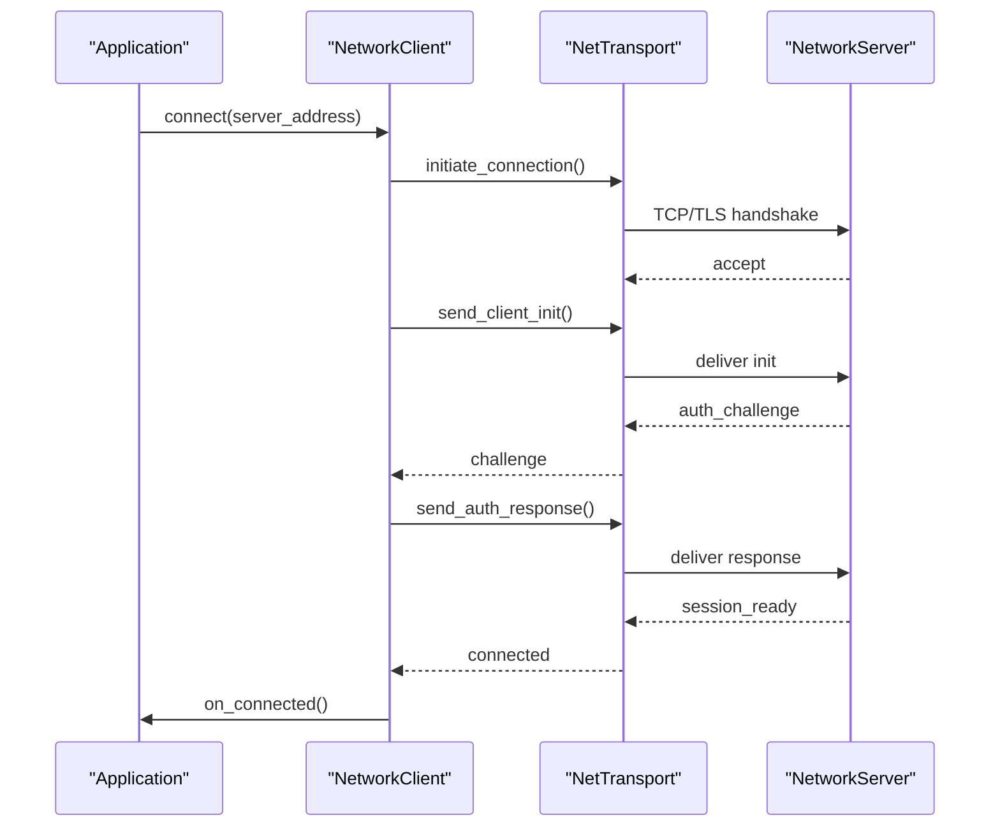

**Diagram sources**
- [NetworkClient.cpp](file://engine/Poseidon/Network/NetworkClient.cpp)
- [NetTransportClientHandshake.cpp](file://engine/Poseidon/Network/NetTransportClientHandshake.cpp)
- [NetTransportClientSession.cpp](file://engine/Poseidon/Network/NetTransportClientSession.cpp)

**Section sources**
- [NetworkClient.cpp](file://engine/Poseidon/Network/NetworkClient.cpp)
- [NetworkClientActions.cpp](file://engine/Poseidon/Network/NetworkClientActions.cpp)
- [NetworkClientOnMessage.cpp](file://engine/Poseidon/Network/NetworkClientOnMessage.cpp)
- [NetworkImplClient.hpp](file://engine/Poseidon/Network/NetworkImplClient.hpp)
- [NetTransportClientHandshake.cpp](file://engine/Poseidon/Network/NetTransportClientHandshake.cpp)
- [NetTransportClientSession.cpp](file://engine/Poseidon/Network/NetTransportClientSession.cpp)

### Server Implementation
NetworkServer manages accepted connections, player validation, session lifecycle, and message dispatch:
- Player admission: Validates credentials and allocates resources.
- Dispatch pipeline: Routes messages to appropriate handlers based on type and context.
- Simulation integration: Coordinates with game simulation for authoritative updates.
- Termination and cleanup: Graceful shutdown and resource release.

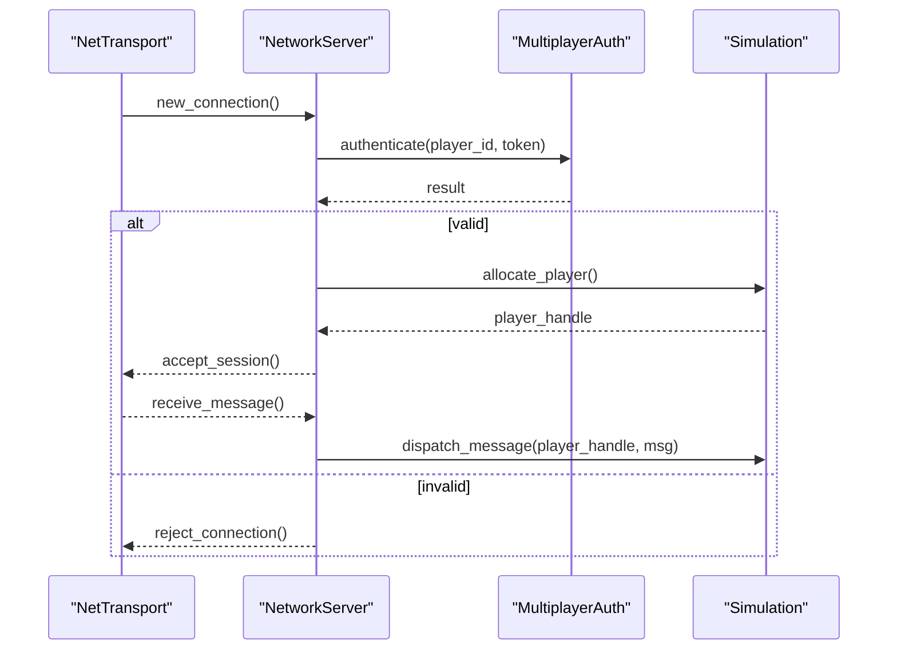

**Diagram sources**
- [NetworkServer.cpp](file://engine/Poseidon/Network/NetworkServer.cpp)
- [NetworkServerDispatch.cpp](file://engine/Poseidon/Network/NetworkServerDispatch.cpp)
- [NetworkServerMsg.cpp](file://engine/Poseidon/Network/NetworkServerMsg.cpp)
- [NetworkServerMsgOnMessage.cpp](file://engine/Poseidon/Network/NetworkServerMsgOnMessage.cpp)
- [MultiplayerAuth.cpp](file://engine/Poseidon/Network/MultiplayerAuth.cpp)

**Section sources**
- [NetworkServer.cpp](file://engine/Poseidon/Network/NetworkServer.cpp)
- [NetworkServerDispatch.cpp](file://engine/Poseidon/Network/NetworkServerDispatch.cpp)
- [NetworkServerMsg.cpp](file://engine/Poseidon/Network/NetworkServerMsg.cpp)
- [NetworkServerMsgOnMessage.cpp](file://engine/Poseidon/Network/NetworkServerMsgOnMessage.cpp)
- [NetworkImplServer.hpp](file://engine/Poseidon/Network/NetworkImplServer.hpp)
- [MultiplayerAuth.cpp](file://engine/Poseidon/Network/MultiplayerAuth.cpp)

### Master Server Integration
Master server components enable discovery and mod distribution:
- Browser: Queries master server for available games and filters results.
- Publisher: Registers and advertises local server instances.
- Service client: Interacts with master server APIs for listing and joining.

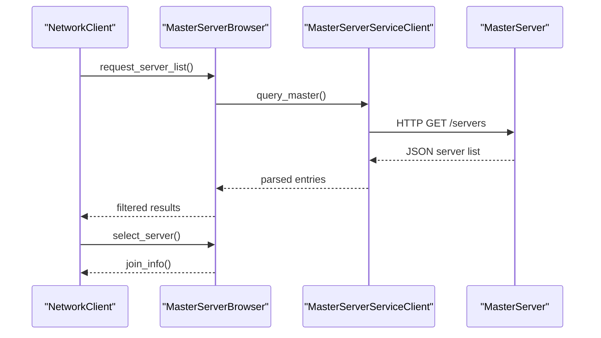

**Diagram sources**
- [MasterServerBrowser.cpp](file://engine/Poseidon/Network/MasterServerBrowser.cpp)
- [MasterServerPublisher.cpp](file://engine/Poseidon/Network/MasterServerPublisher.cpp)
- [MasterServerServiceClient.cpp](file://engine/Poseidon/Network/MasterServerServiceClient.cpp)
- [MasterServerProtocol.hpp](file://engine/Poseidon/Network/MasterServerProtocol.hpp)

**Section sources**
- [MasterServerBrowser.cpp](file://engine/Poseidon/Network/MasterServerBrowser.cpp)
- [MasterServerBrowser.hpp](file://engine/Poseidon/Network/MasterServerBrowser.hpp)
- [MasterServerPublisher.cpp](file://engine/Poseidon/Network/MasterServerPublisher.cpp)
- [MasterServerPublisher.hpp](file://engine/Poseidon/Network/MasterServerPublisher.hpp)
- [MasterServerServiceClient.cpp](file://engine/Poseidon/Network/MasterServerServiceClient.cpp)
- [MasterServerServiceClient.hpp](file://engine/Poseidon/Network/MasterServerServiceClient.hpp)
- [MasterServerProtocol.hpp](file://engine/Poseidon/Network/MasterServerProtocol.hpp)

### Authentication and Session Handling
Authentication ensures secure access and session integrity:
- Token-based authentication: Validates credentials and issues session tokens.
- Session lifecycle: Tracks active sessions, timeouts, and reconnections.
- Player validation: Verifies integrity and permissions before granting access.

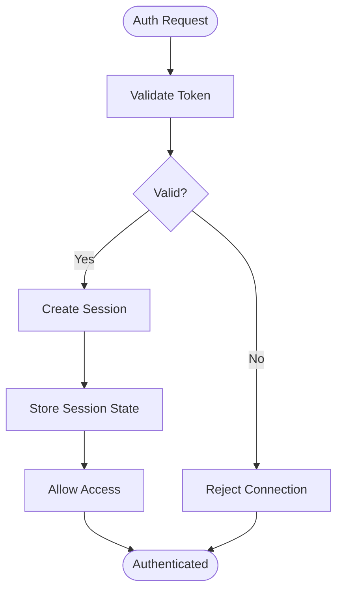

**Diagram sources**
- [MultiplayerAuth.cpp](file://engine/Poseidon/Network/MultiplayerAuth.cpp)
- [NetTransportPlayerHandshake.cpp](file://engine/Poseidon/Network/NetTransportPlayerHandshake.cpp)
- [NetTransportPlayerValidation.cpp](file://engine/Poseidon/Network/NetTransportPlayerValidation.cpp)

**Section sources**
- [MultiplayerAuth.cpp](file://engine/Poseidon/Network/MultiplayerAuth.cpp)
- [MultiplayerAuth.hpp](file://engine/Poseidon/Network/MultiplayerAuth.hpp)
- [NetTransportPlayerHandshake.cpp](file://engine/Poseidon/Network/NetTransportPlayerHandshake.cpp)
- [NetTransportPlayerHandshake.hpp](file://engine/Poseidon/Network/NetTransportPlayerHandshake.hpp)
- [NetTransportPlayerValidation.cpp](file://engine/Poseidon/Network/NetTransportPlayerValidation.cpp)

### Data Synchronization and Queues
Reliable synchronization uses queues and acknowledgment mechanisms:
- Message queues: Buffer outgoing and incoming messages with policies.
- Ack responses: Confirm receipt and trigger retransmissions if needed.
- Drain policies: Control throughput and prevent congestion.

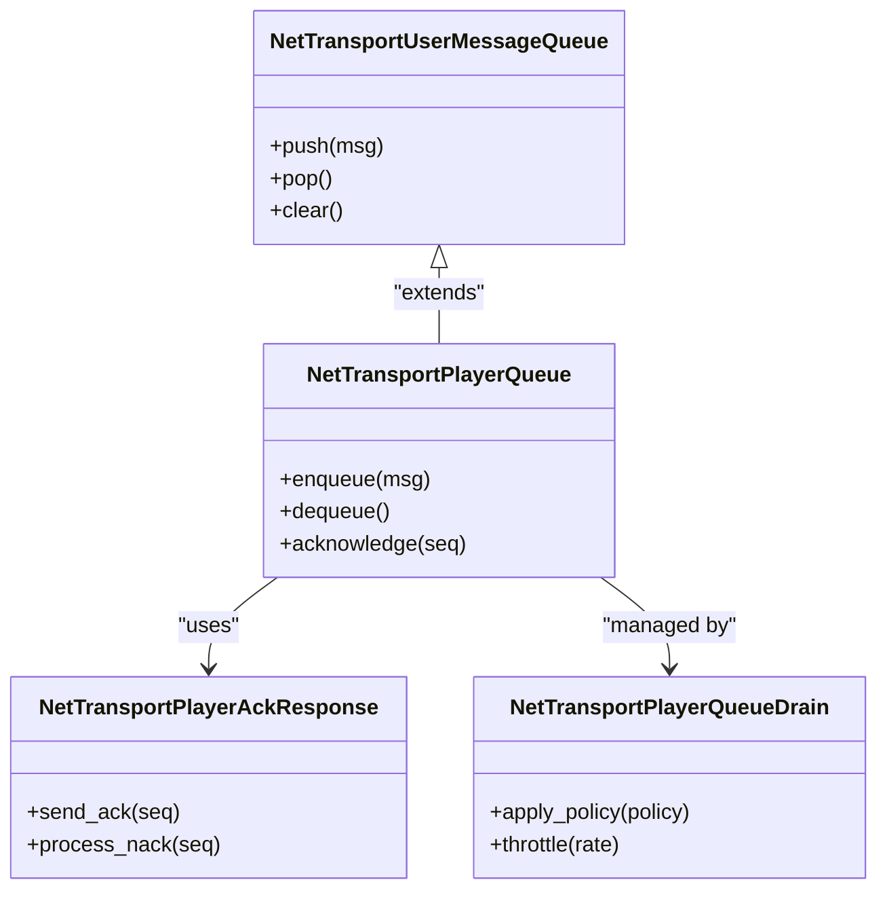

**Diagram sources**
- [NetTransportPlayerQueue.hpp](file://engine/Poseidon/Network/NetTransportPlayerQueue.hpp)
- [NetTransportUserMessageQueue.hpp](file://engine/Poseidon/Network/NetTransportUserMessageQueue.hpp)
- [NetTransportPlayerAckResponse.hpp](file://engine/Poseidon/Network/NetTransportPlayerAckResponse.hpp)
- [NetTransportPlayerQueueDrain.hpp](file://engine/Poseidon/Network/NetTransportPlayerQueueDrain.hpp)

**Section sources**
- [NetTransportPlayerQueue.hpp](file://engine/Poseidon/Network/NetTransportPlayerQueue.hpp)
- [NetTransportUserMessageQueue.hpp](file://engine/Poseidon/Network/NetTransportUserMessageQueue.hpp)
- [NetTransportPlayerAckResponse.hpp](file://engine/Poseidon/Network/NetTransportPlayerAckResponse.hpp)
- [NetTransportPlayerQueueDrain.hpp](file://engine/Poseidon/Network/NetTransportPlayerQueueDrain.hpp)

### Termination and Cleanup
Graceful termination ensures resources are released and states are cleaned up:
- Connection close: Signals peers and flushes pending data.
- Session teardown: Destroys player contexts and frees memory.
- Error handling: Logs failures and triggers recovery procedures.

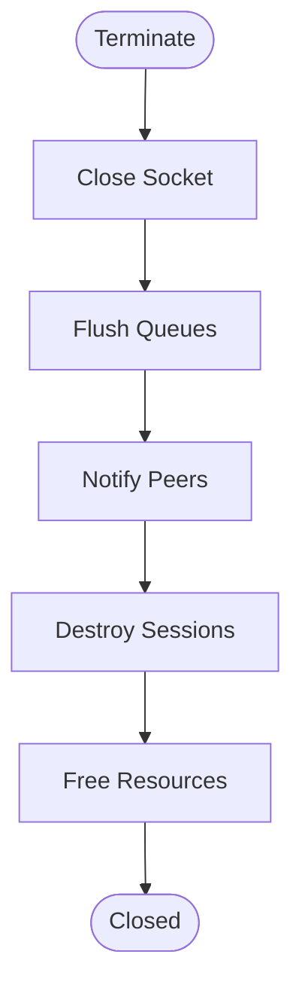

**Diagram sources**
- [NetTransportTermination.cpp](file://engine/Poseidon/Network/NetTransportTermination.cpp)
- [NetTransportTermination.hpp](file://engine/Poseidon/Network/NetTransportTermination.hpp)

**Section sources**
- [NetTransportTermination.cpp](file://engine/Poseidon/Network/NetTransportTermination.cpp)
- [NetTransportTermination.hpp](file://engine/Poseidon/Network/NetTransportTermination.hpp)

## Dependency Analysis
The networking components have clear dependencies:
- NetTransport depends on protocol definitions and queue utilities.
- Client and server depend on NetTransport for connectivity and on message frameworks for payloads.
- Master server components depend on HTTP clients and protocol definitions.
- Security modules integrate with authentication and integrity checks.

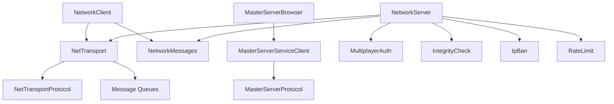

**Diagram sources**
- [NetTransport.hpp](file://engine/Poseidon/Network/NetTransport.hpp)
- [NetTransportProtocol.hpp](file://engine/Poseidon/Network/NetTransportProtocol.hpp)
- [NetworkClient.cpp](file://engine/Poseidon/Network/NetworkClient.cpp)
- [NetworkServer.cpp](file://engine/Poseidon/Network/NetworkServer.cpp)
- [NetworkMessages.cpp](file://engine/Poseidon/Network/NetworkMessages.cpp)
- [MasterServerBrowser.cpp](file://engine/Poseidon/Network/MasterServerBrowser.cpp)
- [MasterServerServiceClient.cpp](file://engine/Poseidon/Network/MasterServerServiceClient.cpp)
- [MasterServerProtocol.hpp](file://engine/Poseidon/Network/MasterServerProtocol.hpp)
- [MultiplayerAuth.cpp](file://engine/Poseidon/Network/MultiplayerAuth.cpp)
- [IntegrityCheck.cpp](file://engine/Poseidon/Network/IntegrityCheck.cpp)
- [IpBan.cpp](file://engine/Poseidon/Network/IpBan.cpp)
- [RateLimit.hpp](file://engine/Poseidon/Network/RateLimit.hpp)

**Section sources**
- [NetTransport.hpp](file://engine/Poseidon/Network/NetTransport.hpp)
- [NetTransportProtocol.hpp](file://engine/Poseidon/Network/NetTransportProtocol.hpp)
- [NetworkClient.cpp](file://engine/Poseidon/Network/NetworkClient.cpp)
- [NetworkServer.cpp](file://engine/Poseidon/Network/NetworkServer.cpp)
- [NetworkMessages.cpp](file://engine/Poseidon/Network/NetworkMessages.cpp)
- [MasterServerBrowser.cpp](file://engine/Poseidon/Network/MasterServerBrowser.cpp)
- [MasterServerServiceClient.cpp](file://engine/Poseidon/Network/MasterServerServiceClient.cpp)
- [MasterServerProtocol.hpp](file://engine/Poseidon/Network/MasterServerProtocol.hpp)
- [MultiplayerAuth.cpp](file://engine/Poseidon/Network/MultiplayerAuth.cpp)
- [IntegrityCheck.cpp](file://engine/Poseidon/Network/IntegrityCheck.cpp)
- [IpBan.cpp](file://engine/Poseidon/Network/IpBan.cpp)
- [RateLimit.hpp](file://engine/Poseidon/Network/RateLimit.hpp)

## Performance Considerations
- Bandwidth optimization: Use compression for large payloads, batch small messages, and prioritize critical updates.
- Latency compensation: Implement prediction and interpolation on the client side; use server reconciliation for accuracy.
- Large player counts: Scale queues and worker threads; use connection pooling and efficient serialization.
- Cross-platform differences: Normalize socket APIs, handle endianness, and adjust buffer sizes for platform constraints.
- Firewall traversal: Use NAT punch-through techniques, STUN/TURN servers, and configurable port ranges.

[No sources needed since this section provides general guidance]

## Troubleshooting Guide
Common issues and debugging steps:
- Connection failures: Check network reachability, firewall rules, and server status.
- Authentication errors: Verify tokens, timestamps, and server configuration.
- Message loss: Inspect reliability settings, queue backlogs, and retransmission logs.
- High latency: Monitor round-trip times, packet loss, and server load.
- Disconnections: Review timeout settings, keepalive intervals, and error codes.

Practical examples:
- Custom network messages: Define message types, register codecs, and implement handlers on both ends.
- Handling disconnections: Implement retry logic, session resumption, and graceful degradation.
- Debugging tools: Enable verbose logging, capture packets, and visualize message flows.

**Section sources**
- [NetworkClient.cpp](file://engine/Poseidon/Network/NetworkClient.cpp)
- [NetworkServer.cpp](file://engine/Poseidon/Network/NetworkServer.cpp)
- [NetworkMessages.cpp](file://engine/Poseidon/Network/NetworkMessages.cpp)
- [NetTransportTermination.cpp](file://engine/Poseidon/Network/NetTransportTermination.cpp)

## Conclusion
The networking system provides a robust foundation for multiplayer experiences with flexible transport, secure authentication, efficient serialization, and scalable design. By leveraging NetTransport’s reliability features, mastering message frameworks, and integrating with master servers, developers can build responsive and secure multiplayer games. Proper tuning, security measures, and troubleshooting practices ensure optimal performance and resilience across diverse environments.

[No sources needed since this section summarizes without analyzing specific files]

## Appendices
- Practical examples for implementing custom network messages and handling disconnections.
- Security considerations including anti-cheat measures and performance tuning for large player counts.
- Cross-platform networking differences and firewall traversal strategies.

[No sources needed since this section provides general guidance]