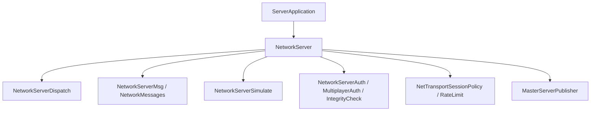
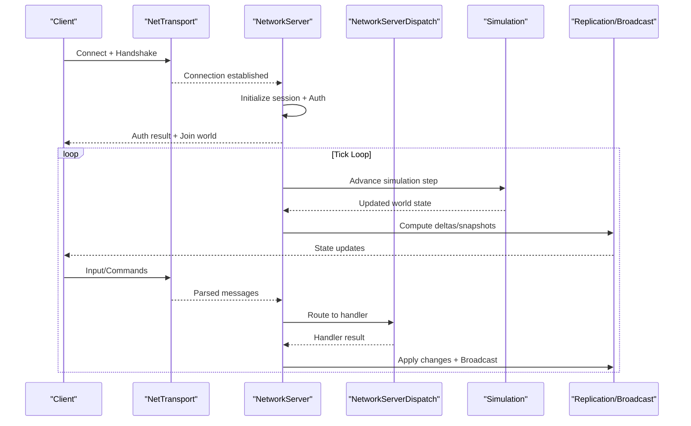
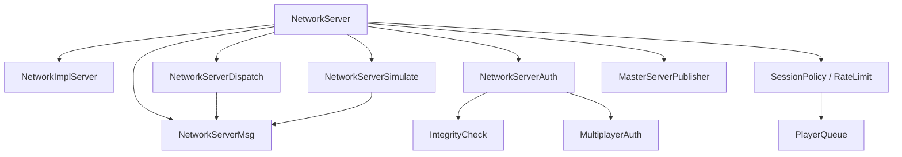

# Server Implementation

<cite>
**Referenced Files in This Document**
- [NetworkServer.cpp](file://engine/Poseidon/Network/NetworkServer.cpp)
- [NetworkServerDispatch.hpp](file://engine/Poseidon/Network/NetworkServerDispatch.hpp)
- [NetworkServerDispatch.cpp](file://engine/Poseidon/Network/NetworkServerDispatch.cpp)
- [NetworkServerMsg.cpp](file://engine/Poseidon/Network/NetworkServerMsg.cpp)
- [NetworkServerMsgOnMessage.cpp](file://engine/Poseidon/Network/NetworkServerMsgOnMessage.cpp)
- [NetworkServerSimulate.cpp](file://engine/Poseidon/Network/NetworkServerSimulate.cpp)
- [NetworkServerAuth.hpp](file://engine/Poseidon/Network/NetworkServerAuth.hpp)
- [NetworkServerIntegrity.cpp](file://engine/Poseidon/Network/NetworkServerIntegrity.cpp)
- [NetworkServerMission.cpp](file://engine/Poseidon/Network/NetworkServerMission.cpp)
- [NetworkImplServer.hpp](file://engine/Poseidon/Network/NetworkImplServer.hpp)
- [NetworkMessages.hpp](file://engine/Poseidon/Network/NetworkMessages.hpp)
- [NetworkMessages.cpp](file://engine/Poseidon/Network/NetworkMessages.cpp)
- [NetTransportPlayerValidation.hpp](file://engine/Poseidon/Network/NetTransportPlayerValidation.hpp)
- [NetTransportPlayerQueue.hpp](file://engine/Poseidon/Network/NetTransportPlayerQueue.hpp)
- [NetTransportSessionPolicy.hpp](file://engine/Poseidon/Network/NetTransportSessionPolicy.hpp)
- [RateLimit.hpp](file://engine/Poseidon/Network/RateLimit.hpp)
- [IpBan.hpp](file://engine/Poseidon/Network/IpBan.hpp)
- [MultiplayerAuth.hpp](file://engine/Poseidon/Network/MultiplayerAuth.hpp)
- [IntegrityCheck.hpp](file://engine/Poseidon/Network/IntegrityCheck.hpp)
- [MasterServerPublisher.hpp](file://engine/Poseidon/Network/MasterServerPublisher.hpp)
- [ServerApplication.hpp](file://apps/cwr/Server/ServerApplication.hpp)
- [ServerApplication.cpp](file://apps/cwr/Server/ServerApplication.cpp)
</cite>

## Table of Contents
1. [Introduction](#introduction)
2. [Project Structure](#project-structure)
3. [Core Components](#core-components)
4. [Architecture Overview](#architecture-overview)
5. [Detailed Component Analysis](#detailed-component-analysis)
6. [Dependency Analysis](#dependency-analysis)
7. [Performance Considerations](#performance-considerations)
8. [Troubleshooting Guide](#troubleshooting-guide)
9. [Conclusion](#conclusion)
10. [Appendices](#appendices)

## Introduction
This document explains the authoritative server implementation for multiplayer networking, focusing on initialization, player session management, world state synchronization, message dispatching, simulation integration, and deterministic networking requirements. It also provides guidance for implementing custom server commands, handling authentication, managing resources, enforcing security and anti-cheat measures, and optimizing performance at scale.

## Project Structure
The server is implemented as a dedicated application that integrates with the engine’s network stack. The key areas are:
- Application entry and lifecycle: ServerApplication
- Network server core: NetworkServer and related modules
- Message dispatch and routing: NetworkServerDispatch
- Serialization and messaging: NetworkServerMsg and NetworkMessages
- Simulation loop and tick-driven updates: NetworkServerSimulate
- Authentication and integrity checks: NetworkServerAuth, IntegrityCheck, MultiplayerAuth
- Session policy and rate limiting: NetTransportSessionPolicy, RateLimit
- Master server registration: MasterServerPublisher

**Diagram sources**
- [ServerApplication.hpp](file://apps/cwr/Server/ServerApplication.hpp)
- [NetworkServer.cpp](file://engine/Poseidon/Network/NetworkServer.cpp)
- [NetworkServerDispatch.hpp](file://engine/Poseidon/Network/NetworkServerDispatch.hpp)
- [NetworkServerMsg.cpp](file://engine/Poseidon/Network/NetworkServerMsg.cpp)
- [NetworkMessages.hpp](file://engine/Poseidon/Network/NetworkMessages.hpp)
- [NetworkServerSimulate.cpp](file://engine/Poseidon/Network/NetworkServerSimulate.cpp)
- [NetworkServerAuth.hpp](file://engine/Poseidon/Network/NetworkServerAuth.hpp)
- [IntegrityCheck.hpp](file://engine/Poseidon/Network/IntegrityCheck.hpp)
- [MultiplayerAuth.hpp](file://engine/Poseidon/Network/MultiplayerAuth.hpp)
- [NetTransportSessionPolicy.hpp](file://engine/Poseidon/Network/NetTransportSessionPolicy.hpp)
- [RateLimit.hpp](file://engine/Poseidon/Network/RateLimit.hpp)
- [MasterServerPublisher.hpp](file://engine/Poseidon/Network/MasterServerPublisher.hpp)

**Section sources**
- [ServerApplication.hpp](file://apps/cwr/Server/ServerApplication.hpp)
- [ServerApplication.cpp](file://apps/cwr/Server/ServerApplication.cpp)
- [NetworkServer.cpp](file://engine/Poseidon/Network/NetworkServer.cpp)

## Core Components
- NetworkServer: Central orchestrator for accepting connections, managing sessions, scheduling ticks, and coordinating message flow between transport, dispatch, and simulation.
- NetworkServerDispatch: Routes incoming messages to appropriate handlers based on message type and context (e.g., player ID, channel).
- NetworkServerMsg: Handles serialization/deserialization of game messages and payloads.
- NetworkServerSimulate: Integrates with the game simulation loop, ensuring deterministic updates and consistent state replication.
- NetworkServerAuth and supporting modules: Authenticate players, validate integrity, enforce policies, and manage bans/rate limits.
- MasterServerPublisher: Registers and advertises the server to master services.

Key responsibilities:
- Initialization: Create network interfaces, bind ports, configure policies, load mission data, and start the simulation tick loop.
- Player sessions: Accept connections, perform handshake/authentication, allocate player IDs, and manage lifecycle events.
- World synchronization: Snapshot or incremental state updates driven by simulation ticks; broadcast changes to relevant clients.
- Message dispatch: Parse incoming packets, validate, route to command handlers, and send responses or broadcasts.
- Deterministic networking: Ensure identical simulation results across clients through fixed-tick updates and validated inputs.

**Section sources**
- [NetworkServer.cpp](file://engine/Poseidon/Network/NetworkServer.cpp)
- [NetworkServerDispatch.hpp](file://engine/Poseidon/Network/NetworkServerDispatch.hpp)
- [NetworkServerDispatch.cpp](file://engine/Poseidon/Network/NetworkServerDispatch.cpp)
- [NetworkServerMsg.cpp](file://engine/Poseidon/Network/NetworkServerMsg.cpp)
- [NetworkServerMsgOnMessage.cpp](file://engine/Poseidon/Network/NetworkServerMsgOnMessage.cpp)
- [NetworkServerSimulate.cpp](file://engine/Poseidon/Network/NetworkServerSimulate.cpp)
- [NetworkServerAuth.hpp](file://engine/Poseidon/Network/NetworkServerAuth.hpp)
- [NetworkMessages.hpp](file://engine/Poseidon/Network/NetworkMessages.hpp)
- [NetworkMessages.cpp](file://engine/Poseidon/Network/NetworkMessages.cpp)

## Architecture Overview
The server follows an authoritative model where all critical logic runs on the server. Clients send inputs and requests; the server validates, simulates, and replicates outcomes.

**Diagram sources**
- [NetworkServer.cpp](file://engine/Poseidon/Network/NetworkServer.cpp)
- [NetworkServerDispatch.cpp](file://engine/Poseidon/Network/NetworkServerDispatch.cpp)
- [NetworkServerSimulate.cpp](file://engine/Poseidon/Network/NetworkServerSimulate.cpp)
- [NetworkMessages.hpp](file://engine/Poseidon/Network/NetworkMessages.hpp)

## Detailed Component Analysis

### NetworkServer Lifecycle and Initialization
Responsibilities:
- Configure network interfaces, ports, and backlog settings.
- Load mission configuration and assets required for multiplayer.
- Initialize session catalog, player queues, and policy enforcement.
- Start the tick scheduler and connect to master server if enabled.

Initialization flow:
- Construct server instance with configuration.
- Register message codecs and dispatch routes.
- Bind listeners and accept incoming connections.
- Launch simulation thread(s) and tick loop.
- Publish server info to master service.

Operational considerations:
- Graceful shutdown: drain queues, notify clients, release resources.
- Hot-reload support for missions/configs when applicable.
- Resource quotas per player and global limits.

**Section sources**
- [NetworkServer.cpp](file://engine/Poseidon/Network/NetworkServer.cpp)
- [NetworkImplServer.hpp](file://engine/Poseidon/Network/NetworkImplServer.hpp)
- [ServerApplication.cpp](file://apps/cwr/Server/ServerApplication.cpp)

### Player Session Management
Responsibilities:
- Accept connections and perform transport-level handshake.
- Validate credentials and integrity; assign player IDs.
- Manage session states: connecting, authenticated, joined, active, leaving.
- Handle reconnection and recovery flows.

Key behaviors:
- Admission control via session policy and rate limits.
- Anti-cheat validation during join and ongoing checks.
- Quotas and throttling to protect against abuse.

**Section sources**
- [NetTransportPlayerValidation.hpp](file://engine/Poseidon/Network/NetTransportPlayerValidation.hpp)
- [NetTransportSessionPolicy.hpp](file://engine/Poseidon/Network/NetTransportSessionPolicy.hpp)
- [RateLimit.hpp](file://engine/Poseidon/Network/RateLimit.hpp)
- [IpBan.hpp](file://engine/Poseidon/Network/IpBan.hpp)
- [MultiplayerAuth.hpp](file://engine/Poseidon/Network/MultiplayerAuth.hpp)

### World State Synchronization
Responsibilities:
- Drive deterministic simulation steps at fixed intervals.
- Compute state deltas or snapshots for each tick.
- Broadcast updates to connected players efficiently.

Determinism requirements:
- Fixed timestep simulation with validated inputs.
- Consistent random seeds and order of operations.
- Avoid non-deterministic APIs in critical paths.

Synchronization strategies:
- Incremental delta updates for frequent small changes.
- Full snapshots for initial joins or after desync recovery.
- Selective broadcasting based on proximity or relevance.

**Section sources**
- [NetworkServerSimulate.cpp](file://engine/Poseidon/Network/NetworkServerSimulate.cpp)
- [NetworkMessages.hpp](file://engine/Poseidon/Network/NetworkMessages.hpp)

### Message Dispatch System
Responsibilities:
- Deserialize incoming messages and validate payloads.
- Route messages to appropriate handlers based on type/context.
- Execute handlers within safe contexts and return results.
- Serialize responses and broadcast updates.

Dispatch flow:
- Receive packet -> parse header -> lookup codec -> deserialize payload.
- Validate permissions and rate limits.
- Route to command handler -> execute -> collect result.
- Encode response -> enqueue for sending -> flush to transport.

Error handling:
- Malformed messages -> log and discard.
- Unauthorized access -> reject and optionally ban.
- Timeout/retry policies for reliability.

**Section sources**
- [NetworkServerDispatch.hpp](file://engine/Poseidon/Network/NetworkServerDispatch.hpp)
- [NetworkServerDispatch.cpp](file://engine/Poseidon/Network/NetworkServerDispatch.cpp)
- [NetworkServerMsg.cpp](file://engine/Poseidon/Network/NetworkServerMsg.cpp)
- [NetworkServerMsgOnMessage.cpp](file://engine/Poseidon/Network/NetworkServerMsgOnMessage.cpp)
- [NetworkMessages.hpp](file://engine/Poseidon/Network/NetworkMessages.hpp)
- [NetworkMessages.cpp](file://engine/Poseidon/Network/NetworkMessages.cpp)

### Simulation Integration and Tick-Based Updates
Responsibilities:
- Integrate with the game’s simulation loop.
- Enforce fixed tick cadence and input buffering.
- Ensure deterministic execution order and reproducibility.

Tick processing:
- Collect buffered inputs from players.
- Run simulation step with validated inputs.
- Generate state updates and replicate to clients.

Deterministic networking:
- Inputs must be validated and replayable.
- Avoid floating-point nondeterminism where possible.
- Use deterministic math libraries and fixed precision where needed.

**Section sources**
- [NetworkServerSimulate.cpp](file://engine/Poseidon/Network/NetworkServerSimulate.cpp)

### Security Measures and Anti-Cheat Validation
Responsibilities:
- Authenticate players using secure protocols.
- Validate client integrity and checksums.
- Enforce rate limits and ban lists.
- Monitor for suspicious behavior and anomalies.

Security components:
- MultiplayerAuth: Credential verification and token handling.
- IntegrityCheck: Verify client assets and code signatures.
- IpBan: Block malicious IPs and ranges.
- RateLimit: Throttle excessive requests and prevent DoS.

Best practices:
- Reject malformed or out-of-order messages.
- Limit payload sizes and field ranges.
- Log and alert on anomalies.
- Periodic integrity checks during gameplay.

**Section sources**
- [MultiplayerAuth.hpp](file://engine/Poseidon/Network/MultiplayerAuth.hpp)
- [IntegrityCheck.hpp](file://engine/Poseidon/Network/IntegrityCheck.hpp)
- [IpBan.hpp](file://engine/Poseidon/Network/IpBan.hpp)
- [RateLimit.hpp](file://engine/Poseidon/Network/RateLimit.hpp)

### Master Server Registration and Discovery
Responsibilities:
- Advertise server presence to master services.
- Update status and player counts periodically.
- Handle master server feedback and directives.

Integration points:
- Publish metadata (name, version, mods, slots).
- Subscribe to announcements and rules.
- Gracefully handle master server unavailability.

**Section sources**
- [MasterServerPublisher.hpp](file://engine/Poseidon/Network/MasterServerPublisher.hpp)

## Dependency Analysis
The server depends on several subsystems for networking, simulation, and security. Understanding these relationships helps identify coupling and potential bottlenecks.

**Diagram sources**
- [NetworkImplServer.hpp](file://engine/Poseidon/Network/NetworkImplServer.hpp)
- [NetworkServerDispatch.hpp](file://engine/Poseidon/Network/NetworkServerDispatch.hpp)
- [NetworkServerMsg.cpp](file://engine/Poseidon/Network/NetworkServerMsg.cpp)
- [NetworkServerSimulate.cpp](file://engine/Poseidon/Network/NetworkServerSimulate.cpp)
- [NetworkServerAuth.hpp](file://engine/Poseidon/Network/NetworkServerAuth.hpp)
- [NetTransportSessionPolicy.hpp](file://engine/Poseidon/Network/NetTransportSessionPolicy.hpp)
- [RateLimit.hpp](file://engine/Poseidon/Network/RateLimit.hpp)
- [NetTransportPlayerQueue.hpp](file://engine/Poseidon/Network/NetTransportPlayerQueue.hpp)
- [IntegrityCheck.hpp](file://engine/Poseidon/Network/IntegrityCheck.hpp)
- [MultiplayerAuth.hpp](file://engine/Poseidon/Network/MultiplayerAuth.hpp)
- [MasterServerPublisher.hpp](file://engine/Poseidon/Network/MasterServerPublisher.hpp)

**Section sources**
- [NetworkServer.cpp](file://engine/Poseidon/Network/NetworkServer.cpp)
- [NetworkImplServer.hpp](file://engine/Poseidon/Network/NetworkImplServer.hpp)
- [NetTransportPlayerQueue.hpp](file://engine/Poseidon/Network/NetTransportPlayerQueue.hpp)

## Performance Considerations
Optimizations for large player counts:
- Efficient serialization: Use compact formats and avoid unnecessary allocations.
- Delta updates: Send only changed fields to reduce bandwidth.
- Batching: Group messages to minimize overhead.
- Asynchronous I/O: Decouple network I/O from simulation threads.
- Memory pools: Reuse buffers and objects to reduce GC pressure.
- CPU affinity: Pin critical threads to cores for determinism.
- Profiling: Identify hotspots in dispatch and replication paths.

Scaling strategies:
- Horizontal scaling with sharding or multiple instances behind a proxy.
- Adaptive tick rates based on load and latency.
- Prioritize high-frequency updates for critical entities.

[No sources needed since this section provides general guidance]

## Troubleshooting Guide
Common issues and resolutions:
- Connection failures: Check port binding, firewall rules, and master server connectivity.
- Authentication errors: Verify credentials, tokens, and integrity checks.
- Desyncs: Inspect input validation, deterministic math, and update ordering.
- High latency: Analyze tick rate, batching, and network conditions.
- Resource exhaustion: Monitor memory usage, queue lengths, and rate limits.

Debugging tools:
- Enable detailed logging for network events and dispatch traces.
- Use profiling hooks to measure tick times and message throughput.
- Replay captured packets to reproduce issues deterministically.

**Section sources**
- [NetworkServerMsgOnMessage.cpp](file://engine/Poseidon/Network/NetworkServerMsgOnMessage.cpp)
- [NetworkServerDispatch.cpp](file://engine/Poseidon/Network/NetworkServerDispatch.cpp)

## Conclusion
The authoritative server implementation provides a robust foundation for multiplayer networking with deterministic simulation, secure authentication, and scalable message dispatch. By following best practices for initialization, session management, synchronization, and security, developers can build reliable and performant multiplayer experiences. Continuous monitoring, profiling, and iterative optimization are essential for maintaining stability under load.

[No sources needed since this section summarizes without analyzing specific files]

## Appendices

### Implementing Custom Server Commands
Steps:
- Define message types and codecs in NetworkMessages.
- Register handlers in NetworkServerDispatch.
- Validate inputs and enforce permissions.
- Return structured responses and broadcast side effects.

Guidelines:
- Keep handlers idempotent and deterministic.
- Use asynchronous tasks for long-running operations.
- Log and audit all command executions.

**Section sources**
- [NetworkMessages.hpp](file://engine/Poseidon/Network/NetworkMessages.hpp)
- [NetworkServerDispatch.hpp](file://engine/Poseidon/Network/NetworkServerDispatch.hpp)

### Handling Player Authentication
Approach:
- Use MultiplayerAuth for credential verification.
- Enforce integrity checks before granting access.
- Issue session tokens and refresh mechanisms.

Security tips:
- Rotate secrets and keys regularly.
- Validate timestamps and nonces to prevent replay attacks.
- Monitor failed attempts and implement lockouts.

**Section sources**
- [MultiplayerAuth.hpp](file://engine/Poseidon/Network/MultiplayerAuth.hpp)
- [IntegrityCheck.hpp](file://engine/Poseidon/Network/IntegrityCheck.hpp)

### Managing Server Resources
Strategies:
- Set per-player quotas for CPU, memory, and bandwidth.
- Implement graceful degradation under load.
- Use connection pooling and object reuse.

Monitoring:
- Track resource utilization and thresholds.
- Alert on anomalies and automate scaling decisions.

**Section sources**
- [RateLimit.hpp](file://engine/Poseidon/Network/RateLimit.hpp)
- [NetTransportSessionPolicy.hpp](file://engine/Poseidon/Network/NetTransportSessionPolicy.hpp)