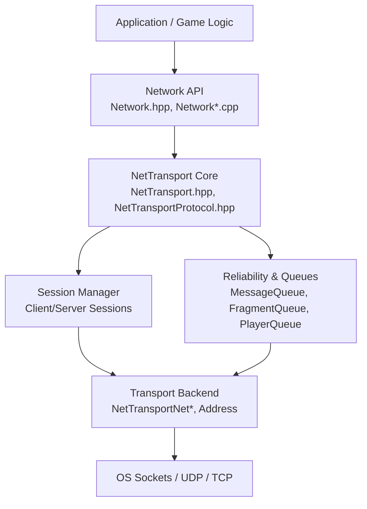
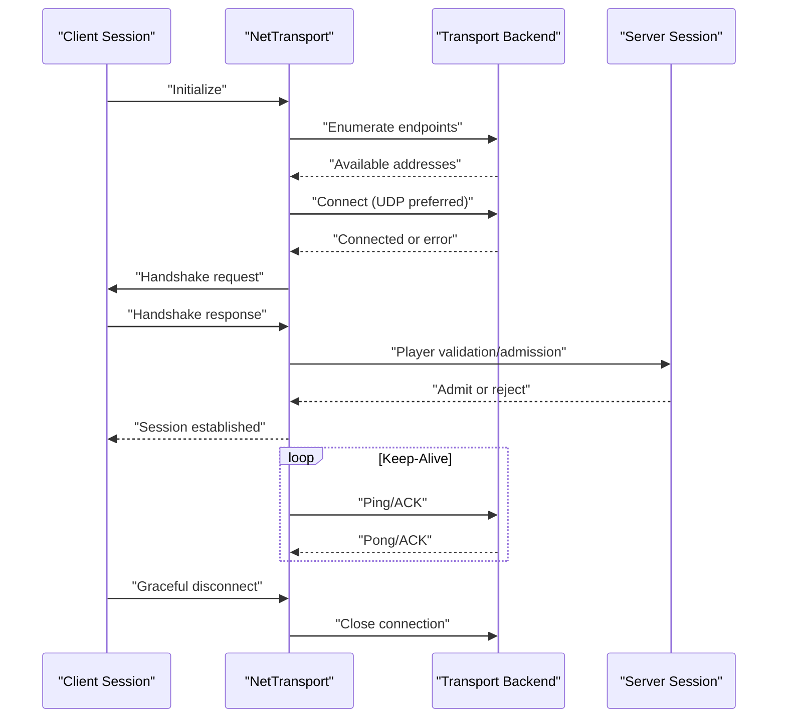
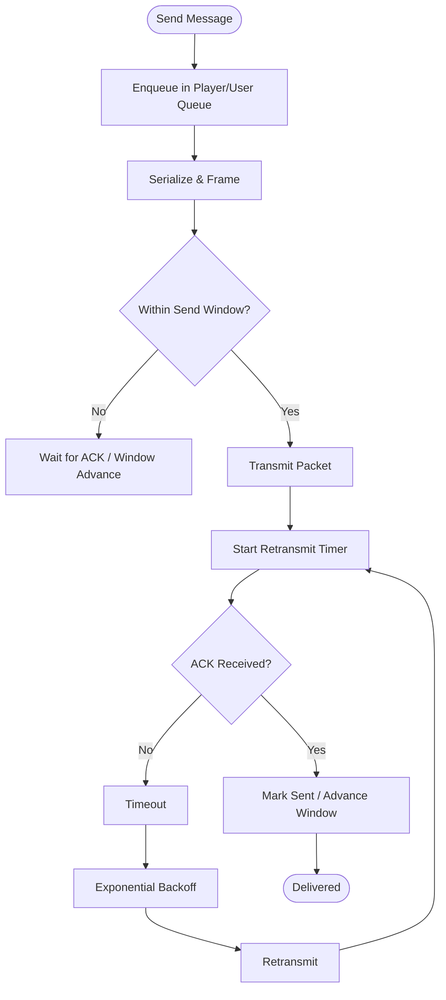
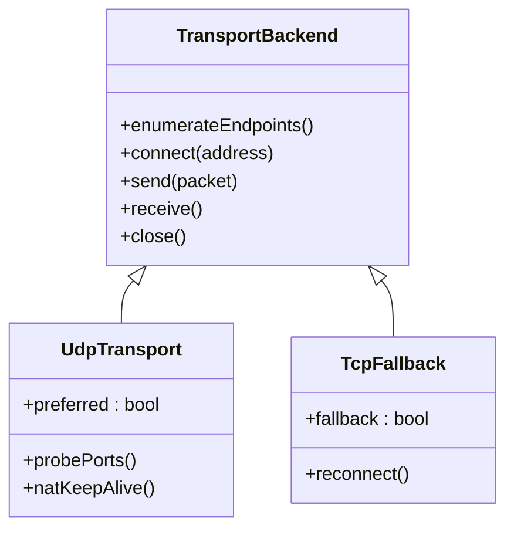
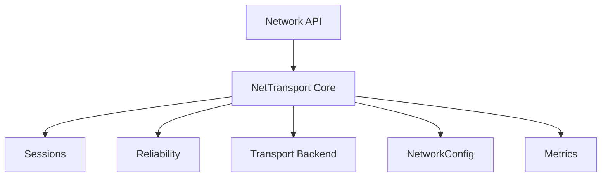

# Transport Layer & Protocol

<cite>
**Referenced Files in This Document**
- [NetTransport.hpp](file://engine/Poseidon/Network/NetTransport.hpp)
- [NetTransportAddress.hpp](file://engine/Poseidon/Network/NetTransportAddress.hpp)
- [NetTransportChannelInfo.hpp](file://engine/Poseidon/Network/NetTransportChannelInfo.hpp)
- [NetTransportClientHandshake.cpp](file://engine/Poseidon/Network/NetTransportClientHandshake.cpp)
- [NetTransportClientHandshake.hpp](file://engine/Poseidon/Network/NetTransportClientHandshake.hpp)
- [NetTransportClientHandshakeTransaction.hpp](file://engine/Poseidon/Network/NetTransportClientHandshakeTransaction.hpp)
- [NetTransportClientInit.hpp](file://engine/Poseidon/Network/NetTransportClientInit.hpp)
- [NetTransportClientReceive.hpp](file://engine/Poseidon/Network/NetTransportClientReceive.hpp)
- [NetTransportClientSession.cpp](file://engine/Poseidon/Network/NetTransportClientSession.cpp)
- [NetTransportClientSession.hpp](file://engine/Poseidon/Network/NetTransportClientSession.hpp)
- [NetTransportClientVoiceInit.hpp](file://engine/Poseidon/Network/NetTransportClientVoiceInit.hpp)
- [NetTransportClientVoiceReceive.hpp](file://engine/Poseidon/Network/NetTransportClientVoiceReceive.hpp)
- [NetTransportClientVoiceState.hpp](file://engine/Poseidon/Network/NetTransportClientVoiceState.hpp)
- [NetTransportEnumRequest.cpp](file://engine/Poseidon/Network/NetTransportEnumRequest.cpp)
- [NetTransportEnumResponse.cpp](file://engine/Poseidon/Network/NetTransportEnumResponse.cpp)
- [NetTransportFragmentQueue.hpp](file://engine/Poseidon/Network/NetTransportFragmentQueue.hpp)
- [NetTransportLocking.hpp](file://engine/Poseidon/Network/NetTransportLocking.hpp)
- [NetTransportMemory.hpp](file://engine/Poseidon/Network/NetTransportMemory.hpp)
- [NetTransportMessageAge.hpp](file://engine/Poseidon/Network/NetTransportMessageAge.hpp)
- [NetTransportMessageQueue.hpp](file://engine/Poseidon/Network/NetTransportMessageQueue.hpp)
- [NetTransportMessageSend.hpp](file://engine/Poseidon/Network/NetTransportMessageSend.hpp)
- [NetTransportMetrics.hpp](file://engine/Poseidon/Network/NetTransportMetrics.hpp)
- [NetTransportNet.cpp](file://engine/Poseidon/Network/NetTransportNet.cpp)
- [NetTransportNetDecls.hpp](file://engine/Poseidon/Network/NetTransportNetDecls.hpp)
- [NetTransportNetEnum.cpp](file://engine/Poseidon/Network/NetTransportNetEnum.cpp)
- [NetTransportNetInternal.hpp](file://engine/Poseidon/Network/NetTransportNetInternal.hpp)
- [NetTransportPeerSetup.hpp](file://engine/Poseidon/Network/NetTransportPeerSetup.hpp)
- [NetTransportPlayerAcceptance.hpp](file://engine/Poseidon/Network/NetTransportPlayerAcceptance.hpp)
- [NetTransportPlayerAckResponse.hpp](file://engine/Poseidon/Network/NetTransportPlayerAckResponse.hpp)
- [NetTransportPlayerAdmission.hpp](file://engine/Poseidon/Network/NetTransportPlayerAdmission.hpp)
- [NetTransportPlayerAllocation.hpp](file://engine/Poseidon/Network/NetTransportPlayerAllocation.hpp)
- [NetTransportPlayerChannelLookup.hpp](file://engine/Poseidon/Network/NetTransportPlayerChannelLookup.hpp)
- [NetTransportPlayerChannelReuse.hpp](file://engine/Poseidon/Network/NetTransportPlayerChannelReuse.hpp)
- [NetTransportPlayerCreation.hpp](file://engine/Poseidon/Network/NetTransportPlayerCreation.hpp)
- [NetTransportPlayerHandshake.cpp](file://engine/Poseidon/Network/NetTransportPlayerHandshake.cpp)
- [NetTransportPlayerHandshake.hpp](file://engine/Poseidon/Network/NetTransportPlayerHandshake.hpp)
- [NetTransportPlayerMonitor.hpp](file://engine/Poseidon/Network/NetTransportPlayerMonitor.hpp)
- [NetTransportPlayerQueue.cpp](file://engine/Poseidon/Network/NetTransportPlayerQueue.cpp)
- [NetTransportPlayerQueue.hpp](file://engine/Poseidon/Network/NetTransportPlayerQueue.hpp)
- [NetTransportPlayerQueueDrain.hpp](file://engine/Poseidon/Network/NetTransportPlayerQueueDrain.hpp)
- [NetTransportPlayerQueuePolicy.hpp](file://engine/Poseidon/Network/NetTransportPlayerQueuePolicy.hpp)
- [NetTransportPlayerReconnect.hpp](file://engine/Poseidon/Network/NetTransportPlayerReconnect.hpp)
- [NetTransportPlayerTermination.hpp](file://engine/Poseidon/Network/NetTransportPlayerTermination.hpp)
- [NetTransportPlayerValidation.cpp](file://engine/Poseidon/Network/NetTransportPlayerValidation.cpp)
- [NetTransportPlayerValidation.hpp](file://engine/Poseidon/Network/NetTransportPlayerValidation.hpp)
- [NetTransportProtocol.hpp](file://engine/Poseidon/Network/NetTransportProtocol.hpp)
- [NetTransportSendComplete.hpp](file://engine/Poseidon/Network/NetTransportSendComplete.hpp)
- [NetTransportServerConnectionInfo.hpp](file://engine/Poseidon/Network/NetTransportServerConnectionInfo.hpp)
- [NetTransportServerControlMessage.hpp](file://engine/Poseidon/Network/NetTransportServerControlMessage.hpp)
- [NetTransportServerControlReceive.hpp](file://engine/Poseidon/Network/NetTransportServerControlReceive.hpp)
- [NetTransportServerDestroyReceive.hpp](file://engine/Poseidon/Network/NetTransportServerDestroyReceive.hpp)
- [NetTransportServerFormatting.hpp](file://engine/Poseidon/Network/NetTransportServerFormatting.hpp)
- [NetTransportServerInit.hpp](file://engine/Poseidon/Network/NetTransportServerInit.hpp)
- [NetTransportServerPlayerLookup.hpp](file://engine/Poseidon/Network/NetTransportServerPlayerLookup.hpp]
- [NetTransportServerSessionQuery.hpp](file://engine/Poseidon/Network/NetTransportServerSessionQuery.hpp)
- [NetTransportServerUserReceive.hpp](file://engine/Poseidon/Network/NetTransportServerUserReceive.hpp)
- [NetTransportServerVoiceInit.hpp](file://engine/Poseidon/Network/NetTransportServerVoiceInit.hpp)
- [NetTransportServerVoiceRouting.hpp](file://engine/Poseidon/Network/NetTransportServerVoiceRouting.hpp)
- [NetTransportSessionCatalog.cpp](file://engine/Poseidon/Network/NetTransportSessionCatalog.cpp)
- [NetTransportSessionCatalog.hpp](file://engine/Poseidon/Network/NetTransportSessionCatalog.hpp)
- [NetTransportSessionEnumeration.hpp](file://engine/Poseidon/Network/NetTransportSessionEnumeration.hpp)
- [NetTransportSessionPacketState.cpp](file://engine/Poseidon/Network/NetTransportSessionPacketState.cpp)
- [NetTransportSessionPacketState.hpp](file://engine/Poseidon/Network/NetTransportSessionPacketState.hpp)
- [NetTransportSessionPolicy.cpp](file://engine/Poseidon/Network/NetTransportSessionPolicy.cpp)
- [NetTransportSessionPolicy.hpp](file://engine/Poseidon/Network/NetTransportSessionPolicy.hpp)
- [NetTransportStatisticsFormatting.hpp](file://engine/Poseidon/Network/NetTransportStatisticsFormatting.hpp)
- [NetTransportStatisticsQuery.hpp](file://engine/Poseidon/Network/NetTransportStatisticsQuery.hpp)
- [NetTransportTermination.cpp](file://engine/Poseidon/Network/NetTransportTermination.cpp)
- [NetTransportTermination.hpp](file://engine/Poseidon/Network/NetTransportTermination.hpp)
- [NetTransportUserIteration.hpp](file://engine/Poseidon/Network/NetTransportUserIteration.hpp)
- [NetTransportUserMessageQueue.hpp](file://engine/Poseidon/Network/NetTransportUserMessageQueue.hpp)
- [NetTransportVoicePlayerQueue.hpp](file://engine/Poseidon/Network/NetTransportVoicePlayerQueue.hpp)
- [NetTransportVoiceRouting.hpp](file://engine/Poseidon/Network/NetTransportVoiceRouting.hpp)
- [NetTransportVoiceSpeakerPool.hpp](file://engine/Poseidon/Network/NetTransportVoiceSpeakerPool.hpp)
- [Network.cpp](file://engine/Poseidon/Network/Network.cpp)
- [Network.hpp](file://engine/Poseidon/Network/Network.hpp)
- [NetworkClient.cpp](file://engine/Poseidon/Network/NetworkClient.cpp)
- [NetworkClientActions.cpp](file://engine/Poseidon/Network/NetworkClientActions.cpp)
- [NetworkClientCommon.hpp](file://engine/Poseidon/Network/NetworkClientCommon.hpp)
- [NetworkClientOnMessage.cpp](file://engine/Poseidon/Network/NetworkClientOnMessage.cpp)
- [NetworkConfig.cpp](file://engine/Poseidon/Network/NetworkConfig.cpp)
- [NetworkConfig.hpp](file://engine/Poseidon/Network/NetworkConfig.hpp)
- [NetworkCustomAssets.hpp](file://engine/Poseidon/Network/NetworkCustomAssets.hpp)
- [NetworkFileTransfer.hpp](file://engine/Poseidon/Network/NetworkFileTransfer.hpp)
- [NetworkIface.hpp](file://engine/Poseidon/Network/NetworkIface.hpp)
- [NetworkImpl.hpp](file://engine/Poseidon/Network/NetworkImpl.hpp)
- [NetworkImplClient.hpp](file://engine/Poseidon/Network/NetworkImplClient.hpp)
- [NetworkImplComponent.hpp](file://engine/Poseidon/Network/NetworkImplComponent.hpp)
- [NetworkImplServer.hpp](file://engine/Poseidon/Network/NetworkImplServer.hpp)
- [NetworkIndices.hpp](file://engine/Poseidon/Network/NetworkIndices.hpp)
- [NetworkManagerState.hpp](file://engine/Poseidon/Network/NetworkManagerState.hpp)
- [NetworkMessages.cpp](file://engine/Poseidon/Network/NetworkMessages.cpp)
- [NetworkMissionTransfer.cpp](file://engine/Poseidon/Network/NetworkMissionTransfer.cpp)
- [NetworkMissionTransfer.hpp](file://engine/Poseidon/Network/NetworkMissionTransfer.hpp)
- [NetworkMsg.cpp](file://engine/Poseidon/Network/NetworkMsg.cpp)
- [NetworkMsgContext.cpp](file://engine/Poseidon/Network/NetworkMsgContext.cpp)
- [NetworkMsgFormat.hpp](file://engine/Poseidon/Network/NetworkMsgFormat.hpp)
- [NetworkObject.hpp](file://engine/Poseidon/Network/NetworkObject.hpp)
- [NetworkPlayerRoleAssignment.hpp](file://engine/Poseidon/Network/NetworkPlayerRoleAssignment.hpp)
- [NetworkScriptValueCodec.cpp](file://engine/Poseidon/Network/NetworkScriptValueCodec.cpp)
- [NetworkScriptValueCodec.hpp](file://engine/Poseidon/Network/NetworkScriptValueCodec.hpp)
- [NetworkServer.cpp](file://engine/Poseidon/Network/NetworkServer.cpp)
- [NetworkServerAuth.hpp](file://engine/Poseidon/Network/NetworkServerAuth.hpp)
- [NetworkServerCommon.hpp](file://engine/Poseidon/Network/NetworkServerCommon.hpp)
- [NetworkServerDispatch.cpp](file://engine/Poseidon/Network/NetworkServerDispatch.cpp)
- [NetworkServerDispatch.hpp](file://engine/Poseidon/Network/NetworkServerDispatch.hpp)
- [NetworkServerIntegrity.cpp](file://engine/Poseidon/Network/NetTransportPlayerValidation.cpp)
- [NetworkServerMission.cpp](file://engine/Poseidon/Network/NetworkServerMission.cpp)
- [NetworkServerMsg.cpp](file://engine/Poseidon/Network/NetworkServerMsg.cpp)
- [NetworkServerMsgOnMessage.cpp](file://engine/Poseidon/Network/NetworkServerMsgOnMessage.cpp)
- [NetworkServerSimulate.cpp](file://engine/Poseidon/Network/NetworkServerSimulate.cpp)
- [Networks.cpp](file://engine/Poseidon/Network/Networks.cpp)
- [RateLimit.hpp](file://engine/Poseidon/Network/RateLimit.hpp)
- [WireBounds.hpp](file://engine/Poseidon/Network/WireBounds.hpp)
</cite>

## Table of Contents
1. [Introduction](#introduction)
2. [Project Structure](#project-structure)
3. [Core Components](#core-components)
4. [Architecture Overview](#architecture-overview)
5. [Detailed Component Analysis](#detailed-component-analysis)
6. [Dependency Analysis](#dependency-analysis)
7. [Performance Considerations](#performance-considerations)
8. [Troubleshooting Guide](#troubleshooting-guide)
9. [Conclusion](#conclusion)
10. [Appendices](#appendices)

## Introduction
This document explains the NetTransport protocol layer responsible for low-level network communication in the engine’s networking stack. It covers the transport abstraction interface, message framing and serialization, connection lifecycle (handshake, keep-alive, graceful disconnect), reliable delivery via message queues and retransmission, congestion control, UDP-first transport with TCP fallback, NAT traversal techniques, and firewall compatibility. It also provides guidance for implementing custom transport backends and debugging connectivity issues.

## Project Structure
The NetTransport subsystem is implemented under the Network module. The key areas are:
- Transport abstraction and core interfaces
- Client and server session management
- Handshake, player lifecycle, and admission/validation
- Message queuing, fragmentation, and reliability
- Session policies, metrics, and statistics
- Networking configuration and higher-level network APIs

```mermaid
graph TB
subgraph "NetTransport Core"
A["NetTransport.hpp"]
B["NetTransportProtocol.hpp"]
C["NetTransportNetDecls.hpp"]
D["NetTransportNetInternal.hpp"]
end
subgraph "Sessions & Lifecycle"
E["NetTransportClientSession.hpp"]
F["NetTransportServerConnectionInfo.hpp"]
G["NetTransportSessionPolicy.hpp"]
H["NetTransportSessionCatalog.hpp"]
end
subgraph "Reliability & Queues"
I["NetTransportMessageQueue.hpp"]
J["NetTransportFragmentQueue.hpp"]
K["NetTransportPlayerQueue.hpp"]
L["NetTransportUserMessageQueue.hpp"]
M["NetTransportMessageAge.hpp"]
end
subgraph "Handshake & Admission"
N["NetTransportClientHandshake.hpp"]
O["NetTransportPlayerHandshake.hpp"]
P["NetTransportPlayerValidation.hpp"]
Q["NetTransportPlayerAdmission.hpp"]
end
subgraph "Transport Backend"
R["NetTransportNet.cpp"]
S["NetTransportNetEnum.cpp"]
T["NetTransportAddress.hpp"]
end
A --> B
A --> C
A --> D
E --> G
E --> H
I --> J
K --> L
N --> O
O --> P
P --> Q
R --> T
```

**Diagram sources**
- [NetTransport.hpp](file://engine/Poseidon/Network/NetTransport.hpp)
- [NetTransportProtocol.hpp](file://engine/Poseidon/Network/NetTransportProtocol.hpp)
- [NetTransportNetDecls.hpp](file://engine/Poseidon/Network/NetTransportNetDecls.hpp)
- [NetTransportNetInternal.hpp](file://engine/Poseidon/Network/NetTransportNetInternal.hpp)
- [NetTransportClientSession.hpp](file://engine/Poseidon/Network/NetTransportClientSession.hpp)
- [NetTransportServerConnectionInfo.hpp](file://engine/Poseidon/Network/NetTransportServerConnectionInfo.hpp)
- [NetTransportSessionPolicy.hpp](file://engine/Poseidon/Network/NetTransportSessionPolicy.hpp)
- [NetTransportSessionCatalog.hpp](file://engine/Poseidon/Network/NetTransportSessionCatalog.hpp)
- [NetTransportMessageQueue.hpp](file://engine/Poseidon/Network/NetTransportMessageQueue.hpp)
- [NetTransportFragmentQueue.hpp](file://engine/Poseidon/Network/NetTransportFragmentQueue.hpp)
- [NetTransportPlayerQueue.hpp](file://engine/Poseidon/Network/NetTransportPlayerQueue.hpp)
- [NetTransportUserMessageQueue.hpp](file://engine/Poseidon/Network/NetTransportUserMessageQueue.hpp)
- [NetTransportMessageAge.hpp](file://engine/Poseidon/Network/NetTransportMessageAge.hpp)
- [NetTransportClientHandshake.hpp](file://engine/Poseidon/Network/NetTransportClientHandshake.hpp)
- [NetTransportPlayerHandshake.hpp](file://engine/Poseidon/Network/NetTransportPlayerHandshake.hpp)
- [NetTransportPlayerValidation.hpp](file://engine/Poseidon/Network/NetTransportPlayerValidation.hpp)
- [NetTransportPlayerAdmission.hpp](file://engine/Poseidon/Network/NetTransportPlayerAdmission.hpp)
- [NetTransportNet.cpp](file://engine/Poseidon/Network/NetTransportNet.cpp)
- [NetTransportNetEnum.cpp](file://engine/Poseidon/Network/NetTransportNetEnum.cpp)
- [NetTransportAddress.hpp](file://engine/Poseidon/Network/NetTransportAddress.hpp)

**Section sources**
- [NetTransport.hpp](file://engine/Poseidon/Network/NetTransport.hpp)
- [NetTransportProtocol.hpp](file://engine/Poseidon/Network/NetTransportProtocol.hpp)
- [NetTransportNetDecls.hpp](file://engine/Poseidon/Network/NetTransportNetDecls.hpp)
- [NetTransportNetInternal.hpp](file://engine/Poseidon/Network/NetTransportNetInternal.hpp)
- [NetTransportClientSession.hpp](file://engine/Poseidon/Network/NetTransportClientSession.hpp)
- [NetTransportServerConnectionInfo.hpp](file://engine/Poseidon/Network/NetTransportServerConnectionInfo.hpp)
- [NetTransportSessionPolicy.hpp](file://engine/Poseidon/Network/NetTransportSessionPolicy.hpp)
- [NetTransportSessionCatalog.hpp](file://engine/Poseidon/Network/NetTransportSessionCatalog.hpp)
- [NetTransportMessageQueue.hpp](file://engine/Poseidon/Network/NetTransportMessageQueue.hpp)
- [NetTransportFragmentQueue.hpp](file://engine/Poseidon/Network/NetTransportFragmentQueue.hpp)
- [NetTransportPlayerQueue.hpp](file://engine/Poseidon/Network/NetTransportPlayerQueue.hpp)
- [NetTransportUserMessageQueue.hpp](file://engine/Poseidon/Network/NetTransportUserMessageQueue.hpp)
- [NetTransportMessageAge.hpp](file://engine/Poseidon/Network/NetTransportMessageAge.hpp)
- [NetTransportClientHandshake.hpp](file://engine/Poseidon/Network/NetTransportClientHandshake.hpp)
- [NetTransportPlayerHandshake.hpp](file://engine/Poseidon/Network/NetTransportPlayerHandshake.hpp)
- [NetTransportPlayerValidation.hpp](file://engine/Poseidon/Network/NetTransportPlayerValidation.hpp)
- [NetTransportPlayerAdmission.hpp](file://engine/Poseidon/Network/NetTransportPlayerAdmission.hpp)
- [NetTransportNet.cpp](file://engine/Poseidon/Network/NetTransportNet.cpp)
- [NetTransportNetEnum.cpp](file://engine/Poseidon/Network/NetTransportNetEnum.cpp)
- [NetTransportAddress.hpp](file://engine/Poseidon/Network/NetTransportAddress.hpp)

## Core Components
- Transport Abstraction Interface: Defines the contract for sending/receiving packets, address handling, and transport capabilities.
- Protocol Definitions: Enumerates message types, flags, and wire formats used across the transport.
- Session Management: Tracks client/server sessions, peer setup, and policy-driven behavior.
- Reliability Layer: Manages per-player/user queues, fragmentation, acknowledgements, and age-based expiry.
- Handshake and Admission: Handles initial handshake, player validation, and admission decisions.
- Transport Backend: Low-level networking implementation (UDP/TCP selection, enumeration, and internal details).

Key responsibilities:
- Frame messages into packets with sequence numbers and checksums.
- Maintain per-peer send/receive windows and ack state.
- Provide keep-alive and timeout mechanisms to detect liveness.
- Support graceful shutdown and resource cleanup.

**Section sources**
- [NetTransport.hpp](file://engine/Poseidon/Network/NetTransport.hpp)
- [NetTransportProtocol.hpp](file://engine/Poseidon/Network/NetTransportProtocol.hpp)
- [NetTransportNetDecls.hpp](file://engine/Poseidon/Network/NetTransportNetDecls.hpp)
- [NetTransportNetInternal.hpp](file://engine/Poseidon/Network/NetTransportNetInternal.hpp)
- [NetTransportClientSession.hpp](file://engine/Poseidon/Network/NetTransportClientSession.hpp)
- [NetTransportServerConnectionInfo.hpp](file://engine/Poseidon/Network/NetTransportServerConnectionInfo.hpp)
- [NetTransportSessionPolicy.hpp](file://engine/Poseidon/Network/NetTransportSessionPolicy.hpp)
- [NetTransportMessageQueue.hpp](file://engine/Poseidon/Network/NetTransportMessageQueue.hpp)
- [NetTransportFragmentQueue.hpp](file://engine/Poseidon/Network/NetTransportFragmentQueue.hpp)
- [NetTransportPlayerQueue.hpp](file://engine/Poseidon/Network/NetTransportPlayerQueue.hpp)
- [NetTransportUserMessageQueue.hpp](file://engine/Poseidon/Network/NetTransportUserMessageQueue.hpp)
- [NetTransportMessageAge.hpp](file://engine/Poseidon/Network/NetTransportMessageAge.hpp)
- [NetTransportClientHandshake.hpp](file://engine/Poseidon/Network/NetTransportClientHandshake.hpp)
- [NetTransportPlayerHandshake.hpp](file://engine/Poseidon/Network/NetTransportPlayerHandshake.hpp)
- [NetTransportPlayerValidation.hpp](file://engine/Poseidon/Network/NetTransportPlayerValidation.hpp)
- [NetTransportPlayerAdmission.hpp](file://engine/Poseidon/Network/NetTransportPlayerAdmission.hpp)
- [NetTransportNet.cpp](file://engine/Poseidon/Network/NetTransportNet.cpp)
- [NetTransportNetEnum.cpp](file://engine/Poseidon/Network/NetTransportNetEnum.cpp)
- [NetTransportAddress.hpp](file://engine/Poseidon/Network/NetTransportAddress.hpp)

## Architecture Overview
The NetTransport layer sits above the OS sockets and below the higher-level Network API. It abstracts the underlying transport while providing reliability, ordering guarantees where needed, and session management.

**Diagram sources**
- [Network.hpp](file://engine/Poseidon/Network/Network.hpp)
- [Network.cpp](file://engine/Poseidon/Network/Network.cpp)
- [NetTransport.hpp](file://engine/Poseidon/Network/NetTransport.hpp)
- [NetTransportProtocol.hpp](file://engine/Poseidon/Network/NetTransportProtocol.hpp)
- [NetTransportClientSession.hpp](file://engine/Poseidon/Network/NetTransportClientSession.hpp)
- [NetTransportServerConnectionInfo.hpp](file://engine/Poseidon/Network/NetTransportServerConnectionInfo.hpp)
- [NetTransportMessageQueue.hpp](file://engine/Poseidon/Network/NetTransportMessageQueue.hpp)
- [NetTransportFragmentQueue.hpp](file://engine/Poseidon/Network/NetTransportFragmentQueue.hpp)
- [NetTransportPlayerQueue.hpp](file://engine/Poseidon/Network/NetTransportPlayerQueue.hpp)
- [NetTransportNet.cpp](file://engine/Poseidon/Network/NetTransportNet.cpp)
- [NetTransportAddress.hpp](file://engine/Poseidon/Network/NetTransportAddress.hpp)

## Detailed Component Analysis

### Transport Abstraction Interface
The transport abstraction defines how messages are framed, sent, and received across different underlying transports. It encapsulates:
- Packet serialization/deserialization
- Sequence numbering and acknowledgement handling
- Per-peer state tracking (send window, receive window)
- Capability negotiation (e.g., max packet size, supported features)

Implementation highlights:
- Consistent header format with type, flags, sequence, and length fields.
- Optional payload encryption or integrity checks as configured by policy.
- Pluggable backend for UDP/TCP selection and enumeration.

**Section sources**
- [NetTransport.hpp](file://engine/Poseidon/Network/NetTransport.hpp)
- [NetTransportProtocol.hpp](file://engine/Poseidon/Network/NetTransportProtocol.hpp)
- [NetTransportNetDecls.hpp](file://engine/Poseidon/Network/NetTransportNetDecls.hpp)
- [NetTransportNetInternal.hpp](file://engine/Poseidon/Network/NetTransportNetInternal.hpp)

### Message Framing and Serialization
Framing ensures that variable-length payloads can be reliably transmitted over packet-oriented transports. Key aspects:
- Header includes message type, version, flags, sequence number, and payload length.
- Payload may be split into fragments when exceeding MTU; fragment queue tracks assembly.
- Checksums or hashes verify integrity; optional compression based on policy.

Serialization flow:
- Application constructs a logical message.
- Transport serializes into frames with headers.
- Frames are queued per peer and scheduled for transmission.
- Receiver deserializes frames, reassembles fragments, and delivers messages.

**Section sources**
- [NetTransportProtocol.hpp](file://engine/Poseidon/Network/NetTransportProtocol.hpp)
- [NetTransportFragmentQueue.hpp](file://engine/Poseidon/Network/NetTransportFragmentQueue.hpp)
- [NetTransportMessageQueue.hpp](file://engine/Poseidon/Network/NetTransportMessageQueue.hpp)

### Connection Lifecycle Management
Lifecycle phases include discovery, handshake, admission, session establishment, keep-alive, and graceful termination.

Sequence diagram for client connection:

**Diagram sources**
- [NetTransportClientSession.hpp](file://engine/Poseidon/Network/NetTransportClientSession.hpp)
- [NetTransportClientHandshake.hpp](file://engine/Poseidon/Network/NetTransportClientHandshake.hpp)
- [NetTransportPlayerHandshake.hpp](file://engine/Poseidon/Network/NetTransportPlayerHandshake.hpp)
- [NetTransportPlayerValidation.hpp](file://engine/Poseidon/Network/NetTransportPlayerValidation.hpp)
- [NetTransportPlayerAdmission.hpp](file://engine/Poseidon/Network/NetTransportPlayerAdmission.hpp)
- [NetTransportNet.cpp](file://engine/Poseidon/Network/NetTransportNet.cpp)
- [NetTransportAddress.hpp](file://engine/Poseidon/Network/NetTransportAddress.hpp)

**Section sources**
- [NetTransportClientSession.hpp](file://engine/Poseidon/Network/NetTransportClientSession.hpp)
- [NetTransportClientHandshake.hpp](file://engine/Poseidon/Network/NetTransportClientHandshake.hpp)
- [NetTransportPlayerHandshake.hpp](file://engine/Poseidon/Network/NetTransportPlayerHandshake.hpp)
- [NetTransportPlayerValidation.hpp](file://engine/Poseidon/Network/NetTransportPlayerValidation.hpp)
- [NetTransportPlayerAdmission.hpp](file://engine/Poseidon/Network/NetTransportPlayerAdmission.hpp)
- [NetTransportTermination.hpp](file://engine/Poseidon/Network/NetTransportTermination.hpp)

### Reliable Delivery, Retransmission, and Congestion Control
Reliability is achieved through:
- Per-message sequence numbers and acknowledgements.
- Retransmission timers with exponential backoff.
- Windowed flow control to prevent sender overload.
- Age-based expiry to drop stale messages.

Congestion control strategies:
- Rate limiting per peer and global limits.
- Dynamic adjustment of send rate based on ACK latency and loss.
- Backpressure when queues exceed thresholds.

**Diagram sources**
- [NetTransportPlayerQueue.hpp](file://engine/Poseidon/Network/NetTransportPlayerQueue.hpp)
- [NetTransportUserMessageQueue.hpp](file://engine/Poseidon/Network/NetTransportUserMessageQueue.hpp)
- [NetTransportMessageAge.hpp](file://engine/Poseidon/Network/NetTransportMessageAge.hpp)
- [NetTransportMessageQueue.hpp](file://engine/Poseidon/Network/NetTransportMessageQueue.hpp)

**Section sources**
- [NetTransportPlayerQueue.hpp](file://engine/Poseidon/Network/NetTransportPlayerQueue.hpp)
- [NetTransportUserMessageQueue.hpp](file://engine/Poseidon/Network/NetTransportUserMessageQueue.hpp)
- [NetTransportMessageAge.hpp](file://engine/Poseidon/Network/NetTransportMessageAge.hpp)
- [NetTransportMessageQueue.hpp](file://engine/Poseidon/Network/NetTransportMessageQueue.hpp)
- [RateLimit.hpp](file://engine/Poseidon/Network/RateLimit.hpp)

### UDP-Based Transport with TCP Fallback
Strategy:
- Prefer UDP for low-latency game traffic.
- Fall back to TCP if UDP is blocked or unreliable.
- Use port probing and capability detection to select optimal path.

NAT traversal and firewall compatibility:
- STUN-like probing to discover public endpoints.
- NAT keep-alives to maintain mappings.
- Firewall-friendly ports and protocols; optional DTLS considerations.

**Diagram sources**
- [NetTransportNet.cpp](file://engine/Poseidon/Network/NetTransportNet.cpp)
- [NetTransportNetEnum.cpp](file://engine/Poseidon/Network/NetTransportNetEnum.cpp)
- [NetTransportAddress.hpp](file://engine/Poseidon/Network/NetTransportAddress.hpp)

**Section sources**
- [NetTransportNet.cpp](file://engine/Poseidon/Network/NetTransportNet.cpp)
- [NetTransportNetEnum.cpp](file://engine/Poseidon/Network/NetTransportNetEnum.cpp)
- [NetTransportAddress.hpp](file://engine/Poseidon/Network/NetTransportAddress.hpp)

### Implementing Custom Transport Backends
Steps:
- Implement the transport interface methods for enumeration, connect, send, receive, and close.
- Handle address resolution and endpoint representation.
- Integrate with session manager and reliability layer.
- Provide capability flags (MTU, encryption support, etc.).

Best practices:
- Ensure thread-safe send/receive operations.
- Expose metrics for monitoring (latency, loss, throughput).
- Gracefully handle errors and resource cleanup.

**Section sources**
- [NetTransportNetDecls.hpp](file://engine/Poseidon/Network/NetTransportNetDecls.hpp)
- [NetTransportNetInternal.hpp](file://engine/Poseidon/Network/NetTransportNetInternal.hpp)
- [NetTransportAddress.hpp](file://engine/Poseidon/Network/NetTransportAddress.hpp)

### Debugging Network Connectivity Issues
Diagnostic tools and techniques:
- Enable detailed logging for handshake, send/receive, and timeouts.
- Inspect session state and queue depths.
- Use packet capture to validate framing and sequencing.
- Monitor metrics like RTT, jitter, and packet loss.

Common pitfalls:
- Incorrect MTU causing fragmentation issues.
- NAT mapping timeouts due to insufficient keep-alives.
- Misconfigured ports or firewall rules blocking UDP/TCP.

**Section sources**
- [NetTransportMetrics.hpp](file://engine/Poseidon/Network/NetTransportMetrics.hpp)
- [NetTransportSessionPolicy.hpp](file://engine/Poseidon/Network/NetTransportSessionPolicy.hpp)
- [NetTransportNet.cpp](file://engine/Poseidon/Network/NetTransportNet.cpp)

## Dependency Analysis
The NetTransport layer depends on lower-level networking primitives and higher-level network APIs. Cohesion is high within modules (sessions, reliability, handshake), while coupling is minimized through clear interfaces.

**Diagram sources**
- [Network.hpp](file://engine/Poseidon/Network/Network.hpp)
- [NetTransport.hpp](file://engine/Poseidon/Network/NetTransport.hpp)
- [NetTransportClientSession.hpp](file://engine/Poseidon/Network/NetTransportClientSession.hpp)
- [NetTransportMessageQueue.hpp](file://engine/Poseidon/Network/NetTransportMessageQueue.hpp)
- [NetTransportNet.cpp](file://engine/Poseidon/Network/NetTransportNet.cpp)
- [NetworkConfig.hpp](file://engine/Poseidon/Network/NetworkConfig.hpp)
- [NetTransportMetrics.hpp](file://engine/Poseidon/Network/NetTransportMetrics.hpp)

**Section sources**
- [Network.hpp](file://engine/Poseidon/Network/Network.hpp)
- [NetTransport.hpp](file://engine/Poseidon/Network/NetTransport.hpp)
- [NetTransportClientSession.hpp](file://engine/Poseidon/Network/NetTransportClientSession.hpp)
- [NetTransportMessageQueue.hpp](file://engine/Poseidon/Network/NetTransportMessageQueue.hpp)
- [NetTransportNet.cpp](file://engine/Poseidon/Network/NetTransportNet.cpp)
- [NetworkConfig.hpp](file://engine/Poseidon/Network/NetworkConfig.hpp)
- [NetTransportMetrics.hpp](file://engine/Poseidon/Network/NetTransportMetrics.hpp)

## Performance Considerations
- Minimize allocations in hot paths; reuse buffers where possible.
- Tune MTU and fragmentation thresholds to reduce overhead.
- Adjust retransmission timers based on observed RTT and loss.
- Use batching for small messages to improve throughput.
- Profile CPU usage in serialization/deserialization and queue management.

[No sources needed since this section provides general guidance]

## Troubleshooting Guide
- Verify endpoint enumeration results and connectivity.
- Check handshake logs for errors or mismatches.
- Inspect queue depths and memory usage for leaks.
- Validate firewall/NAT settings and port availability.
- Use metrics to identify bottlenecks and anomalies.

**Section sources**
- [NetTransportNetEnum.cpp](file://engine/Poseidon/Network/NetTransportNetEnum.cpp)
- [NetTransportClientHandshake.hpp](file://engine/Poseidon/Network/NetTransportClientHandshake.hpp)
- [NetTransportMetrics.hpp](file://engine/Poseidon/Network/NetTransportMetrics.hpp)

## Conclusion
The NetTransport protocol layer provides a robust, pluggable foundation for low-level network communication. Its design emphasizes clarity, reliability, and performance, supporting modern networking challenges such as NAT traversal and mixed UDP/TCP environments. By following the guidelines for implementation and debugging, developers can extend and optimize the transport layer to meet diverse application needs.

[No sources needed since this section summarizes without analyzing specific files]

## Appendices
- Example workflows for custom backend integration.
- Configuration options for tuning reliability and congestion control.
- Checklist for NAT/firewall compatibility testing.

[No sources needed since this section provides general guidance]