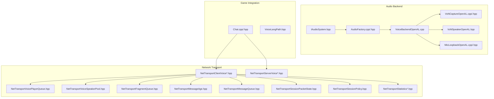
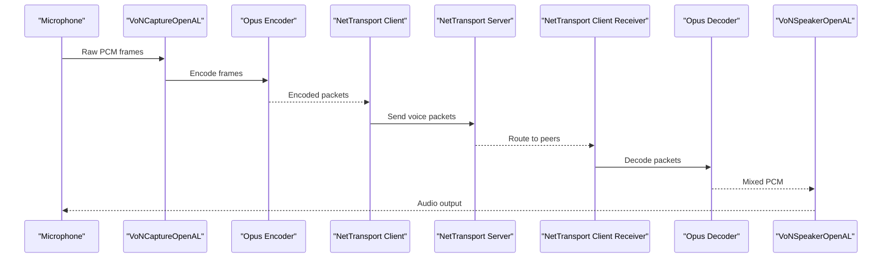
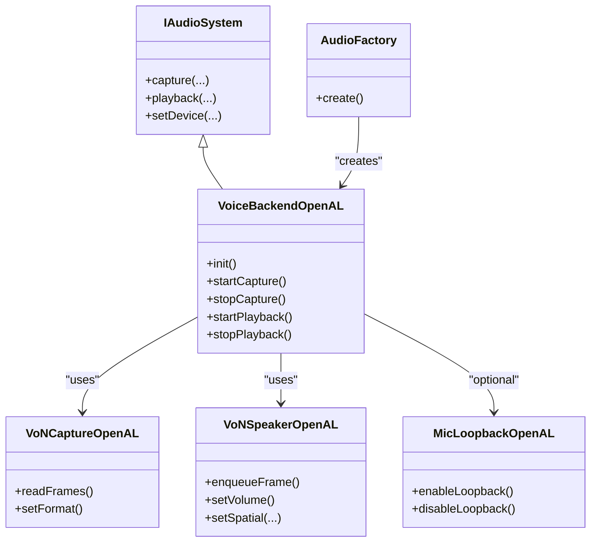
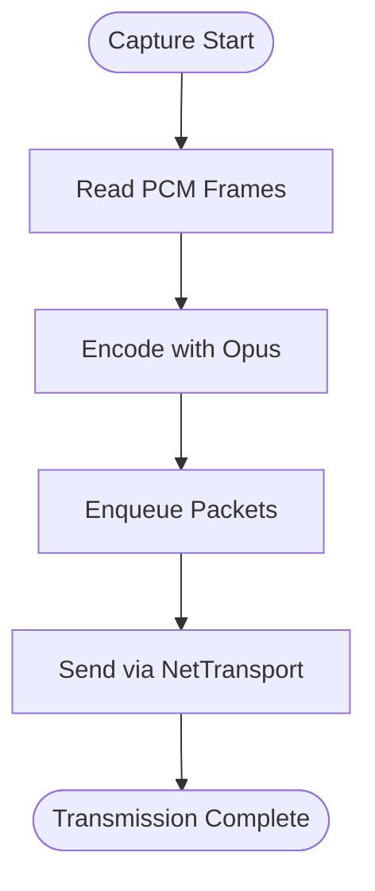
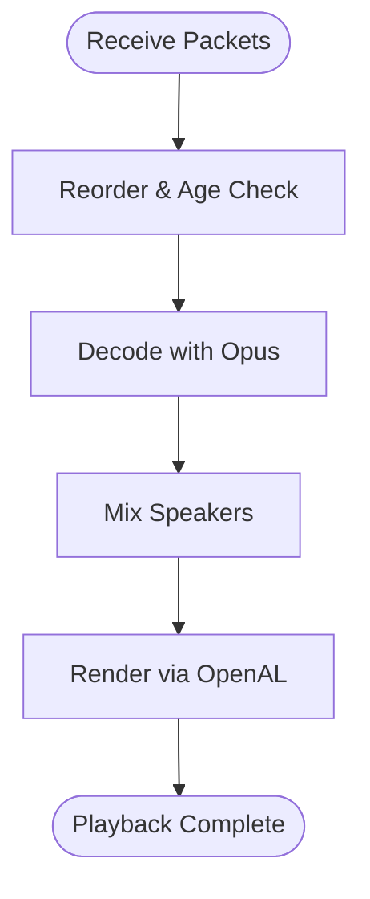
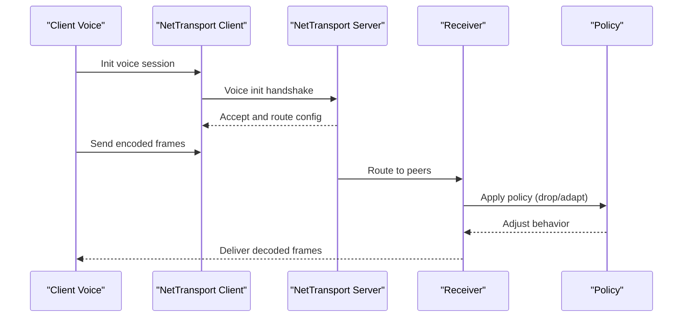
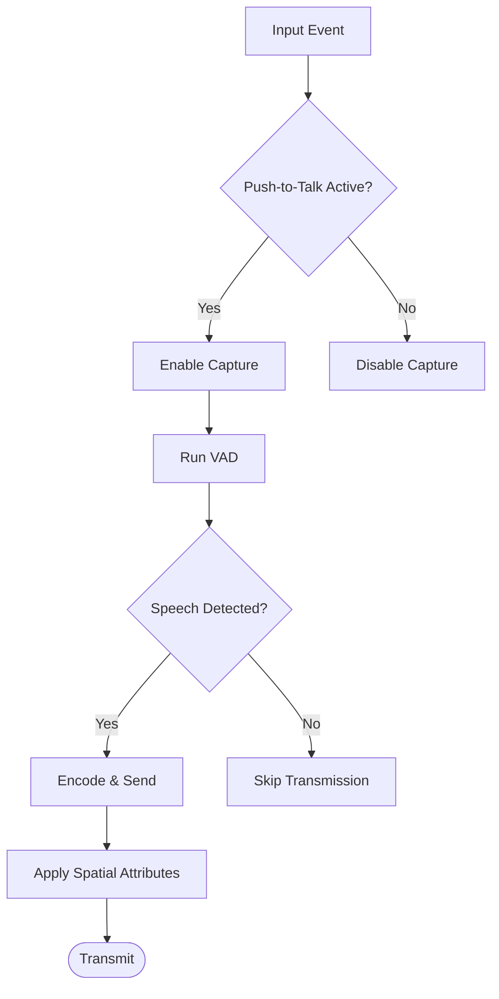
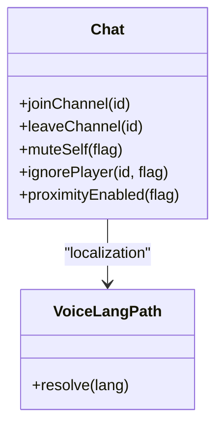
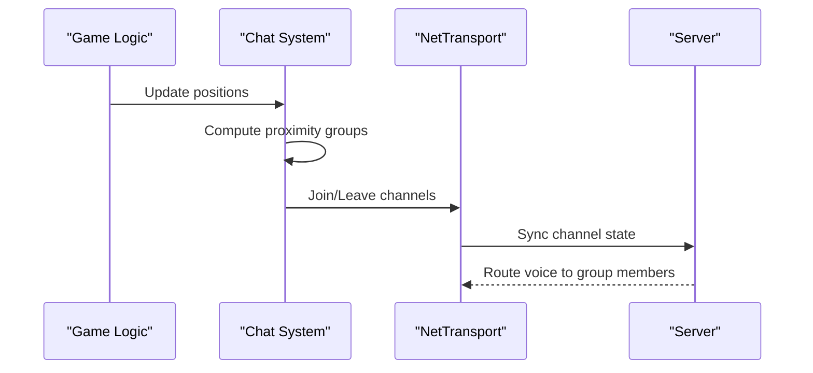
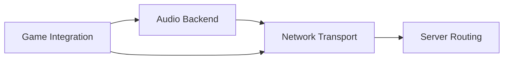

# Voice Chat System

<cite>
**Referenced Files in This Document**
- [IAudioSystem.hpp](file://engine/Poseidon/Audio/IAudioSystem.hpp)
- [AudioFactory.cpp](file://engine/Poseidon/Audio/AudioFactory.cpp)
- [AudioFactory.hpp](file://engine/Poseidon/Audio/AudioFactory.hpp)
- [VoiceLangPath.hpp](file://engine/Poseidon/Audio/VoiceLangPath.hpp)
- [VoNCaptureOpenAL.cpp](file://engine/Poseidon/OpenAL/Voice/VoNCaptureOpenAL.cpp)
- [VoNCaptureOpenAL.hpp](file://engine/Poseidon/OpenAL/Voice/VoNCaptureOpenAL.hpp)
- [VoNSpeakerOpenAL.hpp](file://engine/Poseidon/OpenAL/Voice/VoNSpeakerOpenAL.hpp)
- [VoiceBackendOpenAL.cpp](file://engine/Poseidon/OpenAL/Voice/VoiceBackendOpenAL.cpp)
- [MicLoopbackOpenAL.cpp](file://engine/Poseidon/OpenAL/Voice/MicLoopbackOpenAL.cpp)
- [MicLoopbackOpenAL.hpp](file://engine/Poseidon/OpenAL/Voice/MicLoopbackOpenAL.hpp)
- [NetTransportClientVoiceInit.hpp](file://engine/Poseidon/Network/NetTransportClientVoiceInit.hpp)
- [NetTransportClientVoiceReceive.hpp](file://engine/Poseidon/Network/NetTransportClientVoiceReceive.hpp)
- [NetTransportClientVoiceState.hpp](file://engine/Poseidon/Network/NetTransportClientVoiceState.hpp)
- [NetTransportServerVoiceInit.hpp](file://engine/Poseidon/Network/NetTransportServerVoiceInit.hpp)
- [NetTransportServerVoiceRouting.hpp](file://engine/Poseidon/Network/NetTransportServerVoiceRouting.hpp)
- [NetTransportVoicePlayerQueue.hpp](file://engine/Poseidon/Network/NetTransportVoicePlayerQueue.hpp)
- [NetTransportVoiceSpeakerPool.hpp](file://engine/Poseidon/Network/NetTransportVoiceSpeakerPool.hpp)
- [NetTransportFragmentQueue.hpp](file://engine/Poseidon/Network/NetTransportFragmentQueue.hpp)
- [NetTransportMessageAge.hpp](file://engine/Poseidon/Network/NetTransportMessageAge.hpp)
- [NetTransportMessageQueue.hpp](file://engine/Poseidon/Network/NetTransportMessageQueue.hpp)
- [NetTransportSessionPacketState.hpp](file://engine/Poseidon/Network/NetTransportSessionPacketState.hpp)
- [NetTransportSessionPolicy.hpp](file://engine/Poseidon/Network/NetTransportSessionPolicy.hpp)
- [NetTransportStatisticsFormatting.hpp](file://engine/Poseidon/Network/NetTransportStatisticsFormatting.hpp)
- [NetTransportStatisticsQuery.hpp](file://engine/Poseidon/Network/NetTransportStatisticsQuery.hpp)
- [Chat.cpp](file://engine/Poseidon/Game/Chat.cpp)
- [Chat.hpp](file://engine/Poseidon/Game/Chat.hpp)
</cite>

## Table of Contents
1. [Introduction](#introduction)
2. [Project Structure](#project-structure)
3. [Core Components](#core-components)
4. [Architecture Overview](#architecture-overview)
5. [Detailed Component Analysis](#detailed-component-analysis)
6. [Dependency Analysis](#dependency-analysis)
7. [Performance Considerations](#performance-considerations)
8. [Troubleshooting Guide](#troubleshooting-guide)
9. [Conclusion](#conclusion)

## Introduction
This document explains the voice chat system built on top of the Opus codec and a custom VoN protocol. It covers the full pipeline from voice capture to playback, the abstraction over audio backends, the real-time transport layer for streaming, packet loss recovery, and adaptive bitrate control. It also documents push-to-talk, voice activity detection (VAD), spatial audio positioning, privacy controls, voice channel management, and integration with game events such as proximity-based voice chat.

## Project Structure
The voice system spans three main areas:
- Audio backend abstraction and OpenAL implementation for capture and playback
- Network transport layer for client-server voice sessions, routing, and quality adaptation
- Game integration for chat UI, push-to-talk, VAD, and proximity logic

**Diagram sources**
- [IAudioSystem.hpp](file://engine/Poseidon/Audio/IAudioSystem.hpp)
- [AudioFactory.cpp](file://engine/Poseidon/Audio/AudioFactory.cpp)
- [AudioFactory.hpp](file://engine/Poseidon/Audio/AudioFactory.hpp)
- [VoiceBackendOpenAL.cpp](file://engine/Poseidon/OpenAL/Voice/VoiceBackendOpenAL.cpp)
- [VoNCaptureOpenAL.cpp](file://engine/Poseidon/OpenAL/Voice/VoNCaptureOpenAL.cpp)
- [VoNCaptureOpenAL.hpp](file://engine/Poseidon/OpenAL/Voice/VoNCaptureOpenAL.hpp)
- [VoNSpeakerOpenAL.hpp](file://engine/Poseidon/OpenAL/Voice/VoNSpeakerOpenAL.hpp)
- [MicLoopbackOpenAL.cpp](file://engine/Poseidon/OpenAL/Voice/MicLoopbackOpenAL.cpp)
- [MicLoopbackOpenAL.hpp](file://engine/Poseidon/OpenAL/Voice/MicLoopbackOpenAL.hpp)
- [NetTransportClientVoiceInit.hpp](file://engine/Poseidon/Network/NetTransportClientVoiceInit.hpp)
- [NetTransportClientVoiceReceive.hpp](file://engine/Poseidon/Network/NetTransportClientVoiceReceive.hpp)
- [NetTransportClientVoiceState.hpp](file://engine/Poseidon/Network/NetTransportClientVoiceState.hpp)
- [NetTransportServerVoiceInit.hpp](file://engine/Poseidon/Network/NetTransportServerVoiceInit.hpp)
- [NetTransportServerVoiceRouting.hpp](file://engine/Poseidon/Network/NetTransportServerVoiceRouting.hpp)
- [NetTransportVoicePlayerQueue.hpp](file://engine/Poseidon/Network/NetTransportVoicePlayerQueue.hpp)
- [NetTransportVoiceSpeakerPool.hpp](file://engine/Poseidon/Network/NetTransportVoiceSpeakerPool.hpp)
- [NetTransportFragmentQueue.hpp](file://engine/Poseidon/Network/NetTransportFragmentQueue.hpp)
- [NetTransportMessageAge.hpp](file://engine/Poseidon/Network/NetTransportMessageAge.hpp)
- [NetTransportMessageQueue.hpp](file://engine/Poseidon/Network/NetTransportMessageQueue.hpp)
- [NetTransportSessionPacketState.hpp](file://engine/Poseidon/Network/NetTransportSessionPacketState.hpp)
- [NetTransportSessionPolicy.hpp](file://engine/Poseidon/Network/NetTransportSessionPolicy.hpp)
- [NetTransportStatisticsFormatting.hpp](file://engine/Poseidon/Network/NetTransportStatisticsFormatting.hpp)
- [NetTransportStatisticsQuery.hpp](file://engine/Poseidon/Network/NetTransportStatisticsQuery.hpp)
- [Chat.cpp](file://engine/Poseidon/Game/Chat.cpp)
- [Chat.hpp](file://engine/Poseidon/Game/Chat.hpp)
- [VoiceLangPath.hpp](file://engine/Poseidon/Audio/VoiceLangPath.hpp)

**Section sources**
- [IAudioSystem.hpp](file://engine/Poseidon/Audio/IAudioSystem.hpp)
- [AudioFactory.cpp](file://engine/Poseidon/Audio/AudioFactory.cpp)
- [AudioFactory.hpp](file://engine/Poseidon/Audio/AudioFactory.hpp)
- [VoiceBackendOpenAL.cpp](file://engine/Poseidon/OpenAL/Voice/VoiceBackendOpenAL.cpp)
- [VoNCaptureOpenAL.cpp](file://engine/Poseidon/OpenAL/Voice/VoNCaptureOpenAL.cpp)
- [VoNCaptureOpenAL.hpp](file://engine/Poseidon/OpenAL/Voice/VoNCaptureOpenAL.hpp)
- [VoNSpeakerOpenAL.hpp](file://engine/Poseidon/OpenAL/Voice/VoNSpeakerOpenAL.hpp)
- [MicLoopbackOpenAL.cpp](file://engine/Poseidon/OpenAL/Voice/MicLoopbackOpenAL.cpp)
- [MicLoopbackOpenAL.hpp](file://engine/Poseidon/OpenAL/Voice/MicLoopbackOpenAL.hpp)
- [NetTransportClientVoiceInit.hpp](file://engine/Poseidon/Network/NetTransportClientVoiceInit.hpp)
- [NetTransportClientVoiceReceive.hpp](file://engine/Poseidon/Network/NetTransportClientVoiceReceive.hpp)
- [NetTransportClientVoiceState.hpp](file://engine/Poseidon/Network/NetTransportClientVoiceState.hpp)
- [NetTransportServerVoiceInit.hpp](file://engine/Poseidon/Network/NetTransportServerVoiceInit.hpp)
- [NetTransportServerVoiceRouting.hpp](file://engine/Poseidon/Network/NetTransportServerVoiceRouting.hpp)
- [NetTransportVoicePlayerQueue.hpp](file://engine/Poseidon/Network/NetTransportVoicePlayerQueue.hpp)
- [NetTransportVoiceSpeakerPool.hpp](file://engine/Poseidon/Network/NetTransportVoiceSpeakerPool.hpp)
- [NetTransportFragmentQueue.hpp](file://engine/Poseidon/Network/NetTransportFragmentQueue.hpp)
- [NetTransportMessageAge.hpp](file://engine/Poseidon/Network/NetTransportMessageAge.hpp)
- [NetTransportMessageQueue.hpp](file://engine/Poseidon/Network/NetTransportMessageQueue.hpp)
- [NetTransportSessionPacketState.hpp](file://engine/Poseidon/Network/NetTransportSessionPacketState.hpp)
- [NetTransportSessionPolicy.hpp](file://engine/Poseidon/Network/NetTransportSessionPolicy.hpp)
- [NetTransportStatisticsFormatting.hpp](file://engine/Poseidon/Network/NetTransportStatisticsFormatting.hpp)
- [NetTransportStatisticsQuery.hpp](file://engine/Poseidon/Network/NetTransportStatisticsQuery.hpp)
- [Chat.cpp](file://engine/Poseidon/Game/Chat.cpp)
- [Chat.hpp](file://engine/Poseidon/Game/Chat.hpp)
- [VoiceLangPath.hpp](file://engine/Poseidon/Audio/VoiceLangPath.hpp)

## Core Components
- Audio backend abstraction: Defines a unified interface for capture and playback across platforms, implemented via OpenAL.
- Voice capture and encoding: Captures microphone input, applies Opus encoding, and prepares packets for transmission.
- Playback and mixing: Decodes incoming Opus frames, mixes multiple speakers, and renders through OpenAL.
- Network transport: Manages voice sessions, routing, buffering, reordering, age limits, and statistics.
- Game integration: Push-to-talk, VAD, privacy controls, channel membership, and proximity-based voice chat.

**Section sources**
- [IAudioSystem.hpp](file://engine/Poseidon/Audio/IAudioSystem.hpp)
- [AudioFactory.cpp](file://engine/Poseidon/Audio/AudioFactory.cpp)
- [AudioFactory.hpp](file://engine/Poseidon/Audio/AudioFactory.hpp)
- [VoiceBackendOpenAL.cpp](file://engine/Poseidon/OpenAL/Voice/VoiceBackendOpenAL.cpp)
- [VoNCaptureOpenAL.cpp](file://engine/Poseidon/OpenAL/Voice/VoNCaptureOpenAL.cpp)
- [VoNCaptureOpenAL.hpp](file://engine/Poseidon/OpenAL/Voice/VoNCaptureOpenAL.hpp)
- [VoNSpeakerOpenAL.hpp](file://engine/Poseidon/OpenAL/Voice/VoNSpeakerOpenAL.hpp)
- [MicLoopbackOpenAL.cpp](file://engine/Poseidon/OpenAL/Voice/MicLoopbackOpenAL.cpp)
- [MicLoopbackOpenAL.hpp](file://engine/Poseidon/OpenAL/Voice/MicLoopbackOpenAL.hpp)
- [NetTransportClientVoiceInit.hpp](file://engine/Poseidon/Network/NetTransportClientVoiceInit.hpp)
- [NetTransportClientVoiceReceive.hpp](file://engine/Poseidon/Network/NetTransportClientVoiceReceive.hpp)
- [NetTransportClientVoiceState.hpp](file://engine/Poseidon/Network/NetTransportClientVoiceState.hpp)
- [NetTransportServerVoiceInit.hpp](file://engine/Poseidon/Network/NetTransportServerVoiceInit.hpp)
- [NetTransportServerVoiceRouting.hpp](file://engine/Poseidon/Network/NetTransportServerVoiceRouting.hpp)
- [NetTransportVoicePlayerQueue.hpp](file://engine/Poseidon/Network/NetTransportVoicePlayerQueue.hpp)
- [NetTransportVoiceSpeakerPool.hpp](file://engine/Poseidon/Network/NetTransportVoiceSpeakerPool.hpp)
- [NetTransportFragmentQueue.hpp](file://engine/Poseidon/Network/NetTransportFragmentQueue.hpp)
- [NetTransportMessageAge.hpp](file://engine/Poseidon/Network/NetTransportMessageAge.hpp)
- [NetTransportMessageQueue.hpp](file://engine/Poseidon/Network/NetTransportMessageQueue.hpp)
- [NetTransportSessionPacketState.hpp](file://engine/Poseidon/Network/NetTransportSessionPacketState.hpp)
- [NetTransportSessionPolicy.hpp](file://engine/Poseidon/Network/NetTransportSessionPolicy.hpp)
- [NetTransportStatisticsFormatting.hpp](file://engine/Poseidon/Network/NetTransportStatisticsFormatting.hpp)
- [NetTransportStatisticsQuery.hpp](file://engine/Poseidon/Network/NetTransportStatisticsQuery.hpp)
- [Chat.cpp](file://engine/Poseidon/Game/Chat.cpp)
- [Chat.hpp](file://engine/Poseidon/Game/Chat.hpp)

## Architecture Overview
The voice system is composed of layered modules:
- Capture and encode path: Microphone -> OpenAL capture -> Opus encoder -> network packets
- Transmit path: Packet queue -> network send -> server routing -> peer delivery
- Receive path: Network receive -> reorder/age check -> Opus decoder -> speaker mix -> OpenAL playback
- Control plane: Session init, state updates, statistics, and policy enforcement

**Diagram sources**
- [VoNCaptureOpenAL.cpp](file://engine/Poseidon/OpenAL/Voice/VoNCaptureOpenAL.cpp)
- [VoNCaptureOpenAL.hpp](file://engine/Poseidon/OpenAL/Voice/VoNCaptureOpenAL.hpp)
- [NetTransportClientVoiceInit.hpp](file://engine/Poseidon/Network/NetTransportClientVoiceInit.hpp)
- [NetTransportServerVoiceRouting.hpp](file://engine/Poseidon/Network/NetTransportServerVoiceRouting.hpp)
- [NetTransportClientVoiceReceive.hpp](file://engine/Poseidon/Network/NetTransportClientVoiceReceive.hpp)
- [VoNSpeakerOpenAL.hpp](file://engine/Poseidon/OpenAL/Voice/VoNSpeakerOpenAL.hpp)

## Detailed Component Analysis

### Audio Backend Abstraction and OpenAL Implementation
- IAudioSystem defines the platform-agnostic interface for audio capture and playback used by the voice subsystem.
- AudioFactory selects and constructs the appropriate backend implementation at runtime.
- VoiceBackendOpenAL implements capture and playback using OpenAL, integrating with VoNCaptureOpenAL and VoNSpeakerOpenAL.
- MicLoopbackOpenAL provides loopback functionality for testing or monitoring.

**Diagram sources**
- [IAudioSystem.hpp](file://engine/Poseidon/Audio/IAudioSystem.hpp)
- [AudioFactory.cpp](file://engine/Poseidon/Audio/AudioFactory.cpp)
- [AudioFactory.hpp](file://engine/Poseidon/Audio/AudioFactory.hpp)
- [VoiceBackendOpenAL.cpp](file://engine/Poseidon/OpenAL/Voice/VoiceBackendOpenAL.cpp)
- [VoNCaptureOpenAL.cpp](file://engine/Poseidon/OpenAL/Voice/VoNCaptureOpenAL.cpp)
- [VoNCaptureOpenAL.hpp](file://engine/Poseidon/OpenAL/Voice/VoNCaptureOpenAL.hpp)
- [VoNSpeakerOpenAL.hpp](file://engine/Poseidon/OpenAL/Voice/VoNSpeakerOpenAL.hpp)
- [MicLoopbackOpenAL.cpp](file://engine/Poseidon/OpenAL/Voice/MicLoopbackOpenAL.cpp)
- [MicLoopbackOpenAL.hpp](file://engine/Poseidon/OpenAL/Voice/MicLoopbackOpenAL.hpp)

**Section sources**
- [IAudioSystem.hpp](file://engine/Poseidon/Audio/IAudioSystem.hpp)
- [AudioFactory.cpp](file://engine/Poseidon/Audio/AudioFactory.cpp)
- [AudioFactory.hpp](file://engine/Poseidon/Audio/AudioFactory.hpp)
- [VoiceBackendOpenAL.cpp](file://engine/Poseidon/OpenAL/Voice/VoiceBackendOpenAL.cpp)
- [VoNCaptureOpenAL.cpp](file://engine/Poseidon/OpenAL/Voice/VoNCaptureOpenAL.cpp)
- [VoNCaptureOpenAL.hpp](file://engine/Poseidon/OpenAL/Voice/VoNCaptureOpenAL.hpp)
- [VoNSpeakerOpenAL.hpp](file://engine/Poseidon/OpenAL/Voice/VoNSpeakerOpenAL.hpp)
- [MicLoopbackOpenAL.cpp](file://engine/Poseidon/OpenAL/Voice/MicLoopbackOpenAL.cpp)
- [MicLoopbackOpenAL.hpp](file://engine/Poseidon/OpenAL/Voice/MicLoopbackOpenAL.hpp)

### Voice Capture, Encoding, and Transmission Pipeline
- Capture: VoNCaptureOpenAL reads raw PCM from the OS microphone via OpenAL.
- Encoding: Frames are encoded with Opus; parameters such as sample rate, channels, and bitrate are configured per session.
- Transmission: Encoded packets are queued and sent through the NetTransport client voice layer.

**Diagram sources**
- [VoNCaptureOpenAL.cpp](file://engine/Poseidon/OpenAL/Voice/VoNCaptureOpenAL.cpp)
- [VoNCaptureOpenAL.hpp](file://engine/Poseidon/OpenAL/Voice/VoNCaptureOpenAL.hpp)
- [NetTransportClientVoiceInit.hpp](file://engine/Poseidon/Network/NetTransportClientVoiceInit.hpp)

**Section sources**
- [VoNCaptureOpenAL.cpp](file://engine/Poseidon/OpenAL/Voice/VoNCaptureOpenAL.cpp)
- [VoNCaptureOpenAL.hpp](file://engine/Poseidon/OpenAL/Voice/VoNCaptureOpenAL.hpp)
- [NetTransportClientVoiceInit.hpp](file://engine/Poseidon/Network/NetTransportClientVoiceInit.hpp)

### Playback and Mixing Pipeline
- Reception: NetTransport client receives encoded frames, performs reordering and age checks.
- Decoding: Frames are decoded with Opus into PCM.
- Mixing and Rendering: VoNSpeakerOpenAL mixes multiple speakers and renders via OpenAL, supporting volume and spatial positioning.

**Diagram sources**
- [NetTransportClientVoiceReceive.hpp](file://engine/Poseidon/Network/NetTransportClientVoiceReceive.hpp)
- [NetTransportMessageAge.hpp](file://engine/Poseidon/Network/NetTransportMessageAge.hpp)
- [NetTransportFragmentQueue.hpp](file://engine/Poseidon/Network/NetTransportFragmentQueue.hpp)
- [VoNSpeakerOpenAL.hpp](file://engine/Poseidon/OpenAL/Voice/VoNSpeakerOpenAL.hpp)

**Section sources**
- [NetTransportClientVoiceReceive.hpp](file://engine/Poseidon/Network/NetTransportClientVoiceReceive.hpp)
- [NetTransportMessageAge.hpp](file://engine/Poseidon/Network/NetTransportMessageAge.hpp)
- [NetTransportFragmentQueue.hpp](file://engine/Poseidon/Network/NetTransportFragmentQueue.hpp)
- [VoNSpeakerOpenAL.hpp](file://engine/Poseidon/OpenAL/Voice/VoNSpeakerOpenAL.hpp)

### Network Transport Layer: Sessions, Routing, and Quality Adaptation
- Client initialization: Establishes voice session capabilities and negotiates parameters.
- Server routing: Routes voice packets to appropriate players based on channel membership and policies.
- Player queues and speaker pools: Manage per-player buffers and active speaker slots.
- Fragment handling and message aging: Ensures reliable ordering and discards stale data.
- Statistics and policy: Tracks metrics and adapts bitrate or drops frames under congestion.

**Diagram sources**
- [NetTransportClientVoiceInit.hpp](file://engine/Poseidon/Network/NetTransportClientVoiceInit.hpp)
- [NetTransportServerVoiceRouting.hpp](file://engine/Poseidon/Network/NetTransportServerVoiceRouting.hpp)
- [NetTransportVoicePlayerQueue.hpp](file://engine/Poseidon/Network/NetTransportVoicePlayerQueue.hpp)
- [NetTransportVoiceSpeakerPool.hpp](file://engine/Poseidon/Network/NetTransportVoiceSpeakerPool.hpp)
- [NetTransportFragmentQueue.hpp](file://engine/Poseidon/Network/NetTransportFragmentQueue.hpp)
- [NetTransportMessageAge.hpp](file://engine/Poseidon/Network/NetTransportMessageAge.hpp)
- [NetTransportSessionPolicy.hpp](file://engine/Poseidon/Network/NetTransportSessionPolicy.hpp)
- [NetTransportStatisticsQuery.hpp](file://engine/Poseidon/Network/NetTransportStatisticsQuery.hpp)
- [NetTransportStatisticsFormatting.hpp](file://engine/Poseidon/Network/NetTransportStatisticsFormatting.hpp)

**Section sources**
- [NetTransportClientVoiceInit.hpp](file://engine/Poseidon/Network/NetTransportClientVoiceInit.hpp)
- [NetTransportServerVoiceRouting.hpp](file://engine/Poseidon/Network/NetTransportServerVoiceRouting.hpp)
- [NetTransportVoicePlayerQueue.hpp](file://engine/Poseidon/Network/NetTransportVoicePlayerQueue.hpp)
- [NetTransportVoiceSpeakerPool.hpp](file://engine/Poseidon/Network/NetTransportVoiceSpeakerPool.hpp)
- [NetTransportFragmentQueue.hpp](file://engine/Poseidon/Network/NetTransportFragmentQueue.hpp)
- [NetTransportMessageAge.hpp](file://engine/Poseidon/Network/NetTransportMessageAge.hpp)
- [NetTransportSessionPolicy.hpp](file://engine/Poseidon/Network/NetTransportSessionPolicy.hpp)
- [NetTransportStatisticsQuery.hpp](file://engine/Poseidon/Network/NetTransportStatisticsQuery.hpp)
- [NetTransportStatisticsFormatting.hpp](file://engine/Poseidon/Network/NetTransportStatisticsFormatting.hpp)

### Push-to-Talk, Voice Activity Detection, and Spatial Positioning
- Push-to-talk: Controlled via game input; when active, capture and transmit are enabled; otherwise muted.
- VAD: Detects speech presence to reduce bandwidth and avoid transmitting silence.
- Spatial positioning: Speaker attributes include position/orientation for directional rendering.

**Diagram sources**
- [Chat.cpp](file://engine/Poseidon/Game/Chat.cpp)
- [Chat.hpp](file://engine/Poseidon/Game/Chat.hpp)
- [VoNCaptureOpenAL.cpp](file://engine/Poseidon/OpenAL/Voice/VoNCaptureOpenAL.cpp)
- [VoNSpeakerOpenAL.hpp](file://engine/Poseidon/OpenAL/Voice/VoNSpeakerOpenAL.hpp)

**Section sources**
- [Chat.cpp](file://engine/Poseidon/Game/Chat.cpp)
- [Chat.hpp](file://engine/Poseidon/Game/Chat.hpp)
- [VoNCaptureOpenAL.cpp](file://engine/Poseidon/OpenAL/Voice/VoNCaptureOpenAL.cpp)
- [VoNSpeakerOpenAL.hpp](file://engine/Poseidon/OpenAL/Voice/VoNSpeakerOpenAL.hpp)

### Privacy Controls and Channel Management
- Privacy: Users can mute/unmute themselves, ignore others, and toggle recording permissions.
- Channels: Players join/leave voice channels; server enforces visibility and routing rules.
- Language paths: Voice assets and localization are resolved via dedicated paths.

**Diagram sources**
- [Chat.cpp](file://engine/Poseidon/Game/Chat.cpp)
- [Chat.hpp](file://engine/Poseidon/Game/Chat.hpp)
- [VoiceLangPath.hpp](file://engine/Poseidon/Audio/VoiceLangPath.hpp)

**Section sources**
- [Chat.cpp](file://engine/Poseidon/Game/Chat.cpp)
- [Chat.hpp](file://engine/Poseidon/Game/Chat.hpp)
- [VoiceLangPath.hpp](file://engine/Poseidon/Audio/VoiceLangPath.hpp)

### Proximity-Based Voice Chat Integration
- Proximity logic evaluates player distances and roles to determine who should hear whom.
- The game layer triggers channel membership changes and adjusts spatial attributes accordingly.

**Diagram sources**
- [Chat.cpp](file://engine/Poseidon/Game/Chat.cpp)
- [Chat.hpp](file://engine/Poseidon/Game/Chat.hpp)
- [NetTransportServerVoiceRouting.hpp](file://engine/Poseidon/Network/NetTransportServerVoiceRouting.hpp)

**Section sources**
- [Chat.cpp](file://engine/Poseidon/Game/Chat.cpp)
- [Chat.hpp](file://engine/Poseidon/Game/Chat.hpp)
- [NetTransportServerVoiceRouting.hpp](file://engine/Poseidon/Network/NetTransportServerVoiceRouting.hpp)

## Dependency Analysis
The voice system exhibits clear separation between audio, network, and game layers:
- Audio backend depends on OpenAL and exposes a stable interface to higher layers.
- Network transport encapsulates all real-time concerns: sequencing, aging, fragmentation, and policy.
- Game integration coordinates user actions, VAD, proximity, and privacy without leaking transport details.

**Diagram sources**
- [IAudioSystem.hpp](file://engine/Poseidon/Audio/IAudioSystem.hpp)
- [AudioFactory.cpp](file://engine/Poseidon/Audio/AudioFactory.cpp)
- [VoiceBackendOpenAL.cpp](file://engine/Poseidon/OpenAL/Voice/VoiceBackendOpenAL.cpp)
- [NetTransportClientVoiceInit.hpp](file://engine/Poseidon/Network/NetTransportClientVoiceInit.hpp)
- [NetTransportServerVoiceRouting.hpp](file://engine/Poseidon/Network/NetTransportServerVoiceRouting.hpp)
- [Chat.cpp](file://engine/Poseidon/Game/Chat.cpp)

**Section sources**
- [IAudioSystem.hpp](file://engine/Poseidon/Audio/IAudioSystem.hpp)
- [AudioFactory.cpp](file://engine/Poseidon/Audio/AudioFactory.cpp)
- [VoiceBackendOpenAL.cpp](file://engine/Poseidon/OpenAL/Voice/VoiceBackendOpenAL.cpp)
- [NetTransportClientVoiceInit.hpp](file://engine/Poseidon/Network/NetTransportClientVoiceInit.hpp)
- [NetTransportServerVoiceRouting.hpp](file://engine/Poseidon/Network/NetTransportServerVoiceRouting.hpp)
- [Chat.cpp](file://engine/Poseidon/Game/Chat.cpp)

## Performance Considerations
- Latency: Minimize capture buffer sizes and decode latency; use low-latency OpenAL settings where possible.
- Bandwidth: Adaptive bitrate based on network conditions; drop non-critical frames under congestion.
- CPU: Efficient VAD to avoid unnecessary encoding; batch operations where feasible.
- Memory: Reuse buffers for capture/decode; limit queue sizes to prevent spikes.
- Robustness: Discard stale packets; tolerate minor jitter with smoothing.

[No sources needed since this section provides general guidance]

## Troubleshooting Guide
- No audio captured: Verify device selection and capture start sequence; ensure permissions and OpenAL context are initialized.
- One-way audio: Check server routing configuration and channel membership; validate firewall and NAT traversal.
- Choppy playback: Inspect fragment queue and message age thresholds; adjust jitter buffer and reordering window.
- High CPU usage: Reduce frame size or disable loopback; tune VAD sensitivity and encoder complexity.
- Privacy issues: Confirm mute/ignore flags and channel visibility policies; audit server-side routing rules.

**Section sources**
- [NetTransportMessageAge.hpp](file://engine/Poseidon/Network/NetTransportMessageAge.hpp)
- [NetTransportFragmentQueue.hpp](file://engine/Poseidon/Network/NetTransportFragmentQueue.hpp)
- [NetTransportSessionPolicy.hpp](file://engine/Poseidon/Network/NetTransportSessionPolicy.hpp)
- [NetTransportStatisticsQuery.hpp](file://engine/Poseidon/Network/NetTransportStatisticsQuery.hpp)
- [Chat.cpp](file://engine/Poseidon/Game/Chat.cpp)
- [Chat.hpp](file://engine/Poseidon/Game/Chat.hpp)

## Conclusion
The voice chat system integrates a robust audio backend, efficient Opus-based encoding/decoding, and a resilient network transport layer tailored for real-time multiplayer communication. Through clear abstractions, it supports push-to-talk, VAD, spatial audio, privacy controls, and proximity-based interactions while maintaining performance and reliability under varying network conditions.

[No sources needed since this section summarizes without analyzing specific files]