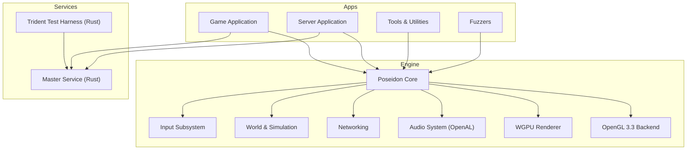
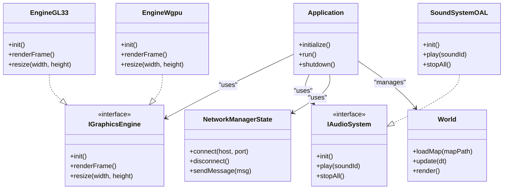
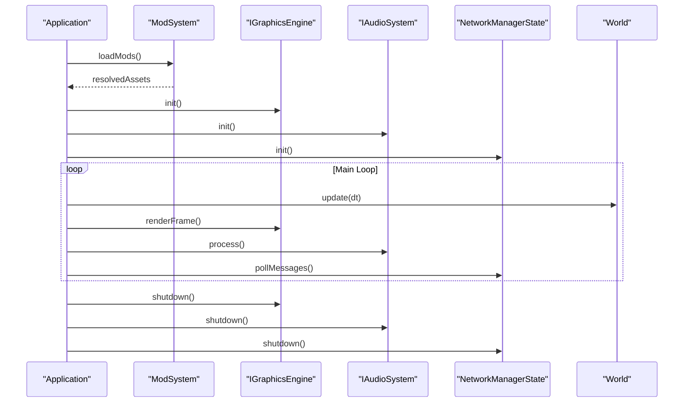
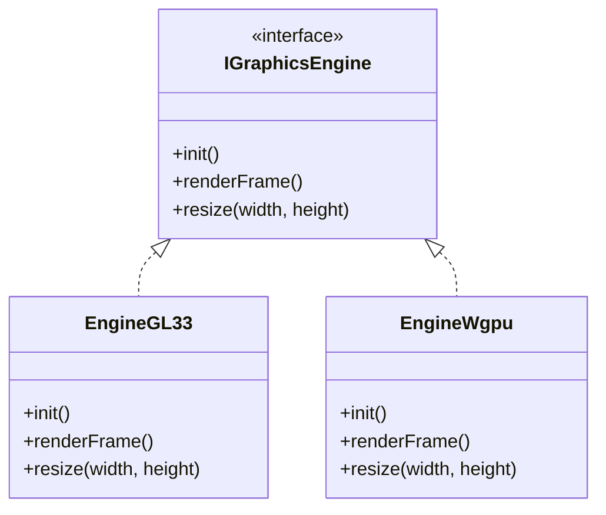
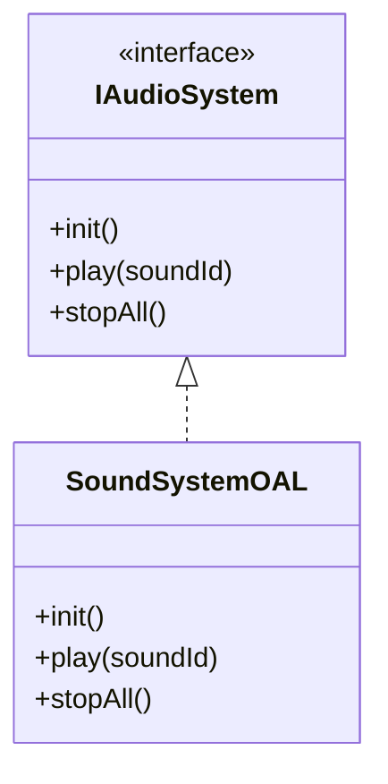
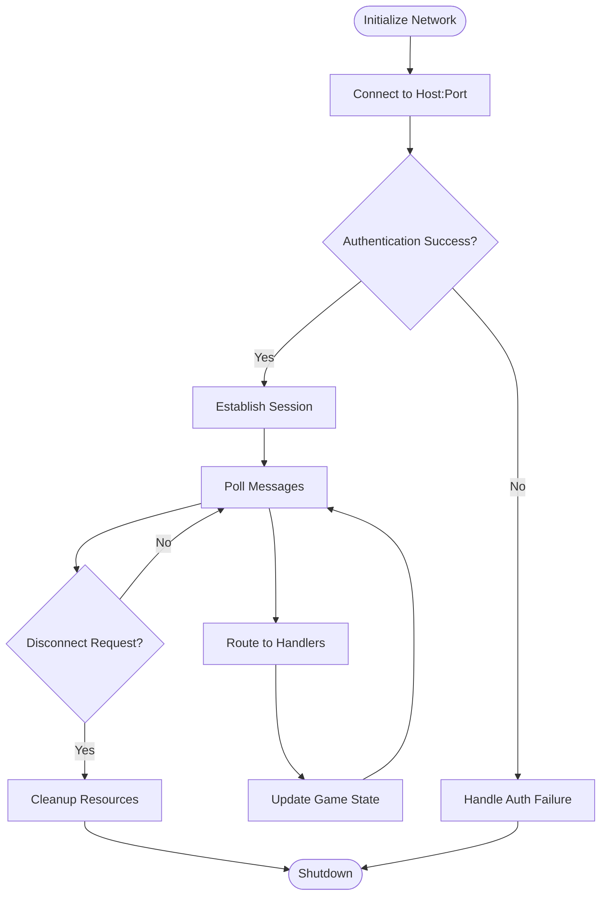
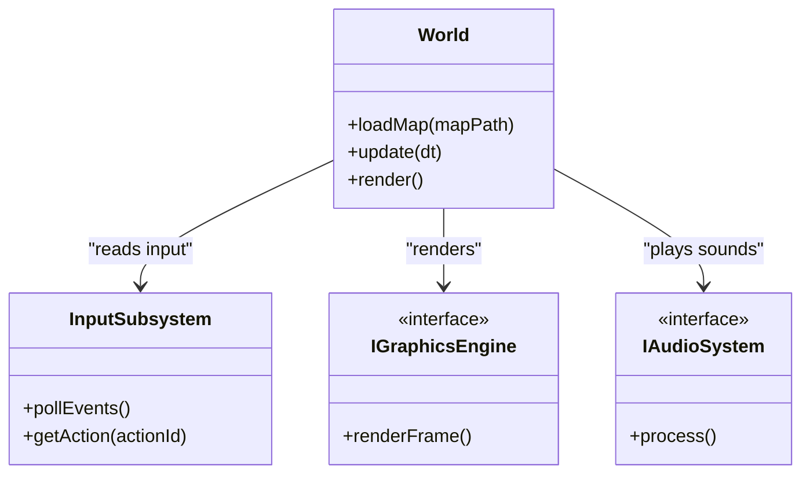
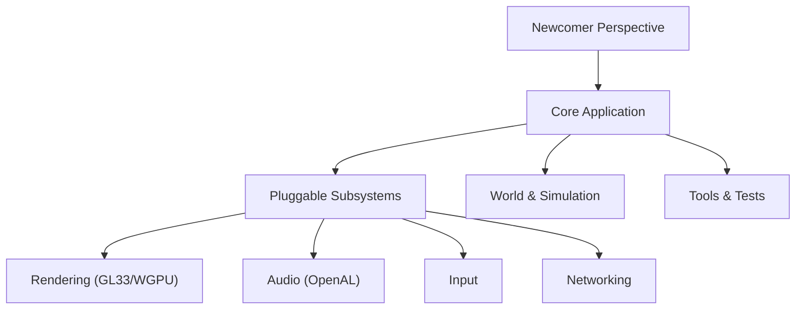
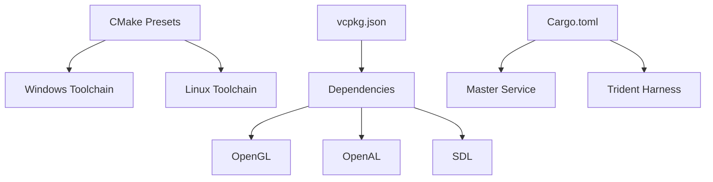

# Project Overview

<cite>
**Referenced Files in This Document**
- [CMakeLists.txt](file://CMakeLists.txt)
- [CMakePresets.json](file://CMakePresets.json)
- [vcpkg.json](file://vcpkg.json)
- [README.md](file://README.md)
- [apps/cwr/Game/GameApplication.hpp](file://apps/cwr/Game/GameApplication.hpp)
- [apps/cwr/Server/ServerApplication.hpp](file://apps/cwr/Server/ServerApplication.hpp)
- [engine/Poseidon/CMakeLists.txt](file://engine/Poseidon/CMakeLists.txt)
- [engine/Poseidon/Graphics/IGraphicsEngine.hpp](file://engine/Poseidon/Graphics/IGraphicsEngine.hpp)
- [engine/PoseidonGL33/EngineGL33.hpp](file://engine/PoseidonGL33/EngineGL33.hpp)
- [engine/WgpuRenderer/EngineWgpu.hpp](file://engine/WgpuRenderer/EngineWgpu.hpp)
- [engine/Poseidon/Audio/IAudioSystem.hpp](file://engine/Poseidon/Audio/IAudioSystem.hpp)
- [engine/PoseidonOpenAL/SoundSystemOAL.hpp](file://engine/PoseidonOpenAL/SoundSystemOAL.hpp)
- [engine/Poseidon/Network/NetworkManagerState.hpp](file://engine/Poseidon/Network/NetworkManagerState.hpp)
- [engine/Poseidon/Network/NetworkImpl.hpp](file://engine/Poseidon/Network/NetworkImpl.hpp)
- [engine/Poseidon/Core/Application.hpp](file://engine/Poseidon/Core/Application.hpp)
- [engine/Poseidon/Core/ModSystem.hpp](file://engine/Poseidon/Core/ModSystem.hpp)
- [engine/Poseidon/Input/InputSubsystem.hpp](file://engine/Poseidon/Input/InputSubsystem.hpp)
- [engine/Poseidon/World/World.hpp](file://engine/Poseidon/World/World.hpp)
- [engine/Trident/src/main.rs](file://engine/Trident/src/main.rs)
- [mserver/CLI/src/main.rs](file://mserver/CLI/src/main.rs)
- [mserver/MasterService/src/main.rs](file://mserver/MasterService/src/main.rs)
</cite>

## Table of Contents
1. Introduction
2. Project Structure
3. Core Components
4. Architecture Overview
5. Detailed Component Analysis
6. Dependency Analysis
7. Performance Considerations
8. Troubleshooting Guide
9. Conclusion

## Introduction
CWR-CE is a modernized, open-source recreation of the classic Command & Conquer engine, rebuilt from the ground up to deliver a faithful yet enhanced real-time strategy experience. The project focuses on cross-platform support, modular architecture, and extensibility while preserving the feel and gameplay of the original titles. It introduces a new rendering pipeline with multiple backends, an OpenAL-based audio system, robust networking for multiplayer, and a comprehensive toolchain for content creation and testing.

Key goals:
- Faithful gameplay with modern improvements (graphics, performance, platform support)
- Modular engine design enabling pluggable subsystems (rendering, audio, input)
- Cross-platform builds for Windows and Linux using CMake and vcpkg
- Extensible ecosystem via mods, tools, and scripting

## Project Structure
The repository is organized into clear layers:
- apps: Executable applications including the main game, server, demos, and tools
- engine: Core engine libraries and subsystems (Poseidon core, graphics backends, audio, networking, world simulation)
- mserver: Rust-based master service and CLI utilities
- tests: Unit, integration, smoke, stress, and e2e test suites
- cmake: Build presets, toolchains, and helper modules
- thirdparty: Third-party headers and assets used by the build

**Diagram sources**
- [apps/cwr/Game/GameApplication.hpp](file://apps/cwr/Game/GameApplication.hpp)
- [apps/cwr/Server/ServerApplication.hpp](file://apps/cwr/Server/ServerApplication.hpp)
- [engine/Poseidon/Core/Application.hpp](file://engine/Poseidon/Core/Application.hpp)
- [engine/Poseidon/Graphics/IGraphicsEngine.hpp](file://engine/Poseidon/Graphics/IGraphicsEngine.hpp)
- [engine/Poseidon/Audio/IAudioSystem.hpp](file://engine/Poseidon/Audio/IAudioSystem.hpp)
- [engine/Poseidon/Network/NetworkManagerState.hpp](file://engine/Poseidon/Network/NetworkManagerState.hpp)
- [mserver/MasterService/src/main.rs](file://mserver/MasterService/src/main.rs)
- [engine/Trident/src/main.rs](file://engine/Trident/src/main.rs)

**Section sources**
- [CMakeLists.txt](file://CMakeLists.txt)
- [CMakePresets.json](file://CMakePresets.json)
- [vcpkg.json](file://vcpkg.json)
- [README.md](file://README.md)

## Core Components
- Poseidon Core: Central application lifecycle, configuration, mod system, and shared infrastructure.
- Graphics Backends: Pluggable renderers implementing IGraphicsEngine, currently OpenGL 3.3 and WGPU.
- Audio System: Abstraction over IAudioSystem with OpenAL implementation for playback and capture.
- Networking: Client/server abstractions, session management, authentication, and message routing.
- World & Simulation: Entity systems, terrain, scene management, and game logic.
- Input Subsystem: Keyboard, mouse, and controller handling with action mapping.
- Tools & Fuzzers: Development utilities, Blender addon, Studio, and fuzz targets for robustness.
- Services: Rust-based master service and Trident harness for testing and discovery.

**Section sources**
- [engine/Poseidon/Core/Application.hpp](file://engine/Poseidon/Core/Application.hpp)
- [engine/Poseidon/Core/ModSystem.hpp](file://engine/Poseidon/Core/ModSystem.hpp)
- [engine/Poseidon/Graphics/IGraphicsEngine.hpp](file://engine/Poseidon/Graphics/IGraphicsEngine.hpp)
- [engine/Poseidon/Audio/IAudioSystem.hpp](file://engine/Poseidon/Audio/IAudioSystem.hpp)
- [engine/Poseidon/Network/NetworkManagerState.hpp](file://engine/Poseidon/Network/NetworkManagerState.hpp)
- [engine/Poseidon/Input/InputSubsystem.hpp](file://engine/Poseidon/Input/InputSubsystem.hpp)
- [engine/Poseidon/World/World.hpp](file://engine/Poseidon/World/World.hpp)

## Architecture Overview
The engine follows a layered, modular architecture:
- Applications (Game, Server) initialize Poseidon, configure subsystems, and run the main loop.
- Graphics abstraction allows swapping between OpenGL 3.3 and WGPU without changing higher-level code.
- Audio abstraction enables different backends; OpenAL provides production-quality sound.
- Networking components encapsulate client-server communication, session state, and message dispatch.
- World and simulation are decoupled from rendering and audio, allowing headless or alternate UI modes.

**Diagram sources**
- [engine/Poseidon/Core/Application.hpp](file://engine/Poseidon/Core/Application.hpp)
- [engine/Poseidon/Graphics/IGraphicsEngine.hpp](file://engine/Poseidon/Graphics/IGraphicsEngine.hpp)
- [engine/PoseidonGL33/EngineGL33.hpp](file://engine/PoseidonGL33/EngineGL33.hpp)
- [engine/WgpuRenderer/EngineWgpu.hpp](file://engine/WgpuRenderer/EngineWgpu.hpp)
- [engine/Poseidon/Audio/IAudioSystem.hpp](file://engine/Poseidon/Audio/IAudioSystem.hpp)
- [engine/PoseidonOpenAL/SoundSystemOAL.hpp](file://engine/PoseidonOpenAL/SoundSystemOAL.hpp)
- [engine/Poseidon/Network/NetworkManagerState.hpp](file://engine/Poseidon/Network/NetworkManagerState.hpp)
- [engine/Poseidon/World/World.hpp](file://engine/Poseidon/World/World.hpp)

## Detailed Component Analysis

### Poseidon Core and Application Lifecycle
Poseidon’s Application orchestrates initialization, configuration loading, mod resolution, and the main loop. It composes subsystems like graphics, audio, input, and networking, and exposes extension points for custom behavior.

**Diagram sources**
- [engine/Poseidon/Core/Application.hpp](file://engine/Poseidon/Core/Application.hpp)
- [engine/Poseidon/Core/ModSystem.hpp](file://engine/Poseidon/Core/ModSystem.hpp)
- [engine/Poseidon/Graphics/IGraphicsEngine.hpp](file://engine/Poseidon/Graphics/IGraphicsEngine.hpp)
- [engine/Poseidon/Audio/IAudioSystem.hpp](file://engine/Poseidon/Audio/IAudioSystem.hpp)
- [engine/Poseidon/Network/NetworkManagerState.hpp](file://engine/Poseidon/Network/NetworkManagerState.hpp)
- [engine/Poseidon/World/World.hpp](file://engine/Poseidon/World/World.hpp)

**Section sources**
- [engine/Poseidon/Core/Application.hpp](file://engine/Poseidon/Core/Application.hpp)
- [engine/Poseidon/Core/ModSystem.hpp](file://engine/Poseidon/Core/ModSystem.hpp)

### Graphics Backends: OpenGL 3.3 and WGPU
The IGraphicsEngine interface abstracts rendering details, allowing selection at runtime or build time. EngineGL33 implements OpenGL 3.3 features, while EngineWgpu leverages WGPU for modern GPU pipelines. Both implement init, renderFrame, and resize to maintain consistent behavior across backends.

**Diagram sources**
- [engine/Poseidon/Graphics/IGraphicsEngine.hpp](file://engine/Poseidon/Graphics/IGraphicsEngine.hpp)
- [engine/PoseidonGL33/EngineGL33.hpp](file://engine/PoseidonGL33/EngineGL33.hpp)
- [engine/WgpuRenderer/EngineWgpu.hpp](file://engine/WgpuRenderer/EngineWgpu.hpp)

**Section sources**
- [engine/Poseidon/Graphics/IGraphicsEngine.hpp](file://engine/Poseidon/Graphics/IGraphicsEngine.hpp)
- [engine/PoseidonGL33/EngineGL33.hpp](file://engine/PoseidonGL33/EngineGL33.hpp)
- [engine/WgpuRenderer/EngineWgpu.hpp](file://engine/WgpuRenderer/EngineWgpu.hpp)

### Audio System with OpenAL Integration
IAudioSystem defines the contract for audio playback and control. SoundSystemOAL implements this using OpenAL, providing low-latency audio, effects, and voice capture capabilities.

**Diagram sources**
- [engine/Poseidon/Audio/IAudioSystem.hpp](file://engine/Poseidon/Audio/IAudioSystem.hpp)
- [engine/PoseidonOpenAL/SoundSystemOAL.hpp](file://engine/PoseidonOpenAL/SoundSystemOAL.hpp)

**Section sources**
- [engine/Poseidon/Audio/IAudioSystem.hpp](file://engine/Poseidon/Audio/IAudioSystem.hpp)
- [engine/PoseidonOpenAL/SoundSystemOAL.hpp](file://engine/PoseidonOpenAL/SoundSystemOAL.hpp)

### Networking Capabilities
Networking components manage client-server sessions, authentication, message routing, and integrity checks. NetworkManagerState tracks connection states and actions, while NetworkImpl provides concrete implementations for transport and protocol details.

**Diagram sources**
- [engine/Poseidon/Network/NetworkManagerState.hpp](file://engine/Poseidon/Network/NetworkManagerState.hpp)
- [engine/Poseidon/Network/NetworkImpl.hpp](file://engine/Poseidon/Network/NetworkImpl.hpp)

**Section sources**
- [engine/Poseidon/Network/NetworkManagerState.hpp](file://engine/Poseidon/Network/NetworkManagerState.hpp)
- [engine/Poseidon/Network/NetworkImpl.hpp](file://engine/Poseidon/Network/NetworkImpl.hpp)

### World and Simulation
World encapsulates map loading, entity updates, and rendering calls. It integrates with input, audio, and networking to provide a cohesive game experience.

**Diagram sources**
- [engine/Poseidon/World/World.hpp](file://engine/Poseidon/World/World.hpp)
- [engine/Poseidon/Input/InputSubsystem.hpp](file://engine/Poseidon/Input/InputSubsystem.hpp)
- [engine/Poseidon/Graphics/IGraphicsEngine.hpp](file://engine/Poseidon/Graphics/IGraphicsEngine.hpp)
- [engine/Poseidon/Audio/IAudioSystem.hpp](file://engine/Poseidon/Audio/IAudioSystem.hpp)

**Section sources**
- [engine/Poseidon/World/World.hpp](file://engine/Poseidon/World/World.hpp)
- [engine/Poseidon/Input/InputSubsystem.hpp](file://engine/Poseidon/Input/InputSubsystem.hpp)

### Tools, Fuzzers, and Testing Frameworks
- Tools: Blender addon, Studio, TcLister, TcPbo, and command-line utilities assist with asset processing and inspection.
- Fuzzers: Targeted fuzzing for file formats (PBO, PAA, SQF, WAV, etc.) improves robustness.
- Tests: Unit, integration, smoke, stress, and e2e suites validate functionality across platforms.

**Section sources**
- [apps/tools/BlenderAddon/README.md](file://apps/tools/BlenderAddon/README.md)
- [apps/tools/Studio/CMakeLists.txt](file://apps/tools/Studio/CMakeLists.txt)
- [apps/fuzzers/Fuzzer/CMakeLists.txt](file://apps/fuzzers/Fuzzer/CMakeLists.txt)
- [tests/unit/README.md](file://tests/unit/README.md)
- [tests/integration/README.md](file://tests/integration/README.md)

### Conceptual Overview
For newcomers to RTS development, CWR-CE demonstrates how to structure a game engine with clear separation of concerns:
- Core application manages lifecycle and composition
- Subsystems (graphics, audio, input, networking) are pluggable interfaces
- World and simulation encapsulate game logic
- Tools and tests ensure quality and productivity

[No sources needed since this diagram shows conceptual workflow, not actual code structure]

## Dependency Analysis
The build system uses CMake with presets for Windows and Linux, and vcpkg for dependency management. Key dependencies include OpenGL, OpenAL, SDL, and Rust crates for services and harnesses.

**Diagram sources**
- [CMakePresets.json](file://CMakePresets.json)
- [vcpkg.json](file://vcpkg.json)
- [Cargo.toml](file://Cargo.toml)

**Section sources**
- [CMakePresets.json](file://CMakePresets.json)
- [vcpkg.json](file://vcpkg.json)
- [Cargo.toml](file://Cargo.toml)

## Performance Considerations
- Use WGPU for modern GPU acceleration where available; fallback to OpenGL 3.3 for compatibility.
- Enable batching and instancing in rendering paths to reduce draw calls.
- Stream audio buffers to minimize latency and memory usage.
- Optimize network message serialization and use delta compression for large state updates.
- Profile CPU-bound tasks with task pools and multithreading where safe.

[No sources needed since this section provides general guidance]

## Troubleshooting Guide
Common issues and resolutions:
- Graphics backend initialization failures: Verify driver support for OpenGL 3.3 or WGPU; check error logs from EngineGL33 or EngineWgpu.
- Audio device not found: Ensure OpenAL is installed and configured; validate device enumeration in SoundSystemOAL.
- Networking connection errors: Inspect NetworkManagerState transitions and NetworkImpl diagnostics; verify firewall and port forwarding.
- Mod loading problems: Check ModSystem logs for missing or invalid archives; validate checksums and version compatibility.

**Section sources**
- [engine/PoseidonGL33/EngineGL33.hpp](file://engine/PoseidonGL33/EngineGL33.hpp)
- [engine/WgpuRenderer/EngineWgpu.hpp](file://engine/WgpuRenderer/EngineWgpu.hpp)
- [engine/PoseidonOpenAL/SoundSystemOAL.hpp](file://engine/PoseidonOpenAL/SoundSystemOAL.hpp)
- [engine/Poseidon/Network/NetworkManagerState.hpp](file://engine/Poseidon/Network/NetworkManagerState.hpp)
- [engine/Poseidon/Core/ModSystem.hpp](file://engine/Poseidon/Core/ModSystem.hpp)

## Conclusion
CWR-CE delivers a modern, extensible foundation for classic RTS gameplay with robust cross-platform support. Its modular architecture enables easy customization and experimentation, while comprehensive tooling and testing ensure reliability. Developers can leverage the Poseidon core, choose appropriate graphics and audio backends, and integrate networking seamlessly. The project invites contributions through its open-source model and active ecosystem of tools and services.

[No sources needed since this section summarizes without analyzing specific files]