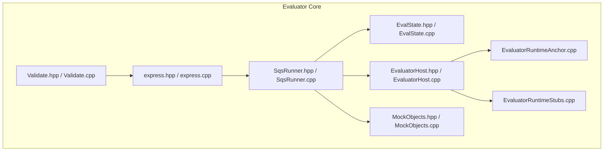
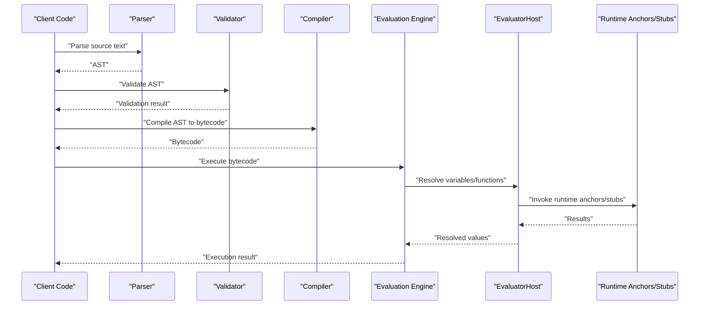
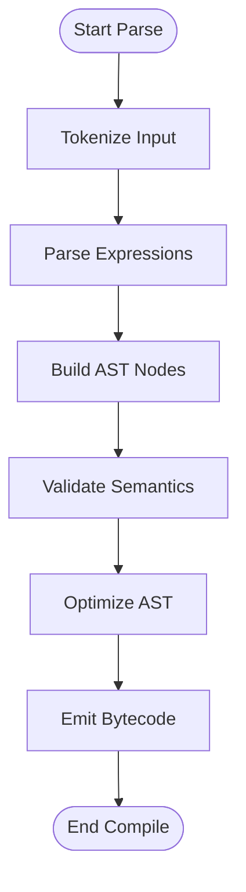
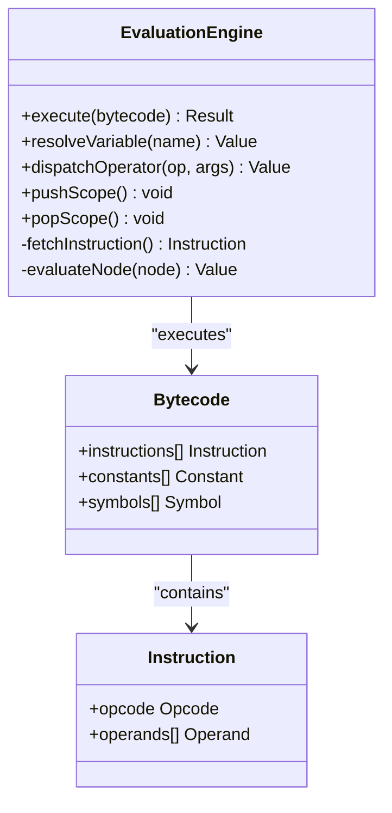
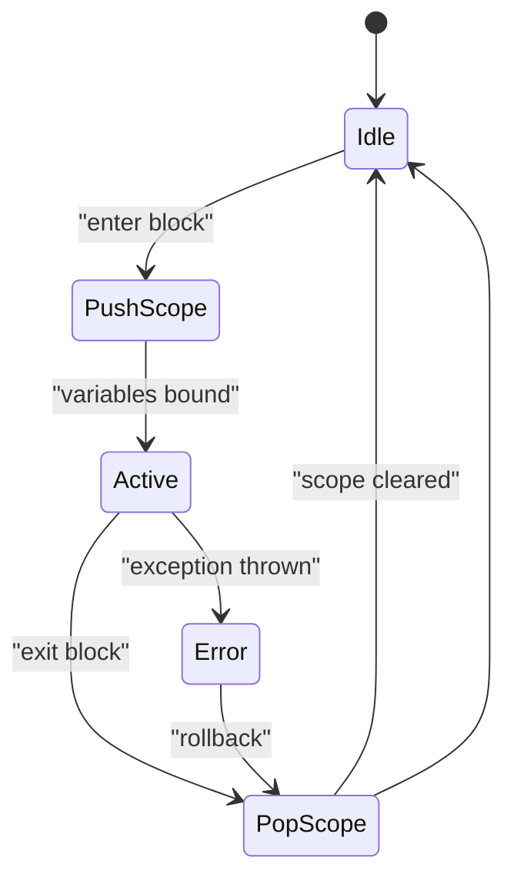
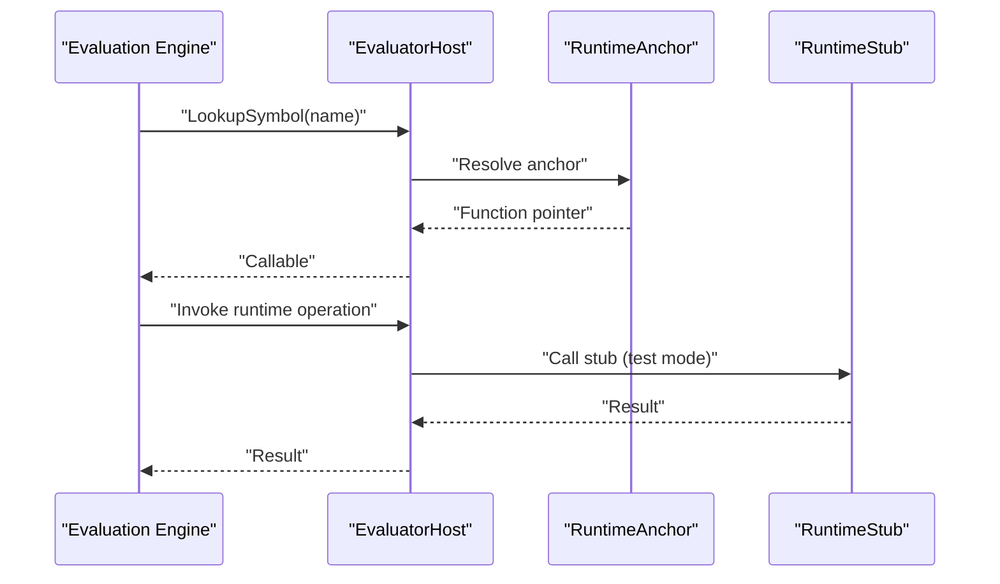
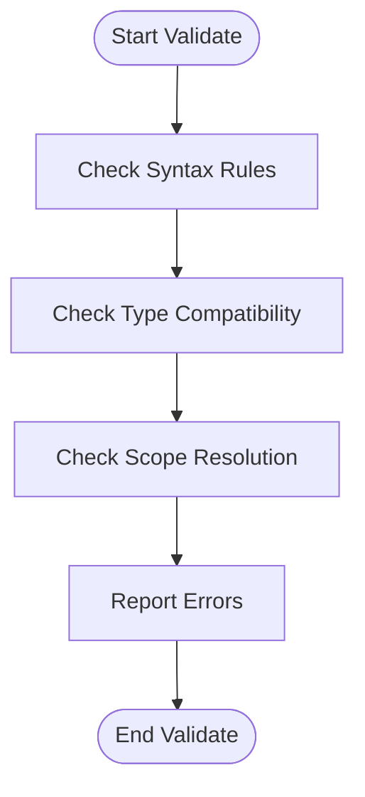
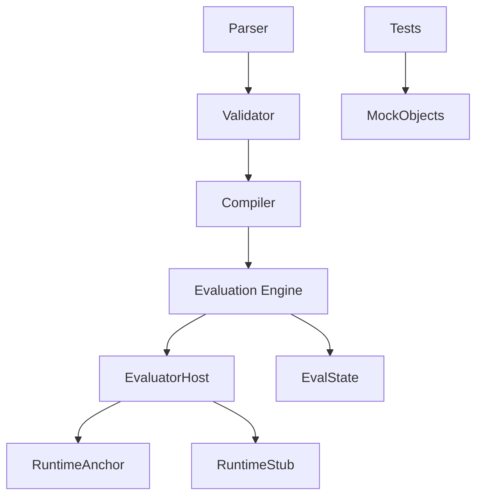

# Evaluator Core

<cite>
**Referenced Files in This Document**
- [EvalState.cpp](file://engine/Evaluator/EvalState.cpp)
- [EvalState.hpp](file://engine/Evaluator/EvalState.hpp)
- [EvaluatorHost.cpp](file://engine/Evaluator/EvaluatorHost.cpp)
- [EvaluatorHost.hpp](file://engine/Evaluator/EvaluatorHost.hpp)
- [EvaluatorRuntimeAnchor.cpp](file://engine/Evaluator/EvaluatorRuntimeAnchor.cpp)
- [EvaluatorRuntimeStubs.cpp](file://engine/Evaluator/EvaluatorRuntimeStubs.cpp)
- [MockObjects.cpp](file://engine/Evaluator/MockObjects.cpp)
- [MockObjects.hpp](file://engine/Evaluator/MockObjects.hpp)
- [SqsRunner.cpp](file://engine/Evaluator/SqsRunner.cpp)
- [SqsRunner.hpp](file://engine/Evaluator/SqsRunner.hpp)
- [Validate.cpp](file://engine/Evaluator/Validate.cpp)
- [Validate.hpp](file://engine/Evaluator/Validate.hpp)
- [express.cpp](file://engine/Evaluator/express.cpp)
- [express.hpp](file://engine/Evaluator/express.hpp)
</cite>

## Table of Contents
1. [Introduction](#introduction)
2. [Project Structure](#project-structure)
3. [Core Components](#core-components)
4. [Architecture Overview](#architecture-overview)
5. [Detailed Component Analysis](#detailed-component-analysis)
6. [Dependency Analysis](#dependency-analysis)
7. [Performance Considerations](#performance-considerations)
8. [Troubleshooting Guide](#troubleshooting-guide)
9. [Conclusion](#conclusion)
10. [Appendices](#appendices)

## Introduction
This document provides comprehensive documentation for the SQF expression evaluator core. It explains the parsing and compilation pipeline, including syntax analysis, AST generation, and bytecode compilation. It also documents the evaluation engine that executes compiled expressions, variable resolution, operator handling, state management (execution context, scopes, memory allocation), optimization strategies, error handling, and debugging support. Practical examples for custom expression implementations and performance tuning techniques are included to help developers extend and optimize the evaluator.

## Project Structure
The evaluator core resides under the engine/Evaluator directory and is composed of several cohesive modules:
- Parsing and validation utilities
- Expression representation and compilation
- Execution runtime and host integration
- State and scope management
- Testing and stubs for isolation

**Diagram sources**
- [express.hpp](file://engine/Evaluator/express.hpp)
- [express.cpp](file://engine/Evaluator/express.cpp)
- [Validate.hpp](file://engine/Evaluator/Validate.hpp)
- [Validate.cpp](file://engine/Evaluator/Validate.cpp)
- [SqsRunner.hpp](file://engine/Evaluator/SqsRunner.hpp)
- [SqsRunner.cpp](file://engine/Evaluator/SqsRunner.cpp)
- [EvalState.hpp](file://engine/Evaluator/EvalState.hpp)
- [EvalState.cpp](file://engine/Evaluator/EvalState.cpp)
- [EvaluatorHost.hpp](file://engine/Evaluator/EvaluatorHost.hpp)
- [EvaluatorHost.cpp](file://engine/Evaluator/EvaluatorHost.cpp)
- [EvaluatorRuntimeAnchor.cpp](file://engine/Evaluator/EvaluatorRuntimeAnchor.cpp)
- [EvaluatorRuntimeStubs.cpp](file://engine/Evaluator/EvaluatorRuntimeStubs.cpp)
- [MockObjects.hpp](file://engine/Evaluator/MockObjects.hpp)
- [MockObjects.cpp](file://engine/Evaluator/MockObjects.cpp)

**Section sources**
- [express.hpp](file://engine/Evaluator/express.hpp)
- [express.cpp](file://engine/Evaluator/express.cpp)
- [Validate.hpp](file://engine/Evaluator/Validate.hpp)
- [Validate.cpp](file://engine/Evaluator/Validate.cpp)
- [SqsRunner.hpp](file://engine/Evaluator/SqsRunner.hpp)
- [SqsRunner.cpp](file://engine/Evaluator/SqsRunner.cpp)
- [EvalState.hpp](file://engine/Evaluator/EvalState.hpp)
- [EvalState.cpp](file://engine/Evaluator/EvalState.cpp)
- [EvaluatorHost.hpp](file://engine/Evaluator/EvaluatorHost.hpp)
- [EvaluatorHost.cpp](file://engine/Evaluator/EvaluatorHost.cpp)
- [EvaluatorRuntimeAnchor.cpp](file://engine/Evaluator/EvaluatorRuntimeAnchor.cpp)
- [EvaluatorRuntimeStubs.cpp](file://engine/Evaluator/EvaluatorRuntimeStubs.cpp)
- [MockObjects.hpp](file://engine/Evaluator/MockObjects.hpp)
- [MockObjects.cpp](file://engine/Evaluator/MockObjects.cpp)

## Core Components
- Expression parser and compiler: Builds an abstract syntax tree from source text and compiles it into a compact bytecode suitable for fast execution.
- Evaluation engine: Executes bytecode with efficient variable lookup, operator dispatch, and control flow.
- State and scope manager: Maintains execution contexts, variable scopes, and memory allocation policies.
- Host integration: Bridges evaluator execution with the broader engine, providing runtime anchors and stubs.
- Validation and diagnostics: Validates expressions and produces actionable errors and warnings.
- Test scaffolding: Provides mock objects and helpers for isolated testing.

Key responsibilities:
- Syntax analysis and tokenization
- AST construction and transformation
- Bytecode emission and optimization passes
- Variable scoping and resolution
- Operator implementation and dispatch
- Error reporting and recovery
- Debugging hooks and profiling points

**Section sources**
- [express.hpp](file://engine/Evaluator/express.hpp)
- [express.cpp](file://engine/Evaluator/express.cpp)
- [Validate.hpp](file://engine/Evaluator/Validate.hpp)
- [Validate.cpp](file://engine/Evaluator/Validate.cpp)
- [SqsRunner.hpp](file://engine/Evaluator/SqsRunner.hpp)
- [SqsRunner.cpp](file://engine/Evaluator/SqsRunner.cpp)
- [EvalState.hpp](file://engine/Evaluator/EvalState.hpp)
- [EvalState.cpp](file://engine/Evaluator/EvalState.cpp)
- [EvaluatorHost.hpp](file://engine/Evaluator/EvaluatorHost.hpp)
- [EvaluatorHost.cpp](file://engine/Evaluator/EvaluatorHost.cpp)
- [EvaluatorRuntimeAnchor.cpp](file://engine/Evaluator/EvaluatorRuntimeAnchor.cpp)
- [EvaluatorRuntimeStubs.cpp](file://engine/Evaluator/EvaluatorRuntimeStubs.cpp)
- [MockObjects.hpp](file://engine/Evaluator/MockObjects.hpp)
- [MockObjects.cpp](file://engine/Evaluator/MockObjects.cpp)

## Architecture Overview
The evaluator follows a classic pipeline: parse -> validate -> compile -> execute. The host layer integrates the evaluator with the engine’s runtime environment.

**Diagram sources**
- [express.hpp](file://engine/Evaluator/express.hpp)
- [express.cpp](file://engine/Evaluator/express.cpp)
- [Validate.hpp](file://engine/Evaluator/Validate.hpp)
- [Validate.cpp](file://engine/Evaluator/Validate.cpp)
- [SqsRunner.hpp](file://engine/Evaluator/SqsRunner.hpp)
- [SqsRunner.cpp](file://engine/Evaluator/SqsRunner.cpp)
- [EvaluatorHost.hpp](file://engine/Evaluator/EvaluatorHost.hpp)
- [EvaluatorHost.cpp](file://engine/Evaluator/EvaluatorHost.cpp)
- [EvaluatorRuntimeAnchor.cpp](file://engine/Evaluator/EvaluatorRuntimeAnchor.cpp)
- [EvaluatorRuntimeStubs.cpp](file://engine/Evaluator/EvaluatorRuntimeStubs.cpp)

## Detailed Component Analysis

### Expression Parser and Compiler
Responsibilities:
- Tokenize input text into lexical units
- Build an AST representing expressions and statements
- Perform semantic checks and transformations
- Emit optimized bytecode for the evaluation engine

Key aspects:
- Grammar coverage for operators, literals, function calls, and control structures
- AST node types for expressions, statements, and blocks
- Compilation passes for constant folding, dead code elimination, and instruction selection
- Bytecode format designed for fast dispatch and minimal overhead

**Diagram sources**
- [express.hpp](file://engine/Evaluator/express.hpp)
- [express.cpp](file://engine/Evaluator/express.cpp)
- [Validate.hpp](file://engine/Evaluator/Validate.hpp)
- [Validate.cpp](file://engine/Evaluator/Validate.cpp)

**Section sources**
- [express.hpp](file://engine/Evaluator/express.hpp)
- [express.cpp](file://engine/Evaluator/express.cpp)
- [Validate.hpp](file://engine/Evaluator/Validate.hpp)
- [Validate.cpp](file://engine/Evaluator/Validate.cpp)

### Evaluation Engine
Responsibilities:
- Execute bytecode efficiently
- Resolve variables across scopes
- Dispatch operators and built-in functions
- Manage control flow and exceptions

Key aspects:
- Instruction fetch-decode-execute loop
- Stack-based or register-based execution model
- Fast path for common operations
- Integration with host for external symbols and side effects

**Diagram sources**
- [SqsRunner.hpp](file://engine/Evaluator/SqsRunner.hpp)
- [SqsRunner.cpp](file://engine/Evaluator/SqsRunner.cpp)

**Section sources**
- [SqsRunner.hpp](file://engine/Evaluator/SqsRunner.hpp)
- [SqsRunner.cpp](file://engine/Evaluator/SqsRunner.cpp)

### State and Scope Management
Responsibilities:
- Maintain execution contexts and call stacks
- Implement variable scoping rules (local, global, nested)
- Allocate and manage memory for temporary values
- Provide snapshotting and rollback capabilities

Key aspects:
- Scope stack with push/pop semantics
- Name-to-value mapping per scope
- Memory arena or pool for short-lived allocations
- Context switching for concurrent or nested evaluations

**Diagram sources**
- [EvalState.hpp](file://engine/Evaluator/EvalState.hpp)
- [EvalState.cpp](file://engine/Evaluator/EvalState.cpp)

**Section sources**
- [EvalState.hpp](file://engine/Evaluator/EvalState.hpp)
- [EvalState.cpp](file://engine/Evaluator/EvalState.cpp)

### Host Integration and Runtime Anchors
Responsibilities:
- Bridge evaluator execution with engine services
- Provide runtime anchors for system-level operations
- Expose stubs for testing and simulation

Key aspects:
- Host interface for symbol resolution and callbacks
- Anchor functions for I/O, math, time, and engine queries
- Stub implementations for deterministic tests

**Diagram sources**
- [EvaluatorHost.hpp](file://engine/Evaluator/EvaluatorHost.hpp)
- [EvaluatorHost.cpp](file://engine/Evaluator/EvaluatorHost.cpp)
- [EvaluatorRuntimeAnchor.cpp](file://engine/Evaluator/EvaluatorRuntimeAnchor.cpp)
- [EvaluatorRuntimeStubs.cpp](file://engine/Evaluator/EvaluatorRuntimeStubs.cpp)

**Section sources**
- [EvaluatorHost.hpp](file://engine/Evaluator/EvaluatorHost.hpp)
- [EvaluatorHost.cpp](file://engine/Evaluator/EvaluatorHost.cpp)
- [EvaluatorRuntimeAnchor.cpp](file://engine/Evaluator/EvaluatorRuntimeAnchor.cpp)
- [EvaluatorRuntimeStubs.cpp](file://engine/Evaluator/EvaluatorRuntimeStubs.cpp)

### Validation and Diagnostics
Responsibilities:
- Validate AST structure and semantics
- Produce detailed error messages and hints
- Support diagnostic flags and verbosity levels

Key aspects:
- Rule-based validation passes
- Error categorization (syntax, type, scope)
- Diagnostic output formatting

**Diagram sources**
- [Validate.hpp](file://engine/Evaluator/Validate.hpp)
- [Validate.cpp](file://engine/Evaluator/Validate.cpp)

**Section sources**
- [Validate.hpp](file://engine/Evaluator/Validate.hpp)
- [Validate.cpp](file://engine/Evaluator/Validate.cpp)

### Testing and Mock Objects
Responsibilities:
- Provide mock implementations for host functions
- Enable isolated unit tests for evaluator components
- Simulate engine behavior deterministically

Key aspects:
- Mock object factories
- Controlled return values and side effects
- Assertion helpers for evaluator outputs

**Section sources**
- [MockObjects.hpp](file://engine/Evaluator/MockObjects.hpp)
- [MockObjects.cpp](file://engine/Evaluator/MockObjects.cpp)

## Dependency Analysis
The evaluator components have clear dependencies:
- Parser and validator feed into the compiler
- Compiler emits bytecode consumed by the evaluation engine
- Evaluation engine depends on host integration for symbol resolution
- State management is used throughout execution
- Mock objects are used only in tests

**Diagram sources**
- [express.hpp](file://engine/Evaluator/express.hpp)
- [express.cpp](file://engine/Evaluator/express.cpp)
- [Validate.hpp](file://engine/Evaluator/Validate.hpp)
- [Validate.cpp](file://engine/Evaluator/Validate.cpp)
- [SqsRunner.hpp](file://engine/Evaluator/SqsRunner.hpp)
- [SqsRunner.cpp](file://engine/Evaluator/SqsRunner.cpp)
- [EvalState.hpp](file://engine/Evaluator/EvalState.hpp)
- [EvalState.cpp](file://engine/Evaluator/EvalState.cpp)
- [EvaluatorHost.hpp](file://engine/Evaluator/EvaluatorHost.hpp)
- [EvaluatorHost.cpp](file://engine/Evaluator/EvaluatorHost.cpp)
- [EvaluatorRuntimeAnchor.cpp](file://engine/Evaluator/EvaluatorRuntimeAnchor.cpp)
- [EvaluatorRuntimeStubs.cpp](file://engine/Evaluator/EvaluatorRuntimeStubs.cpp)
- [MockObjects.hpp](file://engine/Evaluator/MockObjects.hpp)
- [MockObjects.cpp](file://engine/Evaluator/MockObjects.cpp)

**Section sources**
- [express.hpp](file://engine/Evaluator/express.hpp)
- [express.cpp](file://engine/Evaluator/express.cpp)
- [Validate.hpp](file://engine/Evaluator/Validate.hpp)
- [Validate.cpp](file://engine/Evaluator/Validate.cpp)
- [SqsRunner.hpp](file://engine/Evaluator/SqsRunner.hpp)
- [SqsRunner.cpp](file://engine/Evaluator/SqsRunner.cpp)
- [EvalState.hpp](file://engine/Evaluator/EvalState.hpp)
- [EvalState.cpp](file://engine/Evaluator/EvalState.cpp)
- [EvaluatorHost.hpp](file://engine/Evaluator/EvaluatorHost.hpp)
- [EvaluatorHost.cpp](file://engine/Evaluator/EvaluatorHost.cpp)
- [EvaluatorRuntimeAnchor.cpp](file://engine/Evaluator/EvaluatorRuntimeAnchor.cpp)
- [EvaluatorRuntimeStubs.cpp](file://engine/Evaluator/EvaluatorRuntimeStubs.cpp)
- [MockObjects.hpp](file://engine/Evaluator/MockObjects.hpp)
- [MockObjects.cpp](file://engine/Evaluator/MockObjects.cpp)

## Performance Considerations
- Minimize allocations during evaluation by using arenas or pools for temporary values
- Prefer inlineable operators and avoid virtual calls in hot paths
- Cache frequently accessed symbols and constants
- Use branchless constructs where possible for predictable performance
- Profile bytecode execution to identify hotspots and optimize accordingly
- Batch operations to reduce host calls and context switches

[No sources needed since this section provides general guidance]

## Troubleshooting Guide
Common issues and resolutions:
- Syntax errors: Review tokenization and grammar coverage; enable verbose diagnostics
- Type mismatches: Ensure type coercion rules are consistent; check validator rules
- Scope resolution failures: Verify push/pop semantics and name binding order
- Performance regressions: Inspect bytecode size and frequency of host calls
- Debugging: Use mock objects to isolate failures and assert expected behavior

**Section sources**
- [Validate.hpp](file://engine/Evaluator/Validate.hpp)
- [Validate.cpp](file://engine/Evaluator/Validate.cpp)
- [EvalState.hpp](file://engine/Evaluator/EvalState.hpp)
- [EvalState.cpp](file://engine/Evaluator/EvalState.cpp)
- [MockObjects.hpp](file://engine/Evaluator/MockObjects.hpp)
- [MockObjects.cpp](file://engine/Evaluator/MockObjects.cpp)

## Conclusion
The SQF expression evaluator core implements a robust pipeline from parsing to execution, with strong separation between parsing, validation, compilation, and runtime. Its design emphasizes performance through efficient bytecode execution, careful memory management, and tight integration with the engine via host abstractions. Developers can extend functionality by adding new operators, functions, and optimizations while leveraging the existing infrastructure for state management and diagnostics.

[No sources needed since this section summarizes without analyzing specific files]

## Appendices

### Custom Expression Implementation Example
To add a new expression:
- Define AST node types for the expression
- Extend the parser to recognize syntax
- Implement compilation to emit appropriate bytecode
- Add operator dispatch logic in the evaluation engine
- Provide validation rules and error messages
- Include tests using mock objects

[No sources needed since this section provides general guidance]

### Performance Tuning Techniques
- Constant folding at compile time
- Dead code elimination and loop unrolling
- Inline expansion for small functions
- Prefetching and cache-friendly data layouts
- Profiling-guided optimization

[No sources needed since this section provides general guidance]