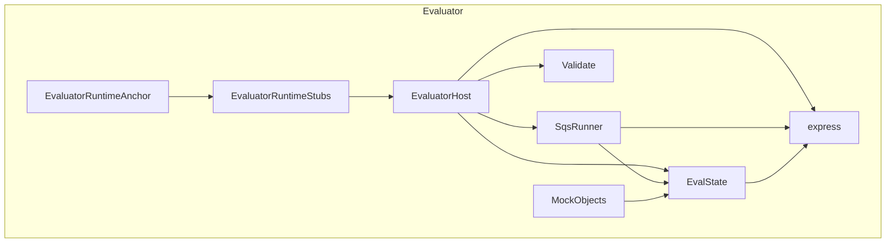
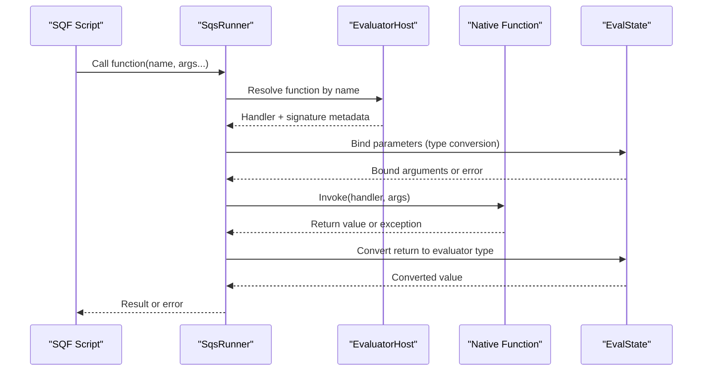
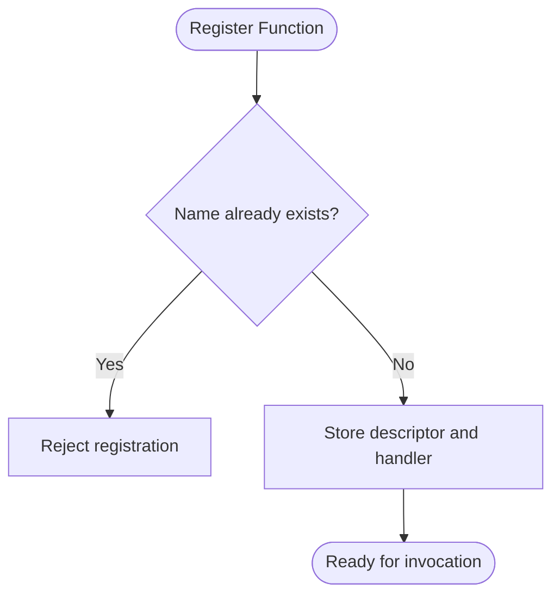
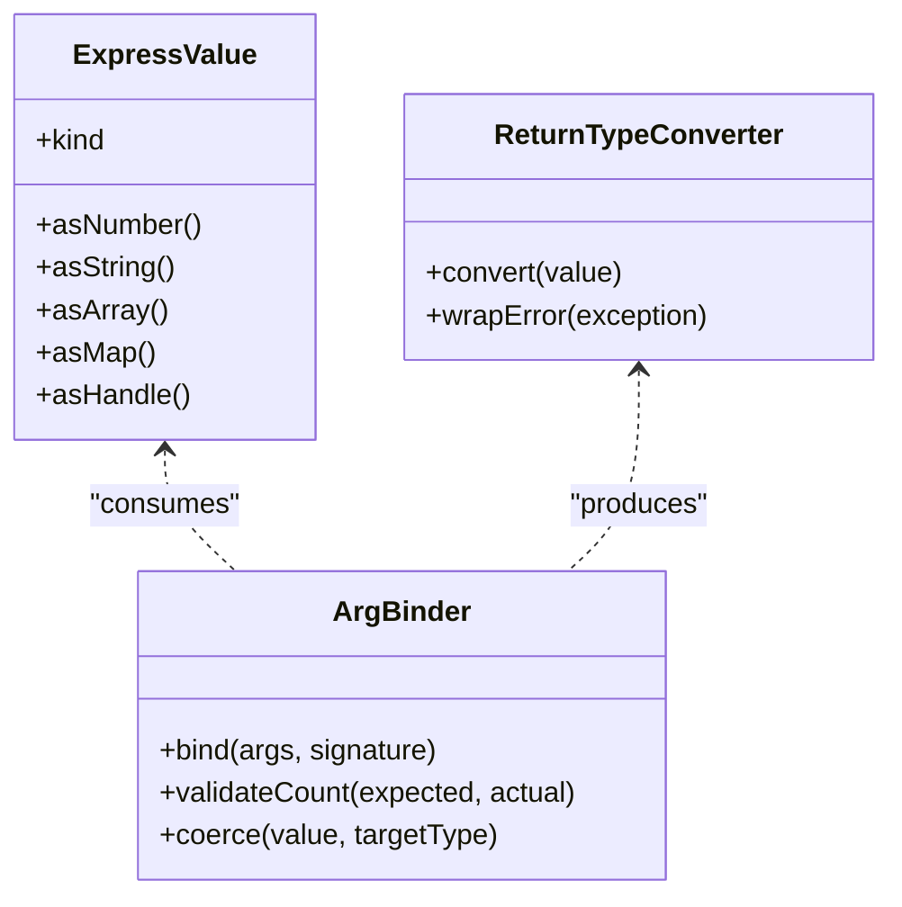
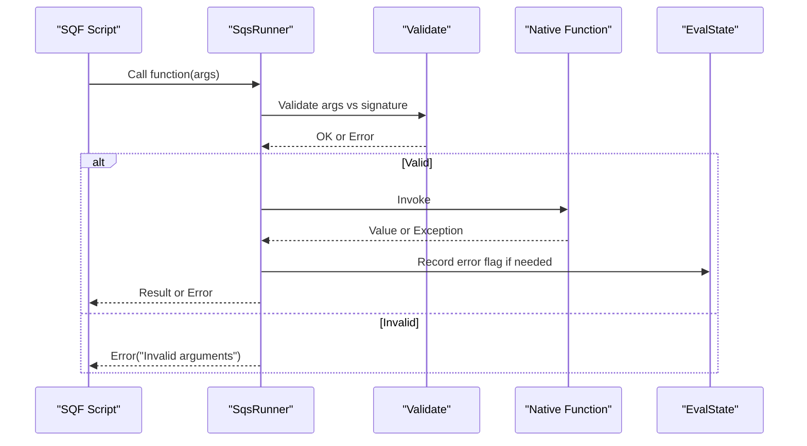
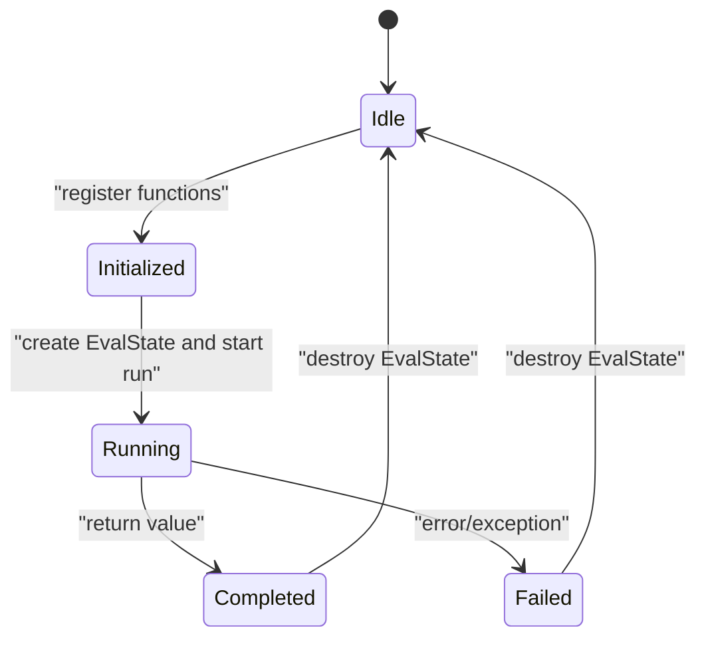
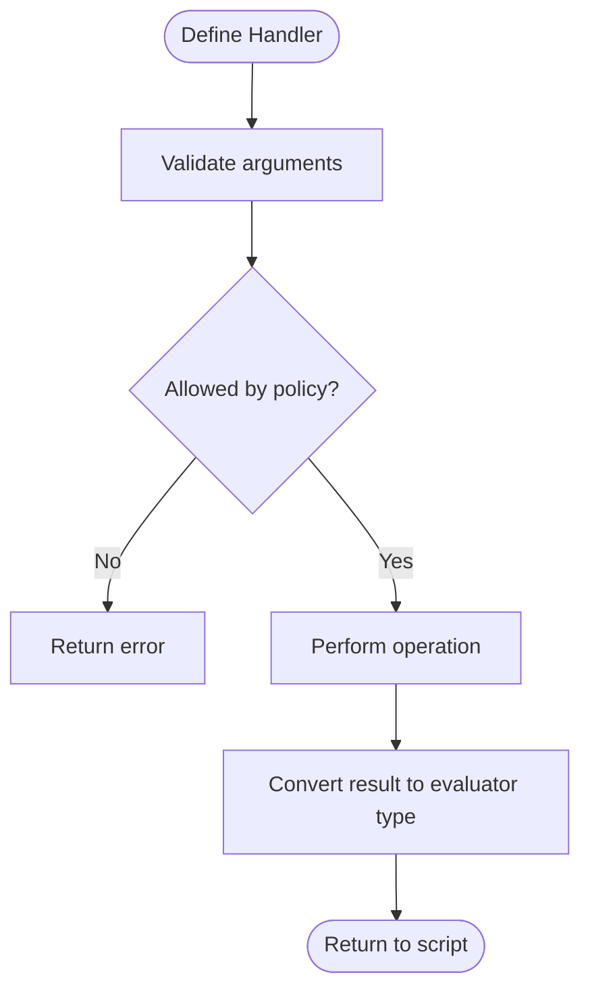
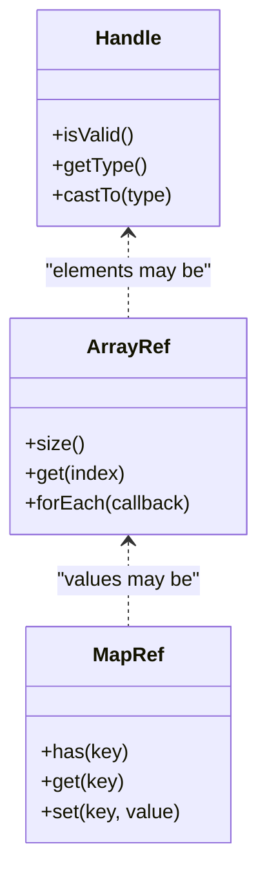
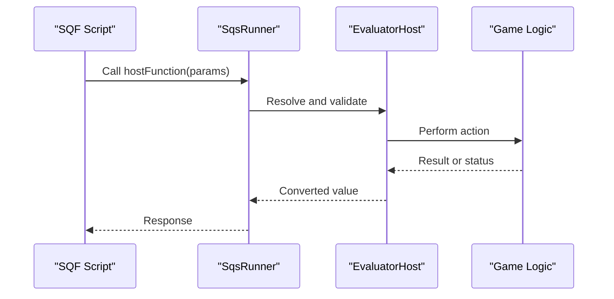
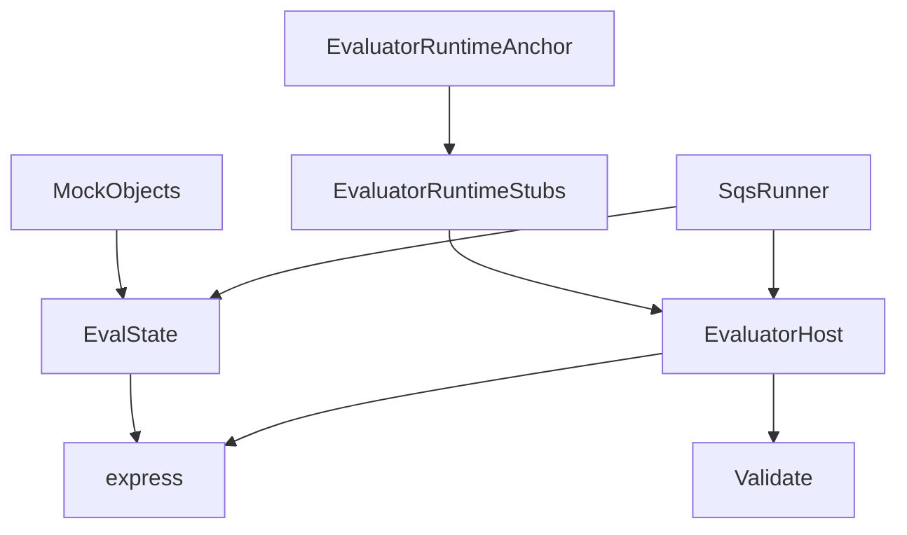

# Host API

<cite>
**Referenced Files in This Document**
- [EvaluatorHost.hpp](file://engine/Evaluator/EvaluatorHost.hpp)
- [EvaluatorHost.cpp](file://engine/Evaluator/EvaluatorHost.cpp)
- [EvalState.hpp](file://engine/Evaluator/EvalState.hpp)
- [EvalState.cpp](file://engine/Evaluator/EvalState.cpp)
- [SqsRunner.hpp](file://engine/Evaluator/SqsRunner.hpp)
- [SqsRunner.cpp](file://engine/Evaluator/SqsRunner.cpp)
- [express.hpp](file://engine/Evaluator/express.hpp)
- [express.cpp](file://engine/Evaluator/express.cpp)
- [Validate.hpp](file://engine/Evaluator/Validate.hpp)
- [Validate.cpp](file://engine/Evaluator/Validate.cpp)
- [MockObjects.hpp](file://engine/Evaluator/MockObjects.hpp)
- [MockObjects.cpp](file://engine/Evaluator/MockObjects.cpp)
- [EvaluatorRuntimeStubs.cpp](file://engine/Evaluator/EvaluatorRuntimeStubs.cpp)
- [EvaluatorRuntimeAnchor.cpp](file://engine/Evaluator/EvaluatorRuntimeAnchor.cpp)
</cite>

## Table of Contents
1. [Introduction](#introduction)
2. [Project Structure](#project-structure)
3. [Core Components](#core-components)
4. [Architecture Overview](#architecture-overview)
5. [Detailed Component Analysis](#detailed-component-analysis)
6. [Dependency Analysis](#dependency-analysis)
7. [Performance Considerations](#performance-considerations)
8. [Troubleshooting Guide](#troubleshooting-guide)
9. [Conclusion](#conclusion)
10. [Appendices](#appendices)

## Introduction
This document explains the host API that exposes game functionality to SQF scripts. It focuses on how native C++ functions are registered and bound, how parameters and return values are converted between C++ and script types, how errors propagate across the boundary, and how the execution environment is initialized and managed throughout its lifecycle. Practical guidance is provided for implementing custom host functions, handling complex data types, and designing a secure and performant API surface.

## Project Structure
The scripting subsystem lives primarily under engine/Evaluator. Key responsibilities:
- EvaluatorHost: central registry and bridge between host and evaluator runtime
- EvalState: per-script evaluation state and context
- SqsRunner: SQF script execution runner
- express: expression/value representation used by the evaluator
- Validate: validation utilities for arguments and results
- MockObjects and Runtime Stubs: test doubles and minimal runtime glue

**Diagram sources**
- [EvaluatorHost.hpp](file://engine/Evaluator/EvaluatorHost.hpp)
- [EvalState.hpp](file://engine/Evaluator/EvalState.hpp)
- [SqsRunner.hpp](file://engine/Evaluator/SqsRunner.hpp)
- [express.hpp](file://engine/Evaluator/express.hpp)
- [Validate.hpp](file://engine/Evaluator/Validate.hpp)
- [MockObjects.hpp](file://engine/Evaluator/MockObjects.hpp)
- [EvaluatorRuntimeStubs.cpp](file://engine/Evaluator/EvaluatorRuntimeStubs.cpp)
- [EvaluatorRuntimeAnchor.cpp](file://engine/Evaluator/EvaluatorRuntimeAnchor.cpp)

**Section sources**
- [EvaluatorHost.hpp](file://engine/Evaluator/EvaluatorHost.hpp)
- [EvaluatorHost.cpp](file://engine/Evaluator/EvaluatorHost.cpp)
- [EvalState.hpp](file://engine/Evaluator/EvalState.hpp)
- [EvalState.cpp](file://engine/Evaluator/EvalState.cpp)
- [SqsRunner.hpp](file://engine/Evaluator/SqsRunner.hpp)
- [SqsRunner.cpp](file://engine/Evaluator/SqsRunner.cpp)
- [express.hpp](file://engine/Evaluator/express.hpp)
- [express.cpp](file://engine/Evaluator/express.cpp)
- [Validate.hpp](file://engine/Evaluator/Validate.hpp)
- [Validate.cpp](file://engine/Evaluator/Validate.cpp)
- [MockObjects.hpp](file://engine/Evaluator/MockObjects.hpp)
- [MockObjects.cpp](file://engine/Evaluator/MockObjects.cpp)
- [EvaluatorRuntimeStubs.cpp](file://engine/Evaluator/EvaluatorRuntimeStubs.cpp)
- [EvaluatorRuntimeAnchor.cpp](file://engine/Evaluator/EvaluatorRuntimeAnchor.cpp)

## Core Components
- EvaluatorHost: Provides the registration API for host functions, manages the global function table, and coordinates parameter binding and result conversion. It also enforces security policies and provides accessors for the current evaluation context.
- EvalState: Holds per-evaluation context such as active objects, variables, error flags, and execution limits. It is created per script invocation or per thread pool where appropriate.
- SqsRunner: Orchestrates the lifecycle of a script run, including parsing (if applicable), dispatching calls into the host API, and collecting results or errors.
- express: Defines the value types and expressions used by the evaluator, enabling uniform handling of primitives, arrays, maps, and object handles.
- Validate: Supplies helpers to validate argument counts, types, and constraints before invoking host functions.
- MockObjects and Runtime Stubs: Provide safe defaults and test harnesses for development and verification without full game state.

**Section sources**
- [EvaluatorHost.hpp](file://engine/Evaluator/EvaluatorHost.hpp)
- [EvaluatorHost.cpp](file://engine/Evaluator/EvaluatorHost.cpp)
- [EvalState.hpp](file://engine/Evaluator/EvalState.hpp)
- [EvalState.cpp](file://engine/Evaluator/EvalState.cpp)
- [SqsRunner.hpp](file://engine/Evaluator/SqsRunner.hpp)
- [SqsRunner.cpp](file://engine/Evaluator/SqsRunner.cpp)
- [express.hpp](file://engine/Evaluator/express.hpp)
- [express.cpp](file://engine/Evaluator/express.cpp)
- [Validate.hpp](file://engine/Evaluator/Validate.hpp)
- [Validate.cpp](file://engine/Evaluator/Validate.cpp)
- [MockObjects.hpp](file://engine/Evaluator/MockObjects.hpp)
- [MockObjects.cpp](file://engine/Evaluator/MockObjects.cpp)
- [EvaluatorRuntimeStubs.cpp](file://engine/Evaluator/EvaluatorRuntimeStubs.cpp)
- [EvaluatorRuntimeAnchor.cpp](file://engine/Evaluator/EvaluatorRuntimeAnchor.cpp)

## Architecture Overview
The host API follows a clear separation between the evaluator runtime and the host’s game logic:
- Registration phase: The host registers functions with names, signatures, and handlers during initialization.
- Invocation phase: Scripts call functions; the runner resolves the name, binds parameters using type conversion rules, invokes the handler, and converts the return value back to the evaluator.
- Lifecycle phase: Per-evaluation contexts are created and destroyed around runs, ensuring isolation and deterministic cleanup.

**Diagram sources**
- [SqsRunner.hpp](file://engine/Evaluator/SqsRunner.hpp)
- [SqsRunner.cpp](file://engine/Evaluator/SqsRunner.cpp)
- [EvaluatorHost.hpp](file://engine/Evaluator/EvaluatorHost.hpp)
- [EvaluatorHost.cpp](file://engine/Evaluator/EvaluatorHost.cpp)
- [EvalState.hpp](file://engine/Evaluator/EvalState.hpp)
- [EvalState.cpp](file://engine/Evaluator/EvalState.cpp)

## Detailed Component Analysis

### Function Registration System
- Purpose: Allow host modules to expose functions to scripts with strong typing and safety checks.
- Key concepts:
  - Function descriptors include name, parameter types, optional default values, and a callable handler.
  - Registration occurs once at startup or when a module initializes.
  - Duplicate names are rejected or overwritten based on policy.
- Parameter binding:
  - Arguments from scripts are validated against expected types.
  - Type coercion is applied where safe (e.g., numeric promotions).
  - Missing or extra arguments produce descriptive errors.
- Return value handling:
  - Handlers return values convertible to evaluator types.
  - Errors thrown by handlers are captured and surfaced to scripts as exceptions or error codes.

**Diagram sources**
- [EvaluatorHost.hpp](file://engine/Evaluator/EvaluatorHost.hpp)
- [EvaluatorHost.cpp](file://engine/Evaluator/EvaluatorHost.cpp)

**Section sources**
- [EvaluatorHost.hpp](file://engine/Evaluator/EvaluatorHost.hpp)
- [EvaluatorHost.cpp](file://engine/Evaluator/EvaluatorHost.cpp)

### Parameter Binding and Type Conversion
- Supported types typically include scalars (numbers, booleans), strings, arrays, maps, and object handles.
- Conversion rules:
  - Numeric types coerce safely within ranges.
  - Strings are copied or referenced depending on mutability requirements.
  - Arrays/maps are passed by reference where possible to avoid copies.
  - Handles are validated against live objects or entities.
- Validation:
  - Argument count and order are enforced.
  - Optional parameters use defaults if omitted.
  - Invalid conversions raise immediate errors before calling the handler.

**Diagram sources**
- [express.hpp](file://engine/Evaluator/express.hpp)
- [express.cpp](file://engine/Evaluator/express.cpp)
- [Validate.hpp](file://engine/Evaluator/Validate.hpp)
- [Validate.cpp](file://engine/Evaluator/Validate.cpp)

**Section sources**
- [express.hpp](file://engine/Evaluator/express.hpp)
- [express.cpp](file://engine/Evaluator/express.cpp)
- [Validate.hpp](file://engine/Evaluator/Validate.hpp)
- [Validate.cpp](file://engine/Evaluator/Validate.cpp)

### Error Propagation and Security Restrictions
- Error propagation:
  - Exceptions thrown in native handlers are caught and translated into evaluator errors.
  - Validation failures return structured error messages indicating which argument failed and why.
- Security restrictions:
  - Only explicitly registered functions are callable from scripts.
  - Access to sensitive operations can be gated by runtime flags or caller context.
  - Resource limits (time, memory) are enforced via EvalState to prevent abuse.

**Diagram sources**
- [Validate.hpp](file://engine/Evaluator/Validate.hpp)
- [Validate.cpp](file://engine/Evaluator/Validate.cpp)
- [EvaluatorHost.hpp](file://engine/Evaluator/EvaluatorHost.hpp)
- [EvalState.hpp](file://engine/Evaluator/EvalState.hpp)

**Section sources**
- [Validate.hpp](file://engine/Evaluator/Validate.hpp)
- [Validate.cpp](file://engine/Evaluator/Validate.cpp)
- [EvaluatorHost.hpp](file://engine/Evaluator/EvaluatorHost.hpp)
- [EvalState.hpp](file://engine/Evaluator/EvalState.hpp)

### Script Execution Environment Setup and Lifecycle
- Initialization:
  - Create an EvalState instance for each execution context.
  - Register host functions once before any script runs.
  - Configure limits and feature flags in EvalState.
- Execution:
  - SqsRunner constructs a temporary scope, binds arguments, and invokes handlers.
  - Results are converted back to evaluator types and returned to scripts.
- Cleanup:
  - EvalState is destroyed after each run, releasing resources and resetting state.
  - Global registries remain intact until application shutdown.

**Diagram sources**
- [EvalState.hpp](file://engine/Evaluator/EvalState.hpp)
- [EvalState.cpp](file://engine/Evaluator/EvalState.cpp)
- [SqsRunner.hpp](file://engine/Evaluator/SqsRunner.hpp)
- [SqsRunner.cpp](file://engine/Evaluator/SqsRunner.cpp)

**Section sources**
- [EvalState.hpp](file://engine/Evaluator/EvalState.hpp)
- [EvalState.cpp](file://engine/Evaluator/EvalState.cpp)
- [SqsRunner.hpp](file://engine/Evaluator/SqsRunner.hpp)
- [SqsRunner.cpp](file://engine/Evaluator/SqsRunner.cpp)

### Implementing Custom Host Functions
- Steps:
  - Define a handler function that accepts typed parameters and returns a convertible value.
  - Use validation helpers to ensure argument correctness.
  - Register the function with a unique name and signature.
- Best practices:
  - Keep handlers fast and side-effect free where possible.
  - Avoid heavy allocations inside hot paths.
  - Return meaningful error states rather than throwing uncaught exceptions.
- Example patterns:
  - Querying game state: read-only accessors returning numbers, strings, or handles.
  - Mutating game state: write operations guarded by permissions and validated inputs.
  - Complex data: pass arrays/maps by reference to minimize copying.

**Diagram sources**
- [EvaluatorHost.hpp](file://engine/Evaluator/EvaluatorHost.hpp)
- [Validate.hpp](file://engine/Evaluator/Validate.hpp)
- [express.hpp](file://engine/Evaluator/express.hpp)

**Section sources**
- [EvaluatorHost.hpp](file://engine/Evaluator/EvaluatorHost.hpp)
- [Validate.hpp](file://engine/Evaluator/Validate.hpp)
- [express.hpp](file://engine/Evaluator/express.hpp)

### Handling Complex Data Types
- Arrays and Maps:
  - Prefer passing references to large structures.
  - Validate element types when necessary.
- Handles:
  - Ensure handles correspond to valid, live objects.
  - Handle invalidation gracefully.
- Strings:
  - Treat as immutable unless explicitly required.
  - Avoid unnecessary conversions between encodings.

**Diagram sources**
- [express.hpp](file://engine/Evaluator/express.hpp)
- [express.cpp](file://engine/Evaluator/express.cpp)

**Section sources**
- [express.hpp](file://engine/Evaluator/express.hpp)
- [express.cpp](file://engine/Evaluator/express.cpp)

### Managing Script-Game Interactions
- Isolation:
  - Each script run has its own EvalState to prevent cross-run interference.
- Permissions:
  - Gate sensitive operations behind explicit allowlists or runtime flags.
- Observability:
  - Log entry/exit of critical host functions for debugging.
  - Emit metrics for performance analysis.

**Diagram sources**
- [SqsRunner.hpp](file://engine/Evaluator/SqsRunner.hpp)
- [EvaluatorHost.hpp](file://engine/Evaluator/EvaluatorHost.hpp)

**Section sources**
- [SqsRunner.hpp](file://engine/Evaluator/SqsRunner.hpp)
- [EvaluatorHost.hpp](file://engine/Evaluator/EvaluatorHost.hpp)

## Dependency Analysis
The host API components have well-defined dependencies:
- SqsRunner depends on EvaluatorHost for function resolution and on EvalState for context.
- EvaluatorHost depends on express for value representation and Validate for argument checking.
- EvalState encapsulates runtime state and interacts minimally with other components.
- MockObjects and Runtime Stubs provide safe defaults for testing and minimal environments.

**Diagram sources**
- [SqsRunner.hpp](file://engine/Evaluator/SqsRunner.hpp)
- [EvaluatorHost.hpp](file://engine/Evaluator/EvaluatorHost.hpp)
- [EvalState.hpp](file://engine/Evaluator/EvalState.hpp)
- [express.hpp](file://engine/Evaluator/express.hpp)
- [Validate.hpp](file://engine/Evaluator/Validate.hpp)
- [EvaluatorRuntimeStubs.cpp](file://engine/Evaluator/EvaluatorRuntimeStubs.cpp)
- [EvaluatorRuntimeAnchor.cpp](file://engine/Evaluator/EvaluatorRuntimeAnchor.cpp)
- [MockObjects.hpp](file://engine/Evaluator/MockObjects.hpp)

**Section sources**
- [SqsRunner.hpp](file://engine/Evaluator/SqsRunner.hpp)
- [EvaluatorHost.hpp](file://engine/Evaluator/EvaluatorHost.hpp)
- [EvalState.hpp](file://engine/Evaluator/EvalState.hpp)
- [express.hpp](file://engine/Evaluator/express.hpp)
- [Validate.hpp](file://engine/Evaluator/Validate.hpp)
- [EvaluatorRuntimeStubs.cpp](file://engine/Evaluator/EvaluatorRuntimeStubs.cpp)
- [EvaluatorRuntimeAnchor.cpp](file://engine/Evaluator/EvaluatorRuntimeAnchor.cpp)
- [MockObjects.hpp](file://engine/Evaluator/MockObjects.hpp)

## Performance Considerations
- Minimize copies: Pass arrays and maps by reference; avoid repeated conversions.
- Batch operations: Group multiple small updates into fewer host calls.
- Cache lookups: Reuse resolved function handlers when possible.
- Limit allocations: Preallocate buffers for frequent operations.
- Measure and profile: Use logging and metrics to identify hotspots.

[No sources needed since this section provides general guidance]

## Troubleshooting Guide
Common issues and resolutions:
- Argument mismatch:
  - Verify parameter counts and types match the registered signature.
  - Use validation helpers to get precise error messages.
- Invalid handles:
  - Ensure objects exist and are not invalidated before use.
- Permission denied:
  - Confirm the function is allowed in the current context and flags.
- Timeouts or hangs:
  - Check EvalState limits and ensure handlers terminate promptly.

**Section sources**
- [Validate.hpp](file://engine/Evaluator/Validate.hpp)
- [Validate.cpp](file://engine/Evaluator/Validate.cpp)
- [EvalState.hpp](file://engine/Evaluator/EvalState.hpp)
- [EvaluatorHost.hpp](file://engine/Evaluator/EvaluatorHost.hpp)

## Conclusion
The host API provides a robust, secure, and efficient bridge between SQF scripts and native C++ game logic. By following the registration, validation, and conversion patterns outlined here, developers can implement reliable and high-performance functions that integrate seamlessly with the evaluator runtime. Adhering to best practices ensures maintainable code, predictable behavior, and optimal performance.

[No sources needed since this section summarizes without analyzing specific files]

## Appendices

### Practical Examples Summary
- Registering a simple query function:
  - Define a handler that reads state and returns a scalar or handle.
  - Register with a unique name and strict signature.
- Exposing a mutation function:
  - Validate inputs thoroughly.
  - Apply changes within the game state and return status.
- Handling complex payloads:
  - Accept arrays/maps by reference.
  - Iterate and validate elements before processing.

[No sources needed since this section provides general guidance]