# Script Execution

<cite>
**Referenced Files in This Document**
- [EvaluatorState.cpp](file://engine/Evaluator/EvalState.cpp)
- [EvaluatorState.hpp](file://engine/Evaluator/EvalState.hpp)
- [EvaluatorHost.cpp](file://engine/Evaluator/EvaluatorHost.cpp)
- [EvaluatorHost.hpp](file://engine/Evaluator/EvaluatorHost.hpp)
- [EvaluatorRuntimeStubs.cpp](file://engine/Evaluator/EvaluatorRuntimeStubs.cpp)
- [SqsRunner.cpp](file://engine/Evaluator/SqsRunner.cpp)
- [SqsRunner.hpp](file://engine/Evaluator/SqsRunner.hpp)
- [Validate.cpp](file://engine/Evaluator/Validate.cpp)
- [Validate.hpp](file://engine/Evaluator/Validate.hpp)
- [express.cpp](file://engine/Evaluator/express.cpp)
- [express.hpp](file://engine/Evaluator/express.hpp)
- [TaskPool.cpp](file://engine/Poseidon/Core/TaskPool.cpp)
- [TaskPool.hpp](file://engine/Poseidon/Core/TaskPool.hpp)
- [GameState.cpp](file://engine/Poseidon/Core/GameState.cpp)
- [EngineState.hpp](file://engine/Poseidon/Core/EngineState.hpp)
- [NetworkScriptValueCodec.cpp](file://engine/Poseidon/Network/NetworkScriptValueCodec.cpp)
- [NetworkScriptValueCodec.hpp](file://engine/Poseidon/Network/NetworkScriptValueCodec.hpp)
- [fuzz_sqf.cpp](file://apps/fuzzers/Fuzzer/fuzz_sqf.cpp)
- [fuzz_exec.cpp](file://apps/fuzzers/Fuzzer/fuzz_exec.cpp)
</cite>

## Table of Contents
1. [Introduction](#introduction)
2. [Project Structure](#project-structure)
3. [Core Components](#core-components)
4. [Architecture Overview](#architecture-overview)
5. [Detailed Component Analysis](#detailed-component-analysis)
6. [Dependency Analysis](#dependency-analysis)
7. [Performance Considerations](#performance-considerations)
8. [Troubleshooting Guide](#troubleshooting-guide)
9. [Conclusion](#conclusion)
10. [Appendices](#appendices)

## Introduction
This document explains the SQF script execution engine, covering how scripts are loaded, compiled, scheduled, and executed at runtime. It details execution context management, thread safety considerations, resource cleanup, and the relationship between scripts, missions, and game state. It also documents scheduling and priority handling, performance monitoring, lifecycle management, error recovery, debugging techniques, memory management, garbage collection, and optimization strategies for long-running scripts.

## Project Structure
The scripting subsystem is primarily implemented under the Evaluator module, with integration points into core engine systems such as task scheduling, game state, and network serialization. Fuzzing utilities provide additional insight into parsing and execution paths.

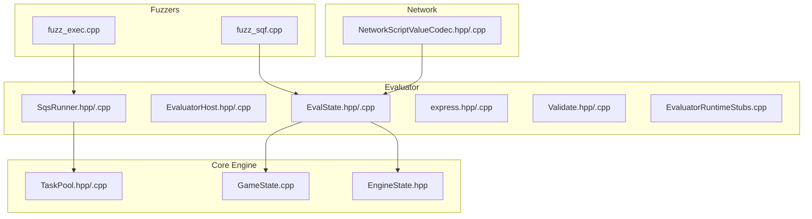

**Diagram sources**
- [EvaluatorState.hpp](file://engine/Evaluator/EvalState.hpp)
- [EvaluatorHost.hpp](file://engine/Evaluator/EvaluatorHost.hpp)
- [SqsRunner.hpp](file://engine/Evaluator/SqsRunner.hpp)
- [express.hpp](file://engine/Evaluator/express.hpp)
- [Validate.hpp](file://engine/Evaluator/Validate.hpp)
- [EvaluatorRuntimeStubs.cpp](file://engine/Evaluator/EvaluatorRuntimeStubs.cpp)
- [TaskPool.hpp](file://engine/Poseidon/Core/TaskPool.hpp)
- [GameState.cpp](file://engine/Poseidon/Core/GameState.cpp)
- [EngineState.hpp](file://engine/Poseidon/Core/EngineState.hpp)
- [NetworkScriptValueCodec.hpp](file://engine/Poseidon/Network/NetworkScriptValueCodec.hpp)
- [fuzz_sqf.cpp](file://apps/fuzzers/Fuzzer/fuzz_sqf.cpp)
- [fuzz_exec.cpp](file://apps/fuzzers/Fuzzer/fuzz_exec.cpp)

**Section sources**
- [EvaluatorState.hpp](file://engine/Evaluator/EvalState.hpp)
- [EvaluatorHost.hpp](file://engine/Evaluator/EvaluatorHost.hpp)
- [SqsRunner.hpp](file://engine/Evaluator/SqsRunner.hpp)
- [express.hpp](file://engine/Evaluator/express.hpp)
- [Validate.hpp](file://engine/Evaluator/Validate.hpp)
- [EvaluatorRuntimeStubs.cpp](file://engine/Evaluator/EvaluatorRuntimeStubs.cpp)
- [TaskPool.hpp](file://engine/Poseidon/Core/TaskPool.hpp)
- [GameState.cpp](file://engine/Poseidon/Core/GameState.cpp)
- [EngineState.hpp](file://engine/Poseidon/Core/EngineState.hpp)
- [NetworkScriptValueCodec.hpp](file://engine/Poseidon/Network/NetworkScriptValueCodec.hpp)
- [fuzz_sqf.cpp](file://apps/fuzzers/Fuzzer/fuzz_sqf.cpp)
- [fuzz_exec.cpp](file://apps/fuzzers/Fuzzer/fuzz_exec.cpp)

## Core Components
- EvalState: Represents the per-script execution context, including variables, call stack, and runtime state.
- EvaluatorHost: Hosts the evaluator, manages compilation units, and exposes entry points to run scripts.
- SqsRunner: Drives the SQF interpreter loop, dispatches commands, and handles control flow.
- express: Expression evaluation utilities used by the interpreter.
- Validate: Validation helpers for scripts and expressions.
- EvaluatorRuntimeStubs: Runtime stubs bridging evaluator calls to engine services.
- TaskPool: Scheduling infrastructure for running tasks (including script jobs) with priorities.
- GameState and EngineState: Global state surfaces exposed to scripts and used by the host.
- NetworkScriptValueCodec: Serialization/deserialization of script values for networking.

**Section sources**
- [EvaluatorState.hpp](file://engine/Evaluator/EvalState.hpp)
- [EvaluatorHost.hpp](file://engine/Evaluator/EvaluatorHost.hpp)
- [SqsRunner.hpp](file://engine/Evaluator/SqsRunner.hpp)
- [express.hpp](file://engine/Evaluator/express.hpp)
- [Validate.hpp](file://engine/Evaluator/Validate.hpp)
- [EvaluatorRuntimeStubs.cpp](file://engine/Evaluator/EvaluatorRuntimeStubs.cpp)
- [TaskPool.hpp](file://engine/Poseidon/Core/TaskPool.hpp)
- [GameState.cpp](file://engine/Poseidon/Core/GameState.cpp)
- [EngineState.hpp](file://engine/Poseidon/Core/EngineState.hpp)
- [NetworkScriptValueCodec.hpp](file://engine/Poseidon/Network/NetworkScriptValueCodec.hpp)

## Architecture Overview
The pipeline from file to runtime involves loading source text, parsing into an AST or bytecode, compiling into a runnable unit, and executing within an isolated context. The runner schedules work via the task pool, interacts with engine services through stubs, and serializes values when needed over the network.

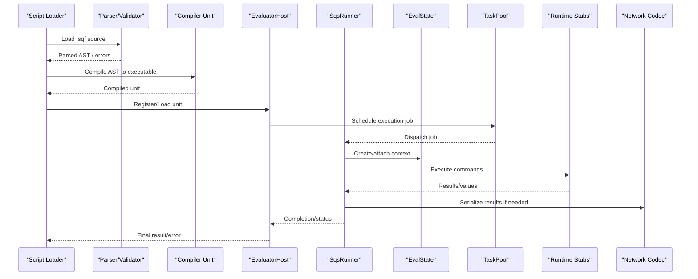

**Diagram sources**
- [EvaluatorHost.hpp](file://engine/Evaluator/EvaluatorHost.hpp)
- [EvaluatorHost.cpp](file://engine/Evaluator/EvaluatorHost.cpp)
- [SqsRunner.hpp](file://engine/Evaluator/SqsRunner.hpp)
- [SqsRunner.cpp](file://engine/Evaluator/SqsRunner.cpp)
- [EvaluatorState.hpp](file://engine/Evaluator/EvalState.hpp)
- [EvaluatorState.cpp](file://engine/Evaluator/EvalState.cpp)
- [EvaluatorRuntimeStubs.cpp](file://engine/Evaluator/EvaluatorRuntimeStubs.cpp)
- [TaskPool.hpp](file://engine/Poseidon/Core/TaskPool.hpp)
- [TaskPool.cpp](file://engine/Poseidon/Core/TaskPool.cpp)
- [NetworkScriptValueCodec.hpp](file://engine/Poseidon/Network/NetworkScriptValueCodec.hpp)
- [NetworkScriptValueCodec.cpp](file://engine/Poseidon/Network/NetworkScriptValueCodec.cpp)

## Detailed Component Analysis

### Execution Context (EvalState)
- Responsibilities:
  - Maintain per-script variable scope, call stack, and runtime flags.
  - Provide accessors for reading/writing variables and managing local/global namespaces.
  - Track execution status, error states, and termination signals.
- Thread Safety:
  - Context instances should be bound to a single executor thread; cross-thread access must be synchronized via the host or task scheduler.
- Lifecycle:
  - Created when a script starts, destroyed upon completion or error.
  - Supports checkpointing for debugging and resumption where applicable.

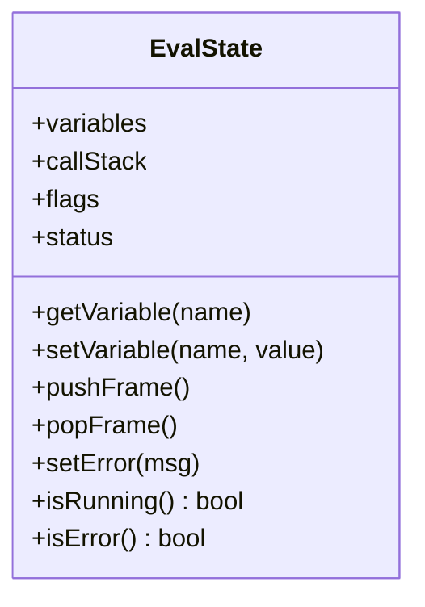

**Diagram sources**
- [EvaluatorState.hpp](file://engine/Evaluator/EvalState.hpp)
- [EvaluatorState.cpp](file://engine/Evaluator/EvalState.cpp)

**Section sources**
- [EvaluatorState.hpp](file://engine/Evaluator/EvalState.hpp)
- [EvaluatorState.cpp](file://engine/Evaluator/EvalState.cpp)

### Host and Compilation (EvaluatorHost)
- Responsibilities:
  - Manage compilation units and script modules.
  - Expose APIs to load, compile, and execute scripts.
  - Coordinate with the task pool to schedule runs and handle callbacks.
- Error Handling:
  - Aggregates parse and compile errors, providing diagnostics to callers.
- Integration:
  - Bridges to engine services via runtime stubs and exposes global state to scripts.

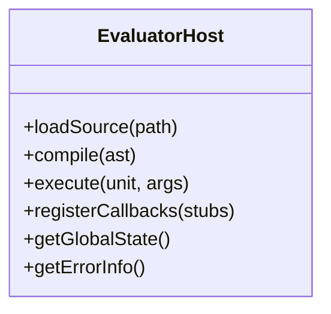

**Diagram sources**
- [EvaluatorHost.hpp](file://engine/Evaluator/EvaluatorHost.hpp)
- [EvaluatorHost.cpp](file://engine/Evaluator/EvaluatorHost.cpp)

**Section sources**
- [EvaluatorHost.hpp](file://engine/Evaluator/EvaluatorHost.hpp)
- [EvaluatorHost.cpp](file://engine/Evaluator/EvaluatorHost.cpp)

### Interpreter Loop (SqsRunner)
- Responsibilities:
  - Drive the SQF command dispatch loop.
  - Evaluate expressions and statements.
  - Manage control flow (loops, conditionals, function calls).
  - Handle interrupts and yield points for cooperative multitasking.
- Performance:
  - Minimizes allocations in hot paths; reuses buffers where possible.
  - Provides hooks for profiling individual commands.

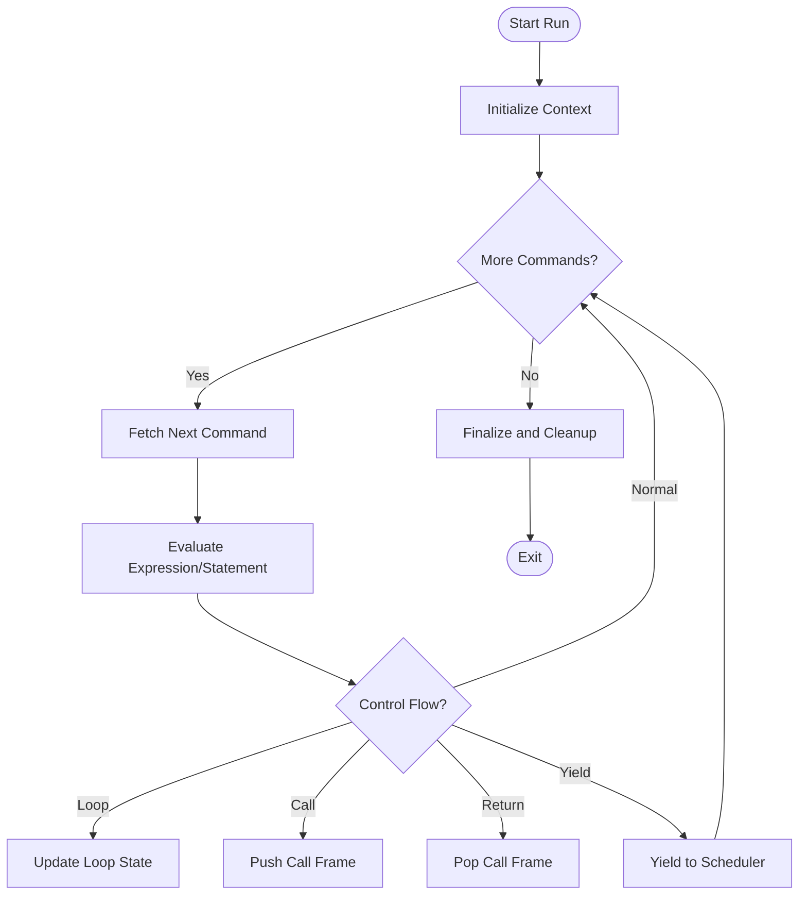

**Diagram sources**
- [SqsRunner.hpp](file://engine/Evaluator/SqsRunner.hpp)
- [SqsRunner.cpp](file://engine/Evaluator/SqsRunner.cpp)

**Section sources**
- [SqsRunner.hpp](file://engine/Evaluator/SqsRunner.hpp)
- [SqsRunner.cpp](file://engine/Evaluator/SqsRunner.cpp)

### Expression Evaluation (express)
- Responsibilities:
  - Parse and evaluate arithmetic, logical, and type-cast expressions.
  - Provide operators and built-in functions for the interpreter.
- Optimization:
  - Uses fast-path checks for common patterns.
  - Avoids unnecessary conversions.

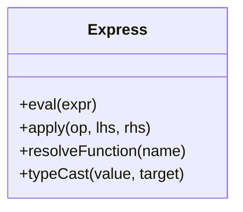

**Diagram sources**
- [express.hpp](file://engine/Evaluator/express.hpp)
- [express.cpp](file://engine/Evaluator/express.cpp)

**Section sources**
- [express.hpp](file://engine/Evaluator/express.hpp)
- [express.cpp](file://engine/Evaluator/express.cpp)

### Validation (Validate)
- Responsibilities:
  - Validate script structure and expressions before execution.
  - Detect unsupported constructs and report actionable errors.
- Usage:
  - Integrated into the compilation phase to fail fast on invalid code.

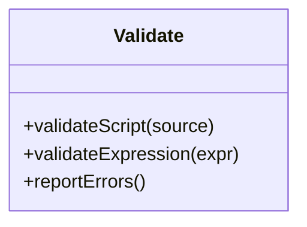

**Diagram sources**
- [Validate.hpp](file://engine/Evaluator/Validate.hpp)
- [Validate.cpp](file://engine/Evaluator/Validate.cpp)

**Section sources**
- [Validate.hpp](file://engine/Evaluator/Validate.hpp)
- [Validate.cpp](file://engine/Evaluator/Validate.cpp)

### Runtime Stubs (EvaluatorRuntimeStubs)
- Responsibilities:
  - Implement engine-facing operations invoked by SQF commands.
  - Bridge to graphics, audio, world, AI, and network subsystems.
- Thread Safety:
  - Must respect engine threading constraints; often requires marshalling to main thread.

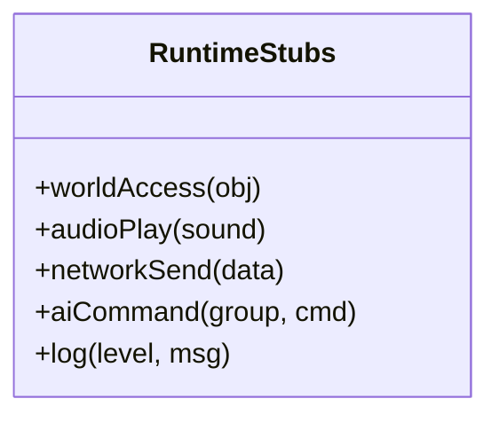

**Diagram sources**
- [EvaluatorRuntimeStubs.cpp](file://engine/Evaluator/EvaluatorRuntimeStubs.cpp)

**Section sources**
- [EvaluatorRuntimeStubs.cpp](file://engine/Evaluator/EvaluatorRuntimeStubs.cpp)

### Scheduling and Priority (TaskPool)
- Responsibilities:
  - Queue and execute tasks with configurable priorities.
  - Support periodic, one-shot, and long-running jobs.
- Integration:
  - Scripts can submit jobs that run on dedicated threads or the main loop depending on requirements.

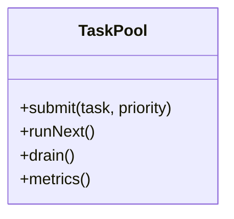

**Diagram sources**
- [TaskPool.hpp](file://engine/Poseidon/Core/TaskPool.hpp)
- [TaskPool.cpp](file://engine/Poseidon/Core/TaskPool.cpp)

**Section sources**
- [TaskPool.hpp](file://engine/Poseidon/Core/TaskPool.hpp)
- [TaskPool.cpp](file://engine/Poseidon/Core/TaskPool.cpp)

### Game State and Engine State
- GameState:
  - Holds mission-specific data accessible to scripts (entities, triggers, variables).
- EngineState:
  - Global engine configuration and runtime flags exposed to scripts.

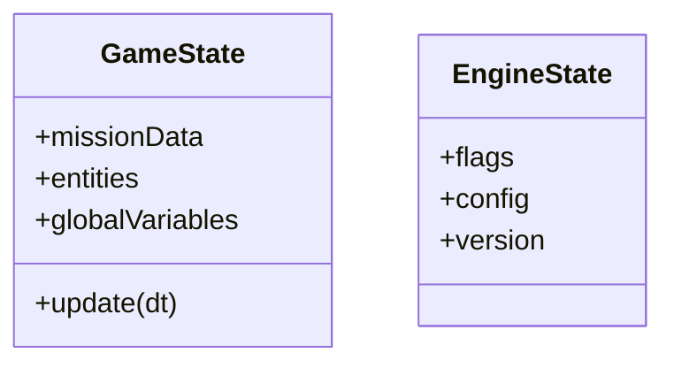

**Diagram sources**
- [GameState.cpp](file://engine/Poseidon/Core/GameState.cpp)
- [EngineState.hpp](file://engine/Poseidon/Core/EngineState.hpp)

**Section sources**
- [GameState.cpp](file://engine/Poseidon/Core/GameState.cpp)
- [EngineState.hpp](file://engine/Poseidon/Core/EngineState.hpp)

### Network Serialization (NetworkScriptValueCodec)
- Responsibilities:
  - Serialize and deserialize script values for multiplayer synchronization.
  - Ensure consistent representation across clients and server.

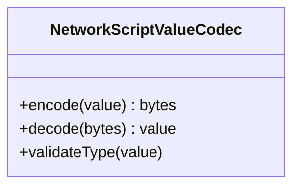

**Diagram sources**
- [NetworkScriptValueCodec.hpp](file://engine/Poseidon/Network/NetworkScriptValueCodec.hpp)
- [NetworkScriptValueCodec.cpp](file://engine/Poseidon/Network/NetworkScriptValueCodec.cpp)

**Section sources**
- [NetworkScriptValueCodec.hpp](file://engine/Poseidon/Network/NetworkScriptValueCodec.hpp)
- [NetworkScriptValueCodec.cpp](file://engine/Poseidon/Network/NetworkScriptValueCodec.cpp)

### Fuzzing Utilities
- fuzz_sqf:
  - Exercises parser and validator paths to uncover edge cases.
- fuzz_exec:
  - Drives execution paths to test robustness under malformed inputs.

**Section sources**
- [fuzz_sqf.cpp](file://apps/fuzzers/Fuzzer/fuzz_sqf.cpp)
- [fuzz_exec.cpp](file://apps/fuzzers/Fuzzer/fuzz_exec.cpp)

## Dependency Analysis
The following diagram shows key dependencies among components involved in script execution.

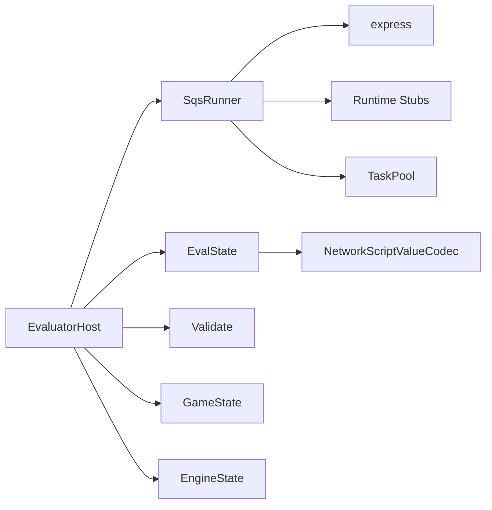

**Diagram sources**
- [EvaluatorHost.hpp](file://engine/Evaluator/EvaluatorHost.hpp)
- [SqsRunner.hpp](file://engine/Evaluator/SqsRunner.hpp)
- [EvaluatorState.hpp](file://engine/Evaluator/EvalState.hpp)
- [express.hpp](file://engine/Evaluator/express.hpp)
- [EvaluatorRuntimeStubs.cpp](file://engine/Evaluator/EvaluatorRuntimeStubs.cpp)
- [TaskPool.hpp](file://engine/Poseidon/Core/TaskPool.hpp)
- [NetworkScriptValueCodec.hpp](file://engine/Poseidon/Network/NetworkScriptValueCodec.hpp)
- [Validate.hpp](file://engine/Evaluator/Validate.hpp)
- [GameState.cpp](file://engine/Poseidon/Core/GameState.cpp)
- [EngineState.hpp](file://engine/Poseidon/Core/EngineState.hpp)

**Section sources**
- [EvaluatorHost.hpp](file://engine/Evaluator/EvaluatorHost.hpp)
- [SqsRunner.hpp](file://engine/Evaluator/SqsRunner.hpp)
- [EvaluatorState.hpp](file://engine/Evaluator/EvalState.hpp)
- [express.hpp](file://engine/Evaluator/express.hpp)
- [EvaluatorRuntimeStubs.cpp](file://engine/Evaluator/EvaluatorRuntimeStubs.cpp)
- [TaskPool.hpp](file://engine/Poseidon/Core/TaskPool.hpp)
- [NetworkScriptValueCodec.hpp](file://engine/Poseidon/Network/NetworkScriptValueCodec.hpp)
- [Validate.hpp](file://engine/Evaluator/Validate.hpp)
- [GameState.cpp](file://engine/Poseidon/Core/GameState.cpp)
- [EngineState.hpp](file://engine/Poseidon/Core/EngineState.hpp)

## Performance Considerations
- Minimize allocations in tight loops; prefer object reuse and preallocated buffers.
- Use efficient expression evaluation paths and avoid heavy type conversions.
- Batch network serialization to reduce overhead.
- Profile command execution to identify hotspots; consider splitting long-running scripts into smaller jobs.
- Leverage TaskPool priorities to ensure critical updates run promptly.
- Monitor memory usage and implement explicit cleanup for large temporary structures.

[No sources needed since this section provides general guidance]

## Troubleshooting Guide
- Common Errors:
  - Parse failures: Check syntax and supported constructs; use validation tools.
  - Runtime exceptions: Inspect EvalState error flags and logs from runtime stubs.
  - Deadlocks: Ensure cooperative yielding and avoid blocking calls on the main thread.
- Debugging Techniques:
  - Enable detailed logging in runtime stubs for command tracing.
  - Use fuzzers to reproduce edge cases and validate robustness.
  - Inspect EvalState call stack and variables during breakpoints.
- Recovery Strategies:
  - Catch errors at boundaries and reset context safely.
  - Implement retry logic for transient network or IO failures.
  - Gracefully terminate long-running jobs using yield points and cancellation flags.

**Section sources**
- [EvaluatorState.hpp](file://engine/Evaluator/EvalState.hpp)
- [EvaluatorRuntimeStubs.cpp](file://engine/Evaluator/EvaluatorRuntimeStubs.cpp)
- [fuzz_sqf.cpp](file://apps/fuzzers/Fuzzer/fuzz_sqf.cpp)
- [fuzz_exec.cpp](file://apps/fuzzers/Fuzzer/fuzz_exec.cpp)

## Conclusion
The SQF execution engine integrates parsing, compilation, interpretation, and scheduling into a cohesive system. EvalState encapsulates per-script context, while EvaluatorHost orchestrates lifecycle and resources. SqsRunner drives the interpreter loop, leveraging express for evaluation and runtime stubs for engine interaction. TaskPool provides flexible scheduling with priorities, and NetworkScriptValueCodec ensures consistent serialization. Proper error handling, profiling, and memory management are essential for robust, high-performance scripting in long-running scenarios.

[No sources needed since this section summarizes without analyzing specific files]

## Appendices

### Script Lifecycle Management Example
- Load source, validate, compile, register with host, schedule execution, monitor progress, handle completion or error, and clean up context.

**Section sources**
- [EvaluatorHost.hpp](file://engine/Evaluator/EvaluatorHost.hpp)
- [EvaluatorHost.cpp](file://engine/Evaluator/EvaluatorHost.cpp)
- [SqsRunner.hpp](file://engine/Evaluator/SqsRunner.hpp)
- [EvaluatorState.hpp](file://engine/Evaluator/EvalState.hpp)

### Memory Management and Garbage Collection
- Prefer deterministic destruction of temporary objects.
- Avoid cyclic references in script-side structures.
- Use pooling for frequently allocated types.
- Periodically flush caches and release unused resources.

**Section sources**
- [TaskPool.hpp](file://engine/Poseidon/Core/TaskPool.hpp)
- [EvaluatorState.hpp](file://engine/Evaluator/EvalState.hpp)

### Optimization Strategies for Long-Running Scripts
- Chunk work into smaller tasks to maintain responsiveness.
- Cache expensive computations and reuse results.
- Reduce network payload sizes and frequency.
- Profile and optimize hot paths; minimize branching in tight loops.

**Section sources**
- [TaskPool.hpp](file://engine/Poseidon/Core/TaskPool.hpp)
- [express.hpp](file://engine/Evaluator/express.hpp)
- [NetworkScriptValueCodec.hpp](file://engine/Poseidon/Network/NetworkScriptValueCodec.hpp)