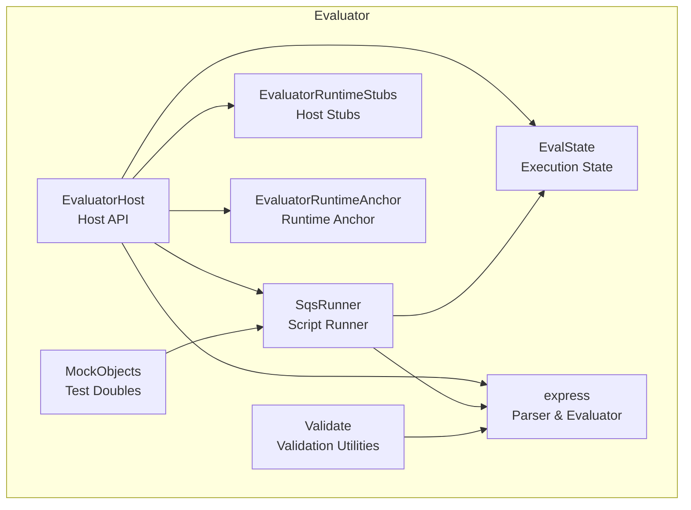
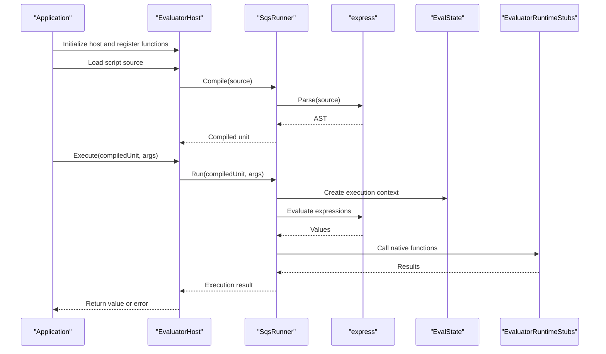
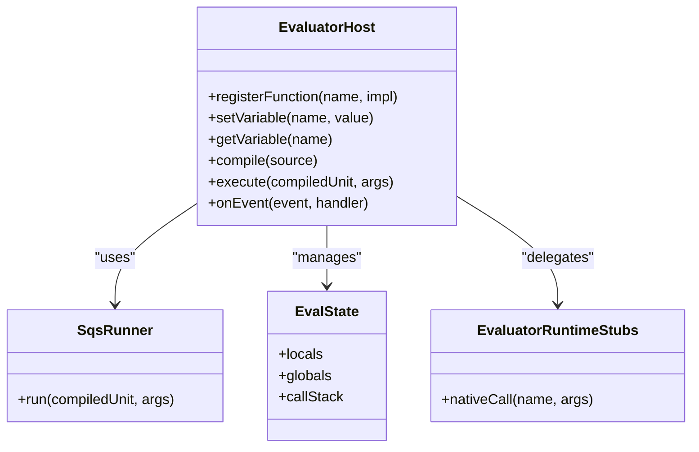
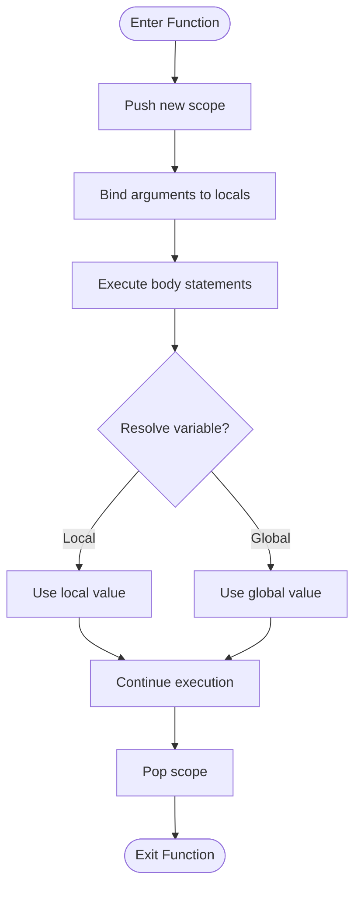
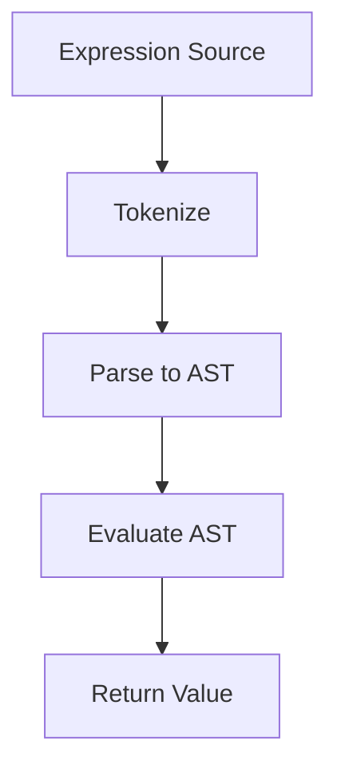
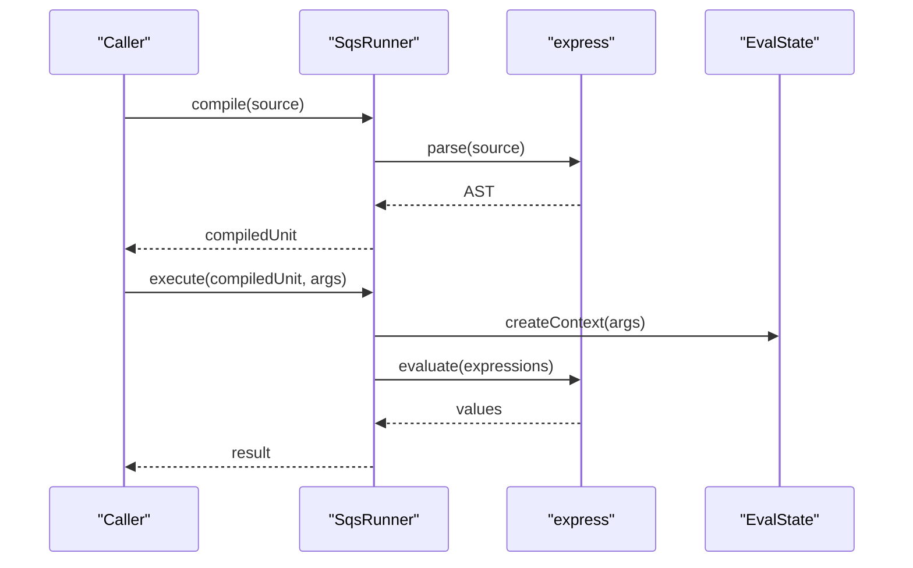
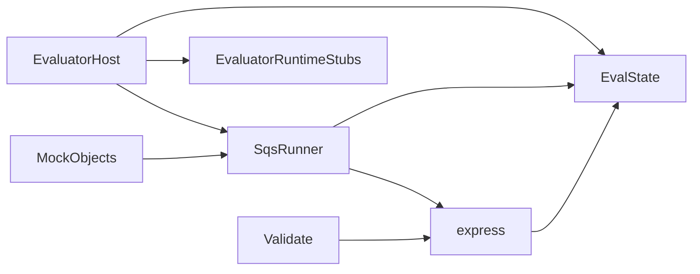

# Scripting System

<cite>
**Referenced Files in This Document**
- [EvaluatorHost.hpp](file://engine/Evaluator/EvaluatorHost.hpp)
- [EvaluatorHost.cpp](file://engine/Evaluator/EvaluatorHost.cpp)
- [EvalState.hpp](file://engine/Evaluator/EvalState.hpp)
- [EvalState.cpp](file://engine/Evaluator/EvalState.cpp)
- [express.hpp](file://engine/Evaluator/express.hpp)
- [express.cpp](file://engine/Evaluator/express.cpp)
- [SqsRunner.hpp](file://engine/Evaluator/SqsRunner.hpp)
- [SqsRunner.cpp](file://engine/Evaluator/SqsRunner.cpp)
- [EvaluatorRuntimeStubs.cpp](file://engine/Evaluator/EvaluatorRuntimeStubs.cpp)
- [EvaluatorRuntimeAnchor.cpp](file://engine/Evaluator/EvaluatorRuntimeAnchor.cpp)
- [Validate.hpp](file://engine/Evaluator/Validate.hpp)
- [Validate.cpp](file://engine/Evaluator/Validate.cpp)
- [MockObjects.hpp](file://engine/Evaluator/MockObjects.hpp)
- [MockObjects.cpp](file://engine/Evaluator/MockObjects.cpp)
</cite>

## Table of Contents
1. [Introduction](#introduction)
2. [Project Structure](#project-structure)
3. [Core Components](#core-components)
4. [Architecture Overview](#architecture-overview)
5. [Detailed Component Analysis](#detailed-component-analysis)
6. [Dependency Analysis](#dependency-analysis)
7. [Performance Considerations](#performance-considerations)
8. [Troubleshooting Guide](#troubleshooting-guide)
9. [Conclusion](#conclusion)
10. [Appendices](#appendices)

## Introduction
This document explains the SQF scripting system implementation and runtime environment, focusing on the Evaluator architecture for parsing, compiling, and executing script code. It documents the host API for exposing game functions to scripts, variable management, event handling, expression evaluation, function binding, and memory management. It also describes how scripts interact with game state and native code, provides practical guidance for writing custom scripts and debugging execution, and covers performance considerations, security restrictions, best practices, and integration with the mission system and modding capabilities.

## Project Structure
The scripting subsystem is primarily implemented under engine/Evaluator. The key responsibilities are:
- Host interface and runtime anchoring for exposing native functionality to scripts
- Expression parser and evaluator
- Execution runner for SQF-like scripts
- Validation utilities and mock objects for testing
- Runtime stubs that bridge into the host environment

**Diagram sources**
- [EvaluatorHost.hpp](file://engine/Evaluator/EvaluatorHost.hpp)
- [EvalState.hpp](file://engine/Evaluator/EvalState.hpp)
- [express.hpp](file://engine/Evaluator/express.hpp)
- [SqsRunner.hpp](file://engine/Evaluator/SqsRunner.hpp)
- [Validate.hpp](file://engine/Evaluator/Validate.hpp)
- [MockObjects.hpp](file://engine/Evaluator/MockObjects.hpp)
- [EvaluatorRuntimeStubs.cpp](file://engine/Evaluator/EvaluatorRuntimeStubs.cpp)
- [EvaluatorRuntimeAnchor.cpp](file://engine/Evaluator/EvaluatorRuntimeAnchor.cpp)

**Section sources**
- [EvaluatorHost.hpp](file://engine/Evaluator/EvaluatorHost.hpp)
- [EvaluatorHost.cpp](file://engine/Evaluator/EvaluatorHost.cpp)
- [EvalState.hpp](file://engine/Evaluator/EvalState.hpp)
- [EvalState.cpp](file://engine/Evaluator/EvalState.cpp)
- [express.hpp](file://engine/Evaluator/express.hpp)
- [express.cpp](file://engine/Evaluator/express.cpp)
- [SqsRunner.hpp](file://engine/Evaluator/SqsRunner.hpp)
- [SqsRunner.cpp](file://engine/Evaluator/SqsRunner.cpp)
- [EvaluatorRuntimeStubs.cpp](file://engine/Evaluator/EvaluatorRuntimeStubs.cpp)
- [EvaluatorRuntimeAnchor.cpp](file://engine/Evaluator/EvaluatorRuntimeAnchor.cpp)
- [Validate.hpp](file://engine/Evaluator/Validate.hpp)
- [Validate.cpp](file://engine/Evaluator/Validate.cpp)
- [MockObjects.hpp](file://engine/Evaluator/MockObjects.hpp)
- [MockObjects.cpp](file://engine/Evaluator/MockObjects.cpp)

## Core Components
- EvaluatorHost: Provides the primary host API for registering functions, managing variables, and controlling script execution lifecycles.
- EvalState: Holds per-execution context such as call stack, local variables, and runtime flags.
- express: Implements the expression language parser and evaluator used by the scripting runtime.
- SqsRunner: Orchestrates running SQF-style scripts, including compilation and execution phases.
- Validate: Offers validation helpers for expressions and script structures.
- MockObjects: Supplies test doubles for unit testing the scripting runtime.
- EvaluatorRuntimeStubs: Bridges between the scripting runtime and host-provided implementations.
- EvaluatorRuntimeAnchor: Anchors the runtime within the host application lifecycle.

Key responsibilities and interactions:
- Function registration and lookup occur through the host API.
- Variables are stored and resolved via the execution state.
- Expressions are parsed into an internal representation and evaluated against the current state.
- Scripts are compiled into executable units and executed by the runner.

**Section sources**
- [EvaluatorHost.hpp](file://engine/Evaluator/EvaluatorHost.hpp)
- [EvaluatorHost.cpp](file://engine/Evaluator/EvaluatorHost.cpp)
- [EvalState.hpp](file://engine/Evaluator/EvalState.hpp)
- [EvalState.cpp](file://engine/Evaluator/EvalState.cpp)
- [express.hpp](file://engine/Evaluator/express.hpp)
- [express.cpp](file://engine/Evaluator/express.cpp)
- [SqsRunner.hpp](file://engine/Evaluator/SqsRunner.hpp)
- [SqsRunner.cpp](file://engine/Evaluator/SqsRunner.cpp)
- [Validate.hpp](file://engine/Evaluator/Validate.hpp)
- [Validate.cpp](file://engine/Evaluator/Validate.cpp)
- [EvaluatorRuntimeStubs.cpp](file://engine/Evaluator/EvaluatorRuntimeStubs.cpp)
- [EvaluatorRuntimeAnchor.cpp](file://engine/Evaluator/EvaluatorRuntimeAnchor.cpp)

## Architecture Overview
The scripting system follows a layered architecture:
- Host Layer (EvaluatorHost): Exposes APIs for function binding, variable access, and execution control.
- Runtime Layer (EvalState, SqsRunner): Manages execution contexts and orchestrates script runs.
- Language Layer (express): Parses and evaluates expressions.
- Integration Layer (EvaluatorRuntimeStubs, EvaluatorRuntimeAnchor): Connects the scripting runtime to the host application and engine systems.

**Diagram sources**
- [EvaluatorHost.hpp](file://engine/Evaluator/EvaluatorHost.hpp)
- [EvaluatorHost.cpp](file://engine/Evaluator/EvaluatorHost.cpp)
- [SqsRunner.hpp](file://engine/Evaluator/SqsRunner.hpp)
- [SqsRunner.cpp](file://engine/Evaluator/SqsRunner.cpp)
- [express.hpp](file://engine/Evaluator/express.hpp)
- [express.cpp](file://engine/Evaluator/express.cpp)
- [EvalState.hpp](file://engine/Evaluator/EvalState.hpp)
- [EvalState.cpp](file://engine/Evaluator/EvalState.cpp)
- [EvaluatorRuntimeStubs.cpp](file://engine/Evaluator/EvaluatorRuntimeStubs.cpp)

## Detailed Component Analysis

### EvaluatorHost: Host API and Function Binding
EvaluatorHost centralizes the host-side scripting interface. Responsibilities include:
- Registering native functions callable from scripts
- Managing global and scoped variables
- Controlling script compilation and execution
- Providing hooks for events and callbacks

Typical usage flow:
- Initialize the host and bind functions
- Load and compile script sources
- Execute compiled units with arguments
- Retrieve results and handle errors

**Diagram sources**
- [EvaluatorHost.hpp](file://engine/Evaluator/EvaluatorHost.hpp)
- [EvaluatorHost.cpp](file://engine/Evaluator/EvaluatorHost.cpp)
- [SqsRunner.hpp](file://engine/Evaluator/SqsRunner.hpp)
- [EvalState.hpp](file://engine/Evaluator/EvalState.hpp)
- [EvaluatorRuntimeStubs.cpp](file://engine/Evaluator/EvaluatorRuntimeStubs.cpp)

**Section sources**
- [EvaluatorHost.hpp](file://engine/Evaluator/EvaluatorHost.hpp)
- [EvaluatorHost.cpp](file://engine/Evaluator/EvaluatorHost.cpp)

### EvalState: Execution Context and Variable Management
EvalState encapsulates the runtime context for each script execution:
- Local variables and scopes
- Global variables accessible across executions
- Call stack tracking for nested function calls
- Flags and metadata for execution behavior

Key operations:
- Push/pop scopes during function calls
- Resolve variable names within scope chains
- Store and retrieve values for expressions and native calls

**Diagram sources**
- [EvalState.hpp](file://engine/Evaluator/EvalState.hpp)
- [EvalState.cpp](file://engine/Evaluator/EvalState.cpp)

**Section sources**
- [EvalState.hpp](file://engine/Evaluator/EvalState.hpp)
- [EvalState.cpp](file://engine/Evaluator/EvalState.cpp)

### express: Expression Parser and Evaluator
express implements the core expression language used by the scripting runtime:
- Tokenization and parsing of expressions
- Construction of an abstract syntax tree (AST)
- Evaluation of expressions against the current execution state
- Support for operators, literals, and function calls

Processing steps:
- Parse source text into tokens
- Build AST nodes for expressions
- Evaluate nodes recursively using EvalState
- Return values to callers (e.g., SqsRunner)

**Diagram sources**
- [express.hpp](file://engine/Evaluator/express.hpp)
- [express.cpp](file://engine/Evaluator/express.cpp)

**Section sources**
- [express.hpp](file://engine/Evaluator/express.hpp)
- [express.cpp](file://engine/Evaluator/express.cpp)

### SqsRunner: Script Compilation and Execution
SqsRunner coordinates the lifecycle of SQF-style scripts:
- Compiles source code into executable units
- Executes compiled units with provided arguments
- Manages execution context via EvalState
- Integrates with the expression evaluator for inline expressions

Execution sequence:
- Receive source and compile it
- Create an execution context
- Run the compiled unit, evaluating statements and expressions
- Handle return values and errors

**Diagram sources**
- [SqsRunner.hpp](file://engine/Evaluator/SqsRunner.hpp)
- [SqsRunner.cpp](file://engine/Evaluator/SqsRunner.cpp)
- [express.hpp](file://engine/Evaluator/express.hpp)
- [express.cpp](file://engine/Evaluator/express.cpp)
- [EvalState.hpp](file://engine/Evaluator/EvalState.hpp)
- [EvalState.cpp](file://engine/Evaluator/EvalState.cpp)

**Section sources**
- [SqsRunner.hpp](file://engine/Evaluator/SqsRunner.hpp)
- [SqsRunner.cpp](file://engine/Evaluator/SqsRunner.cpp)

### EvaluatorRuntimeStubs and EvaluatorRuntimeAnchor: Host Integration
- EvaluatorRuntimeStubs: Provides stub implementations for native functions exposed to scripts. These stubs delegate to host-provided functionality.
- EvaluatorRuntimeAnchor: Anchors the scripting runtime within the host application lifecycle, ensuring proper initialization and shutdown.

Integration points:
- Native function calls from scripts route through stubs to host implementations
- Lifecycle events trigger anchor methods to manage resources and state

**Section sources**
- [EvaluatorRuntimeStubs.cpp](file://engine/Evaluator/EvaluatorRuntimeStubs.cpp)
- [EvaluatorRuntimeAnchor.cpp](file://engine/Evaluator/EvaluatorRuntimeAnchor.cpp)

### Validate and MockObjects: Testing and Validation
- Validate: Offers utilities to validate expressions and script structures before execution.
- MockObjects: Supplies test doubles for unit testing the scripting runtime without requiring full host dependencies.

Usage:
- Validate inputs and configurations prior to compilation
- Use mocks to isolate tests and verify behavior

**Section sources**
- [Validate.hpp](file://engine/Evaluator/Validate.hpp)
- [Validate.cpp](file://engine/Evaluator/Validate.cpp)
- [MockObjects.hpp](file://engine/Evaluator/MockObjects.hpp)
- [MockObjects.cpp](file://engine/Evaluator/MockObjects.cpp)

## Dependency Analysis
The scripting components have clear dependency relationships:
- EvaluatorHost depends on SqsRunner, EvalState, and runtime stubs
- SqsRunner depends on express and EvalState
- express operates independently but consumes EvalState for evaluation
- Validate and MockObjects support testing and validation workflows

**Diagram sources**
- [EvaluatorHost.hpp](file://engine/Evaluator/EvaluatorHost.hpp)
- [EvaluatorHost.cpp](file://engine/Evaluator/EvaluatorHost.cpp)
- [SqsRunner.hpp](file://engine/Evaluator/SqsRunner.hpp)
- [SqsRunner.cpp](file://engine/Evaluator/SqsRunner.cpp)
- [express.hpp](file://engine/Evaluator/express.hpp)
- [express.cpp](file://engine/Evaluator/express.cpp)
- [EvalState.hpp](file://engine/Evaluator/EvalState.hpp)
- [EvalState.cpp](file://engine/Evaluator/EvalState.cpp)
- [EvaluatorRuntimeStubs.cpp](file://engine/Evaluator/EvaluatorRuntimeStubs.cpp)
- [Validate.hpp](file://engine/Evaluator/Validate.hpp)
- [MockObjects.hpp](file://engine/Evaluator/MockObjects.hpp)

**Section sources**
- [EvaluatorHost.hpp](file://engine/Evaluator/EvaluatorHost.hpp)
- [EvaluatorHost.cpp](file://engine/Evaluator/EvaluatorHost.cpp)
- [SqsRunner.hpp](file://engine/Evaluator/SqsRunner.hpp)
- [SqsRunner.cpp](file://engine/Evaluator/SqsRunner.cpp)
- [express.hpp](file://engine/Evaluator/express.hpp)
- [express.cpp](file://engine/Evaluator/express.cpp)
- [EvalState.hpp](file://engine/Evaluator/EvalState.hpp)
- [EvalState.cpp](file://engine/Evaluator/EvalState.cpp)
- [EvaluatorRuntimeStubs.cpp](file://engine/Evaluator/EvaluatorRuntimeStubs.cpp)
- [Validate.hpp](file://engine/Evaluator/Validate.hpp)
- [MockObjects.hpp](file://engine/Evaluator/MockObjects.hpp)

## Performance Considerations
- Minimize function call overhead by batching operations where possible
- Reuse compiled script units instead of recompiling frequently
- Avoid excessive variable lookups; prefer local variables when feasible
- Limit deep recursion and large call stacks to prevent stack overflow
- Profile expression-heavy code paths and consider caching results
- Be mindful of memory allocation patterns in native functions exposed to scripts

[No sources needed since this section provides general guidance]

## Troubleshooting Guide
Common issues and resolutions:
- Function not found: Ensure the function is registered with the host before execution
- Variable resolution errors: Check scope chains and ensure variables are set in the correct context
- Parsing errors: Validate expression syntax and use validation utilities
- Runtime crashes: Inspect native function implementations and ensure safe access to host resources
- Performance regressions: Profile script execution and optimize hot paths

Debugging tips:
- Enable detailed logging in the host and runtime stubs
- Use mock objects to isolate failures in unit tests
- Validate scripts before deployment to catch syntax and semantic errors early

**Section sources**
- [Validate.hpp](file://engine/Evaluator/Validate.hpp)
- [Validate.cpp](file://engine/Evaluator/Validate.cpp)
- [MockObjects.hpp](file://engine/Evaluator/MockObjects.hpp)
- [MockObjects.cpp](file://engine/Evaluator/MockObjects.cpp)

## Conclusion
The SQF scripting system provides a robust and extensible framework for integrating custom logic into the game. By separating concerns across host, runtime, language, and integration layers, it enables flexible function binding, efficient expression evaluation, and reliable script execution. Following best practices for performance, security, and debugging ensures stable and maintainable scripting environments.

[No sources needed since this section summarizes without analyzing specific files]

## Appendices

### Practical Examples
- Writing custom scripts:
  - Define reusable functions and expose them via the host API
  - Use expressions for dynamic calculations and conditional logic
  - Manage state through variables in appropriate scopes
- Implementing game logic:
  - Bind native functions to interact with game entities and systems
  - Handle events and callbacks to respond to user actions and world changes
  - Optimize critical paths to maintain frame rate stability
- Debugging script execution:
  - Use validation tools to catch errors early
  - Employ mock objects to simulate host behavior in tests
  - Log execution traces and inspect variable states during development

[No sources needed since this section provides general guidance]