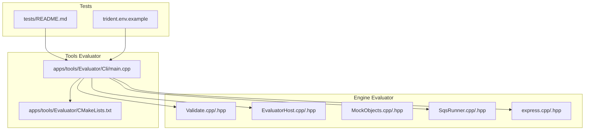
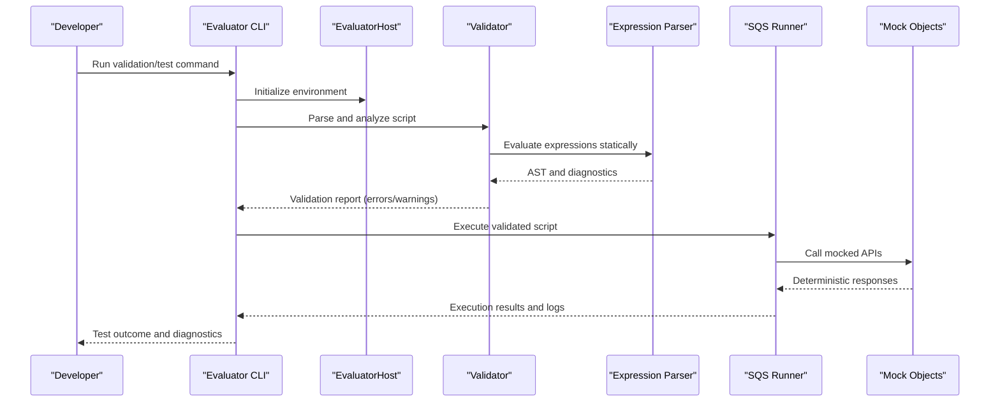
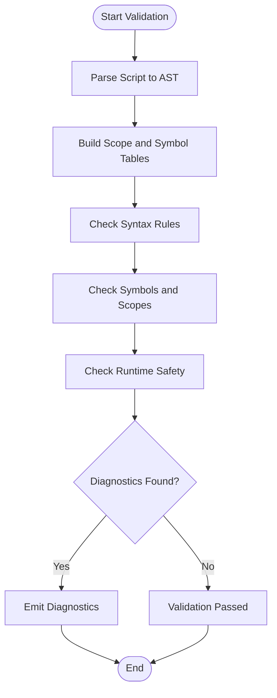
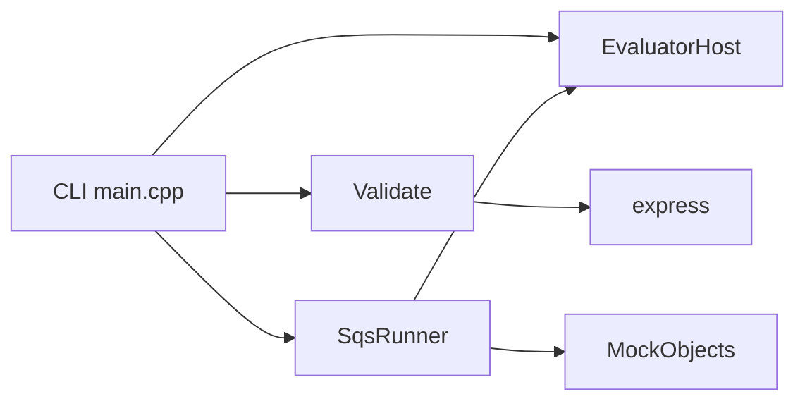

# Validation & Testing Tools

<cite>
**Referenced Files in This Document**
- [Validate.cpp](file://engine/Evaluator/Validate.cpp)
- [Validate.hpp](file://engine/Evaluator/Validate.hpp)
- [EvaluatorHost.cpp](file://engine/Evaluator/EvaluatorHost.cpp)
- [EvaluatorHost.hpp](file://engine/Evaluator/EvaluatorHost.hpp)
- [MockObjects.cpp](file://engine/Evaluator/MockObjects.cpp)
- [MockObjects.hpp](file://engine/Evaluator/MockObjects.hpp)
- [SqsRunner.cpp](file://engine/Evaluator/SqsRunner.cpp)
- [SqsRunner.hpp](file://engine/Evaluator/SqsRunner.hpp)
- [express.cpp](file://engine/Evaluator/express.cpp)
- [express.hpp](file://engine/Evaluator/express.hpp)
- [CMakeLists.txt](file://apps/tools/Evaluator/CMakeLists.txt)
- [Cli/main.cpp](file://apps/tools/Evaluator/Cli/main.cpp)
- [README.md](file://tests/README.md)
- [trident.env.example](file://.trident.env.example)
</cite>

## Table of Contents
1. Introduction
2. Project Structure
3. Core Components
4. Architecture Overview
5. Detailed Component Analysis
6. Dependency Analysis
7. Performance Considerations
8. Troubleshooting Guide
9. Conclusion
10. Appendices

## Introduction
This document explains the scripting validation and testing tools available in the repository, focusing on static analysis for syntax errors, undefined variables, and potential runtime issues; the test framework for validating script behavior with mock objects and assertions; validation rules and linting capabilities; code quality checks; practical examples for writing tests and integrating tools into development workflows; common pitfalls and debugging techniques; and performance profiling guidance for script development.

The primary implementation is located under the Evaluator subsystem (static analysis, expression evaluation, and runner utilities), complemented by an Evaluator CLI tool and a comprehensive test suite that exercises scripts and engine features.

## Project Structure
The relevant parts for scripting validation and testing are:
- Engine Evaluator: Static analysis, expression parsing, execution harness, and mocks
- Tools Evaluator: CLI entry point to run validation and tests
- Tests: Unit, integration, smoke, perf, and e2e suites including scripting scenarios and fixtures

**Diagram sources**
- [Validate.cpp](file://engine/Evaluator/Validate.cpp)
- [Validate.hpp](file://engine/Evaluator/Validate.hpp)
- [EvaluatorHost.cpp](file://engine/Evaluator/EvaluatorHost.cpp)
- [EvaluatorHost.hpp](file://engine/Evaluator/EvaluatorHost.hpp)
- [MockObjects.cpp](file://engine/Evaluator/MockObjects.cpp)
- [MockObjects.hpp](file://engine/Evaluator/MockObjects.hpp)
- [SqsRunner.cpp](file://engine/Evaluator/SqsRunner.cpp)
- [SqsRunner.hpp](file://engine/Evaluator/SqsRunner.hpp)
- [express.cpp](file://engine/Evaluator/express.cpp)
- [express.hpp](file://engine/Evaluator/express.hpp)
- [CMakeLists.txt](file://apps/tools/Evaluator/CMakeLists.txt)
- [Cli/main.cpp](file://apps/tools/Evaluator/Cli/main.cpp)
- [README.md](file://tests/README.md)
- [.trident.env.example](file://.trident.env.example)

**Section sources**
- [CMakeLists.txt](file://apps/tools/Evaluator/CMakeLists.txt)
- [Cli/main.cpp](file://apps/tools/Evaluator/Cli/main.cpp)
- [README.md](file://tests/README.md)

## Core Components
- Validate module: Provides static analysis for scripts, including syntax checking, variable scope analysis, and detection of undefined or unsafe usage patterns.
- EvaluatorHost: Hosts the evaluation environment, manages state, binds functions, and orchestrates execution of validated scripts.
- MockObjects: Supplies mock implementations of engine APIs for deterministic testing without external dependencies.
- SqsRunner: Executes SQF-style scripts within a controlled environment, capturing results and diagnostics.
- Express: Expression parser and evaluator used by the validator and runner to analyze and evaluate expressions safely.

These components work together to parse, validate, and execute scripts while providing rich diagnostics and safe execution contexts.

**Section sources**
- [Validate.cpp](file://engine/Evaluator/Validate.cpp)
- [Validate.hpp](file://engine/Evaluator/Validate.hpp)
- [EvaluatorHost.cpp](file://engine/Evaluator/EvaluatorHost.cpp)
- [EvaluatorHost.hpp](file://engine/Evaluator/EvaluatorHost.hpp)
- [MockObjects.cpp](file://engine/Evaluator/MockObjects.cpp)
- [MockObjects.hpp](file://engine/Evaluator/MockObjects.hpp)
- [SqsRunner.cpp](file://engine/Evaluator/SqsRunner.cpp)
- [SqsRunner.hpp](file://engine/Evaluator/SqsRunner.hpp)
- [express.cpp](file://engine/Evaluator/express.cpp)
- [express.hpp](file://engine/Evaluator/express.hpp)

## Architecture Overview
The validation and testing pipeline integrates static analysis with execution and assertion mechanisms:

**Diagram sources**
- [Cli/main.cpp](file://apps/tools/Evaluator/Cli/main.cpp)
- [EvaluatorHost.cpp](file://engine/Evaluator/EvaluatorHost.cpp)
- [Validate.cpp](file://engine/Evaluator/Validate.cpp)
- [express.cpp](file://engine/Evaluator/express.cpp)
- [SqsRunner.cpp](file://engine/Evaluator/SqsRunner.cpp)
- [MockObjects.cpp](file://engine/Evaluator/MockObjects.cpp)

## Detailed Component Analysis

### Validator (Static Analysis)
The validator performs:
- Syntax error detection via expression parsing and AST traversal
- Undefined variable detection through symbol table analysis
- Potential runtime issue identification (e.g., type mismatches, unsafe operations)
- Linting rules for style and safety (configurable via host bindings and flags)

Key behaviors:
- Parses scripts into an AST using the expression parser
- Walks the AST to build scopes and symbol tables
- Reports diagnostics with file/line information
- Integrates with host-provided function metadata to detect misuse

**Diagram sources**
- [Validate.cpp](file://engine/Evaluator/Validate.cpp)
- [express.cpp](file://engine/Evaluator/express.cpp)

**Section sources**
- [Validate.cpp](file://engine/Evaluator/Validate.cpp)
- [Validate.hpp](file://engine/Evaluator/Validate.hpp)
- [express.cpp](file://engine/Evaluator/express.cpp)
- [express.hpp](file://engine/Evaluator/express.hpp)

### EvaluatorHost (Execution Environment)
The host provides:
- Initialization and lifecycle management for the evaluation context
- Binding of engine functions and types to the scripting environment
- Configuration of validation and execution options
- State synchronization between validation and execution phases

Key responsibilities:
- Constructing the runtime environment with mocks and real APIs
- Exposing configuration flags to control strictness and diagnostics
- Managing memory and resource lifetimes during script execution

**Section sources**
- [EvaluatorHost.cpp](file://engine/Evaluator/EvaluatorHost.cpp)
- [EvaluatorHost.hpp](file://engine/Evaluator/EvaluatorHost.hpp)

### MockObjects (Deterministic Testing)
Mock objects enable:
- Isolated testing without external system dependencies
- Predictable behavior for engine APIs used by scripts
- Assertion-friendly interfaces for verifying script interactions

Usage patterns:
- Replace real engine calls with deterministic stubs
- Capture call sequences and parameters for verification
- Simulate edge cases and error conditions reliably

**Section sources**
- [MockObjects.cpp](file://engine/Evaluator/MockObjects.cpp)
- [MockObjects.hpp](file://engine/Evaluator/MockObjects.hpp)

### SQS Runner (Script Execution)
The runner executes validated scripts:
- Initializes the environment via the host
- Invokes the expression evaluator for dynamic parts
- Captures output, errors, and timing metrics
- Supports batch execution for test suites

Integration points:
- Consumes validation reports before execution
- Uses mock objects to isolate external effects
- Produces structured results for CI pipelines

**Section sources**
- [SqsRunner.cpp](file://engine/Evaluator/SqsRunner.cpp)
- [SqsRunner.hpp](file://engine/Evaluator/SqsRunner.hpp)

### CLI Tool (Entry Point)
The CLI tool orchestrates:
- Command-line argument parsing
- Loading configuration from environment files
- Running validation and tests against scripts and fixtures
- Reporting results in human-readable and machine-parseable formats

Workflow:
- Reads environment settings (e.g., .trident.env.example)
- Initializes the host and runner
- Executes test cases and collects diagnostics
- Exits with appropriate status codes for automation

**Section sources**
- [Cli/main.cpp](file://apps/tools/Evaluator/Cli/main.cpp)
- [CMakeLists.txt](file://apps/tools/Evaluator/CMakeLists.txt)
- [.trident.env.example](file://.trident.env.example)

## Dependency Analysis
The Evaluator subsystem exhibits clear separation of concerns:
- The CLI depends on the host, validator, runner, and expression parser
- The validator depends on the expression parser and host-provided metadata
- The runner depends on the host and mock objects for isolation
- Mock objects are independent and provide stable interfaces for testing

**Diagram sources**
- [Cli/main.cpp](file://apps/tools/Evaluator/Cli/main.cpp)
- [EvaluatorHost.cpp](file://engine/Evaluator/EvaluatorHost.cpp)
- [Validate.cpp](file://engine/Evaluator/Validate.cpp)
- [SqsRunner.cpp](file://engine/Evaluator/SqsRunner.cpp)
- [express.cpp](file://engine/Evaluator/express.cpp)
- [MockObjects.cpp](file://engine/Evaluator/MockObjects.cpp)

**Section sources**
- [Cli/main.cpp](file://apps/tools/Evaluator/Cli/main.cpp)
- [EvaluatorHost.cpp](file://engine/Evaluator/EvaluatorHost.cpp)
- [Validate.cpp](file://engine/Evaluator/Validate.cpp)
- [SqsRunner.cpp](file://engine/Evaluator/SqsRunner.cpp)
- [express.cpp](file://engine/Evaluator/express.cpp)
- [MockObjects.cpp](file://engine/Evaluator/MockObjects.cpp)

## Performance Considerations
- Prefer incremental validation: cache ASTs and symbol tables when possible
- Use minimal mock overhead: avoid heavy allocations in mock implementations
- Profile critical paths: measure parsing, validation, and execution times
- Limit diagnostic verbosity in production runs to reduce I/O overhead
- Batch test execution to amortize startup costs

[No sources needed since this section provides general guidance]

## Troubleshooting Guide
Common issues and resolutions:
- Syntax errors: Review parsed AST and reported locations; ensure correct language constructs
- Undefined variables: Verify scope declarations and imports; check host bindings
- Runtime errors: Inspect mock behavior and expected API contracts; add targeted assertions
- Performance regressions: Enable profiling flags; identify hotspots in parsing or execution
- CI failures: Validate environment configuration; ensure consistent fixture data

Debugging techniques:
- Enable detailed logging in the host and runner
- Use isolated test cases to reproduce issues deterministically
- Compare failing vs passing fixtures to pinpoint differences
- Leverage mock call traces to verify interaction sequences

**Section sources**
- [Validate.cpp](file://engine/Evaluator/Validate.cpp)
- [EvaluatorHost.cpp](file://engine/Evaluator/EvaluatorHost.cpp)
- [SqsRunner.cpp](file://engine/Evaluator/SqsRunner.cpp)
- [MockObjects.cpp](file://engine/Evaluator/MockObjects.cpp)

## Conclusion
The repository provides a robust set of scripting validation and testing tools centered around the Evaluator subsystem. Static analysis detects syntax and semantic issues early, while the runner and mocks enable reliable execution and assertion-based testing. By integrating these tools into development workflows and CI pipelines, teams can maintain high code quality, catch issues early, and ensure consistent behavior across environments.

[No sources needed since this section summarizes without analyzing specific files]

## Appendices

### Practical Examples
- Writing test cases: Create script fixtures under tests/fixtures and assert outcomes via the CLI runner
- Using validation tools: Invoke the CLI with strict mode to enforce linting and safety rules
- Integrating with build systems: Add steps to run validation and tests during compilation and packaging
- Profiling scripts: Use built-in timing hooks and external profilers to identify bottlenecks

[No sources needed since this section provides general guidance]