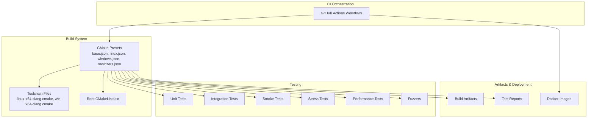
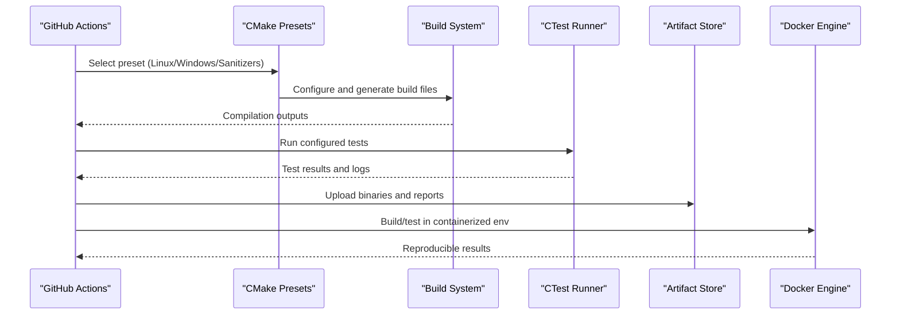
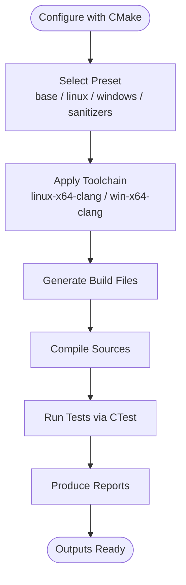
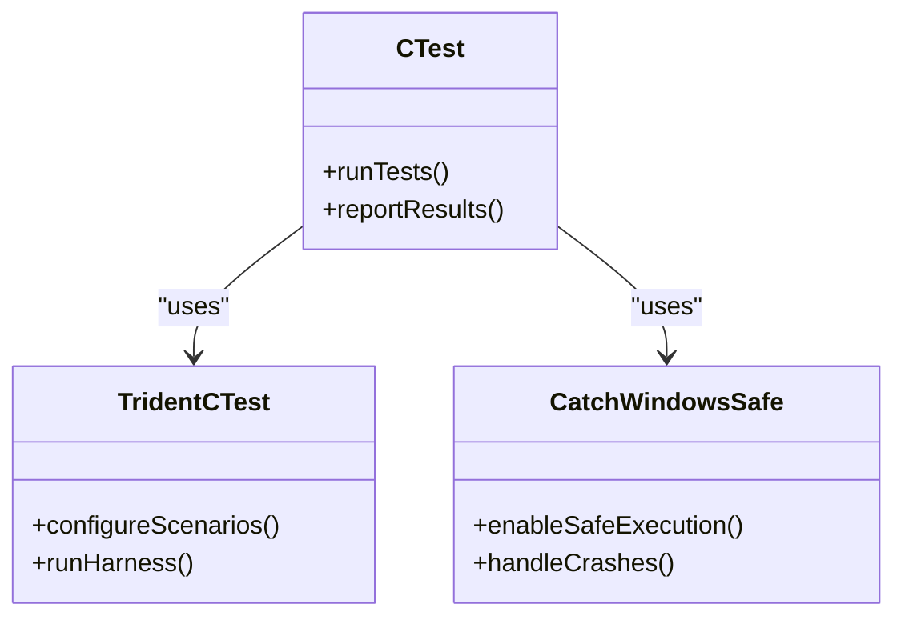
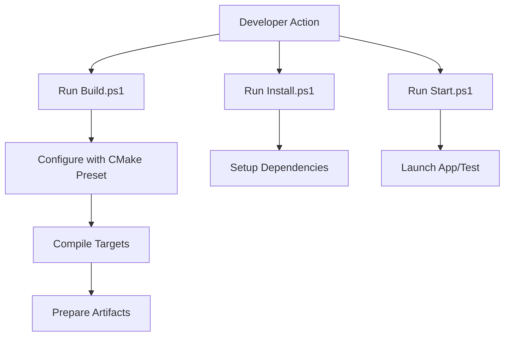
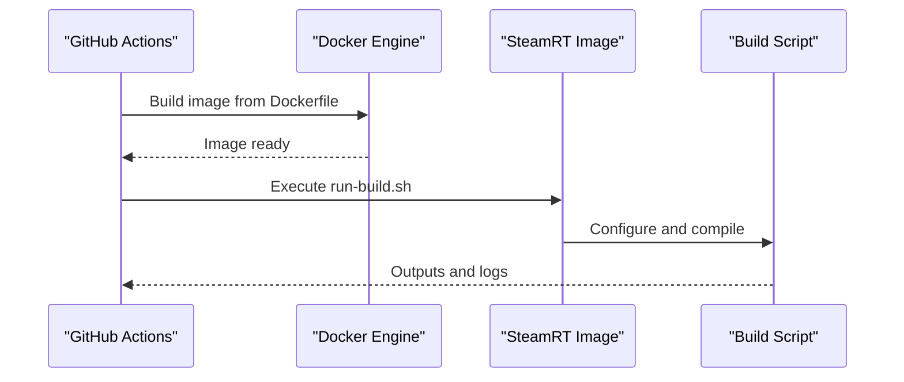
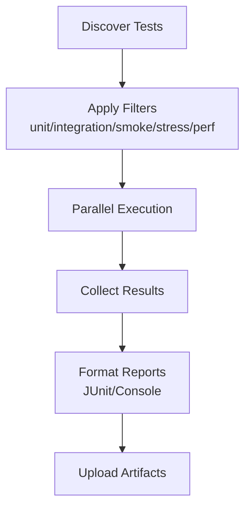
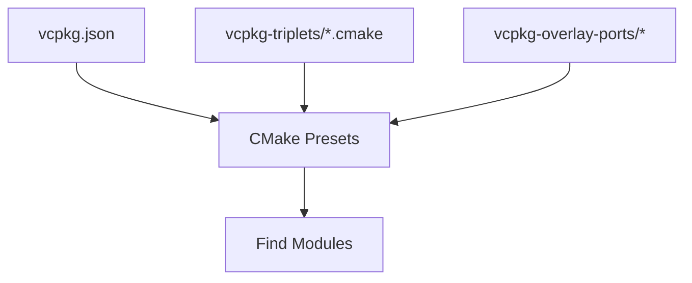

# Continuous Integration & Automation

<cite>
**Referenced Files in This Document**
- [CMakePresets.json](file://CMakePresets.json)
- [cmake/presets/base.json](file://cmake/presets/base.json)
- [cmake/presets/linux.json](file://cmake/presets/linux.json)
- [cmake/presets/windows.json](file://cmake/presets/windows.json)
- [cmake/presets/sanitizers.json](file://cmake/presets/sanitizers.json)
- [cmake/toolchains/linux-x64-clang.cmake](file://cmake/toolchains/linux-x64-clang.cmake)
- [cmake/toolchains/win-x64-clang.cmake](file://cmake/toolchains/win-x64-clang.cmake)
- [cmake/toolchains/linux-x64-clang-san.cmake](file://cmake/toolchains/linux-x64-clang-san.cmake)
- [cmake/toolchains/win-x64-clang-san.cmake](file://cmake/toolchains/win-x64-clang-san.cmake)
- [cmake/TridentCTest.cmake](file://cmake/TridentCTest.cmake)
- [cmake/CatchWindowsSafe.cmake](file://cmake/CatchWindowsSafe.cmake)
- [scripts/Build.ps1](file://scripts/Build.ps1)
- [scripts/Install.ps1](file://scripts/Install.ps1)
- [scripts/Start.ps1](file://scripts/Start.ps1)
- [docker/steamrt4/Dockerfile](file://docker/steamrt4/Dockerfile)
- [docker/steamrt4/run-build.sh](file://docker/steamrt4/run-build.sh)
- [tests/README.md](file://tests/README.md)
- [CMakeLists.txt](file://CMakeLists.txt)
</cite>

## Table of Contents
1. [Introduction](#introduction)
2. [Project Structure](#project-structure)
3. [Core Components](#core-components)
4. [Architecture Overview](#architecture-overview)
5. [Detailed Component Analysis](#detailed-component-analysis)
6. [Dependency Analysis](#dependency-analysis)
7. [Performance Considerations](#performance-considerations)
8. [Troubleshooting Guide](#troubleshooting-guide)
9. [Conclusion](#conclusion)
10. [Appendices](#appendices)

## Introduction
This document explains the continuous integration and automation strategy for CWR-CE’s automated testing pipeline. It covers how GitHub Actions workflows orchestrate builds, run tests across platforms, manage artifacts, and support deployment automation. It also documents CMake presets and toolchain files that define build configurations, test execution strategies, parallelization, caching, and environment provisioning. Guidance is provided for local development environments that mirror CI conditions and for debugging CI failures.

## Project Structure
The repository uses a multi-root CMake project with platform-specific presets and toolchains. CI pipelines leverage these presets to build and test on Linux and Windows using Clang toolchains. Tests are organized under the tests directory with unit, integration, smoke, stress, and performance suites. Docker assets provide reproducible Linux build environments. Build and install scripts assist with local setup and CI steps.

**Diagram sources**
- [CMakePresets.json:1-200](file://CMakePresets.json#L1-L200)
- [cmake/presets/base.json:1-200](file://cmake/presets/base.json#L1-L200)
- [cmake/presets/linux.json:1-200](file://cmake/presets/linux.json#L1-L200)
- [cmake/presets/windows.json:1-200](file://cmake/presets/windows.json#L1-L200)
- [cmake/presets/sanitizers.json:1-200](file://cmake/presets/sanitizers.json#L1-L200)
- [cmake/toolchains/linux-x64-clang.cmake:1-200](file://cmake/toolchains/linux-x64-clang.cmake#L1-L200)
- [cmake/toolchains/win-x64-clang.cmake:1-200](file://cmake/toolchains/win-x64-clang.cmake#L1-L200)
- [CMakeLists.txt:1-200](file://CMakeLists.txt#L1-L200)

**Section sources**
- [CMakePresets.json:1-200](file://CMakePresets.json#L1-L200)
- [CMakeLists.txt:1-200](file://CMakeLists.txt#L1-L200)

## Core Components
- CMake Presets: Define cross-platform configuration profiles (Debug/Release), generator selection, toolchain usage, and test enablement. They standardize how CI invokes builds and tests consistently across machines.
- Toolchain Files: Configure compiler and linker flags for Clang on Linux and Windows, including sanitizer variants.
- Test Harness Integration: CMake modules integrate Catch2 and Trident-based test runners, enabling safe execution on Windows and structured reporting.
- Scripts: PowerShell scripts automate building, installing dependencies, and launching applications or tests locally and in CI.
- Docker Assets: Provide a reproducible Linux environment for consistent builds and tests.

**Section sources**
- [cmake/presets/base.json:1-200](file://cmake/presets/base.json#L1-L200)
- [cmake/presets/linux.json:1-200](file://cmake/presets/linux.json#L1-L200)
- [cmake/presets/windows.json:1-200](file://cmake/presets/windows.json#L1-L200)
- [cmake/presets/sanitizers.json:1-200](file://cmake/presets/sanitizers.json#L1-L200)
- [cmake/toolchains/linux-x64-clang.cmake:1-200](file://cmake/toolchains/linux-x64-clang.cmake#L1-L200)
- [cmake/toolchains/win-x64-clang.cmake:1-200](file://cmake/toolchains/win-x64-clang.cmake#L1-L200)
- [cmake/TridentCTest.cmake:1-200](file://cmake/TridentCTest.cmake#L1-L200)
- [cmake/CatchWindowsSafe.cmake:1-200](file://cmake/CatchWindowsSafe.cmake#L1-L200)
- [scripts/Build.ps1:1-200](file://scripts/Build.ps1#L1-L200)
- [scripts/Install.ps1:1-200](file://scripts/Install.ps1#L1-L200)
- [scripts/Start.ps1:1-200](file://scripts/Start.ps1#L1-L200)
- [docker/steamrt4/Dockerfile:1-200](file://docker/steamrt4/Dockerfile#L1-L200)
- [docker/steamrt4/run-build.sh:1-200](file://docker/steamrt4/run-build.sh#L1-L200)

## Architecture Overview
The CI architecture orchestrates GitHub Actions jobs that select CMake presets to configure and build the project. Tests are executed via CTest, leveraging integrated harnesses for structured output. Artifacts such as binaries and logs are uploaded for inspection. Docker images ensure consistent Linux environments.

**Diagram sources**
- [CMakePresets.json:1-200](file://CMakePresets.json#L1-L200)
- [cmake/presets/base.json:1-200](file://cmake/presets/base.json#L1-L200)
- [cmake/presets/linux.json:1-200](file://cmake/presets/linux.json#L1-L200)
- [cmake/presets/windows.json:1-200](file://cmake/presets/windows.json#L1-L200)
- [cmake/presets/sanitizers.json:1-200](file://cmake/presets/sanitizers.json#L1-L200)
- [cmake/TridentCTest.cmake:1-200](file://cmake/TridentCTest.cmake#L1-L200)
- [cmake/CatchWindowsSafe.cmake:1-200](file://cmake/CatchWindowsSafe.cmake#L1-L200)
- [docker/steamrt4/Dockerfile:1-200](file://docker/steamrt4/Dockerfile#L1-L200)
- [docker/steamrt4/run-build.sh:1-200](file://docker/steamrt4/run-build.sh#L1-L200)

## Detailed Component Analysis

### CMake Presets and Toolchains
CMake presets encapsulate build configurations for different targets and platforms. The base preset defines common options; Linux and Windows presets extend it with platform-specific generators and toolchains. Sanitizer presets enable memory and thread safety checks. Toolchain files set compiler paths, flags, and link-time options for Clang on each platform.

**Diagram sources**
- [cmake/presets/base.json:1-200](file://cmake/presets/base.json#L1-L200)
- [cmake/presets/linux.json:1-200](file://cmake/presets/linux.json#L1-L200)
- [cmake/presets/windows.json:1-200](file://cmake/presets/windows.json#L1-L200)
- [cmake/presets/sanitizers.json:1-200](file://cmake/presets/sanitizers.json#L1-L200)
- [cmake/toolchains/linux-x64-clang.cmake:1-200](file://cmake/toolchains/linux-x64-clang.cmake#L1-L200)
- [cmake/toolchains/win-x64-clang.cmake:1-200](file://cmake/toolchains/win-x64-clang.cmake#L1-L200)

**Section sources**
- [cmake/presets/base.json:1-200](file://cmake/presets/base.json#L1-L200)
- [cmake/presets/linux.json:1-200](file://cmake/presets/linux.json#L1-L200)
- [cmake/presets/windows.json:1-200](file://cmake/presets/windows.json#L1-L200)
- [cmake/presets/sanitizers.json:1-200](file://cmake/presets/sanitizers.json#L1-L200)
- [cmake/toolchains/linux-x64-clang.cmake:1-200](file://cmake/toolchains/linux-x64-clang.cmake#L1-L200)
- [cmake/toolchains/win-x64-clang.cmake:1-200](file://cmake/toolchains/win-x64-clang.cmake#L1-L200)

### Test Harness Integration
Tests are executed through CTest with custom CMake modules integrating Catch2 and Trident. The Trident test module configures scenarios and harness behavior, while CatchWindowsSafe ensures stable execution on Windows. These modules standardize test discovery, filtering, and result formatting.

**Diagram sources**
- [cmake/TridentCTest.cmake:1-200](file://cmake/TridentCTest.cmake#L1-L200)
- [cmake/CatchWindowsSafe.cmake:1-200](file://cmake/CatchWindowsSafe.cmake#L1-L200)

**Section sources**
- [cmake/TridentCTest.cmake:1-200](file://cmake/TridentCTest.cmake#L1-L200)
- [cmake/CatchWindowsSafe.cmake:1-200](file://cmake/CatchWindowsSafe.cmake#L1-L200)

### Build and Install Scripts
PowerShell scripts streamline local development and CI steps. Build.ps1 invokes CMake with selected presets, compiles targets, and prepares outputs. Install.ps1 sets up dependencies and environment variables. Start.ps1 launches applications or tests with appropriate runtime settings.

**Diagram sources**
- [scripts/Build.ps1:1-200](file://scripts/Build.ps1#L1-L200)
- [scripts/Install.ps1:1-200](file://scripts/Install.ps1#L1-L200)
- [scripts/Start.ps1:1-200](file://scripts/Start.ps1#L1-L200)

**Section sources**
- [scripts/Build.ps1:1-200](file://scripts/Build.ps1#L1-L200)
- [scripts/Install.ps1:1-200](file://scripts/Install.ps1#L1-L200)
- [scripts/Start.ps1:1-200](file://scripts/Start.ps1#L1-L200)

### Docker Environment Provisioning
Dockerfiles and helper scripts define reproducible Linux environments for building and testing. The SteamRT-based image provides a gaming-compatible runtime, ensuring consistent behavior for graphics and audio subsystems during tests.

**Diagram sources**
- [docker/steamrt4/Dockerfile:1-200](file://docker/steamrt4/Dockerfile#L1-L200)
- [docker/steamrt4/run-build.sh:1-200](file://docker/steamrt4/run-build.sh#L1-L200)

**Section sources**
- [docker/steamrt4/Dockerfile:1-200](file://docker/steamrt4/Dockerfile#L1-L200)
- [docker/steamrt4/run-build.sh:1-200](file://docker/steamrt4/run-build.sh#L1-L200)

### Test Organization and Execution Strategy
Tests are categorized into unit, integration, smoke, stress, and performance suites. CTest discovers and runs them based on labels and filters. Parallelization is enabled by default in CTest, distributing tests across available CPU cores. Reporting formats include JUnit and console logs for CI consumption.

**Diagram sources**
- [tests/README.md:1-200](file://tests/README.md#L1-L200)
- [cmake/TridentCTest.cmake:1-200](file://cmake/TridentCTest.cmake#L1-L200)
- [cmake/CatchWindowsSafe.cmake:1-200](file://cmake/CatchWindowsSafe.cmake#L1-L200)

**Section sources**
- [tests/README.md:1-200](file://tests/README.md#L1-L200)
- [cmake/TridentCTest.cmake:1-200](file://cmake/TridentCTest.cmake#L1-L200)
- [cmake/CatchWindowsSafe.cmake:1-200](file://cmake/CatchWindowsSafe.cmake#L1-L200)

## Dependency Analysis
Dependencies are managed via vcpkg and CMake’s package finder mechanisms. Presets and toolchains specify triplet configurations for cross-compilation and sanitizer builds. External libraries are resolved at configure time, and caches can be leveraged to speed up subsequent builds.

**Diagram sources**
- [cmake/vcpkg-triplets/x64-linux-clang.cmake:1-200](file://cmake/vcpkg-triplets/x64-linux-clang.cmake#L1-L200)
- [cmake/vcpkg-triplets/x64-windows-clang.cmake:1-200](file://cmake/vcpkg-triplets/x64-windows-clang.cmake#L1-L200)
- [cmake/vcpkg-overlay-ports/openal-soft/portfile.cmake:1-200](file://cmake/vcpkg-overlay-ports/openal-soft/portfile.cmake#L1-L200)
- [CMakePresets.json:1-200](file://CMakePresets.json#L1-L200)

**Section sources**
- [CMakePresets.json:1-200](file://CMakePresets.json#L1-L200)
- [cmake/vcpkg-triplets/x64-linux-clang.cmake:1-200](file://cmake/vcpkg-triplets/x64-linux-clang.cmake#L1-L200)
- [cmake/vcpkg-triplets/x64-windows-clang.cmake:1-200](file://cmake/vcpkg-triplets/x64-windows-clang.cmake#L1-L200)
- [cmake/vcpkg-overlay-ports/openal-soft/portfile.cmake:1-200](file://cmake/vcpkg-overlay-ports/openal-soft/portfile.cmake#L1-L200)

## Performance Considerations
- Parallel Builds: Use CMake’s parallel compilation and CTest’s parallel test execution to reduce CI duration.
- Caching: Leverage CMake cache and vcpkg cache to avoid redundant downloads and recompilations.
- Incremental Builds: Prefer incremental builds in CI by preserving build directories between runs.
- Resource Limits: Set appropriate job timeouts and resource limits to prevent runaway processes.
- Sanitizers: Enable sanitizers selectively to balance coverage and performance.

[No sources needed since this section provides general guidance]

## Troubleshooting Guide
Common issues and resolutions:
- Configuration Failures: Verify preset selection and toolchain paths. Check CMake logs for missing dependencies.
- Test Crashes on Windows: Ensure CatchWindowsSafe is enabled and handle known crash scenarios.
- Docker Build Errors: Confirm base image availability and network access for dependency downloads.
- Secret Handling: Use GitHub Secrets for sensitive values; never hardcode credentials in workflows.
- Local Reproduction: Mirror CI by running the same CMake preset and scripts locally.

**Section sources**
- [cmake/CatchWindowsSafe.cmake:1-200](file://cmake/CatchWindowsSafe.cmake#L1-L200)
- [docker/steamrt4/Dockerfile:1-200](file://docker/steamrt4/Dockerfile#L1-L200)
- [scripts/Build.ps1:1-200](file://scripts/Build.ps1#L1-L200)

## Conclusion
CWR-CE’s CI system combines CMake presets, toolchains, and CTest-driven testing to deliver reliable cross-platform validation. Docker ensures environment consistency, while scripts streamline local and CI workflows. By following the documented strategies for parallelization, caching, and artifact management, teams can maintain fast, robust pipelines that mirror development conditions.

[No sources needed since this section summarizes without analyzing specific files]

## Appendices

### Setting Up Local Development Environments
- Install prerequisites: CMake, Clang, vcpkg, and PowerShell.
- Configure vcpkg triplets matching CI presets.
- Use Install.ps1 to set up dependencies.
- Build with Build.ps1 selecting the desired preset.
- Run tests via Start.ps1 or directly with CTest.

**Section sources**
- [scripts/Install.ps1:1-200](file://scripts/Install.ps1#L1-L200)
- [scripts/Build.ps1:1-200](file://scripts/Build.ps1#L1-L200)
- [scripts/Start.ps1:1-200](file://scripts/Start.ps1#L1-L200)
- [CMakePresets.json:1-200](file://CMakePresets.json#L1-L200)

### Debugging CI Failures
- Inspect workflow logs for CMake configuration and compilation errors.
- Reproduce locally using the same preset and environment.
- Validate Docker image builds and script executions.
- Use sanitizer builds to detect memory and threading issues.

**Section sources**
- [cmake/presets/sanitizers.json:1-200](file://cmake/presets/sanitizers.json#L1-L200)
- [docker/steamrt4/run-build.sh:1-200](file://docker/steamrt4/run-build.sh#L1-L200)
- [scripts/Build.ps1:1-200](file://scripts/Build.ps1#L1-L200)