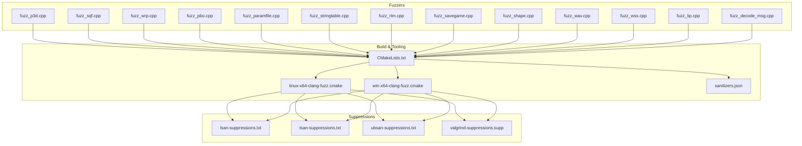
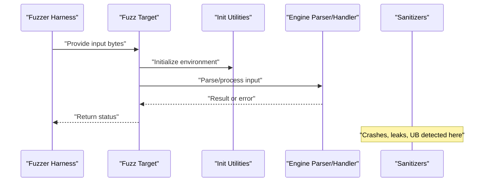
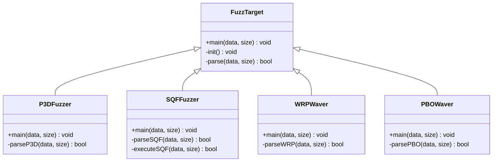
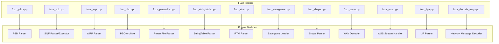
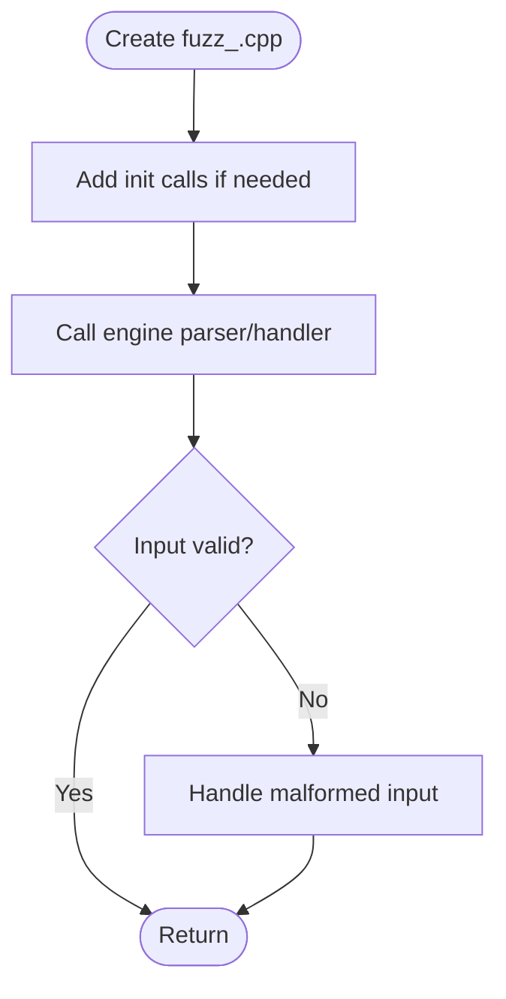

# Fuzzing & Security Testing

<cite>
**Referenced Files in This Document**
- [CMakeLists.txt](file://apps/fuzzers/Fuzzer/CMakeLists.txt)
- [fuzz_init.hpp](file://apps/fuzzers/Fuzzer/fuzz_init.hpp)
- [structure.hpp](file://apps/fuzzers/Fuzzer/structure.hpp)
- [fuzz_p3d.cpp](file://apps/fuzzers/Fuzzer/fuzz_p3d.cpp)
- [fuzz_sqf.cpp](file://apps/fuzzers/Fuzzer/fuzz_sqf.cpp)
- [fuzz_sqf_exec.cpp](file://apps/fuzzers/Fuzzer/fuzz_sqf_exec.cpp)
- [fuzz_wrp.cpp](file://apps/fuzzers/Fuzzer/fuzz_wrp.cpp)
- [fuzz_pbo.cpp](file://apps/fuzzers/Fuzzer/fuzz_pbo.cpp)
- [fuzz_paramfile.cpp](file://apps/fuzzers/Fuzzer/fuzz_paramfile.cpp)
- [fuzz_stringtable.cpp](file://apps/fuzzers/Fuzzer/fuzz_stringtable.cpp)
- [fuzz_rtm.cpp](file://apps/fuzzers/Fuzzer/fuzz_rtm.cpp)
- [fuzz_savegame.cpp](file://apps/fuzzers/Fuzzer/fuzz_savegame.cpp)
- [fuzz_shape.cpp](file://apps/fuzzers/Fuzzer/fuzz_shape.cpp)
- [fuzz_wav.cpp](file://apps/fuzzers/Fuzzer/fuzz_wav.cpp)
- [fuzz_wss.cpp](file://apps/fuzzers/Fuzzer/fuzz_wss.cpp)
- [fuzz_lip.cpp](file://apps/fuzzers/Fuzzer/fuzz_lip.cpp)
- [fuzz_decode_msg.cpp](file://apps/fuzzers/Fuzzer/fuzz_decode_msg.cpp)
- [linux-x64-clang-fuzz.cmake](file://cmake/toolchains/linux-x64-clang-fuzz.cmake)
- [win-x64-clang-fuzz.cmake](file://cmake/toolchains/win-x64-clang-fuzz.cmake)
- [sanitizers.json](file://cmake/presets/sanitizers.json)
- [lsan-suppressions.txt](file://lsan-suppressions.txt)
- [tsan-suppressions.txt](file://tsan-suppressions.txt)
- [ubsan-suppressions.txt](file://ubsan-suppressions.txt)
- [valgrind-suppressions.supp](file://valgrind-suppressions.supp)
</cite>

## Table of Contents
1. [Introduction](#introduction)
2. [Project Structure](#project-structure)
3. [Core Components](#core-components)
4. [Architecture Overview](#architecture-overview)
5. [Detailed Component Analysis](#detailed-component-analysis)
6. [Dependency Analysis](#dependency-analysis)
7. [Performance Considerations](#performance-considerations)
8. [Troubleshooting Guide](#troubleshooting-guide)
9. [Conclusion](#conclusion)
10. [Appendices](#appendices)

## Introduction
This document explains the fuzzing and security testing capabilities of CWR-CE with a focus on vulnerability detection across file formats and protocol handlers. It covers the fuzzer architecture, input generation strategies, crash detection mechanisms, and how to implement custom fuzzers for P3D, SQF, WRP, and other formats. It also documents coverage-guided fuzzing practices, dictionary-based mutation, corpus management, continuous fuzzing setup, crash triage workflows, sandboxing techniques, and best practices for reporting and fixing discovered vulnerabilities.

## Project Structure
The fuzzing infrastructure is organized under apps/fuzzers/Fuzzer with one entry per target format or handler. Each fuzzer targets a specific parsing or processing function exposed by the engine. Build tooling and sanitizer presets are provided under cmake/toolchains and cmake/presets. Suppression files at the repository root help manage known issues during fuzz runs.

**Diagram sources**
- [CMakeLists.txt](file://apps/fuzzers/Fuzzer/CMakeLists.txt)
- [linux-x64-clang-fuzz.cmake](file://cmake/toolchains/linux-x64-clang-fuzz.cmake)
- [win-x64-clang-fuzz.cmake](file://cmake/toolchains/win-x64-clang-fuzz.cmake)
- [sanitizers.json](file://cmake/presets/sanitizers.json)
- [lsan-suppressions.txt](file://lsan-suppressions.txt)
- [tsan-suppressions.txt](file://tsan-suppressions.txt)
- [ubsan-suppressions.txt](file://ubsan-suppressions.txt)
- [valgrind-suppressions.supp](file://valgrind-suppressions.supp)

**Section sources**
- [CMakeLists.txt](file://apps/fuzzers/Fuzzer/CMakeLists.txt)
- [linux-x64-clang-fuzz.cmake](file://cmake/toolchains/linux-x64-clang-fuzz.cmake)
- [win-x64-clang-fuzz.cmake](file://cmake/toolchains/win-x64-clang-fuzz.cmake)
- [sanitizers.json](file://cmake/presets/sanitizers.json)

## Core Components
- Fuzzer entry points: Each file in apps/fuzzers/Fuzzer implements a single-entry fuzz target that reads an input buffer and invokes the corresponding parser/handler.
- Initialization utilities: Common initialization helpers and shared structures are defined in fuzz_init.hpp and structure.hpp to reduce duplication across fuzzers.
- Build configuration: The CMakeLists.txt defines individual fuzz targets and links them against engine components. Toolchain files configure compiler flags for fuzzing (e.g., sanitizers, instrumentation).
- Sanitizer presets: Presets enable address, memory, thread, and undefined behavior sanitizers to detect crashes and memory errors early.

Key responsibilities:
- Input ingestion: Read bytes from the fuzzer harness into a buffer.
- Parsing/processing: Call the appropriate engine function for the given format or protocol message.
- Crash detection: Rely on sanitizers and OS signals to capture crashes, memory corruption, and UB.
- Corpus management: Maintain seed corpora and accept new inputs upon crash discovery.

**Section sources**
- [fuzz_init.hpp](file://apps/fuzzers/Fuzzer/fuzz_init.hpp)
- [structure.hpp](file://apps/fuzzers/Fuzzer/structure.hpp)
- [CMakeLists.txt](file://apps/fuzzers/Fuzzer/CMakeLists.txt)

## Architecture Overview
The fuzzer architecture follows a standard pattern:
- Harness provides byte arrays to each fuzz target.
- Each fuzz target decodes the array according to its format-specific parser.
- Engine code processes the parsed data; sanitizers monitor memory and control flow.
- Crashes produce reproducible artifacts stored in the corpus directory.

**Diagram sources**
- [fuzz_init.hpp](file://apps/fuzzers/Fuzzer/fuzz_init.hpp)
- [fuzz_p3d.cpp](file://apps/fuzzers/Fuzzer/fuzz_p3d.cpp)
- [fuzz_sqf.cpp](file://apps/fuzzers/Fuzzer/fuzz_sqf.cpp)
- [fuzz_wrp.cpp](file://apps/fuzzers/Fuzzer/fuzz_wrp.cpp)

## Detailed Component Analysis

### Fuzzer Entry Points and Format Targets
Each fuzzer file targets a specific format or handler:
- P3D model parsing
- SQF script parsing and execution
- WRP world parsing
- PBO archive handling
- ParamFile parsing
- StringTable XML parsing
- RTM animation parsing
- Savegame parsing
- Shape parsing
- WAV audio parsing
- WSS voice stream parsing
- Lip-sync parsing
- Network message decoding

Implementation patterns:
- Minimal main function that receives a byte buffer.
- Optional initialization via fuzz_init.hpp helpers.
- Direct call to the relevant engine function.
- No side effects beyond parsing/processing to keep fuzz runs deterministic.

**Diagram sources**
- [fuzz_p3d.cpp](file://apps/fuzzers/Fuzzer/fuzz_p3d.cpp)
- [fuzz_sqf.cpp](file://apps/fuzzers/Fuzzer/fuzz_sqf.cpp)
- [fuzz_wrp.cpp](file://apps/fuzzers/Fuzzer/fuzz_wrp.cpp)
- [fuzz_pbo.cpp](file://apps/fuzzers/Fuzzer/fuzz_pbo.cpp)

**Section sources**
- [fuzz_p3d.cpp](file://apps/fuzzers/Fuzzer/fuzz_p3d.cpp)
- [fuzz_sqf.cpp](file://apps/fuzzers/Fuzzer/fuzz_sqf.cpp)
- [fuzz_wrp.cpp](file://apps/fuzzers/Fuzzer/fuzz_wrp.cpp)
- [fuzz_pbo.cpp](file://apps/fuzzers/Fuzzer/fuzz_pbo.cpp)
- [fuzz_paramfile.cpp](file://apps/fuzzers/Fuzzer/fuzz_paramfile.cpp)
- [fuzz_stringtable.cpp](file://apps/fuzzers/Fuzzer/fuzz_stringtable.cpp)
- [fuzz_rtm.cpp](file://apps/fuzzers/Fuzzer/fuzz_rtm.cpp)
- [fuzz_savegame.cpp](file://apps/fuzzers/Fuzzer/fuzz_savegame.cpp)
- [fuzz_shape.cpp](file://apps/fuzzers/Fuzzer/fuzz_shape.cpp)
- [fuzz_wav.cpp](file://apps/fuzzers/Fuzzer/fuzz_wav.cpp)
- [fuzz_wss.cpp](file://apps/fuzzers/Fuzzer/fuzz_wss.cpp)
- [fuzz_lip.cpp](file://apps/fuzzers/Fuzzer/fuzz_lip.cpp)
- [fuzz_decode_msg.cpp](file://apps/fuzzers/Fuzzer/fuzz_decode_msg.cpp)

### Initialization and Shared Structures
- fuzz_init.hpp: Provides common initialization routines used by fuzzers to set up logging, paths, or minimal runtime state required by parsers.
- structure.hpp: Defines shared data structures used across multiple fuzzers to represent parsed entities or intermediate states.

Best practices:
- Keep initialization lightweight to avoid slow startup.
- Avoid global mutable state where possible to ensure determinism.
- Centralize common logic to reduce duplication and improve maintainability.

**Section sources**
- [fuzz_init.hpp](file://apps/fuzzers/Fuzzer/fuzz_init.hpp)
- [structure.hpp](file://apps/fuzzers/Fuzzer/structure.hpp)

### Build Configuration and Toolchains
- CMakeLists.txt: Declares individual fuzz targets and links them with engine components.
- linux-x64-clang-fuzz.cmake and win-x64-clang-fuzz.cmake: Configure compiler flags for fuzzing, including sanitizer options and instrumentation.
- sanitizers.json: Preset enabling AddressSanitizer, MemorySanitizer, ThreadSanitizer, and UndefinedBehaviorSanitizer.

Usage:
- Build with the fuzzing preset to generate instrumented binaries.
- Run each fuzzer binary with a corpus directory to collect inputs and crashes.

**Section sources**
- [CMakeLists.txt](file://apps/fuzzers/Fuzzer/CMakeLists.txt)
- [linux-x64-clang-fuzz.cmake](file://cmake/toolchains/linux-x64-clang-fuzz.cmake)
- [win-x64-clang-fuzz.cmake](file://cmake/toolchains/win-x64-clang-fuzz.cmake)
- [sanitizers.json](file://cmake/presets/sanitizers.json)

## Dependency Analysis
Fuzzers depend on engine modules responsible for parsing and processing respective formats. Dependencies are wired through the build system.

**Diagram sources**
- [fuzz_p3d.cpp](file://apps/fuzzers/Fuzzer/fuzz_p3d.cpp)
- [fuzz_sqf.cpp](file://apps/fuzzers/Fuzzer/fuzz_sqf.cpp)
- [fuzz_wrp.cpp](file://apps/fuzzers/Fuzzer/fuzz_wrp.cpp)
- [fuzz_pbo.cpp](file://apps/fuzzers/Fuzzer/fuzz_pbo.cpp)
- [fuzz_paramfile.cpp](file://apps/fuzzers/Fuzzer/fuzz_paramfile.cpp)
- [fuzz_stringtable.cpp](file://apps/fuzzers/Fuzzer/fuzz_stringtable.cpp)
- [fuzz_rtm.cpp](file://apps/fuzzers/Fuzzer/fuzz_rtm.cpp)
- [fuzz_savegame.cpp](file://apps/fuzzers/Fuzzer/fuzz_savegame.cpp)
- [fuzz_shape.cpp](file://apps/fuzzers/Fuzzer/fuzz_shape.cpp)
- [fuzz_wav.cpp](file://apps/fuzzers/Fuzzer/fuzz_wav.cpp)
- [fuzz_wss.cpp](file://apps/fuzzers/Fuzzer/fuzz_wss.cpp)
- [fuzz_lip.cpp](file://apps/fuzzers/Fuzzer/fuzz_lip.cpp)
- [fuzz_decode_msg.cpp](file://apps/fuzzers/Fuzzer/fuzz_decode_msg.cpp)

**Section sources**
- [CMakeLists.txt](file://apps/fuzzers/Fuzzer/CMakeLists.txt)

## Performance Considerations
- Minimize initialization overhead in fuzzers to maximize throughput.
- Use targeted parsers rather than full application bootstraps.
- Prefer deterministic operations within fuzz targets to ensure reproducibility.
- Enable incremental compilation and parallel builds to speed up iterations.
- Monitor sanitizer overhead; consider running without heavy sanitizers for quick smoke tests.

[No sources needed since this section provides general guidance]

## Troubleshooting Guide
Common issues and resolutions:
- Crashes due to memory errors: AddressSanitizer will report invalid reads/writes and use-after-free conditions. Reproduce using the generated artifact and inspect stack traces.
- Leaks: LeakSanitizer reports memory not freed; review allocation paths and ensure proper cleanup.
- Data races: ThreadSanitizer detects concurrent access; isolate threading in fuzz targets or fix synchronization.
- Undefined behavior: UBSan catches out-of-bounds accesses and type misuses; correct assumptions about data layout and types.
- Known false positives: Use suppression files to ignore benign issues while focusing on real bugs.

Suppression files:
- lsan-suppressions.txt: For leak suppressions.
- tsan-suppressions.txt: For thread-safety suppressions.
- ubsan-suppressions.txt: For undefined behavior suppressions.
- valgrind-suppressions.supp: For Valgrind-related noise.

**Section sources**
- [lsan-suppressions.txt](file://lsan-suppressions.txt)
- [tsan-suppressions.txt](file://tsan-suppressions.txt)
- [ubsan-suppressions.txt](file://ubsan-suppressions.txt)
- [valgrind-suppressions.supp](file://valgrind-suppressions.supp)

## Conclusion
CWR-CE’s fuzzing infrastructure provides comprehensive coverage across critical file formats and network protocols. By leveraging targeted fuzzers, sanitizers, and structured corpus management, the project can systematically uncover vulnerabilities. Adhering to the practices outlined here ensures efficient fuzzing, reliable crash reproduction, and effective remediation workflows.

[No sources needed since this section summarizes without analyzing specific files]

## Appendices

### Implementing Custom Fuzzers
Steps to add a new fuzzer:
- Create a new file under apps/fuzzers/Fuzzer named fuzz_<format>.cpp.
- Implement a minimal main function that accepts a byte buffer.
- Initialize environment using fuzz_init.hpp helpers if needed.
- Invoke the corresponding engine parser/handler with the input buffer.
- Add the new target to CMakeLists.txt.
- Build with the fuzzing toolchain and run with a corpus directory.

Example workflow for a new format:

[No sources needed since this diagram shows conceptual workflow, not actual code structure]

### Coverage-Guided Fuzzing Practices
- Seed corpus: Provide representative samples for each format.
- Dictionary-based mutation: Include format-specific tokens and keywords to guide mutations.
- Incremental corpus: Retain unique inputs that trigger new coverage paths.
- Continuous runs: Schedule regular fuzzing sessions to catch regressions.

[No sources needed since this section provides general guidance]

### Continuous Fuzzing Setup
- CI integration: Configure pipelines to build fuzz targets and execute them periodically.
- Artifact collection: Store crash inputs and logs for triage.
- Alerts: Notify developers when new crashes are detected.
- Suppression updates: Review and update suppression files regularly.

[No sources needed since this section provides general guidance]

### Crash Triage Processes
- Reproduce: Use the generated artifact to reproduce the crash locally.
- Analyze: Inspect sanitizer output and stack traces.
- Isolate: Narrow down the failing code path.
- Fix: Apply minimal changes to resolve the issue.
- Verify: Ensure the fix prevents regression with existing corpus.

[No sources needed since this section provides general guidance]

### Security Best Practices and Sandboxing
- Run fuzzers in isolated environments (containers or VMs).
- Limit resource usage (CPU, memory, disk) to prevent denial-of-service.
- Disable unnecessary features to reduce attack surface.
- Log and monitor fuzz runs for anomalies.

[No sources needed since this section provides general guidance]

### Vulnerability Reporting Workflows
- Document findings with clear steps to reproduce.
- Include sanitizer outputs and stack traces.
- Provide minimal reproducing inputs.
- Propose fixes or mitigations where applicable.
- Track issues through the project’s issue tracker.

[No sources needed since this section provides general guidance]