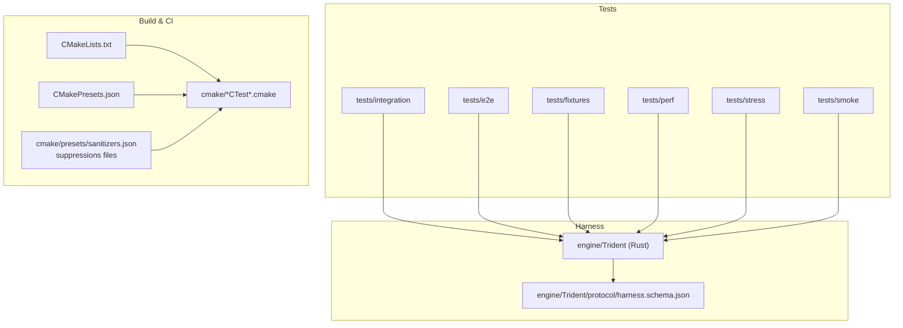
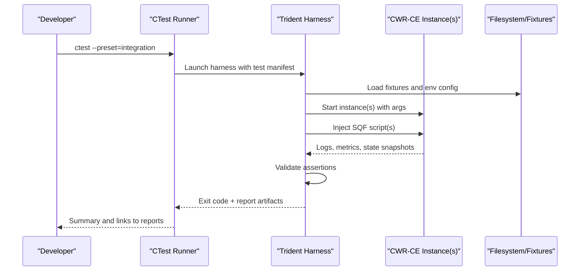
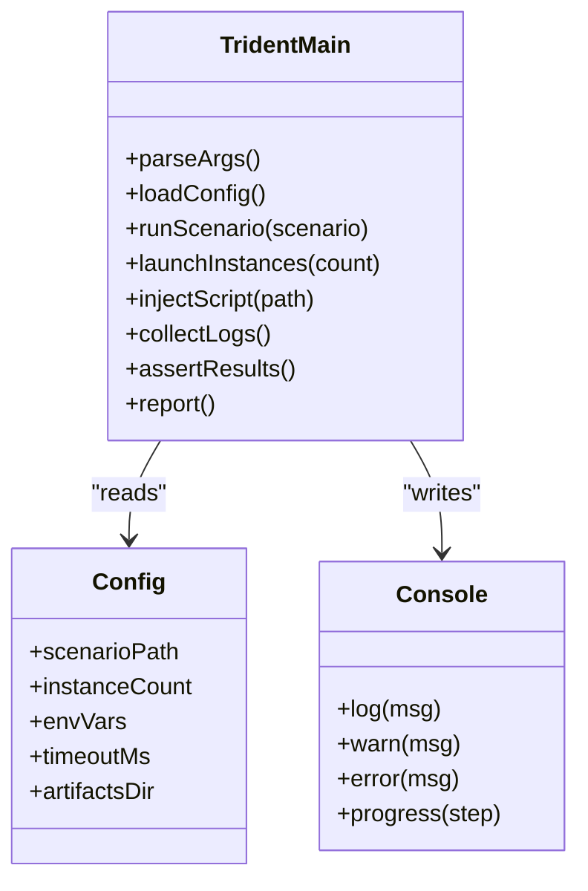
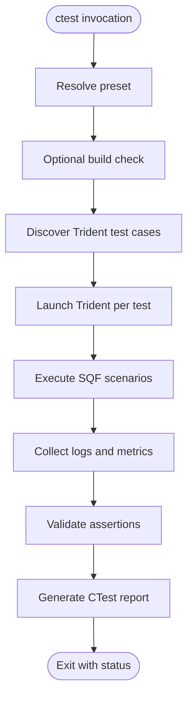
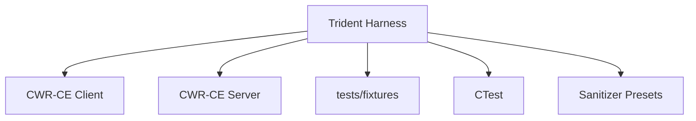

# Integration Testing

<cite>
**Referenced Files in This Document**
- [README.md](file://tests/README.md)
- [Trident main.rs](file://engine/Trident/src/main.rs)
- [Trident config.rs](file://engine/Trident/src/config.rs)
- [Trident console.rs](file://engine/Trident/src/console.rs)
- [Trident harness.schema.json](file://engine/Trident/protocol/harness.schema.json)
- [CMakeLists.txt](file://CMakeLists.txt)
- [CMakePresets.json](file://CMakePresets.json)
- [RunTridentCTest.cmake](file://cmake/RunTridentCTest.cmake)
- [TridentCTest.cmake](file://cmake/TridentCTest.cmake)
- [CatchWindowsSafe.cmake](file://cmake/CatchWindowsSafe.cmake)
- [CatchAddWindowsSafeTests.cmake](file://cmake/CatchAddWindowsSafeTests.cmake)
- [sanitizers.json](file://cmake/presets/sanitizers.json)
- [lsan-suppressions.txt](file://lsan-suppressions.txt)
- [tsan-suppressions.txt](file://tsan-suppressions.txt)
- [ubsan-suppressions.txt](file://ubsan-suppressions.txt)
- [valgrind-suppressions.supp](file://valgrind-suppressions.supp)
- [.trident.env.example](file://trident.env.example)
- [e2e master_server_browser_visibility.test.sqf](file://tests/e2e/master_server_browser_visibility.test.sqf)
- [integration README](file://tests/integration/README.md)
</cite>

## Table of Contents
1. [Introduction](#introduction)
2. [Project Structure](#project-structure)
3. [Core Components](#core-components)
4. [Architecture Overview](#architecture-overview)
5. [Detailed Component Analysis](#detailed-component-analysis)
6. [Dependency Analysis](#dependency-analysis)
7. [Performance Considerations](#performance-considerations)
8. [Troubleshooting Guide](#troubleshooting-guide)
9. [Conclusion](#conclusion)
10. [Appendices](#appendices)

## Introduction
This document explains the automated, scenario-based integration testing approach used by CWR-CE. It focuses on the SQF-based test scripting system, the Trident test harness orchestration, multi-scenario coordination, and how to build comprehensive tests covering mission loading, multiplayer scenarios, UI interactions, and rendering pipelines. It also covers test data management, environment setup, result validation, performance regression testing, memory leak detection, cross-platform compatibility verification, debugging failing tests, and optimizing execution time.

## Project Structure
Integration tests are organized under the tests directory with clear separation between unit, smoke, stress, perf, e2e, and integration suites. The Trident harness lives under engine/Trident and is a Rust-based orchestrator that drives CWR-CE instances against SQF scripts and validates outcomes.

Key areas:
- tests/integration: Scenario-driven integration tests (missions, UI, scripting, rendering, multiplayer).
- tests/e2e: End-to-end SQF tests orchestrated by Trident.
- engine/Trident: Test harness executable and protocol schema for harness communication.
- cmake: Harness integration with CTest, presets, and sanitizers.

**Diagram sources**
- [CMakeLists.txt](file://CMakeLists.txt)
- [CMakePresets.json](file://CMakePresets.json)
- [RunTridentCTest.cmake](file://cmake/RunTridentCTest.cmake)
- [TridentCTest.cmake](file://cmake/TridentCTest.cmake)
- [harness.schema.json](file://engine/Trident/protocol/harness.schema.json)

**Section sources**
- [README.md](file://tests/README.md)
- [CMakeLists.txt](file://CMakeLists.txt)
- [CMakePresets.json](file://CMakePresets.json)

## Core Components
- Trident harness: A Rust application that launches CWR-CE, loads missions/scenarios, injects inputs, captures logs/metrics, and asserts results based on the harness protocol schema.
- SQF test scripts: Human-readable scenario definitions executed within the game runtime to drive gameplay, UI, networking, and rendering behaviors.
- CTest integration: CMake targets and presets that discover and run Trident-driven tests via CTest, enabling parallel execution and reporting.
- Sanitizer configuration: Presets and suppression files for memory/thread/undefined behavior checks during integration runs.

What this enables:
- Deterministic scenario execution across platforms.
- Multi-scenario orchestration with shared fixtures and environment variables.
- Automated assertions on mission state, network synchronization, UI state, and rendering outputs.

**Section sources**
- [Trident main.rs](file://engine/Trident/src/main.rs)
- [Trident config.rs](file://engine/Trident/src/config.rs)
- [Trident console.rs](file://engine/Trident/src/console.rs)
- [harness.schema.json](file://engine/Trident/protocol/harness.schema.json)
- [RunTridentCTest.cmake](file://cmake/RunTridentCTest.cmake)
- [TridentCTest.cmake](file://cmake/TridentCTest.cmake)

## Architecture Overview
The integration testing architecture centers around Trident as the orchestrator. Tests are defined as SQF scripts and associated metadata. Trident reads configuration, sets up the environment, starts one or more CWR-CE processes, feeds inputs, collects telemetry/logs, and evaluates assertions.

**Diagram sources**
- [Trident main.rs](file://engine/Trident/src/main.rs)
- [Trident config.rs](file://engine/Trident/src/config.rs)
- [RunTridentCTest.cmake](file://cmake/RunTridentCTest.cmake)
- [TridentCTest.cmake](file://cmake/TridentCTest.cmake)

## Detailed Component Analysis

### Trident Harness Orchestration
Trident implements the test lifecycle:
- Configuration parsing and environment setup.
- Process management for one or more CWR-CE instances.
- Script dispatching (SQF) and input injection.
- Telemetry collection and assertion evaluation.
- Reporting and artifact generation.

**Diagram sources**
- [Trident main.rs](file://engine/Trident/src/main.rs)
- [Trident config.rs](file://engine/Trident/src/config.rs)
- [Trident console.rs](file://engine/Trident/src/console.rs)

**Section sources**
- [Trident main.rs](file://engine/Trident/src/main.rs)
- [Trident config.rs](file://engine/Trident/src/config.rs)
- [Trident console.rs](file://engine/Trident/src/console.rs)

### SQF-Based Test Scripting System
SQF scripts define scenarios that interact with the game world, UI, and networking. They can:
- Load missions and assets.
- Simulate player actions and AI behaviors.
- Drive UI flows and verify states.
- Assert mission outcomes and synchronization.

Best practices:
- Keep scripts deterministic where possible; use seeded randomness when needed.
- Separate setup, action, and assertion phases clearly.
- Use structured logging to aid debugging.

Example categories:
- Mission loading and persistence.
- Multiplayer synchronization and JIP handling.
- UI navigation and input validation.
- Rendering pipeline checks (e.g., frame stability, asset load times).

**Section sources**
- [e2e master_server_browser_visibility.test.sqf](file://tests/e2e/master_server_browser_visibility.test.sqf)

### Multi-Scenario Coordination
Trident supports running multiple scenarios in sequence or parallel, sharing fixtures and environment variables. Coordination patterns include:
- Sequential dependency chains (setup -> test -> teardown).
- Parallel independent scenarios for throughput.
- Shared state via files or inter-process channels exposed by the harness.

Guidelines:
- Isolate side effects per scenario.
- Use unique identifiers for temporary resources.
- Centralize shared fixtures under tests/fixtures.

**Section sources**
- [Trident main.rs](file://engine/Trident/src/main.rs)
- [Trident config.rs](file://engine/Trident/src/config.rs)

### Test Data Management and Environment Setup
- Fixtures: Static assets, configs, missions, and sample data under tests/fixtures.
- Environment variables: Configure paths, feature flags, and runtime options via .trident.env.example and harness config.
- Artifact directories: Capture logs, screenshots, and traces per test run.

Recommendations:
- Version control minimal reproducible fixtures.
- Externalize large assets and fetch them lazily if needed.
- Normalize paths and ensure cross-platform compatibility.

**Section sources**
- [harness.schema.json](file://engine/Trident/protocol/harness.schema.json)
- [.trident.env.example](file://trident.env.example)

### Result Validation and Reporting
Validation strategies:
- Log parsing for expected messages or error codes.
- State snapshots compared against baselines.
- Metrics thresholds (frame times, memory usage, network latency).
- Explicit assertions embedded in harness logic or SQF scripts.

Reporting:
- Structured JSON reports conforming to harness.schema.json.
- CTest-compatible output for CI dashboards.
- Attachments for logs and artifacts.

**Section sources**
- [harness.schema.json](file://engine/Trident/protocol/harness.schema.json)
- [RunTridentCTest.cmake](file://cmake/RunTridentCTest.cmake)

### Test Harness Architecture and Execution Pipeline
The execution pipeline integrates with CMake and CTest:
- CMake targets register Trident-driven tests.
- Presets configure environments and sanitizer modes.
- CTest discovers and executes tests, aggregating results.

**Diagram sources**
- [RunTridentCTest.cmake](file://cmake/RunTridentCTest.cmake)
- [TridentCTest.cmake](file://cmake/TridentCTest.cmake)
- [CMakePresets.json](file://CMakePresets.json)

**Section sources**
- [RunTridentCTest.cmake](file://cmake/RunTridentCTest.cmake)
- [TridentCTest.cmake](file://cmake/TridentCTest.cmake)
- [CMakePresets.json](file://CMakePresets.json)

## Dependency Analysis
Trident depends on:
- CWR-CE executables for client/server instances.
- Filesystem access for fixtures and artifacts.
- Optional sanitizers for memory/thread safety checks.
- CTest for discovery and aggregation.

**Diagram sources**
- [Trident main.rs](file://engine/Trident/src/main.rs)
- [RunTridentCTest.cmake](file://cmake/RunTridentCTest.cmake)
- [sanitizers.json](file://cmake/presets/sanitizers.json)

**Section sources**
- [Trident main.rs](file://engine/Trident/src/main.rs)
- [sanitizers.json](file://cmake/presets/sanitizers.json)

## Performance Considerations
- Parallelization: Run independent scenarios concurrently using CTest’s parallelism.
- Fixture caching: Preload heavy assets once per harness session when safe.
- Logging levels: Reduce verbosity in hot paths to minimize I/O overhead.
- Metrics collection: Sample frame times and memory usage at controlled intervals.
- Regression baselines: Store reference metrics and compare across runs.

[No sources needed since this section provides general guidance]

## Troubleshooting Guide
Common issues and resolutions:
- Missing fixtures: Ensure tests/fixtures are present and paths are correct.
- Environment misconfiguration: Validate .trident.env.example values and harness config.
- Timeouts: Increase timeouts for slow systems or large scenarios.
- Sanitizer failures: Review suppressions and isolate leaks; use targeted runs.
- Cross-platform differences: Normalize paths and avoid platform-specific assumptions.

Debugging steps:
- Enable verbose logging in Trident and CWR-CE.
- Inspect generated artifacts and logs per test.
- Reproduce locally with minimal fixtures.
- Use sanitizers incrementally to pinpoint issues.

**Section sources**
- [lsan-suppressions.txt](file://lsan-suppressions.txt)
- [tsan-suppressions.txt](file://tsan-suppressions.txt)
- [ubsan-suppressions.txt](file://ubsan-suppressions.txt)
- [valgrind-suppressions.supp](file://valgrind-suppressions.supp)

## Conclusion
CWR-CE’s integration testing leverages a robust Trident harness and SQF-based scripting to automate complex scenarios across mission loading, multiplayer, UI, and rendering. With CTest integration, sanitizers, and structured reporting, teams can maintain high confidence in correctness, performance, and cross-platform compatibility. Adopting the outlined best practices will streamline test authoring, execution, and maintenance.

[No sources needed since this section summarizes without analyzing specific files]

## Appendices

### Creating Comprehensive Integration Tests
- Mission loading: Define setup, load mission, validate entities and state.
- Multiplayer scenarios: Coordinate server/client, simulate joins/disconnects, assert synchronization.
- UI interactions: Drive menus and controls, capture UI state, assert visibility and content.
- Rendering pipelines: Verify asset loads, frame stability, and visual correctness via metrics and snapshots.

[No sources needed since this section provides general guidance]

### Example Test Data Management
- Centralize reusable data under tests/fixtures.
- Use versioned small datasets for determinism.
- Externalize large assets and provide download hooks if necessary.

[No sources needed since this section provides general guidance]

### Environment Setup Checklist
- Install dependencies and build CWR-CE.
- Configure .trident.env.example and harness settings.
- Ensure fixtures are available and accessible.
- Validate CTest presets and sanitizer configurations.

[No sources needed since this section provides general guidance]