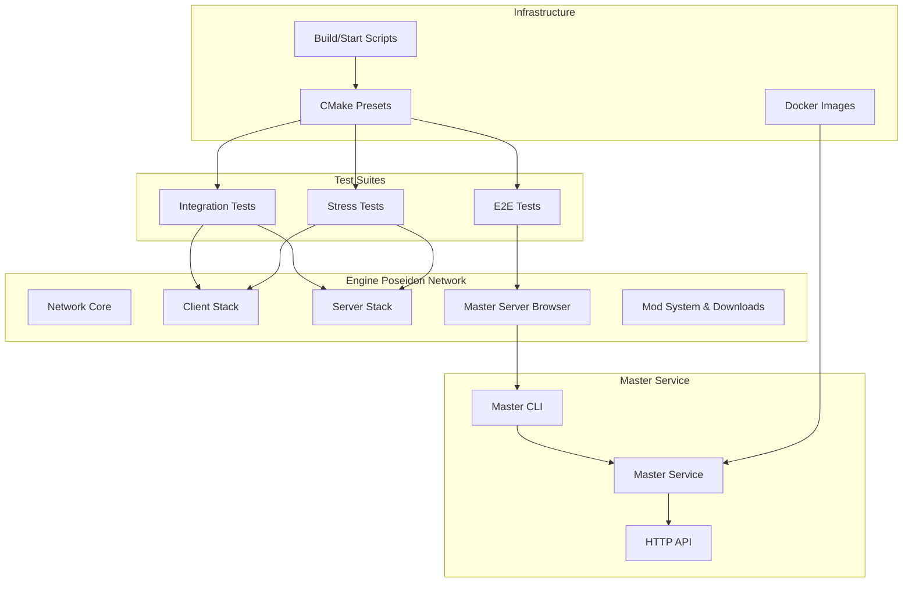
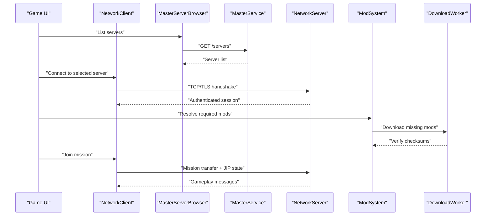
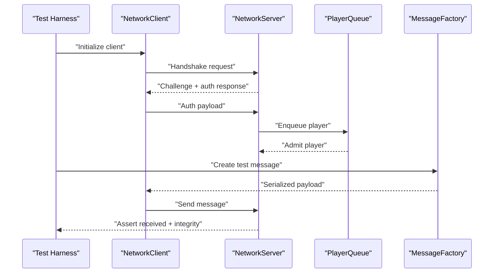
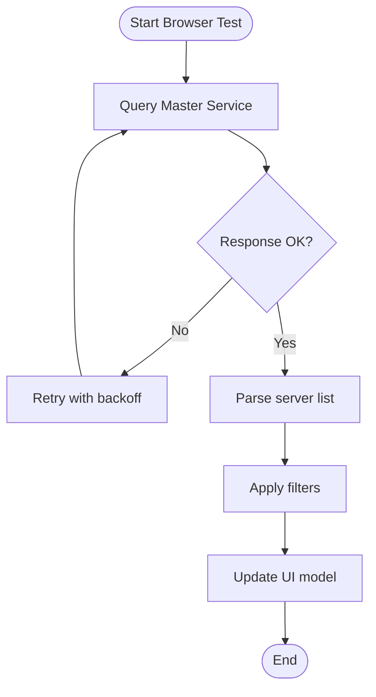
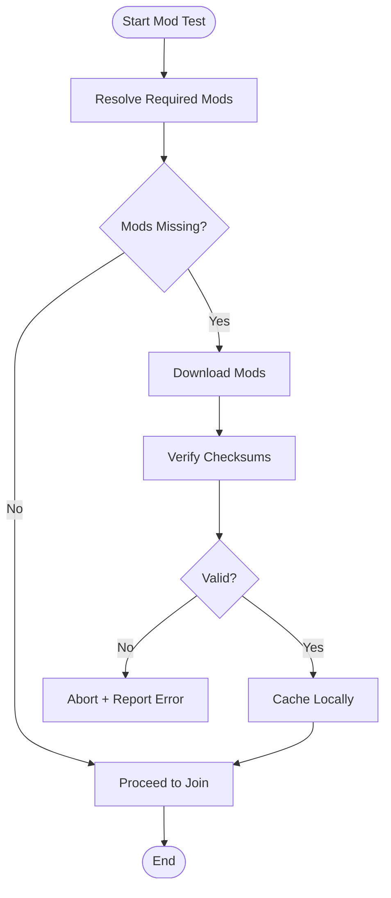
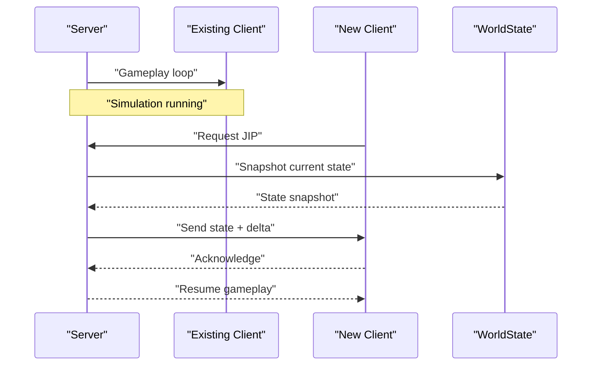
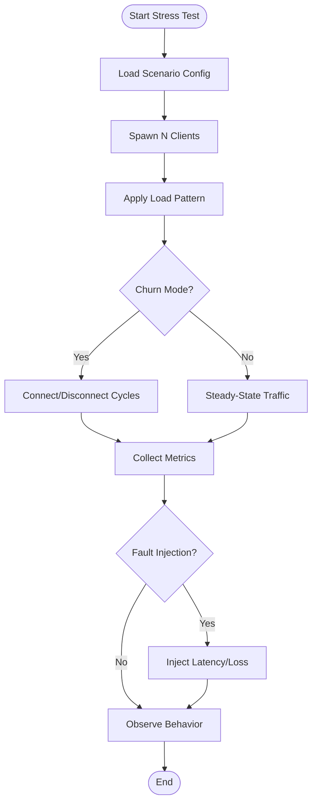
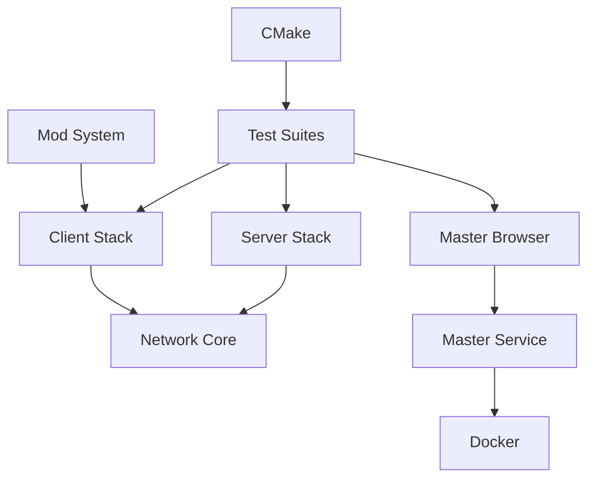

# Multiplayer Testing Framework

<cite>
**Referenced Files in This Document**
- [README.md](file://README.md)
- [CMakeLists.txt](file://CMakeLists.txt)
- [CMakePresets.json](file://CMakePresets.json)
- [.trident.env.example](file://.trident.env.example)
- [tests/README.md](file://tests/README.md)
- [tests/e2e/master_server_browser_visibility.test.sqf](file://tests/e2e/master_server_browser_visibility.test.sqf)
- [tests/integration/multiplayer](file://tests/integration/multiplayer)
- [tests/stress/mp/basic_soak.stress](file://tests/stress/mp/basic_soak.stress)
- [tests/stress/mp/fault_latency.stress](file://tests/stress/mp/fault_latency.stress)
- [tests/stress/mp/jip_churn.stress](file://tests/stress/mp/jip_churn.stress)
- [tests/stress/mp/restart_recovery.stress](file://tests/stress/mp/restart_recovery.stress)
- [tests/stress/mp/von_hosted_two_player.stress](file://tests/stress/mp/von_hosted_two_player.stress)
- [tests/stress/mp/von_soak.stress](file://tests/stress/mp/von_soak.stress)
- [engine/Poseidon/Network/MasterServerBrowser.cpp](file://engine/Poseidon/Network/MasterServerBrowser.cpp)
- [engine/Poseidon/Network/MasterServerBrowser.hpp](file://engine/Poseidon/Network/MasterServerBrowser.hpp)
- [engine/Poseidon/Network/MasterServerProtocol.hpp](file://engine/Poseidon/Network/MasterServerProtocol.hpp)
- [engine/Poseidon/Network/MasterServerPublisher.cpp](file://engine/Poseidon/Network/MasterServerPublisher.cpp)
- [engine/Poseidon/Network/MasterServerPublisher.hpp](file://engine/Poseidon/Network/MasterServerPublisher.hpp)
- [engine/Poseidon/Network/MasterServerServiceClient.cpp](file://engine/Poseidon/Network/MasterServerServiceClient.cpp)
- [engine/Poseidon/Network/MasterServerServiceClient.hpp](file://engine/Poseidon/Network/MasterServerServiceClient.hpp)
- [engine/Poseidon/Network/NetTransportClientHandshake.cpp](file://engine/Poseidon/Network/NetTransportClientHandshake.cpp)
- [engine/Poseidon/Network/NetTransportClientHandshake.hpp](file://engine/Poseidon/Network/NetTransportClientHandshake.hpp)
- [engine/Poseidon/Network/NetTransportClientSession.cpp](file://engine/Poseidon/Network/NetTransportClientSession.cpp)
- [engine/Poseidon/Network/NetTransportClientSession.hpp](file://engine/Poseidon/Network/NetTransportClientSession.hpp)
- [engine/Poseidon/Network/NetTransportPlayerHandshake.cpp](file://engine/Poseidon/Network/NetTransportPlayerHandshake.cpp)
- [engine/Poseidon/Network/NetTransportPlayerHandshake.hpp](file://engine/Poseidon/Network/NetTransportPlayerHandshake.hpp)
- [engine/Poseidon/Network/NetTransportPlayerQueue.cpp](file://engine/Poseidon/Network/NetTransportPlayerQueue.cpp)
- [engine/Poseidon/Network/NetTransportPlayerQueue.hpp](file://engine/Poseidon/Network/NetTransportPlayerQueue.hpp)
- [engine/Poseidon/Network/NetTransportTermination.cpp](file://engine/Poseidon/Network/NetTransportTermination.cpp)
- [engine/Poseidon/Network/NetTransportTermination.hpp](file://engine/Poseidon/Network/NetTransportTermination.hpp)
- [engine/Poseidon/Network/Network.cpp](file://engine/Poseidon/Network/Network.cpp)
- [engine/Poseidon/Network/Network.hpp](file://engine/Poseidon/Network/Network.hpp)
- [engine/Poseidon/Network/NetworkClient.cpp](file://engine/Poseidon/Network/NetworkClient.cpp)
- [engine/Poseidon/Network/NetworkConfig.cpp](file://engine/Poseidon/Network/NetworkConfig.cpp)
- [engine/Poseidon/Network/NetworkConfig.hpp](file://engine/Poseidon/Network/NetworkConfig.hpp)
- [engine/Poseidon/Network/NetworkMessages.cpp](file://engine/Poseidon/Network/NetworkMessages.cpp)
- [engine/Poseidon/Network/NetworkMessages.hpp](file://engine/Poseidon/Network/NetworkMessages.hpp)
- [engine/Poseidon/Network/NetworkServer.cpp](file://engine/Poseidon/Network/NetworkServer.cpp)
- [engine/Poseidon/Network/NetworkServerAuth.hpp](file://engine/Poseidon/Network/NetworkServerAuth.hpp)
- [engine/Poseidon/Network/NetworkServerDispatch.cpp](file://engine/Poseidon/Network/NetworkServerDispatch.cpp)
- [engine/Poseidon/Network/NetworkServerMsg.cpp](file://engine/Poseidon/Network/NetworkServerMsg.cpp)
- [engine/Poseidon/Network/NetworkServerMission.cpp](file://engine/Poseidon/Network/NetworkServerMission.cpp)
- [engine/Poseidon/Network/NetworkServerSimulate.cpp](file://engine/Poseidon/Network/NetworkServerSimulate.cpp)
- [engine/Poseidon/Network/NetworkServerIntegrity.cpp](file://engine/Poseidon/Network/NetworkServerIntegrity.cpp)
- [engine/Poseidon/Network/NetworkFileTransfer.hpp](file://engine/Poseidon/Network/NetworkFileTransfer.hpp)
- [engine/Poseidon/Network/NetworkMissionTransfer.cpp](file://engine/Poseidon/Network/NetworkMissionTransfer.cpp)
- [engine/Poseidon/Network/NetworkMissionTransfer.hpp](file://engine/Poseidon/Network/NetworkMissionTransfer.hpp)
- [engine/Poseidon/ModSystem.cpp](file://engine/Poseidon/ModSystem.cpp)
- [engine/Poseidon/ModSystem.hpp](file://engine/Poseidon/ModSystem.hpp)
- [engine/Poseidon/ModCollection.cpp](file://engine/Poseidon/ModCollection.cpp)
- [engine/Poseidon/ModCollection.hpp](file://engine/Poseidon/ModCollection.hpp)
- [engine/Poseidon/ModArchive.cpp](file://engine/Poseidon/ModArchive.cpp)
- [engine/Poseidon/ModArchive.hpp](file://engine/Poseidon/ModArchive.hpp)
- [engine/Poseidon/ModInstall.cpp](file://engine/Poseidon/ModInstall.cpp)
- [engine/Poseidon/ModInstall.hpp](file://engine/Poseidon/ModInstall.hpp)
- [engine/Poseidon/DownloadWorker.cpp](file://engine/Poseidon/DownloadWorker.cpp)
- [engine/Poseidon/DownloadWorker.hpp](file://engine/Poseidon/DownloadWorker.hpp)
- [engine/Poseidon/DownloadProgress.cpp](file://engine/Poseidon/DownloadProgress.cpp)
- [engine/Poseidon/DownloadProgress.hpp](file://engine/Poseidon/DownloadProgress.hpp)
- [mserver/CLI/src/main.rs](file://mserver/CLI/src/main.rs)
- [mserver/Client/src/lib.rs](file://mserver/Client/src/lib.rs)
- [mserver/MasterService/src/main.rs](file://mserver/MasterService/src/main.rs)
- [mserver/MasterService/src/http.rs](file://mserver/MasterService/src/http.rs)
- [mserver/MasterService/src/model.rs](file://mserver/MasterService/src/model.rs)
- [mserver/MasterService/src/repository.rs](file://mserver/MasterService/src/repository.rs)
- [mserver/MasterService/src/mods.rs](file://mserver/MasterService/src/mods.rs)
- [mserver/MasterService/src/probe.rs](file://mserver/MasterService/src/probe.rs)
- [docker/papa-bear-master-service/Dockerfile](file://docker/papa-bear-master-service/Dockerfile)
- [scripts/Build.ps1](file://scripts/Build.ps1)
- [scripts/Start.ps1](file://scripts/Start.ps1)
- [cmake/CatchAddWindowsSafeTests.cmake](file://cmake/CatchAddWindowsSafeTests.cmake)
- [cmake/CatchWindowsSafe.cmake](file://cmake/CatchWindowsSafe.cmake)
- [cmake/RunTridentCTest.cmake](file://cmake/RunTridentCTest.cmake)
- [cmake/TridentCTest.cmake](file://cmake/TridentCTest.cmake)
</cite>

## Table of Contents
1. Introduction
2. Project Structure
3. Core Components
4. Architecture Overview
5. Detailed Component Analysis
6. Dependency Analysis
7. Performance Considerations
8. Troubleshooting Guide
9. Conclusion

## Introduction
This document explains how to design and run multiplayer integration tests for CWR-CE, focusing on client-server communication, master server browser functionality, mod download verification, and join-in-progress (JIP) scenarios. It also covers stress testing strategies such as soak testing, connection churn simulation, and latency fault injection, along with guidance for setting up test servers, coordinating multiple clients, validating network message integrity, performance testing under load, memory leak detection, cross-platform networking compatibility, debugging techniques, and optimizing test execution.

## Project Structure
The repository organizes multiplayer-related code under the engine’s Poseidon module and provides dedicated test suites under tests/. The mserver directory contains the Rust-based master service and CLI tools used by the client’s master server browser. Docker assets are available for containerized master service deployment. Build and test orchestration is handled via CMake presets and scripts.

**Diagram sources**
- [engine/Poseidon/Network/Network.cpp](file://engine/Poseidon/Network/Network.cpp)
- [engine/Poseidon/Network/NetworkClient.cpp](file://engine/Poseidon/Network/NetworkClient.cpp)
- [engine/Poseidon/Network/NetworkServer.cpp](file://engine/Poseidon/Network/NetworkServer.cpp)
- [engine/Poseidon/Network/MasterServerBrowser.cpp](file://engine/Poseidon/Network/MasterServerBrowser.cpp)
- [mserver/CLI/src/main.rs](file://mserver/CLI/src/main.rs)
- [mserver/MasterService/src/main.rs](file://mserver/MasterService/src/main.rs)
- [docker/papa-bear-master-service/Dockerfile](file://docker/papa-bear-master-service/Dockerfile)
- [CMakePresets.json](file://CMakePresets.json)
- [scripts/Build.ps1](file://scripts/Build.ps1)
- [scripts/Start.ps1](file://scripts/Start.ps1)

**Section sources**
- [README.md](file://README.md)
- [CMakeLists.txt](file://CMakeLists.txt)
- [CMakePresets.json](file://CMakePresets.json)
- [tests/README.md](file://tests/README.md)

## Core Components
- Network core: Provides client/server abstractions, session management, messaging, and transport configuration.
- Master server browser: Discovers and queries master services for game sessions and metadata.
- Mod system: Manages mod archives, collections, installation, and downloads; integrates with network transfers.
- Test harnesses: E2E, integration, and stress test suites that exercise multiplayer flows and validate behavior under load.

Key responsibilities:
- Client-side handshake, authentication, player queueing, and session lifecycle.
- Server-side dispatch, mission transfer, integrity checks, and simulated gameplay.
- Master service HTTP endpoints for listing and probing servers.
- Download workers and progress tracking for mod acquisition.

**Section sources**
- [engine/Poseidon/Network/Network.hpp](file://engine/Poseidon/Network/Network.hpp)
- [engine/Poseidon/Network/NetworkClient.cpp](file://engine/Poseidon/Network/NetworkClient.cpp)
- [engine/Poseidon/Network/NetworkServer.cpp](file://engine/Poseidon/Network/NetworkServer.cpp)
- [engine/Poseidon/Network/MasterServerBrowser.hpp](file://engine/Poseidon/Network/MasterServerBrowser.hpp)
- [engine/Poseidon/ModSystem.hpp](file://engine/Poseidon/ModSystem.hpp)
- [engine/Poseidon/DownloadWorker.hpp](file://engine/Poseidon/DownloadWorker.hpp)

## Architecture Overview
The multiplayer architecture separates concerns into client, server, and master service layers. Clients connect to servers discovered via the master service. During gameplay, clients and servers exchange messages over a transport layer with handshakes, queues, and termination handling. Mods can be downloaded and verified before joining or during JIP.

**Diagram sources**
- [engine/Poseidon/Network/MasterServerBrowser.cpp](file://engine/Poseidon/Network/MasterServerBrowser.cpp)
- [mserver/MasterService/src/http.rs](file://mserver/MasterService/src/http.rs)
- [engine/Poseidon/Network/NetTransportClientHandshake.cpp](file://engine/Poseidon/Network/NetTransportClientHandshake.cpp)
- [engine/Poseidon/Network/NetworkServer.cpp](file://engine/Poseidon/Network/NetworkServer.cpp)
- [engine/Poseidon/ModSystem.cpp](file://engine/Poseidon/ModSystem.cpp)
- [engine/Poseidon/DownloadWorker.cpp](file://engine/Poseidon/DownloadWorker.cpp)
- [engine/Poseidon/Network/NetworkMissionTransfer.cpp](file://engine/Poseidon/Network/NetworkMissionTransfer.cpp)

## Detailed Component Analysis

### Client-Server Communication Testing
Focus areas:
- Handshake and authentication flow validation.
- Player queueing and admission policies.
- Message ordering, reliability, and integrity checks.
- Session lifecycle including reconnect and termination.

Recommended test patterns:
- Simulate normal connect/disconnect cycles and verify state transitions.
- Inject packet loss/delay and confirm retransmission and timeout behavior.
- Validate server-side dispatch paths for custom messages.

**Diagram sources**
- [engine/Poseidon/Network/NetTransportClientHandshake.cpp](file://engine/Poseidon/Network/NetTransportClientHandshake.cpp)
- [engine/Poseidon/Network/NetTransportPlayerQueue.cpp](file://engine/Poseidon/Network/NetTransportPlayerQueue.cpp)
- [engine/Poseidon/Network/NetworkMessages.cpp](file://engine/Poseidon/Network/NetworkMessages.cpp)
- [engine/Poseidon/Network/NetworkServerDispatch.cpp](file://engine/Poseidon/Network/NetworkServerDispatch.cpp)

**Section sources**
- [engine/Poseidon/Network/NetTransportClientHandshake.hpp](file://engine/Poseidon/Network/NetTransportClientHandshake.hpp)
- [engine/Poseidon/Network/NetTransportPlayerQueue.hpp](file://engine/Poseidon/Network/NetTransportPlayerQueue.hpp)
- [engine/Poseidon/Network/NetworkMessages.hpp](file://engine/Poseidon/Network/NetworkMessages.hpp)
- [engine/Poseidon/Network/NetworkServerDispatch.cpp](file://engine/Poseidon/Network/NetworkServerDispatch.cpp)

### Master Server Browser Functionality
Focus areas:
- Querying master service for server listings.
- Parsing responses and filtering results.
- Handling timeouts and retries.
- Validating metadata consistency.

Recommended test patterns:
- Mock master service responses to simulate varying server states.
- Verify browser UI updates and selection logic.
- Check error handling for malformed responses.

**Diagram sources**
- [engine/Poseidon/Network/MasterServerBrowser.cpp](file://engine/Poseidon/Network/MasterServerBrowser.cpp)
- [mserver/MasterService/src/http.rs](file://mserver/MasterService/src/http.rs)

**Section sources**
- [engine/Poseidon/Network/MasterServerBrowser.hpp](file://engine/Poseidon/Network/MasterServerBrowser.hpp)
- [engine/Poseidon/Network/MasterServerProtocol.hpp](file://engine/Poseidon/Network/MasterServerProtocol.hpp)
- [mserver/Client/src/lib.rs](file://mserver/Client/src/lib.rs)

### Mod Download Verification
Focus areas:
- Resolving required mods from server requirements.
- Downloading missing mods and verifying checksums.
- Handling partial downloads and resume capabilities.
- Ensuring consistent mod state across clients.

Recommended test patterns:
- Simulate missing mods and verify download completion.
- Inject corrupted payloads and assert rejection.
- Validate progress reporting and cancellation.

**Diagram sources**
- [engine/Poseidon/ModSystem.cpp](file://engine/Poseidon/ModSystem.cpp)
- [engine/Poseidon/DownloadWorker.cpp](file://engine/Poseidon/DownloadWorker.cpp)
- [engine/Poseidon/Network/NetworkFileTransfer.hpp](file://engine/Poseidon/Network/NetworkFileTransfer.hpp)

**Section sources**
- [engine/Poseidon/ModCollection.hpp](file://engine/Poseidon/ModCollection.hpp)
- [engine/Poseidon/ModArchive.hpp](file://engine/Poseidon/ModArchive.hpp)
- [engine/Poseidon/ModInstall.hpp](file://engine/Poseidon/ModInstall.hpp)
- [engine/Poseidon/DownloadProgress.hpp](file://engine/Poseidon/DownloadProgress.hpp)

### Join-In-Progress (JIP) Scenarios
Focus areas:
- Capturing and replaying world state for late joiners.
- Ensuring deterministic synchronization after JIP.
- Handling dynamic changes during JIP window.

Recommended test patterns:
- Start a server, spawn entities, then join mid-simulation and verify state parity.
- Validate entity ownership and channel assignments post-JIP.
- Stress test with frequent JIP events and concurrent joins.

**Diagram sources**
- [engine/Poseidon/Network/NetworkServerMission.cpp](file://engine/Poseidon/Network/NetworkServerMission.cpp)
- [engine/Poseidon/Network/NetworkMissionTransfer.cpp](file://engine/Poseidon/Network/NetworkMissionTransfer.cpp)

**Section sources**
- [engine/Poseidon/Network/NetworkServerSimulate.cpp](file://engine/Poseidon/Network/NetworkServerSimulate.cpp)
- [engine/Poseidon/Network/NetworkServerIntegrity.cpp](file://engine/Poseidon/Network/NetworkServerIntegrity.cpp)

### Stress Testing Approaches
Categories:
- Soak testing: Long-running stability under sustained load.
- Connection churn: Rapid connect/disconnect cycles to exercise resource management.
- Latency fault injection: Introduce delays and jitter to validate resilience.

Implementation guidance:
- Use existing stress test directories to define scenarios and configurations.
- Coordinate multiple clients via scripts or harnesses to simulate realistic traffic.
- Monitor metrics like CPU, memory, and network throughput.

**Diagram sources**
- [tests/stress/mp/basic_soak.stress](file://tests/stress/mp/basic_soak.stress)
- [tests/stress/mp/jip_churn.stress](file://tests/stress/mp/jip_churn.stress)
- [tests/stress/mp/fault_latency.stress](file://tests/stress/mp/fault_latency.stress)

**Section sources**
- [tests/stress/mp/von_soak.stress](file://tests/stress/mp/von_soak.stress)
- [tests/stress/mp/restart_recovery.stress](file://tests/stress/mp/restart_recovery.stress)
- [tests/stress/mp/von_hosted_two_player.stress](file://tests/stress/mp/von_hosted_two_player.stress)

### Setting Up Test Servers and Coordinating Multiple Clients
Guidance:
- Use server binaries built via CMake presets for consistent environments.
- Launch master service locally or via Docker for discovery tests.
- Script client launches with varied parameters to simulate diverse conditions.

Best practices:
- Pin versions and configurations to ensure reproducibility.
- Isolate ports and temporary directories per test run.
- Capture logs and telemetry for analysis.

**Section sources**
- [scripts/Build.ps1](file://scripts/Build.ps1)
- [scripts/Start.ps1](file://scripts/Start.ps1)
- [docker/papa-bear-master-service/Dockerfile](file://docker/papa-bear-master-service/Dockerfile)

### Validating Network Message Integrity
Techniques:
- Assert message types, payloads, and ordering at both ends.
- Use checksums or hashes for large payloads.
- Validate serialization round-trips for complex structures.

Tools:
- Leverage message factory utilities to construct deterministic payloads.
- Employ logging and tracing to capture wire formats.

**Section sources**
- [engine/Poseidon/Network/NetworkMessages.cpp](file://engine/Poseidon/Network/NetworkMessages.cpp)
- [engine/Poseidon/Network/NetworkMsg.cpp](file://engine/Poseidon/Network/NetworkMsg.cpp)
- [engine/Poseidon/Network/NetworkMsgContext.cpp](file://engine/Poseidon/Network/NetworkMsgContext.cpp)

### Performance Testing Under Load
Approach:
- Measure frame times, network throughput, and CPU utilization.
- Profile hot paths in network stack and mission simulation.
- Compare baselines across platforms and configurations.

Metrics:
- Packet loss rate, retransmission frequency, and latency percentiles.
- Memory growth trends indicating leaks or fragmentation.

**Section sources**
- [engine/Poseidon/Network/NetTransportMetrics.hpp](file://engine/Poseidon/Network/NetTransportMetrics.hpp)
- [engine/Poseidon/Network/RateLimit.hpp](file://engine/Poseidon/Network/RateLimit.hpp)

### Memory Leak Detection in Network Code
Strategies:
- Run with sanitizers (AddressSanitizer, ThreadSanitizer) in CI.
- Use platform-specific tools (Valgrind, Visual Studio diagnostics).
- Suppress known false positives via suppression files.

Execution:
- Build with sanitizer presets and run targeted tests.
- Analyze reports for allocations in network paths.

**Section sources**
- [cmake/sanitizers.json](file://cmake/sanitizers.json)
- [valgrind-suppressions.supp](file://valgrind-suppressions.supp)
- [tsan-suppressions.txt](file://tsan-suppressions.txt)
- [lsan-suppressions.txt](file://lsan-suppressions.txt)
- [ubsan-suppressions.txt](file://ubsan-suppressions.txt)

### Cross-Platform Networking Compatibility
Verification:
- Run identical test suites on Windows and Linux targets.
- Validate endian handling, socket APIs, and TLS implementations.
- Ensure consistent behavior across different network stacks.

Automation:
- Use CMake toolchains and presets to build and test on multiple platforms.
- Containerize master service for uniform environment.

**Section sources**
- [cmake/toolchains/linux-x64-clang.cmake](file://cmake/toolchains/linux-x64-clang.cmake)
- [cmake/toolchains/win-x64-clang.cmake](file://cmake/toolchains/win-x64-clang.cmake)
- [CMakePresets.json](file://CMakePresets.json)

### Debugging Network Issues in Test Environments
Tips:
- Enable detailed logging for handshake, dispatch, and termination phases.
- Capture packet traces using network sniffers where applicable.
- Correlate timestamps across client, server, and master service logs.

Common pitfalls:
- Port conflicts and firewall rules blocking connections.
- Misconfigured master service endpoints or CORS issues.
- Inconsistent mod versions causing mismatches.

**Section sources**
- [engine/Poseidon/Network/NetTransportTermination.cpp](file://engine/Poseidon/Network/NetTransportTermination.cpp)
- [engine/Poseidon/Network/NetworkConfig.cpp](file://engine/Poseidon/Network/NetworkConfig.cpp)
- [mserver/MasterService/src/probe.rs](file://mserver/MasterService/src/probe.rs)

### Optimizing Multiplayer Test Execution
Recommendations:
- Parallelize independent test cases to reduce total runtime.
- Reuse prebuilt artifacts and cached dependencies.
- Minimize I/O by sharing fixtures and avoiding redundant downloads.

CI integration:
- Use GitHub Actions workflows to automate builds and tests.
- Publish artifacts and test reports for traceability.

**Section sources**
- [cmake/RunTridentCTest.cmake](file://cmake/RunTridentCTest.cmake)
- [cmake/TridentCTest.cmake](file://cmake/TridentCTest.cmake)
- [.trident.env.example](file://.trident.env.example)

## Dependency Analysis
The multiplayer subsystem depends on networking primitives, mod resolution, and external master service APIs. Tests depend on build artifacts and infrastructure components like Docker images and CMake presets.

**Diagram sources**
- [engine/Poseidon/Network/Network.cpp](file://engine/Poseidon/Network/Network.cpp)
- [engine/Poseidon/Network/NetworkClient.cpp](file://engine/Poseidon/Network/NetworkClient.cpp)
- [engine/Poseidon/Network/NetworkServer.cpp](file://engine/Poseidon/Network/NetworkServer.cpp)
- [engine/Poseidon/Network/MasterServerBrowser.cpp](file://engine/Poseidon/Network/MasterServerBrowser.cpp)
- [engine/Poseidon/ModSystem.cpp](file://engine/Poseidon/ModSystem.cpp)
- [mserver/MasterService/src/main.rs](file://mserver/MasterService/src/main.rs)
- [docker/papa-bear-master-service/Dockerfile](file://docker/papa-bear-master-service/Dockerfile)
- [CMakePresets.json](file://CMakePresets.json)

**Section sources**
- [engine/Poseidon/Network/Network.hpp](file://engine/Poseidon/Network/Network.hpp)
- [engine/Poseidon/ModSystem.hpp](file://engine/Poseidon/ModSystem.hpp)
- [mserver/CLI/src/main.rs](file://mserver/CLI/src/main.rs)

## Performance Considerations
- Profile network I/O and serialization hotspots.
- Tune buffer sizes and batch sizes for optimal throughput.
- Monitor memory usage trends and GC pressure if applicable.
- Use sampling profilers to identify CPU-bound sections.

[No sources needed since this section provides general guidance]

## Troubleshooting Guide
Common issues and resolutions:
- Connection failures: Verify ports, firewalls, and master service availability.
- Authentication errors: Check credentials and token lifetimes.
- Mod mismatch: Ensure consistent mod versions across clients and server.
- High latency: Investigate network path and server load.

Debugging steps:
- Enable verbose logging and capture traces.
- Reproduce with minimal scenarios to isolate faults.
- Use sanitizers and memory tools to detect leaks and UB.

**Section sources**
- [engine/Poseidon/Network/NetworkConfig.cpp](file://engine/Poseidon/Network/NetworkConfig.cpp)
- [engine/Poseidon/Network/NetworkServerAuth.hpp](file://engine/Poseidon/Network/NetworkServerAuth.hpp)
- [engine/Poseidon/Network/NetTransportTermination.cpp](file://engine/Poseidon/Network/NetTransportTermination.cpp)

## Conclusion
CWR-CE provides a robust foundation for multiplayer integration testing through well-structured networking components, a modular master service, and comprehensive test suites. By leveraging soak testing, churn simulation, and latency fault injection, teams can validate reliability, performance, and cross-platform compatibility. Effective debugging and optimization require careful logging, profiling, and systematic isolation of issues. Adopting these practices ensures resilient multiplayer experiences under real-world conditions.