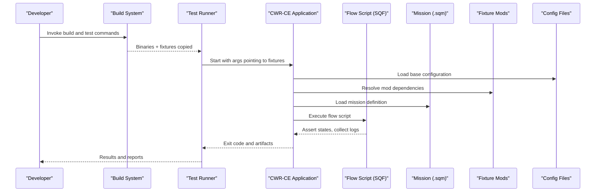
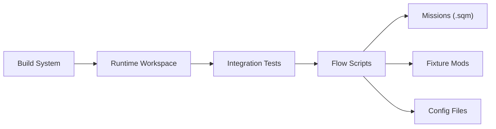

# Test Data and Fixtures

<cite>
**Referenced Files in This Document**
- [tests/README.md](file://tests/README.md)
- [tests/fixtures/ASSET_SOURCES.md](file://tests/fixtures/ASSET_SOURCES.md)
- [tests/integration/flows/main.sqf](file://tests/integration/flows/main.sqf)
- [tests/integration/missions/Tank.Intro/mission.sqm](file://tests/integration/missions/Tank.Intro/mission.sqm)
- [tests/fixtures/mods/@fixturemod/mod.cpp](file://tests/fixtures/mods/@fixturemod/mod.cpp)
- [tests/fixtures/config/base.cfg](file://tests/fixtures/config/base.cfg)
- [tests/fixtures/evaluator/test_evaluator.sqf](file://tests/fixtures/evaluator/test_evaluator.sqf)
- [tests/smoke/audio_config.tests.ps1](file://tests/smoke/audio_config.tests.ps1)
- [CMakeLists.txt](file://CMakeLists.txt)
- [cmake/CatchAddWindowsSafeTests.cmake](file://cmake/CatchAddWindowsSafeTests.cmake)
- [cmake/CatchWindowsSafe.cmake](file://cmake/CatchWindowsSafe.cmake)
- [scripts/Build.ps1](file://scripts/Build.ps1)
- [scripts/Install.ps1](file://scripts/Install.ps1)
- [scripts/Start.ps1](file://scripts/Start.ps1)
</cite>

## Table of Contents
1. [Introduction](#introduction)
2. [Project Structure](#project-structure)
3. [Core Components](#core-components)
4. [Architecture Overview](#architecture-overview)
5. [Detailed Component Analysis](#detailed-component-analysis)
6. [Dependency Analysis](#dependency-analysis)
7. [Performance Considerations](#performance-considerations)
8. [Troubleshooting Guide](#troubleshooting-guide)
9. [Conclusion](#conclusion)
10. [Appendices](#appendices)

## Introduction
This document explains how test data and fixtures are organized and used in CWR-CE integration testing. It covers the fixture hierarchy, configuration files, mission definitions, mod packages, asset fixtures, environment setup, isolation strategies, dynamic data generation, version control considerations, data migration strategies, cleanup procedures, and best practices for large datasets and consistent environments.

## Project Structure
The repository organizes tests under a dedicated directory with clear separation between unit, smoke, integration, performance, stress, and end-to-end scenarios. Fixtures live under a shared fixtures directory and are consumed by integration and other test suites.

```mermaid
graph TB
A["tests/"] --> B["unit/"]
A --> C["smoke/"]
A --> D["integration/"]
A --> E["perf/"]
A --> F["stress/"]
A --> G["e2e/"]
A --> H["fixtures/"]
D --> D1["missions/"]
D --> D2["mods/"]
D --> D3["flows/"]
D --> D4["ingame/"]
D --> D5["multiplayer/"]
D --> D6["rendering/"]
D --> D7["scripting/"]
D --> D8["ui/"]
H --> H1["config/"]
H --> H2["mods/@fixturemod/"]
H --> H3["evaluator/"]
H --> H4["audio/"]
H --> H5["font/"]
H --> H6["jpg/"]
H --> H7["mlod/"]
H --> H8["p3d/"]
H --> H9["paa/"]
H --> H10["pac/"]
H --> H11["pbo/"]
H --> H12["qstream/"]
H --> H13["rtm/"]
H --> H14["savegame/"]
H --> H15["stringtable/"]
H --> H16["studio/"]
H --> H17["workshop/@wsfixture/"]
H --> H18["wrp/"]
H --> H19["xml/"]
```

**Section sources**
- [tests/README.md](file://tests/README.md)

## Core Components
- Fixture root and documentation: The fixtures directory contains a comprehensive guide describing asset sources and usage policies.
- Integration flows: Integration tests use SQF-based flow scripts to orchestrate missions and assertions.
- Mission definitions: Missions are defined as .sqm files within the integration/missions tree.
- Mod packages: Minimal mods under fixtures/mods provide configuration overrides and assets required by tests.
- Configuration files: Base configuration files under fixtures/config define engine and game settings for deterministic runs.
- Evaluator fixtures: Small SQF snippets under fixtures/evaluator exercise the script evaluator.

Key responsibilities:
- Provide deterministic, isolated inputs for each test.
- Keep assets minimal and relevant to the test scenario.
- Centralize configuration to ensure consistency across environments.

**Section sources**
- [tests/fixtures/ASSET_SOURCES.md](file://tests/fixtures/ASSET_SOURCES.md)
- [tests/integration/flows/main.sqf](file://tests/integration/flows/main.sqf)
- [tests/integration/missions/Tank.Intro/mission.sqm](file://tests/integration/missions/Tank.Intro/mission.sqm)
- [tests/fixtures/mods/@fixturemod/mod.cpp](file://tests/fixtures/mods/@fixturemod/mod.cpp)
- [tests/fixtures/config/base.cfg](file://tests/fixtures/config/base.cfg)
- [tests/fixtures/evaluator/test_evaluator.sqf](file://tests/fixtures/evaluator/test_evaluator.sqf)

## Architecture Overview
Integration tests load a controlled environment using fixtures and run mission-driven scenarios. The typical execution path is:
- Build system prepares binaries and copies necessary fixtures into the runtime workspace.
- Test runner launches the application with a specific flow or mission.
- The flow script initializes subsystems, loads the mission, and performs assertions.
- Cleanup removes temporary state and logs.

**Diagram sources**
- [CMakeLists.txt](file://CMakeLists.txt)
- [cmake/CatchAddWindowsSafeTests.cmake](file://cmake/CatchAddWindowsSafeTests.cmake)
- [cmake/CatchWindowsSafe.cmake](file://cmake/CatchWindowsSafe.cmake)
- [scripts/Build.ps1](file://scripts/Build.ps1)
- [scripts/Install.ps1](file://scripts/Install.ps1)
- [scripts/Start.ps1](file://scripts/Start.ps1)
- [tests/integration/flows/main.sqf](file://tests/integration/flows/main.sqf)
- [tests/integration/missions/Tank.Intro/mission.sqm](file://tests/integration/missions/Tank.Intro/mission.sqm)
- [tests/fixtures/mods/@fixturemod/mod.cpp](file://tests/fixtures/mods/@fixturemod/mod.cpp)
- [tests/fixtures/config/base.cfg](file://tests/fixtures/config/base.cfg)

## Detailed Component Analysis

### Fixture Hierarchy and Asset Management
- Root-level fixtures include configuration, mods, evaluator snippets, and various media formats.
- Each category is grouped by type to simplify discovery and reuse across tests.
- Asset sources documentation outlines provenance, licensing, and replacement guidelines.

Best practices:
- Keep assets small and purpose-specific.
- Use symbolic links or copy-on-build for large binary assets when needed.
- Maintain a manifest or index for large datasets to speed up loading.

**Section sources**
- [tests/fixtures/ASSET_SOURCES.md](file://tests/fixtures/ASSET_SOURCES.md)

### Integration Flows and Mission Definitions
- Flows are SQF scripts that bootstrap the test environment, load missions, and assert outcomes.
- Missions are defined as .sqm files and should be self-contained with minimal external dependencies.
- Reusable patterns:
  - Centralized initialization in a common flow file.
  - Parameterized missions via config overrides.
  - Deterministic seeding for randomness where applicable.

Execution pattern:
- Flow script sets up logging and asserts preconditions.
- Mission is loaded and executed until completion or timeout.
- Post-run checks validate state and capture diagnostics.

**Section sources**
- [tests/integration/flows/main.sqf](file://tests/integration/flows/main.sqf)
- [tests/integration/missions/Tank.Intro/mission.sqm](file://tests/integration/missions/Tank.Intro/mission.sqm)

### Mod Packages for Test Isolation
- Minimal mods under fixtures/mods provide configuration overrides and assets without polluting global configs.
- Use @prefix naming conventions to avoid conflicts.
- Keep mod.cpp lean; prefer config-only mods unless assets are strictly required.

Isolation strategy:
- Each test suite can specify its own mod set.
- Avoid cross-test dependencies; if shared behavior is needed, create a reusable mod.

**Section sources**
- [tests/fixtures/mods/@fixturemod/mod.cpp](file://tests/fixtures/mods/mod.cpp)

### Configuration Files for Deterministic Runs
- Base configuration files under fixtures/config define engine and game settings.
- Override defaults per test scenario to ensure reproducibility.
- Separate concerns: graphics, audio, network, and gameplay tuning.

Consistency tips:
- Pin versions of configuration keys.
- Validate configuration at startup and fail fast on unknown keys.

**Section sources**
- [tests/fixtures/config/base.cfg](file://tests/fixtures/config/base.cfg)

### Evaluator Fixtures for Script Testing
- Small SQF snippets under fixtures/evaluator exercise the script evaluator.
- Useful for validating parsing, evaluation, and error handling paths.
- Keep snippets focused on single behaviors to ease debugging.

**Section sources**
- [tests/fixtures/evaluator/test_evaluator.sqf](file://tests/fixtures/evaluator/test_evaluator.sqf)

### Smoke Tests and PowerShell Orchestration
- Smoke tests use PowerShell scripts to drive application runs and verify outputs.
- They often wrap build/install/start steps and assert expected results.
- Suitable for quick validation of critical paths like audio and UI rendering.

**Section sources**
- [tests/smoke/audio_config.tests.ps1](file://tests/smoke/audio_config.tests.ps1)

## Dependency Analysis
Fixtures and tests depend on:
- Build system targets that copy fixtures into the runtime workspace.
- Test runners that invoke applications with correct arguments and environment variables.
- Configuration and mod resolution mechanisms that locate fixtures.

Potential coupling:
- Overly broad mod inclusion can slow down test startup.
- Shared configurations must be versioned carefully to avoid drift.

Mitigation:
- Scope mod dependencies per test group.
- Use explicit configuration paths rather than implicit search paths.

**Diagram sources**
- [CMakeLists.txt](file://CMakeLists.txt)
- [cmake/CatchAddWindowsSafeTests.cmake](file://cmake/CatchAddWindowsSafeTests.cmake)
- [cmake/CatchWindowsSafe.cmake](file://cmake/CatchWindowsSafe.cmake)
- [scripts/Build.ps1](file://scripts/Build.ps1)
- [scripts/Install.ps1](file://scripts/Install.ps1)
- [scripts/Start.ps1](file://scripts/Start.ps1)

**Section sources**
- [CMakeLists.txt](file://CMakeLists.txt)
- [cmake/CatchAddWindowsSafeTests.cmake](file://cmake/CatchAddWindowsSafeTests.cmake)
- [cmake/CatchWindowsSafe.cmake](file://cmake/CatchWindowsSafe.cmake)
- [scripts/Build.ps1](file://scripts/Build.ps1)
- [scripts/Install.ps1](file://scripts/Install.ps1)
- [scripts/Start.ps1](file://scripts/Start.ps1)

## Performance Considerations
- Minimize fixture size: Prefer lightweight assets and compress where appropriate.
- Lazy loading: Defer heavy resource loading until after core initialization.
- Parallelism: Run independent test groups concurrently while ensuring isolation.
- Caching: Cache resolved mod lists and parsed configurations to reduce startup time.
- Profiling: Measure fixture load times and identify hotspots.

[No sources needed since this section provides general guidance]

## Troubleshooting Guide
Common issues and resolutions:
- Missing fixtures: Ensure build step copies all required assets into the runtime workspace.
- Mod resolution failures: Verify mod prefixes and dependency declarations.
- Configuration errors: Validate config keys and values; fail fast on unknown entries.
- Non-deterministic behavior: Seed random number generators and pin time-dependent inputs.
- Slow test runs: Reduce asset sizes, limit mod scope, and enable parallel execution safely.

Debugging tips:
- Enable verbose logging in flow scripts.
- Capture logs and artifacts upon failure.
- Use minimal reproducible scenarios to isolate problems.

**Section sources**
- [tests/smoke/audio_config.tests.ps1](file://tests/smoke/audio_config.tests.ps1)

## Conclusion
A well-structured fixture system ensures reliable, fast, and maintainable integration tests. By organizing assets, configurations, missions, and mods thoughtfully, teams can achieve deterministic runs, easy debugging, and consistent behavior across environments. Adopting the practices outlined here will improve test stability and developer productivity.

[No sources needed since this section summarizes without analyzing specific files]

## Appendices

### Environment Setup Procedures
- Build the project using the provided scripts to generate binaries and prepare fixtures.
- Install dependencies and configure environment variables as needed.
- Launch tests with the test runner, pointing to the fixtures directory.

**Section sources**
- [scripts/Build.ps1](file://scripts/Build.ps1)
- [scripts/Install.ps1](file://scripts/Install.ps1)
- [scripts/Start.ps1](file://scripts/Start.ps1)

### Version Control Considerations for Fixtures
- Commit only essential fixtures; exclude large binary assets when possible.
- Use .gitignore to filter generated or temporary files.
- Tag fixture versions alongside application releases for traceability.

[No sources needed since this section provides general guidance]

### Data Migration Strategies
- When evolving configurations or mission schemas, provide migration scripts or compatibility layers.
- Validate old fixtures against new parsers during CI to catch regressions early.
- Maintain backward-compatible defaults while deprecating legacy fields gradually.

[No sources needed since this section provides general guidance]

### Cleanup Procedures After Test Execution
- Remove temporary directories created during tests.
- Clear logs and artifacts beyond retention windows.
- Reset any global state modified by tests to ensure isolation.

[No sources needed since this section provides general guidance]

### Organizing Large Test Datasets
- Split datasets into logical modules and load them on demand.
- Index large collections to accelerate lookup and filtering.
- Use streaming loaders for very large assets to avoid memory pressure.

[No sources needed since this section provides general guidance]

### Optimizing Fixture Loading Times
- Preprocess and cache frequently used assets.
- Reduce I/O by bundling related files and minimizing disk seeks.
- Profile loader paths and optimize bottlenecks identified.

[No sources needed since this section provides general guidance]

### Maintaining Consistency Across Environments
- Pin toolchain versions and dependency manifests.
- Use containerized builds for deterministic environments.
- Document environment prerequisites and validate them in CI.

[No sources needed since this section provides general guidance]