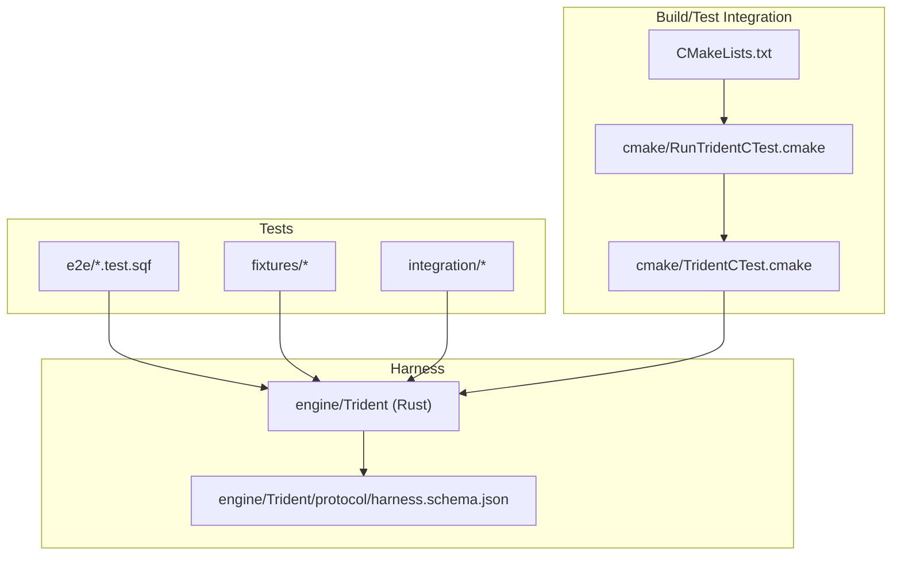
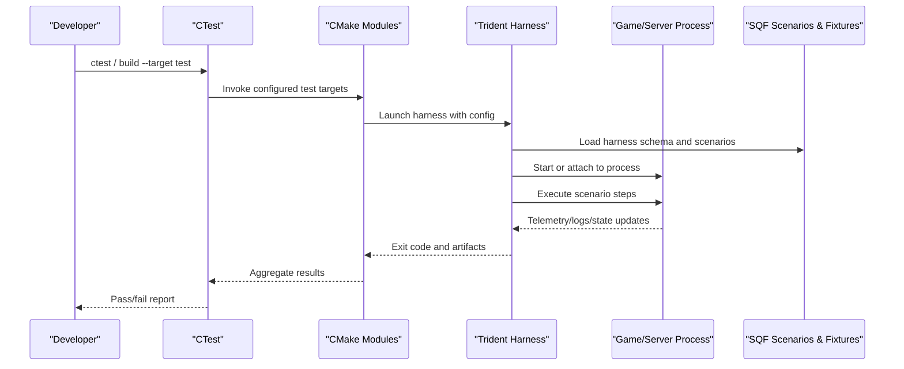
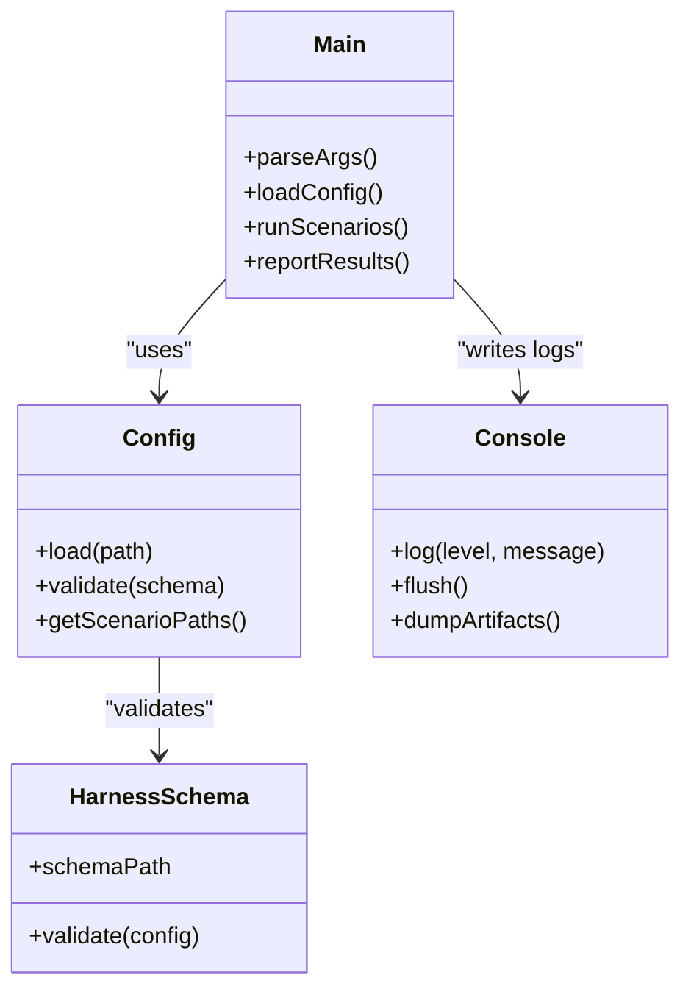
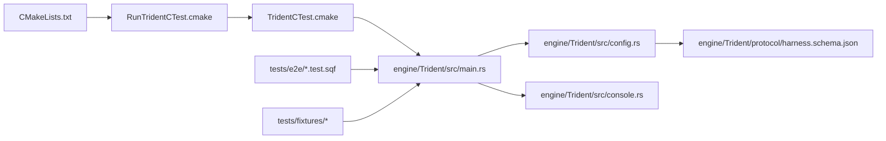

# Test Scenarios and Flows

<cite>
**Referenced Files in This Document**
- [README.md](file://tests/README.md)
- [master_server_browser_visibility.test.sqf](file://tests/e2e/master_server_browser_visibility.test.sqf)
- [Trident main.rs](file://engine/Trident/src/main.rs)
- [Trident config.rs](file://engine/Trident/src/config.rs)
- [Trident console.rs](file://engine/Trident/src/console.rs)
- [Trident harness.schema.json](file://engine/Trident/protocol/harness.schema.json)
- [CMakeLists.txt](file://CMakeLists.txt)
- [RunTridentCTest.cmake](file://cmake/RunTridentCTest.cmake)
- [TridentCTest.cmake](file://cmake/TridentCTest.cmake)
</cite>

## Table of Contents
1. [Introduction](#introduction)
2. [Project Structure](#project-structure)
3. [Core Components](#core-components)
4. [Architecture Overview](#architecture-overview)
5. [Detailed Component Analysis](#detailed-component-analysis)
6. [Dependency Analysis](#dependency-analysis)
7. [Performance Considerations](#performance-considerations)
8. [Troubleshooting Guide](#troubleshooting-guide)
9. [Conclusion](#conclusion)
10. [Appendices](#appendices)

## Introduction
This document explains how SQF-based test scenarios are structured, organized, and executed within the CWR-CE integration testing framework. It focuses on the Trident harness that orchestrates campaigns, demo scenarios, profile selection validation, and remount testing patterns. You will learn how to create maintainable test scenarios, manage state across phases, implement conditional logic, coordinate multi-step workflows, handle asynchronous operations, and debug complex flows.

## Project Structure
The testing system spans multiple layers:
- Test assets and scripts under tests/, including e2e SQF scenarios and integration fixtures.
- The Trident harness (Rust) that drives scenario execution and reporting.
- CMake integration for running Trident tests as part of the build/test pipeline.

**Diagram sources**
- [README.md](file://tests/README.md)
- [master_server_browser_visibility.test.sqf](file://tests/e2e/master_server_browser_visibility.test.sqf)
- [Trident main.rs](file://engine/Trident/src/main.rs)
- [Trident config.rs](file://engine/Trident/src/config.rs)
- [Trident console.rs](file://engine/Trident/src/console.rs)
- [Trident harness.schema.json](file://engine/Trident/protocol/harness.schema.json)
- [CMakeLists.txt](file://CMakeLists.txt)
- [RunTridentCTest.cmake](file://cmake/RunTridentCTest.cmake)
- [TridentCTest.cmake](file://cmake/TridentCTest.cmake)

**Section sources**
- [README.md](file://tests/README.md)
- [CMakeLists.txt](file://CMakeLists.txt)
- [RunTridentCTest.cmake](file://cmake/RunTridentCTest.cmake)
- [TridentCTest.cmake](file://cmake/TridentCTest.cmake)

## Core Components
- Trident harness: Rust-based orchestrator that loads configuration, discovers scenarios, runs them against the game/server, and reports results.
- Harness schema: JSON schema defining the structure of harness configuration files used by Trident.
- SQF test scenarios: .sqf files under tests/e2e and other folders that encode campaign flows, UI interactions, and assertions.
- CMake test integration: CMake modules that register Trident-driven tests with CTest and control execution.

Key responsibilities:
- Configuration parsing and validation via the harness schema.
- Scenario discovery and lifecycle management.
- State synchronization between test phases and external processes.
- Reporting and diagnostics output.

**Section sources**
- [Trident main.rs](file://engine/Trident/src/main.rs)
- [Trident config.rs](file://engine/Trident/src/config.rs)
- [Trident console.rs](file://engine/Trident/src/console.rs)
- [Trident harness.schema.json](file://engine/Trident/protocol/harness.schema.json)

## Architecture Overview
The Trident harness coordinates the end-to-end flow from configuration to scenario execution and result reporting. It integrates with CMake/CTest to run tests as part of CI or local builds.

**Diagram sources**
- [Trident main.rs](file://engine/Trident/src/main.rs)
- [Trident config.rs](file://engine/Trident/src/config.rs)
- [Trident console.rs](file://engine/Trident/src/console.rs)
- [Trident harness.schema.json](file://engine/Trident/protocol/harness.schema.json)
- [RunTridentCTest.cmake](file://cmake/RunTridentCTest.cmake)
- [TridentCTest.cmake](file://cmake/TridentCTest.cmake)

## Detailed Component Analysis

### Trident Harness Orchestration
Trident is the central orchestrator. It parses configuration, validates it against the harness schema, discovers scenarios, and manages their execution lifecycle. It communicates with the game/server process and collects telemetry for assertions.

**Diagram sources**
- [Trident main.rs](file://engine/Trident/src/main.rs)
- [Trident config.rs](file://engine/Trident/src/config.rs)
- [Trident console.rs](file://engine/Trident/src/console.rs)
- [Trident harness.schema.json](file://engine/Trident/protocol/harness.schema.json)

**Section sources**
- [Trident main.rs](file://engine/Trident/src/main.rs)
- [Trident config.rs](file://engine/Trident/src/config.rs)
- [Trident console.rs](file://engine/Trident/src/console.rs)
- [Trident harness.schema.json](file://engine/Trident/protocol/harness.schema.json)

### SQF Test Scenario Structure
SQF scenarios define the steps of a test, including setup, actions, and assertions. They can be placed under tests/e2e for end-to-end flows and referenced by the harness configuration.

Typical elements:
- Initialization and environment setup
- Conditional branches based on runtime state
- Multi-step workflows with waits and retries
- Assertions and error signaling
- Cleanup and artifact generation

Example reference:
- [master_server_browser_visibility.test.sqf](file://tests/e2e/master_server_browser_visibility.test.sqf)

Best practices:
- Keep scenarios focused and idempotent
- Use clear naming conventions for steps and variables
- Centralize shared helpers in fixtures where possible
- Log meaningful context around assertions

**Section sources**
- [master_server_browser_visibility.test.sqf](file://tests/e2e/master_server_browser_visibility.test.sqf)

### Campaign Flow Testing Approach
Campaign flows are modeled as sequences of steps that simulate user journeys through menus, missions, and gameplay states. The harness executes these steps deterministically while allowing for asynchronous events from the game.

Recommended pattern:
- Define phases: init, navigate, interact, validate, cleanup
- Use explicit waits for asynchronous operations
- Capture state snapshots at key checkpoints
- Assert on stable conditions rather than timing-sensitive ones

State management tips:
- Persist phase state to temporary files or engine globals
- Reset state between runs to ensure repeatability
- Use deterministic seeds for randomized content when needed

**Section sources**
- [Trident main.rs](file://engine/Trident/src/main.rs)
- [Trident config.rs](file://engine/Trident/src/config.rs)

### Demo Scenario Execution
Demo scenarios exercise core features without full campaign complexity. They are ideal for quick validation of UI flows, input handling, and basic gameplay mechanics.

Execution model:
- Configure a minimal harness entry pointing to demo scenario files
- Run with verbose logging to capture UI interactions
- Validate expected transitions and outputs

Debugging tips:
- Enable detailed UI event logging
- Record screenshots or video clips for visual verification
- Isolate failures by reducing scenario scope

**Section sources**
- [Trident main.rs](file://engine/Trident/src/main.rs)
- [Trident console.rs](file://engine/Trident/src/console.rs)

### Profile Selection Validation
Profile selection ensures that user profiles are correctly loaded, validated, and applied. Tests should verify:
- Profile existence and integrity
- Correct application of settings
- Fallback behavior for missing or invalid profiles

Validation approach:
- Create known-good and known-bad profiles in fixtures
- Assert expected outcomes for each case
- Check persistence of selected profile across sessions

**Section sources**
- [Trident config.rs](file://engine/Trident/src/config.rs)
- [Trident harness.schema.json](file://engine/Trident/protocol/harness.schema.json)

### Remount Testing Patterns
Remount testing covers scenarios where assets or configurations are reloaded dynamically. Tests should verify:
- Successful reload without crashes
- Consistency of state after remount
- Proper cleanup of old resources

Patterns:
- Trigger remount via commands or UI actions
- Wait for completion signals
- Re-run critical assertions post-remount

**Section sources**
- [Trident main.rs](file://engine/Trident/src/main.rs)
- [Trident console.rs](file://engine/Trident/src/console.rs)

### Creating a Test Scenario
Steps to create a new SQF-based test scenario:
1. Add a new .sqf file under tests/e2e or an appropriate subfolder.
2. Define initialization, step sequence, and assertions.
3. Reference the scenario in the harness configuration.
4. Run via CTest or directly with Trident.

Guidelines:
- Keep scenarios modular and reusable
- Use descriptive variable names and comments
- Handle errors gracefully and log context

**Section sources**
- [master_server_browser_visibility.test.sqf](file://tests/e2e/master_server_browser_visibility.test.sqf)
- [Trident harness.schema.json](file://engine/Trident/protocol/harness.schema.json)

### Managing State Between Test Phases
To maintain consistency across phases:
- Use global variables or persistent storage for cross-phase data
- Serialize state to files when necessary
- Ensure state is reset before each run

Asynchronous coordination:
- Implement polling or event-driven callbacks
- Use timeouts and retries for robustness
- Log intermediate states for debugging

**Section sources**
- [Trident main.rs](file://engine/Trident/src/main.rs)
- [Trident console.rs](file://engine/Trident/src/console.rs)

### Conditional Logic Handling
Implement conditionals in SQF scenarios to branch based on runtime state:
- Check feature flags or environment variables
- Validate prerequisites before proceeding
- Provide fallback paths for unsupported configurations

Error handling strategies:
- Catch exceptions and log details
- Fail fast with clear error messages
- Continue non-critical flows when safe

**Section sources**
- [Trident config.rs](file://engine/Trident/src/config.rs)
- [Trident harness.schema.json](file://engine/Trident/protocol/harness.schema.json)

### Coordinating Multi-Step Workflows
For complex workflows:
- Break down into small, testable steps
- Use explicit synchronization points
- Validate intermediate states

Asynchronous operations:
- Use background tasks with completion callbacks
- Monitor progress and handle failures
- Aggregate results at the end

**Section sources**
- [Trident main.rs](file://engine/Trident/src/main.rs)
- [Trident console.rs](file://engine/Trident/src/console.rs)

### Managing Test Dependencies
Dependencies include:
- External services (servers, databases)
- Asset packs and mods
- Environment variables and configuration files

Management techniques:
- Declare dependencies in harness configuration
- Provision dependencies before test execution
- Clean up dependencies after tests

**Section sources**
- [Trident config.rs](file://engine/Trident/src/config.rs)
- [Trident harness.schema.json](file://engine/Trident/protocol/harness.schema.json)

## Dependency Analysis
The testing system relies on several interconnected components:

**Diagram sources**
- [CMakeLists.txt](file://CMakeLists.txt)
- [RunTridentCTest.cmake](file://cmake/RunTridentCTest.cmake)
- [TridentCTest.cmake](file://cmake/TridentCTest.cmake)
- [Trident main.rs](file://engine/Trident/src/main.rs)
- [Trident config.rs](file://engine/Trident/src/config.rs)
- [Trident console.rs](file://engine/Trident/src/console.rs)
- [Trident harness.schema.json](file://engine/Trident/protocol/harness.schema.json)

**Section sources**
- [CMakeLists.txt](file://CMakeLists.txt)
- [RunTridentCTest.cmake](file://cmake/RunTridentCTest.cmake)
- [TridentCTest.cmake](file://cmake/TridentCTest.cmake)
- [Trident main.rs](file://engine/Trident/src/main.rs)
- [Trident config.rs](file://engine/Trident/src/config.rs)
- [Trident console.rs](file://engine/Trident/src/console.rs)
- [Trident harness.schema.json](file://engine/Trident/protocol/harness.schema.json)

## Performance Considerations
- Minimize I/O operations during scenario execution
- Use efficient data structures for state management
- Avoid unnecessary logging in hot paths
- Parallelize independent test suites where possible
- Profile resource usage to identify bottlenecks

[No sources needed since this section provides general guidance]

## Troubleshooting Guide
Common issues and resolutions:
- Scenario not found: Verify path references in harness configuration
- Asynchronous timeouts: Increase wait times or adjust polling intervals
- Profile loading errors: Validate profile integrity and permissions
- Remount failures: Check asset availability and cleanup procedures

Debugging techniques:
- Enable verbose logging in Trident console
- Inspect generated artifacts and logs
- Isolate failing steps by commenting out sections
- Use deterministic seeds for reproducibility

**Section sources**
- [Trident console.rs](file://engine/Trident/src/console.rs)
- [Trident config.rs](file://engine/Trident/src/config.rs)

## Conclusion
The CWR-CE integration testing framework leverages Trident to orchestrate SQF-based scenarios effectively. By following the patterns and best practices outlined here, you can create robust, maintainable tests that cover campaign flows, demo scenarios, profile validation, and remount operations. Proper state management, error handling, and debugging strategies ensure reliable test execution and easy maintenance.

[No sources needed since this section summarizes without analyzing specific files]

## Appendices
- Example scenario reference: [master_server_browser_visibility.test.sqf](file://tests/e2e/master_server_browser_visibility.test.sqf)
- Harness schema definition: [harness.schema.json](file://engine/Trident/protocol/harness.schema.json)
- CMake integration modules: [RunTridentCTest.cmake](file://cmake/RunTridentCTest.cmake), [TridentCTest.cmake](file://cmake/TridentCTest.cmake)

[No sources needed since this section lists references without analysis]